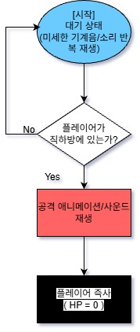
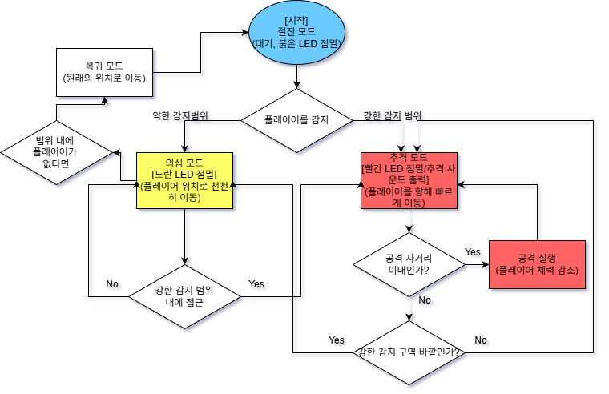
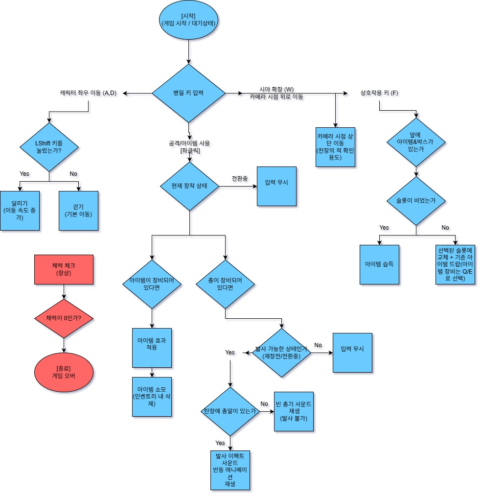
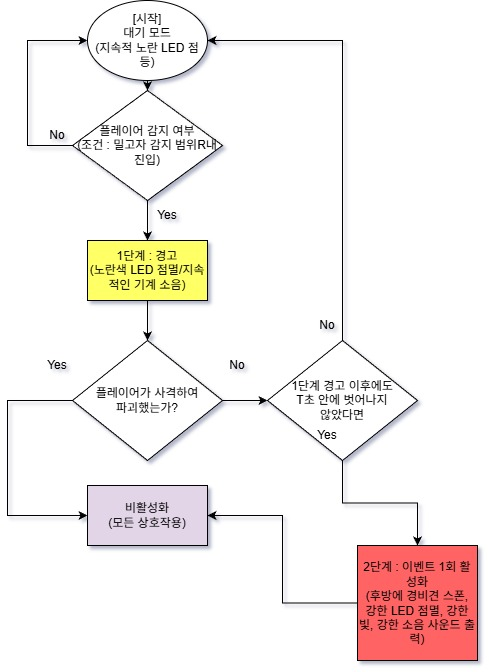
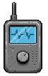
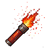

# 🎮 게임 세부 기획서 — Dark Dock

> **Team WAD | V2.1 | 작성자: 장수영 (기획/스토리 설계)**

| 항목 | 내용 |
| --- | --- |
| **작성 시작일** | 2026년 1월 22일 |
| **팀 구성원** | 강다영(팀장), 장수영, 김남해, 송예찬 |
| **버전** | V 2.1 |

---

## 📑 목차

1. **[게임 개요](#1-게임-개요)**
   - 1-1. 게임 진행
   - 1-2. 게임 목표
   - 1-3. 게임 시놉시스
2. **[게임 시스템](#2-게임-시스템)**
   - 2-1. 플레이어
   - 2-2. 적
   - 2-3. 객체별 플로우 차트
   - 2-4. UI / 아이템
3. **[게임 Scene 로드맵](#3-게임-scene-로드맵)**
4. **[기획서 변경 사항](#4-기획서-변경-사항)**

---

## 1. 게임 개요

### 1-1. 게임 진행

본 게임은 **어두컴컴한 기업의 공장**에서 펼쳐지는 **사이드 뷰(2.5D) 생존 호러 게임**입니다.

플레이어는 제한된 시야 속에서 **손전등(시각)**과 **소리(청각)**를 이용해 위협을 파악하고, 공장 내부를 통과해 무사히 탈출지점에 도달해야 합니다.

#### 핵심 플레이 요소

| 요소 | 설명 |
| --- | --- |
| 🌫️ **시야 제한** | 안개와 어둠으로 인해 멀리 있는 오브젝트/적의 형태가 잘 보이지 않는다. |
| 🔊 **정보 획득** | 적은 고유한 소리를 내며, 플레이어는 소리의 방향성(스테레오)을 통해 위치를 추정한다. |
| 🔦 **확인 수단** | 정확한 시각 확인은 손전등으로 수행한다. |
| 🎒 **자원/결정** | 2슬롯 인벤토리로 아이템을 운용하며, 언제 무엇을 들고 사용할지 선택이 중요하다. |

---

### 1-2. 게임 목표

| 구분 | 내용 |
| --- | --- |
| 🎯 **주요 목표** | 왼손에 쥔 '황금 골프채'를 놓치지 않고 끝까지 사수하여 탈출구의 드론 배송 박스에 싣는 것 |
| ✅ **승리 조건** | 골프채를 소지한 채로 1층 하역장 드론 박스에 탑승 |
| ❌ **패배 조건** | 적에게 공격당해 체력이 0이 된다 |

---

### 1-3. 게임 시놉시스

#### 🏭 배경: 인간 출입 금지 구역

모든 공정이 100% 자동화된 **'한빛 자동화 제1공장'**.

이곳의 AI 보안 시스템은 인간을 '비효율적인 오염원'으로 규정하고 즉시 제거합니다.

하지만 회사의 중요 자산이 내부에 남겨지는 사고가 발생하고, 회사는 이를 회수하기 위해 정규직이 아닌 **'일회용 계약직(플레이어)'**을 투입합니다.

#### 🏌️ 목표: 1급 자산의 정체

플레이어는 칠흑 같은 어둠과 유독성 가스를 뚫고 최상층 회장실에 도달합니다.
목숨을 걸고 확보한 회사의 '1급 자산'은, 다름 아닌 회장님의 **'황금 골프채'**였습니다.

회장실로 들어선 순간, 모든 경비시스템이 발동하게 됩니다.

> 허무함도 잠시, 플레이어는 이 길쭉한 골프채를 반드시 챙겨서 탈출해야만 합니다.

#### ⚔️ 위기: 소리 없는 사투

왼손에 쥔 골프채 때문에 플레이어는 자유롭게 뛸 수도, 숨을 수도 없습니다.

- 조금이라도 경계를 소홀히 하면 천장의 **'파리지옥'**이 떨어진다
- 무심코 소리를 내면 안개 속의 **'경비견'**들이 달려든다

플레이어는 오직 **권총 한 자루**와 제한된 주머니(2슬롯)에 의지해, 끔찍한 기계들의 포위망을 뚫고 1층 하역장으로 향합니다.

#### 💸 결말: 마이너스 정산

사투 끝에 드론 배송 박스에 몸을 실어 탈출에 성공하는 플레이어.

하지만 돌아오는 건 따뜻한 위로가 아닌 차가운 **'정산 명세서'**뿐입니다.

> 임무 수당보다 장비 파손 공제액이 더 커져버린 '마이너스 통장'을 보여주며, 게임은 씁쓸한 **블랙 코미디**로 막을 내립니다.

---

## 2. 게임 시스템

### 2-1. 플레이어

플레이어는 '황금 골프채'를 강제로 소지하고 있어 행동에 제약이 따름.

#### 조작 및 규칙

| 조작 | 입력 | 설명 |
| --- | --- | --- |
| **이동** | `A` / `D` | 좌우 이동. `A`또는`D` + `Shift`로 달리기 가능 |
| **상단 시야 확장** | `W` (유지) | 고개가 약 45도 상단으로 젖혀지며, 카메라가 위로 이동. 천장의 '파리지옥' 식별 가능. 단, 바닥 시야가 차단되어 '경비견' 확인 어려움 |
| **공격** | 마우스 좌클릭 | 총알 발사 |
| **아이템 사용** | 마우스 좌클릭 | `Q`/`E`로 아이템 선택 후 사용 |
| **상호작용** | `F` | 드롭된 아이템 습득 / 아이템박스 수색 |
| **아이템 교체** | `Q` (1번 슬롯) / `E` (2번 슬롯) | 다시 누르면 장착 해제. 장착 시 총 스프라이트가 아이템 스프라이트로 교체됨 |

#### 플레이어 스탯

| 항목 | 내용 |
| --- | --- |
| **체력** | 초기 100. 공격당하면 일정량 감소, 0이 되면 사망 |
| **핸디캡** | 왼손에 골프채를 들고 있어 아이템 사용 시 총을 집어넣는 딜레이(무방비 상태) 발생 |
| **인벤토리** | 주머니 슬롯 단 **2칸**으로 제한 |

---

### 2-2. 적

적들은 **시각과 청각**(일정 범위 안에 플레이어가 접근하면)에 반응하여 플레이어를 추격.

#### 🐕 경비견

안개 속에 숨어있다가 플레이어를 감지하면 **천천히 접근**하고, 설정된 일정 거리까지 접근하면 **더욱 빠르게 돌진**하여 공격함.

#### 📹 밀고자 / CCTV

플레이어를 범위 내에 감지하면 **단계별로 경고**:

| 단계 | 행동 |
| --- | --- |
| **1단계** | 미세한 소음만 발생하며 자신의 존재를 플레이어에게 인식시킴 |
| **2단계** | 일정 시간이 지나도록 처치하지 못하면 큰 소음으로 플레이어를 놀래키고, **후방에 경비견 소환** 이벤트 1회 발생 후 비활성화 |

#### 🌿 파리지옥

천장에 매달려 있으며, 플레이어가 바로 아래(Trigger)를 지나갈 경우 **즉사 공격**을 가함.

> 파리지옥의 존재감(고유음, 미세한 이펙트)을 확인 후 `W`키를 이용한 상단 시야 확보로 대처

---

### 2-3. 객체별 플로우 차트

#### 파리지옥 / CCTV

#### 경비견

#### 플레이어

#### 밀고자 / CCTV

---

### 2-4. UI / 아이템

#### UI 원칙

- 소리 방향을 직접 가리키는 별도의 UI는 존재하지 않음
- 플레이어는 소리의 좌/우 방향성과 손전등으로 정보를 해석
- 아이템 교체 시 기존 아이템 드랍이 명확하게 인지되도록 드랍 연출 및 사운드 제공
- 공포 게임 특유의 분위기를 만들기 위해 **최소한의 UI만 제공**

#### 🎒 아이템 슬롯

**UI 구성:**
- 하단에 아이템 슬롯 **2칸** 이미지를 배치
- 왜 2칸인가? → 불편함이 아니라 **전략적 선택을 재미로 느껴지게** 만드는 것

**UX 상호작용 규칙:**
- **습득 규칙:** 슬롯이 비어있다면 아이템과 상호작용 시 습득 (1번 → 2번 순서)
- **교체 규칙:** 슬롯이 꽉 찼을 때 아이템을 습득하면, 선택된 슬롯에 새 아이템이 들어오고 기존 아이템은 바닥에 드랍
- **피드백:** 습득 시 슬롯 이미지가 살짝 밝아졌다가 되돌아오는 효과 / 바닥에 떨어지는 연출 + 사운드

#### 🔄 상호작용 가이드

**UI 구성:**
- 상호작용 가능한 오브젝트(아이템, 아이템 박스) 위에 `F` 버튼 아이콘 플로팅
- 지나가기만 해도 출력하여 시인성 확보

**UX 상호작용 규칙:**
- **노출 조건:** 플레이어와 오브젝트 거리가 **1.5m 이내**(Collider 범위) 진입 시 활성화
- **피드백:** 상호작용 가능 거리일 때 아이콘이 최상단 레이어로 플로팅
- **소멸:** 거리가 멀어지거나(Collider 범위 바깥) 상호작용 완료 시 즉시 사라짐

#### 📢 아이템: 소음 미끼

| 항목 | 내용 |
| --- | --- |
| **선택** | `Q`(1번) 또는 `E`(2번)로 슬롯 선택 → 사용 준비 활성화 |
| **사용** | 좌클릭으로 포물선 투척. 착탄 지점에서 **지속적인 기계음(소음)** 발생 |
| **적 AI 반응** | 지정된 반경 이내의 모든 경비견이 착탄 지점으로 이동 |
| **시각 효과** | 착탄 지점에 **소리 파동 이펙트**가 일정 시간 발생 후 소멸 |

#### 🔴 아이템: 조명탄

| 항목 | 내용 |
| --- | --- |
| **선택** | `Q`(1번) 또는 `E`(2번)로 슬롯 선택 → 사용 준비 활성화 |
| **사용** | 좌클릭으로 포물선 투척. 착탄 지점에서 일정 시간 동안 **밝은 붉은 빛** 생성 |
| **특이사항** | 적 오브젝트와의 상호작용 없음 (시야 확보 전용) |

#### ⚡ 아이템: 에너지드링크

| 항목 | 내용 |
| --- | --- |
| **선택** | `Q`(1번) 또는 `E`(2번)로 슬롯 선택 → 사용 준비 활성화 |
| **사용** | 좌클릭 시 약 1초간의 딜레이 후 효과 발동 |
| **효과** | 플레이어의 **최대 체력 1/4 회복** |

#### 🔫 잔여 탄창 UI

**UI 구성:**
- 화면 좌측 하단에 상시 표시. 총알 개수를 시각적으로 표현 (예: `8/60`)

**UX 상호작용 규칙:**
- **갱신 타이밍:** 발사 시 즉시 탄약 1 감소 / 재장전 완료 시 최대치로 갱신 / 보유 최대 탄약 수도 감소
- **탄약 부족 알림:** 잔여 탄약이 0일 때 발사 시도 시, '틱틱' 빈 총 소리 출력
- **상태 표현:** (선택 사항) `Reloading...` 텍스트 오버레이 출력

---

## 3. 게임 Scene 로드맵

### 🎬 Scene 1. 도입: 회장실

| 구분 | 내용 |
| --- | --- |
| **화면** | ① 깨진 방탄유리와 붉은 비상등만 돌아가는 어두운 회장실 |
| | ② 사이드 뷰 시점의 주인공 왼손에는 번쩍이는 '황금 골프채' |
| | ③ 화면 중앙 자막: *"목표 확보. 탈출하십시오."* |
| **BGM** | 긴박한 비상벨 소리 (웅웅거리는 저음) |
| **SFX** | 밖에서 들리는 기계들의 소음 |
| **Action** | 플레이어는 골프채를 버릴 수 없음을 깨닫고(상호작용 불가), 오른손의 권총을 확인하며 이동 시작 |

### 🌫️ Scene 2. 전개: 검은 안개와 잠입

| 구분 | 내용 |
| --- | --- |
| **화면** | ① 조명이 꺼진 공장 복도. 안개가 자욱함 |
| | ② 저 멀리 안개 속에서 붉은 LED(경비견)가 희미하게 깜빡임 |
| | ③ 플레이어는 벽에 붙어 천천히 이동함 |
| **BGM** | 무거운 정적 + 간헐적인 금속 마찰음 |
| **SFX** | 플레이어의 거친 숨소리, 울려퍼지는 걷는 소리 |
| **Action** | 소음을 내지 않기 위해 `Shift`를 떼고 걷거나, 소음 미끼를 던져 적을 유인 |

### 🚨 Scene 3. 위기: 밀고자와 추격

| 구분 | 내용 |
| --- | --- |
| **화면** | ① 어둠 속에서 CCTV(밀고자)의 렌즈가 **붉은색으로 격렬하게 점멸** |
| | ② 화면 전체가 하얗게 번쩍이는 **플래시 효과(Jump Scare)** |
| | ③ 뒤쪽 통로에서 경비견 떼가 스폰되어 달려오는 실루엣 |
| **SFX** | 귀를 찢는 듯한 고주파 경보음 (삐-익!) / 다급한 발소리와 추격음 |
| **Action** | 플레이어는 사격을 포기하고 전력 질주를 선택. 천장에서 파리지옥이 반응하여 낙하 |

### 🚁 Scene 4. 결말: 하역장 탈출

| 구분 | 내용 |
| --- | --- |
| **화면** | ① 열려있는 **드론 배송 박스**로 플레이어가 슬라이딩하며 진입 |
| | ② 드론이 공장 밖 상공으로 날아오르며, 멀어지는 공장의 전경 (묵직한 검은 연기) |
| | ③ 검은 화면으로 전환되며 **정산서 UI** 출력 |
| **BGM** | 웅장하지만 허무한 느낌의 오케스트라 |
| **Dialogue** | 관리자 — *"물건 확인. 입금 완료."* |
| **UI** | 허무맹랑한 근로계약서와 불공정 계약의 정산서 |

### 🔄 게임 Scene 루프 요약

> **안개 속 이동** → **소리로 위험 징후 감지** → **손전등으로 확인** → **달리기/총격/아이템 사용으로 돌파** → **2슬롯 아이템 운용으로 생존 확률 확보** → **탈출 지점 도달**

---

## 4. 기획서 변경 사항

| 날짜 | 변경 내용 | 비고 |
| --- | --- | --- |
| 2026.01.22 | 기획서 작성 시작 (V1.0) | 최초 작성 |
| 2026.01.22 | 플레이어 이동/행동 규칙 구체화 | 플로우 차트 추가 |
| 2026.01.22 | 적(경비견, 밀고자, 파리지옥) 시스템 설계 | AI 로직 수정 |
| 2026.01.23 | 경비견 플로우 차트 로직 수정 (V1.1) | AI 로직 수정 |
| 2026.01.29 | 회의 수정사항 반영 및 시스템 재설계, 아이템/플로우차트/컨셉 문서 수정, UI 기획서 병합, 프로젝트 명 **Dark Dock** 확정 | 문서 개편 |
