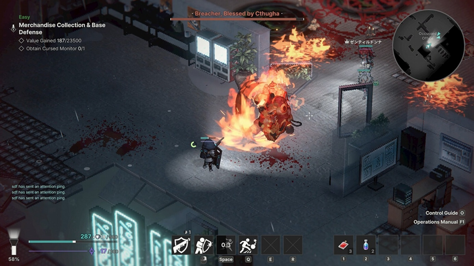
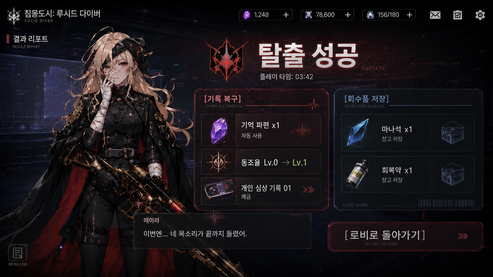
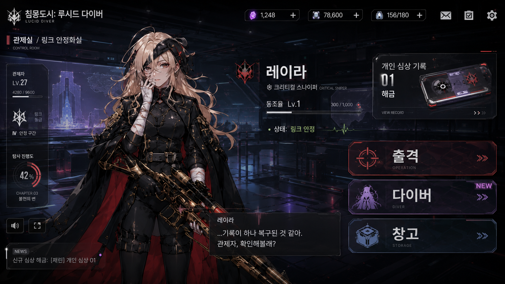
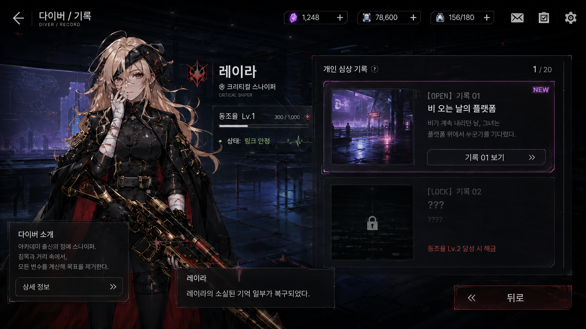
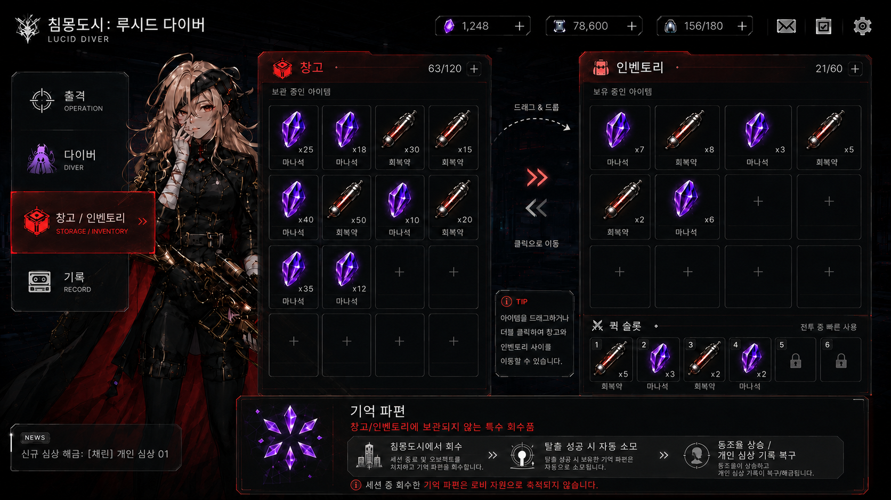
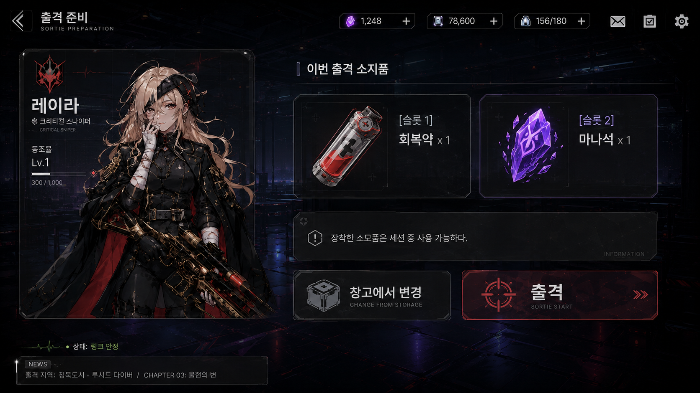
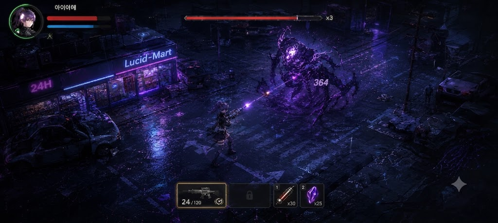
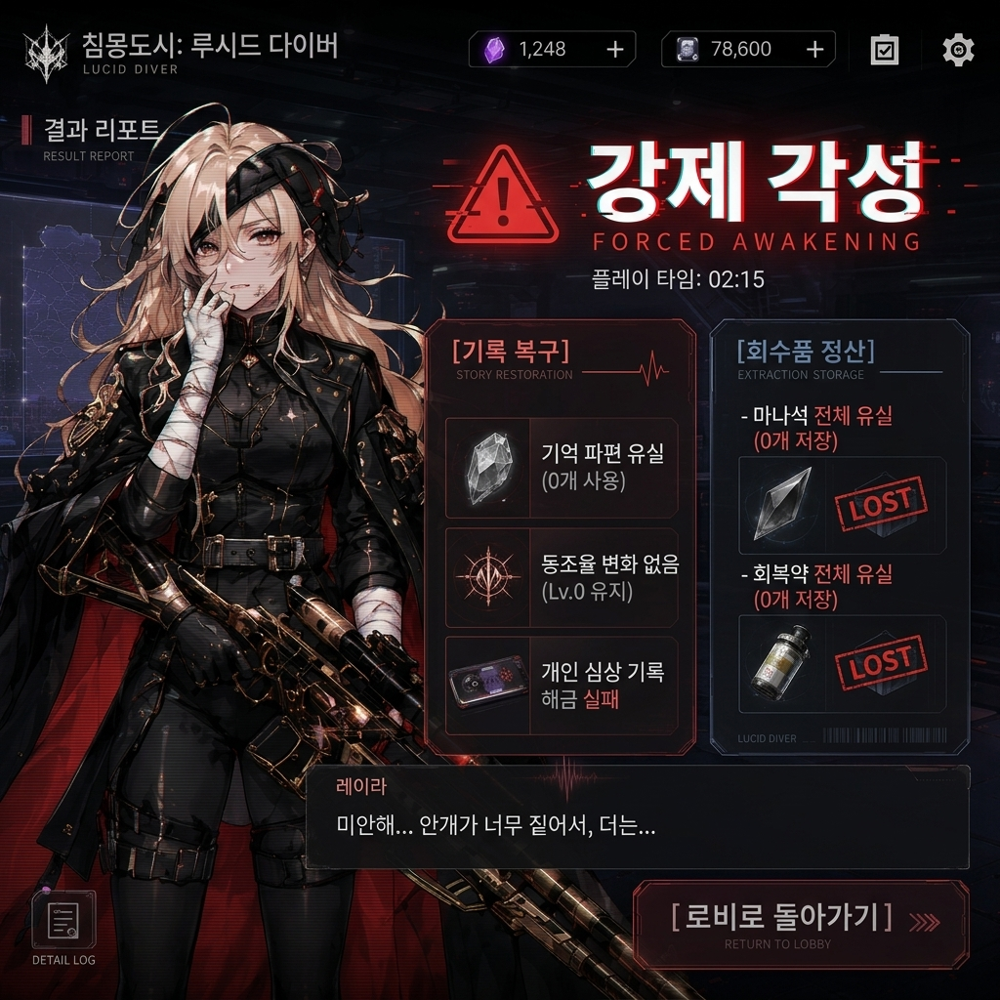

# 20260617_침몽도시 : 루시드 다이버_시스템 기획_P0_최종 프로토타입

**문서 버전 관리**

| 버전 | 등록 일자 | 작성 내역 |
| --- | --- | --- |
| 0.01 | 2026.06.12 | 문서 생성<br>최소 플레이 루프에 필요한 기본 시스템 기획 |
| 0.02 | 2026.06.12 | 기록 공간을 Word에서 Notion으로 이동<br>프로토타입 목표 명시<br>상호작용, 재장전, 적 행동 패턴 내용 추가<br>UI 예시 이미지 추가<br>데이터 정리 내용을 `데이터 인덱스` 문단으로 정리 |
| 0.03 | 2026.06.15 | 시작 위치 개수 가변화<br>각 탈출 포인트에 탈출 가능 조건 및 횟수 추가<br>탈출 포인트가 배치될 월드 테이블 추가<br>탈출 포인트의 탈출 조건과 연동되는 시작 포인트 테이블 추가 |
| 0.04 | 2026.06.15 | 기본 조작 시스템을 PC 마우스/키보드 조작으로 우선 개발<br>&nbsp; • 기본 모바일 대응 조작은 확장 명세(v1.xx)에 보존<br>아이템 시스템 수정<br>&nbsp; • 오브젝트 상호작용 시스템 내용 추가<br>&nbsp; • 기존 총알 소모 시스템을 플레이어 자원(마나)에 편입<br>&nbsp; • 총알 테이블을 무장 테이블에 통합<br>적 상태 머신을 사망과 추적이 통합된 단일 형태로 변경<br>몽막/심상핵 시스템 추가 |
| 0.05 | 2026.06.15 | 프로토타입 테스트맵 레벨디자인 내용 반영<br>&nbsp; • 아이템 상호작용을 Trigger 접촉 즉시 획득으로 우선 구현<br>&nbsp; &nbsp; &nbsp; ◦ 기존 ‘회수품’ 내용을 아이템 생성 탭에 병합<br>&nbsp; &nbsp; &nbsp; &nbsp; &nbsp; ‣ ”생성 및 상호작용”으로 탭 제목 수정<br>&nbsp; • 탈출 성공 판정을 ‘탈출 구역 Collider 접촉 직후 발동’으로 간소화<br>&nbsp; • 몽막 시스템 동작 구체화<br>&nbsp; • UI 간소화<br>테이블 체계 수정<br>&nbsp; • 테이블 변수명 수정<br>&nbsp; • 적 스폰 포인트 테이블 추가<br>&nbsp; • 기본 공격 메커니즘을 총알 오브젝트 기반에서 이벤트 범위 기반으로 변경<br>&nbsp; • 스킬 테이블 추가 |
| 1.00 | 2026.06.15 | 확장 명세 버전에 필요한 기획 사항 추가 정리<br>&nbsp; • 모바일 대응 조작<br>&nbsp; • 오브젝트 상호작용 시스템 내용 추가<br>&nbsp; • 탈출 조건 및 횟수<br>&nbsp; • 자원 시스템 통합(총알 + 스킬 + 허기 → 마나)<br>&nbsp; • 강제 각성 시 각성 보존 슬롯 외 인벤토리 아이템 전부 유실됨<br>&nbsp; • 무장 시스템<br>&nbsp; &nbsp; &nbsp; ◦ 근접 무장은 확장 명세에만<br>&nbsp; &nbsp; &nbsp; ◦ 기본 무장 제공<br>&nbsp; &nbsp; &nbsp; ◦ 월드에서 획득한 무장을 인벤토리에서 장착하는 시스템으로 변경<br>&nbsp; &nbsp; &nbsp; ◦ 총알 테이블을 무장 테이블에 통합<br>&nbsp; • 아이템 시스템 수정<br>&nbsp; &nbsp; &nbsp; ◦ 아이템 테이블에 무장 능력치 / 소모품 사용 효과를 TID로 연결<br>&nbsp; &nbsp; &nbsp; ◦ 소모품 테이블 추가<br>&nbsp; • 적 상태 머신을 사망과 추적이 통합된 단일 형태로 변경<br>&nbsp; • 몽막/심상핵 시스템 추가<br>&nbsp; • 플레이어 역할군 데이터 추가 |
| 1.01 | 2026.06.15 | 프로토타입 문서의 공통 기획 내용 변경 반영<br>&nbsp; • 아이템 생성 및 상호작용 문단 병합<br>&nbsp; • 몽막 시스템 동작 구체화<br>&nbsp; • 기본 공격 메커니즘을 총알 오브젝트 기반에서 이벤트 범위 기반으로 변경<br>&nbsp; • 스킬 테이블 추가<br>&nbsp; • 적 스폰 포인트 테이블 추가<br>&nbsp; • 시간 차감 가속 내용 추가<br>방어구 내용 및 테이블 추가 (초안)<br>&nbsp; • 방어력 공식 수정<br>심상 공명 태그 내용 및 테이블 추가 (초안) |
| 1.02 | 2026.06.15 | 6월 15일 오피스아워 스크럼 내용 반영<br>• 지원 캐릭터 테이블 설계 추가: 스킬 쿨타임, 투사 효과 ID, 스킬 계수 등을 담는 지원 캐릭터 전용 데이터 테이블 신설.<br>• 시간 가속 테이블 설계 추가: 레벨 디자인의 핵심인 마름모 구역별 시간 가속 배율을 시스템 기획서 내 `World` 및 `Zone` 테이블 변수로 설계 반영.<br>추가 수정<br>• 메인 캐릭터 테이블 데이터 추가: 캐릭터 이름 / 아이콘 / 모델링 / 스킬 ID |
| 1.03 | 2026.06.16 | 시스템 명세 추가<br>&nbsp; • 시간 제한 시스템 내용 추가<br>&nbsp; • 멀티플레이 상호작용(빈사 상태 소생) 추가<br>데이터 구조 수정<br>&nbsp; • 피해 계산 및 마나 계산 수치를 int에서 float로 변경<br>인벤토리 기획 추가<br>&nbsp; • 아이템 상호작용 시 인벤토리 용량 부족 예외처리 추가<br>&nbsp; • 인벤토리 진입 버튼 및 인벤토리 리스트 UI 설정<br>&nbsp; • 인벤토리 동작 (리스트 아이템 출력) 설정<br>&nbsp; • 동일 아이템 중복 보유 시 처리 설정<br>&nbsp; • 인벤토리 리스트에서 소비 기물 아이템을 퀵슬롯에 장착<br>&nbsp; • 아이템 사이즈(가로 × 세로)는 확장 명세 사양으로 이전<br>&nbsp; • 아이템 가치 (구매 / 판매)<br>&nbsp; • 인벤토리 UI (진입 버튼 / 인벤토리 리스트 / 아이템 정보 창 / 소비 기물 퀵 슬롯 / 보관함)<br>&nbsp; • 인벤토리 동작 (인벤토리 배치 / 동일 아이템 중첩 / 무장,방어구 장착 / 보관함 이동 / 강제 각성 시 유실)<br>프로토타입 구현 내용과 확장 명세 내용을 단일 기획 문서에 통합<br>&nbsp; • 프로토타입에서 구현되지 않는 내용을 `프로토타입 제외`  배너로 구분하는 것으로 정책 설정 |
| 1.04 | 2026.06.16 | 지원 캐릭터 내용 추가<br>UI 예시 이미지 업데이트<br>&nbsp; • 월드 신 / 인벤토리 팝업 / 결과 팝업<br>데이터 인덱스에 프로토타입 예시 테이블 추가 |
| 1.05 | 2026.06.17 | 프로토타입 개발 목표에서 제외되는 `[프로토타입 제외]` 색인 배너 위치 이동<br>&nbsp; • 문단 내 기능 전체가 제외되는 경우 해당 기능 문단의 제목 앞에<br>&nbsp; • 문단 내 기능 일부가 제외되는 경우 제외되는 문장 앞에<br>&nbsp; &nbsp; &nbsp; ◦ 하위 문장 내용 전체가 제외되는 경우 추가 표시 없음<br>&nbsp; &nbsp; &nbsp; ◦ 하위 문장 내용 일부가 프로토타입에 구현되는 경우 해당 문장을 **프로토타입 볼드**로 표기하여 구분<br>프로토타입 개발 방향성 명시: 로비를 포함한 서브컬처 플레이 전체 루프 검증<br>전체 루프 검증 목표에 따라 기획 내용 추가<br>&nbsp; • 프로토타입 목표에 서브컬처 검증 목표 추가<br>&nbsp; • 호감도 시스템 추가<br>&nbsp; • 탈출 결과 창 UI 기능 구체화<br>&nbsp; • 기억 파편 아이템 기획 추가<br>컨셉 기획 정합성 수정<br>&nbsp; • 무장 명칭 수정: 기관단총(SMG) → 돌격소총(AR), 로켓 런처(RL) → 유탄 소총(GR) |
| P0_0.01 | 2026.06.17 | 프로듀서 피드백 반영<br>&nbsp; • 구현을 위한 상세 데이터 테이블 (각 데이터 인덱스 하단)에 프로토타입 데이터 내용 추가<br>P0 정의서 내용을 반영하여 기획 내용 확정<br>&nbsp; • 테스트용 기억 파편 아이템 명칭 명명<br>&nbsp; • 메인 캐릭터 명칭을 ‘다이버’로 변경<br>&nbsp; • 호감도 명칭을 ‘동조율’로 변경<br>&nbsp; • 동조율에 따른 기획 추가<br>&nbsp; &nbsp; &nbsp; ◦ 개인 심상 기록 (호감도 스토리) 해금 이펙트 출력<br>&nbsp; &nbsp; &nbsp; ◦ 다이버 대사 변화 기능<br>&nbsp; • 로비/관제실 신 기획 추가<br>&nbsp; &nbsp; &nbsp; ◦ 다이버 스탠딩 이미지 출력<br>&nbsp; • 다이버/기록 메뉴 기획 추가<br>&nbsp; • 창고 메뉴 기획 추가<br>&nbsp; &nbsp; &nbsp; ◦ 창고 ↔ 인벤토리 슬롯 조작 기능 추가<br>&nbsp; &nbsp; &nbsp; &nbsp; &nbsp; ‣ 장비 장착<br>&nbsp; &nbsp; &nbsp; &nbsp; &nbsp; ‣ 소비 기물 장착(슬롯 2개)<br>&nbsp; • 소비 기물 효과에 HP 회복 추가<br>P0 정의서에 포함되지 않는 이하 내용은 P0 버전 문서에서 제외(이미 기획된 내용은 1.05 버전에 보존)<br>&nbsp; • 다이버 영입 / 가챠 / 교체<br>&nbsp; • 지원 캐릭터 편성 / 호출<br>&nbsp; • 호감도 선물 / 다단계 성장<br>&nbsp; • 스킨 / 코스튬<br>&nbsp; • 상점 / 공방<br>&nbsp; • 아이템 판매 / 분해<br>&nbsp; • 방어구 / 정신 방벽<br>&nbsp; • 인벤토리 그리드 / 드래그<br>&nbsp; • 장비 강화<br>&nbsp; • 보스전 / 침식 위상 변화<br>&nbsp; • 멀티플레이 (대기방 / 소생)<br>&nbsp; • 세션 시간 제한 / 가속<br>&nbsp; • 연출 (Live2D 컷인 / 풀 보이스)<br>P0.5 선택 구현 내용은 별도 표기<br>&nbsp; • 개인 심상 기록 해금 효과<br>&nbsp; • 로비 메뉴 알림 레드닷<br>&nbsp; • 결과 창 출력 시 순차 등장 애니메이션<br>&nbsp; • 대사 성격에 따른 캐릭터 표정 변화<br>&nbsp; • 소비 기물 사용 시 모션 및 쿨타임 HUD<br>&nbsp; • 결과 창 UI RETRY 버튼<br>&nbsp; • 탈출 실패 시 힌트 시나리오 텍스트<br>&nbsp; • 무장 잔탄 보충 소비 기물<br>&nbsp; • 월드 내 일회성 특수 무장<br>&nbsp; • 아이템 사용 및 쿨타임 이펙트<br>&nbsp; • 창고에서 소비 기물 슬롯으로 드래그하여 장착 |
| P0_0.02 | 2026.06.18 | CP 및 TD 피드백 반영<br>&nbsp; • enum 타입별 변수명 지정: 동일 enum 타입 사용 시 통합 적용<br>&nbsp; &nbsp; &nbsp; ◦ [8.0. enum 타입 정의] 문단에 정리됨<br>P0 필수 구현 내용 중 누락 사항 완성<br>&nbsp; • “커서 방향으로 조준 → 클릭 입력으로 공격 실행”으로 변경<br>&nbsp; • 다이버 스탠딩 이미지 출력 기능 및 데이터 인덱스 추가<br>&nbsp; • 로비 허브 UI에 다이버 동조율 단계 출력 기능 추가<br>&nbsp; • 개별 심상 기록 NEW 레드닷 비활성화 처리 추가<br>&nbsp; • 개별 심상 기록 시나리오 텍스트 데이터 테이블 추가<br>&nbsp; • 상황별 출력 대사 데이터 타입 추가<br>P0 정의서 및 기획서 내에서 정합성 검증 사항 수정<br>&nbsp; • 월드 신 명칭을 ‘인게임 세션’으로 변경<br>&nbsp; • P0 변수표 내 변수명 적용 |
| P0_0.03 | 2026.06.19 | SSOT 최종 기준 문서와의 정합성 및 P0 개발 기준에 따라 시스템 기획서 내용 수정<br>&nbsp; • livingState '빈사' 상태 제거<br>&nbsp; • 지원 캐릭터 내용 제거<br>&nbsp; • 탈출 판정 처리 중 채널링 시간 서술 제거<br>&nbsp; • extractionResult 내부 변수의 enum 타입 스트링 명시<br>&nbsp; • 인게임 세션 UI에 기억 파편 카운터 / 말풍선 출력 내용 추가<br>&nbsp; • 인게임 세션 데이터 테이블에서 timeLimit 데이터 제거 |
| P0_0.04 | 2026.06.19 | 확장 명세에서만 사용되는 몽막 / 심상핵 언급 제거<br>&nbsp; • P0 프로토타입에서는 "1.체력 감소 → 2.사망 여부 판정"으로 간소화된 판정만 실행함.<br>1.6. 대사 출력 시스템 문단을 추가하여 상황별 대사 출력 규칙을 명시<br>&nbsp;&nbsp; • 동일 조건 대사를 '대사 배열'에 등록해 무작위 출력하는 기능 추가 |
| P0_0.05 | 2026.06.19 | P0 명세서에서 '각성 보존 슬롯' 언급 완전 제거<br>적 사망 시 rootGroup 내에서 정해진 전리품이 무작위로 드랍되는 기능 추가<br>enemyKillCount 변수를 결과 창 UI에 추가 |

# 0. 프로토타입 목표

- 서브컬처 캐릭터 애착 루프: 이하의 최소 루프가 구현 가능한지 검증한다.
    - 기억 파편 획득 → 탈출 성공 → 기억 파편 자동 사용 → 동조율 상승 → 개인 심상 기록 01 해금 → 로비 복귀 후 다이버/기록 메뉴에서 선택 감상 → 귀환 대사 변화
- PvE 익스트랙션 루프: 이하의 플레이 루프가 구현 가능한지 검증한다
    - 기묘한 사탕/변질된 붕대 획득 → 탈출 성공 → 창고 저장 → 다음 출격 소지품 슬롯에 장착 → 다음 세션에서 사용 가능
- 종합하여 이하의 전체 플레이 진행 단계 및 화면 전환 플로우가 구현 가능한지 검증한다.
    - 로비 → 출격 준비 → 침몽도시 세션 진입 → 이동/조준/공격 → 적과 조우 → 기억 파편,기묘한 사탕,변질된 붕대 획득 → 전화부스 탈출 시도 → 탈출 성공OR강제 각성 → 결과창 정산 → 로비 복귀 → 다이버 메뉴에서 심상 기록 확인 → 창고에서 회수품 확인 및 다음 출격 준비

# 1. 다이버 (메인 캐릭터)

## 1.1. 오브젝트 구성

- 다이버 캐릭터 오브젝트는 이하의 하위 오브젝트로 구성된다.
    - 위치 기준점 (Transform): 다이버의 위치 및 방향(Y 위, Z 정면) 정보를 계산하는 기준점.
    - 몸통 (Collider): 다이버↔적, 다이버↔장애물 간의 접촉 상호작용 발동 여부를 판정하는 기준 영역.
        - 장애물 판정을 위해 Trigger 설정을 비활성화한다.
    - 상호작용 구역 (Collider): 다이버↔상호작용 가능 오브젝트(무장, 회수품) 간의 상호작용 UI 출력 여부를 판정하는 기준 영역.
        - Trigger 설정을 활성화하여 사용한다.
    - 손 (Transform): 무장 아이템 장착 시 무장 오브젝트가 배치되는 위치 기준점.
        - 공격 방향(vector3): 위치 기준점을 시작점, 손을 끝점으로 하는 방향 벡터.
            - 높이(Unity 좌표계의 Y축) 값을 0으로 초기화한 후 길이 Normalize를 적용하여 사용한다.

## 1.2. 다이버 상태

- 다이버 캐릭터는 이하의 상태 값을 갖는다.
    - 생존 상태(`livingState` : enum): 다이버 캐릭터 상태를 확인
        - idle `기본`
        - gameover `강제 각성`
        - escape`탈출 중`
        - 탈출 조건 우선 순위는 탈출 중 → 강제 각성 순서로 처리한다.

## 1.3. 다이버 조작

### 1.3.1. 이동

- Input System을 사용하여 WASD 및 화살표(↑←↓→) 조작을 다이버 캐릭터에게 이동 명령으로 입력한다.
    - 1개 키를 조작하여 전후좌우(1,0) 이동 명령을 입력한다.
    - 2개 키(좌+상/상+우/우+하/하+좌)를 동시에 조작하여 대각선(0.71,0.71) 방향의 이동 명령을 입력한다.
- 입력한 `이동 명령` 값에 다이버 `이동 속도` 및 이동 명령 `입력 시간(Time.deltaTime)`을 곱한 값만큼 다이버 캐릭터의 실제 이동을 처리한다.

### 1.3.2. 기본 공격

- Input System을 사용하여 마우스 커서 위치 값을 다이버 캐릭터에게 조준 방향으로 입력한다.
    - UI Raycast Target이 적용되지 않는 캔버스 영역에 마우스 커서가 위치할 때, 다이버 위치 기준점의 UI Canvas 상 위치와 커서 위치 지점 사이의 방향 벡터(Vector2, 길이 Normalize 적용)를 조준 방향 값으로 입력한다.
- 입력된 조준 방향 벡터를 높이(Y) 값이 0인 Vector3으로 환산한 후, 다이버 캐릭터의 공격 방향 벡터를 조준 방향 벡터 방향으로 설정한다.
- 마우스 왼쪽 버튼 클릭 시 다이버 캐릭터 오브젝트의 위치 기준점에서 공격 방향 벡터 방향으로 무장의 발사 가능 사거리 길이만큼 공격 Ray를 출력한다.
    - 공격 Ray가 적의 피격 범위 Collider에 접촉하면 무장 아이템 오브젝트의 총구 위치에서 기본 공격 루틴을 실행한다.
        - 이하의 경우 중 어느 것에 해당하는 상태에서는 기본 공격 루틴이 실행되지 않는다.
            - 다이버 `playerMP` 값이 기본 공격에 필요한 MP 미만인 경우
            - 이전 기본 공격 루틴 1회 실행 후 경과한 시간이 발사 간격 시간 미만인 경우

### 1.3.3. 오브젝트 상호작용

- 다이버 캐릭터의 상호작용 구역 Collider에 상호작용 가능한 오브젝트의 Collider가 접촉하면 상호작용 시작 이벤트가 발생한다.
    - 상호작용 시작 이벤트 발생 시 상호작용 버튼이 오브젝트에 출력된다.
- 상호작용 버튼이 출력된 상태에서 상호작용 키를 입력하여 해당 오브젝트와 상호작용을 실행한다.
    - Input System에 F 키를 “상호작용 실행” 키로 등록하여, F 키 조작을 상호작용 키로 입력한다.

## 1.4. MP (Mind Point)

- 기본 공격에 소비되는 자원.
- 인게임 세션 진입 시 최대 **100**을 보유한다.
- 매 초마다 [MainPlayer] 테이블에서 정해진 `초당 MP 회복` 수치(**기본 1**)만큼 자동으로 회복된다.
- 기본 공격 1회 실행 시마다 다이버가 장착한 무장의 종류에 따라 정해진 수량만큼 MP가 소비된다.

| 무장 종류 | enum | 기본 공격 1회당 소비 MP |
| --- | --- | --- |
| **에너지 권총** | **pistol** | **1** |
- MP 회복 효과를 지닌 소비 기물 아이템을 사용하여 해당 소비 기물에 정해진 수량만큼 회복할 수 있다.

## 1.5. 동조율

- 동조율은 다이버 캐릭터가 가지는 특수한 누적 값이다.
    - 개별 캐릭터마다 `현재 누적 동조율` 내부 변수 값을 가진다.
- 동조율은 `동조율 단계`  단계로 구성되며, 각 동조율 단계마다 `총 레벨업 동조율`  값을 가진다.
    - 동조율 단계 및 총 레벨업 동조율 값은 모든 캐릭터에서 동일하게 사용하며, [LinkRateLevel] 테이블에서 관리한다.
    - 총 누적 동조율 값이 각 동조율 단계마다 정해진 총 레벨업 동조율 값 이상이 된 경우 이하의 동조율 단계 업 처리를 실행한다.
        - 해당 캐릭터의 현재 동조율 단계 값이 1 증가한다.
        - 동조율 단계 판정에 사용하는 총 레벨업 동조율 값을 증가한 동조율 단계의 총 레벨업 동조율 값으로 갱신한다.
- 캐릭터를 획득한 직후의 초기 상태에서는 `동조율 단계=0` / `현재 누적 동조율=0`으로 설정된다.
- 동조율 단계이 n인 캐릭터의 동조율 값을 UI에 출력할 때 이하의 내부 변수 값을 사용한다.
    - `현재 레벨업 동조율` : 다음 동조율 단계(n+1)의 총 레벨업 동조율 - 현재 동조율 단계(n)의 총 레벨업 동조율
    - `현재 레벨 누적 동조율` : 캐릭터의 현재 누적 동조율 - 현재 동조율 단계(n)의 총 레벨업 동조율

### 1.5.1. 개인 심상 기록

- 각 캐릭터마다 정해진 동조율 단계에 도달하면 개인 심상 기록 스토리가 개방된다.
    - 개인 심상 기록 개방 정보는 캐릭터 종류 / 캐릭터 ID / 동조율 단계로 구성되며, [LinkStory] 테이블에서 관리한다.
    - 각 개인 심상 기록은 `memoryLogUnlocked`  (bool) 및 `hasNewMemoryLog` (bool) 내부 변수를 가지며, 초기 상태에서는 `memoryLogUnlocked=false` 및 `hasNewMemoryLog=true` 로 설정된다.
- 동조율 단계 업 처리 시 레벨 업 후의 동조율 단계 값을 체크한다.
    - 체크한 동조율 단계가 각 개인 심상 기록의 개방에 필요한 동조율 단계 이상인 경우 해당 개인 심상 기록를 `memoryLogUnlocked=true` 상태로 설정한다.

## 1.6. 대사 출력 시스템
- PlayerDialogue 테이블에 입력한 조건별 대사를 상황에 따라 출력한다.
- PlayerDialogue 테이블에 입력하는 대사 출력 조건은 이하와 같다.
    - 캐릭터 종류 (`userType`, enum [userType]) 및 캐릭터 ID (`charID`, int)
    - 대사 출력 상황 (`situation`, enum [dialogueType])
    - 동조율 단계 (`linkRateLevel`, int)
- 설정된 대사 출력 조건에 해당하는 상황에서 대사 텍스트 (`desc`, string)을 출력한다.
    - PlayerDialogue 테이블에 동일한 `userType, charID, situation, linkRateLevel` 조건을 가진 행이 여러 개 존재할 수 있으며, 그 경우 이하의 대사 배열 규칙을 통해 무작위 1종류를 출력할 수 있게 한다.
        - 이하의 조건이 모두 일치하는 행의 대사를 각각 대사 배열 `dialogueArray[userType, charID, situation, linkRateLevel]`에 저장한다.
            - 캐릭터 종류 (`userType`, enum [userType]) 및 캐릭터 ID (`charID`, int)
            - 대사 출력 상황 (`situation`, enum [dialogueType])
            - 동조율 단계 (`linkRateLevel`, int)
        - 인 게임 UI에 각 대사를 출력할 경우, `Math.Random.Range(0,dialogueArray.Length)` 함수를 사용하여 대사 배열 내 무작위 대사 1개를 선택해 출력한다.
            - 설정된 조건의 대사가 1개인 경우 해당 대사가 무조건 출력된다. (`dialogueArray.Length = 1` 이므로 `Math.Random.Range(0, 1)`이 되어 0만 반환한다.)

# 2. 인게임 세션 신 맵 설정

- 본 게임의 인게임 세션 신 맵은 2.5D 탑다운 시점으로 작업한다.
    - 3D 신에서 X,Z의 2개 좌표만을 사용하여 캐릭터(다이버, 적)이 이동하는 레벨을 구성한다.



<카메라 시점 벤치마킹 예시 레퍼런스: VOID DIVER>

## 2.1. 세션 관리

- 플레이어의 신 진입 상태를 `sessionState` 내부 변수에 기록하여 상태 제어에 사용한다.

| enum 값 | enum 설명 |
| --- | --- |
| LOBBY | 로비 허브 |
| IN_GAME | 인게임 세션 플레이 중 |
| RESULT | 세션 결과 창 출력 |

## 2.2. 카메라 설정

- 메인 카메라에 Cinemachine을 적용하여, 다이버 위치 기준점 Transform을 Follow 및 LookAt 대상으로 지정한다.
    - 카메라가 다이버의 위치 이동을 추적하여 동일한 속도로 이동한다.

## 2.3. 시작 지점

- 각 맵마다 정해진 위치에 시작 지점을 설정한다.
    - 시작 지점에는 다이버 캐릭터 오브젝트를 출력하는 출력 기준점 Transform 오브젝트가 배치된다.
- 플레이어가 인게임 세션 신에 진입하면 다이버 캐릭터 오브젝트가 시작 지점에 출력된다.
    - 시작 지점의 출력 기준점 위치와 다이버 캐릭터의 위치 기준점이 일치하도록 출력한다.

## 2.4. 탈출 지점

- 각 맵에 정해진 개수의 탈출 지점을 설정한다.
    - 탈출 지점에는 플레이어의 탈출 여부를 감지하는 탈출 구역 (Collider) 오브젝트가 배치된다.
        - 탈출 구역 Collider의 Trigger 설정을 활성화한다.
        - 탈출 지점에 데이터 테이블과 연동되는 스크립트를 컴포넌트로 연결하여, 탈출 가능 조건 및 탈출 가능한 플레이어 수를 설정한다.
- 다이버의 몸통 Collider와 탈출 지점의 탈출 구역 Collider가 접촉하면 OnTriggerEnter 이벤트를 통해 플레이어 탈출 판정을 실행한다.
    - 탈출 판정 실행 시 정해진 채널링 시간 동안 다이버 몸통 Collider와 탈출 구역 Collider와 접촉 상태를 유지해야 한다.
    - 채널링 시간 동안 다이버 상태를 `탈출 중` 상태로 한다.
    - **채널링 없이 즉시 탈출 성공 이벤트를 실행하는 탈출 지점은 채널링 시간을 0으로 입력하여 구현한다**.
    - 채널링 시간 중 다이버 몸통 Collider가 탈출 구역 Collider에서 이탈하면 OnTriggerExit 이벤트에 의해 탈출 판정이 취소되며, 해당 다이버의 상태가 `기본` 으로 변경된다.
- 탈출 구역 Collider에 접촉한 상태를 유지하며 채널링 시간 경과 시 탈출 성공 이벤트를 실행한다.

## 2.5. 탈출 판정

- 맵 플레이 중 이하의 어느 조건 중 1개 이상이 만족되면 탈출 판정을 실행한다.
    - 다이버 캐릭터의 보유 체력(이하 `playerHP` 값)이 0이 된 시점에 `livingState=gameover`(강제 각성) 상태가 되어 탈출 판정을 실행한다. (탈출 실패)
    - 다이버가 탈출 지점에 도착 후 상호작용 버튼을 클릭하여 `livingState=escape` (탈출 중) 상태가 된 시점에 탈출 판정을 실행한다. (탈출 성공)
- 탈출 판정 조건은 각 플레이어마다 개별로 계산한다.

### 2.5.1. 탈출 결과 정산

- 탈출 판정 실행 시 탈출 판정을 실행한 시점에서 이하의 데이터를 각각 정산한다.
    - `extractionResult` (enum/bool) 내부 변수에 탈출 성공 or 탈출 실패 값을 이하와 같이 저장한다.
        
        
        | enum 값 | enum 조건 설명 | bool 대응 |
        | --- | --- | --- |
        | SUCCESS | 탈출 성공 | true |
        | FAILED | 탈출 실패 (강제 각성) | false |
    - 신 입장 시점부터 탈출 판정을 실행한 시점까지의 서버 시간 경과 값을 `playTime` (float) 내부 변수에 저장한다.
    - 이하의 순서에 따라 보유 아이템 정산을 실행한다.
        - `extractionResult=FAILED` 상태로 탈출 판정이 실행된 경우 인벤토리 리스트에 저장된 아이템은 소멸한다. (`extractionResult=SUCCESS` 상태로 탈출 판정을 실행한 경우 소멸 처리를 진행하지 않음)
        - 기억 파편을 보유한 경우 캐릭터 동조율 상승 처리를 실행한다. (동조율 상승 처리 실행 시 기억 파편은 소멸됨)
        - 기억 파편 이외의 아이템(기묘한 사탕 및 변질된 붕대)을 인벤토리 리스트 내 현재 중첩 개수만큼 창고로 이동한다.
        - 인벤토리 리스트 정산 완료 시 아이템 종류 및 탈출 성공/실패 판정에 따라 이하와 같이 정산된다.
            
            
            | 아이템 종류 | 탈출 성공 | 탈출 실패 |
            | --- | --- | --- |
            | 기억 파편 | 캐릭터 동조율 상승으로 소비 | 소멸됨 |
            | 기묘한 사탕/변질된 붕대 | 창고로 이동함 | 소멸됨 |



- 데이터 정산 결과 로딩 완료 후 결과 창 UI를 활성화한다.
    - 결과 창 UI 출력 시 `sessionState=RESULT`로 변경한다.
    - 탈출 성공 여부에 따라 타이틀을 결과 창 UI에 출력한다.
        - 탈출 성공(`extractionResult==SUCCESS`) 시 “탈출 성공” 타이틀
        - 탈출 실패(`extractionResult==FAILED`) 시 “강제 각성” 타이틀
    - `playTime` 값을 `mm:ss` 형식의 텍스트로 출력한다.
    - 기억 파편 획득 / 동조율 상승 처리 / 개인 심상 기록 해금 상황을 기록 복구 구역에 출력한다.
        - 캐릭터 동조율 상승 처리 여부에 따라 기억 파편 획득 텍스트를 출력한다.
            - 동조율 상승 처리를 실행하지 않은 경우 (탈출 실패 OR 획득한 기억 파편 0개): “기억 파편 유실” 텍스트로 출력한다.
            - 동조율 상승 처리를 실행한 경우 (탈출 성공 AND 기억 파편 1개 이상 획득): “기억 파편 × `획득 개수` ” 텍스트로 출력한다.
        - 캐릭터 동조율 상승 처리 여부에 따라 동조율 텍스트를 출력한다.
            - 동조율 상승 처리를 실행한 경우 “동조율 Lv.`이전 동조율 단계` → Lv. `현재 동조율 단계` “ 텍스트로 출력한다.
            - 동조율 상승 처리를 실행하지 않은 경우 “동조율 변화 없음 (`현재 동조율 단계` 유지)” 텍스트로 출력한다.
        - 심상 기록 해금 여부에 따라 심상 기록 해금 상황 텍스트를 출력한다.
            - 심상 기록 해금 처리를 실행한 경우 “`해금된 심상 기록 이름` 해금됨” 텍스트로 출력한다.
            - 심상 기록 해금 처리를 실행하지 않은 경우 “개인 심상 기록 해금 실패” 텍스트로 출력한다.
    - 인벤토리 리스트에 보관된 아이템 리스트를 회수품 정산 구역에 출력한다.
        - 창고로 이동한 각 아이템 수량을 아이템 아이콘에 출력한다.
        - 탈출 실패 시에는 소멸된 아이템이 출력된 UI에 소멸 이펙트를 활성화한다.
        - 캐릭터 동조율 상승에 사용된 기억 파편 아이템은 자동 사용 이펙트를 활성화한다.
    - 탈출 성공 여부 및 탈출 결과 정산 후 동조율 단계에 따른 다이버 대사를 출력한다.
        - `extractionResult` 값 및 다이버의 현재 `linkRateLevel` 값에 따른 대사 [TID]를 [PlayerDialogue] 테이블에서 참조하여 `returnDialogueID` 내부 변수에 전달하고, 전달한 [TID]에 연결된 [desc] 스트링을 출력한다.
            - `extractionResult=SUCCESS` : `situation=escapeSuccess` 인 대사를 참조
            - `extractionResult=FAILED` : `situation=escapeFailed` 인 대사를 참조
- 결과 창의 “로비로 돌아가기” 버튼을 터치하면 로비 신을 로드하고 관제실 화면으로 전환한다.
    - 로비 신 로드가 완료되어 관제실 화면 출력 시 `sessionState=LOBBY` 로 변경한다.
- `[P0.5 선택 구현]`결과 창의 RETRY 버튼을 터치하면 현재 인게임 세션 신을 다시 로드하여 신 이동을 실행한다.

# 3. 아이템

## 3.1. 아이템 생성 및 획득 상호작용

- 인게임 세션 신이 생성되는 시점에 정해진 위치에 아이템이 생성된다.
    - 인게임 세션 신에 생성된 아이템(이하 `월드 아이템` 에는 아이템 종류와 드롭 개수 값을 갖는다.
- 아이템과 다이버가 상호작용하면 해당 다이버를 컨트롤하는 플레이어의 인벤토리에 상호작용한 아이템을 등록하는 아이템 획득 처리를 이하와 같이 진행한다.
    - 인벤토리 리스트에 상호작용한 아이템과 동일한 아이템이 존재하는지 확인한다.
        - 동일한 아이템이 존재하는 경우 인벤토리 리스트에 등록된 아이템의 “중첩 용량 남은 개수” (`중첩 용량 - 현재 중첩 개수`) 값과 상호작용한 월드 아이템의 드롭 개수 값을 비교한다.
            - 중첩 용량 남은 개수 = 0인 경우 ‘획득 불가’ 처리만 출력하고 아이템 등록 처리를 중단한다.
            - 중첩 용량 남은 개수 < 드롭 개수인 경우 중첩 용량 남은 개수까지만 현재 중첩 개수를 증가시키고 (현재 중첩 개수 = 중첩 용량 값) 같은 수치만큼 월드 아이템에서 감소시킨 후 나머지 수량은 월드 아이템의 드롭 개수로 유지한다.
            - 중첩 용량 남은 개수 ≥ 드롭 개수인 경우 상호작용한 아이템의 드롭 개수만큼 현재 중첩 개수가 증가한다.
        - 동일한 아이템이 존재하지 않는 경우 인벤토리 리스트의 남은 슬롯 개수를 체크한다.
            - 남은 슬롯 개수가 0인 경우 ‘획득 불가’ 처리만 출력하고 아이템 등록 처리를 중단한다.
            - 남은 슬롯 개수가 1 이상인 경우 상호작용한 아이템을 남은 슬롯 중 1개에 등록하고, 등록한 아이템의 획득 개수를 현재 중첩 개수에 대입한다.
    - 인벤토리 등록 처리 후 월드 아이템의 드롭 개수가 0이라면 월드 아이템에 소멸 처리를 실행한다.
        - 인게임 세션 신의 아이템 오브젝트를 비활성화하여 아이템 ObjectPool로 되돌린다.

### **3.1.1. `[프로토타입 전용]` 아이템 획득 개수 저장**

- **프로토타입 루프 검증을 위해 `memoryFragmentCount` (int), `mpStoneCount` (int) 및 `potionCount` (int) 내부 변수를 사용한다.**
    - **`memoryFragmentCount`, `mpStoneCount` 및 `potionCount`, 는 인게임 세션 신에 진입한 시점에 0으로 초기화한다.**
    - **기억 파편 아이템 획득 시 `memoryFragmentCount` (int) 내부 변수 값이 1 증가한다.**
    - **기묘한 사탕 아이템 획득 시 `mpStoneCount` (int) 값이 1 증가한다.**
        - **현재 중첩 개수=중첩 용량 상태에서 획득 불가 처리가 발생한 경우에는 `mpStoneCount` 값이 증가하지 않는다.**
    - **인게임 세션에서 기묘한 사탕 소비 기물을 사용하여 보유 개수 감소 시 `mpStoneCount` 값 또한 그 개수만큼 감소한다 (최소 0까지)**
    - **변질된 붕대 아이템 획득 시 `potionCount` (int) 값이 1 증가한다.**
        - **현재 중첩 개수=중첩 용량 상태에서 획득 불가 처리가 발생한 경우에는 `potionCount` 값이 증가하지 않는다.**
    - **인게임 세션에서 변질된 붕대 소비 기물을 사용하여 보유 개수 감소 시 `potionCount` 값 또한 그 개수만큼 감소한다 (최소 0까지)**

## 3.2. 인벤토리

- 인게임 세션에서 상호작용하여 획득한 아이템(기묘한 사탕 / 변질된 붕대)은 인벤토리에 등록된다.
- TID가 같은 아이템을 2개 이상 중복 획득한 경우 각 아이템마다 정해진 `중첩 용량` 수치까지 보유할 수 있다.
    - TID가 같은 아이템을 중복 획득한 경우 인벤토리 리스트에서 TID별로 1개 슬롯을 사용한다.
    - 인벤토리에 보유한 아이템은 각각 `현재 중첩 개수` 를 내부 변수로 가진다.
    - 창고 아이템 슬롯 및 소비 기물 슬롯 UI에 “×`현재 중첩 개수` / `중첩 용량`” 텍스트를 출력하여 표시한다.

## 3.3. 무장

- 다이버가 장착하여 적을 공격하는 데에 사용하는 아이템.

### 3.3.1. 오브젝트 구성

- 무장 아이템 오브젝트는 이하의 하위 오브젝트로 구성된다.
    - 손잡이(transform): 다이버 캐릭터가 무장 장착 시 다이버 캐릭터의 손 오브젝트와 무장 아이템 오브젝트의 위치 및 방향을 일치시키는 기준점.
    - 총구(transform): 기본 공격 루틴이 출력되는 위치 및 방향 기준점.
    - 공격 이펙트 (particle system): 기본 공격 루틴 실행 시 출력되는 공격 이펙트 오브젝트.

### 3.3.2. 기본 공격 루틴

- 기본 공격 루틴 발생 시 이하의 순서에 따라 처리를 실행한다.
    - 기본 공격에 필요한 MP 수량만큼 `playerMP` 값이 감소한다.
    - 장착 중인 무장에 지정된 공격 이펙트가 출력된다.
    - 장착 중인 무장에 지정된 공격 범위 내에 해당하는 적에게 명중 판정 이벤트를 발생시킨다.
        - 명중 판정 이벤트는 "현재 체력 피해" → "사망 여부(`현재 체력<=0`인가) 판정" (→ 현재 체력<0인 경우 사망 처리) 순서로 실행한다.

## 3.4. 소비 기물

- 플레이어가 인게임 세션에서 사용하여 정해진 효과를 발동하는 아이템.
- 각 소비 기물에 지정된 효과를 발동하기 위한 사용 처리는 이하의 순서대로 실행한다.
    - 사용 처리 시작 시 발동 타입(`useType`) 체크를 실행하고, 발동 타입에 따라 발동 지점을 지정한다.
        - self: 다이버 위치 기준점을 발동 지점으로 지정한다.
        - circle_zone: 다이버 위치 기준점으로부터 `사용 거리`  반경 내의 원형 공간 내 임의의 지점을 터치하여, 터치한 지점을 중심으로 하고 `소비 효과 범위`  반경 내의 원을 발동 지점으로 지정한다.
        - target: 다이버 위치 기준점으로부터 `사용 거리`  반경 내의 원형 공간 내에서 단일 대상을 선택하여, 선택한 대상의 위치 기준점을 발동 지점으로 지정한다.
        - raycast: 사용 처리 판정 ray를 발사할 방향을 선택하고, 다이버 위치 기준점에서부터 발사할 방향으로 `사용 거리`만큼 진행한 지점을 발동 지점으로 지정한다.
        - rectangle: 사용 처리가 발동할 직사각형 구역의 세로 거리 방향을 선택하고, `사용 거리 × 소비 효과 범위`  크기의 직사각형 범위를 발동 지점으로 지정한다.
        - 단일 대상에게 적용하는 효과(self, target, raycast)는 소비 효과 범위=0으로 입력한다.
    - 소비 기물마다 정해진 `발동 대기 시간`  동안 소비 기물 효과를 발동하지 않고 대기한다.
        - `발동 대기 시간=0`인 경우 즉시 발동한다.
    - 발동 대기 시간 경과 후 발동 타입(`useType`)에 따라 발동 지점에서 소비 효과를 적용한다.
        - self, circle_zone, target, rectangle: 발동 지점 내에서 `소비 효과 대상` 에 해당하는 대상에게 `소비 효과 분류` 및 `소비 효과 값` 으로 정해진 효과를 적용한다.
        - raycast: 다이버 위치 기준점에서 발동 지점 방향으로 ray를 발사하여, ray가 hit한 대상 중 `소비 효과 대상` 에 해당하는 가장 가까운 대상에게 `소비 효과 분류` 및 `소비 효과 값` 으로 정해진 효과를 적용한다.
    - 소비 효과 적용 후 사용한 소비 기물의 현재 중첩 개수를 1 감소한다.
        - 소비 기물의 현재 중첩 개수가 0이 된 경우, 소비 기물을 인벤토리에서 제거한다.

### 3.4.1. 퀵슬롯

- 인벤토리 리스트에 등록한 아이템을 퀵슬롯에 장착할 수 있다.
    - 퀵슬롯에는 아이템 종류가 `category=consume` (소비 기물)인 아이템을 장착한다.
- 각 퀵슬롯에는 Input System을 통해 퀵슬롯 사용 키를 등록한다.
- `[P0.5 선택 구현]` 인게임 세션의 인벤토리 리스트 UI에서 아이템을 드래그하여 퀵슬롯에 드롭 시 퀵슬롯 장착 처리를 실행한다.
    - 드래그한 아이템의 종류를 체크한다.
        - 아이템 종류가 `category≠consume` (소비 기물 아님)이면 퀵슬롯 장착 처리를 곧바로 종료한다.
        - 아이템 종류가 `category=consume` (소비 기물)이면 이하의 퀵슬롯 장착 성공 처리를 실행한 후 퀵슬롯 장착 처리를 종료한다.
            - 드래그한 아이템의 아이콘을 퀵슬롯에 출력한다.
            - 드래그한 아이템의 현재 중첩 개수 텍스트를 퀵슬롯에 출력한다.
    - 퀵슬롯 장착 처리를 종료한 후 인벤토리 리스트에서 드래그한 아이템은 드래그 전의 인벤토리 슬롯 위치에 유지된다.
- 소비 기물이 장착된 퀵슬롯의 퀵슬롯 사용 키를 터치하면 등록한 소비 기물의 사용 처리를 실행한다.

## 3.5. 기억 파편

- 다이버 캐릭터의 동조율 상승 처리에 사용되는 아이템.
    - [Item] 데이터 테이블에서 `itemCategory=memory`(기억 파편)인 아이템으로 정의된다.
- 기억 파편 아이템의 상세 동작에 참조하는 데이터는 [MemoryPiece] 테이블에서 관리한다.
    - [MemoryPiece] 테이블에는 각 기억 파편의 대응 캐릭터 및 `동조율 상승 값` 데이터를 기록한다.
        - 대응 캐릭터 데이터는 `캐릭터 종류` 및 `캐릭터 ID`  값으로 구성된다.

### 3.5.1. 캐릭터 동조율 상승

- 인게임 세션 신에서 획득한 기억 파편 아이템은 탈출 판정 시 캐릭터 동조율 상승에 소비된다.
- 캐릭터 동조율 상승 처리는 인게임 세션 신에서 탈출 판정 실행 시 탈출 실패에 따른 아이템 소멸 판정 이후에 실행한다.
    - 인벤토리에 보관된 기억 파편 아이템은 탈출 실패 시 캐릭터 동조율 상승 처리를 실행하지 않고 그대로 소멸한다.
- 캐릭터 동조율 상승 처리는 이하의 규칙 순서에 따라 진행한다.
    - 다이버 캐릭터의 총 누적 동조율를 동조율 상승 값만큼 증가시킨다.
    - 다이버 캐릭터의 총 누적 동조율 값이 증가 처리 직전 시점의 동조율 값에 설정된 총 레벨업 동조율 값 이상이 된 경우 다이버 동조율 단계 업 처리를 실행한다.
    - 기억 파편 아이템의 현재 중첩 개수를 1 감소하고, 현재 중첩 개수가 0이 된 경우 인벤토리에서 제거한다.
        - **[프로토타입 전용] 캐릭터 동조율 상승 처리 완료 시 `memoryFragmentUsedForMemoryLog` (bool) 내부 변수 값을 true로 설정한다.**
            - **`memoryFragmentUsedForMemoryLog`는 인게임 세션 신에 진입한 시점에 false로 초기화한다.**
    - 동일 기억 파편 아이템의 현재 중첩 개수가 2개 이상인 경우 그 개수만큼 위의 처리를 반복한다.

# 4. 적

## 4.1. 오브젝트 구성

- 적 캐릭터 오브젝트는 이하의 하위 오브젝트로 구성된다.
    - 위치 기준점 (Transform): 적의 위치 및 방향(Y 위, Z 정면) 정보를 계산하는 기준점.
    - 몸통 (Collider): 적과 다른 구성 요소 사이의 접촉 상호작용 발동 여부를 판정하는 기준 영역.
        - 장애물 판정을 위해 Trigger 설정을 비활성화한다.

## 4.2. 적 상태 제어

- 적 캐릭터의 행동 패턴은 이하의 `enemyState` (enum) 상태에 따라 제어한다.
    - idle `대기`
    - detect `추적`
    - attack `공격`
    - hit `피격`
    - dead `사망`
- 적 캐릭터 오브젝트에 플레이어 추적 패턴을 설정한다.
    - 플레이어 추적 패턴은 시야 거리만큼의 반지름과 시야 각도만큼의 사이각을 가지는 부채꼴 영역(이하 `추적 영역`) 내에서 작동한다.
        - 추적 영역은 위치 기준점 정면 방향에서 좌우(각각 -,+ 방향)로 시야 각도 값의 절반만큼 벌린 영역이 된다.
    - 적 캐릭터의 추적 영역 내에 다이버가 진입하면 적의 추적 상태가 `추적` 으로 변경된다.
        - 다이버 진입 판정은 매 프레임마다 갱신된다.
        - 다이버 진입은 다이버 위치 기준점이 추적 영역 내에 위치하는지 여부로 판정한다.
            - 추적 영역 내에 다이버 위치 기준점 오브젝트가 없으면 `대기` 상태로 돌아간다.
        - `강제 각성` 상태나 `탈출 중` 상태인 다이버는 진입 판정을 실행하지 않는다.
        - `추적` 상태인 적 캐릭터는 추적 영역 내의 다이버 중 거리가 가장 가까운 캐릭터를 향해 이동한다.
            - 적의 위치 기준점 정면 방향을 다이버 위치 기준점 방향으로 Rotate시킨다. (보간 적용)
    - 추적 영역 내에 적 캐릭터와의 거리 값이 공격 사거리 이하인 다이버가 있으면 적의 추적 상태가 `공격` 으로 변경된다.
        - 공격 상태인 적은 위치 기준점 사이의 거리가 가장 가까운 다이버 1명에게 기본 공격 루틴을 실행한다. (각 적에게 지정된 기본 공격 스킬을 발동)
            - 공격 애니메이션을 재생하고, 피해 판정 이벤트가 입력된 시점에 공격 대상 다이버에게 체력 감소 처리를 발생시킨다.
                - 공격 시작 시점부터 피해 판정 이벤트가 입력된 시점까지의 시간 간격을 공격 쿨타임 데이터로 관리한다.
        - 공격 루틴 실행 후 공격 간격 시간 동안 대기한다.
            - 대기 중 추적 영역 내의 다이버 캐릭터를 검색하여 추적 상태를 갱신한다.
- 다이버가 적 캐릭터를 공격 시 피격 판정이 발생한다.
    - 피해 계산 후 남은 보유 체력 수량을 체크한다.
        - 피격된 적 캐릭터의 보유 체력이 0 이하가 된 경우 적 사망 처리를 실행한다.
        - 피격된 적 캐릭터의 보유 체력이 1 이상인 경우 적 캐릭터 상태를 `enemyState=hit` (피격)으로 변경한다.
            - 피격 상태로 변경 시 플레이어 추적 패턴을 해제하고 피격 애니메이션을 재생한다(경직 상태)
            - 피격 애니메이션 재생 길이만큼 시간 경과 후 적 캐릭터 상태를 `enemyState=idle` (기본)으로 변경하고 플레이어 추적 패턴을 다시 실행한다.
                - 다음 프레임에 다이버와 적 사이의 거리에 따라 enemyState가 detect 또는 attack으로 갱신된다.

# 5. 전투

## 5.1. 피해 계산

- 다이버 및 적 캐릭터는 `보유 체력`(float)을 내부 변수로 가진다.
    - 보유 체력은 각 캐릭터가 인게임 세션에 등장한 시점에 `최대 체력` 값으로 초기화된다.
- 다이버의 공격으로 적에게 명중 판정 발생 시 적의 보유 체력이 감소한다.
- 적이 공격 루틴을 실행하여 다이버의 `playerHP` 값을 감소시킨다.
- 공격받은 대상의 보유 체력이 감소하는 수량은 이하의 수식을 사용하여 계산한다.
    
    ```notion
    보유 체력_B-=공격력_A×공격 배율_A
    ```
    
    - A:공격한 대상, B: 공격받은 대상.
    - 기본 공격은 [공격 배율]을 100%(1.0f)로 입력하여 사용한다.

## 5.2. 체력 소진 시 처리

- 공격받은 대상의 보유 체력이 0 이하가 되면 대상의 종류에 따라 사망 처리를 실행한다.

### 5.2.1. 다이버 - 강제 각성

- 다이버의 livingState 상태를 gameover(`강제 각성`)으로 변경한다.
- 탈출 실패 이벤트를 전달하여 탈출 판정을 실행한다.
- 탈출 판정 종료 시 해당 다이버 오브젝트를 인게임 세션에서 제거한다.

### 5.2.2. 적 사망 처리

- 적 캐릭터 상태를 `enemyState=dead` (사망)으로 변경한다.
- 플레이어 추적 패턴을 해제하고 사망 애니메이션을 재생한다.
- 사망 상태로 변경된 시점에 전리품 스폰 처리를 실행한다.
    - 처치한 적의 `rootGroup` 값을 `EnemyRoot` 테이블의 `rootGroupID`에서 찾아, 해당 로우에 기재된 [itemID]에 해당하는 아이템을 랜덤 드랍 배열에 추가한다.
    - 랜덤 드랍 배열에 대해 Random.Range 생성을 1회 실행하여, 해당 생성으로 선택된 아이템을 적 처치 위치에 생성한다.
    - 전리품 생성 후 랜덤 드랍 배열을 빈 배열로 초기화한다.
- 사망 애니메이션 재생 길이만큼 시간 경과 후 적 캐릭터 오브젝트를 비활성화하여 적 ObjectPool에 전달한다.

# 6. 로비 허브

- 로비 허브는 인게임 세션 신 입장을 위한 출격 준비 / 다이버 기록 확인 / 인벤토리 아이템의 창고 보관을 실행하는 외부 공간이다.
- 로비 허브는 이하의 구조를 가진다.

<aside>
👉

- 관제실 (메인 로비)
    - 출격 준비
    - 다이버 / 기록
    - 창고
</aside>

## 6.1. 관제실



- 관제실 화면에 진입 시 심상 기록 상태 및 동조율 단계에 따른 다이버 대사를 출력한다.
    - 다이버의 현재 `linkRateLevel` 값에 따른 대사 [TID]를 [PlayerDialogue] 테이블에서 참조하여 `currentDialogueID` 내부 변수에 전달하고, 전달한 [TID]에 연결된 [desc] 스트링을 출력한다.
        - 현재 다이버에 `memoryLogUnlocked=true && hasNewMemoryLog=true` 인 개인 심상 기록이 1개 이상 존재하는 경우 : `situation=storyOpen` 인 대사를 참조
        - 현재 다이버에 `memoryLogUnlocked=true && hasNewMemoryLog=true` 인 개인 심상 기록이 없는 경우 : `situation=lobbyEnter` 인 대사를 참조
- 관제실 화면의 다이버 스탠딩 구역에 현재 설정된 다이버의 스탠딩 이미지가 출력된다.
- 관제실 화면의 다이버 정보 구역에 현재 설정된 다이버의 현재 동조율 단계 값이 출력된다.
- 관제실 화면에는 출격 버튼 / 다이버 버튼 / 창고 버튼이 배치된다.
    - 출격 버튼 클릭 시 출격 준비 화면으로 전환한다.
    - 다이버 버튼 클릭 시 다이버/기록 화면으로 전환한다.
        - `memoryLogUnlocked=true && hasNewMemoryLog=true` 인 개인 심상 기록이 1개 이상 존재하는 경우 다이버 버튼에 NEW 레드닷이 출력된다.
    - 창고 버튼 클릭 시 창고/인벤토리 화면으로 전환한다.

## 6.2. 다이버/기록



- 다이버/기록 화면의 다이버 스탠딩 구역에 현재 설정된 다이버의 스탠딩 이미지가 출력된다.
- 다이버/기록 화면의 다이버 정보 구역에 현재 설정된 다이버의 현재 동조율 단계 값이 출력된다.
- 다이버/기록 화면에는 개인 심상 기록 UI / 뒤로 가기 버튼이 배치된다.
    - 개인 심상 기록 UI에는 개인 심상 기록이 연결된 기록 버튼이 출력된다.
        - 기록 버튼에는 연결된 개인 심상 기록의 이름, 소개 스트링이 출력된다.
        - 연결된 개인 심상 기록이 `memoryLogUnlocked=true` 상태인 기록 버튼은 활성화 상태로 출력되어, 클릭 시 기록 읽기 팝업이 출력된다.
            - `memoryLogUnlocked=true && hasNewMemoryLog=true` 인 기록 버튼에 NEW 레드닷이 활성화된다.
            - `hasNewMemoryLog=true` 상태인 기록 버튼을 최초 1회 클릭 시 `hasNewMemoryLog=false`로 변경하며, `hasNewMemoryLog=false`가 됨에 따라 NEW 레드닷은 비활성화된다.
            - 기록 읽기 팝업에는 기록 내용 스트링이 출력되는 스크롤 뷰가 배치된다.
        - 연결된 개인 심상 기록이 없는 버튼 또는 연결된 개인 심상 기록이 `memoryLogUnlocked=false` 상태인 기록 버튼은 비활성화 상태로 출력되어, 클릭 시 동작하지 않는다.
    - 뒤로 가기 버튼 터치 시 관제실 화면으로 전환한다.

## 6.3. 창고/인벤토리



- 창고/인벤토리 화면의 다이버 스탠딩 구역에 현재 설정된 다이버의 스탠딩 이미지가 출력된다.
- 창고/인벤토리 화면에는 창고 리스트 / 인벤토리 리스트 / 퀵슬롯 리스트 / 뒤로 가기 버튼이 배치된다.
    - 창고 리스트 및 인벤토리 리스트 UI에 각각 보유 아이템 슬롯이 출력된다.
        - 각 보유 아이템 슬롯에 각 아이템의 아이콘 / 이름 / 현재 중첩 개수가 출력된다.
            - **[프로토타입 전용] 기묘한 사탕 아이템의 창고 보관 수량을 `storedMPStoneCount` (int) 내부 변수에 저장한다.**
            - **[프로토타입 전용] 변질된 붕대 아이템의 창고 보관 수량을 `storedPotionCount` (int) 내부 변수에 저장한다.**
    - 퀵슬롯 리스트에 소비 기물 슬롯을 출력한다.
        - 소비 기물 슬롯 UI의 각 슬롯에 슬롯 번호 및 장착한 소비 기물 아이템의 아이콘 / 현재 중첩 개수가 출력된다.
    - 뒤로 가기 버튼 클릭 시 관제실 화면으로 전환한다.

### 6.3.1. 아이템 이동

- 아이템 슬롯을 더블클릭하거나 드래그하여 창고 → 인벤토리 및 인벤토리 → 창고로 아이템을 이동할 수 있다.
    - 창고 리스트의 아이템 슬롯을 더블클릭하면 더블클릭한 아이템이 인벤토리 리스트로 이동한다.
    - 창고 리스트의 아이템 슬롯을 드래그해 인벤토리 리스트에 드롭하면 드래그한 아이템이 인벤토리 리스트로 이동한다.
    - 인벤토리 리스트의 아이템 슬롯을 더블클릭하면 더블클릭한 아이템이 창고 리스트로 이동한다.
    - 인벤토리 리스트의 아이템 슬롯을 드래그해 창고 리스트에 드롭하면 드래그한 아이템이 창고 리스트로 이동한다.
- 창고 및 인벤토리 리스트에는 각각 최대 용량(`창고 용량` 및 `인벤토리 용량`)이 존재하여, 각 용량 수치까지만 아이템 슬롯을 보관할 수 있다.
    - 창고 용량 및 인벤토리 용량의 아이템 슬롯 보관 수량 계산은 아이템 TID 값의 종류 개수를 기준으로 한다.
    - 창고 용량 또는 인벤토리 용량을 초과하여 아이템 슬롯을 이동할 수 없다.
- 소비 기물은 동일한 아이템을 각 아이템마다 정해진 `중첩 용량`  값 이하까지만 중복해서 인벤토리 리스트에 보유할 수 있다.
    - 창고 리스트에는 중첩 용량 한계를 적용하지 않는다.
    - 창고 리스트에서 인벤토리 리스트로 아이템 이동 시 창고 리스트의 중첩 개수와 인벤토리 리스트의 중첩 개수 합계가 중첩 용량을 초과하는 경우 이하와 같이 분배한다.
        - 인벤토리 리스트에 중첩 용량 수치만큼만 현재 중첩 개수가 등록된다.
            - `현재 중첩 개수==중첩 용량`인 아이템은 아이템 중첩 개수 텍스트에 색 변경 이펙트를 적용하여 표시한다.
        - 창고 리스트에는 초과한 개수만큼 현재 중첩 개수가 등록된다.
- 인벤토리 리스트에서 소비 기물 아이템을 드래그하여 소비 기물 슬롯에 드롭하면 드롭한 소비 기물 슬롯에 드래그한 아이템을 장착한다.
    - 장착한 아이템의 TID를 개별 소비 기물 슬롯의 내부 변수에 입력하여 기억한다.
        - 1번 소비 기물 슬롯에 장착한 아이템의 TID는 `equippedItemSlot1` 내부 변수에 저장된다.
        - 2번 소비 기물 슬롯에 장착한 아이템의 TID는 `equippedItemSlot2` 내부 변수에 저장된다.
    - 드롭한 소비 기물 슬롯과 다른 슬롯에 TID가 동일한 소비 기물을 장착하고 있었던 경우 이전에 장착되어 있던 소비 기물 슬롯은 장착 아이템이 없는 빈 칸으로 처리한다.
    - 소비 기물 슬롯에 출력되는 아이템 중첩 개수는 인벤토리 리스트의 현재 중첩 개수를 따른다.

## 6.4. 출격 준비



- 출격 준비 화면의 다이버 스탠딩 구역에 현재 설정된 다이버의 스탠딩 이미지가 출력된다.
- 출격 준비 화면의 다이버 정보 구역에 현재 설정된 다이버의 현재 동조율 단계 값이 출력된다.
- 출격 준비 화면에는 소비 기물 슬롯 UI / 출격 버튼 / 창고로 이동 버튼이 배치된다.
    - 소비 기물 슬롯 UI에 현재 플레이어가 장착한 소비 기물 슬롯이 배치된다.
        - 각 소비 기물 슬롯에 슬롯 키 / 아이템 아이콘 / 아이템 이름 / 아이템 현재 중첩 개수를 출력한다.
    - 출격 버튼 클릭 시 인게임 세션 신을 로드한다.
        - 인게임 세션 신 로드가 완료되어 신 이동 시 `sessionState=IN_GAME`으로 변경한다.
    - 창고로 이동 버튼 터치 시 창고/인벤토리 화면으로 전환한다.
    - 뒤로 가기 버튼 클릭 시 관제실 화면으로 전환한다.

# 7. UI

## 7.0. 캔버스 설정

- 각 UI를 배치하는 Canvas Scaler는 이하와 같이 설정한다.
    - UI Scale Mode: Scale with Screen Size
    - Reference Resolution:  X 2400 × Y 1080
    (스마트폰 기기 표준에 가까우면서 가로 길이 값을 단순화하기 편한 20:9 비율)
    - Screen Match Mode: Extend
    - Reference Pixels per inch: 100

## 7.1. 로비 허브_관제실

- 플레이어가 로비 허브에 진입 시 초기 출력되는 메인 로비 UI.


| No. | UI 요소 이름 | 동작 설명 |
| --- | --- | --- |
| 1 | 화면 타이틀 | 로비 허브에 출력 중인 화면의 타이틀(“관제실”)을 출력 |
| 2 | 다이버 스탠딩 | 다이버의 스탠딩 이미지를 출력하는 구역 |
| 3 | 다이버 정보 | 다이버의 이름 / 동조율 단계 값을 출력하는 구역 |
| 4 | 다이버 말풍선 | 다이버 이름 및 대사 텍스트를 출력하는 팝업 UI |
| 5 | 출격 버튼 | 터치하여 로비 허브 화면을 출격 준비 화면으로 전환 |
| 6 | 다이버 버튼 | 터치하여 로비 허브 화면을 다이버/기록 화면으로 전환 |
| 7 | 심상 기록 해금 알림 | 새로 개방 상태가 되어 플레이어가 확인하지 않은 개인 심상 기록이 있으면 NEW 레드닷을 출력 |
| 8 | 창고 버튼 | 터치하여 로비 허브 화면을 창고/인벤토리 화면으로 전환 |

## 7.2. 로비 허브_다이버/기록

- 관제실 (메인 로비)에서 다이버 버튼 터치 시 전환되는 다이버/기록 UI.


| No. | UI 요소 이름 | 동작 설명 |
| --- | --- | --- |
| 0 | 뒤로 가기 버튼 | 터치하여 로비 허브 화면을 관제실 화면으로 전환 |
| 1 | 화면 타이틀 | 로비 허브에 출력 중인 화면의 타이틀(“관제실”)을 출력 |
| 2 | 다이버 스탠딩 | 다이버의 스탠딩 이미지를 출력하는 구역 |
| 3 | 다이버 소개 | 다이버의 소개 텍스트 스트링을 출력하는 구역 |
| 4 | 상세 정보 버튼 | 터치 시 다이버 상세 정보 팝업을 출력 |
| 5 | 다이버 정보 | 다이버의 이름 / 동조율 단계 값을 출력하는 구역 |
| 6 | 다이버 말풍선 | 다이버 이름 및 대사 텍스트를 출력하는 팝업 UI |
| 7 | 심상 기록 리스트 | 다이버의 개인 심상 기록 리스트를 심상 기록 슬롯 단위로 출력 |
| 8 | 심상 기록 슬롯 | 개별 개인 심상 기록의 이름, 소개 스토리 텍스트를 출력하는 버튼.<br>&nbsp;• 터치하여 심상 기록 보기 팝업을 출력<br>&nbsp;• 개방되지 않은 슬롯 및 연결된 개인 심상 기록이 없는 슬롯에 잠금 처리 |
| 9 | 심상 기록 해금 알림 | 새로 개방 상태가 되어 플레이어가 확인하지 않은 개인 심상 기록에 NEW 레드닷을 출력 |

## 7.3. 로비 허브_창고/인벤토리

- 관제실 (메인 로비)에서 창고 버튼 터치 시 전환되는 창고/인벤토리 UI.


| No. | UI 요소 이름 | 동작 설명 |
| --- | --- | --- |
| 0 | 뒤로 가기 버튼 | 터치하여 로비 허브 화면을 관제실 화면으로 전환 |
| 1 | 화면 타이틀 | 로비 허브에 출력 중인 화면의 타이틀(“관제실”)을 출력 |
| 2 | 다이버 스탠딩 | 다이버의 스탠딩 이미지를 출력하는 구역 |
| 3 | 창고 리스트 | 창고에 보관된 아이템을 창고 아이템 슬롯 단위로 출력 |
| 4 | 창고 용량 | 창고에 보관 중인 아이템 슬롯 수량 / 보관 가능한 아이템 슬롯의 최대 수량 텍스트를 출력 |
| 5 | 창고 아이템 슬롯 | 창고에 보관된 개별 아이템의 아이콘 / 이름 / 현재 중첩 수량을 출력. |
| 6 | 인벤토리 리스트 | 인벤토리에 보관된 아이템을 인벤토리 아이템 슬롯 단위로 출력 |
| 7 | 인벤토리 용량 | 인벤토리에 보관 중인 아이템 슬롯 수량 / 보관 가능한 아이템 슬롯의 최대 수량 텍스트를 출력 |
| 8 | 인벤토리 아이템 슬롯 | 인벤토리에 보관된 개별 아이템의 아이콘 / 이름 / 현재 중첩 수량을 출력. |
| 9 | 퀵 슬롯 리스트 | 인게임 세션에서 사용할 소비 기물 슬롯 리스트를 출력 |
| 10 | 소비 기물 슬롯 | 각 소비 기물 슬롯의 슬롯 키 및 슬롯에 장착된 아이템의 아이콘 / 이름 / 현재 중첩 수량을 출력. |

## 7.4. 로비 허브_출격 준비

- 관제실 (메인 로비)에서 창고 버튼 터치 시 전환되는 창고/인벤토리 UI.


| No. | UI 요소 이름 | 동작 설명 |
| --- | --- | --- |
| 0 | 뒤로 가기 버튼 | 터치하여 로비 허브 화면을 관제실 화면으로 전환 |
| 1 | 화면 타이틀 | 로비 허브에 출력 중인 화면의 타이틀(“관제실”)을 출력 |
| 2 | 다이버 스탠딩 | 다이버의 스탠딩 이미지를 출력하는 구역 |
| 3 | 다이버 정보 | 다이버의 이름 / 동조율 단계 값을 출력하는 구역 |
| 4 | 소비 기물 리스트 | 인게임 세션 출격 시 사용할 소비 기물 슬롯 리스트를 출력 |
| 5 | 소비 기물 슬롯 | 각 소비 기물 슬롯의 슬롯 키 및 슬롯에 장착된 아이템의 아이콘 / 이름 / 현재 중첩 수량을 출력. |
| 6 | 창고로 이동 버튼 | 터치하여 로비 허브 화면을 창고/인벤토리 화면으로 전환 |
| 7 | 출격 버튼 | 터치하여 인게임 세션 신을 로드한다. |

## 7.5. 인게임 세션 신 UI

- 플레이어가 인게임 세션 신에 진입하여 게임 플레이 중에 출력하는 UI.



<P0 버전 필수 구현 항목 예시 이미지>

| No. | UI 요소 이름 | 동작 설명 |
| --- | --- | --- |
| 1 | 메인 캐릭터 초상화 | 플레이어 메인 캐릭터의 초상화 이미지를 출력 |
| 2 | 플레이어 캐릭터 | 플레이어 메인 캐릭터의 모델링이 위치 |
| 3 | 플레이어 이름 | 플레이어 메인 캐릭터의 이름 스트링을 출력 |
| 4 | 플레이어 체력 | `playerHP` 값 / 최대 체력 값을 숫자 텍스트 및 게이지로 출력  |
| 5 | 적 캐릭터 | 적 캐릭터의 모델링이 위치 |
| 6 | 적 체력 | 현재 전투 중인 몬스터의 체력 현재 값 및 최대 체력을 게이지로 출력 |
| 7 | 피해량 텍스트 | 공격 명중 시 대상의 체력을 감소시킨 수치를 출력 |
| 8 | 플레이어 MP | `playerMP` 현재 값/최대 값을 게이지로 출력 |
| 9 | 무장 슬롯 | 플레이어가 장착한 무장 아이템의 아이콘 / 소비 MP 값을 출력 |
| 10 | 소비 기물 퀵 슬롯 | 플레이어가 소비 기물 슬롯에 장착한 소비 기물 아이템의 아이콘 / 현재 중첩 개수 및 슬롯 키를 출력 |
| 11 | `[프로토타입 전용]` 기억 파편 카운터 | 플레이어가 이번 인게임 세션에서 획득한 기억 파편 개수(`memoryFragmentCount` 값)를 출력 |
| 12 | 말풍선 | 다이버 이름 및 대사 텍스트를 출력하는 툴팁 UI |

## 7.6. 결과 창

- 플레이어의 탈출 조건이 만족되어 탈출 판정을 실행한 시점에 결과 창 UI를 출력한다.


<P0 버전 필수 구현 항목 예시 이미지(위: 탈출 성공 / 아래: 탈출 실패)>



| No. | UI 요소 이름 | 동작 설명 |
| --- | --- | --- |
| 1 | 타이틀 배너 | 탈출 성공 여부에 따라 결과 창의 타이틀 배너 이미지를 출력한다. |
| 2 | 플레이 시간 | 탈출 판정 시점의 `playTime` 값을 “mm:ss” 형식으로 출력 |
| 3 | 적 처치 카운트 | 탈출 판정 시점의 `enemyKillCount` 값을 출력 |
| 4 | 기억 파편 UI | 기억 파편 획득 수량 및 동조율 상승 처리 실행 여부를 출력. |
| 5 | 동조율 단계 UI | 다이버 캐릭터의 동조율 단계 증가 여부를 출력 |
| 6 | 심상 기록 해금 UI | 다이버 캐릭터의 심상 기록 해금 여부를 출력 |
| 7 | 인벤토리 리스트 | 인게임 세션에서 획득한 각 아이템의 현재 중첩 개수 텍스트를 아이템 아이콘에 출력 |
| 8 | 소멸 아이템 이펙트 | 탈출 실패 시 인벤토리 리스트에서 소멸 처리된 아이템에 소멸 이펙트 UI를 출력 |
| 9 | 다이버 말풍선 | 다이버 이름 및 대사 텍스트를 출력하는 팝업 UI |
| 10 | 로비로 돌아가기 버튼 | 터치 시 탈출 판정 결과를 저장하고 로비 신을 로드하여 이동 |
| 11 | 로그 버튼 | 터치 시 플레이 상세 기록 팝업을 출력하는 버튼 |
| 12 | RETRY 버튼<br>`[P0.5 선택]` | 터치 시 현재 인게임 세션 신을 다시 로드하여 신 이동 |

# 8. 데이터 인덱스

- 각 데이터 인덱스 하단에 프로토타입 구현 시 사용할 데이터 테이블 예시를 첨부함.

## 8.0. enum 타입 정의

- 본 프로토타입에서 사용되는 enum 타입을 이하와 같이 정의하여 사용한다.
    - enum 타입을 사용하는 각 인덱스의 enum 자료형 하단에 [`enum 이름`] 배너로 표시한다.
    - enum 내 개별 타입은 P0 최종 프로토타입에서 실제로 사용하는 타입만 우선 작성하여 사용한다.

| enum 이름 | 사용처 | 개별 타입 |
| --- | --- | --- |
| userType | 캐릭터 종류 |   • main: 다이버 (메인 캐릭터)<br>&nbsp;• enemy: 적 |
| dialogueType | 대사 출력 상황 |   • lobbyEnter: 관제실 화면에 진입했을 때 로비 허브 말풍선에 출력<br>&nbsp;• storyOpen: 대응 캐릭터가 자신인 개방된 심상 기록(`memoryLogUnlocked=true && hasNewMemoryLog=true` 인 개인 심상 기록)이 있을 때 로비 허브 말풍선에 출력<br>&nbsp;• worldEnter: 인게임 세션 신 진입 시 말풍선 툴팁으로 출력<br>&nbsp;• enemyEncounter: 인게임 세션 신에서 적 캐릭터 발견 시 말풍선 툴팁으로 출력<br>&nbsp;• hitAttack: 인게임 세션 신에서 적 캐릭터 공격에 피격 시 말풍선 툴팁으로 출력<br>&nbsp;• getMemory: 인게임 세션 신에서 기억 파편 획득 시 말풍선 툴팁으로 출력<br>&nbsp;• getConsume: 인게임 세션 신에서 소비 기물 획득 시 말풍선 툴팁으로 출력<br>&nbsp;• escapeSuccess: 탈출 성공 시 결과 창에서 출력<br>&nbsp;• escapeFailed: 탈출 실패 시 결과 창에서 출력 |
| skillType | 스킬 종류 |   • base: 기본 공격 |
| effectType | 스킬/소비 기물 효과 종류 |   • none: 사용되지 않음<br>&nbsp;• damage: 보유 체력 피해<br>&nbsp;• leap: 돌진<br>&nbsp;• hp_recover_inst: 보유 체력 즉시 회복<br>&nbsp;• mp_recover_inst: 보유 MP 즉시 회복 |
| boxSize | 아이템 보관함 오브젝트 종류 |   • small: 소형 상자<br>&nbsp;• medium: 중형 상자<br>&nbsp;• large: 대형 상자 |
| itemType | 아이템 종류 |   • weapon: 무장<br>&nbsp;• consume: 소비 기물<br>&nbsp;• memory: 기억 파편 |
| weaponType | 무장 종류 |   • pistol: 에너지 권총 |
| areaType | 범위 설정 종류 |   • self: 사용자 자신을 선택<br>&nbsp;• single: 단일 대상 선택 |
| targetType | 대상 종류 |   • none: 사용되지 않음<br>&nbsp;• self: 사용자 자신<br>&nbsp;• enemy: 적 캐릭터<br>&nbsp;• main: 다이버(플레이어 메인 캐릭터) |
| exitCondition | 탈출 조건 종류 |   • none: 조건 없음 |

## 8.1. MainPlayer

- 플레이어가 직접 조작하는 메인 다이버 캐릭터의 인게임 데이터.

| No. | Index | 자료형 | 데이터명 | 설명 |
| --- | --- | --- | --- | --- |
| 0 | TID | int | 고유 ID | 각 다이버 캐릭터의 고유 ID |
| 1 | charName | string | 캐릭터 이름 | 각 다이버 캐릭터의 이름 스트링. |
| 2 | charIcon | string | 캐릭터 아이콘 | 각 다이버 캐릭터의 초상화 아이콘 파일명. |
| 3 | charStanding | string | 캐릭터 스탠딩 | 각 다이버 캐릭터의 스탠딩 이미지 파일명. |
| 4 | charModel | string | 캐릭터 모델링 | 각 다이버 캐릭터의 모델링 프리팹 파일명. |
| 5 | hpMax | float | 최대 체력 | 다이버 `playerHP` 최대 값.<br>&nbsp;• 인게임 세션 입장 시 `playerHP` 값이 hpMax 값으로 초기화된다.<br>&nbsp;• 다이버 `playerHP` 값이 0이 되면 인게임 세션 플레이가 중단(강제 각성)된다. |
| 6 | moveSpeed | float | 이동 속도 | 이동 명령을 입력받았을 때 정해진 시간 간격(기본 1초)마다 다이버 캐릭터가 맵 위에서 이동하는 거리 값. |
| 7 | mpMax | float | 최대 MP | `playerMP` 최대 값.<br>&nbsp;• 인게임 세션 입장 시 `playerMP` 값이 mpMax 값으로 초기화된다. |
| 8 | mpRegen | float | 초당 MP 회복 | `playerMP` 값이 1초마다 자동으로 회복되는 수량 |
- **프로토타입 구현용 실제 데이터 테이블 예시**

| TID | charName | charIcon | charStanding | charModel | hpMax | moveSpeed | mpMax | mpRegen |
| --- | --- | --- | --- | --- | --- | --- | --- | --- |
| 1 | 프로토타입 캐릭터 | prototype_mainChar1_icon.png | prototype_main_Char1_standing | MainPlayer_Prototype | 100.0 | 5.0 | 100.0 | 1.0 |

## 8.2. PlayerDialogue

- 캐릭터의 종류 및 상황 별 출력 대사 텍스트 데이터.

| No. | Index | 자료형 | 데이터명 | 설명 |
| --- | --- | --- | --- | --- |
| 0 | TID | int | 고유 ID | 각 대사 텍스트의 고유 ID. |
| 1 | userType | enum<br>[userType] | 캐릭터 종류 | 각 대사를 출력하는 캐릭터의 종류 타입.<br>&nbsp;• main: 메인 캐릭터(다이버) |
| 2 | charID | int | 캐릭터 ID | 각 대사를 출력하는 캐릭터의 ID.<br>&nbsp;• `charType=main`: [MainPlayer] 테이블의 [TID] 값에서 참조한다. |
| 3 | situation | enum<br>[dialogueType] | 대사 상황 | 각 대사가 출력되는 상황 타입<br>&nbsp;• lobbyEnter: 관제실 화면에 진입했을 때 로비 허브 말풍선에 출력<br>&nbsp;• storyOpen: 대응 캐릭터가 자신인 개방된 심상 기록(`memoryLogUnlocked=true && hasNewMemoryLog=true` 인 개인 심상 기록)이 있을 때 로비 허브 말풍선에 출력<br>&nbsp;• worldEnter: 인게임 세션 신 진입 시 말풍선 툴팁으로 출력<br>&nbsp;• enemyEncounter: 인게임 세션 신에서 적 캐릭터 발견 시 말풍선 툴팁으로 출력<br>&nbsp;• hitAttack: 인게임 세션 신에서 적 캐릭터 공격에 피격 시 말풍선 툴팁으로 출력<br>&nbsp;• getMemory: 인게임 세션 신에서 기억 파편 획득 시 말풍선 툴팁으로 출력<br>&nbsp;• getConsume: 인게임 세션 신에서 소비 기물 획득 시 말풍선 툴팁으로 출력<br>&nbsp;• escapeSuccess: 탈출 성공 시 결과 창에서 출력<br>&nbsp;• escapeFailed: 탈출 실패 시 결과 창에서 출력 |
| 4 | linkRateLevel | int | 최소 동조율 단계 | 캐릭터가 해당 대사를 출력하는 최소 동조율 단계 값 |
| 5 | desc | string | 대사 내용 | UI에 출력되는 대사 스트링. |
- **프로토타입 구현용 실제 데이터 테이블 예시**

| TID | userType | charID | situation | linkRateLevel | desc |
| --- | --- | --- | --- | --- | --- |
| 1 | main | 1 | lobbyEnter | 0 | … |
| 2 | main | 1 | lobbyEnter | 1 | … |
| 3 | main | 1 | storyOpen | 1 | … |
| 4 | main | 1 | escapeSuccess | 0 | … |
| 5 | main | 1 | escapeFailed | 0 | … |
| 6 | main | 1 | escapeSuccess | 1 | … |
| 7 | main | 1 | worldEnter | 0 | … |
| 8 | main | 1 | enemyEncounter | 0 | … |
| 9 | main | 1 | hitAttack | 0 | … |
| 10 | main | 1 | getMemory | 0 | … |
| 11 | main | 1 | getMemory | 1 | … |
| 12 | main | 1 | getConsume | 0 | … |

## 8.3. LinkRateLevel

- 플레이어 캐릭터의 동조율 단계 별 총 누적 동조율 값 데이터.

| No. | Index | 자료형 | 데이터명 | 설명 |
| --- | --- | --- | --- | --- |
| 1 | linkRateLevel | int | 동조율 단계 | 각 플레이어 캐릭터 동조율 단계 값. |
| 2 | TotallinkRateValue | float | 총 레벨업 동조율 | 각 동조율 단계 값을 달성하기 위해 누적해야 하는 총 동조율 값. |
- **프로토타입 구현용 실제 데이터 테이블 예시**

| linkRateLevel | TotallinkRateValue |
| --- | --- |
| 0 | 0 |
| 1 | 1 |
| 2 | 10000 |
| 3 | 100000 |
| 4 | 1000000 |
| 5 | 10000000 |
| 6 | 100000000 |
| 7 | 1000000000 |
| 8 | 10000000000 |
| 9 | 100000000000 |
| 10 | 1000000000000 |

## 8.4. LinkStory

- 플레이어 캐릭터의 동조율 단계에 따라 개방되는 개인 심상 기록 데이터.

| No. | Index | 자료형 | 데이터명 | 설명 |
| --- | --- | --- | --- | --- |
| 0 | TID | int | 고유 ID | 각 개인 심상 기록의 고유 ID |
| 1 | userType | enum<br>[userType] | 캐릭터 타입 | 각 개인 심상 기록에 연결된 대응 캐릭터 종류<br>&nbsp;• main: 메인 캐릭터 |
| 2 | charID | int | 캐릭터 ID | 각 개인 심상 기록에 연결된 대응 캐릭터 ID<br>&nbsp;• `charType=main` 인 경우 [MainPlayer] 테이블의 [TID] 값에서 참조한다. |
| 3 | linkRateLevel | int | 동조율 단계 | 각 개인 심상 기록를 개방하기 위해 필요한 대응 캐릭터 동조율 단계 최소 값. |
| 4 | StoryName | string | 스토리 이름 | 각 개인 심상 기록의 이름 스트링 |
| 5 | StoryDesc | string | 스토리 소개 | 각 개인 심상 기록의 소개 스트링을 입력 |
- **프로토타입 구현용 실제 데이터 테이블 예시**

| TID | userType | charID | linkRateLevel | StoryName | StoryDesc |
| --- | --- | --- | --- | --- | --- |
| 11 | main | 1 | 1 | 개인 심상 기록 01 | … |
| 12 | main | 1 | 3 | 개인 심상 기록 02 | … |
| 13 | main | 1 | 5 | 개인 심상 기록 03 | … |
| 14 | main | 1 | 7 | 개인 심상 기록 04 | … |
| 15 | main | 1 | 9 | 개인 심상 기록 05 | … |

## 8.5. LinkStoryDetail

- 다이버/기록 화면의 기록 읽기 팝업에 출력하는 개인 심상 기록 시나리오 텍스트 데이터.

| No. | Index | 자료형 | 데이터명 | 설명 |
| --- | --- | --- | --- | --- |
| 0 | TID | int | 고유 ID | 각 개인 심상 기록 시나리오 텍스트의 고유 ID |
| 1 | StoryID | int | 심상 기록 ID | 각 시나리오 텍스트가 출력되는 개인 심상 기록 ID<br>&nbsp;• [LinkStory] 테이블의 [TID] 값에서 참조한다. |
| 2 | paragraph | int | 문단 순서 | 각 시나리오 텍스트가 출력되는 순서 값<br>&nbsp;• 0부터 오름차순(1,2,3,…)으로 입력 |
| 3 | scenarioText | string | 텍스트 원물 | 각 시나리오 텍스트의 원문 스트링을 입력. |
- **프로토타입 구현용 실제 데이터 테이블 예시**

| TID | StoryID | paragraph | scenarioText |
| --- | --- | --- | --- |
| 1100 | 11 | 0 | 개인 심상 기록 01 |
| 1101 | 11 | ` | … |
| 1200 | 12 | 0 | 개인 심상 기록 02 |
| 1300 | 13 | 0 | 개인 심상 기록 03 |
| 1400 | 14 | 0 | 개인 심상 기록 04 |
| 1500 | 15 | 0 | 개인 심상 기록 05 |

## 8.6. Enemy

- 적 캐릭터의 기본 데이터.

| No. | Index | 자료형 | 데이터명 | 설명 |
| --- | --- | --- | --- | --- |
| 0 | TID | int | 고유 ID | 적 캐릭터의 고유 ID |
| 1 | hpMax | float | 최대 체력 | 적 캐릭터 보유 체력의 생성 시 기본적으로 부여되는 최대 값.<br>&nbsp;• 적의 보유 체력이 0이 되면 사망 처리가 발생한다. |
| 2 | moveSpeed | float | 이동 속도 | 이동 명령을 입력받았을 때 정해진 시간 간격(기본 1초)마다 플레이어 캐릭터가 맵 위에서 이동하는 거리 값. |
| 3 | sightLength | float | 시야 거리 | 플레이어 찾기 루틴을 실행하는 영역의 거리(반지름) 값. |
| 4 | sightAngle | float | 시야 각도 | 플레이어 찾기 루틴을 실행하는 영역의 범위 각도 값.<br>&nbsp;• 전방위에서 항상 감지하는 경우의 최대값은 360(원 deg 각도)으로 입력 |
| 5 | atkValue | float | 공격력 | 기본 공격 루틴을 실행하여 플레이어 캐릭터의 `playerHP` 값을 감소시키는 피해 기본값 |
| 6 | attackRate | float | 공격 간격 | 기본 공격 루틴을 실행하는 시간 간격 값.<br>&nbsp;• 공격 속도는 공격 간격의 역수 `inv(AtkRate)`로 계산한다. |
| 7 | attackRange | float | 공격 사거리 | 기본 공격 루틴을 실행하는 영역의 거리(반지름) 값. |
| 8 | rootGroup | int | 전리품 그룹 | 처치 시 전리품 생성 그룹 ID<br>&nbsp;• [EnemyRoot] 테이블의 [RootGroupID] 값에서 참조한다. |
| 9 | enemeModel | string | 적 모델링 | 적 캐릭터가 인게임 세션 신에 출력될 때 사용하는 프리팹 파일명 |
| 10 | baseAtkID | int | 기본 공격 ID | 적 캐릭터가 일반 공격으로 사용하는 스킬의 ID<br>&nbsp;• [Skill] 테이블의 [TID] 값에서 참조한다. |
- **프로토타입 구현용 실제 데이터 테이블 예시**

| TID | hpMax | moveSpeed | sightLength | sightAngle | atkValue | attackRate | attackRange | rootGroup | enemeModel | baseAtkID |
| --- | --- | --- | --- | --- | --- | --- | --- | --- | --- | --- |
| 1 | 50.0 | 5.0 | 10.0 | 360.0 | 10.0 | 2.0 | 3.0 | 1 | Enemy_Prototype | 310001 |

## 8.7. Skill

- 캐릭터가 사용하는 스킬 데이터를 통합 관리하는 테이블.
    - 1개 스킬에 2종류 이상의 효과를 부여하는 경우 effectType / effectDelay / effectValue를 효과 개수만큼 사용하며, 각 효과는 _XX 부분에 숫자 번호를 입력하여 구분한다. (00부터 시작)

| No. | Index | 자료형 | 데이터명 | 설명 |
| --- | --- | --- | --- | --- |
| 0 | TID | int | 고유 ID | 각 스킬의 고유 ID |
| 1 | userType | enum<br>[userType] | 스킬 사용자 | 각 스킬의 사용자 종류 타입<br>&nbsp;• enemy: 적 캐릭터 |
| 2 | skillType | enum<br>[skillType] | 스킬 종류 | 각 스킬의 스킬 종류 타입<br>&nbsp;• base: 기본 공격 |
| 3 | skillName | string | 스킬 이름 | 각 스킬의 이름 스트링 |
| 4 | skillIcon | string | 스킬 아이콘 | 각 스킬의 아이콘 파일명 |
| 5 | skillCooltime | float | 스킬 쿨타임 | 각 스킬 사용 후 다음 사용까지 재사용 대기시간 |
| 6 | effectType_XX | enum<br>[effectType] | 스킬 효과 종류 | 각 스킬의 효과 종류 타입<br>&nbsp;• none: 사용되지 않음<br>&nbsp;• damage: 보유 체력 피해<br>&nbsp;• leap: 돌진 |
| 7 | effectTarget_XX | enum<br>[targetType] | 효과 적용 대상 | 각 스킬의 효과 적용 대상 타입<br>&nbsp;• self: 시전자 자신<br>&nbsp;• enemy: 적 캐릭터<br>&nbsp;• main: 다이버(플레이어 메인 캐릭터)<br>&nbsp;• none: 사용되지 않음 |
| 8 | effectDelay_XX | float | 스킬 딜레이 | 각 스킬의 루틴 시작 후 해당 효과가 발생할 때까지의 쿨타임<br>&nbsp;• 즉시 발동하는 경우 0으로 입력 |
| 9 | effectValue_XX | string | 스킬 효과 값 | 각 스킬의 효과 종류별 적용 값<br>&nbsp;• `effectType=none`: 0으로 입력<br>&nbsp;• `effectType=damage`: 공격력 배율(float 변환)<br>&nbsp;• `effectType=leap`: 돌진 거리,돌진 시간(<float,float> 변환) |
- **프로토타입 구현용 실제 데이터 테이블 예시**

| TID | userType | skillType | skillName | skillIcon | skillCooltime | effectType_00 | effectTarget_00 | effectDelay_00 | effectValue_00 | effectType_01 | effectTarget_01 | effectDelay_01 | effectValue_01 | effectType_02 | effectTarget_02 | effectDelay_02 | effectValue_02 |
| --- | --- | --- | --- | --- | --- | --- | --- | --- | --- | --- | --- | --- | --- | --- | --- | --- | --- |
| 310001 | enemy | base |  |  | 2.0 | leap | self | 0.5 | <2.5,0.5> | damage | main | 1.0 | 1.0 | none | none | 0 | 0 |

## 8.8. EnemyRoot

- 적 캐릭터 처치 시 생성되는 전리품 아이템 그룹 데이터.

| No. | Index | 자료형 | 데이터명 | 설명 |
| --- | --- | --- | --- | --- |
| 0 | TID | int | 고유 ID | 각 전리품의 고유 ID |
| 1 | rootGroupID | int | 전리품 그룹 ID | 여러 종류의 아이템이 동시에 생성될 수 있도록 그룹으로 지정하는 ID. |
| 2 | itemID  | int | 아이템 ID | 전리품으로 생성되는 아이템의 고유 ID.<br>&nbsp;• [Item] 테이블의 [TID] 값에서 참조한다. |
| 3 | itemCnt | int | 아이템 개수 | 전리품으로 생성되는 아이템의 개수 |
- **프로토타입 구현용 실제 데이터 테이블 예시**

| TID | rootGroupID | itemID | itemCnt |
| --- | --- | --- | --- |
| 1 | 1 | 30001 | 1 |
| 2 | 1 | 30002 | 1 |
| 3 | 1 | 40001 | 1 |

## 8.9. ObjectBox

- 인게임 세션 생성 시 배치되는 보관함 오브젝트 데이터.

| No. | Index | 자료형 | 데이터명 | 설명 |
| --- | --- | --- | --- | --- |
| 0 | TID | int | 고유 ID | 보관함 오브젝트의 고유 ID |
| 1 | worldID | int | 신 ID | 보관함 오브젝트가 배치되는 인게임 세션의 ID<br>&nbsp;• [World] 테이블의 [TID] 값에서 참조한다. |
| 2 | boxPosition | float[2] | 위치 | 보관함 오브젝트가 인게임 세션에서 배치되는 위치 좌표<br>&nbsp;• {X값,Z값} 순서로 기재 |
| 3 | boxSize | enum<br>[boxSize] | 상자 종류 | 보관함 오브젝트의 종류 타입<br>&nbsp;• small: 소형 상자<br>&nbsp;• medium: 중형 상자<br>&nbsp;• large: 대형 상자 |
| 4 | boxSirenDist | float | 어그로 핑 반경 | 플레이어가 보관함 오브젝트와 상호작용 시도 시 주변 적 캐릭터의 시야를 상자 반경으로 집중시키는 반경.<br>&nbsp;• 소형(`boxSize=small`) 예외처리: 어그로 핑이 발생하지 않는 상자는 0으로 입력. |
| 5 | itemList | list<int[2]> | 전리품 리스트 | 보관함 오브젝트와 상호작용 성공 시 획득하는 아이템 리스트<br>&nbsp;• <아이템 ID, 아이템 개수> 리스트로 작성<br>&nbsp;• 아이템 ID는 [Item] 테이블의 [TID] 값에서 참조한다. |
- **프로토타입 구현용 실제 데이터 테이블 예시**

| TID | worldID | boxPosition | boxSize | boxSirenDist | itemList |
| --- | --- | --- | --- | --- | --- |
| 1 | 1 | -10,10 | small | 0.0 | <1,1> |

## 8.10. Item

- 유저가 인벤토리에 보유 가능 아이템의 데이터.

| No. | Index | 자료형 | 데이터명 | 설명 |
| --- | --- | --- | --- | --- |
| 0 | TID | int | 고유 ID | 아이템의 고유 ID |
| 1 | itemName | string | 아이템 이름 | 아이템의 이름 스트링 |
| 2 | itemIcon | string | 아이템 아이콘 | 아이템의 UI 출력 아이콘 파일명 |
| 3 | itemDesc | string | 아이템 설명 | 아이템의 상세 설명 스트링 |
| 4 | itemCategory | enum<br>[itemType] | 아이템 종류 | 아이템의 종류 타입<br>&nbsp;• weapon: 무장<br>&nbsp;• consume: 소비 기물<br>&nbsp;• memory: 기억 파편 |
| 5 | effectID | int | 효과 ID | 아이템 종류별 적용 효과 ID<br>&nbsp;• `category=weapon` (무장): [Weapon] 테이블의 [TID] 값에서 참조한다.<br>&nbsp;• `category=consume` (소비 기물): [Consume] 테이블의 [TID] 값에서 참조한다.<br>&nbsp;• `category=memory` (기억 파편): [MemoryPiece] 테이블의 [TID] 값에서 참조한다. |
| 6 | itemMultiple | int | 중첩 용량 | 같은 아이템을 인벤토리 내에 중첩해서 보유 가능한 수량 |
- **프로토타입 구현용 실제 데이터 테이블 예시**

| TID | itemName | itemIcon | itemDesc | itemCategory | effectID | itemMultiple |
| --- | --- | --- | --- | --- | --- | --- |
| 10001 | 테스트 무장 | prototype_weapon10001_icon.png | 프로토타입 무장 | weapon | 10001 | 1 |
| 30001 | 기묘한 사탕 | prototype_consume30001_icon.png | 사용 시 MP를 50 회복한다. | consume | 30001 | 5 |
| 30002 | 변질된 붕대 | prototype_consume30002_icon.png | 사용 시 HP을 50 회복한다. | consume | 30002 | 5 |
| 40001 | 깨진 안경 렌즈 조각 | prototype_memory40001_icon_png | 프로토타입 기억 파편 | memory | 40001 | 10 |

## 8.11. Weapon

- 메인 캐릭터가 장착하는 무장 아이템의 데이터.

| No. | Index | 자료형 | 데이터명 | 설명 |
| --- | --- | --- | --- | --- |
| 0 | TID | int | 고유 ID | 각 무장 아이템의 고유 ID |
| 1 | weaponType | enum<br>[weaponType] | 무장 종류 | 각 무장 아이템의 카테고리 타입<br>&nbsp;• pistol (에너지 권총) - 공격 1회당 MP 소비 1 |
| 2 | fireRate | float | 공격 간격 | 기본 공격 루틴을 1번 실행한 후 다음 실행까지 대기하는 시간.<br>&nbsp;• 공격 속도는 공격 간격의 역수 `inv(fireRate)`로 계산한다. |
| 3 | fireRange | float | 사거리 | 플레이어가 무장으로 적을 기본 공격할 수 있는 최대 사거리<br>= 플레이어 캐릭터의 위치 기준점부터 공격 Ray를 출력하는 길이 값. |
| 4 | AtkValue | float | 기본 공격력 | 기본 공격이 적에게 명중 시 적의 보유 체력을 감소시키는 공격력 기본값 |
| 5 | areaType | enum<br>[areaType] | 공격 범위 타입 | 기본 공격 명중 판정이 발생하는 범위 타입<br>&nbsp;• single: 단일 적 (ray에서 가장 가까운 적 1명에게 판정 발생) |
| 6 | areaWidth | float | 공격 범위 값 | 기본 공격 명중 판정이 발생하는 범위의 2차 값.<br>&nbsp;• `areaType=single` : 0으로 입력 |
| 7 | weaponModel | string | 무장 모델링 | 무장 장착 시 캐릭터 하위에 출력되는 오브젝트 파일명. |
| 8 | fireEffect | string | 공격 이펙트 | 기본 공격 루틴 실행 시 출력되는 이펙트 파일명. |
- **프로토타입 구현용 실제 데이터 테이블 예시**

| TID | weaponType | fireRate | fireRange | AtkValue | areaType | areaWidth | weaponModel | fireEffect |
| --- | --- | --- | --- | --- | --- | --- | --- | --- |
| 10001 | pistol | 1.0 | 10.0 | 10.0 | single | 0 | prototype_weapon1_equipModel.prefab | prototype_weapon1_effect.prefab |

## 8.12. Consume

- 인게임 세션 내에서 소모하는 서바이벌 소비 기물 아이템의 데이터.
    - 1개 소비 기물에 2종류 이상의 효과를 부여하는 경우 effectType / effectValue를 효과 개수만큼 사용하며, 각 효과는 _XX 부분에 숫자 번호를 입력하여 구분한다. (00부터 시작)

| No. | Index | 자료형 | 데이터명 | 설명 |
| --- | --- | --- | --- | --- |
| 0 | TID | int | 고유 ID | 각 소비 기물 효과의 고유 ID |
| 1 | useType | enum<br>[areaType] | 발동 타입 | 각 소비 기물의 사용 처리 시작 시 발동 종류 타입<br>&nbsp;• self: 사용한 플레이어 자신을 대상으로 발동 |
| 2 | useRange | float | 사용 거리 | 사용 처리 시작 시 발동 지점/대상을 선택할 수 있는 최대 거리<br>&nbsp;• `useType=self` 인 경우 0으로 입력 |
| 3 | useDelay | float | 발동 대기 시간 | 발동 타입 처리 후 소비 효과가 적용되는 시점까지의 딜레이 시간 값<br>&nbsp;• 대기 없이 즉시 발동하는 경우 0으로 입력 |
| 4 | isChanneling | bool | 소비 채널링 | 발동 대기 시간 중 채널링 적용 여부 값<br>&nbsp;• true인 경우 발동 대기 중 피격 시 사용이 취소됨 |
| 5 | effectRange | float | 소비 효과 범위 | 발동 대기 시간 후 소비 효과가 적용되는 범위<br>&nbsp;• `useType=self` : 0으로 입력 |
| 6 | effectTarget | enum<br>[targetType] | 소비 효과 종류 | 각 소비 기물 효과를 적용할 대상 타입<br>&nbsp;• self: 사용한 플레이어 자신 |
| 7 | effectType | enum<br>[effectType] | 소비 효과 분류 | 각 소비 기물 효과의 종류 타입<br>&nbsp;• mp_recover_inst : MP 즉시 회복<br>&nbsp;• hp_revover_inst: 체력 즉시 회복 |
| 8 | effectValue | string | 소비 효과 값 | 각 소비 기물 효과의 적용 수치<br>&nbsp;• `effectType=mp_recover_inst` (MP 즉시 회복): MP 회복량 (float 변환)<br>&nbsp;• `effectType=hp_recover_inst` (체력 즉시 회복): 체력 회복량 (float 변환) |
- **프로토타입 구현용 실제 데이터 테이블 예시**

| TID | useType | useRange | useDelay | effectRange | effectTarget | effectType | effectValue |
| --- | --- | --- | --- | --- | --- | --- | --- |
| 30001 | self | 0 | 0 | 0 | self | mp_recover_inst | 50.0 |
| 30002 | self | 0 | 0 | 0 | self | hp_recover_inst | 50.0 |

## 8.13. MemoryPiece

- 플레이어 캐릭터의 동조율 상호작용에 사용되는 기억 파편 아이템의 데이터.

| No. | Index | 자료형 | 데이터명 | 설명 |
| --- | --- | --- | --- | --- |
| 0 | TID | int | 고유 ID | 각 기억 조각의 고유 ID |
| 1 | userType | enum<br>[userType] | 캐릭터 타입 | 각 기억 조각의 대응 캐릭터 종류<br>&nbsp;• main: 메인 캐릭터 |
| 2 | charID | int | 캐릭터 ID | 각 기억 조각의 대응 캐릭터 ID<br>&nbsp;• `charType=main` : [MainPlayer] 테이블의 [TID] 값에서 참조한다. |
| 3 | linkRateGain | int | 동조율 상승 값 | 세션 탈출 성공 시 기억 파편 사용 처리를 통해 가산되는 동조율 상승 값 |
- **프로토타입 구현용 실제 데이터 테이블 예시**

| TID | userType | charID | linkRateGain |
| --- | --- | --- | --- |
| 40001 | main | 1 | 1 |

## 8.14. World

- 인게임 세션 신 데이터.

| No. | Index | 자료형 | 데이터명 | 설명 |
| --- | --- | --- | --- | --- |
| 0 | TID | int | 고유 ID | 인게임 세션 신의 고유 ID |
| 1 | sceneName | string | 신 ID | 인게임 세션 신의 Scene 파일명 |
- **프로토타입 구현용 실제 데이터 테이블 예시**

| TID | sceneName |
| --- | --- |
| 1 | PrototypeScene |

## 8.15. EntryPoint

- 인게임 세션 신에서 플레이어가 스폰되는 시작 포인트의 데이터.

| No. | Index | 자료형 | 데이터명 | 설명 |
| --- | --- | --- | --- | --- |
| 0 | TID | int | 고유 ID | 시작 포인트의 고유 ID |
| 1 | worldID | int | 신 ID | 시작 포인트가 배치되는 인게임 세션의 ID<br>&nbsp;• [World] 테이블의 [TID] 값에서 참조한다. |
| 2 | position | float[2] | 위치 | 시작 포인트가 인게임 세션에서 배치되는 위치 좌표<br>&nbsp;• {X값,Z값} 순서로 기재 |
- **프로토타입 구현용 실제 데이터 테이블 예시**

| TID | worldID | position |
| --- | --- | --- |
| 1 | 1 | 0,-12 |

## 8.16. ExitPoint

- 플레이어가 인게임 세션 신에서 탈출할 수 있는 포인트의 데이터.

| No. | Index | 자료형 | 데이터명 | 설명 |
| --- | --- | --- | --- | --- |
| 0 | TID | int | 고유 ID | 탈출 포인트의 고유 ID |
| 1 | worldID | int | 신 ID | 탈출 포인트가 배치되는 인게임 세션의 ID<br>&nbsp;• [World] 테이블의 [TID] 값에서 참조한다. |
| 2 | position | float[2] | 위치 | 탈출 포인트가 인게임 세션에서 배치되는 위치 좌표<br>&nbsp;• {X값,Z값} 순서로 기재 |
| 3 | exitCondition | enum<br>[exitCondition] | 탈출 조건 | 각 탈출 포인트로 탈출 가능한 조건 리스트<br>&nbsp;• none: 추가 조건 없이 탈출 중 판정 실행 가능 |
| 4 | exitConditionValue | var | 탈출 조건 값 | 각 탈출 포인트로 탈출 가능한 조건의 상세 값 입력<br>&nbsp;• none: 0으로 입력 |
| 5 | exitTime | float | 탈출 시간 | 각 탈출 포인트에서 탈출 성공 판정까지 탈출 구역 Collider와 접촉 상태를 유지해야 하는 채널링 시간.<br>**• 채널링 없이 즉시 탈출하는 탈출 지점은 0으로 입력.** |
| 6 | exitCount | int | 탈출 횟수 | 각 탈출 포인트를 사용하여 탈출 가능한 최대 플레이어 수를 입력. |
- **프로토타입 구현용 실제 데이터 테이블 예시**

| TID | worldID | position | exitCondition | exitConditionValue | exitTime | exitCount |
| --- | --- | --- | --- | --- | --- | --- |
| 1 | 1 | 0,13 | none | 0 | 0 | 1 |
| 2 | 1 | 13,0 | none | 0 | 0 | 1 |

## 8.17. EnemySpawnPoint

- 인게임 세션 신 생성 시 적 캐릭터가 스폰되는 지점의 데이터.

| No. | Index | 자료형 | 데이터명 | 설명 |
| --- | --- | --- | --- | --- |
| 0 | TID | int | 고유 ID | 적 스폰 포인트의 고유 ID |
| 1 | worldID | int | 신 ID | 적 스폰 포인트가 배치되는 인게임 세션의 ID<br>&nbsp;• [World] 테이블의 [TID] 값에서 참조한다. |
| 2 | position | float[2] | 위치 | 적 스폰 포인트가 인게임 세션에서 배치되는 위치 좌표<br>&nbsp;• {X값,Z값} 순서로 기재 |
| 3 | enemyID | int | 적 ID | 적 스폰 포인트에서 등장하는 적의 ID<br>&nbsp;• [Enemy] 테이블의 [TID] 값에서 참조한다. |
- **프로토타입 구현용 실제 데이터 테이블 예시**

| TID | worldID | position | enemyID |
| --- | --- | --- | --- |
| 1 | 1 | 10,10 | 1 |
