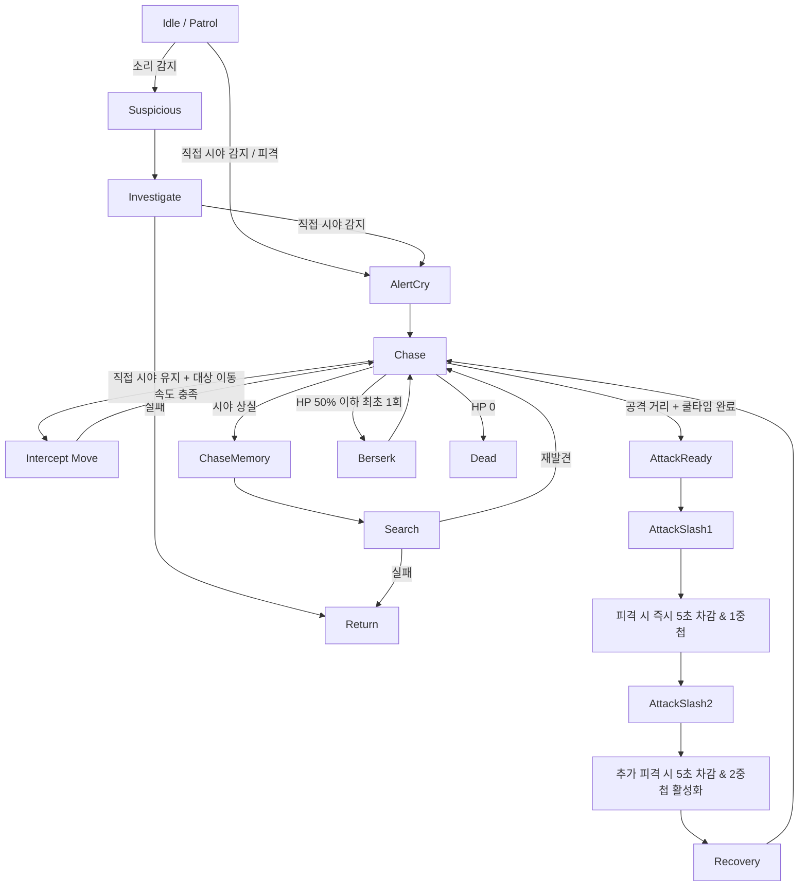
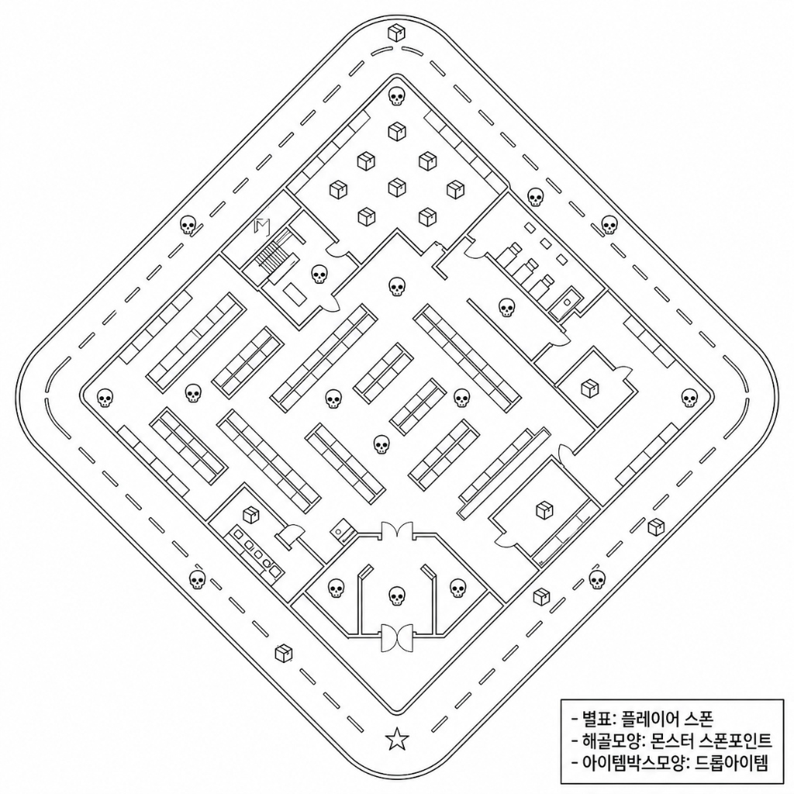
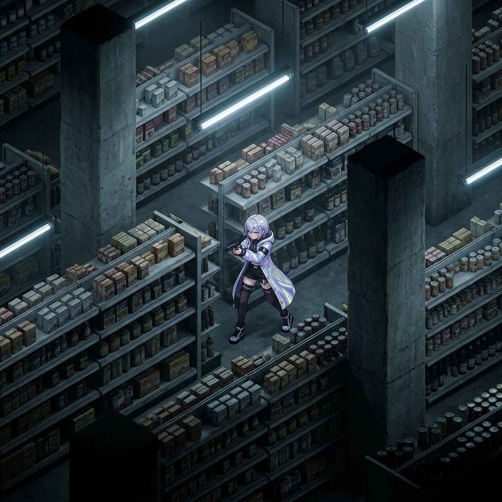
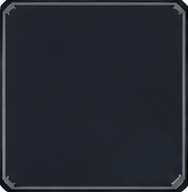

# 02_P0.5_시스템_명세서

**문서 버전 관리**

| 버전 | 작성 일자 | 작업 내역 |
| --- | --- | --- |
| v0.1 | 2026.07.06 | P0.5 확장 시스템 명세 통합 초안 작성 (6개 검수 문서 통합) |
| v0.2 | 2026.07.06 | §7 UI 시스템 (아이템 슬롯 배경 이미지 변경) 추가 |

> [!NOTE]
> 본 문서는 P0.5 빌드에서 신규 추가 또는 변경되는 시스템만을 기술한다.
> P0 기반 구현 사양(기본 전투, 인벤토리, 탈출 결과 정산 등)은 `01_P0_시스템_명세서.md`를 참조한다.

---

## 개요

| 항목 | 내용 |
| --- | --- |
| 대상 빌드 | P0.5 프로토타입 |
| 기반 문서 | `01_P0_시스템_명세서.md` |
| 기획 담당자 | 장수영, 우성혁, 송예찬 |
| 우선순위 | P0.5 |

### P0 대비 추가/변경 사항 전체 요약

| 분류 | 기능 | P0 사양 | P0.5 추가/변경 |
| --- | --- | --- | --- |
| 플레이어 | 인게임 세션 시간 제한 | 미구현 | 신규 추가 |
| 플레이어 | 플레이어 시야 제한 | 미구현 | 신규 추가 |
| 플레이어 | 달리기 | 미구현 | 신규 추가 |
| 플레이어 | 구르기 | 미구현 | 신규 추가 |
| 플레이어 | 탈출 채널링 | 구현됨 (0.0초, 즉시 처리) | escapeTime 적용, 피격 취소 추가 |
| 플레이어 | 각성 보존 슬롯 | 미구현 | 신규 추가 |
| 플레이어 | 소비 기물 채널링 | 미구현 (딜레이 변수만 존재) | 피격 취소 처리 추가 |
| 플레이어 | 소비 기물 쿨타임 | 미구현 | 신규 추가 |
| 플레이어 | 장비 | 구현됨 (무장 1종) | 아티팩트 형식으로 변경, effectType 확장 |
| 스킬 | 다이버 스킬 | 미구현 | 신규 추가 (전체) |
| 아이템 | 아티팩트 시스템 | 미구현 | 신규 추가 (전체) |
| 아이템 | 소비 기물 데이터 | 미구현 | 3종 데이터 확정 |
| 아이템 | 잡템 데이터 | 미구현 | 3종 데이터 확정 |
| 에너미 | 꿈식자 AI | 단순 추적형 | 모듈형 상태 머신, 차단 이동, 루시드 낙인 추가 |
| 레벨 | 슈퍼숍 레벨 | 테스트 맵 | 3중 레이어 40m×40m 마트 신규 설계 |
| 동조율 | 결과창 UI | 정적 출력 | 순차 등장 애니메이션 추가 |
| 동조율 | 로비 알림 | 미구현 | 레드닷 알림 추가 |
| 동조율 | 심상 기록 해금 | 미구현 | 해금 이펙트 및 NEW 배지 추가 |
| 동조율 | 캐릭터 표정 | 미구현 | 대사 출력 시 표정 변화 추가 |
| 동조율 | LinkRateLevel 수치 | 미확정 | P0.5 기준 수치 확정 |
| UI | 아이템 슬롯 배경 | 미구현 | 아이템 등급별 슬롯 배경 스프라이트 변경 추가 |

---

# §1 플레이어 캐릭터 시스템

> 기획 담당자: 우성혁  
> 참조 원문: `P0.5_플레이어 캐릭터_기획서_시스템 명세_v1.0.3`

---

## 1.1 인게임 세션 시간 제한

각 인게임 세션에서 플레이를 진행할 수 있는 최대 시간 값을 `sessionTimeLimit (float)` 변수에 지정한다.

- 세션 입장 시 스크립트 내부 변수 `currentTimeLimit (float)`에 `sessionTimeLimit` 값으로 초기화한다.
- 세션 진행 중 `currentTimeLimit` 값은 기본적으로 매 초마다 1.0씩 감소한다.
- `currentTimeLimit` 값이 0.0이 된 시점에 탈출 실패(강제 각성) 판정을 실행한다.
    - 강제 각성 판정은 플레이어 HP가 0이 된 시점의 처리와 동일하게 진행된다.

### 1.1.1 시간 제한 가속

특정 구역(이하 **가속 구역**)에 플레이어가 진입하고 있는 경우, 해당 플레이어에게 적용되는 `timeLimitSpeed` 값이 가속 구역에 설정된 `timeLimitAccel (float)` 값에 따라 변동된다.

- `currentTimeLimit`이 매 초 감소하는 수량에 `timeLimitAccel` 값을 곱한다.
- 가속 구역 적용 및 해제는 가속 구역의 Collider와 플레이어의 `PlayerBody Collider`의 `TriggerEnter` / `TriggerExit`로 처리한다.
    - 가속 구역 이탈 시 전달하는 `timeLimitAccel` 값을 1.0으로 초기화한다.
- 2개 이상의 가속 구역이 중첩되는 경우, 각 가속 구역의 우선순위 변수 `Order (int)`를 비교하여 가장 우선순위가 높은 가속 구역만 적용한다.
- `timeLimitSpeed` 값은 플레이어가 장착한 장비의 능력치 데이터에 따라 변동된다.
    - 장비 아이템에 시간 제한 가속 능력치 적용 시 `equipEffectType.timeLimitSpeed (enum)` 타입을 부여하고 `equipEffectValue (float)`에 가속 배율 값을 입력한다.
    - 최종 초당 감소 수량 계산: `timeLimitSpeed(장비값) × timeLimitAccel(구역값)`

### 1.1.2 시간 제한 회복

소비 기물 아이템을 통해 남은 시간 제한을 회복할 수 있다.

- `EffectType` enum에 `timeLimit_recover_inst` 타입을 추가한다.
- 해당 아이템 사용 시 `ItemEffect` 함수의 `effectValue` 값만큼 `currentTimeLimit`이 즉시 증가한다.

---

## 1.2 플레이어 시야 제한

플레이어 위치 기준점으로부터 마우스 커서 방향을 바라보는 선을 중심 축으로 하는 부채꼴 범위(이하 **시야 범위**) 내에서만 적 및 상호작용 가능한 오브젝트의 렌더링을 실행한다.


*시야 범위 설정 및 적용 예시*

플레이어의 `CharacterData`에 이하의 변수를 추가한다.

| 변수명 | 자료형 | 설명 |
| --- | --- | --- |
| `visionAngle` | float | 시야 범위 부채꼴의 사이 각 |
| `visionRange` | float | 시야 범위 부채꼴의 반지름 |

- 시야 범위는 X-Z 평면 내에서 계산한다.
- 중심 축으로부터 시계 방향 및 반시계 방향으로 각각 `visionAngle`의 절반만큼 벌어진 범위를 시야 범위 각도로 사용한다.

---

## 1.3 달리기

달리기 버튼을 입력하고 있는 상태에서 이동 명령을 입력하면 달리기 상태로 이동할 수 있다.

- `InputSystem`의 Action Map `Player`에 `Sprint` Action을 추가한다.
- 플레이어의 `CharacterData`에 `sprintSpeed (float)` 변수를 추가한다.
- `LocalInputReader` 스크립트에 Sprint 키 입력 처리 메소드를 추가한다.

```csharp
public bool isSprint;
public void OnSprint(InputAction.CallbackContext context)
{
    if (context.started)
    {
        isSprint = true;
    }
    if (context.canceled)
    {
        isSprint = false;
    }
}
```

- `PlayerMovement` 스크립트에서 `isSprint` 여부에 따른 달리기 처리 메소드를 추가한다.
    - `isSprint` 값에 따라 walk / sprint 애니메이션 클립을 전환한다.
    - 이동 속도 계산: `(isSprint ? sprintSpeed : moveSpeed)`

### 1.3.1 달리기 스태미나로 MP 소비

달리기 상태로 이동 중 지속적으로 MP를 소비한다.

플레이어의 `CharacterData`에 이하의 변수를 추가한다.

| 변수명 | 자료형 | 설명 |
| --- | --- | --- |
| `sprintMP` | float | 달리기 상태로 이동 중 매 초마다 소비하는 MP 수량 |
| `sprintRecoverTime` | float | 달리기 불가 상태 해제까지 대기 시간 |

- 달리기 중 보유 MP가 `sprintMP` 값 미만이 되면 달리기 불가 상태가 된다.
    - `PlayerMovement` 스크립트에 `cannotSprint (bool)` 변수를 추가한다.
    - `cannotSprint = true`인 동안 `isSprint = false`로 고정한다.
    - `sprintRecoverTime` 경과 후 `cannotSprint = false`로 복귀한다.

---

## 1.4 구르기

구르기 버튼 입력으로 지정한 방향으로 회피 이동을 실행한다.

- `InputSystem`의 Action Map `Player`에 `Evade` Action을 추가한다.

플레이어의 `CharacterData`에 이하의 변수를 추가한다.

| 변수명 | 자료형 | 설명 |
| --- | --- | --- |
| `evadeSpeed` | float | 구르기 동작으로 플레이어가 이동하는 속도 |
| `evadeTime` | float | 구르기 동작으로 플레이어가 이동하는 데 걸리는 시간 |
| `evadeMP` | float | 구르기 동작 1회당 소비하는 MP 값 |
| `evadeCooltime` | float | 구르기 동작 후 다음 구르기 입력까지 대기하는 쿨타임 |

- Evade 키 입력 시 `evadeMP` 값만큼 MP를 소비하여 `movementInput` 방향으로 `evadeSpeed × evadeTime` 거리만큼 이동한다.
    - 보유 MP가 `evadeMP` 미만이면 구르기 불가.
    - 키 입력 시 애니메이션 FSM의 `구르기` 트리거를 활성화한다.
- `PlayerMovement` 스크립트에 이하의 변수를 추가한다.

| 변수명 | 자료형 | 설명 |
| --- | --- | --- |
| `isEvading` | bool | 구르기 실행 중 상태 |
| `lastEvadeTime` | float | 최근 구르기 완료 시점 |

- `isEvading = true`인 동안 적의 공격으로 인한 HP 감소가 발생하지 않는다. (무적 판정)
- 구르기 이동은 코루틴으로 구성하여 `isEvading`을 관리한다.
- `Time.time < lastEvadeTime + evadeCooltime` 조건이면 다음 구르기 입력이 무효화된다.

---

## 1.5 탈출 판정 시 채널링

`ExitPoint`에서 탈출 상호작용 시도 시 `escapeTime (float)` 변수에 입력한 시간만큼 채널링이 발생한다.

- `ResultManager` 스크립트에 `isEscapeChanneling (bool)` 변수로 탈출 채널링 상태를 저장한다.
- `isEscapeChanneling = true` 상태에서 피격 시 `PlayerStatus.TakeDamage` 메소드를 통해 이벤트를 전달하여 탈출 판정 코루틴을 강제로 종료시킨다.
- 코루틴 종료 시 `isEscapeChanneling = false` 및 `ExitPoint.isEscaping = false`로 변경한다.

---

## 1.6 각성 보존 슬롯

각성 보존 슬롯에 등록된 아이템은 탈출 실패 시 소멸되지 않는다.


*① 장비 슬롯 / ② 각성 보존 슬롯*

- 각성 보존 슬롯은 `PlayerSaveData`에서 `List<SaveSlotData> safeSlots = new();`로 저장한다.
- 각성 보존 슬롯 개수(기본 4개)는 `PlayerSaveData`에서 `int safeSlotNum = 4`로 설정한다.
- 탈출 실패 시 `ResultManager`의 `RemoveFromInventory` 코드에서 `_playerSaveData.safeSlots` 데이터를 참조하지 않음으로써 각성 보존 슬롯 아이템 제거를 방지한다.
    - 이후 `saveRepo.SaveGameData()`를 실행하여 각성 보존 슬롯 데이터를 세이브 파일에 저장한다.

---

## 1.7 소비 기물 사용 처리

### 1.7.1 효과 적용 전 채널링

퀵슬롯 버튼을 터치하여 소비 기물 사용 시 효과 적용 처리 전 `useDelay` 시간 동안 채널링이 발생한다.

- 채널링 없이 즉시 발동하는 소비 기물은 `useDelay = 0.0`으로 입력한다.
- 소비 기물 사용 처리를 `yield return new WaitForSeconds(useDelay)` 대기 시간이 포함된 코루틴으로 구현한다.
- `ConsumeItemData`에 `useChanneling (bool)` 변수를 추가하여 피격 시 채널링 취소 여부를 지정한다.
    - `useChanneling = true`인 경우에만 피격 취소 처리를 실행한다.
- `QuickSlotPresenter` 스크립트에 `isConsumeChanneling (bool)` 변수로 채널링 상태를 저장한다.
    - `isConsumeChanneling = true` 상태에서 피격 시 `PlayerStatus.TakeDamage` 메소드를 통해 소비 기물 사용 코루틴을 강제로 종료시킨다.

### 1.7.2 효과 적용 후 쿨타임

소비 기물 사용 후 효과 적용 처리 완료 시점부터 쿨타임이 발생한다.

- `ConsumeItemData`에 `useCooltime (float)` 변수를 추가한다.
- `PlayerInventory` 스크립트에 `lastUseTime (float)` 변수를 `<TID, lastUseTime>` 딕셔너리 형태로 관리한다.
- 쿨타임 판정: `if (Time.time >= lastUseTime + useCooltime)` 조건이 true인 경우에만 퀵슬롯 터치 입력이 적용된다.

---

## 1.8 장비 시스템

인게임 세션 내에서 다이버 캐릭터에 장비 아이템을 장착할 수 있다.

- 장착 가능한 슬롯 개수는 `PlayerSaveData`의 `equipSlotsNum (int)` 변수에서 지정한다.
- 장비 정보는 `EquipItemData` 테이블에서 관리한다.
    - 아이템 ID, 이름, 설명 텍스트, 최대 중첩 개수, 아이콘, 프리팹 오브젝트는 `ItemData` 테이블에서 관리한다.

| 변수명 | 자료형 | 설명 |
| --- | --- | --- |
| `equipEffectType` | equipEffectType (enum) | 장비 아이템 효과 분류 |
| `equipEffectValue` | float | 장비 아이템 효과 적용 값 |

- 1개의 장비에 부여할 수 있는 효과의 개수는 1가지를 기본으로 한다. (레전드 아티팩트는 예외 - §3.2 참조)

### 1.8.1 equipEffectType 종류 및 중첩 공식

| 변수명 | 능력치 이름 | 기본값 | 음수 값 여부 | 장비 A+B 중첩 공식 | 중첩 하한값 | 중첩 상한값 |
| --- | --- | --- | --- | --- | --- | --- |
| `hpRegen` | HP 자연 회복 | 0.0 | 가능 (자연 감소 구현) | `hpRegen_A + hpRegen_B` | -100.0 | 100.0 |
| `mpRegen` | MP 자연 회복 | 0.0 | 가능 (자연 감소 구현) | `manaRegen + mpRegen_A + mpRegen_B` | -100.0 | 100.0 |
| `def` | 방어력 | 0.0 | 가능 (받는 피해 증가 구현) | `받는 피해량 × (1 - (def_A + def_B))` | -9.0 | 0.99 |
| `moveSpeedUp` | 이동 속도 | 0.0 | 가능 (이동 속도 감소 구현) | `moveSpeed × (1 + moveSpeedUp_A + moveSpeedUp_B)` | -0.99 | 9.0 |
| `fireSpeedUp` | 공격 속도 증가 | 0.0 | 가능 (공격 속도 감소 구현) | `fireRate / (1 + fireSpeedUp_A + fireSpeedUp_B)` | -0.99 | 없음 |
| `fireMPDown` | 공격 시 MP 소비량 감소 | 0.0 | 가능 (소비 MP 증가 구현) | `useMana × (1 - (fireMPDown_A + fireMPDown_B))` | 없음 | 0.99 |
| `timeLimitSpeed` | 시간 제한 가속 | 1.0 | 불가 (음수 시간 금지) | `timeLimitSpeed_A × timeLimitSpeed_B × timeLimitAccel` | 0.01 | 60.0 |

> [!NOTE]
> `manaRegen`: 플레이어 `CharacterData`의 기본 MP 회복량  
> `moveSpeed`: 플레이어 `CharacterData`의 기본 이동 속도  
> `fireRate`: 플레이어 기본 무장의 발사 간격  
> `useMana`: 플레이어 기본 무장의 1회 공격 MP 소비량  
> `timeLimitAccel`: 인게임 세션 내 가속 구역의 시간 제한 가속 배율

---

# §2 스킬 시스템

> 기획 담당자: 우성혁  
> 참조 원문: `P0.5_플레이어 캐릭터_기획서_스킬 기능 명세_v1.0.0`

---

## 2.1 스킬 개요

다이버 캐릭터는 인게임 세션에서 기본 공격 이외의 스킬을 사용할 수 있다.


*스킬 사용 플로우*

- 스킬은 인게임 세션 UI의 스킬 슬롯에 출력된다.
- 스킬 사용 키: `InputSystem` Player 액션 맵의 `ActiveSkill` 액션.
- `LocalInputReader`에 `OnActiveSkill` 콜백 메소드를 추가한다.
    - 글로벌 이벤트 버스에 `OnActiveSkillRequested` 이벤트를 등록하고, `OnActiveSkill`에서 Invoke한다.
    - `PlayerCombatPresenter`에서 이벤트를 구독하여 스킬 발동 여부 체크를 실행한다.

---

## 2.2 스킬 사용 가능 여부 체크

스킬 키 입력 신호 발생 시 이하의 조건을 순서대로 확인한다.

1. **상태 조건**: 플레이어 상태가 `PlayerStatus.livingState.idle`인가
    - `탈출 중(escape)` 또는 `강제 각성(gameover)` 상태에서는 스킬 키 입력이 비활성화된다.
2. **MP 조건**: 보유 MP가 스킬의 `mpCost` 이상인가
3. **쿨타임 조건**: 이전 스킬 발동 시점으로부터 `skillCooltime` 이상 경과했는가

### 2.2.1 MP 소비

- 보유 MP가 `mpCost` 미만이면 스킬 키 입력을 비활성화한다.
- `mpCost (float)` 변수로 소비량을 조정한다.

### 2.2.2 쿨타임

- 스킬 발동 성공 시점부터 쿨타임이 적용된다. (MP 부족 또는 쿨타임 진행 중이라 발동하지 않은 경우에는 적용되지 않음)
- `skillCooltime (float)` 변수에 초 단위로 입력한다.
- 세션 입장 시점에 `지난 스킬 발동 시점`을 기본값 0으로 저장한다 (입장 직후 스킬 사용 가능).

---

## 2.3 스킬 사용 지점

스킬이 발동한 시점의 플레이어 위치 및 마우스 커서 위치에 따라 결정된다.

- 플레이어 위치를 시작점으로 하여 커서 방향으로 **발동 ray**를 투영한다.
- 스킬 사용 지점은 플레이어 위치로부터 `fireRange (float)` 이하 거리 내에서만 지정 가능하다.
    - 발동 ray의 길이를 `fireRange` 이하로 clamp 처리한다.


*targetType 지정 방식 및 targetObjectCategory 지정 설명*

### 2.3.1 targetType — 스킬 사용 지점 결정 방식

| targetType 값 | 설명 |
| --- | --- |
| `targetObject` | 커서 위치에 대상 오브젝트의 몸통 Collider와 겹쳐진 경우, 해당 Collider의 영점을 끝점으로 설정 (타겟팅 방식) |
| `cursorPoint` | ray 끝점을 사거리 원형 내부의 임의 지점으로 설정 |
| `maxRange` | ray 끝점이 항상 `fireRange` 값만큼 떨어진 지점에 투영 |

### 2.3.2 targetObjectCategory — 타겟팅 대상 종류

| targetObjectCategory 값 | 설명 |
| --- | --- |
| `none` | 타겟팅 없음 (cursorPoint, maxRange 방식) |
| `self` | 시전자 자신 |
| `ally` | 시전자의 아군 |
| `opponent` | 시전자의 상대편 |

### 2.3.3 커서가 발동 사거리보다 먼 지점에 있는 경우 처리

| targetType | 처리 방식 |
| --- | --- |
| `targetObject` | 스킬 발동 처리가 실행되지 않는다 |
| `cursorPoint` | 커서 방향으로 `fireRange` 값만큼 떨어진 지점에서 정상 발동 |
| `maxRange` | 커서 방향으로 `fireRange` 값만큼 떨어진 지점에서 정상 발동 |

---

## 2.4 스킬 발동 처리

- MP 소비 처리를 스킬 발동 시점 직전에 실행한다.
- 발동 시 `Animator Controller`에 `스킬 발동` 트리거를 전달하여 스킬 사용 애니메이션을 출력한다.
    - 발동 시점에 `activateSFX (string)` 및 `activateVFX (string)` 파일명으로 지정된 발동 이펙트를 출력한다.
- 발동 시점으로부터 각 스킬 효과의 `effectDelay (float)` 시간만큼 대기 후 효과를 적용한다.

### 2.4.1 플레이어 이동 명령 중단

스킬 발동 시점부터 `activateTime (float)` 동안 플레이어 캐릭터의 이동 명령 입력을 중단한다.

- 중단 중에도 이하의 강제 위치 이동은 적용된다.
    - 시전자가 `effectType=leap` 스킬을 사용하여 자신의 위치를 변경하는 경우
    - 적이 `effectType=knockback` 스킬로 시전자를 이동시키는 경우

---

## 2.5 스킬 효과 타입 (effectType)


*areaType 및 areaWidth, fireRange 값 적용 설명*

| effectType 값 | 설명 |
| --- | --- |
| `none` | 사용되지 않음 (다중 효과 테이블에서 빈 칸 값) |
| `damage` | 보유 체력 피해. `effectValue`에 시전자 공격력 배율(float)을 입력 (기본 100% = 1.0) |
| `healHP` | 보유 체력 회복. `effectValue`에 회복하는 값(float)을 입력 |
| `leap` | 도약/돌진. `effectValue[0]`에 이동 거리(Unity 단위), `effectValue[1]`에 이동 시간(초) 입력. 음수 값 입력 시 커서 반대 방향으로 이동 |
| `knockback` | 밀어내기. `effectValue[0]`에 밀어내는 거리, `effectValue[1]`에 밀어내는 시간 입력. 음수 값 입력 시 끌어당기기 구현 가능 |
| `aggro` | 추적 대상 유도 — §2.6.1 디코이 참조 |
| `vision` | 시야 범위 추가 — §2.6.2 조명 참조 |
| `parry` | 패링 — §2.7 참조 (P0.5 이후 예약) |

### 2.5.1 효과 적용 범위 (areaType)

| areaType 값 | 설명 |
| --- | --- |
| `none` | 사용되지 않음 |
| `single` | 단일 대상 (targetObject: 지정 대상 1명 / cursorPoint: ray 끝점 위치 / maxRange: 가장 가까운 히트 대상 1명) |
| `rectangle` | 직사각형 (플레이어로부터 정면으로 `fireRange` 거리 이내) |
| `arc` | 부채꼴 (플레이어를 중심으로 반지름 `fireRange` 거리 이내) |
| `circle` | 원형 (ray 끝점을 중심으로 하는 원형) |

- `areaWidth (float)`: 효과 적용 범위의 2차 크기 값 (rectangle: 가로 폭 / arc: 사이각 / circle: 반지름)

### 2.5.2 효과 적용 대상 (effectTarget)

| effectTarget 값 | 설명 |
| --- | --- |
| `none` | 사용되지 않음 |
| `self` | 시전자 자신 |
| `ally` | 시전자의 아군 |
| `opponent` | 시전자의 상대편 |

---

## 2.6 오브젝트 생성 스킬

### 2.6.1 디코이 (`effectType=aggro`)

스킬 사용 지점에 적 AI의 추적 대상이 되는 오브젝트(이하 **디코이**)를 생성한다.

- `areaType = single`, `effectTarget = opponent`으로 입력한다.
- 생성된 디코이 오브젝트는 `effectValue (float)` 초 동안 유지되며 `NoiseType=Decoy` 신호를 발생시킨다.
    - 신호가 전파되는 범위의 반지름: `areaWidth (float)`.
    - 디코이 신호는 적 AI의 추적 대상 선택에서 플레이어보다 우선시된다.
        - 우선순위는 `NoiseManager`의 `priority (int)` 값으로 조절한다. (값이 클수록 높은 우선순위)
- 디코이 생성 시 디코이 위치에 `effectHitSFX` 및 `effectHitVFX`를 출력한다.

### 2.6.2 조명 (`effectType=vision`)

스킬 사용 지점에 시야 렌더링 볼륨을 생성하는 오브젝트(이하 **조명**)를 생성한다.

> [!IMPORTANT]
> 시야 시스템 개발 시 추가 명세 필요.

---

## 2.7 패링 (`effectType=parry`)

> [!NOTE]
> P0.5 이후 확장 개발 시 사용 예약. 현재 구현 범위 외.

- `effectValue[0]`: 패링 판정 유지 시간(초)
- `effectValue[1]`: 패링 성공 시 반격 피해 배율(float, 기본 100% = 1.0)
- 패링 판정 중 적의 기본 공격 피격 시:
    - 플레이어가 받는 피해를 0으로 처리
    - 해당 적에게 `플레이어 공격력 × effectValue[1]` 피해를 적용
    - 패링 판정 비활성화

---

## 2.8 다중 효과 적용

1개의 스킬에 2가지 이상의 효과를 설정하기 위해 이하의 클래스를 정의하여 사용한다.

```csharp
SkillEffects { effectType, areaType, areaWidth, effectTarget, effectDelay, effectValue }
```

- 각 효과마다 `areaType`, `areaWidth`, `effectTarget` 값을 별도로 설정한다.
- `effectDelay` 값은 스킬 키 입력 시점으로부터 각각 독립적으로 계산한다.

---

## 2.9 SkillData 테이블 변수 목록

| 변수명 | 자료형 | 설명 |
| --- | --- | --- |
| `TID` | int | 스킬 고유 ID |
| `skillName` | string | 스킬 이름 |
| `skillDesc` | string | 스킬 설명 |
| `skillIcon` | string | 스킬 아이콘 이미지 파일명 |
| `mpCost` | float | 스킬 사용 시 MP 소비량 |
| `skillCooltime` | float | 스킬 쿨타임 (초) |
| `fireRange` | float | 스킬 발동 사거리 |
| `activateTime` | float | 스킬 사용 중 플레이어 이동/회전이 정지되는 시전 시간 |
| `activateSFX` | string | 스킬 발동 시 출력 사운드 파일명 |
| `activateVFX` | string | 스킬 발동 시 출력 VFX 프리팹 파일명 |
| `targetType` | enum | 스킬 사용 지점 설정 방식 (targetObject / cursorPoint / maxRange) |
| `targetObjectCategory` | enum | 스킬 타겟팅 대상 (none / self / ally / opponent) |
| `effectType_XX` | enum | 스킬 효과 종류 (XX = 효과 인덱스 번호) |
| `areaType_XX` | enum | 스킬 효과 적용 범위 타입 |
| `areaWidth_XX` | float | 스킬 효과 적용 범위 2차 크기 값 |
| `effectTarget_XX` | enum | 스킬 효과 적용 대상 타입 |
| `effectDelay_XX` | float | 발동 시점으로부터 효과 적용까지의 딜레이 (초) |
| `effectValue_XX` | string | 스킬 효과 값 (effectType에 따라 float 또는 float[2]로 파싱) |
| `effectHitSFX_XX` | string | 스킬 효과 적용 시 출력 사운드 파일명 |
| `effectHitVFX_XX` | string | 스킬 효과 적용 시 출력 VFX 프리팹 파일명 |

---

## 2.10 P0.5 스킬 구현 예시 — 프리즘 유탄

| 변수 | 값 | 설명 |
| --- | --- | --- |
| TID | 1 |  |
| skillName | 프리즘 유탄 |  |
| skillDesc | 소비 MP: 20 / 15m 거리 내 지정 지점에 프리즘 유탄을 발사. 0.5초 후 폭발하여 반경 3m 내 적에게 공격력 150% 피해, 2.5초간 반경 18m 범위 적을 유인하는 디코이 생성. 재사용 대기시간: 5초 |  |
| skillIcon | Image_YuanSkill |  |
| mpCost | 20.0 |  |
| skillCooltime | 5.0 |  |
| fireRange | 15.0 |  |
| activateTime | 0.2 | 키 입력 후 0.2초 동안 이동 명령 중단 |
| activateSFX | P0.5_Skill_Activate_SFX |  |
| activateVFX | P0.5_Skill_Activate_VFX |  |
| targetType | cursorPoint |  |
| targetObjectCategory | none |  |
| effectType_0 | damage |  |
| areaType_0 | circle |  |
| areaWidth_0 | 3.0 | 반지름 3m |
| effectTarget_0 | opponent |  |
| effectDelay_0 | 0.5 | 0.5초 후 피해 판정 |
| effectValue_0 | 1.5 | 공격력 150% |
| effectHitSFX_0 | P0.5_Skill_Hit_SFX |  |
| effectHitVFX_0 | P0.5_Skill_Hit_VFX |  |
| effectType_1 | aggro |  |
| areaType_1 | single |  |
| areaWidth_1 | 18.0 | 디코이 신호 반지름 18m |
| effectTarget_1 | opponent |  |
| effectDelay_1 | 0.5 | 0.5초 후 디코이 생성 |
| effectValue_1 | 2.5 | 디코이 유지 2.5초 |
| effectHitSFX_1 | P0.5_Skill_Decoy_SFX |  |
| effectHitVFX_1 | P0.5_Skill_Decoy_VFX |  |
| effectType_2 | none | P0.5 버전은 2가지 효과만 존재 |
| areaType_2 | none |  |
| areaWidth_2 | 0.0 |  |
| effectTarget_2 | none |  |
| effectDelay_2 | 0.0 |  |
| effectValue_2 | 0 |  |
| effectHitSFX_2 | none |  |
| effectHitVFX_2 | none |  |

---

# §3 아이템 시스템

> 기획 담당자: 장수영  
> 참조 원문: `P0.5_아이템 명세_v1.0.0`

---

## 3.1 아티팩트 시스템 규칙

### 3.1.1 아티팩트란

아티팩트는 인게임 세션 내에서 습득하여 플레이어 캐릭터에 장착하는 특수 장비 아이템이다.

- 기존 `EquipItemData` 테이블의 장비 아이템 구조를 활용하되, 아티팩트 전용으로 `artifactCategory (enum)` 필드를 추가하여 아이템 분류 시스템을 지원한다.
- 아티팩트는 5개의 등급(노멀 / 언커먼 / 레어 / 에픽 / 레전드)으로 분류되며, 각 등급당 1종이 존재한다.
- 아티팩트는 플레이어 캐릭터의 스탯 및 수치를 조정하는 효과만을 보유하며, 새로운 액션이나 스킬 추가 효과는 갖지 않는다.
- **동일 카테고리의 아티팩트라도 중첩 착용이 허용된다.** P0.5 단계에서는 각 카테고리당 1종만 존재하므로 실질적 충돌 없음. 스탯 중첩에 따른 밸런스는 캐릭터 명세의 스탯 상한선(§1.8.1)에 의해 제어된다.

### 3.1.2 필드 내 즉시 착용 및 교체

- 플레이어는 인게임 세션 진행 중 아티팩트를 습득한 즉시 장착하거나, 기존 장착 아티팩트와 교체할 수 있다.
- `equipEffectValue`는 장착 처리 완료 즉시 능력치 계산에 반영된다.

### 3.1.3 장착 교체 시 기존 아이템 처리

- 장착 중인 아티팩트를 다른 아티팩트로 교체할 경우, 교체된 기존 아티팩트는 플레이어 인벤토리로 자동 반환된다.
- **인벤토리 포화 상태에서의 교체**: 인벤토리가 가득 찬 상태에서 교체 시 인벤토리 UI에서 드래그앤드롭으로 교체를 실행할 수 있다.
    - 드래그앤드롭 교체 시, 선택한 아이템이 플레이어 현재 위치 바닥에 드롭되고 새로운 아티팩트가 해당 슬롯을 대체한다.
    - 바닥에 드롭된 아이템은 일정 시간 동안 잔존하며 재습득이 가능하다.

### 3.1.4 탈출 실패 시 아티팩트 처리

- **각성 보존 슬롯에 등록된 아티팩트**: 탈출 실패 시 소실되지 않으며 세이브 데이터에 유지된다.
- **각성 보존 슬롯 미등록 아티팩트(일반 인벤토리 및 장착 슬롯)**: 탈출 실패 시 전부 소실 처리된다.
- 탈출 성공 시에는 장착 중이거나 인벤토리에 보관 중인 아티팩트 전부가 그대로 유지된다.
- 소실 처리는 `ResultManager`의 탈출 실패 정산 코드에서 기존 소비 기물 소실 처리와 동일한 방식으로 구현한다.

### 3.1.5 아티팩트 드롭 규칙

**기본 드롭 확률 (일반 구역)**

| 오브젝트 종류 | 아티팩트 드롭 여부 판정 확률 |
| --- | --- |
| 아이템 상자 (일반 구역) | 40% |
| 적 처치 드롭 (일반 구역) | 15% |

아티팩트 드롭이 발생하는 경우 등급별 확률:

| 등급 | 드롭 확률 (일반 구역) |
| --- | --- |
| 노멀 | 55% |
| 언커먼 | 25% |
| 레어 | 12% |
| 에픽 | 6% |
| 레전드 | 2% |

**고위험 구역 드롭 규칙 (마트 건물 내 창고)**

- 고위험 구역(마트 건물 내 창고 구역)의 아이템 상자에서는 아티팩트가 무조건 1개 이상 드롭된다.

| 등급 | 드롭 확률 (고위험 구역) |
| --- | --- |
| 노멀 | 15% |
| 언커먼 | 25% |
| 레어 | 30% |
| 에픽 | 20% |
| 레전드 | 10% |

---

## 3.2 아티팩트 데이터 명세

### EquipItemData 추가 변수

| 변수명 | 자료형 | 설명 |
| --- | --- | --- |
| `artifactCategory` | ArtifactCategory (enum) | 아티팩트 카테고리 분류. 분류 표시 및 아이템 구분 목적. 중첩 착용 허용 |

### ArtifactCategory Enum

```csharp
public enum ArtifactCategory
{
    None,         // 아티팩트 카테고리 미사용 (일반 장비 호환용)
    HP_Related,   // HP 재생 관련 효과를 보유한 아티팩트
    MP_Related,   // MP 재생 관련 효과를 보유한 아티팩트
    Mobility,     // 이동 속도 관련 효과를 보유한 아티팩트
    TimeLimit,    // 세션 시간 제한 관련 효과를 보유한 아티팩트
    Combat,       // 공격 속도 및 공격 효율 관련 효과를 보유한 아티팩트
}
```

---

## 3.3 아티팩트 목록 (5종)

### ① 노멀: 굳어버린 구급 봉투

| 변수명 | 값 | 설명 |
| --- | --- | --- |
| TID | 1001 |  |
| itemName | 굳어버린 구급 봉투 |  |
| itemDesc | 소비: 장착<br>장착 중 HP가 초당 2.0씩 자연 회복된다. |  |
| itemFlavorText | 개봉한 흔적은 없는데 내용물이 이미 굳어 있다. 손에 닿으면 차갑다. |  |
| grade | Normal |  |
| artifactCategory | HP_Related |  |
| equipEffectType | hpRegen | HP 자연 회복량 증가 |
| equipEffectValue | 2.0 | 초당 HP +2.0 회복 |
| sellValue | 500 | 상점 판매 시 재화 환산 가치 |
| icon | UI_Icon_Normal_FirstAidPouch |  |

### ② 언커먼: 역류하는 자양강장제

| 변수명 | 값 | 설명 |
| --- | --- | --- |
| TID | 1002 |  |
| itemName | 역류하는 자양강장제 |  |
| itemDesc | 소비: 장착<br>장착 중 MP가 초당 5.0씩 자연 회복된다. |  |
| itemFlavorText | 마트 음료 코너에서 발견한 강장제. 캔 안에서 액체가 위를 향해 흐른다. 마셔보면 달다. |  |
| grade | Uncommon |  |
| artifactCategory | MP_Related |  |
| equipEffectType | mpRegen | MP 자연 회복량 증가 |
| equipEffectValue | 5.0 | 초당 MP +5.0 회복 |
| sellValue | 1200 | 상점 판매 시 재화 환산 가치 |
| icon | UI_Icon_Uncommon_EnergyDrink |  |

### ③ 레어: 마모되지 않는 카트 바퀴

| 변수명 | 값 | 설명 |
| --- | --- | --- |
| TID | 1003 |  |
| itemName | 마모되지 않는 카트 바퀴 |  |
| itemDesc | 소비: 장착<br>장착 중 이동 속도가 30% 증가한다. |  |
| itemFlavorText | 침몽도시를 돌아다니던 카트에서 뜯어낸 바퀴. 닳아야 할 만큼 굴렀을 텐데 흠집 하나 없다. 손으로 쥐면 발이 가벼워진다. |  |
| grade | Rare |  |
| artifactCategory | Mobility |  |
| equipEffectType | moveSpeedUp | 이동 속도 증가 배율 |
| equipEffectValue | 0.3 | moveSpeed × (1 + 0.3) → 이동 속도 130% |
| sellValue | 3000 | 상점 판매 시 재화 환산 가치 |
| icon | UI_Icon_Rare_CartWheel |  |

### ④ 에픽: 지연된 시계 태엽

| 변수명 | 값 | 설명 |
| --- | --- | --- |
| TID | 1004 |  |
| itemName | 지연된 시계 태엽 |  |
| itemDesc | 소비: 장착<br>장착 중 세션 시간 제한의 감소 속도가 40% 느려진다. |  |
| itemFlavorText | 침몽도시에서 시간은 흐르지 않고 소모된다. 이 태엽은 그 소모를 잠시 늦춘다. |  |
| grade | Epic |  |
| artifactCategory | TimeLimit |  |
| equipEffectType | timeLimitSpeed | 시간 제한 가속 배율 |
| equipEffectValue | 0.6 | timeLimitSpeed_A(=0.6) × timeLimitAccel → 시간 감소 속도 60%로 완화 |
| sellValue | 6000 | 상점 판매 시 재화 환산 가치 |
| icon | UI_Icon_Epic_FrozenClockwork |  |

> [!NOTE]
> `timeLimitSpeed` 효과는 §1.1.1 시간 제한 가속 공식에 따라 `timeLimitAccel` 값과 곱산하여 적용된다.
> equipEffectValue = 0.6 기준: 가속 구역이 없는 경우(timeLimitAccel=1.0) → 시간이 정상 속도의 60%로 감소 (약 1.67배 오래 버팀)

### ⑤ 레전드: 침식된 보안 경광봉

| 변수명 | 값 | 설명 |
| --- | --- | --- |
| TID | 1005 |  |
| itemName | 침식된 보안 경광봉 |  |
| itemDesc | 소비: 장착<br>장착 중 공격 속도가 50% 증가하고, 기본 공격 시 소비되는 MP가 30% 감소한다. |  |
| itemFlavorText | 마트 경비원이 오래 찼던 경광봉. 침몽도시의 기운이 배어 손에 쥐면 묵직한 진동이 온다. |  |
| grade | Legend |  |
| artifactCategory | Combat |  |
| equipEffectType_0 | fireSpeedUp | 공격 속도 증가 배율 |
| equipEffectValue_0 | 0.5 | fireRate / (1 + 0.5) → 공격 간격 150% 단축 |
| equipEffectType_1 | fireMPDown | 기본 공격 MP 소비량 감소 배율 |
| equipEffectValue_1 | 0.3 | useMana × (1 - 0.3) → 공격 MP 소비 70%로 절감 |
| sellValue | 12000 | 상점 판매 시 재화 환산 가치 |
| icon | UI_Icon_Legend_SecurityBaton |  |

> [!NOTE]
> 레전드 아티팩트는 `EquipEffects 리스트` 구조를 사용하여 2개의 효과를 하나의 아이템에 설정한다.
> 두 효과 모두 `Combat` 카테고리 소속이므로 단일 `artifactCategory = Combat` 값으로 관리한다.

---

## 3.4 아티팩트 등급별 요약표

| 등급 | 아이템명 | 카테고리 | 주요 효과 | 수치 | 판매가 |
| --- | --- | --- | --- | --- | --- |
| Normal | 굳어버린 구급 봉투 | HP_Related | HP 자연 회복 | +2.0 HP/sec | 500 |
| Uncommon | 역류하는 자양강장제 | MP_Related | MP 자연 회복 | +5.0 MP/sec | 1,200 |
| Rare | 마모되지 않는 카트 바퀴 | Mobility | 이동 속도 증가 | +30% | 3,000 |
| Epic | 지연된 시계 태엽 | TimeLimit | 시간 제한 감소 속도 완화 | ×0.6 (40% 완화) | 6,000 |
| Legend | 침식된 보안 경광봉 | Combat | 공격 속도 증가 + 공격 MP 절감 | +50% 속도 / -30% MP 소비 | 12,000 |

---

## 3.5 소비 기물 시스템 규칙

소비 기물의 채널링 및 쿨타임 처리 방식은 **§1.7 소비 기물 사용 처리**를 참조한다.

### 소비 기물 EffectType 정의

| EffectType 값 | 효과 |
| --- | --- |
| `healHP` | 플레이어 HP를 `effectValue` 수치만큼 즉시 회복 |
| `healMP` | 플레이어 MP를 `effectValue` 수치만큼 즉시 회복 |
| `timeLimit_recover_inst` | 세션 `currentTimeLimit`을 `effectValue` 수치(초)만큼 즉시 증가 |

---

## 3.6 소비 기물 목록 (3종)

### ① 변질된 붕대

| 변수명 | 값 | 설명 |
| --- | --- | --- |
| TID | 2001 |  |
| itemName | 변질된 붕대 |  |
| itemDesc | 사용 시 1.5초 후 HP 40을 즉시 회복한다. 채널링 중 피격 시 취소된다. |  |
| itemFlavorText | 침몽도시에서 발견된 구급 붕대. 포장이 뜯겨있고 이상한 냄새가 나지만, 상처에 감으면 효과가 있다. |  |
| grade | Normal |  |
| maxStack | 5 | 최대 5개 중첩 |
| useDelay | 1.5 | 채널링 1.5초 |
| useChanneling | true | 피격 시 취소됨 |
| useCooltime | 20.0 | 쿨타임 20초 |
| effectType | healHP |  |
| effectValue | 40.0 | HP +40 회복 |

### ② 기묘한 사탕

| 변수명 | 값 | 설명 |
| --- | --- | --- |
| TID | 2002 |  |
| itemName | 기묘한 사탕 |  |
| itemDesc | 사용 즉시 MP 50을 회복한다. |  |
| itemFlavorText | 침몽도시의 진열대에서 발견한 정체불명의 사탕. 먹으면 혀가 저리고 머릿속이 맑아지는 느낌이 든다. 유통기한 따위는 이미 의미가 없다. |  |
| grade | Uncommon |  |
| maxStack | 3 | 최대 3개 중첩 |
| useDelay | 0.0 | 즉시 발동 |
| useChanneling | false | 피격 시 취소 없음 |
| useCooltime | 15.0 | 쿨타임 15초 |
| effectType | healMP |  |
| effectValue | 50.0 | MP +50 회복 |

### ③ 침몽의 모래시계

| 변수명 | 값 | 설명 |
| --- | --- | --- |
| TID | 2003 |  |
| itemName | 침몽의 모래시계 |  |
| itemDesc | 사용 시 2.0초 후 세션 제한 시간을 90초 회복한다. 채널링 중 피격 시 취소된다. |  |
| itemFlavorText | 침몽도시에서 시간은 거꾸로 흐르기도 한다. 이 모래시계를 뒤집으면 잃어버린 시간의 일부를 되돌릴 수 있다. |  |
| grade | Rare |  |
| maxStack | 2 | 최대 2개 중첩 |
| useDelay | 2.0 | 채널링 2.0초 |
| useChanneling | true | 피격 시 취소됨 |
| useCooltime | 0.0 | 쿨타임 없음 (아이템 자체가 희귀) |
| effectType | timeLimit_recover_inst |  |
| effectValue | 90.0 | 세션 제한 시간 +90초 |

### 소비 기물 요약표

| TID | 이름 | 등급 | 효과 | 수치 | 채널링 | 쿨타임 |
| --- | --- | --- | --- | --- | --- | --- |
| 2001 | 변질된 붕대 | Normal | HP 회복 | +40 HP | 1.5초, 피격취소 | 20초 |
| 2002 | 기묘한 사탕 | Uncommon | MP 회복 | +50 MP | 없음 | 15초 |
| 2003 | 침몽의 모래시계 | Rare | 세션 시간 회복 | +90초 | 2.0초, 피격취소 | 없음 |

---

## 3.7 잡템 목록 (3종)

잡템은 직접적인 전투 효과가 없으며, 용도에 따라 3가지 역할로 분류된다.

| 역할 | 설명 |
| --- | --- |
| 환금성 아이템 | 상점 판매를 통해 재화로 전환 가능. P0.5에서는 더미 구현 가능성 있음 |
| 드림 포지드 소재 | 드림 포지드 강화/제작 시스템의 전용 재료 |
| 서사 아이템 | 직접적인 기능은 없으나 세계관 정보를 담은 수집형 아이템 |

> [!NOTE]
> P0.5 단계에서 상점 판매 기능은 더미 구현(UI 표시만, 실제 재화 전환 미연동) 가능성이 높다.

### ① 환금성 아이템: 눅눅한 지폐 뭉치

| 변수명 | 값 | 설명 |
| --- | --- | --- |
| TID | 3001 |  |
| itemName | 눅눅한 지폐 뭉치 |  |
| itemType | SellItem | 잡템 역할: 환금성 아이템 |
| itemDesc | 습기를 잔뜩 머금은 지폐 묶음. 상점에서 판매 가능하다. |  |
| itemFlavorText | 침몽도시가 잠식되기 직전 누군가 서둘러 금고에 쑤셔넣은 것 같다. 아직 가치가 있을지 모른다. |  |
| grade | Uncommon |  |
| maxStack | 10 |  |
| sellValue | 300 | 상점 판매 시 재화 환산 가치 |

### ② 드림 포지드 소재: 응집된 꿈의 결정

| 변수명 | 값 | 설명 |
| --- | --- | --- |
| TID | 3002 |  |
| itemName | 응집된 꿈의 결정 |  |
| itemType | CraftingMaterial | 잡템 역할: 드림 포지드 강화/제작 소재 |
| itemDesc | 드림 포지드 강화 및 제작에 사용되는 재료. |  |
| itemFlavorText | 침몽도시의 꿈 에너지가 물질화된 결정체. 드림 포지드 공방에서 장비 강화와 제작에 쓰인다고 하지만, 왜 마트 진열대에 있는지는 알 수 없다. |  |
| grade | Rare |  |
| maxStack | 20 |  |
| sellValue | 판매 불가 | 드림 포지드 전용 소재 |

### ③ 서사 아이템: 기억 파편

| 변수명 | 값 | 설명 |
| --- | --- | --- |
| TID | 3003 |  |
| itemName | 기억 파편 |  |
| itemType | MemoryFragment | 잡템 역할: 획득 후 즉시 소모되는 휘발성 정산 자원 |
| itemDesc | 다이버의 파손 기억이 응집된 파편. 탈출 성공 시 자동으로 소모되어 동조율이 상승한다. |  |
| itemFlavorText | 깨진 안경 렌즈의 조각. 손만 닿아도 누군가의 선명한 시야가 파도치듯 밀려온다. |  |
| grade | Normal |  |
| maxStack | 10 | 세션 중 인벤토리에 보관. 탈출 성공 시 전량 즉시 소모 |
| sellValue | 판매 불가 | 결과 정산에서만 소모 |

> [!IMPORTANT]
> 기억 파편은 **휘발성 정산 자원**으로 처리한다.
> - **탈출 성공 시**: 회수한 기억 파편 전량이 결과창 정산에서 즉시 소모되어 동조율 경험치로 전환된다.
> - **탈출 실패 시**: 기억 파편은 모두 유실된다. 동조율 상승은 발생하지 않는다.
> - 글로벌 세이브데이터에 누적되지 않고, 각성 보존 슬롯에도 등록할 수 없다.

### 잡템 요약표

| TID | 이름 | 역할 | 등급 | 최대 중첩 | 판매 가치 |
| --- | --- | --- | --- | --- | --- |
| 3001 | 눅눅한 지폐 뭉치 | 환금성 아이템 | Uncommon | 10 | 300 |
| 3002 | 응집된 꿈의 결정 | 드림 포지드 소재 | Rare | 20 | 판매 불가 |
| 3003 | 기억 파편 | 동조율 정산 자원 | Normal | 10 | 판매 불가 |

---

# §4 에너미 AI 시스템

> 기획 담당자: 송예찬  
> 참조 원문: `P0.5_꿈식자_에너미_연동_명세서_v1.0.0`

---

## 4.1 설계 의도

기존의 단일 추적형 적 구조(`EnemyStatus`, `EnemyMovement`)를 모듈형 상태 머신 구조로 확장하여, **먹잇감 차단 이동**과 **피격 패널티(루시드 낙인)**까지 포함한 P0.5 사양을 구현한다.

---

## 4.2 AI 상태 머신 플로우


*꿈식자 에너미 전투 및 시야 가이드*



---

## 4.3 규칙 명세

### 4.3.1 감지 및 인지 규칙 (PER)

| 규칙 ID | 설명 |
| --- | --- |
| `PER-001` | 시야 거리, 시야각, 장애물 가림 조건을 모두 충족할 때만 직접 인지한다. |
| `PER-002` | 소리 감지는 즉시 추격이 아니라 `Suspicious → Investigate`로만 연결한다. |
| `PER-003` | 후방/측면이라도 `proximityAwarenessRange` 이내면 근접 기척을 인지할 수 있다. |

### 4.3.2 먹잇감 차단 이동 규칙 (INT)

| 규칙 ID | 설명 |
| --- | --- |
| `INT-001` | `Chase` 상태에서 직접 시야를 유지 중이고, 플레이어 이동 속도가 기준 이상일 때만 차단 이동 보정을 사용한다. |
| `INT-002` | 차단 이동 목표점은 `현재 위치 + 이동 벡터 × interceptPredictionTime` 기반으로 계산하되, 최대 오프셋 거리를 제한한다. |
| `INT-003` | 차단 이동은 짧은 미래 위치 예측만 허용하며, 조사 상태나 탐색 상태에서는 사용하지 않는다. |
| `INT-004` | 차단 이동은 예지처럼 보이지 않도록 갱신 주기와 보정량을 제한한다. |

### 4.3.3 루시드 낙인 규칙 (LMK)

| 규칙 ID | 설명 |
| --- | --- |
| `LMK-001` | 꿈식자의 공격에 피격된 플레이어는 남은 제한 시간이 즉시 5초 차감되며, 피격 패널티 1중첩 상태가 된다. |
| `LMK-002` | 1중첩 상태에서 추가 피격 시 제한 시간 5초가 즉시 추가 차감되고 2중첩으로 강화된다. 2중첩 상태에서 추가 피격 시 중첩은 2로 고정된 상태로 시간 5초가 즉시 차감되며 2중첩 유지 시간(`lucidMarkDurationStage2`)이 최대로 갱신된다. |
| `LMK-003` | 패널티 지속 중에는 꿈식자가 플레이어를 더 오래 기억하며, 추격 해제가 어려워진다. |
| `LMK-004` | 2중첩 활성화 시 플레이어의 실시간 위치가 주변 미인지 꿈식자들에게 공유(의식 누출)된다. 이 상태는 플레이어 시점에서 완전 비가시적(VFX/UI 없음)이며, 오직 꿈식자들의 내부 감각 필터에만 인식되는 신호로 작동하여 적들을 플레이어 근처로 점진적 수색 유도한 뒤 직접 시야 확보 시 추격하게 만든다. |
| `LMK-005` | 피격 패널티는 이동 속도 감소, 긴 경직, 상호작용 강제 취소를 발생시키지 않는다. |
| `LMK-006` | 화면 시야를 차단하는 터널 시야(비네팅) 및 이명 연출은 적용하지 않는다. 대신 피격 시 제한 시간 UI 깜빡임/감점(-5s) 연출 및 2중첩 활성화 시 스크린 경계선에 붉은 추적 위협 오버레이 경고 VFX를 적용한다. |

### 4.3.4 전투 규칙 (ATK/BRK)

| 규칙 ID | 설명 |
| --- | --- |
| `ATK-001` | 각 꿈식자는 독립적인 공격 쿨타임을 가진다. |
| `ATK-002` | 1타/2타는 전조 후 직선 전진 공격으로 수행되며, 2타만 제한된 각도 보정이 가능하다. |
| `ATK-003` | 피격 패널티 및 제한 시간 차감 판정은 꿈식자 공격의 실제 피격 성공 시에만 발생한다. |
| `BRK-001` | HP 50% 이하에서 광폭화는 개체별 1회만 발동한다. |

---

## 4.4 데이터 변수 명세

### 4.4.1 기본 및 추격 데이터

| 분류 | 변수명 | 타입 | 설명 |
| --- | --- | --- | --- |
| 스탯 | `maxHp` | float | 최대 체력 |
| 이동 | `normalMoveSpeed` | float | 기본 이동 속도 |
| 인지 | `sightRange` | float | 직접 시야 거리 |
| 인지 | `sightAngle` | float | 직접 시야 각도 |
| 인지 | `proximityAwarenessRange` | float | 근접 인지 반경 |
| 추격 | `chaseMemoryRange` | float | 추격 유지 거리 |
| 추격 | `leashRange` | float | 최대 추격 거리 |
| 추격 | `lostSightGraceTime` | float | 시야 상실 유예 시간 |
| 추격 | `searchDuration` | float | 마지막 위치 탐색 시간 |
| 추격 | `noiseMemoryAddTime` | float | 추가 소리 단서 시 연장 시간 |

### 4.4.2 먹잇감 차단 이동 데이터

| 분류 | 변수명 | 타입 | 설명 |
| --- | --- | --- | --- |
| 차단 이동 | `interceptPredictionTime` | float | 미래 위치 예측 시간 |
| 차단 이동 | `maxInterceptOffsetDistance` | float | 최대 차단 오프셋 거리 |
| 차단 이동 | `interceptMinTargetSpeed` | float | 적용 최소 대상 속도 |
| 차단 이동 | `interceptUpdateInterval` | float | 차단 이동 갱신 주기 |
| 차단 이동 | `useInterceptOnlyWhenVisible` | bool | 직접 시야 유지 중에만 사용 여부 |

### 4.4.3 루시드 낙인 데이터

| 분류 | 변수명 | 타입 | 설명 |
| --- | --- | --- | --- |
| 패널티 | `hitTimePenalty` | float | 피격 시 즉시 제한 시간 차감량 (초, 기본값: 5.0) |
| 패널티 | `maxHitPenaltyStacks` | int | 최대 피격 패널티 중첩 수 (기본값: 2) |
| 패널티 | `lucidMarkDurationStage1` | float | 1중첩 지속 시간 (기본값: 6.0) |
| 패널티 | `lucidMarkDurationStage2` | float | 2중첩 지속 시간 (기본값: 8.0) |
| 패널티 | `lucidMarkMemoryBonusTime` | float | 패널티 대상 추격 기억 추가 시간 (기본값: 2.0) |
| 패널티 | `lucidMarkLeashBonusDistance` | float | 패널티 대상 최대 추격 거리 추가값 (기본값: 2.0) |
| 패널티 | `lucidLeakRange` | float | 의식 누출 반경 (기본값: 8.0) |

### 4.4.4 전투 및 광폭화 데이터

| 분류 | 변수명 | 타입 | 설명 |
| --- | --- | --- | --- |
| 공격 | `attackStartRange` | float | 공격 시작 거리 |
| 공격 | `attackCooldown` | float | 개체별 공격 쿨타임 |
| 공격 | `firstSlashDamage` | float | 1타 피해량 |
| 공격 | `secondSlashDamage` | float | 2타 피해량 |
| 공격 | `secondSlashTurnLimit` | float | 2타 방향 보정 한계 |
| 광폭 | `berserkHpThreshold` | float | 광폭화 발동 HP 비율 |

---

## 4.5 이벤트 시스템 연동 (GlobalEventBus)

### 소리 타입 Enum

```csharp
public enum NoiseType
{
    Walk,
    Run,
    Gunshot,
    EnemyAlertCry,
    HitReaction,
    CombatImpact,
    Decoy          // 디코이 스킬 생성 신호 (§2.6.1 참조)
}
```

### 필수 연동 이벤트

| 이벤트명 | 발신 컴포넌트 | 수신 컴포넌트 | 페이로드 |
| --- | --- | --- | --- |
| `OnNoiseEmitted` | `PlayerMovement`, `PlayerWeapon`, `EnemyBrain` | `EnemyNoiseListener` | `Vector3 position, NoiseType type, float range, GameObject source` |
| `OnEnemyAlertCry` | `EnemyBrain` | 주변 `EnemyBrain` | `int enemyId, Vector3 position, Vector3 forward, float range` |
| `OnEnemyStateChanged` | `EnemyBrain` | `EnemyPresentation` | `int enemyId, EnemyAiState prev, EnemyAiState next` |
| `OnHitPenaltyApplied` | `EnemyCombat` | `PlayerHitPenaltyReceiver`, UI/VFX | `int playerId, int stage, float duration` |
| `OnHitPenaltyUpgraded` | `EnemyCombat` | `PlayerHitPenaltyReceiver`, UI/VFX | `int playerId, int stage, float duration` |
| `OnLucidLeakPositionShared` | `PlayerHitPenaltyReceiver` | `EnemyBrain` (주변 적들) | `Vector3 playerPosition, float range` |

---

## 4.6 컴포넌트 책임 분리

| 컴포넌트명 | 책임 범위 | 비고 |
| --- | --- | --- |
| `EnemyStatus` | HP, 사망, 광폭화 발동 조건 확인 | 기존 코드 확장 |
| `EnemyBrain` | FSM 상태 관리, 타이머, 차단 이동 사용 여부 판단 | 신규 생성 |
| `EnemyPerception` | 시야 범위, 시야각, 근접 인지 체크 | 신규 생성 |
| `EnemyNoiseListener` | `OnNoiseEmitted` 수신 및 조사 목표 갱신 | 신규 생성 |
| `EnemyChaseMemory` | 마지막 위치, 추격 유지/해제, 낙인 대상 보정 | 신규 생성 |
| `EnemyCombat` | 1타/2타 전조, 전진 공격, 피격 패널티 적용 | 신규 생성 |
| `EnemyLocomotion` | NavMesh 이동, 회전, 차단 이동 목표점 접근 | 기존 `EnemyMovement` 축소 버전 |
| `EnemyPresentation` | 애니메이션, VFX, SFX 호출 | 신규 생성 |
| `PlayerHitPenaltyReceiver` | 플레이어 패널티 중첩, 지속 시간, 시간 차감 처리 및 2중첩 시 의식 누출 위치 정보 전송 | 신규 생성 |

---

## 4.7 런타임 식별자 바인딩

- **ID-001**: 적 스폰 시 `GlobalRuntimeData.CountingEnemyData()` 반환 ID를 `EnemyStatus.objID` 및 `EntityIdentity.entityID`에 일관되게 바인딩한다.
- **ID-002**: 플레이어 루시드 낙인 대상 지정 시 플레이어 ID를 일관되게 사용한다.
- **ID-003**: UI와 디버그 시스템은 전달된 대상 ID가 일치할 때만 갱신한다.

---

## 4.8 프리팹 셋업 (`Enemy.prefab`)

**필수 컴포넌트**
- `Animator`, `NavMeshAgent`, `Collider`
- `EnemyStatus`, `EnemyBrain`, `EnemyPerception`, `EnemyNoiseListener`, `EnemyChaseMemory`, `EnemyCombat`, `EnemyPresentation`, `EntityIdentity`
- 공격 기준점 Transform
- AudioSource
- 전조용 Quad / Plane 프리팹

**플레이어 측 추가 권장 요소**
- `PlayerHitPenaltyReceiver`
- 피격 제한 시간 차감 UI 연출 및 2중첩 추적 위협 표시용 VFX / UI 힌트

---

## 4.9 주의 사항

- **차단 이동의 공정성**: 차단 이동은 플레이어의 현재 좌표를 완전히 무시하는 예지형 이동이 되어서는 안 된다.
- **피격 패널티의 역할 제한**: 피격 패널티는 조작권 박탈 및 시야 차단 디버프가 아닌, 제한 시간 손실 및 추적 위험 유도를 통한 압박 요소여야 한다.
- **의식 누출의 역할 제한**: 루시드 의식 누출은 플레이어 시점에서 완전 비가시적(VFX/UI 없음)이며, 오직 에너미에게만 감지되는 순수 내부 시스템적 연동 사양이다.
- **전조와 판정의 일치**: 전조 표시와 실제 공격 판정은 일치해야 한다.

---

## 4.10 QA 인수 기준

| ID | 인수 조건 |
| --- | --- |
| `QA-001` | 적은 시야 거리, 시야각, 장애물 가림 조건을 모두 충족할 때만 플레이어를 직접 감지한다. |
| `QA-002` | 먹잇감 차단 이동은 플레이어가 이동 중일 때만 짧게 작동하며, 과도한 예지처럼 보이지 않는다. |
| `QA-003` | 차단 이동 없이 단순 현재 위치만 추적하던 기존 체감보다 추격 품질이 개선된다. |
| `QA-004` | 꿈식자의 공격에 피격된 플레이어는 제한 시간이 즉시 5초 차감되고 피격 패널티 1중첩을 부여받는다. |
| `QA-005` | 1중첩 지속 중 추가 피격 시 제한 시간 5초가 추가 차감되며 2중첩으로 강화되고, 의식 누출 상태가 활성화된다. 2중첩 상태에서 지속 피격 시 중첩은 2로 고정되나 시간은 지속 차감되며 유지 시간이 갱신되는지 확인한다. |
| `QA-006` | 의식 누출 상태는 플레이어 시점에서 완전 비가시적(VFX/UI 없음)이며, 오직 에너미의 내부 로직에만 감지되어 적들을 플레이어 근처로 수색 유도하는지 확인한다. |
| `QA-007` | 피격 패널티는 이동 속도 감소, 긴 경직, 상호작용 강제 취소 및 비네팅(터널 시야)을 발생시키지 않는다. |
| `QA-008` | 피격 패널티 대상은 평소보다 더 오래 추격되며, 추격 해제가 어려워진다. |
| `QA-009` | 동적으로 스폰된 적과 플레이어 ID가 이벤트 및 UI에 일관되게 반영된다. |
| `QA-010` | 피격 시 제한 시간 게이지 UI 연출(깜빡임 및 감점 팝업)이 발생하고, 2중첩 진입 시 스크린 경계선 붉은 추적 위협 오버레이 경고 VFX가 정상 출력되는지 확인한다. |

---

# §5 레벨 디자인

> 기획 담당자: 장수영  
> 참조 원문: `P0.5_레벨디자인_기획서_v1.0.0`

---

## 5.1 레벨 개요

| 항목 | 내용 |
| --- | --- |
| 레벨 명칭 | 슈퍼숍 (Super Shop) |
| 프로젝트 단계 | P0.5 (비주얼 통합 및 레벨 다이내믹스 검증) |
| 레벨 규모 | 40m × 40m 내외 |
| 기반 에셋 | Modular Retail Environment (URP) |
| 카메라 | 시네머신 쿼터뷰 (Follow Offset: (10, 15, -10), Pitch 50°, Yaw 310°) |

**기획 방향**: P0 핵심 익스트랙션 루프를 충실히 구현하되, 평면적인 테스트 맵을 입체적이고 몰입감 있는 2.5D 쿼터뷰 대형 마트 공간으로 대체한다. 원본 에셋 데모 씬(280m × 120m)을 40m × 40m 내외의 컴팩트한 격전지로 축소 조립한다.

---

## 5.2 점진적 3중 레이어 레벨 구조

마트 내부를 중심에 두고 주변을 다이아몬드(마름모꼴) 형태의 도로 외곽선이 감싸는 **외곽(야외 도로변) → 중부(마트 초입) → 중앙(마트 실내 코어)** 구조를 채택한다.

플레이어는 마름모꼴 외곽 도로에서 스폰되어 고위험·고보상 구역인 중앙 실내로 침투하고, 파밍 완료 후 다시 외곽 도로변의 탈출구로 되돌아 나오는 루프를 경험한다.



*슈퍼숍 3중 레이어 레벨 구조 평면도*

> [!NOTE]
> 레벨 축소(40m × 40m) 최적화에 따라, 드롭 아이템이 고밀도로 밀집한 핵심 물류 창고는 건물의 물리적 중심이 아닌 **마트의 북쪽 구역**에 변형 배치되었다.

### 5.2.1 외곽: 야외 도로변 (Outer Zone)

- **공간적 특징**: 마트 전체를 마름모꼴로 둘러싸는 아스팔트 도로망 및 인도. 가로등과 안전 펜스로 맵 이탈이 제한된다.
- **주요 기믹**:
    - `PlayerSpawnPoint`: 마름모꼴 외곽 도로의 최남단(최하단 꼭짓점)에 재지정.
    - `ExitPoint`: 공중전화 부스(`SM_Telephone_Booth_URP`)에 `SphereCollider(Trigger)` 및 `ExitPoint` 스크립트 부착. 도로 각 모서리에 총 4개 배치.
    - 외곽 파밍 노드: 가로등 및 안전 펜스 근처에 보조 파밍용 `ItemBox`, 변질된 붕대/기묘한 사탕 드롭 배치.
- **전투 양상**: 시야가 넓어 꿈식자 감지 범위에 걸리기 쉽다. 외곽 도로에도 적 스폰 포인트가 배치되어 세션 초입부터 교전 발생 가능.

### 5.2.2 중부: 마트 초입 및 로비 (Middle Zone)

- **공간적 특징**: 마트 실내 정문 게이트 및 주차장 입구 카운터. 반개방형 공간.
- **주요 기믹**: 마트 내부 CQC 전투 전 완충 구역. 로비 카운터 내부 서랍장 등에서 기초 소모품(변질된 붕대/기묘한 사탕) 소량 파밍 가능.
- **전투 양상**: 기둥과 보안실 초소를 엄폐물로 활용하는 엄폐 전투.

### 5.2.3 중앙: 마트 내부 및 창고 (Center Zone)

- **공간적 특징**: 마트 진열대가 빽빽하게 늘어선 매장 본관, 동쪽의 전산 사무실, **북쪽 구역에 변형 배치된 물류 창고(백룸)**로 이루어진 완전 밀폐형 공간.
- **주요 기믹**:
    - **`ItemBox` (보물상자)**: 마트 북쪽 창고 구역에 밀집 배치. 플레이어가 근접 상호작용으로 열면 기억 파편 및 기묘한 사탕 획득 가능. 북쪽 창고 구역은 타 구역 대비 아이템 상자가 매우 조밀하게 집중되어 있어 대량 획득이 가능한 핵심 구역이다.
    - **기억 파편 스폰**: 고정 스폰 지양. 마트 내부 진열대 사이 및 외곽 도로변 전체에 걸쳐 랜덤 위치에 스폰.
- **전투 양상**: 시야가 극도로 제한되는 진열대 미로에서 꿈식자 2~3개체가 랜덤으로 순찰. 코너에서의 기습적인 초근접 CQC 전투가 메인.

---

## 5.3 랜덤 스폰 및 루팅 노드 배치

| 항목 | 수량 | 방식 |
| --- | --- | --- |
| 몬스터 스폰 포인트 | 17개 | 매 세션마다 17개 중 4~5개체만 랜덤 활성화 (런타임 랜덤 스폰 풀) |
| 드롭 아이템/아이템 박스 노드 | 25개 | 전체 레벨 분산 배치 |
| `PlayerSpawnPoint` | 1개 | 외곽 도로 최남단 |
| `ExitPoint` | 4개 | 외곽 도로 각 모서리 영역 |

---

## 5.4 배치 에셋 명세

모든 프리팹 위치: `Assets/99_ThirdParty/52 Modular retail environment/URP/Prefabs`

### 5.4.1 외곽 구역 배치 에셋

- **도로 및 인도**: `SM_GS_PL_Road_Straight_With_Sideline_URP`, `SM_GS_PL_Road_Straight_Without_Sideline_URP`, `SM_GS_PL_L_Turn_URP`, `SM_WalkWay_01~03_URP`, `SM_GS_PL_Boarder_Big_URP`, `SM_GS_PL_Boarder_Small_URP`
- **장애물 및 경계**: `SM_Fence_URP`, `SM_Concrete_Barrier_URP`, `SM_Railing_01~02_URP`, `SM_Parking_Car_Barrier_Gate_URP`
- **도로 조명 및 소품**: `SM_Lamppost_URP`, `SM_Street_Lamp_URP`, `SM_Traffic_Sign_Board_01~03_URP`, `SM_Manhole_Cover_01~03_URP`, `SM_Garbagebin_URP`
- **탈출구 기믹**: `SM_Telephone_Booth_URP` (도로 각 모서리 총 4개 배치)

### 5.4.2 마트 실내 구역 배치 에셋

- **건물 벽체 및 뼈대**: `SM_Wall_Base_01~07_URP`, `SM_Wall_Base_Entrance_URP`, `SM_Wall_Base_Exit_URP`, `SM_WarehouseWall_URP`, `SM_Wall_Garage_01_URP`, `SM_Garage_Shutter_URP`, `SM_Pillar_Concrete_URP`, `SM_Floor_Base_01~02_URP`
- **마트 집기 및 가구**: `SM_Counter_Table_URP`, `SM_ASST_Security_Cabin1_URP`, `SM_Shelf_01~08_New_URP`, `SM_Shelf_03_URP`, `SM_Fridge_01~02_URP`, `SM_Meat_Table_01~02_URP`
- **파밍 상자 및 소품**: `SM_Box_7_New_URP`(ItemBox 연동), `SM_Box_1_new_URP`, `SM_Shopping_Cart_URP`, `SM_Plastic_Basket_01_URP`, 음료수 병/캔/스낵류 소품

---

## 5.5 카메라 오클루전 방지 설계



*슈퍼숍 인게임 실주행 연출 예시*

시네머신 가상 카메라 값(Follow Offset: `(10, 15, -10)`, Pitch 50°, Yaw 310°)을 준수한다.

1. **진열대 배치 정렬**: 진열대는 대각선 카메라 시선이 통로 내부를 막힘없이 통과할 수 있도록 **Z축(세로)** 방향으로 정렬하여 통로를 배치한다. X축(가로) 방향 높은 진열대 배치는 플레이어/몬스터가 사각지대에 가려지는 오클루전 문제를 발생시키므로 금지.

2. **높이 그라데이션 법칙**:
    - 카메라에 가까운 **남쪽(South)과 동쪽(East)**: 1.5m 이하의 낮은 장애물만 배치 (쇼핑 카트, 낮은 과일 바구니 매대).
    - 뷰의 최상단인 **북쪽(North)과 서쪽(West)**: 2.5m 이상 대형 진열대 및 실내 콘크리트 외벽 배치.

---

## 5.6 최적화 및 볼륨 콜라이더 설계

### 볼륨 콜라이더 정책

개별 프리팹의 콜라이더는 전부 제거(None)하거나 끄고, 레벨 조립 완료 후 이하의 구조를 적용한다.

- **맵 전체 바닥**: 단 하나의 평평한 `BoxCollider`
- **사방 외벽 라인**: 4개의 거대한 `BoxCollider`

이로써 물리 연산 부하를 최소화하고 디버깅 효율을 높인다.

### NavMesh 설정

바닥 콜라이더 영역과 고정 장애물(진열대 하단 바닥)에 `Navigation Static`을 설정하고 `NavMeshSurface`를 구워 몬스터 AI가 진열대 사이 복도를 꼬이지 않고 추적할 수 있도록 세팅한다.

### Git 안전성

배치 헬퍼 스크립트는 반드시 `.gitignore`에 등록된 `Assets/99_ThirdParty/Editor/` 경로 내에 작성하여 커밋 이력에 포함되지 않도록 한다.

---

# §6 동조율 시스템 확장

> 기획 담당자: 장수영  
> 참조 원문: `P0.5_동조율 시스템 확장 명세_v1.0.0`  
> P0 기반 동조율 시스템 원본: `01_P0_시스템_명세서.md` §1.5, §1.5.1, §1.6, §3.5

> [!NOTE]
> 본 섹션은 P0에 이미 구현된 동조율 시스템을 기반으로, P0.5에서 추가 또는 변경되는 사항만을 기술한다.

---

## 6.1 P0 구현 범위 vs P0.5 추가 범위 비교

| 기능 분류 | P0 구현 사양 | P0.5 추가/변경 |
| --- | --- | --- |
| 동조율 기본 시스템 | ✅ 구현됨 (누적 값, 단계 업, [LinkRateLevel] 테이블) | 없음 |
| 개인 심상 기록 해금 | ✅ 구현됨 (memoryLogUnlocked, hasNewMemoryLog) | 없음 |
| 기억 파편 → 동조율 상승 처리 | ✅ 구현됨 (탈출 결과 정산 시 소비) | 없음 |
| 결과창 동조율 정산 UI | ✅ 구현됨 (기억 파편 획득 텍스트, 동조율 텍스트) | `[P0.5]` 결과창 순차 등장 애니메이션 추가 |
| 대사 출력 시스템 | ✅ 구현됨 (linkRateLevel 기반 대사 배열) | `[P0.5]` 표정 변화 대응 캐릭터 표정 데이터 추가 |
| 로비 동조율 표시 UI | ✅ 구현됨 (다이버 동조율 단계 출력) | `[P0.5]` 로비 메뉴 알림 레드닷 추가 |
| 개인 심상 기록 해금 이펙트 | `[P0.5 선택 구현]`으로 명시됨 | `[P0.5]` 신규 추가 구현 |

---

## 6.2 결과창 동조율 정산 순차 등장 애니메이션

P0 결과창은 정산 데이터를 정적으로 출력한다. P0.5에서는 각 항목이 순차적으로 등장하는 연출을 추가한다.

결과창 활성화 후 이하의 순서에 따라 각 항목이 순차적으로 등장하는 애니메이션을 실행한다.

1. 탈출 성공/실패 타이틀 텍스트 등장
2. 플레이 시간(`playTime`) 텍스트 등장
3. 회수품 정산 구역 아이템 리스트 순차 등장
4. 기억 파편 획득 텍스트 등장
5. 동조율 변화 텍스트 등장 (기억 파편 유실 또는 동조율 Lv.n → Lv.m)
6. 개인 심상 기록 해금 텍스트 등장 (해금 여부에 따라)
7. 다이버 귀환 대사 등장

- 각 항목 등장 사이에 지정된 딜레이 시간을 둔다.
    - 딜레이 시간: `ResultManager` 스크립트의 `resultItemDelay (float)` 변수로 지정.

---

## 6.3 로비 메뉴 알림 레드닷

`hasNewMemoryLog = true` 상태인 경우 로비 허브 UI의 "다이버/기록 메뉴" 버튼에 레드닷 알림 아이콘을 출력한다.

- 레드닷 알림 아이콘: `hasNewMemoryLog = true`인 경우 활성화, `false`인 경우 비활성화.
- 다이버/기록 메뉴 진입 시 미확인 개인 심상 기록을 확인한 경우 해당 기록의 `hasNewMemoryLog`를 `false`로 변경한다.
    - 확인되지 않은 개인 심상 기록이 없는 경우 레드닷 아이콘을 비활성화한다.

---

## 6.4 개인 심상 기록 해금 이펙트

결과창 동조율 정산 중 개인 심상 기록 해금 처리가 발생한 경우, 해금 텍스트 등장과 함께 이펙트를 출력한다.

- 이펙트 종류 및 연출 방식은 별도 UI/비주얼 명세에서 정의한다.
- 로비 복귀 후 다이버/기록 메뉴 진입 시 새로 해금된 개인 심상 기록 항목에 "NEW" 배지를 출력한다.
    - 해당 기록 항목을 선택하여 열람하면 "NEW" 배지를 제거한다.

---

## 6.5 대사 출력 시 캐릭터 표정 변화

대사 출력 시 대사의 성격에 따라 다이버 스탠딩 이미지의 표정이 변화한다.

- 표정 변화 데이터는 `PlayerDialogue` 테이블에 `expressionType (enum)` 컬럼을 추가하여 관리한다.

| expressionType 값 | 설명 |
| --- | --- |
| `neutral` | 기본 표정 (표정 변화 없음) |
| `happy` | 기쁨/호감 표정 |
| `serious` | 진지/긴장 표정 |
| `uncomfortable` | 불쾌/경계 표정 |

- 대사 출력 시점에 `expressionType` 값에 따른 다이버 스탠딩 이미지 스프라이트로 전환한다.
    - 스탠딩 이미지 스프라이트는 각 표정 타입별로 `CharacterData`에 연결된 스프라이트를 참조한다.

---

## 6.6 LinkRateLevel 단계 데이터 (P0.5 확정값)

P0 기반 `[LinkRateLevel]` 테이블의 P0.5 구현 기준 수치를 이하와 같이 정의한다.

| linkRateLevel | totalLinkRate (누적 기준치) | 해금 보상 |
| --- | --- | --- |
| Lv.0 | 0 (초기값) | 채린 캐릭터 합류, 동조율 1단계 오픈 |
| Lv.1 | 3 | 사이드 스토리 1 해금, 관찰 로그 '01. 대외 경계 태도 및 면담 일지' 활성화 |
| Lv.2 | 8 (누적) | 사이드 스토리 2 해금, 채린 특화 몽흔 정보 및 유리 속성 도감 해금 |
| Lv.3 | 15 (누적) | 사이드 스토리 3 해금, 로비 상호작용 대사 변화 (경계 → 미온적 협력) |
| Lv.4 | 25 (누적) | 사이드 스토리 4 해금, 관찰 로그 '02. 심상무장 전술 평가 보고서' 활성화, 인게임 링크 스킬 강화, 몽흔 각성 컷인 + 보이스 개방 |

> [!NOTE]
> 총 레벨업 동조율 수치는 P0.5 기준 임시 수치이며, 실제 세션 플레이 테스트 및 밸런스 검토 후 조정이 필요하다.
> 기억 파편 1개 회수 = 동조율 누적치 +1 기준으로 설계됨.

---

## 6.7 P0 동조율 핵심 변수 참조표

P0에서 이미 구현된 내용으로, P0.5 개발 시 참조용으로 수록한다.

| 변수명 | 자료형 | 설명 | 관리 위치 |
| --- | --- | --- | --- |
| `linkRateLevel` | int | 현재 동조율 단계 (Lv.0 ~ Lv.4) | PlayerSaveData |
| 현재 누적 동조율 | float | 해당 캐릭터의 총 누적 동조율 값 | CharacterData |
| `totalLinkRate` | float | 각 동조율 단계의 레벨업 기준 누적치 | [LinkRateLevel] 테이블 |
| `memoryLogUnlocked` | bool | 개인 심상 기록 해금 여부 | LinkStory 데이터 |
| `hasNewMemoryLog` | bool | 새로 해금된 심상 기록 알림 여부 | LinkStory 데이터 |
| `memoryFragmentCount` | int | 현재 세션 중 획득한 기억 파편 수량 | 인게임 세션 임시 변수 |
| `memoryFragmentUsedForMemoryLog` | bool | 기억 파편 동조율 상승 처리 완료 여부 | 인게임 세션 임시 변수 |

---

# §7 UI 시스템

> 참조 원문: `P0.5_UI_아이템 슬롯 배경 이미지 변경 기획_v1.0.0`

---

## 7.1 아이템 등급별 슬롯 배경 이미지 변경

아이템이 장착된 인벤토리 슬롯의 배경 이미지를 장착된 아이템의 등급(ItemGrade) 값에 따라 동적으로 변경한다.

---

### 7.1.1 ItemGrade Enum 추가

`Enums` 스크립트에 `ItemGrade (enum)` 변수를 추가한다.

```csharp
// 아이템 등급
public enum ItemGrade
{
    empty    = 0,  // 빈 칸 (default)
    normal   = 1,  // 일반 등급
    uncommon = 2,  // 고급 등급
    rare     = 3,  // 희귀 등급
    epic     = 4,  // 서사 등급
    legend   = 5   // 전설 등급
}
```

---

### 7.1.2 ItemData 클래스 변경

`ItemData` 클래스(ScriptableObject)에 `itemGrade` 변수를 추가한다.

```csharp
using UnityEngine;
using UnityEngine.AddressableAssets;
public abstract class ItemData : ScriptableObject
{
    [Header("아이템 기본 정보")]
    public int TID;                              // 아이템 고유 ID
    public string itemName;                      // 아이템 이름
    public string desc;                          // 아이템 설명
    public itemCategory category;                // 아이템 분류
    public ItemGrade itemGrade;                  // 아이템 등급 (NEW)
    public int effectID;                         // 아이템 효과 ID
    public int itemMultiple;                     // 최대 스택 수량

    [Header("연관 파일 주소")]
    public AssetReferenceSprite icon;            // 아이템 아이콘
    public AssetReferenceGameObject itemPrefabRef; // 아이템 프리팹 주소
}
```

---

### 7.1.3 InventorySlotUI 변수 추가

`InventorySlotUI` 스크립트에 슬롯 배경 이미지 관련 변수를 추가하고, 인스펙터에서 각각 스프라이트를 연결한다.

| 변수명 | 자료형 | 설명 |
| --- | --- | --- |
| `slotBGImg` | Image | 슬롯 배경 이미지 컴포넌트. `UI-InventorySlot` 오브젝트의 Image 컴포넌트를 연결한다. |
| `slotSprite_empty` | Sprite | 빈 슬롯 배경 스프라이트 |
| `slotSprite_normal` | Sprite | Normal 등급 아이템 슬롯 배경 스프라이트 |
| `slotSprite_uncommon` | Sprite | Uncommon 등급 아이템 슬롯 배경 스프라이트 |
| `slotSprite_rare` | Sprite | Rare 등급 아이템 슬롯 배경 스프라이트 |
| `slotSprite_epic` | Sprite | Epic 등급 아이템 슬롯 배경 스프라이트 |
| `slotSprite_legend` | Sprite | Legend 등급 아이템 슬롯 배경 스프라이트 |

**등급별 슬롯 배경 스프라이트 이미지 참조**

     

*좌측부터: Empty / Normal / Uncommon / Rare / Epic / Legend*

---

### 7.1.4 UpdateSlot 메소드 변경

`InventorySlotUI` 스크립트의 `UpdateSlot` 메소드에 `ItemGrade grade` 파라미터를 추가하고, 등급에 따라 슬롯 배경 스프라이트를 변경하는 코드를 적용한다.

```csharp
[SerializeField] private Image slotBGImg;             // 슬롯 배경 이미지
[SerializeField] private Sprite slotSprite_empty;     // 빈 슬롯 스프라이트
[SerializeField] private Sprite slotSprite_normal;    // 일반 아이템 슬롯 스프라이트
[SerializeField] private Sprite slotSprite_uncommon;  // 고급 아이템 슬롯 스프라이트
[SerializeField] private Sprite slotSprite_rare;      // 희귀 아이템 슬롯 스프라이트
[SerializeField] private Sprite slotSprite_epic;      // 서사 아이템 슬롯 스프라이트
[SerializeField] private Sprite slotSprite_legend;    // 전설 아이템 슬롯 스프라이트

public void UpdateSlot(int stack, Sprite sprite, ItemGrade grade)
{
    if (stack <= 0 || sprite == null || grade == null)  // grade가 없는 경우 예외 처리
    {
        itemImg.enabled = false;
        itemStack.text = "";
        slotBGImg.sprite = slotSprite_empty;  // grade가 없는 경우 빈 칸으로 출력
        return;
    }

    itemImg.enabled = true;
    itemImg.sprite = sprite;
    itemStack.text = stack.ToString();

    // grade 값에 따라 슬롯 배경 이미지 스프라이트를 변경한다
    slotBGImg.sprite = (grade) switch
    {
        ItemGrade.normal   => slotSprite_normal,
        ItemGrade.uncommon => slotSprite_uncommon,
        ItemGrade.rare     => slotSprite_rare,
        ItemGrade.epic     => slotSprite_epic,
        ItemGrade.legend   => slotSprite_legend,
        _                  => slotSprite_empty,
    };
}
```

---

### 7.1.5 UpdateSlot 호출부 변경

`InventorySlotUI.UpdateSlot`을 호출하는 이하의 모든 메소드에 동일한 변경 사항을 적용한다.

#### InventorySlotUI.Initialize

```csharp
public void Initialize(int index)
{
    slotIndex = index;
    UpdateSlot(0, null, ItemGrade.empty);  // 빈 칸으로 초기화
}
```

#### InventoryUI.UpdateSlot

```csharp
public void UpdateSlot(int slotNum, InventorySlotData slotData)
{
    InventorySlotUI slotUI = slotsObj[slotNum].GetComponent<InventorySlotUI>();
    slotUI.UpdateSlot(slotData.amount, slotData.icon, slotData.itemData.itemGrade);
}
```

#### InventoryUI.UpdateSafeSlot

```csharp
public void UpdateSafeSlot(int slotNum, InventorySlotData slotData)
{
    InventorySlotUI slotUI = safeSlotsObj[slotNum].GetComponent<InventorySlotUI>();
    slotUI.UpdateSlot(slotData.amount, slotData.icon, slotData.itemData.itemGrade);
}
```

#### ResultUI.UpdateSafeSlot

```csharp
public void UpdateSafeSlot(int slotNum, InventorySlotData slotData)
{
    InventorySlotUI slotUI = safeSlotsObj[slotNum].GetComponent<InventorySlotUI>();
    slotUI.UpdateSlot(slotData.amount, slotData.icon, slotData.itemData.itemGrade);
}
```

#### StorageInventoryUI.RefreshInventorySlot

```csharp
private void RefreshInventorySlot(InventorySlotUI slotUI, InventorySlotData slotData)
{
    slotUI.UpdateSlot(slotData.amount, GetIcon(slotData.TID), slotData.itemData.itemGrade);
}
```
