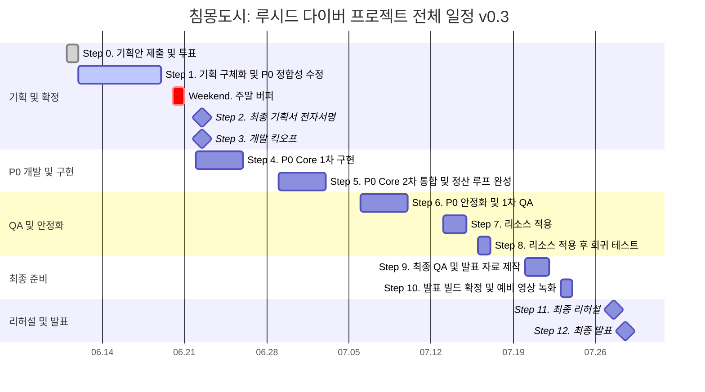

# 🗺️ 침몽도시: 루시드 다이버 - 프로젝트 일정표 구조 재정의안 v0.3

## 1. 일정표 작성 원칙

본 프로젝트 일정표는 하나의 표로 모든 정보를 표현하지 않습니다. 
전체 프로젝트 일정표, 주별 일정표, 일별 일정표를 분리하여 각각 다른 목적을 가진 관리 문서로 사용합니다.

### 📅 일정표 3단 구조 정의

| 문서 | 역할 | 상세도 | 사용 목적 |
| :--- | :--- | :---: | :--- |
| **전체 프로젝트 일정표** | 프로젝트 전체 흐름 관리 | 낮음 | 기획, 개발, QA, 발표까지의 큰 단계 확인 |
| **주별 일정표** | 주차별 마일스톤 관리 | 중간 | 각 주의 목표, 산출물, 완료 기준 확인 |
| **일별 일정표** | 팀원별 업무 진행 관리 | 높음 | 당일 작업, 담당자, 진행률, 이슈 확인 |

### ⚠️ P0.5 통제 규칙
P0.5 선택 구현은 P0 안정화 이후에만 착수합니다.

07.11 기준 P0 루프가 안정화되지 않은 경우:
- P0.5 선택 구현 전부 폐기
- 신규 기능 추가 금지
- 버그 수정 및 발표 안정화에만 집중

07.11 기준 P0 루프가 안정화된 경우:
- P0.5 항목 중 발표 효과가 큰 1~2개만 선택
- 선택 항목은 CP/PM 승인 후 진행

---

## 2. 전체 프로젝트 일정표

### 🎯 목적
전체 프로젝트 일정표는 프로젝트의 큰 흐름을 보여주는 상위 일정표입니다. 세부 업무를 전부 넣지 않고, 프로젝트의 단계와 주요 의사결정 지점(Milestone)을 직관적으로 보여주는 것을 목적성으로 삼습니다.

### 📊 전체 프로젝트 로드맵 간트차트 (Mermaid)

### 📋 전체 프로젝트 일정표 초안

| 단계 | 기간 | 단계명 | 핵심 목적 | 주요 산출물 | 상태 |
| :---: | :---: | :--- | :--- | :--- | :---: |
| **0** | 06.11 ~ 06.12 | 프로젝트 기획안 제출 및 투표 | 각자 프로젝트 기획안을 제출하고 투표를 통해 현재 프로젝트 채택 | 프로젝트 채택 결과 | 완료 |
| **1** | 06.12 ~ 06.19 | 기획 구체화 및 P0 정합성 수정 | CP 로드맵 기반으로 역할을 나누고 P0 범위 정합성 보완 | P0 통합 기획 완성본 | 진행 |
| **-** | 06.20 ~ 06.21 | 주말 버퍼 | 공식 작업 없음. 킥오프 전 최종 기획 검토만 허용 | 문서 검토 완료 | 예정 |
| **2** | 06.22 | 최종 기획서 전자서명 + 개발 킥오프 | 팀원 전자서명을 통해 P0 범위를 최종 고정하고 개발 착수 회의 진행 | 전자서명 완료본, 개발 티켓 | 예정 |
| **3** | 06.22 ~ 06.26 | P0 Core 1차 구현 | Unity 프로젝트 기본 씬 및 플레이어/적 전투 기본 루프 구현 | P0 Core 1차 구현 빌드 | 예정 |
| **4** | 06.29 ~ 07.03 | P0 Core 2차 통합 및 정산 루프 완성 | 결과 정산창 연동 및 창고/인벤토리, 동조율 상승 및 기록 해금 완성 | P0 루프 2차 통합 빌드 | 예정 |
| **5** | 07.06 ~ 07.10 | P0 안정화 및 1차 QA | 기능 연결 오류, 정산 수량 누락 및 리셋 오류 검수와 QA 진행 | QA 체크리스트, 안정화 빌드 | 예정 |
| **6** | 07.13 ~ 07.15 | 리소스 적용 | UI 비주얼, 이미지 시안, 사운드 및 가구/에셋 그래픽 교체 적용 | 리소스 반영 빌드 | 예정 |
| **7** | 07.16 ~ 07.17 | 리소스 적용 후 회귀 테스트 | 리소스 이식 후 발생한 비주얼 깨짐 및 연동 깨짐 검수 | 발표 후보 빌드 (RC) | 예정 |
| **8** | 07.20 ~ 07.22 | 최종 QA 및 발표 자료 제작 | 발표 빌드 반복 검수 및 발표 자료(PPT, 대본) 1차 완료 | PPT 초안, 최종 빌드 후보 | 예정 |
| **9** | 07.23 ~ 07.24 | 발표 빌드 확정 및 예비 영상 녹화 | 발표 시연 영상 예비 녹화 및 빌드 최종 백업 패키징 | 시연 녹화 영상, 최종 빌드 | 예정 |
| **10** | 07.27 | 최종 리허설 | 제한 시간 내 발표 및 예비 영상 대체 기동 점검 | 리허설 완료본 | 예정 |
| **11** | 07.28 | 최종 발표 | 프로젝트 발표 및 시연 질의응답 대응 | 최종 발표 완료 | 예정 |

### 📅 주말 버퍼 정책
- **공식 작업 없음**
- **긴급 수정 외 작업 금지** (문서 오탈자 교정 등만 허용)
- **신규 기능 아이디어 추가 금지** (기획 동결)
- 06.22 개발 킥오프를 위한 기존 문서 정독 및 사전 검토만 허용

### 🛠️ 전체 프로젝트 간트차트 표현 방식 (Draw.io / Visio 제작 기준)

Draw.io 또는 Visio에서는 세부 업무를 생략하고 아래의 도형 규칙을 적용하여 굵은 막대 중심으로 가시성을 확보합니다.

*   **긴 막대**: 하나의 프로젝트 단계 (Phase)
*   **다이아몬드**: 제출, 전자서명, 발표 등 고정 마일스톤 (Milestone)
*   **점선 막대**: 버퍼(Buffer), QA, 리허설 구간
*   **붉은 테두리 막대**: 일정 지연 시 프로젝트 크리티컬 패스(Critical Path) 위험 구간
*   **체크 아이콘 (✔️)**: 완료된 단계 표시

---

## 3. 주별 일정표

### 🎯 목적
주별 일정표는 각 주가 끝날 때 반드시 확인해야 하는 마일스톤과 완료 기준을 관리합니다. 팀원별 하루 단위 업무보다는 한 주 동안 도달해야 하는 목표치와 최종 산출물을 정의하는 데 집중합니다.

---

### 📅 0주차: 프로젝트 채택 및 킥오프 (06.11 ~ 06.12)

#### 📌 주간 목표 및 마일스톤
*   **주차 목표**: 프로젝트 채택 및 초기 역할 분배
*   **핵심 마일스톤**: `침몽도시: 루시드 다이버` 프로젝트 채택
*   **완료 기준**: 프로젝트 주제 확정 및 팀원별 1차 역할(R&R) 정리 완료
*   **주간 산출물**: 프로젝트 채택 결과, 초기 로드맵, 역할 분배 초안
*   **주간 점검일**: 06.12 (역할 및 로드맵 확인)

#### 📝 주요 작업 목록
| 작업 | 담당 | 완료 기준 |
| :--- | :---: | :--- |
| 각자 프로젝트 기획안 제출 | 전체 | 투표 가능한 형태의 기획안 제출 |
| 프로젝트 투표 진행 | 전체 | 최종 프로젝트 1개 선정 |
| CP 로드맵 확인 | CP / PM | 이후 일정표 작성 기준 확보 |
| 역할 체계 정리 | PM | CP, CD, PD, PM, TD 역할표 초안 작성 |

---

### 📅 1주차: 기획 구체화 / P0 정합성 수정 / 개발 티켓화 (06.12 ~ 06.19)

#### 📌 주간 목표 및 마일스톤
*   **주차 목표**: P0 정의서 기준 게임 기획서 완성본 제출 및 피드백 정합성 보완
*   **핵심 마일스톤**: 06.19 기획서 제출, 피드백 수령, 수정본 최종 제출
*   **추가 목표**:
    - P0 구현 명세 최종본 정리
    - P0-Core / P0.5 / 제외 항목 분리
    - 기억 파편 / 창고 / 인벤토리 정책 정합성 수정
    - 마나석 / 회복약 사용 규칙 확정
    - 퀵슬롯 2칸 확정
    - 결과창 정산 규칙 확정
    - 저장 데이터 목록 확정
    - 06.23~06.27 개발 작업 티켓 생성
*   **완료 기준**: 개발자가 06.22 개발 킥오프 이후 “무엇을 구현해야 하는지” 다시 질문하지 않아도 되는 상태 및 06.22 전자서명 준비 완료
*   **주간 산출물**: 게임 기획서 완성본, P0 정의서, 역할별 세부 기획서, 회의록
*   **주간 점검일**: 06.19 (피드백 반영 후 최종 제출 상태 확인)

#### 📝 주요 작업 목록
| 작업 | 담당 | 완료 기준 |
| :--- | :---: | :--- |
| P0 정의서 검토 | CP / PM | P0 범위와 제외 항목 정리 |
| 시스템 차별화 검토 | CD | 컨셉뿐 아니라 시스템적 차별화 포인트 정리 |
| 시나리오/세계관 정리 | PD | P0에서 실제로 사용될 대사와 기록 텍스트 우선 정리 |
| 일정표 초안 작성 | PM | 전체, 주별, 일별 일정표 구조 초안 작성 |
| 기술 구현 가능성 검토 | TD | P0 기능의 구현 난이도와 위험 요소 확인 |
| 기획서 제출 | 전체 / PM | 06.19 15:00 제출 |
| 피드백 반영 | 전체 | 06.19 20:50 수정본 제출 |

---

### 📅 주말 버퍼: 공식 작업 없음 (06.20 ~ 06.21)
06.20 ~ 06.21은 주말이므로 공식 작업일에서 제외합니다.

- **운영 규칙**:
  - 공식 개발 작업 없음
  - 신규 기능 제안 금지
  - P0 범위 변경 금지
  - 긴급 오탈자 수정 및 문서 열람만 허용
  - 06.22 개발 킥오프 전 최종 확인용 버퍼로 사용

---

### 📅 2주차: 최종 기획 확정 및 P0 Core 1차 구현 (06.22 ~ 06.26)

#### 📌 주간 목표 및 마일스톤
*   **주간 목표**: 최종 기획서 전자서명 후 P0 Core 1차 구현을 시작합니다.
*   **핵심 마일스톤**:
    - 06.22 최종 기획서 전자서명
    - 06.22 개발 킥오프
    - 06.26 P0 Core 1차 구현 점검
*   **완료 기준**: 임시 리소스라도 아래의 플레이 루프 플로우가 최소 1회 깨짐 없이 연결되어야 합니다:
    - `로비 → 출격 → GameScene → 아이템 획득 카운트 → 전화부스 탈출 성공 또는 HP 0 실패 → 결과창 → 로비 복귀`
*   **주간 산출물**: 전자서명 완료본, Unity 프로젝트 구조, 1차 구현 작업 보드 및 임시 연결 빌드
*   **주간 점검일**: 06.26 (1차 플레이어블 및 씬 전환 흐름 검수)

#### 📝 주요 작업 목록
| 작업 | 담당 | 완료 기준 |
| :--- | :---: | :--- |
| 최종 기획서 전자서명 및 킥오프 | 전체 | 팀원 전체 수기 또는 전자 서명 완료 및 개발 티켓 할당 |
| Unity 프로젝트 세팅 | TD | 씬 구조(Lobby, GameScene, Result), 폴더, Git 구조 생성 |
| Data & Manager 기초 구현 | TD | PersistentDataManager 세팅, SessionLootData 선언, ResultManager 골격 생성 |
| 씬 전환 제어 구현 | TD | 로비 → GameScene 진입 및 GameScene → 결과창 출력, 결과창 → 로비 복귀 |
| 세션 변수 전달 구현 | TD | 성공/실패 여부(bool) 및 기억 파편/마나석/회복약 세션 임시 획득 수량 전달 연동 |
| 대사/텍스트 리소스 목록화 | PD | 기본 튜토리얼 및 성패 분기용 캐릭터 반말/구어체 대사 목록 정리 |
| 리소스 요구사항 정리 | CD / PM | P0에 필요한 임시/확정 리소스 규격 목록 정리 |

---

### 📅 3주차: P0 Core 2차 통합 및 정산 루프 완성 (06.29 ~ 07.03)

#### 📌 주간 목표 및 마일스톤
*   **주간 목표**: 1차 구현된 P0 Core를 바탕으로 보상 정산, 동조율, 기록 해금, 창고 저장, 다음 출격 준비를 유기적으로 연결합니다.
*   **핵심 마일스톤**: P0 Core 2차 통합 및 정산 루프 완성
*   **완료 기준**: 성공 루트와 실패 루트가 각각 명세에 맞춰 정상 정산 및 로비와 데이터 연동이 완료되어야 합니다.
    - **성공 루트**: 기억 파편 획득 후 탈출 성공 → 결과 정산창에서 기억 파편 전량 소모 및 동조율 상승(레벨업 시 개인 심상 기록 01 해금) → 마나석/회복약 창고 누적 저장 → 로비 복귀 후 다이버/기록 메뉴에서 확인 및 창고 확인/장착 연동.
    - **실패 루트**: 아이템 획득 후 HP 0 실패 → 강제 각성 결과창 출력 → 세션 획득물 전부 유실 처리 → 동조율 변화 없음, 기록 해금 없음, 창고 수량 변화 없음 검증.
*   **주간 산출물**: P0 루프 2차 통합 빌드
*   **주간 점검일**: 07.03 (성공/실패 분기 정산 시나리오 테스트)

#### 📝 주요 작업 목록
| 작업 | 담당 | 완료 기준 |
| :--- | :---: | :--- |
| 기억 파편 즉시 소모 처리 | TD | 창고 보관을 전면 제외하고 결과창에서 즉시 전량 소모 연동 |
| 동조율 상승 및 기록 해금 | TD / PM | 소모된 파편만큼 동조율 경험치를 가산하고 레벨업 시 `memoryLogUnlocked` 활성화 |
| 다이버/기록 메뉴 열람 처리 | TD / PD | 로비 다이버 기록 메뉴 진입 시 해금된 개인 심상 기록 01 본문 스크롤 열람 구현 |
| 소모품 창고 누적 저장 처리 | TD | 세션 성공 시 획득한 마나석/회복약을 `stored~Count` 창고 누적치에 합산 |
| 퀵슬롯 장착 및 반입 구현 | TD / PM | 창고/출격 준비 화면에서 마나석/회복약을 소지 퀵슬롯 2칸에 배치 및 다음 출격 시 세션 반입 연동 |
| 소비 기물 사용 기능 구현 | TD | 세션 플레이 중 퀵슬롯을 통해 회복약(HP 회복), 마나석(마나 회복) 사용 로직 구현 |
| 결과창 UI 및 텍스트 맵핑 | PM / TD | 정산 수치 및 성공/실패 시의 전용 대사 UI 연동 |

---

### 📅 4주차: P0 안정화 및 1차 QA (07.06 ~ 07.10)

#### 📌 주간 목표 및 마일스톤
*   **주차 목표**: P0 핵심 루프의 반복 테스트 및 오류 수정
*   **핵심 마일스톤**: P0 루프 안정화 및 1차 QA 완료
*   **완료 기준**: P0 핵심 루프를 연속 3회 이상 플레이해도 치명 오류(크래시, 데이터 누락, 연동 해제 등) 없이 완료되어야 합니다.
*   **필수 테스트 케이스**:
    1. 기억 파편 획득 후 탈출 성공 시의 정산 및 동조율 상승, 로비 연동 확인
    2. 마나석/회복약 획득 후 탈출 성공 시의 창고 누적 확인
    3. 기억 파편/마나석/회복약 획득 후 인게임 HP 0 사망 시 획득물 전체 소실 확인
    4. 창고에서 소비 기물 장착 후 다음 출격 시 인게임 퀵슬롯에 정상 로드되는지 확인
    5. 인게임에서 소모품(회복약/마나석) 사용 시 실시간 수치 변화 및 소모 처리 확인
    6. 결과창에서 로비로 복귀한 후 저장 데이터(`SaveData`)의 데이터 일치 여부 확인
*   **P0.5 착수 조건**:
    - 07.10 기준 P0 루프 안정화 실패 시: P0.5 선택 구현은 전면 폐기하고 버그 수정에만 집중합니다.
    - 07.10 기준 P0 루프 안정화 성공 시: P0.5 항목 중 발표 효과가 극대화되는 1~2개 항목만 선택해 구현합니다.
*   **주간 산출물**: QA 테스트 시나리오 문서, 버그 수정 대장, 1차 안정화 빌드
*   **주간 점검일**: 07.10 (테스트 케이스 통과 통계 확인 및 버그 락킹)

---

### 📅 5주차: 리소스 적용 및 회귀 테스트 (07.13 ~ 07.17)

#### 📌 주간 목표 및 마일스톤
*   **주차 목표**: 임시 리소스를 실제 비주얼/사운드/대사 에셋으로 교체하고, 이식으로 인한 버그 검수 진행
*   **핵심 마일스톤**:
    - 07.13 ~ 07.15 : 리소스 적용
    - 07.16 ~ 07.17 : 리소스 적용 후 회귀 테스트 (발표 후보 빌드 RC 확정)
*   **완료 기준**: 리소스 적용 후에도 P0 루프 및 데이터 연동이 깨지지 않고 정상 구동되어야 합니다.
*   **추가 규칙 (기능 동결)**:
    - 07.17 이후 UI 구조 변경 및 신규 기능 추가를 전면 금지합니다.
    - 07.17 이후 허용되는 수정 작업은 다음과 같이 제한됩니다:
      - 텍스트 오탈자 수정
      - 아이콘/이미지 해상도 및 일부 에셋 교체
      - 사운드 볼륨/이펙트 밸런스 조정
      - 경미한 버그 수정
      - 시연 동선 안정화를 위한 긴급 버그 수정
*   **주간 산출물**: 리소스 마이그레이션 문서, 회귀 테스트 일지, 발표 후보 빌드 (RC)
*   **주간 점검일**: 07.17 (리소스 완료본 최종 플레이 점검)

#### 📝 주요 작업 목록
| 작업 | 담당 | 완료 기준 |
| :--- | :---: | :--- |
| 로비 비주얼/배경 적용 | CD / TD | 메인 다이버 일러스트, 기지 배경, 로비 메인 UI 스킨 최종 적용 |
| 아이템 및 HUD UI 리소스 적용 | CD / TD | 아이템 3종 고유 아이콘, HUD 체력/마나 바 및 퀵슬롯 UI 스킨 적용 |
| 사운드 및 이펙트 적용 | TD / CD | 획득, 피격, 탈출, 결과창 정산음 및 UI 클릭 효과음 밸런싱 적용 |
| 시나리오 대사 최신화 | PD / TD | 인게임 상황별 구어체 대사 및 해금 심상 기록 01 본문 텍스트 연동 |
| 적용 후 회귀 테스트 | 전체 | 에셋 교체 시 발생한 UI 좌표 깨짐, 스크립트 참조 누락 버그 일괄 수정 |

---

### 📅 6주차: 최종 QA / 발표 자료 제작 / 발표 빌드 확정 (07.20 ~ 07.24)

#### 📌 주간 목표 및 마일스톤
*   **주간 목표**: 발표 빌드를 최종 확정하고, 만일의 사태를 대비한 시연 녹화 영상 제작 및 발표 자료 완성
*   **핵심 마일스톤**:
    - 07.20 ~ 07.22 : 최종 QA 및 발표 자료 제작
    - 07.23 ~ 07.24 : 발표 빌드 확정 / 예비 영상 녹화 / PPT 마감
*   **완료 기준**: 시연 빌드가 발표 장비에서 정상 구동됨을 확정하고, 발표 슬라이드 및 시연 영상 백업이 마무리되어야 합니다.
*   **예비 영상 녹화 리스트**:
    - 성공 루트 풀플레이 시연 영상 (기억 파편 회수 → 탈출 → 로비 복귀 → 심상 기록 해금 열람)
    - 실패 루트 플레이 시연 영상 (HP 0 사망 → 결과창 소실 처리 → 로비 복귀)
    - 창고 및 준비 화면에서의 소비 기물 퀵슬롯 장착/반입 시연 영상
*   **주간 산출물**: 확정 발표 빌드, PPT 최종본, 시연 동선별 녹화 영상, 발표자 대본
*   **주간 점검일**: 07.24 (PPT 및 영상 취합 상태 점검)

---

### 📅 7주차: 리허설 및 최종 발표 (07.27 ~ 07.28)

#### 📌 주간 목표 및 마일스톤
*   **주차 목표**: 발표 및 질의응답 대응 최종 훈련
*   **핵심 마일스톤**: 07.27 최종 리허설, 07.28 최종 발표 진행
*   **리허설 완료 기준**:
    - 발표 시간 초과 여부 확인 (시간 내 마무리 체크)
    - 메인 빌드 실행 및 시연 동선 오작동 체크
    - 네트워크 끊김이나 장비 오류 시 예비 빌드/예비 영상 재생 전환 작동 확인
    - 질의응답 리스트업 및 역할별 답변자 분배 훈련 완료
*   **주간 산출물**: 최종 발표 및 피드백 회고서
*   **주간 점검일**: 07.27 (리허설 현장 최종 점검)

---

## 4. 일별 일정표

### 🎯 목적
일별 일정표는 팀원별 세부 작업과 진행 상태를 실시간으로 추적하는 가장 상세한 관리표입니다. 당일 진행하는 세부 작업 내용, 완료 기준, 블로커(이슈), 다음 액션을 명시하여 매일 스크럼에서 사용합니다.

### 📋 일별 일정표 기본 양식

| 날짜 | 담당자 | 직책 | 오늘 작업 | 완료 기준 | 상태 | 이슈 | 다음 액션 |
| :---: | :---: | :---: | :--- | :--- | :---: | :--- | :--- |
| YYYY.MM.DD | 이름 | 역할 | 구체적인 오늘 작업 내용 | 작업의 완료를 정의하는 정량적/정성적 기준 | 예정 / 진행 / 완료 / 지연 | 기술/리소스 등 병목 요인 | 명일 작업 예정 항목 |

---

### 📋 06.12 일별 일정표 (실제 진행)

| 날짜 | 담당자 | 역할 | 오늘 작업 | 완료 기준 | 상태 | 이슈 | 다음 액션 |
| :---: | :---: | :---: | :--- | :--- | :---: | :--- | :--- |
| 06.12 | 장수영 | 레벨 기획 (팀장) | 문서 저장소 세팅 및 1차 프로토타입 맵 기획 | SSOT 디렉토리 구조 수립, 상가 구역 레벨 기획 v2.0 완성 | 완료 | - | 팀원 기획서 수집 및 피드백 준비 |
| 06.12 | 우성혁 | 시스템 기획 | 최소 플레이 루프 기반 시스템 기획 초안 작성 | 시스템 기획 v0.02 작성 및 R&R 업무 회의 참여 | 완료 | - | 피드백 반영 및 시스템 기획 고도화 |
| 06.12 | 김남해 | 시나리오 기획 | 시나리오 및 세계관 기획서 초안 작성 | 게임 규칙에 부합하는 세계관 설정 명세 v1.00 작성 | 완료 | - | 세계관 디테일 고도화 및 용어 연동 |
| 06.12 | 송예찬 | 컨셉 기획 | 프로젝트 기획 세분화 및 컨셉 기획서 작성 | 컨셉 기획 요약본 v0.5 및 프로토타입 기획서 초안 md 연동 | 완료 | - | 기획 확인 필요 항목 정리 및 팀 공유 |
| 06.12 | 강다영 | 개발 | Git 레포지토리 세팅 및 개발 컨벤션 정의 | 원격 저장소 개설(LFS/gitignore), Notion 아키텍쳐 정의서 작성 | 완료 | - | 기획 확정 후 프로토타입 개발 일정 계획 |

---

### 📋 06.15 일별 일정표 (실제 진행)

| 날짜 | 담당자 | 역할 | 오늘 작업 | 완료 기준 | 상태 | 이슈 | 다음 액션 |
| :---: | :---: | :---: | :--- | :--- | :---: | :--- | :--- |
| 06.15 | 장수영 | 레벨 기획 (팀장) | 기획 정합성 조율 회의 주도 및 테스트 맵 기획 | 마나 통합/사망 패널티 등 5대 요소 합의, 테스트 맵 기획서 작성 | 완료 | - | 팀원 기획 수정본 검수 및 피드백 |
| 06.15 | 우성혁 | 시스템 기획 | 프로토타입 및 확장 명세 시스템 기획서 업데이트 | v0.05(프로토타입) 및 v1.01(확장 명세) 시스템 기획서 작성 | 완료 | - | 피드백 바탕 시스템 기획서 고도화 |
| 06.15 | 김남해 | 시나리오 기획 | 시나리오 및 세계관 기획서 개정 (v1.02) | 1+2 스쿼드 편제 및 관제자-다이버 스토리 설정 보완 | 완료 | - | 타 기획 문서와의 용어 정합성 검증 |
| 06.15 | 송예찬 | 컨셉 기획 | 기획 합의안 반영 및 방어구 컨셉 기획서 작성 | 가챠 BM 폐지 반영, 권총 단일화 예외 표시, 방어구 기획서 작성 | 완료 | - | 외부 피드백 자료 분석 및 기획 학습 |
| 06.15 | 강다영 | 개발 | 플레이어 이동 구현 및 아이템 데이터 로드 구축 | DemoScene 생성, 이동 로직 구현, 아이템 파서 및 무기 장착 구현 | 완료 | - | 적 시스템 개발 및 AI 추적 구현 |

---

### 📋 06.16 일별 일정표 (실제 진행)

| 날짜 | 담당자 | 역할 | 오늘 작업 | 완료 기준 | 상태 | 이슈 | 다음 액션 |
| :---: | :---: | :---: | :--- | :--- | :---: | :--- | :--- |
| 06.16 | 장수영 | 레벨 기획 (팀장) | 문서 위계 정비, P0/P0.5 분류 및 격리 검수 폴더 구축 | 마스터-SSOT 문서 위계 설정, 전투 기믹 P0.5 격하, 검수전 폴더 이관 | 완료 | 레퍼런스 분석으로 회의 순연 | 검수전 수정안 대상 각 담당자 검수 싱크 |
| 06.16 | 우성혁 | 시스템 기획 | 통합 시스템 기획서 업데이트 및 외부 레퍼런스 파악 | [프로토타입 제외/전용] 태그 분리 통합본(v1.04) 작성 | 완료 | - | 로비 허브 UI 동작 기획 추가 |
| 06.16 | 김남해 | 시나리오 기획 | 기획 문서 교차 검증 및 맵 디자인 에셋 리서치 | 시나리오 기획서 v1.02 최종 확정, 에셋 스토어 후보군 리스트업 | 완료 | - | 에셋 기반 맵 화이트박싱 레벨 디자인 제작 |
| 06.16 | 송예찬 | 컨셉 기획 | 캐릭터 피드백 반영 및 원화 이미지 생성, 원안 기획 | '한서윤' 기획 추가, AI 원화 이미지 6종 추가 및 원화 기획서 작성 | 완료 | - | 세계관 설정 보완 및 프롤로그 시나리오 기획 |
| 06.16 | 강다영 | 개발 | 전체 코드 리팩토링 및 체력/피격/AI 추적 구현 | 데미지 연산 및 빌보드 체력 바 구현, 적의 플레이어 AI 추적 구현 | 완료 | - | 사격 마나 소비 연동 및 탄창 초기화 보완 |

---

### 📋 06.17 일별 일정표 (실제 진행)

| 날짜 | 담당자 | 역할 | 오늘 작업 | 완료 기준 | 상태 | 이슈 | 다음 액션 |
| :---: | :---: | :---: | :--- | :--- | :---: | :--- | :--- |
| 06.17 | 장수영 | 레벨 기획 (팀장) | P0 정의서 확정, 로비 UI 명세 보완 및 결과창 GUI 제작 | 최종 P0 정의서 수립, 로비 UI 플로우 리소스 네이밍 교정 및 GUI 제작 | 완료 | - | 로비 UI 설계안 개발팀 공유 및 변수 싱크 |
| 06.17 | 우성혁 | 시스템 기획 | 서사 요소를 위한 시스템 반영 및 기획서 고도화 | 시스템 기획서 v1.05 작성 (서사 요소 시스템 추가 및 제외 사양 명시) | 완료 | - | 로비 UI 동작 기획 추가 및 P0 기획 고도화 |
| 06.17 | 김남해 | 시나리오 기획 | 세계관/시나리오 개연성 명세 보강 | 세계관 개연성 보강(v1.11) 및 프롤로그 시나리오 기획서(v1.13) 작성 | 완료 | - | 맵 에셋 활용 씬 빌드업 지원 |
| 06.17 | 송예찬 | 컨셉 기획 | 채린 심층 기획 및 보이스 라인 신설, 비주얼 요구사항 작성 | 채린 9개 세션 보이스 라인 및 사이드 스토리 초안 작성, 리소스 요구 명세 | 완료 | - | 기획서 최종 마감본 정리 및 검수 요청 |
| 06.17 | 강다영 | 개발 | P0 기능 구현 가능성 검토 및 조작/인벤토리 연동 개발 | 개발 가능성 검토표 작성, 인벤토리 드래그 앤 드롭 아이템 장착 구현 진행 | 완료 | - | 인게임-인벤토리 데이터 및 로비 연동 작업 |

---

### 📋 06.18 일별 일정표 (실제 진행)

| 날짜 | 담당자 | 역할 | 오늘 작업 | 완료 기준 | 상태 | 이슈 | 다음 액션 |
| :---: | :---: | :---: | :--- | :--- | :---: | :--- | :--- |
| 06.18 | 장수영 | 레벨 기획 / PM | P0 구현 명세 정합성 검수 및 일정표 v0.3 수정 방향 확정 | P0-Core/P0.5/제외 항목 분리 기준 확정, 일정표 수정 지시 완료 | 진행 | 주말 작업 불가로 일정 재배치 필요 | 06.19 제출 전 문서 최종 검수 |
| 06.18 | 우성혁 | 시스템 기획 | P0 시스템 기획서 내 기억 파편/창고/인벤토리 정합성 수정 | 기억 파편 비축 불가, 자동 소모, 동조율 상승 규칙 반영 | 진행 | 기존 인벤토리/기억 파편 문구 충돌 | P0 시스템 기획서 v0.02 생성 |
| 06.18 | 김남해 | 시나리오 기획 | 개인 심상 기록 01 본문 및 귀환 대사 확정 | 기록 01 본문, 성공/실패/해금 대사 최소 세트 작성 | 예정 | 시스템 용어와 시나리오 용어 정합 필요 | PD 텍스트 리소스 목록 공유 |
| 06.18 | 송예찬 | 컨셉 기획 | 기억 파편/마나석/회복약 UI 리소스 요구사항 정리 | 아이콘, 결과창, 창고/인벤토리 화면 리소스 요구사항 정리 | 예정 | 기억 파편이 로비 재화처럼 보이지 않게 수정 필요 | CD 리소스 목록 공유 |
| 06.18 | 강다영 | 개발 | 06.22 개발 킥오프 대비 P0 구현 위험 요소 검토 | 씬 전환, 세션 데이터, 결과 정산, 저장 데이터 위험 항목 정리 | 예정 | 개발 착수 전 명세 확정 필요 | 06.22 작업 티켓 수령 후 구현 착수 |

---

### 📋 06.19 일별 일정표 (실제 진행)

| 날짜 | 담당자 | 역할 | 오늘 작업 | 완료 기준 | 상태 | 이슈 | 다음 액션 |
| :---: | :---: | :---: | :--- | :--- | :---: | :--- | :--- |
| 06.19 | 장수영 | 레벨 기획 / PM | P0 통합 기획서/PPT 소개서 제작 및 코치 피드백 반영, 팀 일정 회의 주도 | 통합 기획서 및 소개서 최종 제출 완료, 2~7주차 스프린트 로드맵 확정 | 완료 | 일정 비현실성 문제 (전체 팀원 의견 조율 및 기능-비주얼 분리 적용으로 해결) | 06.22 최종 기획서 전자서명 및 개발 킥오프 참석 |
| 06.19 | 우성혁 | 시스템 기획 | P0 시스템 명세서(기억 파편/창고/UI 등) 정합성 수정 및 예외 항목 정리 | [01_P0_시스템_명세서.md](file:///c:/GitHubProjects/Document_LucidDiver/Document_LucidDiver/LucidDiver_Document/01_SSOT_최종_기준문서/01_P0_시스템_명세서.md) 수정본 제출 완료 | 완료 | 기존 인벤토리 및 기억 파편 문구 충돌 (SSOT 문서 동기화 반영으로 해결) | 06.22 최종 P0 기획 문서 서명 및 탈출 기능 구현 진행 |
| 06.19 | 김남해 | 시나리오 기획 | 에셋 구매 요청서 내 유료 에셋 필요 사유 명세 고도화 및 추가 필요 에셋 리서치 | 구매 사유(디테일, 최적화 등)가 포함된 에셋 구매 요청서 작성 완료 | 완료 | 없음 | 에셋 후보군 실적용 가능 여부 검토 및 테스트 씬 배치 시작 |
| 06.19 | 송예찬 | 컨셉 기획 | 문서 버전 관리 가이드 수립, 일정표 평일 기준 타임라인 조정, 채린 대사 간결화 및 설정 수정 | 버전 관리 가이드 배포, [03_P0_일정표.md](file:///c:/GitHubProjects/Document_LucidDiver/Document_LucidDiver/LucidDiver_Document/01_SSOT_최종_기준문서/03_P0_일정표.md) 일정 조정, 대사(30% 축소) 및 패시브 설정 수정 반영 완료 | 완료 | 튜토리얼 변경점에 따른 캐릭터 미숙함 묘사 누수 (권총 대사 추가 및 반응 묘사 수정으로 해결) | 최종 릴리즈 정합성 회의 결과 정리 및 개발팀 빌드 점검 보조 |
| 06.19 | 강다영 | 개발 | 인벤토리-퀵슬롯 데이터 이동 및 UI 수량 표기 연동 구현, 스프린트 로드맵 조율 | 인벤토리-퀵슬롯 간 정상적인 아이템 이동 및 수량 표기 연동 완료 | 완료 | 없음 | 완성된 게임 씬 피드백 보완 및 로비씬 기본 뼈대 작업 착수 |

---

## 📜 Revision History

| 날짜 | 버전 | 내용 | 작성자 |
| :---: | :---: | :--- | :---: |
| 2026-06-18 | v0.1 | - 프로젝트 일정표 구조 재정의안 초안 작성 - 3단 구조 정의 및 주간/일별 작업표 명세화 - Mermaid Gantt 차트 추가 및 Draw.io 페이지 구성 추천 레이아웃 삽입 | Antigravity |
| 2026-06-18 | v0.2 | - 각 팀원별 실제 개발일지 및 스크럼 로그를 교차 분석하여 전체 일정 정합성 검증 - 06.12 ~ 06.18(오늘)까지의 실제 팀원별 작업 현황 및 완료 기준을 일별 일정표로 신규 반영 | Antigravity |
| 2026-06-18 | v0.3 | 06.20~06.21 주말 버퍼 반영, 06.22 전자서명+개발 킥오프 구조로 수정, P0 Core 1차/2차 통합 일정 재정의, 리소스 적용 후 회귀 테스트 구간 추가, P0.5 착수 조건 및 기능 동결 규칙 추가, 06.18~06.19 일별 작업표 보강 | Antigravity |
