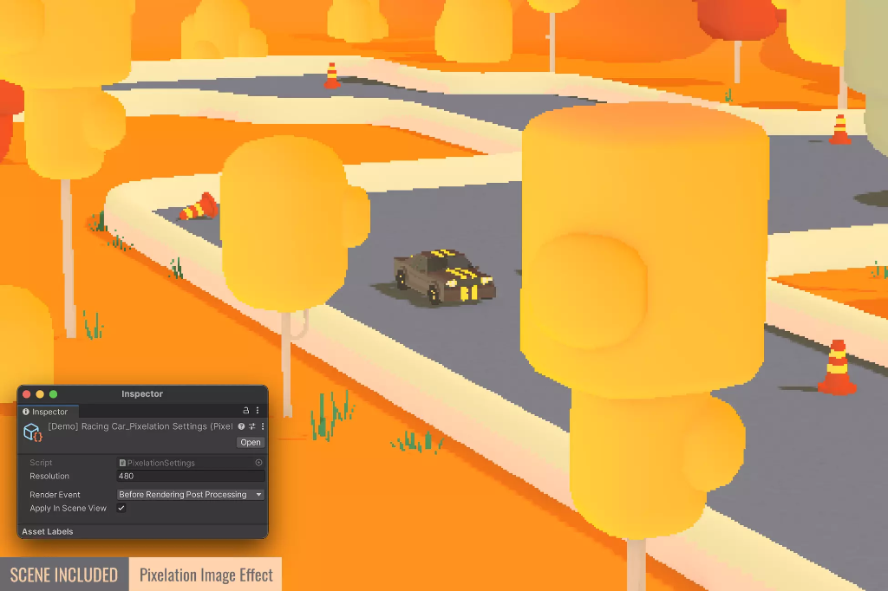
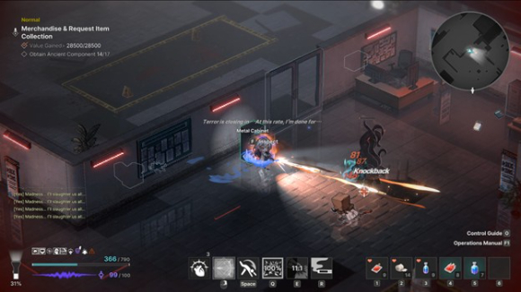

# 베타빌드_통합_정의서

## 0. 기획 의도 (Design Intent)
* **목표**: P0 및 P0.5 단계에서 검증된 게임 루프에 아트/오디오 자원을 적용하고 비주얼/오디오 피드백을 강화하여 빌드의 완성도 및 사용성(UX)을 향상시킨다.
* **핵심 가치**: 툰 셰이더와 단일화된 사운드 재생 환경, 직관적인 손전등 시야 각도를 통해 2.5D PvE 익스트랙션의 비주얼 톤을 일관성 있게 전달한다.

---

## 1. 개요 (Overview)

| 항목 | 내용 |
| :--- | :--- |
| **기능명** | 베타 빌드 통합 컨셉 및 연동 스코프 정의 |
| **담당자** | 기획: 우성혁, 장수영 / 개발: 강다영 |
| **우선순위** | P1 (필수) |
| **상태** | 확정 |

---

## 2. 베타 빌드 스코프 및 완료 기준 (DoD)

베타 빌드에서 추가/변경되는 시스템 및 완료 조건은 다음과 같다.

| 시스템 분류 | 주요 구현 사양 | 완료 기준 (DoD) |
| :--- | :--- | :--- |
| **오디오 (Audio)** | - BGM 3단계 동적 전환 (탐색 ➡️ 긴장 ➡️ 위험) - 58종의 SFX 리소스 이식 및 FMOD Studio 연동 | - FMOD Studio 라이브러리를 통해 빌드 런타임에 SFX 58종이 정상 출력됨. - 게임 상황별(어그로 여부) BGM 전환이 연동됨. |
| **오디오 Fallback** | - FMOD 연동 지연 발생 시 대응을 위한 **단일 BGM 구성** | - FMOD 연동에 기술적 병목이 발생할 경우, Unity 내장 `AudioSource`를 이용해 지정된 1곡의 BGM이 무한 루프 재생되도록 즉시 롤백 적용됨. |
| **그래픽 (Graphics)** | - 3D 배경 **툰 셰이더 (Toon Shader)** 및 세미 픽셀화 렌더링 적용 | - Flat Kit 라이브러리를 URP 셰이더에 적용하여 3D 배경에 외곽선(Outline) 및 셀 셰이딩이 출력됨. - 해상도 보정을 통해 2D 캐릭터와 어울리는 세미 픽셀화 감성이 렌더링됨. |
| **인게임 (Gameplay)** | - **플레이어 원추형 시야 제한 및 손전등 광원 피드백** 구현 | - 플레이어 정면 부채꼴 영역 외부의 적/상호작용 기물이 화면에 보이지 않도록 컬링 및 마스킹 처리됨. - 플레이어 정면에 손전등 빔 형태의 광원 시각 효과가 매핑됨. |
| **UI 고도화** | - **정식 UI 리소스 교체 및 통합 디자인 검수** | - 모든 임시 와이어프레임 UI가 정식 톤앤매너 리소스로 100% 교체됨. - 패널 간 알파 투명도, 폰트 통일성, 정렬 레이어가 UI 디자인 룰에 맞게 검수 완료됨. |
| **인게임 밸런싱** | - **전투 데이터 및 스폰/드롭 확률 밸런싱** | - 캐릭터 기본 스펙(HP/MP) 및 무기 연사력 수치가 기획 의도에 맞게 적용됨. - 17개 포인트의 스폰 밀도와 등급별 아티팩트 상자 드롭 테이블이 Excel 연동 데이터와 일치함. |
| **레벨 디자인** | - **3D 마트 레벨 패스 최적화 및 조명 고도화** | - AI 캐릭터의 순찰 경로(NavMesh)에서 지형 끼임(Stuck) 현상이 발견되지 않음. - 손전등 플레이가 돋보이도록 마트 내부의 전반적인 환경 조명 광도가 어둡게 조율됨. |
| **서브컬처 교감** | - **로비 WebP 루프 및 동조율 기반 터치 피드백** 구현 | - 로비 메인 다이버가 투명 WebP 루프로 정상 재생됨. - 캐릭터 터치 시 현재 동조율 레벨(Lv.0 ~ 2)에 부합하는 대사 텍스트가 말풍선에 3.0초간 출력됨. |
| **인트로 시스템** | - **최초 기동 세계관 인트로 컷씬 및 스킵** 연동 | - 최초 실행 여부 세이브 플래그(`isFirstPlay`) 검사를 통해 최초 1회만 인트로 컷씬(CG 및 내레이션 타이핑)이 재생됨. - 스킵(Skip) 선택 시 즉시 세이브를 갱신하고 로비 씬으로 강제 전환됨. |
| **튜토리얼** | - **기초 조작 및 코어 루프 학습용 튜토리얼** 구현 | - 최초 씬 진입 시 튜토리얼 세션으로 분기되며 이동, MP 사격, 파밍, 포탈 탈출 가이드가 정상 동작함. - 미션 완료 시 `isTutorialCompleted` 세이브 플래그가 저장되고 로비로 복귀함. |

---

## 3. 구현 항목별 세부 컨셉 및 목표 연출

### 3.1 인게임 오디오 및 리스크 대비용 단일 BGM
* **FMOD 기반 동적 BGM**: 
  * 인게임 플레이어의 위기/대치 상태에 반응하여 사운드 트랙이 변화하도록 처리한다.
  * 평상시 탐색 상태(Exploration), 적에게 발각되어 대치 중인 상태(Tension), 그리고 캐릭터 체력 또는 남은 제한시간이 극소량으로 떨어졌을 때의 긴박한 상태(Danger)에 맞춰 배경음악의 연출 트랙 수 및 악기 구성이 실시간으로 교차 전환(Cross-fade)되도록 구현한다.
* **리스크 관리용 단일 BGM Fallback**:
  * FMOD Studio 연동에 따른 개발 지연을 대비하기 위한 대안으로, 기술적 병목이 식별될 경우 다이내믹 믹싱을 생략하고 Unity 기본 AudioSource를 이용해 제작된 1곡의 BGM 루프만을 재생하여 사운드 재생 안정성을 확보한다.

### 3.2 툰 셰이더 기반 3D 레벨 및 세미 픽셀화 그래픽
* **툰 셰이더 (Toon Shader - Flat Kit)**:
  * 마트 내부 레벨(3D 지형)의 입체감과 2D 캐릭터 스프라이트 애니메이션이 시각적으로 조화롭게 묶이도록 처리한다.
  * 3D 레벨 메쉬 표면에 만화적인 느낌의 검은색 외곽선(Outline)과 2단계 명암 경계가 뚜렷한 셀 셰이딩(Cel Shading)을 적용하여 그래픽 이질감을 해소한다.
* **해상도 세미 픽셀화**:
  * URP Post Processing 연동을 통해 게임 화면 렌더링 해상도를 강제로 낮춰 픽셀 격자 무늬(Semi-pixelated style)를 유도한다. 이를 통해 복고풍 서브컬처 분위기를 화면 전체에 고르게 연출한다.

*그림 2. 툰 셰이더 및 포스트 프로세싱 픽셀화 렌더링 적용 화면 예시*

### 3.3 플레이어 시야 제한 및 손전등 시각적 피드백
* **원추형 시야각 제한 (Fog of War)**:
  * 어두운 꿈의 도시 탐색이라는 공간적 컨셉을 극대화하기 위해, 플레이어가 서 있는 정면 부채꼴 영역 외곽의 사각지대는 완전히 시야를 제한(어둡게 마스킹)하여 적이나 파밍 박스 등의 주요 피사체를 화면에서 숨긴다.
* **손전등(Flashlight) 광원 및 마스킹 연동**:
  * 플레이어가 조준하는 마우스 방향을 향해 부채꼴 형태로 비춰지는 손전등 광선 빔(Spot Light/Volumetric Beam) 시각 효과를 적용한다.
  * 실시간으로 이 손전등 빛이 닿는 각도 및 거리 영역 내부에 진입한 대상(적, 파밍 오브젝트 등)만 화면에 정상적으로 렌더링하고, 광선 밖으로 이탈하면 실시간으로 컬링 및 마스킹 처리하여 긴장감을 전달한다.

*그림 1. 플레이어 전방 손전등 부채꼴 광원 연출 및 시야 외곽 영역 어두운 마스킹 처리 예시*

### 3.4 정식 UI 리소스 교체 및 디자인 검수
* **임시 에셋 전면 교체**:
  * 개발용 목업 와이어프레임으로 채워져 있던 로비, 캐릭터 관리, 인벤토리 창고, 인게임 HUD를 정식 리소스로 전면 교체한다.
  * 등급별 슬롯 배경(일반, 레어, 에픽), 아이템 정보 팝업창 등 통일된 서브컬처 UI 프레임을 갖춘다.
* **디자인 일관성 및 정렬 레이어 검수**:
  * 모든 UI 팝업 창의 불투명도(Alpha Transparency), 여백(Padding), 폰트 크기 및 색상을 최종 디자인 가이드라인에 맞춘다.
  * 알파 테스트 중 발견되었던 UI 중첩 시 오작동(예: 결과창 출력 중 인벤토리 오픈 등)이 없도록 렌더링 순서와 차단 영역을 엄격히 검수한다.

### 3.5 전투 데이터 및 드롭률 밸런싱
* **전투 조작 계수 미세 조정**:
  * 플레이어 캐릭터의 생존 및 전투 주기를 튜닝한다. 캐릭터의 최대 HP/MP, 초당 자연 마나 회복 속도, 기본 이동 및 달리기 속도를 데이터 기반으로 보정하여 답답하지 않은 속도감을 유도한다.
  * 본 게임은 별도의 탄창/재장전 시스템 없이 **오로지 MP(마나) 소모 기반으로 작동**하며, 사용할 수 있는 무기는 **단일 종류의 권총(Pistol)**으로 제한된다. 이에 따라 권총의 **연사 속도(연사력), 발당 MP 소모량, 단발 공격력**을 핵심 밸런스 지표로 두고 수치를 조율한다.
* **스폰 및 파밍 드롭 가중치 설정**:
  * 마트 내부의 17개 스폰 구역별로 몬스터 난이도 밀도(일반, 엘리트, 보스) 가중치를 조절한다.
  * 상자 등급별 아티팩트 드롭률 테이블 수치를 Excel-JSON 파이프라인으로 일괄 로드 및 연동되도록 셋업한다.

### 3.6 레벨 디자인 및 조명 환경 고도화
* **AI 순찰 패스(NavMesh) 최적화**:
  * 3중 레이어 구조의 마트 지형(LevelDesignScene) 상에서 몬스터가 순찰할 때 좁은 통로나 진열대 구석 등 특정 구조물 사이에 끼이는 지형적인 문제를 해소한다.
  * NavMesh 에이전트 마진을 재확보하고 장애물 충돌 반경(Collider)을 간결하게 트리밍한다.
* **손전등 지향형 조명 설계**:
  * 손전등 빛에 의존한 인게임 플레이가 극대화되도록 마트 내부의 기본 전역 조명(Ambient Light)을 완전 소등 또는 극소량의 몽환적인 블루 톤으로 고정한다.
  * 손전등 빛이 비치지 않는 외곽 영역이 어두운 그림자와 Fog로 가려질 수 있도록 라이트맵 및 씬 조명 배치를 재조정한다.

### 3.7 서브컬처 루프 강화를 위한 동조율 기반 대사 피드백
* **로비 WebP 대기 애니메이션**:
  * 캐릭터의 리깅 모션이나 렌더링 부하를 줄이기 위해 로비 메인 다이버의 대기 연출은 투명 WebP 루프 애니메이션 포맷을 활용한다.
* **동조율 연동 대사 피드백**:
  * 플레이어가 캐릭터를 터치했을 때, 단순히 일차원적인 반응이 아닌 다이버의 현재 동조율 레벨(Link Rate Level)에 맞게 텍스트 대사가 유기적으로 변경되는 피드백을 제공한다. 이를 통해 아웃게임 영역에서의 캐릭터 교감 콘텐츠를 강화한다.

### 3.8 최초 실행 세계관 인트로 컷씬
* **세계관 스토리 CG 및 타이포 연출**:
  * 게임에 처음 진입했을 때 플레이어에게 도시의 왜곡과 침식, 다이버의 역할을 내러티브 카드로 각인시킨다.
  * 캐릭터 및 배경 원화 일러스트 이미지를 1차적으로 제작한 뒤, 이를 **AI 영상 제작(AI Video Generation) 기술**을 거쳐 동적인 비디오 클립으로 가공하여 씬 상에서 재생한다.
  * 완성된 4개의 AI 생성 영상과 텍스트 타이핑 효과(Typing effect), 화면 진동 연출을 연계하여 내러티브 몰입을 확보한다.
* **세이브 연동 및 스킵(Skip) 제공**:
  * 타이틀 진입 시 최초 플레이 여부를 가리는 플래그 데이터를 판정하여 이미 컷씬을 시청한 다이버는 즉시 로비로 바이패스한다. 최초 진입 시에도 빠른 플레이 진입을 원하는 플레이어를 위해 우측 상단 스킵 인터랙션을 제공한다.

*그림 3. 최초 기동 인트로 세계관 연출 참고 영상 (참조작: 블루 아카이브)*

### 3.9 인게임 기초 튜토리얼 시스템
* **진입 및 세이브 판정**:
  * 인트로 컷씬 시청이 종료되거나 스킵되었을 때, 최초 1회에 한해 전용 튜토리얼 씬(`TutorialScene`)으로 강제 전이한다.
  * 세이브 데이터 `isTutorialCompleted (bool)`가 `false`일 때 작동하며, 완료 시 `true`로 전환하고 이후 기동 시에는 튜토리얼을 생략한다.
* **학습 단계 구성**:
  * *이동 및 대시*: WASD를 이용한 플레이어 이동 및 Shift 대시/구르기 회피 학습.
  * *마나(MP) 격발*: 마우스를 조준해 단일 권총(Pistol)을 발사하되, 발당 MP가 소모되고 MP 고갈 시 발사가 정지되며 자연 회복을 기다려야 하는 핵심 사격 규칙 가이드 제공. 타깃 몬스터 1마리 사살 미션 수행.
  * *파밍 및 탈출*: 기물 상자 상호작용(F키)을 통한 아이템 획득 안내 및 전화부스 포탈을 활성화하여 채널링 생존 게이지를 채운 뒤 탈출에 성공하는 전체 루프 가이드.

---

## 4. 리소스 체크리스트

* [ ] 오디오: 인게임 단일 BGM 예비 음원 (`BGM_Ingame_Loop.wav`) 확보
* [ ] 그래픽: Flat Kit 툰 셰이더 패키지 프로젝트 Import
* [ ] 그래픽: 로비 배경용 WebP 루프 애니메이션 영상 제작
* [ ] 그래픽: 정식 규격 UI 슬롯 프레임 이미지 적용
* [ ] 기획: 캐릭터/몬스터/스폰/드롭 밸런싱 데이터 Excel 구축

---

## 📜 Revision History

| 날짜 | 버전 | 내용 | 작성자 |
| :--- | :--- | :--- | :--- |
| 2026-07-10 | v1.0.0 | - 베타 빌드 통합 범위 및 완료 기준(DoD) 수립 - FMOD 미연동 대비 단일 BGM Fallback 구조 설계 - Flat Kit 툰 셰이더 및 시야/손전등 컬링 상세 규칙 명세 초안 작성 | Antigravity |
| 2026-07-10 | v1.1.0 | - PM 피드백 반영: 상세 코드 규칙/변수 테이블 등 명세성 내용 배제 및 컨셉 기획 문서 성격으로 문구 개편 | Antigravity |
| 2026-07-10 | v1.2.0 | - PM 피드백 반영: UI 고도화(리소스/디자인 검수), 인게임 밸런싱(속성/확률), 레벨 디자인(AI 패스/조명 어둠화) 컨셉 명세 보강 | Antigravity |
| 2026-07-10 | v1.3.0 | - PM 피드백 반영: 서브컬처 교감(동조율별 대사 피드백), 최초 진입 인트로 세계관 컷씬 연출 및 스킵 사양 추가 | Antigravity |
| 2026-07-10 | v1.4.0 | - PM 피드백 반영: 최초 기동 인트로 세계관 연출 참고 영상 링크(블루 아카이브) 추가 및 텍스트 톤앤매너 정제 | Antigravity |
| 2026-07-10 | v1.5.0 | - PM 피드백 반영: 인트로 컷씬 비주얼 제작 시 캐릭터 원화 생성 후 AI 영상 제작 기술 연계 프로세스 추가 | Antigravity |
| 2026-07-10 | v1.6.0 | - PM 피드백 반영: 탄창 및 재장전 개념을 삭제하고 MP 소모 기반 격발 메커니즘으로 수정하여 밸런스 기준 보완 | Antigravity |
| 2026-07-10 | v1.7.0 | - PM 피드백 반영: 무기 종류를 단일 권총(Pistol)으로 제한하도록 사양 통일 | Antigravity |
| 2026-07-10 | v1.8.0 | - PM 피드백 반영: 인게임 기초 튜토리얼 시스템(DoD 및 가이드 구성) 스코프 추가 | Antigravity |
