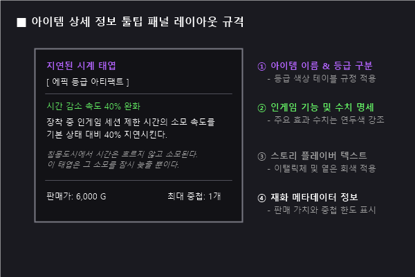
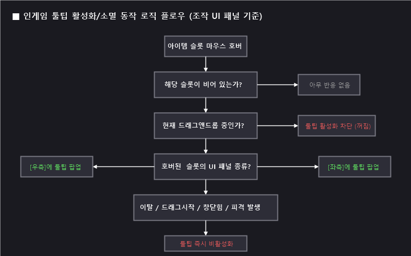
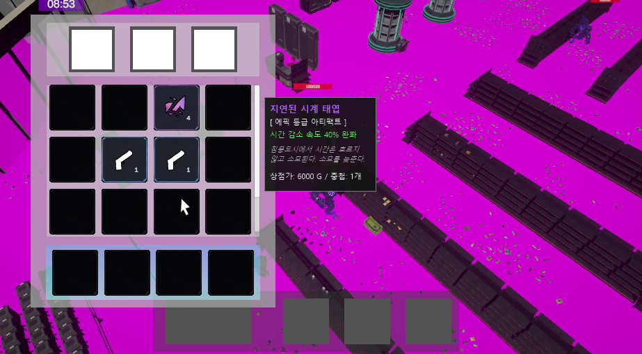
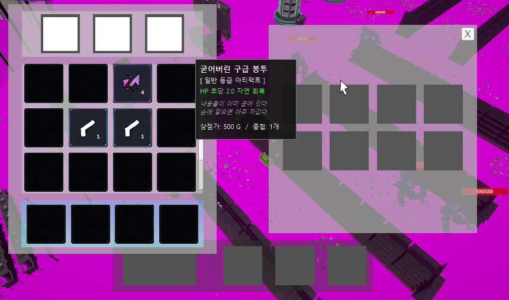

# P0.5_UI_아이템 상세 정보 툴팁 기획_v1.0.0

**문서 버전 관리**

| 버전 | 작성 일자 | 작업 내역 | 기획 담당 |
| --- | --- | --- | --- |
| v1.0.0 | 2026.07.08 | 아이템 상세 정보 툴팁 UI 명세 초안 작성 | 장수영 |

---

# 1. 기획 의도 및 목적

- 인게임 세션 진행 중 아티팩트, 소비 기물, 잡템을 습득하거나 인벤토리를 열었을 때, 아이콘만으로는 아이템의 세부 스탯 및 효과를 즉각적으로 비교하기 어렵다.
- 인벤토리 창(화면 좌측)과 아이템 상자 창(화면 우측)이 활성화되어 있는 동안 두 패널을 가리지 않으면서, 마우스 조작을 통해 아이템의 이름, 등급, 상세 스탯, 플레이버 텍스트, 판매 가치 등을 한눈에 확인할 수 있는 **동적 툴팁(Tooltip) 시스템**을 구축한다.

---

# 2. UI 레이아웃 및 디자인 명세

## 2.1 툴팁 패널 (`ItemTooltipPanel`) 구조
툴팁 패널은 마우스 포인터의 위치를 기준으로 동적으로 생성 및 정렬되는 반투명 검은색 배경 패널이다.

### 2.1.1 상세 컴포넌트 정보
1. **배경 패널 (`Tooltip_BG`)**: 
   - HSL 베이스의 Sleek Dark 테마가 적용된 반투명 아웃라인 패널 (알파값 90%, 둥근 모서리 적용).
   - 콘텐츠 길이에 따라 가로/세로 크기가 유동적으로 변하는 `Content Size Fitter` 컴포넌트 필수 적용.
2. **아이템 이름 (`Text_ItemName`)**:
   - 폰트 스타일: Bold
   - 폰트 크기: 16
   - 텍스트 컬러: 아이템 등급별 고유 색상 적용 (2.2절 참조).
3. **효과 설명 (`Text_ItemEffect`)**:
   - 스탯 상승치 및 특수 능력을 가독성 높은 폰트(예: KoPubWorld돋움)로 기술.
   - 예: `장착 시 HP 자연 회복량이 초당 +2.0 증가합니다.` (긍정 효과는 녹색 계열 `#80FF80`로 수치 강조).
4. **플레이버 텍스트 (`Text_FlavorText`)**:
   - 아이템의 설정과 스토리를 보여주는 텍스트.
   - 폰트 스타일: Italic
   - 폰트 크기: 12
   - 텍스트 컬러: `#9C9C9C` (중간 회색)
5. **상점 가치 및 중첩 정보 (`Text_ItemMetadata`)**:
   - 상점 판매 시 획득 가능한 골드와 최대 중첩 한도를 표시.
   - 예: `상점 판매 가치: 500 G` / `최대 중첩: 1개`

### 2.1.2 예시 이미지 내 툴팁 텍스트 배치 상세 명세

예시 이미지(§4 참조)에 표현된 툴팁 내부의 실제 텍스트 줄바꿈 및 폰트 서식 구성안은 다음과 같다.

#### ① [에픽 등급] 지연된 시계 태엽 툴팁 배치 예시 (총 6줄 구성)
- **1줄 (아이템 이름)**: `지연된 시계 태엽`
  - *서식*: Bold, 16px, 에픽 등급 보라색 컬러 (`#A335EE`)
- **2줄 (분류 명세)**: `[ 에픽 등급 아티팩트 ]`
  - *서식*: Regular, 12px, 흰색 컬러 (`#FFFFFF`)
- **3줄 (주요 능력치 효과)**: `시간 감소 속도 40% 완화`
  - *서식*: Regular, 12px, 긍정 효과 연두색 컬러 (`#64F064`)
- **4~5줄 (플레이버 텍스트 - 강제 줄바꿈 2줄)**: 
  - `“침몽도시에서 시간은 흐르지`
  - `않고 소모된다. 소모를 늦춘다.”`
  - *서식*: Italic, 10px, 연한 회색 컬러 (`#A0A0A0`)
- **6줄 (골드 가치 및 메타데이터)**: `상점가: 6000 G / 중첩: 1개`
  - *서식*: Regular, 12px, 흰색 컬러 (`#FFFFFF`)

#### ② [일반 등급] 굳어버린 구급 봉투 툴팁 배치 예시 (총 6줄 구성)
- **1줄 (아이템 이름)**: `굳어버린 구급 봉투`
  - *서식*: Bold, 16px, 일반 등급 흰색 컬러 (`#FFFFFF`)
- **2줄 (분류 명세)**: `[ 일반 등급 아티팩트 ]`
  - *서식*: Regular, 12px, 흰색 컬러 (`#FFFFFF`)
- **3줄 (주요 능력치 효과)**: `HP 초당 2.0 자연 회복`
  - *서식*: Regular, 12px, 긍정 효과 연두색 컬러 (`#64F064`)
- **4~5줄 (플레이버 텍스트 - 강제 줄바꿈 2줄)**:
  - `“내용물이 이미 굳어 있다.`
  - `손에 닿으면 아주 차갑다.”`
  - *서식*: Italic, 10px, 연한 회색 컬러 (`#A0A0A0`)
- **6줄 (골드 가치 및 메타데이터)**: `상점가: 500 G  /  중첩: 1개`
  - *서식*: Regular, 12px, 흰색 컬러 (`#FFFFFF`)

---

## 2.2 등급별 텍스트 및 연출 색상 테이블
아이템의 등급 식별이 직관적으로 이루어지도록 툴팁 내 텍스트 컬러를 통일한다.

| 등급 | 컬러 코드 (Hex) | 적용 색상 이미지 |
| --- | --- | --- |
| **Normal** | `#FFFFFF` | 흰색 (White) |
| **Uncommon** | `#1EFF00` | 연두색 (Uncommon Green) |
| **Rare** | `#0070DD` | 파란색 (Rare Blue) |
| **Epic** | `#A335EE` | 보라색 (Epic Purple) |
| **Legend** | `#FF8000` | 주황색 (Legend Orange) |

---

# 3. 인게임 동작 프로세스 (Flow)

## 3.1 툴팁 생성 및 소멸 규칙
툴팁은 플레이어의 조작 편의성을 극대화하기 위해 즉각적으로 켜지고 꺼져야 한다.

### 3.1.1 툴팁 활성화 (생성) 조건
- **OnPointerEnter (호버 시)**: 마우스 포인터가 유효한 아이템이 존재하는 슬롯 영역에 진입 시 즉시 툴팁을 활성화하고 텍스트 데이터를 동기화한다.

### 3.1.2 툴팁 비활성화 (소멸) 조건
툴팁은 이하의 조건 중 단 하나라도 충족되는 즉시 화면에서 비활성화(`SetActive(false)`) 처리되어 소멸해야 한다.

| 분류 | 소멸 트리거 조건 | 설명 |
| --- | --- | --- |
| **마우스 조작** | **OnPointerExit** (커서 이탈) | 마우스 커서가 아이템 슬롯의 바운더리 영역을 벗어났을 때 |
| **마우스 조작** | **OnBeginDrag** (드래그 시작) | 유저가 아이템 이동/교체를 위해 마우스 드래그를 시작한 순간 |
| **상태 변화** | **OnItemRemoved** (아이템 소실) | 더블클릭 퀵 루팅으로 아이템이 상자에서 인벤토리로 강제 즉시 이동했거나, 슬롯에 있던 소비 기물을 사용하여 아이템이 사라졌을 때 |
| **창 상태 변화**| **OnWindowClosed** (UI 닫힘) | 인벤토리 창(`I` 단축키 등) 또는 상자 UI 창(`X` 버튼 또는 `ESC`)이 닫혔을 때 |
| **인게임 전투** | **OnPlayerDamaged** (플레이어 피격)| 인게임 세션 전투 중 적에게 피격당하거나 행동 불능 상태가 되었을 때 (전투 집중을 위해 열려있는 UI 및 툴팁 강제 해제) |

---

## 3.2 툴팁의 동적 겹침 방지 (스마트 배치)
화면 크기 대비 UI 패널들이 차지하는 면적이 넓으므로, 호버링이 발생한 슬롯이 소속된 **UI 패널의 종류(Type)**에 따라 툴팁의 기준 방향과 오프셋을 사전에 약속된 프리셋(Preset)으로 지정한다.

- **인벤토리 UI (`InventoryPanel`)의 슬롯을 조작할 때**:
  - 툴팁은 마우스 커서 기준 항상 **우측(Right)**에 팝업된다 (우측 피벗 정렬).
  - 이를 통해 인벤토리 내의 다른 슬롯들이 가려지는 현상을 최소화한다.
- **아이템 상자 UI (`LootBoxPanel` / `ItemBoxPanel`)의 슬롯을 조작할 때**:
  - 툴팁은 마우스 커서 기준 항상 **좌측(Left)**에 팝업된다 (좌측 피벗 정렬).
  - **[상자 슬롯 가림 방지 규칙]**: 상자 내부에서 파밍 대상을 확인하거나 더블클릭할 때 상자 내 다른 슬롯이 가려지는 것을 원천 방지하기 위해, 툴팁의 X 좌표는 상자 패널 영역(X < 상자 경계선) 바깥인 화면 중앙 공백 및 인벤토리 패널 우측 영역 위에 오도록 강제 오프셋 처리를 실행한다.
- **여백 마진(Offset)**:
  - 마우스 포인터 정위치와 툴팁 모서리 사이에 가로 및 세로 간격을 두어 마우스가 툴팁 자체를 가리지 않도록 위치를 피팅한다.

---

# 4. 상자 조작 및 인벤토리 상황별 UI 연출

## 4.1 인벤토리 단독 활성화 (첫 번째 사진 상황)
- 인벤토리 창 안의 슬롯 위로 마우스가 올라가면 툴팁은 항상 **우측**의 비어있는 넓은 인게임 월드 화면 쪽에 팝업된다.
- 이를 통해 인벤토리 안의 다른 슬롯들이 가려지는 문제를 막는다.

*※ 마우스 호버 시 인벤토리 창 우측의 넓은 분홍색 월드 화면 영역(중앙 우측)에 에픽 등급 아티팩트(지연된 시계 태엽) 툴팁이 팝업된다.*

## 4.2 아이템 상자 파밍 중 활성화 (두 번째 사진 상황)
- **인벤토리(좌측) 조작 시**: 툴팁은 마우스 **우측**에 뜬다. 이때 우측의 상자 UI 창과 일부 겹칠 수 있으므로 상자 UI보다 `Sort Order`를 높게 잡은 전용 오버레이 캔버스에 툴팁을 배치한다.
- **아이템 상자(우측) 조작 시**: 툴팁은 마우스 **좌측**에 뜬다. 이때 상자 내부의 다른 9개 슬롯과 파밍 대상을 절대 가리지 않도록, 상자 패널 경계선 왼쪽으로 툴팁을 충분히 밀어서 인벤토리 창 우측 위에 오버랩되도록 연출한다.

*※ 우측의 10칸 상자 슬롯에 마우스를 올릴 때, 상자 내부 아이템을 가리지 않기 위해 툴팁이 좌측 인벤토리 패널의 우측 경계선 위를 침범하여 오버랩 팝업된다.*

---

# 5. 예외 및 예방 조치 처리

1. **빈 슬롯 필터링**:
   - 빈 슬롯 위에서는 툴팁 컨트롤러가 동작하지 않는다.
2. **드래그 중 툴팁 오작동 방지**:
   - 드래그 앤 드롭 중에는 타겟 슬롯을 찾기 위해 다른 아이템 슬롯 위를 지나가더라도 해당 슬롯의 `OnPointerEnter`에 의해 신규 툴팁이 켜지지 않도록 `IsDragging (bool)` 전역 상태값을 체크하여 차단한다.
3. **화면 경계 이탈 방지 (Clamp)**:
   - 툴팁 크기가 가변적이므로, 화면 가장자리(우측 끝, 하단 끝)에서 툴팁이 팝업될 때 툴팁의 모서리가 화면 영역을 벗어나 잘리지 않도록 `Canvas Boundary Clamp` 로직을 적용해 툴팁 위치 좌표를 보정한다.
