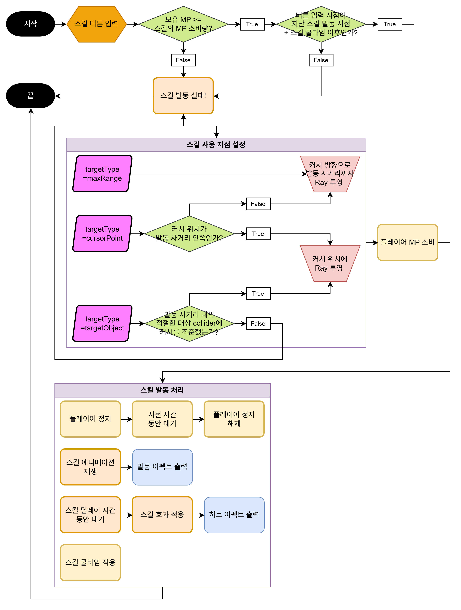
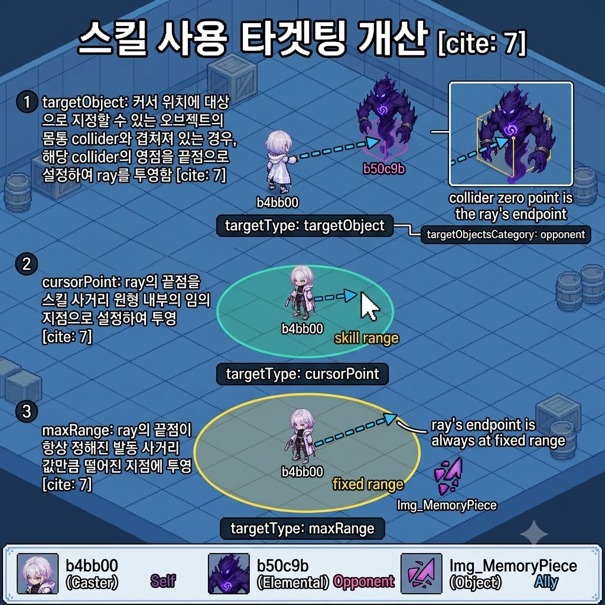
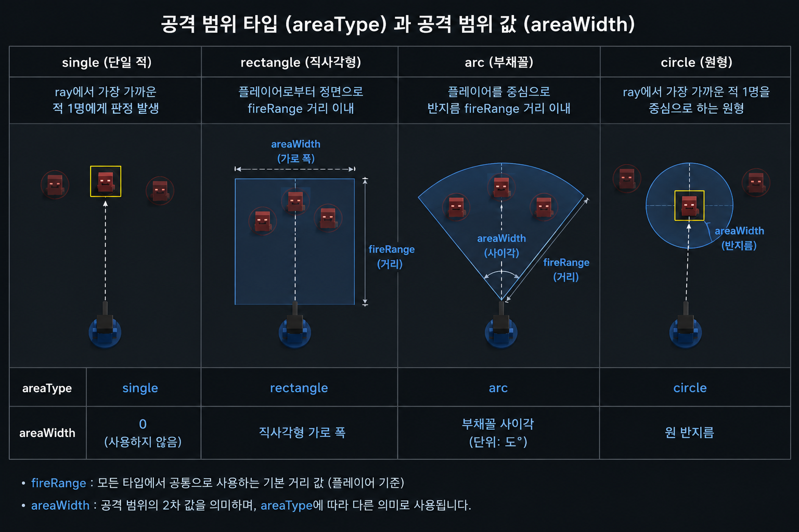

# P0.5_플레이어 캐릭터_기획서_스킬 기능 명세_v1.0.0

**문서 버전 관리**

| 버전 | 작성 일자 | 작업 내역 |
| --- | --- | --- |
| v1.0.0 | 2026.07.06 | 시스템 기획 명세서에서 스킬 내용을 분리하여 기획 문서 생성 스킬 기능 사항 고도화   • 스킬 사용 플로우 표기   • 스킬 시전 방식 설정: 키 원클릭으로 즉시 발동   • 스킬 시전 루프에서 예외 처리 설정       ◦ 대상 지정 스킬 사용 시 커서가 발동 가능한 대상을 가리키지 않은 경우       ◦ 스킬 사용 시 커서가 정해진 최대 사거리 밖에 있는 경우   • 디코이 시스템 명세 추가   • 스킬 데이터 테이블 고도화 |

# 스킬 기능 개요

다이버 캐릭터가 인게임 세션에서 기본 공격 이외의 스킬을 사용할 수 있다.

- 스킬은 인게임 세션 UI에서 스킬 슬롯에 출력된다.

## 스킬 사용하기

<스킬 사용 플로우>

### 스킬 키 입력

다이버의 스킬은 인게임 세션에서 `스킬 사용` 키를 입력하여 사용한다.

- 스킬 사용 키는 Input System에서 Player 액션 맵에 ActiveSkill 액션을 추가하여 연결한다.
- 유저의 입력 명령을 받는 LocalInputReader에 OnActiveSkill 콜백 메소드를 추가한다.
    - 플레이어 프리팹에서 Player Input 컴포넌트의 ActiveSkill 이벤트에 `LocalInputReader.OnActiveSkill` 메소드를 연결하여 스킬 사용 신호를 입력받는다.
    - 글로벌 이벤트 버스에 `OnActiveSkillRequested` 이벤트를 등록하고, OnActiveSkill 메소드에서 Invoke한다.
        - OnMainActiveSkillRequested 이벤트를 PlayerCombatPresenter에서 구독하여, 스킬 사용 입력 신호를 전달해 스킬 발동 여부 체크를 실행하도록 한다.
- 스킬 키 입력 신호 발생 시 스킬 사용 가능 여부를 체크한다.
    - 플레이어의 현재 상태가 ‘기본 상태(`PlayerStatus.livingState.idle`)’인가
        - 플레이어의 상태가 ‘탈출 중(`PlayerStatus.livingState.escape`)’이거나 ‘강제 각성(`PlayerStatus.livingState.gameover`)’인 경우에는 스킬 사용 키 입력이 비활성화된다.
    - 플레이어의 보유 MP가 스킬 사용에 필요한 MP 이상인가 - 이하 `MP 소비`  문단에서 설명
    - 이전 스킬 사용 후 스킬 쿨타임이 경과했는가 - 이하 `쿨타임`  문단에서 설명

### MP 소비

스킬 사용 키 입력 시 스킬마다 정해진 수치만큼 MP를 소비하여 스킬을 발동한다.

- 플레이어의 남은 MP가 스킬의 MP 소비량 값 미만인 경우에는 스킬 사용 키 입력을 비활성화한다.
- 스킬의 `MP 소비량` 값은 스킬 데이터의 `mpCost (float)` 변수에 입력하여 조절한다.

### 쿨타임

스킬 발동 후 정해진 `스킬 쿨타임` 동안 스킬 사용 키 입력 처리를 다시 실행할 수 없다.

- 스킬의 쿨타임은 스킬 발동에 성공했을 경우, 그 발동 시점부터 적용된다. (MP 부족 또는 이미 쿨타임 진행 중인 상태여서 스킬이 발동하지 않은 경우에는 쿨타임이 적용되지 않음)
- 쿨타임 값은 스킬 데이터의 `skillCooltime (float)` 변수에 초 단위로 입력하여 조절한다.
- 스킬 쿨타임 판정은 현재 시점, 지난 스킬 발동 시점, 스킬 쿨타임 값을 통해 계산한다.
    - 스킬 키를 입력하여 MP 소비 후 성공적으로 발동 처리가 실행된 시점을 그 스킬의 `지난 스킬 발동 시점`으로 저장한다.
        - 인게임 세션이 로딩 완료되어 플레이어 캐릭터가 인게임 세션 신에 입장한 시점에는 지난 스킬 발동 시점을 기본값 0으로 저장한다 (입장 직후 스킬 사용 키 입력 가능)
    - 현재 시점이 지난 스킬 발동 시점으로부터 스킬 쿨타임 이상 경과하였는지 판정하여, 경과하지 않았을 경우에는 스킬 사용 키 입력을 비활성화하고, 경과한 시점부터 스킬 사용 키 입력을 활성화한다.

### 스킬 사용 지점

스킬이 사용되는 지점의 위치 및 방향은 이하의 명세에 따라 지정된다.

- 스킬 사용 지점은 스킬 사용 키를 입력하여 스킬이 발동한 시점에 자동으로 정해진다.
- 스킬 사용 지점은 스킬이 발동한 시점의 플레이어 캐릭터 위치 및 유저의 마우스 커서 위치에 따라 결정된다.
    - 플레이어 캐릭터 위치를 시작점으로 하여 마우스 커서 위치 방향으로 ray(이하 `발동 ray` )를 투영한다.
- 스킬 사용 지점은 플레이어 캐릭터 위치로부터 정해진 `발동 사거리` 이하의 거리 내에서 지정할 수 있다.
    - 발동 사거리 값은 스킬 데이터의 `fireRange (float)` 변수에 Unity 길이 단위로 입력하여 조절한다.
    - 발동 ray의 길이를 발동 사거리 값 이하가 되도록 clamp를 적용한다.

<targetType 지정 방식 및 targetObjectsCategory 지정 설명 그림>

- 스킬 사용 지점을 결정하는 방식은 스킬 데이터의 `targetType (enum)` 변수를 사용하여 지정한다.
    - targetObject: 커서 위치에 대상으로 지정할 수 있는 오브젝트의 몸통 collider와 겹쳐져 있는 경우, 해당 collider의 영점을 끝점으로 설정하여 ray를 투영함 (=타겟팅 방식)
    - cursorPoint: ray의 끝점을 스킬 사거리 원형 내부의 임의 지점으로 설정하여 투영 가능
    - maxRange: ray의 끝점이 항상 정해진 발동 사거리 값만큼 떨어진 지점에 투영됨
- 타겟팅(targetObject) 방식으로 스킬을 사용할 경우, 타겟팅 대상으로 지정할 수 있는 오브젝트의 종류를 `targetObjectsCategory (enum)`  변수에 입력한다.
    - none: 타겟팅 없음 (cursorPoint, maxRange 방식의 스킬인 경우에 입력하는 빈 칸 값)
    - self: 시전자 자신
    - ally: 시전자의 아군 (플레이어가 사용 시 다른 플레이어 캐릭터, 적이 사용 시 다른 적 캐릭터)
    - opponent: 시전자의 상대편 (플레이어가 사용 시 적 캐릭터, 적이 사용 시 플레이어 캐릭터)
- 스킬 키를 입력한 시점에 마우스 커서가 발동 사거리보다 먼 지점에 위치하고 있을 경우에는 targetType에 따라 각각 이하와 같이 처리한다.
    - `targetType=targetObject` : 스킬 발동 처리가 실행되지 않는다.
    - `targetType=cursorPoint` : ray의 끝점을 커서 위치 방향으로 발동 사거리 값만큼 떨어진 지점에 투영하여 스킬을 발동한다. (최대 거리에서 정상 발동함)
    - `targetType=maxRange` : ray의 끝점을 커서 위치 방향으로 발동 사거리 값만큼 떨어진 지점에 투영하여 스킬을 발동한다. (정상 발동함)

### 스킬 발동 처리

- 플레이어 보유 MP 소비 처리를 실제로 스킬이 발동한 시점 직전에 실행한다.
- 스킬이 발동한 시점에 ‘스킬 발동’ 트리거를 Animator Controller에 전달하여 스킬 사용 애니메이션을 출력한다.
    - 스킬 발동 트리거 전달 시점에 스킬 발동 이펙트 (SFX 및 VFX)를 출력한다.
    - 출력되는 발동 이펙트의 프리팹 파일명을 `activateSFX (string)`  및 `activateVFX (string)`  변수에 입력하여 지정한다.
- 발동 시점으로부터 스킬 효과마다 정해진 `스킬 딜레이` 시간만큼 대기한 뒤 각 스킬 효과를 적용한다.
    - 각 스킬 효과의 스킬 딜레이는 스킬 데이터의 `effectDelay (float)` 변수에 초 단위로 입력하여 조절한다.

#### 플레이어 이동 명령 중단

스킬이 발동한 시점부터 정해진 시간 동안 플레이어 캐릭터의 이동 명령 입력을 중단한다.

- 이동 명령 입력이 중단된 동안 Input System에 의한 캐릭터 Transform의 position 및 rotation 값 변동을 적용하지 않는다.
- 이동 명령 입력이 중단된 동안에도 이하의 스킬 효과에 의한 강제 위치 이동은 적용된다.
    - 시전자가 effectType=leap인 스킬을 사용하여 자신의 위치를 변경하는 경우
    - 적이 effectType=knockBack인 스킬을 시전자에게 사용하여 위치를 이동시키는 경우
- 플레이어 캐릭터 이동 명령 입력 중단은 스킬마다 정해진 `시전 시간` 이 경과한 후에 해제된다.
    - 시전 시간 값은 스킬 데이터의 `activateTime (float)` 변수에 초 단위로 입력하여 조절한다.
    - 이동 정지가 해제된 시점부터 유저의 조작에 따라 이동 명령을 입력하여 캐릭터의 position 이동 및 rotation 회전을 실행할 수 있다.

# 스킬 효과

각 스킬이 가지는 효과는 스킬 데이터에서 이하의 `effectType (enum)` 변수로 지정한다.

- none: 사용되지 않음
    - 2개 이상의 SkillEffects 클래스를 개별 열에 작성하는 Excel 데이터 테이블에서 2번째 이후의 열을 사용하지 않는 경우에 입력하는 ‘빈 칸’ 값.
    - effectValue에 0(float)을 입력한다.
- damage: 보유 체력 피해
    - effectValue에 시전자 공격력 배율(float)을 백분율 단위로 입력한다. (기본 100% = 1.0f)
- healHP: 보유 체력 회복
    - effectValue에 회복하는 값(float)을 입력한다.
- leap: 도약,돌진
    - effectValue에 커서 방향으로 이동하는 거리(Unity 길이 단위) 및 이동에 걸리는 시간(초 단위)을 각각 입력한다 (float[2]).
    - effectValue[0] (이동 거리)에 음수 값을 입력하여 플레이어가 커서 반대 방향(뒤)로 이동하는 처리를 구현할 수 있다.
- knockback: 밀어내기
    - effectValue에 커서 방향으로 밀어내는 거리(Unity 길이 단위) 및 밀어내는 시간(초 단위)을 각각 입력한다 (float[2]).
    - effectValue[0] (이동 거리)에 음수 값을 입력하여 적을 플레이어 방향으로 이동시키는 끌어당기기 처리를 구현할 수 있다.
- aggro: 추적 대상 유도 - 이하 `오브젝트 생성 스킬` 문단에서 설명
- vision: 시야 범위 추가 - 이하 `오브젝트 생성 스킬` 문단에서 설명
- parry: 패링 - 이하 `패링` 문단에서 설명

## 발동한 효과의 적용

<areaType 및 areaWidth, fireRange 값 적용 설명 그림>

- 스킬의 효과가 적용되는 범위는 스킬 데이터의 `areaType (enum)`, `areaWidth (float)` 변수로 설정한다.
    - areaType 변수에 스킬 효과가 적용되는 범위의 형태를 지정한다.
        - none: 사용되지 않음
            - 2개 이상의 SkillEffects 클래스를 개별 열에 작성하는 Excel 데이터 테이블에서 2번째 이후의 열을 사용하지 않는 경우에 입력하는 ‘빈 칸’ 값.
        - single: 단일 대상
            - `targetType=object` : ray 끝점으로 지정한 대상 1명에게 판정 발생
            - `targetType=cursorPoint` : ray 끝점으로 지정한 위치에서 판정 발생
            - `targetType=maxRange` : ray 시작점에서 가장 가까운 지점에서 히트한 대상 1명에게 판정 발생
        - rectangle: 직사각형 (플레이어로부터 정면으로 fireRange 거리 이내)
        - arc: 부채꼴 (플레이어를 중심으로 반지름 fireRange 거리 이내)
        - circle: 원형 (ray 끝점을 중심으로 하는 원형)
    - areaWidth 변수에 스킬 효과가 적용되는 범위의 2차 크기 값을 Unity 길이 단위로 입력한다.
        - `areaType=none` : 0으로 입력
        - `areaType=single` : 0으로 입력
        - `areaType=rectangle` : 직사각형 가로 폭
        - `areaType=arc` : 부채꼴 사이각
        - `areaType=circle` : 원 반지름
- 각 스킬 효과가 적용되는 대상을 스킬 데이터의 `effectTarget (enum)`  변수로 지정한다.
    - none: 적용 대상 없음
        - 2개 이상의 SkillEffects 클래스를 개별 열에 작성하는 Excel 데이터 테이블에서 2번째 이후의 열을 사용하지 않는 경우에 입력하는 ‘빈 칸’ 값.
    - self: 시전자 자신
    - ally: 시전자의 아군 (플레이어가 사용 시 다른 플레이어 캐릭터, 적이 사용 시 다른 적 캐릭터)
    - opponent: 시전자의 상대편 (플레이어가 사용 시 적 캐릭터, 적이 사용 시 플레이어 캐릭터)
- 각 스킬 효과는 발동 시점으로부터 효과마다 정해진 `스킬 딜레이` 시간이 경과한 시점에 적용된다.
    - 스킬 딜레이는 스킬 데이터의 `effectDelay (float)`  변수에 초 단위로 입력하여 조절한다.
- 각 스킬 효과가 적용된 대상에게 `히트 이펙트` 를 출력한다.
    - 히트 이펙트는 사운드 이펙트(SFX) 및 시각 이펙트(VFX)를 각각 지정한다.
    - 출력되는 히트 이펙트의 프리팹 파일명을 `effectHitSFX (string)`  및 `effectHitVFX (string)`  변수에 입력하여 지정한다.

## 오브젝트 생성 스킬

스킬 효과를 통해 오브젝트를 생성할 수 있다.

### 디코이

`effectType=aggro` 스킬 사용 시 스킬 사용 지점에 적 AI의 추적 대상이 되는 오브젝트(이하 `디코이`)를 생성한다.

- 디코이 생성 스킬의 areaType은 single (단일 오브젝트)로 입력한다.
- 디코이 생성 스킬의 effectTarget은 opponent (시전자의 적에게 신호를 전달)로 입력한다.
- 생성된 디코이 오브젝트는 정해진 시간 동안 유지되며 적 캐릭터가 추적하는 신호(`NoiseType=Decoy`)를 발생시킨다.
    - 디코이 오브젝트가 유지되는 시간을 effectValue (float) 변수에 초 단위로 입력하여 조절한다.
    - 디코이가 발생시킨 신호는 인게임 세션 내에서 구형 범위 내에 전파된다.
        - 신호가 전파되는 범위의 중심 지점은 디코이 오브젝트의 위치 원점 지점으로 설정한다.
        - 신호가 전파되는 범위의 반지름을 스킬 데이터의 areaWidth (float) 변수에 입력하여 조절한다.
    - 디코이가 발생시키는 신호의 지속 시간은 디코이 오브젝트가 유지 시간과 같게 맞춘다.
    - 디코이가 발생시키는 신호는 적 캐릭터의 추적 대상 선택 AI에서 플레이어 캐릭터보다 우선하여 탐색된다.
        - 적이 디코이와 플레이어 캐릭터를 추적하는 우선 순위는 NoiseManager의 priority (int) 값을 통해 조절한다. (값이 클수록 높은 우선 순위로 추적)
- 디코이 생성 시 디코이 오브젝트의 위치 원점 지점에 effectHitSFX 및 effectHitVFX를 출력한다.
    - effectHitSFX 및 effectHitVFX의 유지 시간을 디코이 생성 스킬의 지속 시간에 맞추어 제작한다.

### 조명 [**시야 시스템 개발 시 추가 명세 필요**]

`effectType=vision` 스킬 사용 시 스킬 사용 지점에 시야 렌더링 볼륨을 생성하는 오브젝트(이하 `조명`)를 생성한다.

## 패링 [**P0.5 이후 확장 개발 시 사용**]

`effectType=parry` 스킬 사용 시 패링 판정을 활성화한다.

- 패링 판정이 활성화되는 `패링 지속 시간`은 `effectValue[0]`에 입력한 시간 동안 유지된다.
    - effectValue[0] (float) 값은 초 단위로 입력한다.
    - 스킬 발동 시점부터 패링 지속 시간 값만큼 시간 경과 시 자동으로 패링 판정이 비활성화된다.
- 패링 판정 활성화 상태가 유지되는 패링 지속 시간 중 공격 범위 내의 적이 플레이어에게 기본 공격 시 이하의 패링 성공 처리를 실행한다.
    - 그 적의 기본 공격으로 플레이어가 받는 피해 값을 0으로 한다. (플레이어 HP가 감소하지 않음)
    - 그 적에게 `플레이어의 공격력 × effectValue[1]` 값만큼의 피해를 준다.
        - effectValue[1] (float)값은 백분율 단위로 입력한다(기본 100% = 1.0f)
    - 패링 판정을 비활성화한다.

## 2종류 이상의 효과 적용

1개의 스킬에 2가지 이상의 효과를 설정할 수 있도록 SkillEffects {effectType, areaType, areaWidth, effectTarget, effectDelay, effectValue} 클래스를 정의하여 사용한다.

- areaType, areaWidth, effectTarget 값을 각각 설정하여 효과마다 다른 범위 및 대상에 적용될 수 있게 한다.
- effectDelay 값은 스킬 입력이 실행된 시점에서부터 각각 계산한다.

# 스킬 데이터 구성

- 스킬 정보는 이하의 데이터로 구성되며, `SkillData` 테이블에서 관리한다.

| 변수명 | 변수 자료형 | 변수 설명 |
| --- | --- | --- |
| TID | int | 스킬 고유 ID |
| skillName | string | 스킬 이름 스트링 |
| skillDesc | string | 스킬 설명 스트링 |
| skillIcon | string | 스킬 아이콘 이미지 파일명 |
| mpCost | float | 스킬 사용 시 MP 자원 소비량 |
| skillCooltime | float | 스킬 쿨타임 |
| fireRange | float | 스킬 발동 사거리 |
| activateTime | float | 스킬 사용 중 플레이어 캐릭터의 이동 및 회전이 정지되는 시전 시간 |
| activateSFX | string | 스킬 발동 시 출력하는 사운드 파일명 |
| activateVFX | string | 스킬 발동 시 출력하는 VFX 프리팹 파일명 |
| targetType | enum | 스킬 사용 지점 설정 방식   • object: 발동 ray의 끝점이 대상 오브젝트의 위치 기준 지점에 맞추어짐 (타겟팅 방식)   • cursorPoint: 발동 ray의 끝점을 발동 사거리 내의 임의 지점으로 설정   • maxRange: ray의 끝점이 항상 발동 사거리 값만큼 떨어진 지점에 투영됨 |
| targetObjectCategory | enum | 스킬 타겟팅 대상   • none: 대상 지정 없음 (targetType = cursorPoint이나 maxRange인 경우)   • self: 시전자 자신   • ally: 시전자의 아군(플레이어 → 다른 플레이어, 적 → 다른 적)   • opponent: 시전자의 상대편(플레이어 → 적, 적 → 플레이어) |
| effectType_XX | enum | 스킬 효과 종류   • none: 사용되지 않음   • damage: 보유 체력 피해   • healHP: 보유 체력 회복   • leap: 도약,돌진   • knockback: 밀어내기   • aggro: 추적 대상 유도 오브젝트(디코이)를 생성   • vision: 시야 범위 추가 오브젝트(조명)를 생성   • parry: 패링 (범위 내 적의 기본 공격 피해를 막은 후 플레이어 공격력 비례 피해를 공격한 적에게 입힘) |
| areaType_XX | enum | 스킬 효과 적용 범위 타입   • none: 사용되지 않음   • single: 단일 대상       ◦ `targetType=object` : ray 끝점으로 지정한 대상 1명에게 판정 발생       ◦ `targetType=cursorPoint`  : ray 끝점으로 지정한 위치에서 판정 발생       ◦ `targetType=maxRange` : ray 시작점에서 가장 가까운 지점에서 히트한 대상 1명에게 판정 발생   • rectangle: 직사각형 (플레이어로부터 정면으로 fireRange 거리 이내)   • arc: 부채꼴 (플레이어를 중심으로 반지름 fireRange 거리 이내)   • circle: 원형 (ray에서 가장 가까운 적 1명을 중심으로 하는 원형) |
| areaWidth_XX | float | 스킬 효과 적용 범위 2차 값   • `areaType=none` : 0으로 입력   • `areaType=single` : 0으로 입력   • `areaType=rectangle` : 직사각형 가로 폭   • `areaType=arc` : 부채꼴 사이각   • `areaType=circle` : 원 반지름 |
| effectTarget_XX | enum | 스킬 효과 적용 대상 타입   • none: 사용되지 않음   • self: 시전자 자신   • ally: 시전자의 아군(플레이어 → 다른 플레이어, 적 → 다른 적)   • opponent: 시전자의 상대편(플레이어 → 적, 적 → 플레이어) |
| effectDelay_XX | float | 스킬 딜레이   • 발동 즉시 효과가 적용되는 경우 0으로 입력 |
| effectValue_XX | string | 스킬 효과 값   • `effectType=none`: 0으로 입력   • `effectType=damage`: 공격력 배율(float 변환)   • `effectType=heal`: 보유 체력 회복량(float 변환)   • `effectType=leap`: 돌진 거리,돌진 시간(<float,float> 변환)   • `effectType=knockbck` : 밀어내는 속도, 밀어내는 시간(<float,float> 변환)   • `effectType=aggro` : 디코이 유지 시간 (float 변환)   • `effectType=vision` : 조명 유지 시간 (float 변환)   • `effectType=parry` : 패링 판정 유지 시간, 패링 성공 시 반격 피해 배율 (<float,float> 변환) |
| effectHitSFX_XX | string | 스킬 효과 적용 시 출력되는 사운드 파일명 |
| effectHitVFX_XX | string | 스킬 효과 적용 시 출력되는 VFX 프리팹 파일명 |

## P0.5 스킬 구현 예시

| 변수 | 값 | 설명 |
| --- | --- | --- |
| TID | 1 |  |
| skillName | 프리즘 유탄 | 스킬 이름: 프리즘 유탄 |
| skillDesc | 소비 MP: 20 15m 거리 내에서 지정한 지점에 프리즘 유탄을 발사합니다. 발사한 유탄은 0.5초 후에 폭발하여 반경 3m 내의 적에게 플레이어 공격력의 150%의 피해를 주고, 2.5초 동안 반경 18m 범위 내의 적을 유인하는 소음 디코이를 생성합니다. 재사용 대기시간: 5초 |  |
| skillIcon | Image_YuanSkill | 스킬 아이콘: Image_YuanSkill |
| mpCost | 20.0 | 소비 MP: 20 |
| skillCooltime | 5.0 | 스킬 쿨타임: 5초 |
| fireRange | 15.0 | 스킬 사거리: 15 |
| activateTime | 0.2 | 스킬 키 입력 후 0.2초 동안 플레이어 이동 명령을 중단 |
| activateSFX | P0.5_Skill_Activate_SFX | 스킬 발동 사운드 이펙트 파일: P0.5_Skill_Activate_SFX |
| activateVFX | P0.5_Skill_Activate_VFX | 스킬 발동 VFX 이펙트 파일: P0.5_Skill_Activate_VFX |
| targetType | cursorPoint | 스킬 키 입력 시 커서 위치 지점에 효과가 발동함 |
| targetObjectCategory | none | cursorPoint 타입은 targetObjectCategory를 적용하지 않음 |
| effectType_0 | damage | 적에게 피해를 주어 보유 체력을 감소시킵니다. |
| areaType_0 | circle | 공격 범위 타입: ray 히트 지점을 중심으로 하는 원형 |
| areaWidth_0 | 3.0 | 공격 범위 값: 중심 지점으로부터 반지름 3 |
| effectTarget_0 | opponent | 시전자의 적에게 피해를 줍니다. |
| effectDelay_0 | 0.5 | 0.5초 후에 피해 판정이 발생함 |
| effectValue_0 | 1.5 | 플레이어 공격력의 150%만큼 피해를 줍니다. |
| effectHitSFX_0 | P0.5_Skill_Hit_SFX | 스킬 피격 사운드 이펙트 파일: P0.5_Skill_Hit_SFX |
| effectHitVFX_0 | P0.5_Skill_Hit_VFX | 스킬 피격 VFX 이펙트 파일: P0.5_Skill_Hit_VFX |
| effectType_1 | aggro | 적이 플레이어보다 우선하여 추적하도록 노이즈 신호를 발신하는 디코이 오브젝트가 생성됩니다. |
| areaType_1 | single | 디코이는 단일 객체 타입으로, areaType은 single으로 설정함 |
| areaWidth_1 | 18.0 | 디코이가 신호를 발생시키는 범위: 중심 지점으로부터 반지름 18 |
| effectTarget_1 | opponent | 디코이의 effectTarget은 opponent(시전자의 적)로 설정함 |
| effectDelay_1 | 0.5 | 0.5초 후에 디코이가 생성됨 |
| effectValue_1 | 2.5 | 디코이 유지 시간: 2.5초 |
| effectHitSFX_1 | P0.5_Skill_Decoy_SFX | 디코이 생성 시 사운드 이펙트 파일: P0.5_Skill_Decoy_SFX |
| effectHitVFX_1 | P0.5_Skill_Decoy_VFX | 디코이 VFX 이펙트 파일: P0.5_Skill_Decoy_VFX |
| effectType_2 | none | P0.5 버전 스킬은 ‘적에게 피해를 주고’ ‘디코이를 생성’하는 2가지 효과만 존재합니다. |
| areaType_2 | none | P0.5 버전 스킬은 ‘적에게 피해를 주고’ ‘디코이를 생성’하는 2가지 효과만 존재합니다. |
| areaWidth_2 | 0.0 | P0.5 버전 스킬은 ‘적에게 피해를 주고’ ‘디코이를 생성’하는 2가지 효과만 존재합니다. |
| effectTarget_2 | none | P0.5 버전 스킬은 ‘적에게 피해를 주고’ ‘디코이를 생성’하는 2가지 효과만 존재합니다. |
| effectDelay_2 | 0.0 | P0.5 버전 스킬은 ‘적에게 피해를 주고’ ‘디코이를 생성’하는 2가지 효과만 존재합니다. |
| effectValue_2 | 0 | P0.5 버전 스킬은 ‘적에게 피해를 주고’ ‘디코이를 생성’하는 2가지 효과만 존재합니다. |
| effectHitSFX_2 | none | P0.5 버전 스킬은 ‘적에게 피해를 주고’ ‘디코이를 생성’하는 2가지 효과만 존재합니다. |
| effectHitVFX_2 | none | P0.5 버전 스킬은 ‘적에게 피해를 주고’ ‘디코이를 생성’하는 2가지 효과만 존재합니다. |