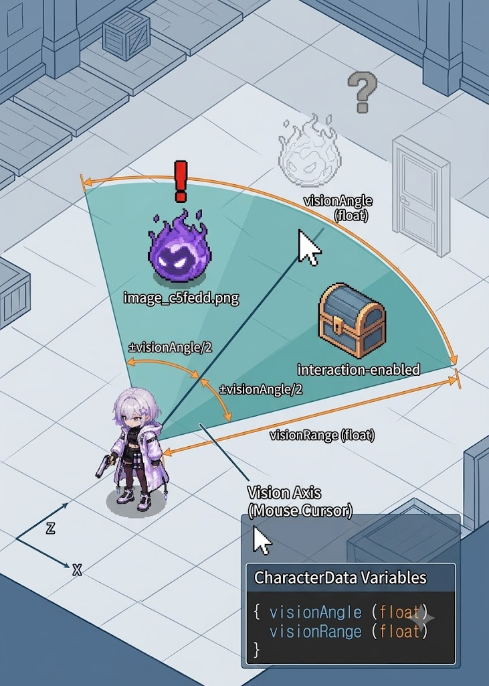
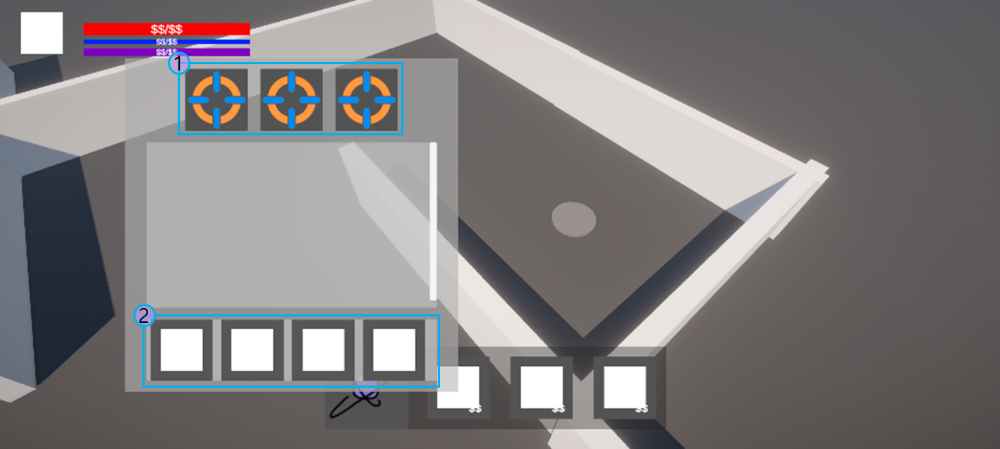

# P0.5_플레이어 캐릭터_기획서_시스템 명세_v1.0.1

**문서 버전 관리**

| 버전 | 작성 일자 | 작업 내역 |
| --- | --- | --- |
| v1.0.0 | 2026.07.01 | 기획서 시안 생성 |
| v1.0.1 | 2026.07.01 | 컨셉 문서 피드백을 반영하여 각 기능별 내용 작성 |

# 개요

| 항목 | 내용 |
| --- | --- |
| 기능명 | 플레이어 캐릭터 재미 요소 시스템 명세 |
| 대상 빌드 | P0.5 프로토타입 |
| 기획 담당자 | 우성혁 |
| 우선순위 | P0.5 |
| 추가 기능 | 인게임 세션 시간 제한
플레이어 시야 제한
달리기
탈출 채널링
각성 보존 슬롯
소비 기물 채널링 / 쿨타임 |
| 기존 기능 변경 | 장비
스킬 |

## P0 및 기존 확장 명세 대비 변경 사항

| 기능 분류 | P0 구현 사양 | 기존 P0.5 확장 명세 기획 사양 대비 |
| --- | --- | --- |
| 인게임 세션 시간 제한 | 미구현 | 있음 |
| 플레이어 시야 제한 | 미구현 | 없음 (신규 추가) |
| 달리기 | 미구현 | 없음 (신규 추가) |
| 탈출 채널링 | 구현됨 - 0.0초로 입력 중
(즉시 탈출 처리를 구현) | 있음 |
| 각성 보존 슬롯 | 미구현 | 있음 |
| 소비 기물 채널링 | 미구현
(딜레이 시간 변수만 존재) | 딜레이 후 발동 처리만 기획 있음
(딜레이 중 취소 처리 추가) |
| 소비 기물 쿨타임 | 미구현 | 없음 (신규 추가) |
| 장비 | 구현됨 - 무장 1종 | 있음(무장 / 방어구)
→ 아티팩트 형식으로 변경 |
| 스킬 | 미구현 | 있음 |

# 기능별 시스템 명세

## 인게임 세션 시간 제한

- 각 인게임 세션에서 플레이를 진행할 수 있는 최대 시간 값을 `sessionTimeLimit (float)`  변수에 지정한다.
    - 세션 입장 시 스크립트 내부 변수 `currentTimeLimit (float)`에 sessionTimeLimit 값만큼의 초기화 값을 부여한다.
    - 세션 내에서 플레이 진행 중 currentTimeLimit 값은 기본적으로 매 초마다 1.0씩 감소한다.
    - currentTimeLimit 값이 0.0 이 된 시점에 탈출 실패(강제 각성) 판정을 실행한다.
        - 강제 각성 판정은 플레이어 HP가 0이 된 시점의 처리와 동일하게 진행된다.

### 시간 제한 가속

- 각 인게임 세션의 특정 구역(이하 `가속 구역`) 에 플레이어가 진입하고 있는 경우, 해당 플레이어에게 적용되는 timeLimitSpeed 값이 가속 구역에 설정된 `timeLimitAccel (float)` 값에 따라 변동된다.
    - currentTimeLimit이 매 초 감소하는 수량에 timeLimitAccel 값을 곱한다.
    - 가속 구역에서 적용되는 시간 제한 가속은 가속 구역의 Collider와 플레이어의 PlayerBody Collider의 TriggerEnter (접촉 시점부터 시간 제한 가속 적용) 및 TriggerExit (이탈 시점부터 시간 제한 가속 해제)로 적용 및 해제를 실행한다.
        - 시간 제한 가속 해제 시 가속 구역에서 전달하는 timeLimitAccel 값을 1.0으로 초기화한다.
    - 레벨 디자인 배치에 따라 2개 이상의 가속 구역이 중첩되는 경우 각 가속 구역마다 지정된 우선 순위 값을 비교하여 가장 우선 순위가 높은 가속 구역만 적용한다.
        - 각 가속 구역의 우선 순위는 `Order (int)` 변수로 지정한다.
- timeLimitSpeed 값은 플레이어가 장착한 장비의 능력치 데이터에 따라 변동되는 시간 제한 가속 값이다.
    - 장비 아이템 장착 시 시간 제한 가속 능력치를 적용할 경우 `equipEffectType.timeLimitAdjust (enum)`  타입을 부여하고, `equipEffectValue (float)`  변수에 가속 배율 값을 입력한다.
        - equipEffectValue에 입력한 시간 제한 가속 능력치 값을 timeLimitAccel 값에 곱하여 currentTimeLimit의 초당 감소 수량을 계산한다.

### 시간 제한 회복

- `시간 제한 회복 아이템`으로 설정된 소비 기물 아이템을 사용하여 남은 시간 제한을 회복할 수 있다.
    - 시간 제한 회복 아이템을 정의하는 `EffectType.timeLimit_recover_inst` 타입을 `EffectType` enum에 추가한다.
    - 시간 제한 회복 아이템 사용 시 ItemEffect 함수의 effectValue 값에 입력한 수치만큼 currentTimeLimit 값이 증가한다.

## 플레이어 시야 제한



<시야 범위 설정 및 적용 예시 그림>

- 플레이어 위치 기준점으로부터 마우스 커서 방향을 바라보는 선을 중심 축으로 하는 부채꼴 범위 내의 영역(이하 `시야 범위`)에서만 적 및 상호작용 가능한 오브젝트의 렌더링을 실행한다.
    - 플레이어의 `CharacterData` 에 이하의 변수를 추가한다.
        - `visionAngle (float)`: 시야 범위 부채꼴의 사이 각
        - `visionRange (float)`: 시야 범위 부채꼴의 반지름
    - 시야 범위는 X-Z 평면 내에서 계산한다.
        - 중심 축으로부터 시계 방향 및 반시계 방향으로 각각 visionAngle의 절반만큼 벌어진 범위를 시야 범위 각도로 사용한다.

## 달리기

- 달리기 버튼을 입력하고 있는 상태에서 이동 명령을 입력하면 달리기 상태로 이동할 수 있다.
    - InputSystem의 Action Map `Player`에 `Sprint` Action을 추가한다.
    - 플레이어의 CharacterData에 `sprintSpeed (float)` 변수를 추가한다.
    - LocalInputReader 스크립트에서 Sprint 키 입력 처리 메소드를 이하와 같이 추가한다.
    
    ```csharp
    public bool isSprint;
    public void OnSprint(InputAction.CallbackContext context)
    {
      // Sprint 키 입력 시작 시 달리기 상태를 true로
    	if (context.started)
    	{
    		isSprint = true;
    	}
      // Sprint 키 입력 종료 시 달리기 상태를 false로
    		if (context.canceled)
    	{
    		isSprint = false;
    	}
    }
    ```
    
    - PlayerMovement 스크립트에서 isSprint 여부에 따른 달리기 처리 메소드를 추가한다.
        - isSprint 값에 따라 walk 및 sprint 애니메이션 클립을 전환한다.
        - 플레이어의 이동 속도를 (isSprint ? sprintSpeed : moveSpeed) 조건으로 계산한다.

### 달리기 스태미나로 MP 소비

- 달리기 상태로 이동 중 지속적으로 MP를 소비한다.
    - 플레이어의 CharacterData에 `sprintMP (float)`  변수를 추가한다.
    - 달리기 상태로 이동하는 동안 매 초마다 sprintMP 값만큼 플레이어의 보유 MP가 감소한다.
- 달리기 상태로 이동 중 플레이어의 보유 MP가 sprintMP 값 (=1초 달리기 시 소비되는 양) 미만이 되면 달리기 불가 상태가 된다.
    - 달리기 불가 상태는 PlayerMovement 스크립트에 내부 변수 `cannotSprint (bool)` 로 저장한다.
        - cannotSprint = true인 동안 isSprint = false로 고정한다.
    - 달리기 불가 상태에서 정해진 시간만큼 경과하면 `cannotSprint = false`로 전환하여 달리기 가능 상태로 복귀한다.
        - 달리기 가능 상태로 복귀하기 위한 대기 시간은 CharacterData에 `sprintRecoverTime (float)`  변수를 추가하여 지정한다.

## 탈출 판정 시 채널링

- 탈출 지점(`ExitPoint`)에서 탈출 상호작용 시도 시 `escapeTime (float)` 변수에 입력한 시간만큼 채널링이 발생한다.
    - 탈출 채널링 상태는 플레이어의 ResultManager 스크립트에 `isEscapeChanneling (bool)` 변수로 저장한다.
    - isEscapeChanneling = true인 상태에서 플레이어가 적의 공격에 피격되는 경우 PlayerStatus.TakeDamage 메소드를 통해 이벤트를 전달하여 탈출 판정 코루틴을 강제로 종료시킨다.
    - 탈출 판정 코루틴 종료 시 isEscapeChanneling = false 및 ExitPoint.isEscaping = false로 변경하여 탈출 중 상태를 취소시킨다.

## 아이템



<①: 장비 슬롯 / ②: 각성 보존 슬롯>

### 각성 보존 슬롯

- 각성 보존 슬롯에 등록된 아이템은 탈출 실패 시 탈출 판정에서 소멸되지 않는다.
- 각성 보존 슬롯은 PlayerSaveData에서 `List<SaveSlotData> safeSlots = new();` 리스트에 저장한다.
    - 각성 보존 슬롯 개수 (기본 4개)는 PlayerSaveData에서 `int safeSlotNum = 4` 로 설정한다.
- 탈출 실패 시 ResultManager에서 처리하는 RemoveFromInventory 코드에 _playerSaveData.safeSlots 데이터를 지정하는 코드를 삽입하지 않으면 각성 보존 슬롯의 아이템이 제거되는 처리가 입력되지 않는다.
    - 이후 saveRepo.SaveGameData()를 실행하여 각성 보존 슬롯의 데이터를 세이브 파일에 저장한다.

### 소비 기물 사용 처리

#### 효과 적용 전 채널링

- 퀵슬롯 버튼을 터치하여 퀵슬롯에 장착된 소비 기물 사용 시 효과 적용 처리 전 `useDelay` 시간 동안 채널링이 발생한다.
    - 채널링 없이 효과 적용 처리가 즉시 발생하는 소비 기물은 useDelay = 0.0으로 입력하여 구현한다.
    - 소비 기물 사용 처리를 yield return new WaitForSecond(useDelay) 대기 시간이 포함된 코루틴으로 변환하여 사용한다.
    - 채널링 중 적에게 피격 시 채널링 취소 처리를 적용할지 여부는 ConsumeItemData에 `useChanneling (bool)`  변수를 추가하여 구분한다.
        - 피격 시 채널링 취소 처리는 useChanneling = true인 경우에만 실행한다( useChanneling = false인 경우 실행하지 않음)
    - 소비 기물 사용 중 채널링 상태는 QuickSlotPresenter 스크립트에 `isConsumeChanneling (bool)`  변수로 저장한다.
        - isConsumeChanneling = true인 상태에서 플레이어가 적의 공격에 피격되는 경우 PlayerStatus.TakeDamage 메소드를 통해 이벤트를 전달하여 소비 기물 사용 코루틴을 강제로 종료시킨다.
        - 소비 기물 사용 코루틴 종료 시 isEscapeChanneling = false 및 ExitPoint.isEscaping = false로 변경하여 탈출 중 상태를 취소시킨다.

#### 효과 적용 후 쿨타임

- 소비 기물을 사용하여 효과 적용 처리 후 쿨타임이 발생한다.
    - 소비 기물 사용 쿨타임은 ConsumeItemData에 `useCooltime (float)`  변수를 추가하여 지정한다.
    - 소비 기물 사용 쿨타임 적용 상태는 사용 시점을 통해 계산한다.
        - PlayerInventory 스크립트에 `lastUseTime (float)` 변수를 지정하여 최근 효과 적용 처리가 발생한 시점을 저장하고, <tid,lastUseTime> 딕셔너리를 사용해 아이템 TID별로 관리한다.
        - 현재 시점이 lastUseTime으로부터 useCoolTime 이상 경과했는지를 PlayerInventory 스크립트에서 `if(time.Time >= lastUseTime + useCooltime)`  수식으로 계산하여 true인 경우에 퀵슬롯 버튼 터치 입력이 적용되도록 설정한다.

### 장비

인게임 세션 내에서 다이버 캐릭터에 장비 아이템을 장착할 수 있다.

- 인벤토리에서 정해진 개수의 장비 아이템을 다이버의 장비 슬롯에 장착할 수 있다.
    - 장비 아이템을 장착 가능한 슬롯 개수는 PlayerSaveData의 `equipSlotsNum (int)` 변수에서 지정한다.
    - 다이버가 장착한 무장 아이템의 데이터를 다이버의 능력치 수치 계산에 참조한다.
- 장비 정보는 이하의 데이터로 구성되며, EquipItemData 테이블에서 관리한다.
    - 아이템 ID, 이름, 설명 텍스트, 최대 중첩 개수, 아이콘, 프리팹 오브젝트는 ItemData 테이블에서 관리한다.

| 변수명 | 변수 자료형 | 변수 설명 |
| --- | --- | --- |
| equipEffectType | equipEffectType (enum) | 장비 아이템 효과 분류 |
| equipEffectValue | float | 장비 아이템 효과 적용 값 |
- 각 장비 아이템의 효과 종류는 이하와 같이 `equipEffectType (enum)` 의 원소로 추가한다.

| 변수명 | 능력치 이름 | 능력치 설명 | 기본값 | 음수 값 여부 | 장비_A + 장비_B 장착 시 계산 공식 | 중첩 시 하한값 | 중첩 시 상한값 |
| --- | --- | --- | --- | --- | --- | --- | --- |
| hpRegen | HP 회복 | 1초당 HP 회복량 | 0.0
(회복 없음) | 가능:
자연 감소 구현 | hpRegen_A + hpRegen_B | -100.0 | 100.0 |
| mpRegen | MP 회복 | 1초당 MP 회복량 | 0.0
(회복 없음) | 가능:
자연 감소 구현 | manaRegen + mpRegen_A + mpRegen_B
`manaRegen : 플레이어의 manaRegen` | -100.0 | 100.0 |
| def | 방어력 | 캐릭터 받는 피해
감소 배율 | 0.0
(방어력 없음) | 가능:
받는 피해 증가 구현 | 받는 피해량 × (1 - (def_A + def_B)) | -9.0
(900% 증가: 받는 피해 10배) | 0.99
(99% 감소: 1%만 피해 받음) |
| moveSpeedUp | 이동 속도 | 캐릭터 이동 속도
증가 배율 | 0.0
(증가 없음) | 가능:
이동 속도 감소 구현 | moveSpeed × (1 + moveSpeedUp_A + moveSpeedUp_B)
`moveSpeed: 플레이어의 moveSpeed`  | -0.99
(1%로 감속됨) | 9.0
(900% 증가 : 10배로 가속됨) |
| fireSpeedUp | 공격 속도 증가 | 기본 공격 간격 단축 배율 | 0.0
(단축 없음) | 가능:
공격 속도 감소 구현 | fireRate / (1 + atkSpeedUp_A + atkSpeedUp_B)
`fireRate: 플레이어 기본 무장의 fireRate` | -0.99
(공격 간격 100배 증가) | 없음 |
| fireMPDown | 공격 시 MP 소비량 감소 | 기본 공격 1회 당 소비되는
MP 값의 감소 배율 | 0.0
(감소 없음) | 가능:
소비 MP 증가 구현 | useMana × (1 - (fireMPDown_A + fireMPDown_B) )
`useMana: 플레이어 기본 무장의 useMana` | 없음 | 0.99
(99% 감소) |
| timeLimitSpeed | 시간 제한 가속 | 인게임 세션 시간 제한
가속 배율 | 1.0
(원래 속도 배율) | 불가능:
음수 시간 금지 | timeLimitSpeed_A × timeLimitSpeed_B × timeLimitAccel
`timeLimitAccel: 인게임 세션 내 가속 구역의 시간 제한 가속 배율` | 0.01
(1%로 감속됨) | 60.0
(60배 가속됨) |
- 1개의 장비에 2가지 이상의 효과를 설정할 수 있도록 EquipEffects{equipEffectType, equipEffectValue} 클래스를 정의하여 사용한다.

## 다이버 스킬

다이버 캐릭터가 인게임 세션에서 기본 공격 이외의 스킬을 사용할 수 있다.

- 스킬은 인게임 세션 UI에서 스킬 슬롯에 출력된다.
- 다이버의 스킬은 인게임 세션에서 ‘스킬 사용’ 키를 입력하여 사용한다.
    - 스킬 사용 시 스킬마다 정해진 수치만큼 MP를 소비한다.
        - 남은 MP가 스킬 사용 시 소비되는 MP 값 미만인 경우에는 스킬을 사용할 수 없다.
- 스킬 정보는 이하의 데이터로 구성되며, `SkillData` 테이블에서 관리한다.

| 변수명 | 변수 자료형 | 변수 설명 |
| --- | --- | --- |
| TID | int | 스킬 고유 ID |
| skillName | string | 스킬 이름 스트링 |
| skillIcon | string | 스킬 아이콘 이미지 파일명 |
| skillCooltime | float | 스킬 쿨타임 |
| mpCost | float | 스킬 사용 시 MP 자원 소비량 |
| fireRange | float | 스킬 사거리 |
| areaType | enum | 공격 범위 타입
  • single: 단일 적 (ray에서 가장 가까운 적 1명에게 판정 발생)
  • rectangle: 직사각형 (플레이어로부터 정면으로 fireRange 거리 이내)
  • arc: 부채꼴 (플레이어를 중심으로 반지름 fireRange 거리 이내)
  • circle: 원형 (ray에서 가장 가까운 적 1명을 중심으로 하는 원형) |
| areaWidth | float | 공격 범위 값
  • `areaType=single` : 0으로 입력
  • `areaType=rectangle` : 직사각형 가로 폭
  • `areaType=arc` : 부채꼴 사이각
  • `areaType=circle` : 원 반지름 |
| effectType_XX | enum | 스킬 효과 종류
  • none: 사용되지 않음
  • damage: 보유 체력 피해
  • healHP: 보유 체력 회복
  • leap: 도약,돌진
  • knockback: 밀어내기
  • aggro: 추적 대상 유도 오브젝트를 생성
  • vision: 시야 범위 추가
  • parry: 패링 (범위 내 적의 기본 공격 피해를 막은 후 플레이어 공격력 비례 피해를 공격한 적에게 입힘) |
| effectDelay_XX | float | 스킬 딜레이
  • 즉시 발동하는 경우 0으로 입력 |
| effectValue_XX | string | 스킬 효과 값
  • `effectType=none`: 0으로 입력
  • `effectType=damage`: 공격력 배율(float 변환)
  • `effectType=heal`: 보유 체력 회복량(float 변환)
  • `effectType=leap`: 돌진 거리,돌진 시간(<float,float> 변환)
  • `effectType=knockbck` : 밀어내는 속도, 밀어내는 시간(<float,float> 변환)
  • `effectType=aggro` : 유지 시간 (float 변환)
  • `effectType=vision` : 유지 시간 (float 변환)
  • `effectType=parry` : 패링 판정 유지 시간, 패링 성공 시 반격 피해 배율 (<float,float> 변환) |
| effectType_XX | enum | 스킬 효과 종류
  • none: 사용되지 않음
  • damage: 보유 체력 피해
  • healHP: 보유 체력 회복
  • leap: 도약,돌진
  • knockback: 밀어내기
  • aggro: 추적 대상 유도 오브젝트를 생성
  • vision: 시야 범위 추가
  • parry: 패링 (범위 내 적의 기본 공격 피해를 막은 후 플레이어 공격력 비례 피해를 공격한 적에게 입힘) |
| effectDelay_XX | float | 스킬 딜레이
  • 즉시 발동하는 경우 0으로 입력 |
| effectValue_XX | string | 스킬 효과 값
  • `effectType=none`: 0으로 입력
  • `effectType=damage`: 공격력 배율(float 변환)
  • `effectType=heal`: 보유 체력 회복량(float 변환)
  • `effectType=leap`: 돌진 거리,돌진 시간(<float,float> 변환)
  • `effectType=knockbck` : 밀어내는 속도, 밀어내는 시간(<float,float> 변환)
  • `effectType=aggro` : 유지 시간 (float 변환)
  • `effectType=vision` : 유지 시간 (float 변환)
  • `effectType=parry` : 패링 판정 유지 시간, 패링 성공 시 반격 피해 배율 (<float,float> 변환) |


<areaType 및 areaWidth, fireRange 값 적용 설명 그림>

- 1개의 스킬에 2가지 이상의 효과를 설정할 수 있도록 SkillEffects {effectType, effectDelay, effectValue} 클래스를 정의하여 사용한다.
    - effectDelay 값은 스킬 입력이 실행된 시점에서부터 각각 계산한다.
- effectType=parry 스킬 사용 시 패링 판정을 활성화한다.
    - 패링 판정 활성화는 `effectValue[0]`에 입력한 시간 동안 유지되며, 해당 시간 경과 시 자동으로 패링 판정이 비활성화된다.
    - 패링 판정 활성화 유지 중 공격 범위 내의 적이 플레이어에게 기본 공격 시 이하의 패링 성공 처리를 실행한다.
        - 그 적의 기본 공격으로 플레이어가 받는 피해 값을 0으로 한다. (플레이어 HP가 감소하지 않음)
        - 그 적에게 `플레이어의 공격력 × effectValue[1]` 값만큼의 피해를 준다.
        - 패링 판정을 비활성화한다.