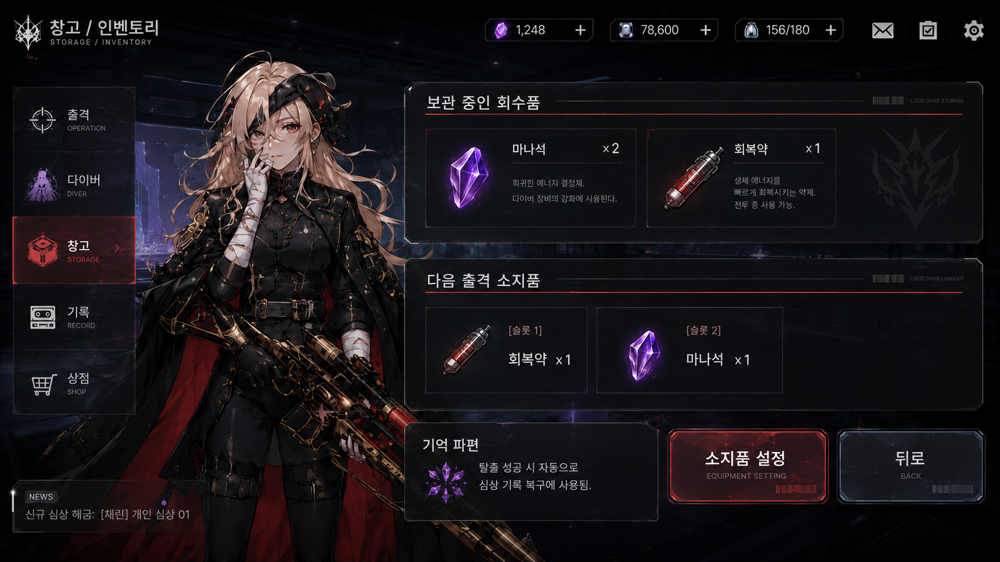

# P0 UI 플로우

> [!NOTE]
> 본 문서는 화면 전환 흐름을 정의하는 참조 문서입니다.
> UI 이미지 레퍼런스는 `04_UI_이미지_레퍼런스/` 폴더에서 확인합니다.
> 이미지에 보이는 UI와 실제 구현 범위가 다를 수 있습니다. 구현 범위는 `01_SSOT_최종_기준문서/`를 따릅니다.

---

## 1. 전체 화면 전환 플로우

```
[LobbyScene]
│
├─ [출격] 버튼 클릭
│   └─► SortiePreparePanel (로비 내 패널)
│         ├─ [출격 확정] 버튼 클릭
│         │   └─► [GameScene] (씬 전환)
│         │         ├─ HP 0 사망
│         │         │   └─► ResultPanel (실패)
│         │         │         └─ [로비로] 버튼
│         │         │             └─► [LobbyScene] (씬 전환)
│         │         └─ 전화부스 탈출
│         │             └─► ResultPanel (성공)
│         │                   └─ [로비로] 버튼
│         │                       └─► [LobbyScene] (씬 전환)
│         └─ [뒤로] 버튼
│             └─► LobbyMainPanel
│
├─ [다이버/기록] 버튼 클릭
│   └─► DiverRecordPanel (로비 내 패널)
│         ├─ 심상 기록 01 클릭 (해금 시)
│         │   └─► MemoryLogPopup (팝업 또는 스크롤)
│         │         └─ [닫기] 버튼
│         │             └─► DiverRecordPanel
│         └─ [뒤로] 버튼
│             └─► LobbyMainPanel
│
└─ [창고] 버튼 클릭
    └─► StorageInventoryPanel (로비 내 패널)
          ├─ 소지품 슬롯 조작 (클릭 전송/드래그)
          ├─ [소지품 설정] 버튼 클릭 (선택)
          │   └─► SortiePreparePanel (연동)
          └─ [뒤로] 버튼
              └─► LobbyMainPanel
```

---

## 2. 화면별 UI 구성 요약

### 2.1 LobbyMainPanel (로비 메인)


#### 주요 UI 구성 요소 분석

*   **다이버 스탠딩 및 상태 (중앙/좌측)**
    *   현재 설정된 다이버의 스탠딩 일러스트 출력 (예시 이미지의 캐릭터는 '레이라'이나 P0 실제 빌드는 **'채린'** 고정).
    *   캐릭터명(레이라/채린), 클래스명(크리티컬 스나이퍼 등), 현재 동조율 레벨 및 경험치 게이지(`동조율 Lv.1 (300 / 1000)`) 표시.
    *   다이버의 연결 상태를 표시하는 심박 센서 라인 및 텍스트(`상태: 링크 안정`).
*   **다이버 귀환/대화 텍스트 박스 (하단 중앙)**
    *   동조율 상태 또는 귀환 상황에 따른 다이버 전용 대사 텍스트 출력.
*   **화면 이동 메뉴 버튼 (우측 하단)**
    *   **출격 (OPERATION)**: 클릭 시 출격 준비 패널(`SortiePreparePanel`) 활성화.
    *   **다이버 (DIVER)**: 클릭 시 다이버 기록 패널(`DiverRecordPanel`) 활성화. 신규 심상 로그 해금 시 우상단에 **🔴 NEW** 빨간 점 표시 (P0.5).
    *   **창고 (STORAGE)**: 클릭 시 창고/인벤토리 패널(`StorageInventoryPanel`) 활성화.
*   **상단 재화 및 시스템 바 (상단)**
    *   보유 중인 재화(퍼플젬, 크레딧) 및 행동력(에너지 156/180) 실시간 표시.
    *   우상단 메일함, 퀘스트/체크리스트, 설정(톱니바퀴) 아이콘 배치.
*   **좌측 정보 보드 (좌측)**
    *   관제사 레벨 및 경험치(`관제자 Lv.27 (4280 / 9600)`), 링크 등급(`IV 안정 구간`), 침묵도시 탐사 진행도(`42% / CHAPTER 03 불현의 변`) 출력.
*   **알림 배너 (하단 좌측)**
    *   `NEWS 신규 심상 해금: [채린] 개인 심상 01`과 같은 시스템 이벤트 텍스트 롤링 배너 표시.

### 2.2 SortiePreparePanel (출격 준비)


#### 주요 UI 구성 요소 분석

*   **다이버 프로필 정보 (좌측)**
    *   출격할 다이버 정보 일러스트 카드 출력 (P0 사양은 **'채린'** 고정).
    *   다이버 이름, 클래스, 동조율 레벨 및 경험치 바, 상태 표시.
*   **출격 소지품 슬롯 (중앙 우측)**
    *   인게임 세션에 가지고 들어갈 소비 아이템(소지품) 설정 구역.
    *   **슬롯 1 / 슬롯 2**: 최대 2개 슬롯 지원. 장착된 아이템의 아이콘, 명칭 및 수량 표시 (예: `회복약 x 1`, `마나석 x 1`).
    *   하단 주의 문구: `장착한 소모품은 세션 중 사용 가능하다. INFORMATION` 노출.
*   **하단 조작 버튼 (우측 하단)**
    *   **창고에서 변경 (CHANGE FROM STORAGE)**: 클릭 시 창고/인벤토리 패널(`StorageInventoryPanel`)로 이동하여 소지품 변경 연동.
    *   **출격 (SORTIE START)**: 인게임 세션(`GameScene`) 진입 버튼. 빨간색 크로스헤어 강조 연출.
*   **상단 바 및 안내선**
    *   좌상단 뒤로가기 버튼(`LobbyMainPanel`로 복귀).
    *   하단 안내 배너에 출격 목표 지역 정보 표시 (`출격 지역: 침묵도시 - 루시드 다이버 / CHAPTER 03: 불현의 변`).

### 2.3 GameScene InGame HUD

| 쿼터뷰/탑다운 뷰 HUD 레퍼런스 (v0.1) | 횡스크롤/사이드 뷰 HUD 레퍼런스 (v0.1b) |
| :---: | :---: |
|  |  |

#### 주요 UI 구성 요소 분석 (두 타입 공통 및 특징)

*   **다이버 기본 상태 바 (좌하단 또는 좌상단)**
    *   **HP 바**: 다이버의 현재 체력 상태 (예: `287 + 19 / 580`, 초록색/빨간색 게이지).
    *   **MP 바**: 스킬 사용에 필요한 마나 수치 (예: `17 / 180`, 보라색/파란색 게이지).
    *   **배터리/플래시 게이지 (v0.1 특징)**: 탐사에 필요한 배터리 소모량 표기 (`58%`).
    *   다이버 초상화(v0.1b 특징) 및 캐릭터 이름 표시.
*   **무장 및 퀵슬롯 인터페이스 (하단 중앙 / 하단 우측)**
    *   **액티브 무기 슬롯**: 현재 장착하고 있는 총기 아이콘 및 잔탄 수 표시 (예: `24 / 120`).
    *   **스킬 단축키 (v0.1 특징)**: 평타(좌클릭), 방어/보호막(우클릭), 대시(Space - CD 0.3s), 던지기 스킬(Q) 등 쿨타임과 연동되는 액션 슬롯.
    *   **소비품 퀵슬롯**: 출격 준비에서 설정한 소비 아이템 단축 슬롯(숫자키 1, 2 매핑). 현재 수량 표기 (예: `회복약 x 5 / 마나석 x 3`).
*   **인게임 탐사 정보 (우상단 / 좌상단)**
    *   **미니맵 (v0.1 특징)**: 현재 구역(예: Occupied Office) 형태 및 아군/타깃 위치 표시.
    *   **목표 트래커**: 세션 클리어 조건 표시 (`Merchandise Collection & Base Defense`, 목표 달성 가치 `187/23500`, 퀘스트 아이템 `0/1` 등).
    *   **보스/네임드 몬스터 체력 바**: 화면 상단 중앙에 보스 몬스터 이름(`Breacher, Blessed by Cthugha`) 및 HP 게이지 출력.

### 2.4 ResultPanel (결과창)

#### 2.4.1 탈출 성공 시


##### 주요 UI 구성 요소 분석
*   **탈출 성공 헤더**: 중앙 상단에 큰 텍스트로 `탈출 성공 SUCCESS` 및 누적 `플레이 타임: 03:42` 표시.
*   **다이버 일러스트 및 전용 대사**: 좌측에 스탠딩 이미지 배치, 대사창에 탈출 성공에 따른 캐릭터 대사 출력 (`이번엔... 네 목소리가 끝까지 들렸어.`).
*   **[기록 복구] 영역 (중앙)**:
    *   획득한 기억 파편의 개수와 자동 소모 상태 표시 (`기억 파편 x1 자동 사용`).
    *   소모된 기억 파편을 바탕으로 이루어진 동조율 변화 출력 (`동조율 Lv.0 → Lv.1`).
    *   동조율 레벨업에 따라 복구된 `개인 심상 기록 01 해금` 상태 및 이동 화살표 아이콘 노출.
*   **[회수품 저장] 영역 (우측)**:
    *   인게임 세션에서 획득해 탈출 성공으로 안전하게 창고로 인입된 전리품 수량 및 창고 저장 안내 표기 (`마나석 x1 창고 저장`, `회복약 x1 창고 저장`).
*   **하단 조작 버튼**: `[로비로 돌아가기] RETURN TO LOBBY` (우하단 빨간색 버튼) 및 상세 패널을 여는 `DETAIL LOG` (좌하단) 배치.

#### 2.4.2 강제 각성 (탈출 실패) 시


##### 주요 UI 구성 요소 분석
*   **강제 각성 헤더**: 중앙 상단에 빨간색 경고 삼각 아이콘과 글리치 효과가 들어간 `강제 각성 FORCED AWAKENING` 및 `플레이 타임: 02:15` 표시.
*   **다이버 일러스트 및 전용 대사**: 좌측에 상처 입거나 힘들어하는 스탠딩 일러스트(DreamScar 버전 일러스트 적용) 배치, 대사창에 강제 각성 시의 대사 출력 (`미안해... 안개가 너무 짙어서, 더는...`).
*   **[기록 복구] 영역 (중앙)**:
    *   세션 실패로 인한 기억 파편의 유실 상태 표기 (`기억 파편 유실 (0개 사용)`, 결정체 아이콘 흑백 처리).
    *   동조율 변화가 없음을 명시 (`동조율 변화 없음 (Lv.0 유지)`).
    *   기록 해금 실패 상태 표기 (`개인 심상 기록 해금 실패`).
*   **[회수품 정산] 영역 (우측)**:
    *   인게임에서 획득했던 파밍 아이템들이 전부 유실되었음을 강조 표시 (`마나석 전체 유실 (0개 저장)`, `회복약 전체 유실 (0개 저장)` 문구 및 각 아이콘에 빨간색 **LOST** 도장 마크 표시).
*   **하단 조작 버튼**: 탈출 성공과 동일하게 `[로비로 돌아가기]` 및 `DETAIL LOG` 버튼 구성.

### 2.5 DiverRecordPanel (다이버/기록)


#### 주요 UI 구성 요소 분석

*   **다이버 카드 및 정보 (좌측)**
    *   현재 다이버 스탠딩 및 기본 정보(이름, 클래스, 동조율 레벨 및 경험치 바, 링크 상태) 표시.
    *   **다이버 소개 (좌하단)**: 다이버의 성격이나 배경을 나타내는 텍스트 상자 및 `상세 정보` 연동 버튼 배치.
*   **대사 박스 (하단)**
    *   기록 화면 진입 시 노출되는 전용 대사 출력 (`레이라의 소실된 기억 일부가 복구되었다.`).
*   **개인 심상 기록 리스트 (우측)**
    *   현재 다이버의 복구된 기억 및 해금해야 할 기록 목록 출력. 우상단에 페이지 번호(`1 / 20`) 노출.
    *   **해금된 기억 슬롯 (상단)**: `[OPEN] 기록 01 - 비 오는 날의 플랫폼`과 같이 상세 썸네일 이미지 및 스토리 시놉시스, 그리고 감상용 `기록 01 보기` 이동 버튼 활성화. 신규 복구 시 **NEW** 태그 부착.
    *   **잠긴 기억 슬롯 (하단)**: 자물쇠 아이콘과 함께 `[LOCK] 기록 02` 및 해금 조건인 `동조율 Lv.2 달성 시 해금` 경고 문구 표시. 클릭 비활성화 처리.
*   **하단 조작 버튼 (우하단)**
    *   `[ 뒤로 ]` 버튼을 눌러 로비 메인 화면(`LobbyMainPanel`)으로 복귀.

### 2.6 StorageInventoryPanel (창고/인벤토리)

#### 2.6.1 최신 드래그 앤 드롭 방식 UI (v0.2 - P0 개발 기준 사양)


##### 주요 UI 구성 요소 및 조작 사양 분석
*   **창고 보관 구역 (좌측)**
    *   현재 로비에 안전하게 누적 보관 중인 전체 아이템 목록. 보관 한도(`63 / 120`) 표시.
    *   마나석 및 회복약이 각각의 중첩 개수 단위로 슬롯 그리드에 노출됨.
*   **인벤토리 보유 구역 (우측 상단)**
    *   다이버가 다음 출격 시 몸에 지니고 들어갈 아이템 목록. 가방 소지 한도(`21 / 60`) 표시.
*   **창고 ↔ 인벤토리 이동 조작 (중앙)**
    *   두 그리드 사이에 드래그 앤 드롭 애니메이션 가이드 및 단방향/양방향 버튼 (`>>`, `<<`) 배치.
    *   **조작 방식**:
        *   아이템 슬롯을 **마우스 드래그 앤 드롭**하여 창고와 인벤토리 간에 직접 이동 가능.
        *   아이템 슬롯을 **더블 클릭**하거나 **클릭 전송**하여 반대편 구역의 빈 슬롯으로 즉시 이동 및 자동 중첩 처리.
    *   안내 팁: `TIP 아이템을 드래그하거나 더블 클릭하여 창고와 인벤토리 사이를 이동할 수 있습니다.`
*   **전투용 퀵 슬롯 설정 (우측 하단)**
    *   인게임 세션 내에서 Hotkey(숫자키 1~6)로 사용할 소비 기물 퀵 슬롯 영역.
    *   인벤토리 리스트의 소비 기물을 드래그 앤 드롭하거나 슬롯 등록 조작을 통해 장착.
    *   P0 사양 상 최대 2개 슬롯(슬롯 1, 2)만 활성화되며, 나머지 슬롯(3~6)은 자물쇠 아이콘으로 잠금 및 비활성화 처리 (v0.2 레퍼런스 이미지에는 슬롯 1~4가 채워져 있으나 P0 구현 사양은 **슬롯 1, 2만 활성화**하여 대응).
*   **기억 파편 특수 안내 배너 (하단 중앙)**
    *   기억 파편은 로비 창고나 인벤토리에 보관되지 않는 일시적 회수 자원임을 안내.
    *   **파편 획득 ➔ 탈출 성공 시 자동 소모 ➔ 동조율 상승 및 기록 해금**으로 이어지는 3단계 라이프사이클을 시각화(아이콘 및 화살표)하여 설명.
    *   주의 사항 명시: `세션 중 회수한 기억 파편은 로비 자원으로 축적되지 않습니다.`

---

#### 2.6.2 구버전 리스트 방식 UI (v0.1 - 참고용 아카이브)


##### 구버전 사양 특징 요약
*   드래그 앤 드롭 그리드가 아닌, '보관 중인 회수품' 목록과 '다음 출격 소지품' 슬롯을 수평으로 나열하고 우하단의 `[소지품 설정]` 버튼을 눌러 모달 창이나 서브 레이아웃으로 소지품을 설정하던 1차 프로토타입 형태.
*   P0 개발 효율 및 조작 직관성 강화를 위해 위의 **v0.2 (드래그 앤 드롭 및 클릭 전송 연동형) 사양으로 통합 변경**되었으므로, 본 v0.1 레이아웃은 참고용 아카이브로만 활용함.

---

## 3. P0 제외 화면 (구현 안 함)

| 화면 | 사유 |
|:---|:---|
| 영입/가챠 화면 | 다이버 1인 고정 빌드 |
| 스킨/코스튬 변경 | 리소스 절감 |
| 상점/크래프팅 | 재화 거래 로직 제외 |
| 소대원 편성 | 1인 플레이 전용 |
| 아이템 분해/판매 | 단방향 저장/사용만 검증 |
| 인벤토리 그리드 | 슬롯형 카운트만 구현 |

---

## 📜 Revision History

| 날짜 | 버전 | 내용 | 작성자 |
|:---:|:---:|:---|:---:|
| 2026-06-18 | v0.1 | 초안 생성 — P0 정의서 및 로비 UI 플로우 명세 기반 | Antigravity (CP 지시) |
| 2026-06-18 | v0.2 | 와이어프레임(ASCII)을 실제 UI 이미지 레퍼런스로 대체 및 화면별 요소 분석 추가 | Antigravity (CP 지시) |
