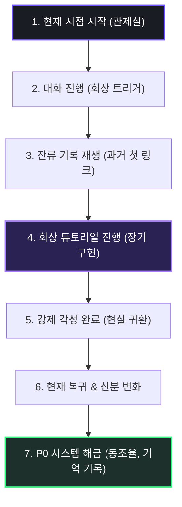

> [!IMPORTANT]
> 본 문서는 `침몽도시: 루시드 다이버`의 세계관, 플레이어 목적, 다이버 구원 서사, 프롤로그 방향을 정리한 시나리오 기준 문서입니다.
> P0 실제 구현 범위는 `최종 P0 정의서` 및 `P0 시스템 명세서`를 우선합니다.
> 본 문서의 루프/구원/모집/괴이화 설정은 장기 서사 방향을 포함하지만, P0에서는 채린 1명, 기억 파편 1종, 동조율 Lv.1, 개인 심상 기록 01, 귀환 대사 변화까지만 구현합니다.

---

# 📜 침몽도시: 루시드 다이버 — 시나리오 및 프롤로그 통합 기준 문서 v1.30

> **다이버는 잊는다.**
> **관제사는 기록한다.**
> **그리고 다시, 구하러 들어간다.**

---

## 0. 문서 상태 및 사용 규칙

| 항목 | 내용 |
| :--- | :--- |
| **버전** | v1.30 (서사 방향 전면 개편) |
| **작성일** | 2026.06.20 |
| **분류** | 기획 부록 참고문서 |
| **P0 구현 우선 기준** | `01_SSOT_최종_기준문서/00_최종_P0_정의서.md` |
| **상태** | 확정 |

### 이 문서에서 다루는 것

- 침몽도시 세계관과 꿈의 재난 구조
- 관제사와 다이버의 관계 및 서사적 책임
- 채린: 최초 불완전 귀환 다이버의 포지션
- 다이버 모집의 서사적 의미
- 프롤로그 방향성 (A. 장기 확장 / B. P0 최소 표현)
- P0에서 사용할 서사 표현과 제외 범위 분리

### 이 문서에서 다루지 않는 것 (별도 문서 참조)

- P0 시스템 구현 상세 명세 → `P0 시스템 명세서`
- 채린 캐릭터 심층 설정 → `캐릭터_심층기획_채린_통합본.md`
- 서브컬처 애착 시스템 상세 → `서브컬처_애착_기획_통합본.md`

---

## 1. 개요 및 업데이트 사양 v1.30

이번 v1.30은 기존 v1.21 이하 시나리오 문서를 **구조적으로 전면 개편**한다.

기존 문서는 세계관 기반 설정과 대사 스크립트 품질은 양호하였으나, 아래 문제가 누적되어 있었다.

**기존 문서의 핵심 문제**

1. 플레이어가 다이버를 구해야 하는 서사적 이유가 약하다.
2. 다이버 모집이 전술적 소대 확장 / 화력 보강처럼 설명되어 있다.
3. "귀환 신호 구조"와 "구원 루프"가 누락되어 있다.
4. 관제사가 다이버들의 실패 로그를 기억하는 유일한 존재라는 설정이 없다.
5. 채린이 최초 불완전 귀환 다이버라는 포지션이 약하다.
6. 동조율이 단순 호감도처럼 보인다.
7. 기억 파편이 다이버의 잃어버린 귀환 로그와 자아의 조각이라는 의미가 약하다.
8. 구하지 못한 다이버가 괴이로 변질된다는 장기 위험이 부족하다.
9. P0에서 제외해야 할 튜토리얼 10단계, 선택지, 호감도 선물, 3초 채널링 등이 본문에 남아 있다.

v1.30에서는 아래 서사 축을 중심으로 전체 문서를 재구성한다.

```
다이버는 잊는다.
관제사는 기록한다.
그리고 다시, 구하러 들어간다.
```

---

## 2. 세계관 및 배경 설정

### 2.1 사건 발생일 (The Day of Incident)

인류가 아직 범접하지 못한 영역인 **'꿈'**은 오랫동안 개인의 머릿속에서만 일어나는 현상으로 여겨졌다. 그러나 한 과학자가 대기 중에 비활성 상태로 떠다니는 미지의 입자 **'루시드(Lucid)'**를 발견하면서 상황은 달라졌다.

- **루시드 입자의 성질**: 평소에는 관측되지 않지만, 특정 주파수의 뇌파와 전자장에 반응하면 활성화되어 꿈의 이미지를 물리적 형상으로 응고시킨다.
- **루시드 캡슐**: 사용자의 수면 중 뇌파와 시각피질 신호를 분석하고, 이를 루시드 입자에 투사해 꿈의 장면을 현실에 홀로그램 형태로 재현하는 장치.

초기 실험에서 루시드 캡슐은 새로운 유형의 홀로그램 오락 장치처럼 여겨졌다. 사람들은 자신의 꿈이 눈앞에 펼쳐지는 환상적인 체험을 즐겼고, 거대 자본 기업은 이 기술을 세계에서 가장 부유한 도시의 핵심 오락 산업으로 포장해 홍보했다.

### 2.2 침몽도시(沈夢都市)의 탄생

루시드 캡슐은 정식 출시 첫날부터 폭발적인 반응을 얻었다. 한정 판매된 **1,000대**의 캡슐은 순식간에 매진되었고, 구매자들은 동시에 접속하여 깊은 수면에 들어갔다.

그러나 루시드 캡슐은 각자의 꿈을 완전히 격리된 공간에 투사하는 장치가 아니었다. 캡슐은 도시 상공의 루시드 입자를 공통 매질로 공유하고 있었고, 소규모 테스트에서는 드러나지 않았던 **대규모 꿈 파장의 간섭 및 공명 현상**이 동시 접속을 통해 폭발하듯 발생했다.

> 서로 다른 1,000명의 기억, 공포, 욕망, 무의식의 이미지가 하나의 거대한 악몽 네트워크로 뒤섞였고, 그 순간 도시의 일부 구역은 더 이상 현실도 단순한 꿈도 아닌 왜곡된 중첩 공간으로 변질되었다.

꿈의 식생이 건물 벽을 타고 자라났고, 신호등은 기이한 심장 박동에 맞춰 점멸했으며, 참가자들의 기억 속에 존재하던 거리와 방들이 실제 아스팔트 도로 위에 무작위로 겹쳐 나타났다. 정부는 즉시 해당 구역을 격리 및 봉쇄했으며, 사람들은 그 구역을 **'침몽도시'**라 부르기 시작했다.

### 2.3 침몽도시의 본질 (v1.30 개정)

침몽도시는 단순히 꿈과 현실이 겹친 재난 구역이 아니다.

```
침몽도시는 실패한 귀환, 잃어버린 기억, 반복된 죽음을
재료로 매 세션 재구성되는 꿈의 재난 구역이다.
```

다이버가 침몽도시에서 탈출하지 못하거나 강제 각성을 반복하면, 해당 세션의 경험과 감정 일부는 도시 안에 남는다. 이 남겨진 기억은 다음 세션에서 **기억 파편** 또는 **잔류 로그**의 형태로 흩어진다.

침몽도시는 단순히 공간을 왜곡하는 것이 아니라, **사람의 기억과 자아를 조금씩 흡수한다.** 오래 방치된 다이버일수록 침몽도시는 그 사람의 형상을 닮아간다.

---

## 3. 꿈의 법칙과 대항 수단

### 3.1 현실 무기가 멈춘 도시

침몽도시 내부에서 재현된 꿈은 단순한 시각적 환영이 아니며, 현실 물리 법칙과 기이하게 상호작용한다.

- **적대적 괴이들**: 뒤섞인 무의식의 악몽에서 태어난 존재들. 인간을 적대하고 공격한다.
- **몽막(夢幕)의 거부**: 이들의 몸을 둘러싸고 있는 '몽막'은 현실의 물리적 물질을 밀어내는 성질을 지닌다. 총탄은 형체를 그대로 통과해 흐려졌고, 화약 폭발은 안개처럼 무력하게 흩어진다.

도시를 수색하던 초기 구조대와 비공식 용병들은 이 꿈의 법칙을 알지 못한 채 진입했다가 전멸에 가까운 피해를 입었다. 그 안에서 살아남아 전투하기 위해서는 꿈과 동일한 매질로 이루어진 수단이 필수적이었다.

### 3.2 드림 포지드(Dream-Forged)와 심상무장

최초의 비공식 탐사 참사 이후, 침몽도시에 진입했던 10명의 용병 중 유일하게 살아 돌아온 한 명이 존재했다. 그는 버려진 꿈의 상가 내부에서 신비로운 형상의 총기를 발견해 살아남았다고 증언했다.

- **드림 포지드**: 루시드 입자가 누군가의 무의식 속 무기 이미지를 형상화한 **심상무장**.
  - *형태*: 어린 시절 장난감 총의 실루엣, 전장의 군용 소총 기억, 꿈속의 초현실적 기계 장치가 기묘하게 얽힌 모습.
  - *특징*: 루시드 입자와 동일한 매질로 구성되어 침식체의 몽막을 타격할 수 있는 유일한 수단. 침몽도시 내부에서만 완전한 물리적 출력을 가진다.

### 3.3 루시드 오염과 NDMA의 탄생

드림 포지드를 확보했음에도 탐사는 극도로 제한적이었다. 첫 생존자는 귀환 후 며칠 만에 사망했으며, 신경계가 루시드 입자에 의해 완전히 붕괴되어 있었다.

> [!WARNING]
> **루시드 오염 (Lucid Pollution)**
> 침몽도시 내부의 루시드 입자는 호흡기, 피부, 오감을 통해 인체에 침투합니다. 일정 한계 수치를 초과하면 대상의 기억과 정신 자체가 침몽도시의 구조물과 악몽 네트워크로 영원히 끌려 들어가 소실됩니다.

이 사실이 퍼지자 자원하는 용병들은 사라졌고, 침몽도시는 내부의 몽유물이 축적됨에 따라 점점 외부 현실 영역으로 경계를 확장해 나갔다.

정부는 사태를 방치할 수 없다고 판단하여 두 가지 중대 결정을 내린다.

1. **국가소속 침몽도시 대응 기관(NDMA) 설립**: 민간 용병들의 진입을 법적으로 전면 금지하고, 침몽도시 통제와 탐사를 전담할 범국가적 컨트롤 타워를 창설했다.
2. **특수요원 '루시드 다이버(Lucid Diver)' 육성**: 침몽도시의 정신적 왜곡과 오염을 버텨낼 수 있는 **'루시드 공명 적성자'**들을 선발했다. 이들은 관제사와 실시간 뇌파 동조 링크를 맺으며 무의식의 심층부로 잠수하는 전문 특수요원으로 체계화되었다.

---

## 4. 관제사와 다이버

### 4.1 다이버란 무엇인가 (v1.30 재정의)

다이버는 꿈속 무장을 사용할 수 있는 특수 전투원이지만, 동시에 가장 위험한 상태에 있는 사람이다.

```
다이버는 침몽도시와 공명하여 심상무장을 사용할 수 있는 생존자다.
하지만 다이버 적합자는 축복받은 전투원이 아니라,
이미 침몽도시와 깊게 연결되어 있는 위험군이다.
```

**구하지 못한 다이버의 운명**:

```
구조하지 못한 다이버는 기억과 자아를 잃고,
끝내 침몽도시 안에서 플레이어를 위협하는 괴이로 변질된다.
```

이 설정이 플레이어가 다이버를 구해야 하는 가장 큰 명분이다. 다이버를 구하는 것은 선의가 아니라, 그 사람이 괴이로 변하기 전에 붙잡는 것이다.

### 4.2 관제사란 무엇인가 (v1.30 재정의)

플레이어는 단순히 착한 구조자가 아니다.

관제사의 책임은 아래에서 온다.

```
1. 관제사는 침몽도시에 남겨진 귀환 신호를 읽을 수 있다.
2. 다이버들은 실패한 세션을 대부분 기억하지 못한다.
3. 하지만 관제 로그에는 그 실패와 구조 시도가 남아 있다.
4. 관제사가 링크를 붙잡지 않으면 다이버는 자아를 잃고 괴이로 변질된다.
5. 관제사는 그들이 사라지는 순간을 들었고, 그 기록을 가진 유일한 사람이다.
```

관제사는 단순한 선인이 아니다. **다이버들이 잊어버린 귀환을 유일하게 기억하는 사람**이다.

### 4.3 플레이어의 특이 적성

플레이어는 침몽도시 최초 사고 당시 귀환 링크 채널에 접속해 있었던 특이 적합자다. 의식이 침몽도시 내부로 끌려 들어갔다가 기적적으로 귀환했으며, 그 대가로 **침몽도시 내부의 귀환 신호를 수신하는 특이 반응 적성**을 얻었다.

플레이어가 구해야 하는 이유는 단순한 자기 기억 찾기가 아니다.

```
플레이어는 채린이 몇 번이나 실패했고,
마지막 순간 자신의 목소리에 반응해 돌아왔다는 사실을
관제 로그를 통해 알고 있다.

채린은 그것을 기억하지 못한다.
하지만 플레이어는 기억한다.
그리고 그 기록을 가진 사람이 다시 들어가지 않으면,
채린의 다음 실패를 붙잡을 사람은 없다.
```

### 4.4 플레이어의 사명 (v1.30 수정)

```
관제사는 침몽도시에 남겨진 귀환 신호를 추적하고,
다이버들이 잊어버린 실패와 기억 파편을 회수하여,
그들이 괴이로 변질되기 전에 현실로 되돌리는 것을 사명으로 삼는다.
```

자기 기억 추적은 장기 메인 스토리의 숨은 축으로 남아 있으나, P0 소개 및 프롤로그의 전면 명분으로 쓰지 않는다.

### 4.5 다이버 모집: 귀환 신호 구조 (v1.30 재정의)

다이버 모집은 전투 유닛 획득이 아니다.

```
관제사는 침몽도시 안에서 채린과 유사한 잔류 신호를 발견한다.
이 신호들은 아직 완전히 괴이로 변질되지 않은 다이버 후보자들의 귀환 신호다.

다이버를 모집한다는 것은 새로운 전투원을 고용하는 것이 아니라,
침몽도시에 삼켜질 위기에 있는 사람에게 링크를 걸고,
그 사람의 기억 파편을 회수하여 현실로 돌아올 길을 되찾게 하는 구조다.
```

**일반 수집형 게임 vs 루시드 다이버 비교**

| 일반 수집형 게임 | 루시드 다이버 |
| :--- | :--- |
| 캐릭터를 획득한다 | 귀환 신호를 발견한다 |
| 전투력을 강화한다 | 자아 붕괴를 막는다 |
| 호감도를 올린다 | 잃어버린 기억을 복구한다 |
| 캐릭터 스토리를 해금한다 | 구원의 과정을 확인한다 |

전술적 소대 확장은 모집의 두 번째 이유로만 설명한다.

### 4.6 구원된 다이버가 다시 다이브하는 이유

```
구원된 다이버는 관제사의 명령을 따르는 것이 아니라,
자신이 구조받았기 때문에 다른 사람을 구조하러 다시 들어간다.
```

구원된 다이버는 침몽도시에서 완전히 자유로워지는 것이 아니다. 그들은 그곳의 공포를 기억하고, 자신과 같은 운명에 빠진 다른 사람의 잔류 신호를 감지한다. 그렇기 때문에 구원된 다이버들은 관제사의 명령에 복종하는 것이 아니라, 스스로의 선택으로 다시 다이브한다.

---

## 5. 채린: 최초의 불완전 귀환자

### 5.1 채린의 포지션 확정 (v1.30)

채린은 P0의 메인 다이버이며, 아래 포지션으로 확정한다.

```
채린은 최초로 불완전 귀환에 성공한 다이버다.
```

채린은 완전히 구원된 캐릭터가 아니다. 그녀는 **"구원이 가능하다는 것을 처음 증명한 다이버"**다.

채린은 관제사를 기억하지 못한다. 하지만 관제사는 채린이 몇 번이나 실패했고, 마지막 순간 어떤 목소리에 반응해 돌아왔는지 알고 있다.

**채린의 핵심 관제 로그**:

```
동일 대상 귀환 시도  17회
강제 각성 (실패)    16회
최종 귀환 성공      1회
마지막 링크 유지자  관제사
```

### 5.2 채린의 성격과 기시감

- **성향**: 타인의 말보다 자신이 직접 보고 겪은 것만 믿는 지독한 **'방어적 불신'**의 소유자.
- **불신의 근거**: 과거 사건에서 자신의 경고를 아무도 믿어주지 않았던 경험.
- **기시감**: 관제사의 목소리를 들을 때마다 설명할 수 없는 불편한 익숙함을 느낀다. 하지만 이유를 기억하지 못한다.
- **광학 모티프**: 깨진 안경 렌즈, 쇼윈도 거울 반사, 굴절, 시야 왜곡. 채린이 세상을 보는 방식은 항상 어딘가 '굴절되어' 있다.

**채린의 공유되는 환상**: 동조율이 상승할 때마다 링크 채널에는 '붉게 깨진 유리 파편, 비정상적으로 흔들리는 안개 너머의 시야, 그리고 서로를 붙잡았던 필사적인 손'이 노이즈처럼 흘러나온다.

### 5.3 P0에서 채린을 통해 검증하는 루프

P0에서는 채린 한 명을 통해 아래 루프를 검증한다.

```
기억 파편 회수
→ 탈출 성공
→ 동조율 상승
→ 개인 심상 기록 01 해금
→ 귀환 대사 변화
→ 캐릭터 구원 보상 체감
```

---

## 6. 용어 기준 정의

### 6.1 동조율 (Link Rate) — 호감도가 아니다

기존 문서의 '호감도'라는 표현은 본문에서 제거한다. 기본 용어는 **동조율**로 통일한다.

```
동조율은 호감도가 아니라,
관제사와 다이버 사이의 귀환 링크 안정도다.
```

**동조율 단계별 의미**:

| 동조율 상태 | 다이버의 반응 |
| :--- | :--- |
| 낮을 때 | 관제사의 목소리는 노이즈처럼 들린다 |
| 오를 때 | 다이버는 관제사의 목소리에 설명할 수 없는 기시감을 느낀다 |
| 일정 수준 도달 시 | 잃어버린 기억과 심상 기록이 복구된다 |
| 충분히 안정될 때 | 다이버는 침몽도시에 삼켜지는 운명에서 한 걸음 벗어난다 |

**P0 구현 범위**: 동조율 Lv.0 → Lv.1 상승 1회.

### 6.2 기억 파편 — 잃어버린 귀환 로그의 조각

기억 파편은 단순한 제작 재료나 일반 아이템이 아니다.

```
기억 파편은 다이버가 이전 침몽 세션에서 잃어버린
기억, 감정, 약속, 죽음, 구조 시도의 흔적이다.
```

채린의 기억 파편 시각 모티프: **깨진 안경 렌즈 조각이 루시드 결정화된 형태**

**P0에서 기억 파편의 흐름**:

```
세션 중 획득
→ 탈출 성공 시 자동 소모
→ 동조율 상승
→ 개인 심상 기록 01 해금
→ 귀환 대사 변화
```

**실패 시**:

```
강제 각성 시 기억 파편은 유실되며,
이번에 되찾을 수 있었던 기억은 다시 침몽도시로 가라앉는다.
```

### 6.3 전화부스 — 현실과 꿈을 잇는 탈출 매개체

공중전화기는 현실 세계와 무의식의 깊은 소통을 상징하는 '연결의 매개체'다.

침몽도시 안에서 현실 관제실과의 신경 링크 채널을 증폭하고 정신을 안전하게 지상으로 인양하기 위해서는 강력한 뇌파 중계 노드가 필요하다. 도심 곳곳에 흩어진 공중전화부스는 현실의 통신선 네트워크 잔재와 결합하여 안정적인 정신 탈출용 싱크 포인트를 형성한다.

**P0 구현 기준**:

```
P0에서는 전화부스 Collider 접촉 즉시 탈출 성공으로 처리한다.
3초 채널링, 수화기 유지, 이탈 취소는 P0.5 또는 확장 구현이다.
```

---

## 7. 프롤로그 구조

### 7.1 두 층의 프롤로그

기존 10단계 튜토리얼은 P0 기준으로 너무 크다. v1.30에서는 프롤로그를 두 층으로 분리한다.

**A. 장기 확장 프롤로그 방향 (구현 범위 아님)**

```
1. 현재 시점 관제실
2. 잔류 로그 재생
3. 첫 링크 회상
4. 채린의 불완전 귀환 재현 (회상 튜토리얼)
5. 현재 복귀
6. 다이버/기록 해금
```

**B. P0에서 실제 표현할 최소 프롤로그**

```
1. 로비/관제실에서 채린의 거리감 있는 대사
2. 기억 파편 획득
3. 탈출 성공
4. 결과창에서 동조율 Lv.1 상승
5. 개인 심상 기록 01 해금
6. 기록 본문에서 채린의 과거 귀환 로그 확인
7. 로비 복귀 후 채린 대사 변화
```

P0 문서에서는 10단계 튜토리얼을 실제 구현 범위처럼 보이게 하지 않는다.

### 7.2 장기 확장: 회상 튜토리얼 서사 구조

> [!NOTE]
> 이 섹션은 **장기 확장 방향 기획 자료**입니다. P0에서는 구현하지 않습니다.



### 7.3 프롤로그 요약: 끊어진 귀환 로그

```
게임은 현재 시점의 관제실에서 시작된다.

플레이어는 REMnants/NDMA 산하 특수 링크 관제사로,
메인 다이버 채린과 정기 링크 점검을 진행한다.

채린은 플레이어를 전적으로 신뢰하지 않는다.
그녀는 관제사의 목소리에 설명할 수 없는 기시감을 느끼지만,
그 이유를 기억하지 못한다.

링크 점검 도중, 채린의 뇌파와 관제 로그가 공명하며
과거의 잔류 기록이 재생된다.

로그에는 채린이 침몽도시에서 동일한 귀환 시도를 17회 반복했고,
16회 강제 각성에 실패하거나 불완전 귀환했으며,
마지막 1회에서 플레이어의 목소리에 반응해 현실로 돌아왔다는
기록이 남아 있다.

채린은 그 기록을 믿지 않는다.
하지만 관제사의 목소리를 들을 때마다,
그녀는 알 수 없는 불편한 익숙함을 느낀다.

이후 플레이어는 채린과 함께 침몽도시에 다시 진입한다.
목표는 단순한 파밍이 아니다.

채린이 잃어버린 기억 파편을 회수하고,
그녀가 괴이로 변질되는 운명에서 한 걸음 멀어지게 하는 것이다.
```

### 7.4 현재 시점 시작: 시스템 텍스트 연출

```text
[SYSTEM] 국가소속 침몽도시 대응 기관 (NDMA)
[SYSTEM] 루시드 링크 관제실 (LLCR-04)
[SYSTEM] 관제사 등록명: 플레이어 (PLAYER)
[SYSTEM] 메인 다이버: 채린 (CHAERIN)
[SYSTEM] 링크 점검 준비 중... 파장 동조 개시.
```

### 7.5 회상 트리거 대사 스크립트

두 사람의 사적인 대화가 깊어지며 과거의 기억을 강하게 이끌어낸다.

- **채린**: "오늘 임무 나왔어?"
- **플레이어**: "응, 청몽 외곽이야. 슬슬 준비하자."
- **채린**: "...또 지옥행이네."
- **플레이어**: "무리하지 마. 신호 이상하면 바로 끌어올릴 테니까."
- **채린**: "됐어. 네가 뒤에 있을 땐 길 잃은 적 없으니까."
- **플레이어**: "처음엔 내 목소리만 들려도 진저리 쳤으면서."
- **채린**: "당연한 거 아냐? 모르는 목소리가 머릿속을 헤집는데 누가 좋아해?"
- **채린**: "...그날 기억나? 우리 처음 연결됐던 날."
- **플레이어**: "청몽 교차로."
- **채린**: "출구 없는 덫. 내 경고를 아무도 안 믿어줬던 날."

> 화면 전체에 디지털 노이즈가 강하게 발생하며, 적색 시스템 경고등과 함께 잔류 로그가 출력된다.

```text
[WARNING] 동조율 급증으로 인한 과거 데이터 역류 발생.
[SYSTEM] 잔류 기록 재생: 첫 번째 링크 (First Link)
[SYSTEM] 대상 지대: 청몽 교차로 테스트 돔 (Test Dome 01)
```

### 7.6 장기 확장: 튜토리얼 10단계 (구현 범위 아님)

> [!NOTE]
> 아래 튜토리얼 10단계는 **장기 확장 방향의 기획 자료**입니다.
> P0에서는 대사 선택지, 오염도 제한 시간, 3초 채널링, 에임 보정 패시브 등을 구현하지 않습니다.

| 단계 | 장면 | 학습 기능 | 비고 |
| :---: | :--- | :--- | :--- |
| 1 | 연구 시설 링크 테스트 | 관제 UI 소개 | HP / 마나 / 파장 화면 기초 |
| 2 | 채린과의 첫 통신 | 대화 선택지 | 확장 구현 |
| 3 | 청몽 교차로 진입 | 이동 튜토리얼 | WASD / 패드 조작 |
| 4 | 시야의 어긋남 인지 | 관제자 시야 보정 | 확장 구현 |
| 5 | 꿈식자 출현 | 전투 튜토리얼 | 기본 권총 사격 |
| 6 | 드림 포지드 불안정 | 출력 보정 | 에임 보정 패시브 — 확장 구현 |
| 7 | 깨진 렌즈 조각 발견 | 기억 파편 회수 | P0 핵심 루프 기초 |
| 8 | 오염 수치 상승 | 위험도 안내 | 오염도 제한 — 확장 구현 |
| 9 | 전화부스 도달 | 탈출 튜토리얼 | 3초 채널링 — 확장 구현 |
| 10 | 강제 각성 성공 | 익스트랙션 완료 | 붕괴 연출 |

**튜토리얼 핵심 대사 (아카이브 보존)**:

[7단계: 깨진 렌즈 조각 발견 — 기억 파편의 의미 전달]
- **플레이어**: "처치 확인. 바닥에 반짝이는 유리 파편 주워. 네 파장이랑 동조하고 있어."
- **채린**: "이건... 내 깨진 안경알 렌즈 조각...? 왜 이런 게 꿈속에 굴러다녀?"
- **플레이어**: "네 잃어버린 기억이 실체화된 거야. 돌아갈 때 필요하니까 잘 챙겨 둬."

[9단계: 전화부스 도달]
- **플레이어**: "저기 주황색 공중전화부스 보이지? 저기가 탈출구야. 수화기를 들어!"
- **채린**: "전화기...? 자꾸 내 안에서 전화 벨소리가 울려..."
- **플레이어**: "수화기를 들어! 내 목소리에만 집중해."

[10단계: 강제 각성]
- **연구원**: "한계 초과! 뇌파 붕괴 5초 전! 링크 끊고 당장 강제 각성해!"
- **플레이어**: "아직 안 돼, 정신 놔버리지 마! ...강제 각성 가동! 채린, 눈 떠!"
- **채린**: "아... 목소리가... 점점 멀어져..."
- **시스템**: `[SYSTEM] 강제 각성 승인. 다이버 신경 인양 완료.`

---

## 8. P0에서 사용할 서사 표현

### 8.1 P0 해금 명세

```text
★ SYSTEM UNLOCKED ★
- 동조율 Lv.1 도달
- 개인 심상 기록 01: 끊어진 귀환 로그 해금
- 다이버/기록 메뉴 NEW 표시
- 귀환 대사 변화
```

### 8.2 결과창 서사 표현

**탈출 성공 시**:

```text
기억 파편 → 동조율 상승
이번 기억은 침몽도시로 가라앉지 않았다.
```

**강제 각성 실패 시**:

```text
획득한 기억 파편 전부 유실.
이번에 되찾을 수 있었던 기억은 다시 가라앉는다.
채린과의 귀환 링크가 불안정합니다.
```

### 8.3 로비 서사 표현

동조율 Lv.0 시점 채린의 대사는 거리감과 불신을 표현한다. Lv.1 해금 후에는 설명할 수 없는 익숙함을 드러내는 방향으로 변화한다.

**Lv.0 (초기)**: "다음 임무 준비해. 한가하게 대화할 시간 없어."

**Lv.1 (심상 기록 해금 후)**: "아직 전부 믿는 건 아냐. 그래도… 네 신호만큼은 따라갈게."

---

## 9. P0에서 사용하지 않는 확장 서사

아래 요소들은 확장 서사 또는 장기 백로그로 분리한다. P0 구현 범위처럼 표현하지 않는다.

```
- 몽막 / 심상핵 상세 전투 시스템
- 에임 보정 패시브 스킬
- 프리즘 유탄
- 오염도 제한 시간
- 3초 전화부스 채널링 / 수화기 유지 / 이탈 취소
- 대화 선택지
- 선물하기
- 다단계 호감도 / 사이드 스토리 능력치 상승
- 다이버 다수 영입 / 1메인 + 2서포트 편성
- 괴이 변질 다이버와의 실제 전투 / 보스전
- 각성 보존 슬롯 (P0 기준으로 강제 각성 시 모든 획득품 유실)
- 실제 회차 시스템 / 시간 루프 시스템
- Live2D / 풀보이스
```

---

## 10. 개인 심상 기록 01

### 제목: 끊어진 귀환 로그

채린은 자신이 처음 다이브한 날을 기억하지 못한다.
하지만 관제 로그에는 남아 있다.

동일 대상 귀환 시도 17회.
강제 각성 16회.
최종 귀환 성공 1회.
마지막 링크 유지자: 관제사.

채린은 그 기록을 믿지 않는다.
기억나지 않는 실패는 자신의 것이 아니라고 생각한다.

하지만 마지막 로그에서 시선을 떼지 못한다.

> "대상자, 의식 붕괴 직전 관제사의 음성에 반응.
> 귀환 신호 재동기화 성공."

그녀는 기억하지 못한다.
하지만 몸은 알고 있다.
그 목소리가 자신을 놓지 않았다는 것을.

---

## 11. 상황별 대사 초안

### 최초 링크 / 로비 기본

```
"너를 믿으라고? 내가 기억도 못 하는 사람을?"
```

### 기억 파편 획득

```
"이 조각… 왜 이렇게 익숙하지?"
```

### 탈출 성공

```
"이번엔… 네 목소리가 끝까지 들렸어."
```

### 동조율 상승

```
"네 목소리, 처음 듣는 게 아닌 것 같아."
```

### 개인 심상 기록 해금

```
"기억났어. 너, 그때도 거기 있었지."
```

### 강제 각성 실패

```
"안 돼… 또 가라앉는 건 싫어. 관제사, 내 신호 놓치지 마."
```

### 로비 복귀 후 변화 (Lv.1 이후)

```
"아직 전부 믿는 건 아냐. 그래도… 네 신호만큼은 따라갈게."
```

---

## 12. 설정 및 개연성 Q&A

### Q. 왜 관제사는 다이버를 구해야 하는가?

관제사는 침몽도시에 남겨진 귀환 신호를 읽을 수 있는 특이 적합자이기 때문이다. 다이버들은 실패한 세션의 대부분을 잊지만, 관제 로그에는 그 실패와 구조 시도가 남는다. 관제사가 링크를 붙잡지 않으면 다이버는 기억과 자아를 잃고 괴이로 변질된다. 따라서 관제사는 단순한 선의로 구조하는 것이 아니라, 그들이 잊어버린 귀환을 기억하는 유일한 사람으로서 다시 다이브를 지시한다.

### Q. 왜 다이버를 모집하는가?

다이버 모집은 전투 유닛 획득이 아니라, 침몽도시에 남겨진 귀환 신호를 발견하고 링크하는 과정이다. 아직 완전히 괴이로 변질되지 않은 생존자의 신호를 감지하고, 그들의 기억 파편을 회수하여 현실로 돌아올 길을 되찾게 하는 것이 모집의 본질이다.

### Q. 왜 구원된 다이버는 다시 다이브하는가?

구원된 다이버는 침몽도시의 공포와 자아 붕괴의 감각을 기억한다. 그들은 자신과 같은 운명에 놓인 사람들의 잔류 신호를 감지할 수 있으며, 자신이 구조받았기 때문에 다른 사람을 구조하기 위해 다시 들어간다.

### Q. 동조율은 호감도와 무엇이 다른가?

동조율은 단순 호감도가 아니라, 관제사와 다이버 사이의 귀환 링크 안정도다. 동조율이 높아질수록 다이버는 관제사의 목소리를 노이즈가 아니라 현실로 돌아오는 신호로 인식하게 된다.

### Q. 왜 기억 파편이 특별한 보상인가?

기억 파편은 단순한 강화 재화가 아니다. 그것은 다이버가 이전 세션에서 잃어버린 기억, 감정, 죽음, 구조 시도의 흔적이 루시드 입자와 결합해 결정화된 것이다. 이 파편을 회수한다는 것은 다이버의 잃어버린 자아를 조금씩 복구하는 행위다.

### Q. 왜 다이버는 드림 포지드 무장을 사용하는가?

침몽도시의 침식체(괴이)들은 현실의 물질적 타격을 무효화하는 '몽막'을 지니고 있다. 드림 포지드는 사용자의 무의식적 이미지와 루시드 입자가 결합해 형상화된 심상무장이기 때문에, 적의 몽막과 동일한 뇌파 파동 매질을 공유하여 몽막을 물리적으로 타격하고 파괴할 수 있다.

### Q. 왜 기본 무장이 에너지 권총인가?

에너지를 압축하여 발사하는 형태는 뇌파 소모율(마나 소모 1)이 가장 적어 다이버의 정신적 안정성을 유지하는 데 가장 적합한 기본 설계다. 에너지 권총은 최소한의 의식 동조만으로 구동할 수 있어 P0 프로토타입 검증용 기본 무장으로 채택되었다.

### Q. 왜 강제 각성 시 모든 획득품을 잃는가?

강제 각성은 정상적인 탈출 경로가 아닌 신경망 강제 차단 방식이기 때문에, 현실로 인양되던 일반 인벤토리의 전리품들은 차원 접점이 끊어져 침몽도시로 100% 분실된다. P0에서 각성 보존 슬롯은 구현하지 않는다.

### Q. 왜 전화부스를 통해 탈출하는가?

도심 곳곳에 흩어진 공중전화부스는 현실의 통신선 네트워크 잔재와 결합하여 안정적인 정신 탈출용 싱크 포인트를 형성한다. P0에서는 Collider 접촉 즉시 탈출 성공으로 처리한다.

---

## 13. P0 / 확장 분리 표

| 요소 | P0 표현 | 확장 표현 |
| :--- | :--- | :--- |
| 루프 서사 | 기록/대사/결과창 문구로 암시 | 실제 회차 구조, 장기 메인 스토리 |
| 채린 | 동조율 Lv.1, 기록 01 | 다단계 심상 기록, 완전 구원 |
| 다이버 모집 | 구현 없음, 설정으로만 언급 | 귀환 신호 발견, 신규 다이버 구조 |
| 괴이 변질 | 설정/위험으로만 언급 | 실제 적/보스/스토리 분기 |
| 동조율 | Lv.0 → Lv.1 | 다단계 링크 안정도 |
| 기억 파편 | 1종, 자동 소모 | 캐릭터별 기억 파편 |
| 전화부스 | Collider 접촉 즉시 탈출 | 채널링, 방해, 탈출 연출 |
| 호감도/선물 | 제외 | 장기 BM/캐릭터 애착 확장 |
| 각성 보존 슬롯 | 제외 — 강제 각성 시 전부 유실 | 관제사 고보안 정신 장벽 금고 |
| 대화 선택지 | 제외 | 장기 서사 분기 |
| 에임 보정 패시브 | 제외 | 관제사 스킬 시스템 |
| 오염도 제한 시간 | 제외 | 세션 긴장감 강화 |
| 소대 편성 | 제외 | 1메인 + 2서포트 |
| Live2D / 풀보이스 | 제외 | 정식 서비스 |

---

## 📜 Revision History

| 날짜 | 버전 | 내용 | 작성자 |
| :---: | :---: | :--- | :---: |
| 2026.06.12 | v1.00 | 최초 시나리오 문서 기안 및 등록 | 김남해 |
| 2026.06.12 | v1.01 | 피드백 반영 (드림 포지드 명칭 정의 및 루시드 오염 디테일 보완) | 김남해 |
| 2026.06.15 | v1.02 | 1메인 + 2서포트 다이버 스쿼드 편제 변경점 수록 | 김남해 |
| 2026.06.17 | v1.10 | 메인 다이버를 '채린'으로 통합 및 신규 설계<br>현재 관제실→과거 회상 튜토리얼→현재 복귀 구조 확립<br>튜토리얼 10단계 및 연동 게임 기능 기획 수록 | 김남해 |
| 2026.06.17 | v1.11 | 멀티플레이어 환경 설정을 위한 '다수 관제사' 설정 보강<br>관제사가 전담 팀 지휘관으로서 타 다이버를 모집/편제하는 정당성 추가 | 송예찬 |
| 2026.06.17 | v1.12 | 회상 튜토리얼 단계별 대사 스크립트 간결화 및 어휘 정제 | 송예찬 |
| 2026.06.17 | v1.13 | 튜토리얼 5~6단계 전투 무장을 특화 소총에서 기본 에너지 권총으로 변경<br>6단계 출력 보정 연출에 패시브 스킬 발동 명시 | 송예찬 |
| 2026.06.18 | v1.20 | AI(Antigravity) 기획 정교화 정합성 검수 결과 반영<br>1장과 2장 중복 서사 및 튜토리얼 스크립트 전면 병합·단일화 | Antigravity |
| 2026.06.18 | v1.21 | 대재앙 당일 채린의 행동 반경과 NDMA 테스트 돔 간의 서사적 개연성 정교화<br>쇼윈도 유리 반사 및 안경알 렌즈 등 채린의 광학적 모티프 반영 | Antigravity |
| 2026.06.19 | v1.22 | NDMA 설립 기원 및 용병 몰락, 루시드 공명 증상의 구체적 설정 보완<br>채린의 총기 미숙 대사 뉘앙스 보강 | Antigravity |
| 2026.06.20 | v1.30 | 최신 PPT/HTML 제안서 방향성 반영하여 서사 전면 개편<br>관제사 서사 재정의: 실패 로그와 귀환 신호를 기억하는 유일한 링크 적합자<br>채린을 최초의 불완전 귀환 다이버로 재정의<br>다이버 모집을 전투 유닛 획득이 아닌 귀환 신호 구조로 수정<br>동조율을 호감도가 아닌 귀환 링크 안정도로 재정의<br>기억 파편을 잃어버린 귀환 로그/자아의 조각으로 재정의<br>구하지 못한 다이버가 괴이로 변질된다는 장기 위험 추가<br>P0 구현 범위와 확장 서사 분리표 신설<br>개인 심상 기록 01 제목 및 본문 교체: '끊어진 귀환 로그'<br>상황별 대사 초안 신규 추가<br>장기 확장 Q&A 보강 | 장수영 / Antigravity |
