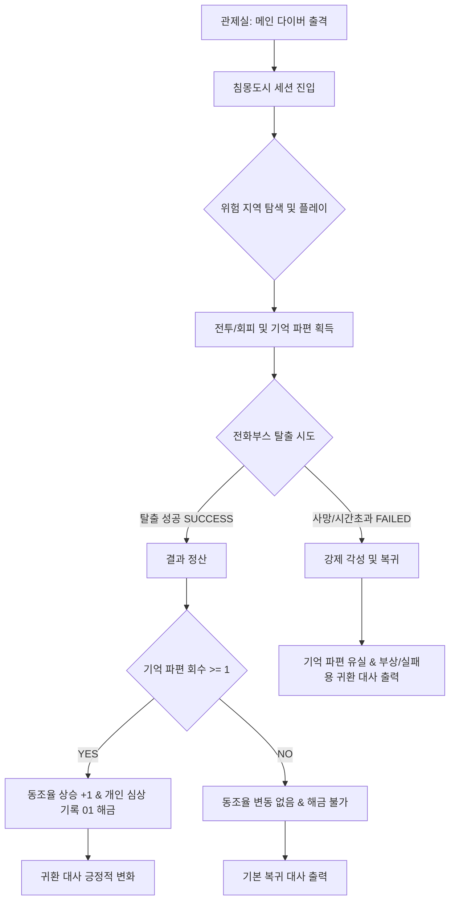

> [!IMPORTANT]
> **문서 분류: 기획 부록 참고문서 (P0 개발 기준 문서 아님)**
> 본 문서는 P0의 감정 보상 루프와 서브컬처 애착 구조를 설명하기 위한 참고 문서입니다.
> P0 개발 범위 판단은 `01_SSOT_최종_기준문서/00_최종_P0_정의서.md` 및 `01_P0_시스템_명세서.md`를 우선합니다.
> 본 문서의 내용 중 3초 탈출 채널링, 장기 동조율 누적, 연출 강화 등은 시스템 명세와 충돌할 경우 P0.5 또는 확장으로 분류합니다.

# 💖 침몽도시: 루시드 다이버 - 통합 서브컬처 애착 기획서

---

## Part 1. 서브컬처 캐릭터 애착 루프 기획 (SSOT)

### 1. 문서 목적
본 문서는 `침몽도시: 루시드 다이버`의 최종 프로토타입에서 검증할 **서브컬처 캐릭터 애착 루프**를 설계하기 위한 기획서입니다.
본 프로젝트의 최종 목표는 메인 다이버 1명을 중심으로 **'PvE 익스트랙션 루프'와 '서브컬처 캐릭터 애착 루프'가 유기적으로 결합될 수 있음을 증명하는 포트폴리오 빌드**를 제작하는 것입니다. 익스트랙션 세션을 통해 획득한 보상이 아웃게임의 감정적 보상(동조율, 시나리오 해금, 대사 변화)으로 자연스럽게 이어지는 최소 검증 구조를 설계합니다.

### 2. 최종 프로토타입에서 검증할 서브컬처 루프
플레이어는 아래 흐름을 통해 익스트랙션의 플레이 피드백과 캐릭터 유대의 시너지를 체감합니다.
```text
관제실 → 메인 다이버 출격 → 침몽도시 진입 → 전투 / 회피 → 기억 파편 회수 → 전화부스 탈출 → 결과 정산 → 동조율 상승 → 개인 심상 기록 해금 → 귀환 대사 변화
```

### 3. 서브컬처 루프의 핵심 정의
*   **기억 파편 (깨진 안경 렌즈 조각)**:
    - 단순한 제작 재료가 아닌, 다이버의 소실된 과거 기억과 내면 서사를 담고 있는 핵심 회수 물질입니다. 프로토타입에서는 단 1종만 사용합니다.
    - 세션 성공(탈출) 및 파편 회수 시 아웃게임 동조율 상승 및 개인 심상 기록 해금 자격이 부여됩니다. 실패 시 파편은 유실되지만, 강제 각성에 따른 전용 대사가 출력됩니다.
*   **동조율 (호감도)**:
    - 관제자(플레이어)와 다이버 사이의 신경 링크 안정도이며, 서브컬처 호감도 시스템의 최소 표현입니다. 프로토타입에서는 결과창과 관제실에서 `동조율 Lv.0 ➡️ Lv.1` 형태로 표현됩니다.
*   **개인 심상 기록**:
    - 다이버의 감춰진 백스토리와 상처를 텍스트 형태로 제공하는 서사 보상입니다. 프로토타입에서는 '개인 심상 기록 01(면담 일지)' 1개를 지원합니다.
*   **귀환 대사 변화**:
    - 세션 탈출 결과와 기억 복구 여부에 따라 복귀 시 다이버의 대사가 가변적으로 출력되어, 관계의 진전 및 거리감의 변화를 체감하게 합니다.

### 4. 익스트랙션 루프와 서브컬처 루프의 연결 구조


### 5. 프로토타입 P0 구현 범위
*   **기억 파편**: 필드 내 획득 로직 구현
*   **탈출**: 세션 내 공중전화부스 배치 및 3초 채널링 탈출 구현
*   **결과창**: 성공/실패 여부, 회수한 기억 파편 수 정산 표시
*   **동조율 연출**: `동조율 +1` 혹은 `Lv.0 ➡️ Lv.1` 단계 변화 연출
*   **서사 해금**: 개인 심상 기록 01 해금 및 UI 뷰어 연동
*   **반응 연계**: 결과에 따른 귀환 대사 가변 출력
*   **관제실 화면**: 메인 다이버 이름, 초상화, 현재 동조율 단계, 개인 심상 기록 잠금/해금 상태, 출격 버튼이 포함된 최소 로비 UI 구성

### 6. P0.5 선택 구현 범위
*   대사 출력 시 상황에 따른 캐릭터 일러스트 표정 변화(차분/경계/미소)
*   기록 해금 시 개방 시각 연출 및 컷인 연출
*   동조율 데이터의 영속적 저장 및 누적 연산

### 7. 확장 백로그
*   메인 다이버 5인의 전체 스토리 및 캐릭터 뽑기/수집 시스템
*   호감도 선물 증정 시스템, 코스튬 및 BM
*   3인 스쿼드 팀 편성 및 링크 스킬 연계
*   기지 커스텀, 상점 거래 및 무기 강화 시스템

### 8. 시스템 연동 변수 명세
*   `memoryFragmentCount` (int): 플레이어가 현재 세션 중 획득한 기억 파편 개수.
*   `extractionResult` (enum/bool): 세션 종료 방식 판정값 (`SUCCESS` 또는 `FAILED`).
*   `linkRateLevel` (int): 메인 다이버와의 동조율 단계 (기본값 0).
*   `linkRateGain` (int): 탈출 성공 시 가산치 (+1).
*   `memoryLogUnlocked` (bool): 개인 심상 기록 01 해금 상태 플래그.
*   `currentDialogueID` (string) / `returnDialogueID` (string): 가변 대사 연동용 ID.

---

## Part 2. 캐릭터 애착 요소 및 동조/몽흔 설계 제안

### 1. 캐릭터 애착 요소 (모에요소) 설계 개요
본 프로젝트의 핵심 캐릭터 애착 요소는 **'관제사(플레이어)와의 링크를 통해서만 드러나는 다이버들의 반응성'**을 중심으로 설계합니다. 다이버들은 침몽도시 탐사 중 정신 붕괴와 루시드 오염에 노출되며, 플레이어는 뇌파를 고정해 생환을 돕는 유일한 파트너가 됩니다. 이를 통해 평소에는 차갑거나 독단적인 다이버들이 링크 상태, 피격, 실패, 귀환 직후에 플레이어에게만 숨겨진 진심이나 약한 모습을 보여주어 깊은 애착을 형성하게 합니다.

### 2. 타 서브컬처 게임과의 애착 형성 차별화 비교
*   **상징성 (헤일로 vs 몽흔 반응)**:
    - 타 게임의 고정된 비주얼 상징 대신, 다이버들의 감정과 뇌파가 꿈의 잔재와 융합하여 몸이나 기물에 표출되는 **'몽흔 반응 (Dream-Scar Response)'**을 대표 시각 연출 키워드로 삼습니다. (예: 채린의 오팔 프리즘 균열 발광)
*   **반응성 (볼따구 vs 링크 동조 반응)**:
    - 단순 터치 피드백을 넘어, 관제사의 지시, 링크 강제 차단, 주파수 출력 보정 등의 **'링크 상호작용'**에 다이버가 뇌파 공명으로 반응하는 피드백을 구축합니다.
*   **매력 노출 (전투 뒤태 vs 관제 인터페이스 연출)**:
    - 관제실 모니터 UI, 신경망 링크 글리치 노이즈, 링크 스킬 연계 컷인, 세션 귀환 대사의 유기적인 연동을 통해 동반 생환의 감정적 피드백을 반복 노출합니다.

---

## Part 3. 메인 다이버 '채린' 캐릭터 설정 및 반영

### 1. 메인 다이버 기본 정보
*   **이름**: 채린 (Chae-Rin)
*   **역할**: 컨트롤러 (Controller) / 제4 특수 탐사 소대 메인 다이버
*   **첫인상**: 지독한 '방어적 불신'을 지닌 채 타인을 쉽게 믿지 않고 늘 날이 서 있는 차갑고 냉소적인 다이버.
*   **성격 키워드**: 방어적 불신, 이성적 경계심, 집착(만화경, 프리즘, 유리 굴절), 이성적 결속.
*   **유저 감성 타깃**: 겉으로는 차갑게 선을 긋지만, 오직 플레이어의 링크 신호에만 반응하고 의존할 수밖에 없는 독점적인 관계 반응성 (비틀린 인정 / 츤데레).
*   **갭 포인트**: 평소에는 기하학적인 논리로 무장하여 감정을 배제하려 하지만, 링크가 끊기거나 강제 각성 직전에는 플레이어의 목소리를 애타게 찾으며 극도의 불안과 트라우마를 노출함.

### 2. 관제자와의 관계 및 변화
*   **초기 관계**: 대재앙 당일 신경망 붕괴 직전 극적으로 플레이어의 첫 링크를 수신하면서 형성된 반응자-실험체 관계. 플레이어의 가이드와 시야 보정을 감시나 조작으로 의심함.
*   **세션 중 관계**: 플레이어가 전송하는 보정 오프셋과 채린 본인이 직접 계산한 물리적 굴절각을 상호 교차 검증하며 전술적으로 협력하는 정교한 공조 관계.
*   **탈출 성공 후 변화**: "믿는다는 건 내 시야를 가리는 게 아니라, 내 만화경과 너의 지도를 겹쳐서 세상의 왜곡을 걷어내는 것"임을 인정하며, 플레이어의 지도를 유일한 동조선으로 삼고 등 뒤를 완전히 맡김.
*   **실패 후 변화**: 강제 각성(인양) 직후의 과부하로 괴로워하면서도, 플레이어 덕분에 몽경에 가라앉지 않고 귀환했음에 대해 내심 안도하며 툴툴거림.

### 3. 세션 상황별 대사 명세
*   **세션 시작**: "진입 완료. 안개가 마음에 안 드네. 전부 쓸어버리고 가자." 또는 "내 뒤쪽은 네가 확실히 보고 있는 거지? 가자, 관제사."
*   **적 발견**: "비켜!" / "거기 서!"
*   **피격**: "윽! 성가시게 하네...!" / "빗나간 줄 알았는데...!"
*   **기억 파편 획득**: "이것 봐, 특이한 프리즘 렌즈 조각이야. 마음에 들어." 또는 "관제실 녀석들이 좋아할 만한 기물이네. 보존 슬롯에 잘 챙겨 둬."
*   **마나 부족 / 위기**: "안 돼, 가라앉기 싫어...! 빨리 끌어올려!"
*   **탈출 성공**: "탈출 성공. ...수고했어. 네 목소리 덕분에 살았어."
*   **강제 각성 / 실패**: "윽, 머리 아파... 어쨌든 안전하게 돌아왔네. 살았다..."
*   **관제실 귀환**: "또 무슨 임무야? ...동조율은 안정적이네. 그렇다고 너무 긴장 풀진 마."
*   **심상 기록 해금**: "지저분하게 흩어진 감정들, 전부 조각내버리면 속 편하겠지? 자, 내 만화경을 들여다볼 준비는 됐어?"

### 4. 개인 심상 기록 01
*   **제목**: 로그 01: 대외 경계 태도 및 면담 일지 (작성자: NDMA 수석 정신분석 전문의 박선우)
*   **해금 조건**: [기억 파편 1개 이상 회수 및 탈출 성공] (동조율 레벨 1 달성)
*   **본문**: 
    > **[면담 요약서: 다이버 채린 (관리번호: D-004)]**
    > 
    > 피실험자는 면담 시간 내내 극도의 긴장 상태를 유지했으며, 탁자 위의 깨진 액정 화면에 비치는 나(의사)의 모습을 집요하게 시선으로 쫓는 기이한 행동을 보였다. 내가 정면으로 시선을 맞추려 하자 즉각 안경을 매만지며 눈동자를 피했다.
    > 
    > 이는 사건 발생 당일 "내 눈에만 이상한 보랏빛 선이 보여서 피해야 한다"고 주장했으나 아무도 믿어주지 않아 눈앞에서 가족을 잃었던 트라우마의 전형적인 방어 행동이다. 피실험자는 **'바깥 세계의 일반적인 시선과 언어 정보'를 적대시**하고 있으며, 자신이 직접 관찰하고 물리적으로 확인한 상(Reflection)만을 판단의 근거로 삼는다.
    > 
    > 특이점은 이러한 편집증적인 시각적 집착이 뇌파 안정기와 맞물렸을 때, 주변 공간의 미세한 파동 굴절을 누구보다 빠르게 잡아내는 초감각으로 치환된다는 사실이다. 타인에 대한 극단적인 불신이 침몽도시 안에서는 기이하게도 최적의 생존 능력이 되고 있다.
*   **기록 복구율**: 100% (프로토타입 P0 해금본)

### 5. 필요 비주얼 리소스 사양
*   **메인 다이버 초상화**: 채린 2D 일러스트 초상화 (안경을 매만지며 경계하는 표정)
*   **메인 다이버 스탠딩**: 채린 스탠딩 일러스트 (유탄/렌즈 장착 돌격소총을 쥐고 있는 모습)
*   **표정 차분 필요 여부**: 필요 (로비 대기용 차분/경계/미온적 미소 3종 표정 스프라이트)
*   **기억 파편 오브젝트**: 깨진 안경알 렌즈 조각 (빛을 받으면 오팔 홀로그램 프리즘 반응을 내는 보랏빛 파편)
*   **전화부스**: 주황색 공중전화부스 (탈출 포인트, 현실의 통신선 네트워크 잔재를 상징)
*   **몬스터 1종 비주얼**: 꿈식자 (악몽에서 형상화된 몽막을 두른 괴이)
*   **관제실 또는 결과창 UI 분위기**: 어두운 관제실 모니터 화면과 네온 퍼플/오팔 톤의 인터페이스, 뇌파 파동 동조 게이지 및 프리즘 이펙트

---

## Part 4. 프로젝트 대표 비주얼/시스템 키워드: 몽흔 반응

다이버들의 감정 상태, 동조율, 전투적 위험도에 따라 몸과 무기, 눈동자가 변화하는 **'몽흔 반응 (Dream-Scar Response)'**을 프로젝트의 대표 시각 연출 키워드로 제안합니다.

| 상태 및 트리거 | 몽흔 반응 시각/시스템 연출 |
| :--- | :--- |
| **동조율 낮음** | 다이버의 몽흔 부위(예: 눈동자, 손목의 빛)가 불안정하게 깜빡이며 흐릿함. |
| **피격 (피해 수신)** | 몸 주변 몽흔의 프리즘 균열이 붉게 퍼지며, 화면에 색수차 글리치 노이즈 이펙트 발생. |
| **마나 부족 (고갈 시)** | 무기 바디 전체의 오팔 프리즘 외형 변환이 흐려지며 기본 드림포지드 형상으로 퇴화하려는 이펙트 발생. |
| **기물 획득 (파밍)** | 회수한 심상기물과 다이버의 몽흔이 공명하여 같은 색채의 파동 방출. |
| **탈출 성공 (생환)** | 요동치던 몽흔 파동이 차분하고 잔잔한 단색 파장으로 가라앉음. |
| **동조율 상승 (대화)** | 로비에서 관제사와 대화하거나 동조율 상승 시, 몽흔 부위가 따뜻하고 부드러운 오팔 톤으로 발광. |
| **링크 스킬 (Ultimate)** | 캐릭터 몽흔 개방 컷인 일러스트가 화면에 노출되며 오팔 홀로그램 파동 폭발. |

---

## 📜 Revision History

| 날짜 | 버전 | 내용 | 작성자 |
| :---: | :---: | :--- | :---: |
| 2026.06.16 | v1.00 | 최초 캐릭터 애착 요소 설계 및 동조/몽흔 설계 제안서 수립 | 송예찬 |
| 2026.06.17 | v1.10 | - 방향성 재정의 회의 결과에 맞춰 검수전 P0 최소 루프 검증 스펙으로 리프레이밍<br>- 프로토타입 검증 루프 정의 및 불필요한 확장 시스템 백로그 이관 | 장수영 |
| 2026.06.17 | v1.20 | - 동조율 단계 표현 및 변수 개편<br>- 실패 시 보상 유실 및 전용 귀환 대사 피드백 명문화<br>- 정식 게임 확장 방향 표현 완화 및 송예찬 산출물 슬롯 검수 기준 추가 | 장수영 |
| 2026.06.18 | v1.21 | - 캐릭터 애착 기획서와 동조/몽흔 설계 제안서, 서브컬처 캐릭터 애착 루프 기획서를 단일 기획서로 통합 및 전면 재구축<br>- 메인 다이버 '채린' 기획 완성에 따른 비주얼, 시나리오, 상황별 대사, 심상 로그 데이터 반영 및 송예찬 슬롯 해제 | Antigravity |
