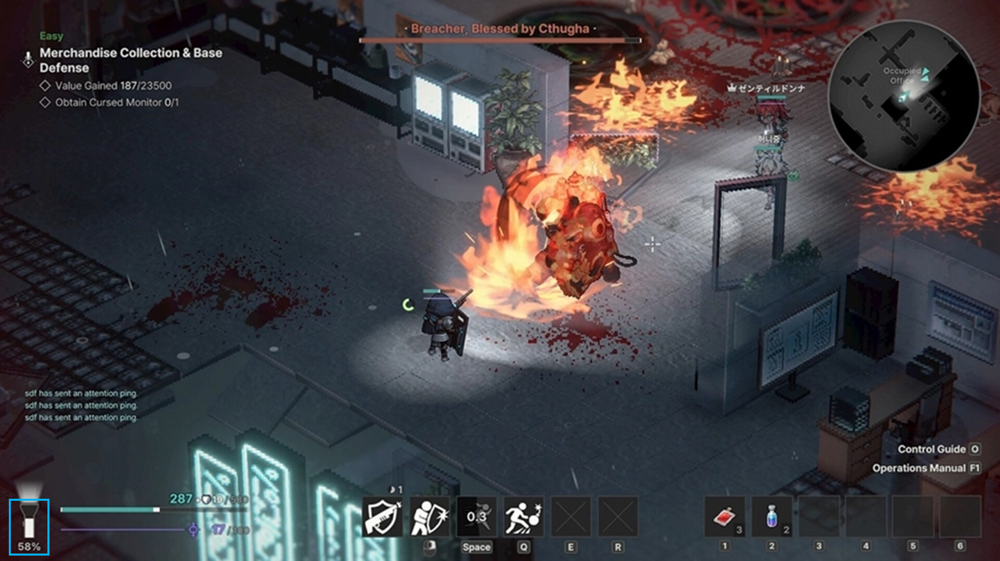

# P0.5_플레이어 캐릭터_기획서_컨셉_v1.0.1

**문서 버전 관리**

| 버전 | 작성 일자 | 작업 내역 |
| --- | --- | --- |
| v1.0.0 | 2026.07.01 | 기획서 초안 생성 |
| v1.0.1 | 2026.07.01 | 팀원 피드백 반영
  • 스킬 후보 종류 추가
  • 장비 관련 UI 추가 |

# 기획 의도

- P0 버전에서 기본 기능을 구현한 기본 플레이어 캐릭터 1명의 추가 컨셉을 기획 의도 및 인게임 재미 요소 측면에서 보강하는 것을 목표로 한다.
- 인게임 세션의 2.5D Isometric 익스트랙션 환경에서 플레이어의 탐색 → 전투 → 탈출 루프를 보강할 수 있는 시스템 요소의 개발 컨셉을 설정한다.
    - 개발 단계에서 시스템 구현을 위한 세부 사항 명세는 CP 피드백을 통해 추가 기능 목록을 확정한 후 별도의 시스템 명세 기획서에 작성하도록 한다.

# 개요

| 항목 | 내용 |
| --- | --- |
| 기능명 | 플레이어 캐릭터 재미 요소 컨셉 |
| 대상 빌드 | P0.5 프로토타입 |
| 기획 담당자 | 우성혁 |
| 우선순위 | P0.5 |
| 추가 기능 | 인게임 세션 시간 제한
플레이어 시야 제한
달리기 스태미나
탈출 채널링
각성 보존 슬롯
소비 기물 채널링 / 쿨타임 |
| 기존 기능 변경 | 장비
스킬 |

## P0 및 기존 확장 명세 대비 변경 사항

| 기능 분류 | P0 구현 사양 | 기존 P0.5 확장 명세 기획 사양 대비 |
| --- | --- | --- |
| 인게임 세션 시간 제한 | 미구현 | 있음 |
| 플레이어 시야 제한 | 미구현 | 없음 (신규 추가) |
| 달리기 스태미나 | 미구현 | 없음 (신규 추가) |
| 탈출 채널링 | 구현됨 - 0.0초로 입력 중
(즉시 탈출 처리를 구현) | 있음 |
| 각성 보존 슬롯 | 미구현 | 있음 |
| 소비 기물 채널링 | 미구현 | 있음 |
| 소비 기물 쿨타임 | 미구현 | 없음 (신규 추가) |
| 장비 | 구현됨 - 무장 1종 | 있음(무장 / 방어구)
→ 아티팩트 형식으로 변경 |
| 스킬 | 미구현 | 있음 |

# 기능별 컨셉 및 프로세스

## 인게임 세션 시간 제한

인게임 세션에 플레이 가능한 최대 시간 제한을 설정한다.

<레퍼런스 예시: “Void Diver” 손전등 배터리>

- 하나의 세션을 무한정 수색할 수 없음: 주어진 목표를 달성하더라도 제한 시간 내에 탈출 판정을 성공시키지 않으면 해당 목표 또한 실패 처리된다.
    - 제한된 시간 내에 목표를 달성 후 탈출 판정까지 실행할 수 있도록 동선을 최적화하는 설계 능력을 유저에게 요구한다.
- 제한 시간 가속 / 감속 / 충전 기능을 제공하는 아이템(장비, 소모품)이나 인게임 오브젝트를 추가할 수 있음: 유저의 동선 설계에 시간적 선택지를 제공할 수 있게 한다.

## 플레이어 시야 제한

캐릭터가 바라보는 특정 방향에서만 적(몬스터) 등 상호작용 가능한 오브젝트가 등장함 (예: 손전등 빛 비춤)

- ‘불확실한 꿈 공간’이라는 세계관 컨셉을 인게임 세션 내 시스템에서 구현하는 효과를 준다.
    - 시야에 비추었을 때에만 오브젝트가 등장하는 경험을 통해 ‘잊었다가 다시 떠올리기 쉬운’ 특성이 인게임에 구현된다.
- 일정한 조건에 따라 정보가 일시적으로 숨겨지는 상황을 통해 유저에게 주변 상황을 직접 확인하게 하는 긴장감을 부여한다.

## 달리기 스태미나

캐릭터가 특정 행동(예: 달리기, 특정 오브젝트 상호작용)을 취하는 동안 자원이 소비되어, 전부 소진 시 해당 행동이 불가능해짐

- 유저의 행동 속도에 제약을 부여하여 ‘어느 시점에 행동 속도를 빠르게 할 것인지’ 판단하게 한다.
- MP를 공격뿐 아니라 스태미나 용도로도 활용하여 통합된 자원 관리의 중요성을 강조한다.

## 탈출 채널링

탈출 지점(전화부스)에서 탈출 상호작용 시도 시 정해진 시간만큼 채널링이 발생한다.

- 안전 귀환을 기다리는 시간 동안 최후의 위험 요소를 부여하여 익스트랙션 장르의 긴장감을 유지시킨다.
    - 채널링 시간 동안 적 스폰 등 이벤트를 발생시켜 탈출을 계속 진행할지 선택하게 만들 수 있다.
- 채널링 중 탈출 상호작용을 취소할 수 있게 하여, 마지막 점검 또는 추가 수색하는 선택지를 제공한다.

## 각성 보존 슬롯

탈출에 실패(HP 전부 잃음 OR 제한 시간 종료 등)하여 강제 각성으로 로비에 돌아왔을 때에도 소실되지 않도록 인벤토리 내 아이템을 저장하는 슬롯을 제공한다.

- 중요한 전리품을 유지하는 최소한의 기회를 제공하여 유저의 탈출 실패 시 상실감의 극대화를 막아준다.
- 유저가 탈출 실패 가능성을 고려하여 각성 보존 슬롯에 어떤 전리품을 보관할지 판단하게 한다.

## 장비

인게임 세션에서 획득한 장비 아이템을 캐릭터에 장착한다

- 캐릭터마다 외형 및 무장 타입이 정해져 있는 점을 반영하여, 플레이어 캐릭터가 장착하는 아이템을 아티팩트 컨셉으로 변경한다.
    - 캐릭터 외형 변화 및 시스템 연결 리소스를 최소화하는 효과가 있다.
- 각 장비 아이템은 이하의 능력치 및 효과를 가질 수 있다.
    - HP/MP 회복 속도
    - 시간 제한 개입(소모 속도, 회복)
    - 공격 속도 / 공격 시 MP 소비

## 소비 기물 채널링 / 쿨타임

퀵슬롯에 장착한 소비 기물 아이템을 사용 시 동일 아이템을 일정 시간 동안 다시 사용할 수 없게 된다.

- 회복 및 보조 아이템이 과잉 사용되지 않도록 제한하여 난이도 하락 폭을 제어한다.

## 스킬

기본 공격(무장을 발사하여 적에게 피해를 줌) 이외의 기능을 수행하는 동작을 ‘스킬’이라 한다.

- 기존 P0 버전의 무장 슬롯을 스킬 슬롯으로 대체하여 출력한다.
- 보조형 스킬
    - 정해진 범위 내 적의 추적 대상을 스킬로 등장한 오브젝트로 변경(추적 우선순위가 플레이어보다 높음)
    - 정해진 구역 내의 시야를 일정 시간 동안 확보
    - 패링: 적의 기본 공격 방어 후 상대에게 피해
- 연사 시 탄 퍼짐 반경 축소
- 극딜 후 대기 상태 (공격 불가)
- 지원 캐릭터 스킬
    - 적 1명을 지정해 공격
    - 보급품 투하 (회복)