# 📅 REMnants 팀 전체 일정 및 주간 마일스톤 계획표

> [!IMPORTANT]
> 이 문서는 노션(Notion) 관리 페이지의 전체 일정표 및 주간 마일스톤 원안 텍스트를 기획서 규칙에 맞춰 정제한 **프로젝트 마스터 일정 기준 문서**입니다.
> PM 및 팀원들의 검토 후 확정 지침으로 상시 참조합니다.

---

## 👥 팀원 구성 및 역할 (R&R)
* **프론트엔드 (Art/Design)**
  * **장수영 (CP - Chief Producer)**: 팀장 / 그래픽 및 리소스 전반 총괄
  * **우성혁 (CD - Creative Director)**: 부팀장 / 시스템 및 인게임 룰 기획 총괄
* **백엔드 (Development)**
  * **강다영 (TD - Technical Director)**: 개발 총괄 / 유니티 코어 시스템 구축
  * **김남해 (PD - Project Director / Producer)**: 레벨 디자인 및 콘텐츠 에셋 조립 총괄
  * **송예찬 (PM - Project Manager)**: 일정 관리 및 시스템/시나리오 보조 기획

---

## 🗺️ 전체 일정표 (Master Timeline)

| 단계/주차 | 기간 | 핵심 목표 | 주요 산출물 | 완료 기준 (DoD) | 비고 |
| :---: | :---: | :--- | :--- | :--- | :--- |
| **기획 확정 (1주차)** | 06-11 ~ 06-19 | 기획서 및 게임 프로토타입 완성 | 기획서 최종본 | 리소스를 제외한 기본 인게임 프로토타입 구현 완료 | |
| **Kickoff** | 06-22 | 기획안 최종 확정 | 기획서 전자서명 | 전원 전자서명 완료 및 P0 범위 고정 | |
| **1차 구현 (2주차)** | 06-22 ~ 06-30 | 코어 루프 구현 (로비 ➡️ 인게임 ➡️ 결과 ➡️ 창고 연동) | 1차 프로토타입 빌드 | 빌드 내에서 기본 플레이 및 루틴 체험 가능 여부 | |
| **주말 버퍼** | 06-27 ~ 06-28 | 휴식 및 리커버리 | - | 업무 배정 없음 | 주말 휴무 원칙 |
| **리소스 적용 (3주차)** | 07-01 ~ 07-18 | 로비, 캐릭터, 아이템, UI 이미지 및 레벨 완성 | 리소스 적용 빌드 | 리소스가 반영된 빌드 생성, 맵 레벨 1차 완성 및 P0 유지 | |
| **통합 / 점검** | 07-03 | 리소스 빌드 통합 점검 | 통합 점검 일지 | 치명 버그 분류 및 P0.5 전환 가능 여부 판단 | |
| **주말 버퍼** | 07-04 ~ 07-05 | 휴식 및 리커버리 | - | 업무 배정 없음 | 주말 휴무 원칙 |
| **안정화 / QA (4주차)** | 07-06 ~ 07-10 | P0.5 범위 확정 및 P0 버전 QA 진행 | P0.5 개발명세서, QA 시트 | P0 QA 시트 및 P0.5 명세서 작성 완료 | |
| **주말 버퍼** | 07-11 ~ 07-12 | 휴식 및 리커버리 | - | 업무 배정 없음 | 주말 휴무 원칙 |
| **P0.5 마무리 (5주차)** | 07-13 ~ 07-17 | P0.5 범위 완료 및 구현 범위 QA | P0.5 빌드, QA 시트 | P0.5 빌드파일 및 QA 시트 작성 완료 | |
| **기능 동결** | 07-18 | 개발 마무리 및 추가 기능 차단 | 동결 선언서 | 추가 기능 개발 전면 중단 (버그 및 오탈자 수정만 허용) | |
| **주말 버퍼** | 07-18 ~ 07-19 | 휴식 및 리커버리 | - | 업무 배정 없음 | 주말 휴무 원칙 |
| **발표준비 마감 (6주차)** | 07-20 ~ 07-24 | 프레젠테이션 시트 및 대본 완성 | PPT 및 발표 시트 | 리허설 가능한 상태로 시트 완성 및 백업 영상 확보 | |
| **주말 버퍼** | 07-25 ~ 07-26 | 휴식 및 컨디션 관리 | - | 업무 배정 없음 | 주말 휴무 원칙 |
| **리허설 (7주차)** | 07-27 | 최종 리허설 | 예비 시연 테스트 | 발표 시간 체크, 기술 결함 대비 백업 동작 확인 | |
| **최종 발표** | 07-28 | 프로젝트 최종 발표 및 시연 | 최종 릴리즈 빌드 | 발표 시연 및 질의응답 완수 | |

---

## 📅 주별/역할별 마일스톤 상세 계획

### 1. 기획 확정 / 1주차 (06-11 ~ 06-19)
* **공통 마일스톤**: P0 기획 확정 및 개발 착수 준비
* **역할별 세부 작업**:
  * **CP 장수영**: P0 정의서 검수, 일정표 구조 확정, 개발 티켓 기준 정리
  * **CD 우성혁**: 기억 파편, 창고, 퀵슬롯, 결과 정산 규칙 확정
  * **PD 김남해**: 개인 심상 기록 01, 성공/실패 및 귀환 대사 최소 세트 정리
  * **PM 송예찬**: 캐릭터/아이템/UI 리소스 요구사항 정리
  * **TD 강다영**: P0 구현 위험 요소 검토, 개발 작업 분해
* **완료 기준 (DoD)**: 기획서 최종본 제출 및 기본 인게임 프로토타입 구현 완료 (최종 이미지/에셋 제외)

---

### 2. Kickoff (06-22)
* **공통 마일스톤**: 기획안 확정 및 개발 착수
* **역할별 세부 작업**:
  * **CP 장수영**: 최종 기획안 승인, P0 범위 통제 시작
  * **CD 우성혁**: 핵심 재미와 시스템 방향성 최종 확인
  * **PD 김남해**: 콘텐츠/시나리오 사용 범위 최종 확인
  * **PM 송예찬**: 전자서명 취합, 작업 보드 및 티켓 생성
  * **TD 강다영**: 개발 우선순위 확인, 구현 순서 확정
* **완료 기준 (DoD)**: 팀원 전자서명 완료, 개발 티켓 배정 완료, P0 범위 변경 통제 시작

---

### 3. 1차 구현 / 2주차 (06-22 ~ 06-29)
* **공통 마일스톤**: P0 코어 루프 1차 구현
* **역할별 세부 작업**:
  * **CP 장수영**: 코어 루프 구현 범위 승인, 중간 진행 상황 점검
  * **CD 우성혁**: 로비-인게임-결과-창고 흐름이 게임 의도와 맞는지 검수
  * **PD 김남해**: 튜토리얼/결과창/성공·실패 상황 문구 최소 세트 제공 및 구현 보조
  * **PM 송예찬**: 작업 진행률 관리, 블로커 기록, 1차 빌드 체크리스트 작성
  * **TD 강다영**: 로비씬, 인게임씬, 결과화면, 창고 저장 흐름 구현
* **완료 기준 (DoD)**: 빌드파일에서 `로비 ➡️ 인게임 ➡️ 결과화면 ➡️ 창고 확인` 코어 루프를 1회 이상 체험 가능

---

### 4. 이미지/에셋 리소스 적용 / 3주차 (06-30 ~ 07-02)
* **공통 마일스톤**: 로비, 캐릭터, 아이템, UI, 맵 레벨 리소스 적용
* **역할별 세부 작업**:
  * **CP 장수영**: AnyPortrait 몬스터 애니메이션(6종) 베이킹, 9-Slice 마스터 그레이스케일 프레임 제작, 77종 신규 UI 리소스 분류/검수
  * **CD 우성혁**: Player Save Data 내 각성 보존 슬롯 설계, 시간 제한(타이머) 및 탈출 채널링 취소 기획 명세화, 구르기/달리기 컨트롤러 연동
  * **PD 김남해**: `Low-Poly Office` 등 신규 무료 에셋 3종 URP 셰이더 수동 교체 및 직원실/창고/외부 주차구역 차량 5대 엄폐물 씬 배치
  * **PM 송예찬**: 에너미 청각 소음 감지 stuck 현상 방지 `NavMesh.SamplePosition` 바닥 보정 설계 및 에너미 모듈화/2연격 콤보 돌진 및 상자 구역 랜덤 스폰 기획 설계
  * **TD 강다영**: 2D 리깅 모델 연동, 총구 겨누기 마우스 트래킹 구현, 가중치 기반 상자 랜덤 스폰(`LevelBoxSpawner`), `EnemyMovement` 모듈러 리팩터링 및 2연격 콤보 대미지 인가 구현
* **완료 기준 (DoD)**: 이미지/에셋 리소스가 적용된 빌드파일 생성. 맵 레벨 1차 완성 및 P0 코어 루프 유지

---

### 5. 통합 / 점검 (07-03)
* **공통 마일스톤**: 리소스 적용 빌드 통합 점검 및 에너미/스폰 시스템 통합
* **역할별 세부 작업**:
  * **CP 장수영**: 가로 와이드 로비 배경 벨크로 UI 통합 검수 및 UI 리소스 77종 전수 검사
  * **CD 우성혁**: 인게임/창고/결과 창 각성 보존 슬롯 데이터 바인딩 및 탈출 채널링 피격 시 즉각 취소 연동
  * **PD 김남해**: `DiverRecord` 패널 JSON 데이터 읽기 전환, 창고-인벤토리 패널 아이템 이동 UI 연결 (★에너미 순찰 경로 및 17개 스폰 구역 배치는 미완료되어 4주차로 이월)
  * **PM 송예찬**: 7월 3일 자 아이템 상자 스폰 및 에너미 2연격 스크립트 전후 비교 보고서 작성, 주간 개발일지 최종 통합
  * **TD 강다영**: 씬 전환 시 로비와 인게임 간 조명 세팅 꺼짐 버그 수정, `SaveCharacterData` 직렬화 어트리뷰트 유실 복구 및 저장 구조 통합
* **완료 기준 (DoD)**: 통합 점검 로그 작성, 치명 버그 분류, 4주차 QA 및 P0.5 판정 준비 완료

---

### 6. 안정화 / P0.5 판정 / QA / 4주차 (07-06 ~ 07-10)
* **공통 마일스톤**: P0 버전 QA 진행 및 P0.5 범위 확정
* **역할별 세부 작업**:
  * **CP 장수영**: P0 안정화 여부 판정, P0.5 착수 승인 또는 폐기 결정
  * **CD 우성혁**: 발표 효과가 큰 P0.5 후보 선정 및 기획 의도 검수
  * **PD 김남해**: P0/P0.5에 필요한 추가 텍스트와 연출 문구 검수
  * **PM 송예찬**: QA 시트 운영, 버그 우선순위 분류, P0.5 개발명세서 취합
  * **TD 강다영**: P0 버그 수정, 승인된 P0.5 기능 구현 착수
* **완료 기준 (DoD)**: P0 QA 시트 작성 완료, P0.5 개발명세서 작성 완료. P0가 불안정할 경우 P0.5는 폐기하고 안정화 우선

---

### 7. P0.5 개발 마무리 / QA / 5주차 (07-13 ~ 07-17)
* **공통 마일스톤**: 확정된 P0.5 범위 구현 마무리 및 QA
* **역할별 세부 작업**:
  * **CP 장수영**: P0.5 최종 범위 고정, 추가 기능 요청 차단
  * **CD 우성혁**: P0.5 기능이 핵심 재미와 발표 효과에 기여하는지 최종 검수
  * **PD 김남해**: 추가 텍스트, 연출, 기록 관련 내용 최종 확인
  * **PM 송예찬**: P0.5 QA 시트 관리, 버그 수정 현황 추적, RC 빌드 체크리스트 작성
  * **TD 강다영**: P0.5 기능 구현 완료, 회귀 버그 수정, 빌드 안정화
* **완료 기준 (DoD)**: P0.5 빌드파일 생성, P0.5 QA 시트 작성 완료, P0 코어 루프가 깨지지 않는 상태

---

### 8. 기능 동결 (07-18)
* **공통 마일스톤**: 추가 개발 중단 및 발표 안정화 전환
* **역할별 세부 작업**:
  * **CP 장수영**: 기능 동결 선언, 예외 수정 범위 승인
  * **CD 우성혁**: 신규 연출/기능 추가 요청 중단
  * **PD 김남해**: 텍스트 오탈자 외 신규 콘텐츠 추가 중단
  * **PM 송예찬**: 수정 가능 항목과 금지 항목 문서화
  * **TD 강다영**: 치명 버그, 빌드 오류, 참조 오류 중심으로만 수정
* **완료 기준 (DoD)**: 신규 기능 개발 중단. 이후 수정은 버그 수정, 오탈자, 경미한 리소스 교체로 제한

---

### 9. 발표 준비 마감 / 6주차 (07-20 ~ 07-24)
* **공통 마일스톤**: 발표 빌드 확정, PPT, 대본, 예비 영상 준비
* **역할별 세부 작업**:
  * **CP 장수영**: 발표 방향 최종 승인, 질의응답 역할 분배
  * **CD 우성혁**: 게임 차별화, 핵심 재미, 시스템 의도 발표 내용 검수
  * **PD 김남해**: 세계관, 캐릭터, 시연 흐름, 발표 대본 서사 구조 정리
  * **PM 송예찬**: PPT 취합, 발표 대본 관리, 시연 동선 체크리스트 및 백업 자료 관리
  * **TD 강다영**: 최종 빌드 확정, 예비 영상 녹화, 백업 빌드 준비
* **완료 기준 (DoD)**: 발표 빌드, PPT, 대본, 시연 영상, 백업 빌드가 모두 준비됨

---

### 10. 리허설 / 7주차 (07-27)
* **공통 마일스톤**: 최종 리허설 및 발표 동선 점검
* **역할별 세부 작업**:
  * **CP 장수영**: 리허설 진행, 발표 시간 관리, 최종 발표 총괄
  * **CD 우성혁**: 게임성/차별화/기획 의도 관련 Q&A 대응 준비
  * **PD 김남해**: 세계관/서사/콘텐츠 구성 관련 Q&A 대응 준비
  * **PM 송예찬**: 발표 진행 순서 관리, 자료 전환, 질문 기록 및 팀 답변 보조
  * **TD 강다영**: 빌드 실행, 시연 진행, 오류 발생 시 예비 영상 전환 점검
* **완료 기준 (DoD)**: 제한 시간 내 발표 가능, 빌드/영상 전환 가능, Q&A 역할 분배 완료

---

### 11. 최종 발표 (07-28)
* **공통 마일스톤**: 최종 발표 및 시연
* **역할별 세부 작업**:
  * **CP 장수영**: 최종 발표 총괄, 질의응답 조율
  * **CD 우성혁**: 게임성/차별화 질문 대응
  * **PD 김남해**: 세계관/스토리/콘텐츠 질문 대응
  * **PM 송예찬**: 발표 진행 보조, 자료 관리, 피드백 기록
  * **TD 강다영**: 시연 빌드 실행 및 기술 질문 대응
* **완료 기준 (DoD)**: 최종 발표와 시연 완료, 질의응답 대응 완료, 피드백 및 회고 기록

---

## 📊 전체 일정 타임라인 관계도 (Mermaid)

```mermaid
flowchart TD
    W1["1주차<br/>기획 확정<br/>(06.11 ~ 06.19)<br/>P0 정의서 수립"] --> K["Kickoff<br/>(06.22)<br/>전자서명 완료"]
    K --> W2["2주차<br/>1차 구현<br/>(06.22 ~ 06.30)<br/>P0 코어 루프"]
    W2 --> B1["주말 버퍼<br/>(06.27 ~ 06.28)<br/>휴식"]
    B1 --> W3["3주차<br/>리소스 적용<br/>(07.01 ~ 07.18)<br/>비주얼 에셋 이식"]
    W3 --> I["통합 점검<br/>(07.03)<br/>치명 버그 분류"]
    I --> B2["주말 버퍼<br/>(07.04 ~ 07.05)<br/>휴식"]
    B2 --> W4["4주차<br/>안정화/QA<br/>(07.06 ~ 07.10)<br/>P0.5 범위 판정"]
    W4 --> B3["주말 버퍼<br/>(07.11 ~ 07.12)<br/>휴식"]
    B3 --> W5["5주차<br/>P0.5 마감/QA<br/>(07.13 ~ 07.17)<br/>회귀 버그 픽스"]
    W5 --> F["기능 동결<br/>(07.18)<br/>추가 개발 금지"]
    F --> B4["주말 버퍼<br/>(07.18 ~ 07.19)<br/>휴식"]
    B4 --> W6["6주차<br/>발표준비 마감<br/>(07.20 ~ 07.24)<br/>PPT/대본/영상"]
    W6 --> B5["주말 버퍼<br/>(07.25 ~ 07.26)<br/>컨디션 관리"]
    B5 --> R["7주차<br/>리허설<br/>(07.27)<br/>발표 시뮬레이션"]
    R --> P["최종 발표<br/>(07.28)<br/>시연 및 질의응답"]
```

