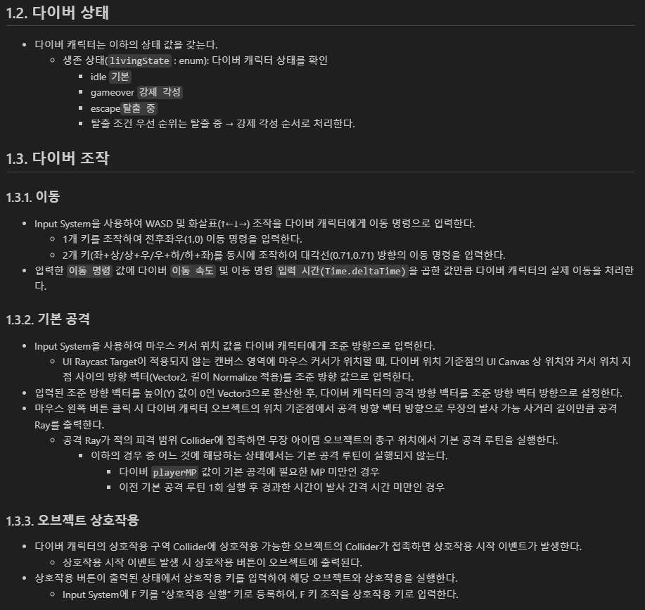

# 260728_루시드 다이버_전체회고_Unity 3기_우성혁

### **프로젝트 개요**

*프로젝트의 기본 정보를 작성합니다.*

---

- 프로젝트명: 침몽도시: 루시드 다이버 *(Lucid Diver in Dream-devoured City)*
- 진행 기간: 2026.06.11 ~ 2026.07.28
- 팀명 / 팀원 구성: 팀 REMnants / 5인
    - 강다영(TD) / 김남해(PD) / 송예찬(PM) / 우성혁(CD) / 장수영(CP)
- 본인 역할 (포지션): CD(디렉터) - P0 프로토타입으로부터 최종 결과물을 구현하기 위한 기획 세부 사항 명세, 게임 내용물 구현 및 검증
- 한 줄 소개: 서브컬처 캐릭터 애착과 PvE 익스트랙션의 긴장감을 `기억 파편 → 탈출 → 동조율 → 심상 기록` 보상 루프로 연결한 2.5D 싱글 플레이 액션 RPG 프로토타입
- 결과물 / 데모 링크: https://drive.google.com/file/d/1eJK4JiPHLMWhpV2mNpth4BEen5bnw9zV/view?usp=sharing

### **프로젝트 목표 및 결과**

*초기에 설정한 목표와 최종 결과물을 비교하여 정리합니다.*

---

1. **초기 목표**
    - 《**침몽도시: 루시드 다이버**》 기획서_초안
        
        ## **1. 프로젝트 개요**
        
        ### **1.1. 기본 정보**
        
        - **프로젝트명**: 침몽도시: 루시드 다이버 (Lucid Diver in Dream-devoured City)
        - **대체 제목 후보 제안**:
            1. **《몽경회랑: 루시드 다이버 (Dreamscape Corridor: Lucid Diver)》** (공동몽의 왜곡된 공간 구조를 강조)
            2. **《루시드 세이비어 (Lucid Savior: Dream Heist)》** (각성과 회수, 대중적인 느낌 강조)
            3. **《다이브 인투 드림 (Dive into Dream: 침몽도시)》** (직관적인 액션성과 메커니즘 부각)
        - **장르**: 2.5D 라이트 PvE 익스트랙션 액션 RPG (2.5D Light PvE Extraction Action RPG)
        - **플랫폼**: PC (Windows) / Steam 빌드 타겟
        - **개발 환경**: Unity 6, 3D HDRP/URP 레벨 구성, 2D Spine/Sprite 애니메이션 캐릭터
        - **대상 타겟**: 서브컬처 액션 게임 선호층, 하드코어 탈출 슈터의 피로감을 피하고 라이트한 파밍과 협동 보스 공략을 즐기는 유저군.
        
        ### **1.2. 핵심 키워드 및 정의**
        
        | 키워드 | 정의 및 기획적 의도 |
        | --- | --- |
        | **2.5D 비주얼 스타일** | 3D로 정교하게 구축된 입체적 공간 레벨 위에 개성 넘치는 2D 서브컬처 스타일 캐릭터 스프라이트를 얹어 독창적이고 고급스러운 아트워크 구현. |
        | **라이트 익스트랙션** | PvP 약탈 요소와 영구 사망을 배제하고, 사망 시 장비 보존 및 파밍한 기물 위주의 선택적 손실 구조를 취해 진입 장벽 완화. |
        | **침몽도시 (Dreamscape)** | 현실 도시 위에 초월적 꿈이 덮여 내부 지형과 오브젝트가 꿈의 논리에 따라 왜곡되고 재구성되는 하이브리드 가상 공간. |
        | **루시드 다이버 (Lucid Diver)** | 왜곡된 꿈속 침입 및 자각몽 제어가 가능하도록 훈련된 특수 탐사자(플레이어 캐릭터). |
        | **1+2+1 파티 편성** | 메인 조작 캐릭터 1명, 스트라이커형 지원 캐릭터 2명, 백업 버프를 제공하는 오퍼레이터 1명으로 구성된 전략적 시너지 조합. |
        | **꿈속 기물 무장** | 불안정한 꿈속에서는 현실 장비가 약화되므로, 필드에서 획득한 초현실적 기물(우산, 거울 등)을 실시간으로 무기 삼아 무장하는 현장 즉석 파워업 시스템. |
        | **각성 보존 슬롯** | 플레이어가 쓰러져 강제 각성될 때도 절대 소실되지 않고 현실로 가져갈 수 있는 최소한의 안전 보존 인벤토리 상자. |
        
        ---
        
        ## **2. 한 줄 컨셉 (High Concept)**
        
        > **“현실과 왜곡된 꿈이 겹친 위험천만한 침몽도시에서 꿈속 기물을 수집하고 무장하여, 강제 각성되기 전에 심장부를 공략하고 무사히 탈출하라!”**
        > 
        
        ---
        
        ## **3. 세계관 설정 (Lore & Background)**
        
        ### **3.1. 침몽 현상과 침몽도시**
        
        현대 문명이 고도로 발달한 어느 날, 정체불명의 초월적인 거대 의식이 투사한 꿈이 현실의 메트로폴리스 전체를 장악했다. 사람들은 이 현상을 **‘침몽 현상’**이라 칭했으며, 그 안에 갇힌 구역을 **‘침몽도시’**라 부르기 시작했다. 도시 내부는 물리학적 법칙이 무너지고 인간의 무의식, 잊힌 기억, 폐기된 욕망이 실체화된 공간으로 변모했다. 현실의 대형 빌딩 내부가 깊은 심해나 지하 미로처럼 연결되며, 사라졌던 가전제품이나 버려진 물건들이 초현실적인 에너지원인 **‘심상기물(Psyche Object)’** 혹은 **‘몽유물’**로 재탄생한다.
        
        ### **3.2. 루시드 다이버와 회수 기업**
        
        현실 문명의 첨단 무기나 전자기기는 침몽도시 안에서 구조적/개념적으로 완전히 붕괴하거나 위력이 급감한다. 오직 정신적 동조율과 자각몽 제어 능력을 갖춘 특수 적합자, **‘루시드 다이버’**만이 침몽도시의 정신 오염에 저항하며 탐사를 진행할 수 있다. 이들은 거대 기업, 공공 기관, 혹은 불법 사설 조직의 의뢰를 받아 목숨 대신 정신력을 소모하는 다이브 기어에 탑승하여 침몽도시로 다이브한다. 이들의 목적은 단 하나, 현실 문명을 한 단계 도약시킬 수 있는 막대한 가치의 꿈속 유물과 에너지 코어인 **‘심상핵(Core)’**을 회수하는 것이다.
        
        ### **3.3. 강제 각성 (Forced Awakening)**
        
        다이버가 침몽도시 내부에서 심각한 손상을 입어 정신적 한계(체력 0)에 도달하면, 현실의 링크가 끊어지며 다이브 기어에서 물리적으로 튕겨 나가 눈을 뜨게 된다. 이를 **‘강제 각성’**이라 한다. 사망하진 않지만, 각성 시 가해지는 강력한 정신적 충격(피드백 현상)으로 인해 안전 보존 슬롯에 넣지 않은 꿈속 기물과 일반 파밍 인벤토리의 데이터는 차원 저 너머로 흩어져 붕괴해버린다.
        
        ---
        
        ## **4. 핵심 플레이 루프 (Core Game Loop)**
        
        ```mermaid
        graph TD
            A[현실 거점: 정비 및 파티 편성] --> B[침몽도시 세션 진입: 외곽 구역]
            B --> C[외곽 파밍: 꿈속 기물 획득 및 임시 무장]
            C --> D{중심부 고위험 구역 진입 선택}
            D -- 예 --> E[협동 요청 핑 발송 및 멀티플레이 협동]
            E --> F[고위험 보스 공략 및 고가치 심상핵 회수]
            F --> G[위험도 급상승 상태 돌입]
            G --> H[탈출 지점으로 이동 및 수비]
            D -- 아니오 --> I[일반 탈출 지점으로 바로 이동]
            I --> H
            H --> J{탈출 성공?}
            J -- 성공 --> K[정산: 회수품 전액 획득 및 보너스]
            J -- 실패: 강제 각성 --> L[정산: 기본 장비&각성 보존 슬롯 아이템만 획득]
            K --> M[현실 거점: 캐릭터 성장 및 장비 안정화 제작]
            L --> M
            M --> A
        ```
        
        ---
        
        ## **5. 멀티플레이 및 맵 구조**
        
        ### **5.1. 3단계 구역 시스템**
        
        하나의 세션 맵은 단절된 공간이 아니라, 중심부로 진입할수록 위험도가 상승하고 보상이 극대화되는 유기적인 오픈 레이아웃 구조를 취합니다.
        
        | 구역 구분 | 위험도 | 주요 출현 적 | 획득 가능 기물/자원 | 설계 목적 및 플레이 스타일 |
        | --- | --- | --- | --- | --- |
        | **외곽 구역 (Outer)** | 낮음 | 하급 몽유체, 방황하는 그림자 | 소형 심상기물, 하급 안정화 재료 | **솔로 파밍 권장 구역**. 컨트롤에 큰 부담 없이 기본적인 생존과 기물 무장을 획득하며 탈출 경로를 사전 탐색하는 구간. |
        | **중간 구역 (Mid)** | 보통 | 엘리트 몽유체, 경비 경비병 | 중형 몽유물, 중급 제작 레시피 | **진입/공동 협동 선택 구역**. 솔로 플레이 시 리스크가 커지기 시작하며, 중간 가치의 회수품을 두고 생존 투쟁 발생. |
        | **중심부 고위험 구역 (Core)** | 매우 높음 | 구역 수호자 (보스 몬스터) | 고가치 심상핵, 안정화 장비 완제품 | **멀티플레이 협동 필수 구역**. 강력한 보스 기믹이 존재하며, 협동 핑을 통해 주변의 다른 플레이어들과 레이드를 수행해야 돌파 가능. |
        
        ### **5.2. 협동 요청 핑 & 공략 동기화**
        
        - **자유 합류 구조**: 세션 시작 시 각 플레이어는 외곽의 서로 다른 포인트에서 스폰되어 독자적으로 파밍을 진행할 수 있습니다.
        - **협동 트리거**: 중심부 고위험 보스 룸 앞에 도달하면 플레이어는 전체 맵에 **[협동 요청 핑(Co-op Request)]**을 발송할 수 있습니다.
        - **보상 연계**: 핑을 듣고 합류하여 함께 보스를 클리어하면, 참여한 모든 인원에게 개인별로 고유한 **‘심상핵 루팅 권한’**과 협동 보너스가 주어져 트롤링이나 아이템 먹튀 스트레스를 원천 차단합니다.
        
        ---
        
        ## **6. 익스트랙션의 라이트화와 손실 구조**
        
        본 프로젝트는 전통적인 PvPvE 하드코어 슈터(예: 타르코프)의 가혹한 패널티를 낮춰 대중성을 확보하는 것을 최우선 과제로 삼습니다.
        
        ### **6.1. 라이트화를 위한 핵심 차별점**
        
        1. **PvP 요소 완전 배제**: 플레이어 간 격돌이 아닌, 오직 환경 및 보스와의 연대(PvE)에 초점을 맞추어 유저 간 불쾌감을 방지합니다.
        2. **영구 사망/완전 손실 없음**: 육성한 캐릭터의 성장 수치와 현실에서 제작한 '안정화 장비'는 강제 각성 시에도 영구 보존됩니다.
        3. **세션 템포 단축**: 한 판당 평균 10~15분 내외의 타이트한 플레이 타임을 지향하여 모바일/PC 서브컬처 유저들의 일일 플레이 피로도를 감소시킵니다.
        
        ### **6.2. 강제 각성 시 패널티 및 각성 보존 슬롯**
        
        - **패널티**: 세션 도중 체력이 0이 되어 강제 각성될 경우, 인벤토리에 파밍해 둔 몽유물 데이터와 재료의 약 80%가 소실됩니다. (나머지 20%는 기본 보험율에 의해 보존 가능)
        - **각성 보존 슬롯 (안전 금고)**:
            - 총 4칸 크기의 그리드로 제공되는 특수 슬롯입니다.
            - 이 슬롯에 들어간 아이템은 강제 각성 시에도 **100% 보존**되어 현실 거점으로 이송됩니다.
        
        #### **📦 각성 보존 슬롯 배치 규칙 (예시)**
        
        - **소형 심상기물** (부피 1칸): 여러 개를 안전하게 파밍하는 솔로 유저에게 적합.
        - **중형 몽유물** (부피 2칸): 장비 제작 핵심 도면 등.
        - **보스 심상핵** (부피 4칸 전체 점유): 보스를 클리어한 뒤 탈출 지점까지 직접 들고 수송해야 하는 초고가치 전리품. 보존 슬롯을 꽉 채우므로 다른 물건을 포기해야 하는 선택 강요.
        
        ---
        
        ## **7. 꿈속 기물 무장 및 장비 시스템**
        
        꿈속에서는 현실의 정상적인 총기나 검이 위력을 잃는 대신, 기괴하게 변형된 일상 속 기물들이 고유한 이능력을 발휘합니다.
        
        ```
        [현실 기본 장비] (영구 유지, 최약체 무기)
               ↓ (다이브)
        [꿈속 기물 무장 파밍] (세션 내 즉석 파워업, 임시 무장, 내구도 낮음)
               ↓ (성공적 탈출 / 보존 슬롯 세이프)
        [현실 거점 정비] (회수한 기물을 분해하여 꿈의 파편 및 핵심 재료 획득)
               ↓ (제작 및 가공)
        [안정화 장비 제작] (현실에서도 꿈속 위력을 발휘하는 영구 성장 장비 완성)
        ```
        
        ### **7.1. 주요 기물 무장 분류 예시**
        
        | 기물명 | 기본 외형 | 인게임 전투 효과 | 유틸리티/기믹 활용 |
        | --- | --- | --- | --- |
        | **깨진 우산** | 찢어진 다크 톤 우산 | 우산을 펼쳐 투사체를 100% 방어하는 전방 실드 전개. | 일부 레이저 트랩 구역을 안전하게 통과 가능. |
        | **거꾸로 가는 시계** | 초침이 역회전하는 금시계 | 사용 시 주변 5m 범위 내의 모든 적 움직임 둔화 (Slow). | 보스의 강력한 광폭화 패턴 지연. |
        | **금 간 거울** | 프레임이 깨진 손거울 | 짧은 거리 순간 이동 및 피격 시 자신의 2D 환영 분신 생성. | 적의 타겟팅 분산 및 포위망 탈출. |
        | **장난감 권총** | 조잡한 플라스틱 권총 | 꿈의 투사체를 난사하는 초고속 원거리 사격 무기. | 먼 거리의 스위치 작동 및 공중 적 견제. |
        | **녹슨 가위** | 거대한 재단용 가위 | 근접 대상을 단숨에 절단하여 강한 경직과 출혈 피해 부여. | 질긴 덩굴이나 차단된 공간의 장애물 절단. |
        
        ---
        
        ## **8. 파티 편성 및 캐릭터 시스템**
        
        플레이어는 세션을 시작하기 전, 전략적인 **‘1 메인 + 2 지원 + 1 오퍼레이터’** 조합을 통해 시너지(심상 공명)를 극대화해야 합니다.
        
        ```
               [ 1 메인 캐릭터 (직접 조작) ]
                           ↑
                           ├─ [ 지원 1 (액티브 스트라이커) ] : 전투 중 수동 호출
                           ├─ [ 지원 2 (패시브 스트라이커) ] : 특정 상황 자동 발동
                           └─ [ 오퍼레이터 (현실 백업 관제) ] : 세션 룰 및 안전 슬롯 강화
        ```
        
        ### **8.1. 캐릭터 역할군 상세**
        
        1. **메인 캐릭터 (Main Dynamic Diver)**:
            - 화면에 등장하여 직접 3D 공간을 종횡무진 달리는 조작 캐릭터.
            - 기본 스탯, 평타, 회피 기술을 지니며 필드에서 기물을 주워 직접 무장 및 스킬을 사용합니다.
        2. **지원 캐릭터 (Striker Support)**:
            - 직접 조작하진 않으나, 퀵키(Quick Key)나 조건 만족 시 전장에 **2D 스프라이트 연출과 함께 순식간에 난입**하여 스킬을 시전하고 퇴장하는 스트라이커.
            - **지원 1 (액티브)**: 쿨타임마다 플레이어가 직접 버튼을 눌러 소환 (예: 광역 힐, 순간 무적 방막).
            - **지원 2 (패시브)**: 플레이어가 피격당하거나, 보스 체력이 일정 이하로 내려갈 때 자동으로 발동 (예: 자동 반격 차징 샷, 버프).
        3. **오퍼레이터 (Operator - Backend Intel)**:
            - 인게임 월드에는 등장하지 않고 통신 보이스 및 UI 인터페이스를 통해 플레이어에게 유용한 시스템적 혜택을 지속적으로 제공.
            - 위험도 게이지 누적 속도 완화, 보존 슬롯 공간 확장, 탈출 헬기 대기시간 감소, 보급품 위치 해킹 등.
        
        ---
        
        ## **9. 심상 공명 시스템 (Psychic Resonance)**
        
        모든 캐릭터는 고유의 **[역할 태그]**, **[기물 태그]**, **[소속 태그]**를 지니며, 편성 시 해당 태그들의 결합 수치에 따라 특수 패시브 효과인 **‘심상 공명’**이 세션 전체에 발동합니다.
        
        ### **9.1. 대표 공명 시너지 효과 및 편성 예시**
        
        - **[탐색 공명]** (태그 조합: 탐색 + 시간 + 연구소)
            - *효과*: 미니맵에 숨겨진 비밀 방 위치 노출, 희귀 기물 파밍 확률 +15% 증가.
            - *추천 조합*: 탐색형 메인 + 탐색 지원 1 + 시간 지원 2 + 정산 오퍼레이터
        - **[보스전 공명]** (태그 조합: 전투 + 절단 + 기업 파견)
            - *효과*: 중심부 보스 및 엘리트 몬스터 대상 주는 피해 +20% 증가, 부위 파괴 게이지 축적 속도 상승.
            - *추천 조합*: 전투형 메인 + 절단 지원 1 + 사격 지원 2 + 위험관리 오퍼레이터
        - **[보존 공명]** (태그 조합: 보존 + 방어 + 회수국)
            - *효과*: 각성 보존 슬롯의 그리드 제한 1칸 완화, 강제 각성 시의 데이터 유실 확률 20% 경감.
            - *추천 조합*: 생존형 메인 + 방어 지원 1 + 보존 지원 2 + 보험 오퍼레이터
        
        ---
        
        ## **10. 프로토타입 테마 맵: 꿈에 먹힌 상가 구역**
        
        - **배경 비주얼**: 일반인의 출입을 차단하기 위해 설치된 거대한 격리 외벽으로 둘러싸여 있으며, 길가에 방치되어 버려진 차량과 붕괴된 상가 건물군이 흐트러진 음산한 밤거리 구조. 곳곳에 푸른빛의 꿈의 결정체와 거품 같은 심상 균열이 흐르고 있어 신비로우면서도 몽환적인 분위기 연출.
        - **레벨 구성도**:
        
        ```
        [외곽 도보 상점가] (저위험 스폰 구역)
               │
               ▼
        [야외 주차장] ─── [주유소 연결로] (기물 밀집 파밍 구역)
               │
               ▼
        [중앙 분수대 광장] (보스룸: '상가 관리인' 몽유체 배치)
               │
               ▼
        [육교 / 도로 차단 철문] (최종 탈출 포인트)
        ```
        
        ---
        
        ## **11. MVP 구현 범위 및 우선순위 명세**
        
        단기간의 프로토타입 빌드 및 포트폴리오 시연 영상 확보를 위해 기획 범위를 실용적으로 조율합니다.
        
        | 개발 순위 | 시스템명 | 핵심 구현 스펙 | 비고 (네트워크 필요 여부) |
        | --- | --- | --- | --- |
        | **1** | **2.5D 캐릭터 컨트롤러** | 3D 지형 위에서 2D 빌보드 캐릭터의 이동, 대시, 기본 타격 및 피격 판정. | 로컬 및 네트워크 동기화 필수 |
        | **2** | **기물 파밍 & 즉석 무장** | 필드 내 2D 기물 획득 시 즉시 메인 캐릭터의 무기 슬롯에 장착 및 공격 모션 변화. | 동기화 필수 |
        | **3** | **네트워크 동기화 (PUN2)** | 2인 세션 매칭, 동시 진입, 서로의 움직임 및 기물 장착 상태 동기화. | 동기화 필수 |
        | **4** | **지원 캐릭터 소환** | 액티브 키 입력 시 2D 스트라이커 캐릭터가 즉시 나타나 스킬 시전 후 사라지는 헬퍼 기능. | 클라이언트 로컬 연출 가능 |
        | **5** | **각성 보존 슬롯 & 탈출** | 탈출 지점 상호작용 성공 시 세션 클리어 및 인벤토리 정산 연집 구현. | 데이터베이스 연계 |
        
        ---
        
        ## **12. 포트폴리오 핵심 소구력 (Portfolio Selling Points)**
        
        1. **장르 융합의 논리적 해결**: 서브컬처 수집형 RPG(다양한 캐릭터를 많이 보유하고 활용하고 싶은 욕구)와 익스트랙션(내 캐릭터 하나에 몰입하여 생존해야 하는 절박함)의 충돌 문제를 **'1 메인 + 2 스트라이커 지원 + 1 관제 오퍼레이터'** 구조로 명쾌하게 풀어낸 기획력 증명.
        2. **아트 제작 단가 현실화**: 3D 배경 에셋의 높은 퀄리티와 2D 캐릭터 스프라이트의 대중성/수집 가치를 조합하여, 소규모 팀 단위에서도 높은 완성도의 결과물을 낼 수 있는 영리한 아트 파이프라인 설계 역량 어필.
        3. **네트워크 부하 최소화 기획**: 과도한 물리 동기화 대신, 2D 스프라이트 판정 및 인라인 기믹 트리거 기반으로 네트워킹 구조를 설계하여 저비용 고효율의 멀티플레이어 환경 구축 가능성 검증.
    - 최종 프로토타입 P0 정의서
        
        ## **1. 문서 목적**
        
        본 문서는 `침몽도시: 루시드 다이버` 최종 프로토타입 빌드에서 반드시 구현해야 하는 **P0 최소 검증 범위**를 정의하는 마스터 정의서(SSOT)입니다. 현재 프로젝트의 개발 목표는 완성형 게임의 전체 시스템을 구축하는 것이 아니며, 메인 다이버 1명을 중심으로 **'PvE 익스트랙션 루프'와 '서브컬처 캐릭터 애착 루프'가 실질적으로 결합될 수 있음을 증명하는 포트폴리오용 빌드**를 제작하는 것입니다. 이에 따라 본 문서는 지금까지 파편화되어 작성된 다양한 기획 문서(세계관, 시나리오, 시스템, UI 등) 중에서 **이번 프로토타입에서 반드시 구현되어야 할 피처만을 고정**하여 기획 및 개발의 혼선을 방지하고자 합니다.
        
        ## **2. 최종 P0 검증 목표**
        
        본 프로토타입 빌드에서 입증하고자 하는 핵심 질문은 다음과 같습니다.
        
        > *"익스트랙션 플레이를 통해 회수한 보상이 서브컬처 캐릭터 애착 보상과 다음 출격 준비로 이어질 수 있는가?"*
        > 
        
        플레이어는 아래 정의된 두 가지의 핵심 결합 루프를 하나의 게임 사이클 내에서 유기적으로 경험해야 합니다.
        
        ### **2.1 서브컬처 캐릭터 애착 루프**
        
        ```
        기억 파편 획득
        → 탈출 성공
        → 기억 파편 자동 사용
        → 동조율 상승
        → 개인 심상 기록 01 해금
        → 로비 복귀 후 다이버/기록 메뉴에서 선택 감상
        → 귀환 대사 변화
        ```
        
        ### **2.2 PvE 익스트랙션 루프**
        
        ```
        마나석 / 회복약 획득
        → 탈출 성공
        → 창고 저장
        → 다음 출격 소지품 슬롯에 장착
        → 다음 세션에서 사용 가능
        ```
        
        ## **3. 최종 P0 플레이 플로우**
        
        프로토타입의 전체 플레이 진행 단계 및 화면 전이 흐름은 다음과 같습니다.
        
        ```
        로비
        → 출격 준비
        → 침몽도시 세션 진입
        → 이동 / 조준 / 공격
        → 적과 조우
        → 기억 파편, 마나석, 회복약 획득
        → 전화부스 탈출 시도
        → 탈출 성공 또는 강제 각성
        → 결과창 정산
        → 로비 복귀
        → 다이버 메뉴에서 심상 기록 확인
        → 창고에서 회수품 확인 및 다음 출격 준비
        ```
        
        ## **4. P0 필수 구현 범위**
        
        | 구분 | P0 항목 | 설명 | 완료 기준 |
        | --- | --- | --- | --- |
        | **로비 / 관제실** | 로비 메인 화면 UI | 다이버 초상화/스탠딩 1장, 다이버 이름, 현재 동조율 단계 및 귀환 대사 표시. 출격/다이버/창고 버튼 제공. 새 기록 해금 시 알림(NEW) 표시. | 유저가 로비에서 출격, 다이버/기록, 창고 메뉴로 정상 이동 가능하며, 세션 성패 결과에 따라 복귀 시 다이버 대사가 동적으로 변화한다. |
        | **출격 준비** | 장비 장착 UI 패널 | 메인 다이버의 간략 정보 및 다음 출격 시 지참할 소모품 장착용 2개 슬롯 표시. [출격] 및 [창고에서 변경]/[뒤로] 단추 배치. | 유저가 다음 세션에 지참할 소모품 2종의 현황을 확인하고 안정적으로 세션 씬에 진입할 수 있다. |
        | **인게임 세션** | 플레이 공간 및 기본 액션 | 2.5D 탑다운 시점의 단일 테스트 맵. 플레이어 WASD 이동, 마우스 조준 사격, HP/마나 시스템 구현. 몬스터 1종(추적/공격 AI 적용), 파밍용 아이템 3종(기억 파편, 마나석, 회복약) 배치 및 충돌 획득 처리. 전화부스 탈출 구역 배치. | 유저가 세션에 진입하여 조작/전투/파밍을 정상 수행하고, 전화부스를 통하거나 플레이어 사망을 통해 세션을 종료시킬 수 있다. |
        | **아이템** | 기억 파편 | 창고에 저장하지 않고 정산 성공 시 자동 소모되는 자원. 실패 시 유실. | 기억 파편은 아웃게임에서 서사 보상(동조율 상승 및 기록 해금)을 트리거하는 자원으로만 처리된다. |
        | **아이템** | 마나석 | 세션 중 획득하여 탈출 성공 시 창고에 누적 저장. 실패 시 유실. 소지품 장착이 가능하며 세션 내 사용 시 마나 회복. *(※ 사용 기능 개발 부담 시 창고 저장/장착 표시까지만 구현 가능)* | 마나석은 안전하게 회수하여 다음 출격에 사용할 수 있는 익스트랙션 회수 자원으로 작동한다. |
        | **아이템** | 회복약 | 세션 중 획득하여 탈출 성공 시 창고에 누적 저장. 실패 시 유실. 소지품 장착이 가능하며 세션 내 사용 시 HP 회복. *(※ 사용 기능 개발 부담 시 창고 저장/장착 표시까지만 구현 가능)* | 회복약은 안전하게 회수하여 다음 출격에 사용할 수 있는 익스트랙션 회수 자원으로 작동한다. |
        | **결과창** | 세션 정산 UI | 탈출 성공/실패 배너, 플레이 타임, 획득 파편 수, 파편 자동 소모 안내, 동조율 단계 변화(Lv.0 → Lv.1), 기록 01 해금 상태, 회수한 마나석/회복약 창고 저장 개수 표시. 세션 결과별 다이버 전용 대사 출력. [로비로 돌아가기] 단추 배치. | 결과창 화면 내에 서브컬처 서사 보상과 익스트랙션 파밍 보상이 시각적 영역으로 명확히 구분되어 정산 표시된다. |
        | **다이버 / 기록** | 다이버 상세 UI | 메인 다이버 이름 및 초상화, 현재 동조율 단계 노출. 개인 심상 기록 01의 잠금/해금 상태 가시화 및 열람 기능 제공. 기록 02는 더미 잠금 처리. 뒤로 가기 단추 구현. | 유저가 로비에서 직접 다이버 메뉴에 진입하여 해금 완료된 시나리오 기록을 선택적으로 읽어볼 수 있다. |
        | **창고 / 인벤토리** | 회수품 관리 UI | 보관 중인 마나석/회복약 개수 표시, 다음 출격에 지참할 고정 슬롯 2개 가시화. 기억 파편의 자동 소모 서사 자원 안내 텍스트 탑재. [소지품 설정] 및 뒤로 가기 단추 구현. | 유저가 세션에서 안전하게 획득한 일반 소모품의 수량을 창고에서 파악하고 다음 세션을 준비하는 소지 장착으로 연결할 수 있다. |
        | **대사 / 텍스트** | 연출 스크립트 | 세션 시작/적 발견/피격/파편 획득/소모품 획득/탈출 성공/실패/로비 귀환/기록 해금 대사 및 개인 심상 기록 01 시나리오 텍스트 원문 제공. | 상황별 캐릭터 대사가 짧고 명확하게 출력되며, 전문용어를 최소화하고 감정과 조작 행동 위주로 가독성 높게 표기된다. |
        
        ### **4.8.1 상황별 대사 및 텍스트 작성 가이드**
        
        - **작성 원칙**: 대사는 한 문장 단위로 간결하게 구성하며, 전문 세계관 용어는 단일 문장당 1개 이하로 제한합니다. 설정에 대한 장황한 연출보다 상황에 대한 감정적 피드백과 조작 안내를 우선시합니다.
        
        ---
        
        ## **5. P0에서 제외할 항목**
        
        아래에 정의된 항목들은 이번 최종 프로토타입 P0 스펙에서 완전히 제외되며, 아웃게임 및 인게임 내에서 더미 UI 형태로만 표시되거나 아예 구현하지 않습니다.
        
        | 제외 항목 | 처리 위치 | 사유 |
        | --- | --- | --- |
        | **다이버 영입 / 가챠 / 교체** | 아웃게임 메뉴 전체 | 다이버 1인 고정 빌드이므로 캐릭터 추가 획득 및 교체 UI 불필요 |
        | **1+2 스트라이커 편성 및 호출** | 인게임 및 아웃게임 | 스쿼드 동기화 및 2인 지원 캐릭터 스킬 호출 리소스 배제 |
        | **호감도 선물 및 다단계 성장** | 아웃게임 상상/로비 | 복잡한 성장 곡선 및 선물 수납 UI 구현 비용 제거 |
        | **스킨 및 코스튬 변경** | 로비 및 다이버 화면 | 추가적인 리소스 작업 최소화 및 비주얼 BM 검증 불필요 |
        | **상점 및 크래프팅 공방** | 아웃게임 허브 메뉴 | 재화 거래 로직 및 기재 재료 조합 연산 로직 배제 |
        | **아이템 판매 및 분해** | 창고 / 인벤토리 화면 | 획득품의 일방적인 저장/사용 루프만 검증하므로 상호 거래 제외 |
        | **방어구 및 정신 방벽** | 인게임 HUD 및 캐릭터 | HP/마나 이외의 생존 스탯 배제 및 기획 연산 단순화 |
        | **인벤토리 그리드 및 드래그** | 창고 / 인벤토리 화면 | 타르코프식 2D 격자 수납을 전면 배제하고 슬롯형 카운트만 유지 |
        | **장비 및 무기 강화** | 아웃게임 무장 메뉴 | 무기 레벨업 및 부품 조합 시스템 구현 비용 제거 |
        | **보스전 및 침식 위상 변화** | 인게임 레벨 및 몬스터 AI | 기본 일반 몹 1종의 추적/사격 상태 머신으로 FSM 단순화 |
        | **멀티플레이 대기방 및 소생** | 게임 네트워킹 전체 | 네트워크 동기화 비용을 없애고 싱글 플레이 샌드박스로 구성 |
        | **세션 시간 제한 / 시간 가속** | 인게임 세션 루프 | 침식 확장 디버프 적용 연산을 배제하고 탈출 성패에만 집중 |
        | **Live2D / 풀 보이스 / 연출 컷인** | 아웃게임 및 인게임 UI | 비주얼 리소스 비용을 절감하고 마크다운/텍스트 피드백으로 대체 |
        
        ---
        
        ## **6. P0.5 선택 구현**
        
        일정상의 여유가 있는 경우에 한하여 선택적으로 추가 구현을 시도하며, 빌드 평가 시 미구현으로 인한 불이익은 존재하지 않습니다.
        
        - 개인 심상 기록 01 해금 시점의 개방 이펙트 및 효과음
        - 로비 메인 내 다이버 메뉴 버튼 옆 `NEW` 알림 빨간 점 활성화
        - 결과창 진입 시 각 항목이 위에서 아래로 순차 등장하는 시간차 애니메이션
        - 대사 성격에 따른 캐릭터 일러스트 표정 변화(차분 스위칭)
        - 마나석/회복약 사용 시의 모션 애니메이션 및 재사용 대기 시간(쿨타임) HUD 표시
        - 결과창 내에서 즉시 세션을 반복 진입하게 돕는 `[Retry (다시 하기)]` 버튼 구현
        - 기록 01 뷰어 화면의 디자인 및 시각 연출 보강
        - 세션 실패 시 결과창에 특정 기억 조각의 획득 장소 힌트(시나리오 텍스트)를 제공하는 기능
        - 무기 잔탄 보충을 위한 보조 소모품 '탄약팩' 구현
        - 세션 중 획득 가능한 일회성 특수 총기인 '임시 무장' 구현
        
        ---
        
        ## **7. P0 변수표**
        
        프로토타입 시스템 작동 및 데이터 연동에 관여하는 핵심 변수 19종 목록입니다.
        
        | 변수명 | 자료형 | 사용 위치 | 설명 |
        | --- | --- | --- | --- |
        | `sessionState` | enum | 게임 매니저 | 현재 공간 및 모드 제어 (`LOBBY`, `IN_GAME`, `RESULT`) |
        | `extractionResult` | enum/bool | 결과창, 게임 매니저 | 세션 종료 성패 결과 (`SUCCESS` / `FAILED`) |
        | `playTime` | float/string | 결과창, 인게임 HUD | 세션 내에서 탈출 성공 혹은 사망 시점까지의 기록 시간 |
        | `memoryFragmentCount` | int | 세션 플레이, 결과창 | 이번 세션에서 플레이어가 안전하게 회수한 기억 파편 수 |
        | `memoryFragmentUsedForMemoryLog` | bool | 결과창, 결과 정산기 | 이번 정산 시 기억 파편이 기록 복구에 자동 사용되었는지 여부 |
        | `linkRateLevel` | int | 로비, 결과창, 다이버 | 다이버와의 동조율 단계 (기본값: 0) |
        | `linkRateGain` | int | 결과 정산기 | 세션 탈출 성공 시 가산되는 동조율 단계 증가치 (기본값: +1) |
        | `memoryLogUnlocked` | bool | 결과창, 다이버 상세 | 개인 심상 기록 01의 해금 여부 플래그 (`true` 시 뷰어 개방) |
        | `hasNewMemoryLog` | bool | 로비 메인 UI | 새로 해금된 기록이 존재함을 가리키는 알림 마크 활성화 여부 |
        | `manaStoneCount` | int | 세션 플레이, 결과창 | 이번 세션에서 플레이어가 파밍하여 탈출 성공한 마나석 개수 |
        | `potionCount` | int | 세션 플레이, 결과창 | 이번 세션에서 플레이어가 파밍하여 탈출 성공한 회복약 개수 |
        | `storedManaStoneCount` | int | 창고, 출격 준비 | 창고 인벤토리에 보존된 마나석 총량 (세션 성공 시 누적 합산) |
        | `storedPotionCount` | int | 창고, 출격 준비 | 창고 인벤토리에 보존된 회복약 총량 (세션 성공 시 누적 합산) |
        | `equippedItemSlot1` | string | 창고, 출격 준비, 인게임 | 다음 세션에 지참할 소지품 슬롯 1번의 아이템 ID |
        | `equippedItemSlot2` | string | 창고, 출격 준비, 인게임 | 다음 세션에 지참할 소지품 슬롯 2번의 아이템 ID |
        | `currentDialogueID` | string | 로비 메인 | 현재 로비 화면 텍스트 박스에 표시할 다이버 대사의 ID |
        | `returnDialogueID` | string | 결과창, 로비 복귀 | 세션 종료 판정에 따라 로비 복귀 시 출력해야 할 귀환 대사 ID |
        | `playerHP` | float | 세션 플레이, 인게임 HUD | 인게임 플레이어 다이버의 생명력 수치 (0 이하 시 FAILED) |
        | `playerMana` | float | 세션 플레이, 인게임 HUD | 인게임 플레이어 다이버의 마나 수치 (사격 시 차감 및 마나석 사용 시 회복) |
        
        ---
        
        ## **8. P0 완료 체크리스트**
        
        프로토타입 빌드가 완료 및 정상 판정되기 위해 충족해야 하는 검증 항목 목록입니다.
        
        | 체크 항목 | 성공 기준 | 담당 파트 |
        | --- | --- | --- |
        | **로비 UI 전이** | 로비에서 출격 단추 클릭 시 출격 준비 화면으로 문제없이 이동한다. | UI / 클라이언트 |
        | **세션 진입** | 출격 준비 화면에서 최종 출격 단추를 누르면 인게임 세션 씬이 정상 로드된다. | 클라이언트 / 레벨 |
        | **캐릭터 조작** | 플레이어가 WASD 입력으로 이동하고 마우스 조향에 따라 총구를 조준할 수 있다. | 클라이언트 / 조작 |
        | **기본 공격** | 마우스 좌클릭 시 지정 탄환이 발사되며 마나 소모 및 장전 메커니즘이 작동한다. | 클라이언트 / 전투 |
        | **적 추적 AI** | 적 1종이 스폰된 후 감지 반경 내 플레이어를 인지하여 대상을 추적한다. | AI / 클라이언트 |
        | **전투 피격** | 적의 사격/공격 범위 내에서 플레이어가 타격당할 시 `playerHP`가 실시간 차감된다. | AI / 전투 |
        | **파편 파밍** | 맵 상에 드롭된 기억 파편을 플레이어가 충돌 획득할 시 획득 카운트가 정상 상승한다. | 레벨 / 아이템 |
        | **마나석 파밍** | 맵 상에 드롭된 마나석을 플레이어가 충돌 획득할 시 획득 카운트가 정상 상승한다. | 레벨 / 아이템 |
        | **회복약 파밍** | 맵 상에 드롭된 회복약을 플레이어가 충돌 획득할 시 획득 카운트가 정상 상승한다. | 레벨 / 아이템 |
        | **전화부스 탈출** | 탈출용 전화부스 오브젝트와 충돌 상호작용 시 탈출 성공 결과창으로 정상 전이된다. | 레벨 / UI |
        | **강제 각성 처리** | `playerHP`가 0 이하로 떨어지면 사망 연출 후 즉시 실패 결과창으로 전이된다. | 전투 / UI |
        | **결과창 기본 정보** | 결과창에 세션 성패 판정 배너와 함께 플레이 시간이 정상 수치로 가시화된다. | UI / 클라이언트 |
        | **기억 파편 정산** | 성공 정산 시 기억 파편 개수만큼 자동 사용 처리가 수행되며 결과창에 고지된다. | UI / 기획 |
        | **동조율 가산** | 탈출 성공 시 다이버의 동조율 단계가 1레벨 상승하며 결과창에 가시화된다. | UI / 기획 |
        | **서사 보상 해금** | 파편 1개 이상 회수 성공 시 `memoryLogUnlocked` 플래그가 참(`true`)으로 정상 셋업된다. | 시스템 / 기획 |
        | **소모품 정산** | 성공 탈출 시 획득한 마나석과 회복약이 창고 변수로 합산되어 누적 보관된다. | 시스템 / 데이터 |
        | **실패 유실 처리** | 실패 결과창 진입 시 획득한 기억 파편 및 소모품이 모두 0개로 소실 정산된다. | 시스템 / 데이터 |
        | **개인 기록 감상** | 로비 복귀 후 다이버 상세 메뉴에 진입하여 해금된 개인 심상 기록 01을 열람할 수 있다. | UI / 시나리오 |
        | **창고 보관 확인** | 로비 창고 메뉴 진입 시 누적 보관된 마나석과 회복약 수량을 직관적으로 파악할 수 있다. | UI / 데이터 |
        | **출격 소지품 세팅** | 창고 및 출격 준비 화면에서 보관 마나석/회복약을 소지 슬롯 2개에 지정 및 장착할 수 있다. | UI / 데이터 |
        
        ---
        
        ## **9. 문서 간 우선순위**
        
        본 문서는 최종 프로토타입 P0 스펙 범위를 단일하게 통제하는 기준 문서입니다. 기획서 혹은 시스템 명세서 간의 상호 내용적 충돌이 발생할 경우 반드시 아래의 우선순위에 입각하여 판단하고 구현합니다.
        
        1. **`최종_프로토타입_P0_정의서.md` (본 문서)**
        2. `프로토타입_로비_허브_UI_플로우_명세.md`
        3. 시스템 기획 명세서
        4. `서브컬처_캐릭터_애착_기획서.md`
        5. 세계관 / 시나리오 / 캐릭터 심층 세부 기획서
        
        ※ 타 세부 시나리오나 심층 설정 기획서에 대사 및 연출이 화려하게 기술되어 있더라도, 본 정의서의 P0 구현 범위에 포함되지 않은 피처(Live2D, 1+2 편성 등)는 이번 스프린트 구현 대상에서 철저하게 제외합니다.
        
        ---
        
        ## **10. 핵심 요약**
        
        본 프로토타입의 P0는 완성형 전체 게임이 아니라, 메인 다이버 1명을 중심으로 서브컬처 애착 루프와 PvE 익스트랙션 루프가 실제로 연결되는지 검증하는 최소 구현 범위입니다.
        
        P0에서 반드시 보여줘야 하는 핵심 가치는 다음과 같습니다.
        
        1. **로비에서 출격한다.**
        2. **세션에서 기억 파편, 마나석, 회복약을 획득한다.**
        3. **전화부스로 탈출한다.**
        4. **결과창에서 기억 파편은 동조율/심상 기록으로 연결된다.**
        5. **마나석과 회복약은 창고에 저장된다.**
        6. **로비에서 해금된 기록을 직접 확인한다.**
        7. **창고에서 다음 출격 준비가 가능하다.**
        
        이 최소 단위의 루프가 유기적으로 작동한다면, 본 프로토타입은 `서브컬처 + 익스트랙션` 핵심 플레이 루프의 연계 가치를 명확히 검증하는 데 성공한 것으로 판단합니다.
        
2. **최종 결과물**
    - 구현 결과물
        - 플레이어 캐릭터 1종 + 기본 장착 무기 1종, 스킬 1종
        - 적 캐릭터 1종
        - 레벨 맵 1종
        - 아이템 8종 (소모품 2 + 아티팩트 장비 5 + 기억 조각 1)
        - 인게임 시스템
            - 적 AI: 플레이어 추적(시야 및 노이즈)
                - 노이즈 기능: 의식 누출(플레이어가 적에게 피격 시 특수 노이즈 발생) / 디코이 (적이 플레이어보다 우선 추적하는 오브젝트)
            - 세션 제한 시간: 시간 경과 가속(아티팩트 효과) / 피격 시 차감
            - 탈출 상호작용: 실패(강제 각성) 시 인벤토리 소실(안전 금고 제외) / 탈출 시도 중 피격 시 취소
        - 로비 시스템
            - 서브컬처 상호작용: 동조율 단계 / 개인 심상 기록
            - 인벤토리 : 창고 / 안전 금고 / 소모품 퀵슬롯 / 아티팩트 장착
    - 시연 영상
        
        [LucidDiver_preview_v1.2.mov](LucidDiver_preview_v1.2.mov)
        
3. **목표 대비 성과 (정량 / 정성 지표)**
    - 기획서 초안 대비
        
        #### 핵심 키워드 대비
        
        - 2.5D 비주얼 스타일⭕: 3D 배경에 2D 스프라이트와 픽셀 렌더링을 처리하여 구현
        - 라이트 익스트랙션⭕: 기물 보존이 가능한 안전 금고 시스템(각성 보존 슬롯)을 통해 선택적 손실 구조를 구현
        - 1+2+1 파티 편성❌: 1인 플레이 가능한 베타 데모로 우선 구현
        - 꿈속 기물 무장❌: 무기 형식이 아닌 ‘능력치를 강화하는 아티팩트’ 시스템으로 구현됨
        
        #### 핵심 플레이 루프 구현 여부
        
        ```mermaid
        graph TD
            A[현실 거점: 정비] --> B[침몽도시 세션 진입: 외곽 구역]
            A -..- a1(파티 편성❌):::non
            A -..- a2(캐릭터 성장):::non
            A -..- a3(장비 안정화 제작❌):::non
            B --> C[외곽 파밍: 꿈속 기물 획득] -..-> cx(임시 무장❌):::non
            C --> D{중심부 고위험 구역 진입 선택}
            D -..-> E(협동 요청 핑 발송 및 멀티플레이 협동❌):::non
            E -..-> F(고위험 보스 공략 및 고가치 심상핵 회수❌):::non
            F -..-> G(위험도 급상승 상태 돌입❌):::non
            D -- 아니오 --> I[일반 탈출 지점으로 바로 이동]
            I --> H[탈출 지점으로 이동 및 수비]
            H --> J{탈출 성공?}
            J -- 성공 --> K[정산: 회수품 전액 획득 및 보너스]
            J -- 실패: 강제 각성 --> L[정산: 기본 장비&각성 보존 슬롯 아이템만 획득]
            K --> A
            L --> A
            
            classDef non fill:#f88
        ```
        
        #### 세부 구현 사항
        
        - 5. 멀티플레이 및 맵 구조❌
            - 5.1. 3단계 구역 시스템❌
            - 5.2. 협동 요청 핑 & 공략 동기화❌
        - 6. 익스트랙션의 라이트화와 손실 구조
            - 6.1. 라이트화를 위한 핵심 차별점
                - 1.  PvP 요소 완전 배제: 1인 플레이만 구현됨
                - 2.  영구 사망/완전 손실 없음: 성장 데이터 유지 + '안전 금고’ 도입
                - 3.  세션 템포 단축: 1판당 최대 10분 설정
            - 6.2. 강제 각성 시 패널티 및 각성 보존 슬롯
                - 페널티: 안전 금고 이외의 인벤토리 아이템 전부 소실
                - 안전 금고: 4칸 / 항상 보존
                - 슬롯 배치 규칙❌: 모든 아이템이 슬롯 1칸을 차지
        - 7. 꿈속 기물 무장 및 장비 시스템❌: 기본 무장 1개만 사용
        - 8. 파티 편성 및 캐릭터 시스템❌: 기본 캐릭터 1명만 구현
        - 9. 심상 공명 시스템 (Psychic Resonance)❌
        - 10. 프로토타입 테마 맵: 꿈에 먹힌 상가 구역❌
        
        #### MVP 구현 범위 및 우선순위 명세
        
        1. 2.5D 캐릭터 컨트롤러: 핵심 구현 스펙 구현 완료
        2. 기물 파밍&즉석 무장❌: 무기 슬롯을 ‘아티팩트’로 변경
        3. 네트워크 동기화❌
        4. 지원 캐릭터 소환❌
        5. 각성 보존 슬롯 & 탈출: 탈출 지점 상호작용 및 정산 기능 구현 완료
    - P0 정의서 제외 항목 추가 구현
        - 5. P0에서 제외할 항목
            - 다이버 영입 / 가챠 / 교체❌
            - 1+2 스트라이커 편성 및 호출❌
            - 호감도 선물❌ 및 다단계 성장⭕: 동조율 단계에 따라 추가 심상 기록 개방
            - 스킨 및 코스튬 변경❌
            - 상점 및 크래프팅 공방❌
            - 아이템 판매 및 분해❌
            - 방어구 및 정신 방벽❌
            - 인벤토리 그리드❌ 및 드래그
            - 장비 및 무기 강화❌
            - 보스전 및 침식 위상 변화❌
            - 멀티플레이 대기방 및 소생❌
            - 세션 시간 제한 / 시간 가속⭕: 아티팩트 효과를 통해 제한 시간 가속 값 부여가 가능함을 확인
            - Live2D⭕ / 풀 보이스❌ / 연출 컷인❌: 캐릭터 Live2D 일러스트를 로비에 출력
        - 6. P0.5 선택 구현
            - 개인 심상 기록 01 해금 시점의 개방 이펙트 및 효과음❌
            - 로비 메인 내 다이버 메뉴 버튼 옆 `NEW` 알림 빨간 점 활성화⭕: 확인하지 않은 개인 심상 기록이 있을 때
            - 결과창 진입 시 각 항목이 위에서 아래로 순차 등장하는 시간차 애니메이션❌
            - 대사 성격에 따른 캐릭터 일러스트 표정 변화(차분 스위칭)❌
            - 마나석/회복약 사용 시의 모션 애니메이션 및 재사용 대기 시간(쿨타임) HUD 표시❌
            - 결과창 내에서 즉시 세션을 반복 진입하게 돕는 `[Retry (다시 하기)]` 버튼 구현❌
            - 기록 01 뷰어 화면의 디자인 및 시각 연출 보강⭕
            - 세션 실패 시 결과창에 특정 기억 조각의 획득 장소 힌트(시나리오 텍스트)를 제공하는 기능❌
            - 무기 잔탄 보충을 위한 보조 소모품 '탄약팩' 구현❌: 잔탄을 MP에 통합함
            - 세션 중 획득 가능한 일회성 특수 총기인 '임시 무장' 구현❌

### **스크럼 회고**

- *프로젝트 전 기간 동안 진행한 협업·스크럼 운영 방식과 그에 대한 회고를 작성합니다.*
- *스크럼을 진행하지 않았다면 협업 방식 위주로 작성합니다.*

---

1. **협업 방식 (스크럼 주기, 사용한 도구, 회의 운영 방식)**
    1. **스크럼 주기**: 매일 오전(10:00~10:30) 라이브 회의실에서 데일리 스크럼을 진행하고, 각 스프린트 기간 동안 개발 일정과 빌드 제출 항목을 관리함.
    2. **협업 도구**: GitHub(Issue, PR, Projects), Markdown SSOT 마스터 명세 문서 체계, Discord/Notion(소통 및 로그 기록), Unity(개발 및 에셋 통합).
    3. **회의 운영 방식**: 매일 팀원 전원이 사전 작성한 개발일지를 기반으로 전일 진행 상황, 당일 목표, 블로커(이슈)를 3분 이내로 간결히 발표 공유하고, 기획 명세 변경 시 즉시 SSOT 문서 갱신 후 공유함.
2. **잘 진행된 점**
    1. **SSOT 마스터 기준 문서를 통한 기획 명세 구체화**: CP의 원안 컨셉을 기획 명세서로 구체화하여 개발팀이 변수와 수치, 예외 처리 규칙을 명확히 이해하고 개발에 착수하도록 유도함.
    2. **개발일지 버저닝 및 PR 커밋 체계 준수**: 하루 단위 개발일지의 버저닝 작성과 GitHub PR 규칙을 엄격히 준수하여 병합 충돌을 최소화하고 기능 변경 이력을 명확히 추적함.
3. **개선이 필요했던 점**
    1. **마크다운 명세서 ↔ 런타임 데이터 테이블 간 수동 동기화 공수**: 기획 명세서의 마크다운 수치 표와 실제 인게임 데이터 간의 자동 연동 파이프라인이 미비하여, 밸런스 수정 시 문서와 데이터를 각각 이중 업데이트하는 공수가 소요됨.
    2. **초기 P0 스펙 조율 과정의 시행착오**: 기획 초안의 파티 편성(1+2+1), 꿈속 기물 무장 등 대규모 시스템을 P0 최소 검증 범위(메인 다이버 1인, 동조율/기록 루프, 파밍/안전금고/탈출 루프)로 현실화하기까지 초반 협업 조율에 시일이 소요됨.

### **프로젝트 기여**

- *프로젝트에서 본인이 기여한 부분을 종합적으로 작성합니다.*
- *코드파일이 있다면 스크린샷이나 노션 코드를 사용하여 덧붙여주세요.*

*(예: ERD 이미지, Figma 이미지, 코드 스크린샷, Unity 스크린샷, 빌드 결과물 등)*

---

1. **담당 기능 / 모듈**
    1. 기획: 시스템 명세 문서 작성
        1. 시스템 기획 명세
        2. 플레이어 캐릭터 컨셉
        3. 스킬 기능 명세
        4. 아이템 슬롯 배경 이미지 변경
        5. 인트로 신
        6. 오디오 매니저
    2. 개발
        1. 플레이 결과: 결과 창 UI 동작 / 데이터 정산
        2. 아이템: 중첩 획득 제약 / 안전 금고 / 정보 툴팁
        3. 플레이어 조작: 달리기 / 구르기 / 스킬 입력
        4. 인게임 세션 시간 제한 컨트롤러
        5. 탈출 채널링
        6. 다중 신 로딩 (레벨 + 게임플레이)
        7. 오디오 매니저 시스템
2. **사용한 기술 스택**
    
    게임 엔진: Unity
    
    코딩: C# - Visual Studio
    
    협업: GitHub
    
3. **핵심 코드 또는 산출물 (스크린샷·코드블록 첨부)**
    1. 기획 명세
        - P0_시스템_명세서
            
            
            
            
            
            
            
        - P0.5_플레이어 캐릭터_기획서_시스템 명세
            
            
            
            
            
            
            
        - P0.5_플레이어 캐릭터_기획서_스킬 기능 명세
            
            
            
            
            
            
            
            
            
            
            
            
            
    2. 오디오 매니저 개발
        - 기획
            
            ```mermaid
            flowchart TD
            
                %% ─────────────────────────────
                %% 사운드 재생 요청
                %% ─────────────────────────────
                A[오브젝트: 사운드 재생 요청] --> B{사운드 타입?}
            
                %% ─────────────────────────────
                %% BGM 요청
                %% ─────────────────────────────
                B -->|BGM| B1["AudioManager.PlayBGM(AudioID) 호출"]
                B1 --> B2["GlobalEventBus: OnBGMRequested(AudioID) 이벤트 발생"]
                B2 --> B3["AudioManager: OnBGMRequested 이벤트 구독"]
                B3 --> B4["AudioData: AudioID로 BGM 데이터 조회"]
                B4 --> B5["캐싱된 AudioClip 로드"]
                B5 --> B6["BGMVolume · BGMMute 적용 → 최종 볼륨 계산"]
                B6 --> B7["AudioManager 기본 BGM AudioSource에 클립 할당"]
                B7 --> B8["Loop = true 설정 후 반복 재생 시작"]
            
                %% ─────────────────────────────
                %% 2D 사운드 요청
                %% ─────────────────────────────
                B -->|2D Sound| C1["AudioManager.PlaySound(AudioID) 호출"]
                C1 --> C2["GlobalEventBus: On2DSoundPlayRequested(AudioID) 이벤트 발생"]
                C2 --> C3["AudioManager: 이벤트 구독"]
                C3 --> C4["AudioData: AudioID로 사운드 데이터 조회"]
                C4 --> C5["캐싱된 AudioClip 로드"]
                C5 --> C6["AudioType 기반 최종 볼륨 계산"]
                C6 --> C7["AudioManager 기본 AudioSource에 클립 할당"]
                C7 --> C8["AudioSource.Play()로 재생 시작"]
                C8 --> C9{Loop?}
                C9 -->|No| C10["클립 길이 경과 후 자동 종료"]
                C9 -->|Yes| C11["루프 종료 시점에 StopSound(AudioID) 호출"]
            
                %% ─────────────────────────────
                %% 3D 사운드 요청
                %% ─────────────────────────────
                B -->|3D Sound| D1["AudioManager.Generate3DSound(AudioID, SourcePos) 호출"]
                D1 --> D2["GlobalEventBus: On3DSoundPlayRequested(AudioID, SourcePos) 이벤트 발생"]
                D2 --> D3["AudioManager: 이벤트 구독"]
                D3 --> D4["AudioData: AudioID로 사운드 데이터 조회"]
                D4 --> D5["캐싱된 AudioClip 로드"]
                D5 --> D6["AudioType 기반 최종 볼륨 계산"]
                D6 --> D7["SourcePos 위치에 임시 AudioSource 생성"]
                D7 --> D8["AudioSource.Play()로 재생 시작"]
                D8 --> D9{Loop?}
                D9 -->|No| D10["클립 길이 경과 후 임시 AudioSource 제거"]
                D9 -->|Yes| D11["루프 종료 시 Stop3DSound(AudioSource) 호출 → 제거"]
            
                %% ─────────────────────────────
                %% 공통 종료 플로우
                %% ─────────────────────────────
                B8 --> E[재생 유지]
                C10 --> F[재생 종료]
                C11 --> F
                D10 --> F
                D11 --> F
            ```
            
            
            
            
            
        - 구현 코드
            - AudioManager
                
                ```csharp
                using System;
                using System.Collections.Generic;
                using UnityEngine;
                using UnityEngine.Audio;
                
                public class AudioManager : MonoBehaviour
                {
                    public static AudioManager Instance;        //인스턴스
                    public LocalJsonAudioRepository audioRepo;  //오디오 리포지토리
                
                    // 음량 설정 세이브 키
                    public const string MasterVolumeKey = "MasterVolume";   //전체 사운드 음량 키
                    public const string BGMVolumeKey = "BGMVolume";         //BGM 음량 키
                    public const string SFXVolumeKey = "SFXVolume";         //SFX 음량 키
                    public const string UIVolumeKey = "UIVolume";           //UI 사운드 음량 키
                    public const string AmbVolumeKey = "AmbVolume";         //UI 사운드 음량 키
                    public const string MasterMuteKey = "MasterMute";       //전체 사운드 음소거 키
                    public const string BGMMuteKey = "BGMMute";             //BGM 음소거 키
                    public const string SFXMuteKey = "SFXMute";             //SFX 음소거 키
                    public const string UIMuteKey = "UIMute";               //UI 사운드 음소거 키
                    public const string AmbMuteKey = "AmbMute";             //UI 사운드 음소거 키
                
                    [Header("오디오 컴포넌트")]
                    [SerializeField] private AudioSource BGMSource;     //BGM 오디오 소스
                    [SerializeField] private AudioSource SFXSource;     //SFX 오디오 소스
                    [SerializeField] private AudioSource UISource;      //UI 사운드 오디오 소스
                    [SerializeField] private AudioSource AmbSource;     //환경 사운드 오디오 소스
                
                    [Header("음량 조절")]
                    [Range(0f, 1f)][SerializeField] private float masterVolume = 1.0f;  //전체 사운드 음량
                    [Range(0f, 1f)][SerializeField] private float BGMVolume = 1.0f;     //BGM 음량
                    [Range(0f, 1f)][SerializeField] private float SFXVolume = 1.0f;     //SFX 음량
                    [Range(0f, 1f)][SerializeField] private float UIVolume = 1.0f;      //UI 사운드 음량
                    [Range(0f, 1f)][SerializeField] private float AmbVolume = 1.0f;     //환경 사운드 음량
                    
                    [Header("음량 기본값")]
                    [Range(0f, 1f)][SerializeField] private float defaultMasterVolume = 0.5f;   //전체 사운드 음량 기본값
                    [Range(0f, 1f)][SerializeField] private float defaultBGMVolume = 0.5f;      //BGM 음량 기본값
                    [Range(0f, 1f)][SerializeField] private float defaultSFXVolume = 0.5f;      //SFX 음량 기본값
                    [Range(0f, 1f)][SerializeField] private float defaultUIVolume = 0.5f;       //UI 사운드 음량 기본값
                    [Range(0f, 1f)][SerializeField] private float defaultAmbVolume = 0.5f;      //환경 사운드 음량 기본값
                    
                    [Header("음소거 체크")]
                    public bool masterMute = false;     //전체 사운드 음소거
                    public bool BGMMute = false;        //BGM 음소거
                    public bool SFXMute = false;        //SFX 음소거
                    public bool UIMute = false;         //UI 사운드 음소거
                    public bool AmbMute = false;        //환경 사운드 음소거
                
                    [Header("오디오 믹서")]
                    [SerializeField] private AudioMixer mixer;                  //오디오 믹서
                    [SerializeField] private AudioMixerGroup BGMMixerGroup;     //BGM 믹서 그룹
                    [SerializeField] private AudioMixerGroup SFXMixerGroup;     //SFX 믹서 그룹
                    [SerializeField] private AudioMixerGroup UIMixerGroup;      //UI 사운드 믹서 그룹
                    [SerializeField] private AudioMixerGroup AmbMixerGroup;     //환경 사운드 믹서 그룹
                    private AudioMixerSnapshot Snapshot;                        //믹서 스냅샷
                
                    [Header("UI 사운드")]
                    [SerializeField] private int ActiveButtonClick_AudioID;     //상호작용 가능한 클릭 시 사운드 ID
                    [SerializeField] private int NonActiveButtonClick_AudioID;  //상호작용 불가능한 클릭 시 사운드 ID
                    [SerializeField] private int InteractClick_AudioID;         //캐릭터 상호작용 시 사운드 ID
                    [SerializeField] private int[] Chase_AudioIDPool;           //추적 시작 사운드 ID 풀
                
                    // <AudioID, AudioClip> 클립 딕셔너리
                    public Dictionary<int, AudioClip> clipDict = new Dictionary<int, AudioClip>();
                
                    private void Awake()
                    {
                        // 싱글톤 인스턴스 중복 방지 설정
                        if (Instance == null)
                        {
                            Instance = this;
                        }
                        else
                        {
                            Destroy(gameObject);
                            return;
                        }
                        DontDestroyOnLoad(gameObject);
                
                        // 믹서 그룹 및 스냅샷 설정 초기화
                        AssignMixerOutputs();
                        CacheMixerSnapshots();
                
                        // 오디오 리포지토리를 불러옴
                        audioRepo = new LocalJsonAudioRepository();
                
                        // 불러온 리포지토리에 따라 오디오 클립 딕셔너리를 생성
                        ClipCache();
                
                        // 클라이언트 PlayerPrefs에서 오디오 설정을 불러옴
                        LoadAudioSettings();
                
                        // 사운드 재생 요청 이벤트 구독
                        GlobalEventBus.OnPlayBGMRequested += PlayBGM;
                        GlobalEventBus.OnPlay2DSoundRequested += Play2DSound;
                        GlobalEventBus.OnPlay3DSoundRequested += Play3DSound;
                        GlobalEventBus.OnPlay3DSoundRequestedWithHandle += Play3DSoundAndReturn;
                
                        GlobalEventBus.OnClickAudio += PlayClickSound;              // UI 클릭 사운드 재생 이벤트
                        GlobalEventBus.OnInteractAudio += InteractSound;            // 캐릭터 상호작용 클릭 사운드 재생 이벤트
                        GlobalEventBus.OnBeginTargetTracking += PlayChaseSound;     // 추적 개시 사운드 재생 이벤트
                
                        // 사운드 종료 요청 이벤트 구독
                        GlobalEventBus.OnStopBGMRequested += StopBGM;
                        GlobalEventBus.OnStop2DSoundRequested += Stop2DSound;
                        GlobalEventBus.OnStop3DSoundRequested += Stop3DSound;
                
                        // 사운드 설정 관리 이벤트 구독
                        GlobalEventBus.OnMasterVolumeChanged += SetMasterVolume;
                        GlobalEventBus.OnBGMVolumeChanged += SetBGMVolume;
                        GlobalEventBus.OnSFXVolumeChanged += SetSFXVolume;
                        GlobalEventBus.OnUIVolumeChanged += SetUIVolume;
                        GlobalEventBus.OnAmbVolumeChanged += SetAmbVolume;
                
                        // Awake 처리 완료 시 디버그 콜
                        Debug.Log("AudioManager Awake CALLED");
                    }
                
                    private void Start()
                    {
                        // Unity 오디오 믹서 버그(Awake 시점에서는 SetFloat이 씹히는 현상) 방지를 위해 Start에서 한 번 더 볼륨 적용
                        ApplyVolume();
                    }
                
                    private void OnDestroy()
                    {
                        GlobalEventBus.OnPlayBGMRequested -= PlayBGM;
                        GlobalEventBus.OnPlay2DSoundRequested -= Play2DSound;
                        GlobalEventBus.OnPlay3DSoundRequested -= Play3DSound;
                        GlobalEventBus.OnPlay3DSoundRequestedWithHandle -= Play3DSoundAndReturn;
                
                        GlobalEventBus.OnClickAudio -= PlayClickSound;
                        GlobalEventBus.OnInteractAudio -= InteractSound;
                        GlobalEventBus.OnBeginTargetTracking -= PlayChaseSound;
                
                        GlobalEventBus.OnStopBGMRequested -= StopBGM;
                        GlobalEventBus.OnStop2DSoundRequested -= Stop2DSound;
                        GlobalEventBus.OnStop3DSoundRequested -= Stop3DSound;
                
                        GlobalEventBus.OnMasterVolumeChanged -= SetMasterVolume;
                        GlobalEventBus.OnBGMVolumeChanged -= SetBGMVolume;
                        GlobalEventBus.OnSFXVolumeChanged -= SetSFXVolume;
                        GlobalEventBus.OnUIVolumeChanged -= SetUIVolume;
                        GlobalEventBus.OnAmbVolumeChanged -= SetAmbVolume;
                    }
                
                    #region 데이터 및 변수 관리
                    // 오디오 데이터의 파일 이름에 대응되는 클립을 캐시 딕셔너리에 저장
                    private void ClipCache()
                    {
                        // 기존 딕셔너리를 클리어해 중복 방지
                        clipDict.Clear();
                
                        // Resources/Sound 폴더에서 오디오 클립 리스트를 찾기
                        AudioClip[] _clips = Resources.LoadAll<AudioClip>("Sound");
                
                        // 찾은 클립을 clipCache에 저장
                        foreach (AudioClip clip in _clips)
                        {
                            if (audioRepo.TryGetAudioIDByClipName(clip.name, out int audioID))
                            {
                                // 같은 ID가 있으면 덮어쓰기
                                clipDict[audioID] = clip;
                            }
                            else
                            {
                                Debug.LogWarning($"[AudioManager] Resources/Sound/{clip.name}에 대응되는 AudioData를 찾을 수 없습니다.");
                            }
                        }
                    }
                
                    // 오디오 데이터(_data) 및 클립 파일(_clip)을 ID 값으로 찾아 꺼내기
                    private void FindAudio(int audioID, out AudioData _data, out AudioClip _clip)
                    {
                        _data = audioRepo.GetAudioData(audioID);
                        if (!clipDict.TryGetValue(audioID, out _clip)) 
                        { 
                            Debug.LogError($"Audio Clip Not Found : {audioID}"); 
                            return; 
                        }
                    }
                
                    // 오디오 데이터의 타입에 따라 오디오 소스 선택
                    private AudioSource GetAudioSource(AudioType type)
                    {
                        return type switch
                        {
                            AudioType.BGM       => BGMSource,
                            AudioType.SFX       => SFXSource,
                            AudioType.UI        => UISource,
                            AudioType.AMBIENT   => AmbSource,
                            _                   => null         //Type 값이 없으면 null 처리
                        };
                    }
                    #endregion
                
                    #region 사운드 재생 / 중단
                    // BGM 재생 요청 처리
                    private void PlayBGM(int audioID)
                    {
                        FindAudio(audioID, out AudioData _data, out AudioClip _clip);
                        if (_clip == null) return;
                
                        // 이미 재생 중인 소스라면 무시 (무한 재시작 방지)
                        if (BGMSource.clip == _clip) return;
                
                        // BGM 소스 설정 후 재생하기
                        BGMSource.Stop();
                        BGMSource.loop = true;
                        BGMSource.clip = _clip;
                        BGMSource.volume = CalculateVolume(_data);
                        BGMSource.Play();
                    }
                
                    // 2D 사운드 재생 요청 처리
                    private void Play2DSound(int audioID)
                    {
                        FindAudio(audioID, out AudioData _data, out AudioClip _clip);
                        if (_clip == null) return;
                
                        AudioSource _source = GetAudioSource(_data.AudioType);
                        _source.volume = CalculateVolume(_data);
                
                        // 이미 재생 중인 소스라면 무시 (무한 시작 방지)
                        if (_source.clip == _clip) return;
                
                        //찾은 파일을 타입에 맞는 소스에서 재생
                        if (_data.Loop)
                        {
                            // 루프 사운드인 경우 Source.clip에 지정해서 재생
                            _source.clip = _clip;
                            _source.loop = _data.Loop;
                            _source.Play();
                        }
                        else
                        {
                            _source.PlayOneShot(_clip, CalculateVolume(_data));
                        }
                    }
                
                    // 3D 사운드 재생 요청 처리 (루프하지 않는 일회용 사운드 오브젝트를 생성)
                    private void Play3DSound(int audioID, Vector3 sourcePosition)
                    {
                        FindAudio(audioID, out AudioData _data, out AudioClip _clip);
                        if (_clip == null) return;
                
                        // 임시 오디오 소스를 재생할 오브젝트를 생성
                        GameObject _tempObj = new($"Temp3DSound_{_data.AudioType}");
                        _tempObj.transform.position = sourcePosition;
                
                        // 임시 오디오 소스 설정
                        AudioSource _source = _tempObj.AddComponent<AudioSource>();
                        _source.clip = _clip;
                        _source.spatialBlend = 1.0f; // 3D
                        _source.rolloffMode = AudioRolloffMode.Logarithmic;
                        _source.minDistance = 1f;
                        _source.maxDistance = Mathf.Max(10f, _data.Volume * 50f);
                        _source.volume = _data.Volume;
                        _source.outputAudioMixerGroup = _data.AudioType switch
                        {
                            AudioType.BGM       => BGMMixerGroup,
                            AudioType.SFX       => SFXMixerGroup,
                            AudioType.UI        => UIMixerGroup,
                            AudioType.AMBIENT   => AmbMixerGroup,
                            _                   => SFXMixerGroup
                        };
                        _source.loop = _data.Loop;
                
                        // 임시 오디오 소스 재생
                        _source.Play();
                
                        // 루프 사운드가 아닌 경우 클립 길이만큼 경과 시 제거
                        if (_data.Loop == false) Destroy(_tempObj, _clip.length);
                    }
                
                    // 3D 루프 사운드 재생 요청 처리 (루프 요청을 제거할 수 있도록 GameObject를 out으로 리턴합니다)
                    private GameObject Play3DSoundAndReturn(int audioID, Vector3 sourcePosition)
                    {
                        FindAudio(audioID, out AudioData _data, out AudioClip _clip);
                        if (_clip == null) return null;
                
                        // 임시 오디오 소스를 재생할 오브젝트를 생성
                        GameObject tempObj = new($"Temp3DSound_{audioID}");
                        tempObj.transform.position = sourcePosition;
                
                        // 임시 오디오 소스 설정
                        AudioSource src = tempObj.AddComponent<AudioSource>();
                        src.clip = _clip;
                        src.spatialBlend = 1.0f; // 3D
                        src.rolloffMode = AudioRolloffMode.Logarithmic;
                        src.minDistance = 1f;
                        src.maxDistance = Mathf.Max(10f, _data.Volume * 50f);
                        src.volume = _data.Volume;
                        src.outputAudioMixerGroup = _data.AudioType switch
                        {
                            AudioType.BGM       => BGMMixerGroup,
                            AudioType.SFX       => SFXMixerGroup,
                            AudioType.UI        => UIMixerGroup,
                            AudioType.AMBIENT   => AmbMixerGroup,
                            _ => SFXMixerGroup
                        };
                        src.loop = _data.Loop;
                
                        // 임시 오디오 소스 재생
                        src.Play();
                
                        // 루프 사운드가 아닌 경우 클립 길이만큼 경과 시 제거
                        if (!_data.Loop) Destroy(tempObj, _clip.length);
                
                        return tempObj;
                    }
                
                    // BGM 재생 중단 처리
                    private void StopBGM()
                    {
                        BGMSource.Stop();
                    }
                
                    // 2D 사운드 재생 중단 처리
                    private void Stop2DSound(int audioID)
                    {
                        AudioData _data = audioRepo.GetAudioData(audioID);
                        AudioSource _source = GetAudioSource(_data.AudioType);
                        if (_source.clip == clipDict[audioID]) _source.Stop();
                    }
                
                    // 3D 사운드 재생 중단 처리
                    private void Stop3DSound(AudioSource source)
                    {
                        if (source == null) return;
                        Destroy(source.gameObject);
                    }
                
                    // 모든 사운드 일괄 중단
                    public void StopAll()
                    {
                        BGMSource.Stop();
                        SFXSource.Stop();
                        UISource.Stop();
                        AmbSource.Stop();
                    }
                    #endregion
                
                    #region 음량 관리
                    // 음량 값 적용
                    public void ApplyVolume()
                    {
                        if (mixer == null) return;
                        
                        mixer.SetFloat("MasterVolume", Mathf.Log10(Mathf.Clamp(masterMute ? 0.0001f : masterVolume, 0.0001f, 1f)) * 20);
                        mixer.SetFloat("BGMVolume", Mathf.Log10(Mathf.Clamp(BGMMute ? 0.0001f : BGMVolume, 0.0001f, 1f)) * 20);
                        mixer.SetFloat("SFXVolume", Mathf.Log10(Mathf.Clamp(SFXMute ? 0.0001f : SFXVolume, 0.0001f, 1f)) * 20);
                        mixer.SetFloat("UIVolume", Mathf.Log10(Mathf.Clamp(UIMute ? 0.0001f : UIVolume, 0.0001f, 1f)) * 20);
                        mixer.SetFloat("AmbVolume", Mathf.Log10(Mathf.Clamp(AmbMute ? 0.0001f : AmbVolume, 0.0001f, 1f)) * 20);
                    }
                
                    // UI 볼륨 설정 인터페이스
                    public void SetMasterVolume(float vol) { masterVolume = vol; ApplyVolume(); SaveAudioSettings(); }
                    public void SetBGMVolume(float vol) { BGMVolume = vol; ApplyVolume(); SaveAudioSettings(); }
                    public void SetSFXVolume(float vol) { SFXVolume = vol; ApplyVolume(); SaveAudioSettings(); }
                    public void SetUIVolume(float vol) { UIVolume = vol; ApplyVolume(); SaveAudioSettings(); }
                    public void SetAmbVolume(float vol) { AmbVolume = vol; ApplyVolume(); SaveAudioSettings(); }
                
                    // 사운드 설정 데이터 저장
                    public void SaveAudioSettings()
                    {
                        // 음량 값 저장
                        PlayerPrefs.SetFloat(MasterVolumeKey, masterVolume);
                        PlayerPrefs.SetFloat(BGMVolumeKey, BGMVolume);
                        PlayerPrefs.SetFloat(SFXVolumeKey, SFXVolume);
                        PlayerPrefs.SetFloat(UIVolumeKey, UIVolume);
                        PlayerPrefs.SetFloat(AmbVolumeKey, AmbVolume);
                
                        // 음소거 값 저장 (true = 1 / false = 0 번역)
                        PlayerPrefs.SetInt(MasterMuteKey, masterMute ? 1 : 0);
                        PlayerPrefs.SetInt(BGMMuteKey, BGMMute ? 1 : 0);
                        PlayerPrefs.SetInt(SFXMuteKey, SFXMute ? 1 : 0);
                        PlayerPrefs.SetInt(UIMuteKey, UIMute ? 1 : 0);
                        PlayerPrefs.SetInt(AmbMuteKey, AmbMute ? 1 : 0);
                
                        // 저장한 값을 기기에 적용
                        PlayerPrefs.Save();
                    }
                
                    // 사운드 설정 데이터 불러오기
                    public void LoadAudioSettings()
                    {
                        //음량 값 불러오기
                        masterVolume = PlayerPrefs.GetFloat(MasterVolumeKey, defaultMasterVolume);
                        BGMVolume = PlayerPrefs.GetFloat(BGMVolumeKey, defaultBGMVolume);
                        SFXVolume = PlayerPrefs.GetFloat(SFXVolumeKey, defaultSFXVolume);
                        UIVolume = PlayerPrefs.GetFloat(UIVolumeKey, defaultUIVolume);
                        AmbVolume = PlayerPrefs.GetFloat(AmbVolumeKey, defaultAmbVolume);
                
                        //음소거 값 불러오기 (true = 1 / false = 0 번역)
                        masterMute = PlayerPrefs.GetInt(MasterMuteKey, 0) == 1;
                        BGMMute = PlayerPrefs.GetInt(BGMMuteKey, 0) == 1;
                        SFXMute = PlayerPrefs.GetInt(SFXMuteKey, 0) == 1;
                        UIMute = PlayerPrefs.GetInt(UIMuteKey, 0) == 1;
                        AmbMute = PlayerPrefs.GetInt(AmbMuteKey, 0) == 1;
                
                        // 불러온 값으로 음량 설정 업데이트
                        ApplyVolume();
                    }
                
                    // 실제 출력할 최종 음량 계산
                    public float CalculateVolume(AudioData data)
                    {
                        // 믹서에서 볼륨을 총괄하므로, 각 AudioSource는 클립 본연의 볼륨값만 사용
                        return data.Volume;
                    }
                    #endregion
                
                    #region 믹서 관리
                    // 각 소스별 믹서 그룹 설정
                    private void AssignMixerOutputs()
                    {
                        if (BGMSource != null && BGMMixerGroup != null)
                        {
                            BGMSource.outputAudioMixerGroup = BGMMixerGroup;
                        }
                        if (SFXSource != null && SFXMixerGroup != null)
                        {
                            SFXSource.outputAudioMixerGroup = SFXMixerGroup;
                        }
                        if (UISource != null && UIMixerGroup != null)
                        {
                            UISource.outputAudioMixerGroup = UIMixerGroup;
                        }
                        if (AmbSource != null && AmbMixerGroup != null)
                        {
                            AmbSource.outputAudioMixerGroup = AmbMixerGroup;
                        }
                    }
                
                    // 믹서 스냅샷 설정
                    private void CacheMixerSnapshots()
                    {
                        if (mixer == null)
                        {
                            Snapshot = null;
                            return;
                        }
                
                        Snapshot = mixer.FindSnapshot("Snapshot");
                    }
                    #endregion
                
                    #region 공통 사운드 재생
                    // UI 버튼 클릭 시 동작 여부에 따른 사운드 출력
                    private void PlayClickSound(bool canActive = true)
                    {
                        // 사운드 재생 이벤트를 AudioManager에 전달하여 오디오 재생
                        int ShotAudioID = canActive ? ActiveButtonClick_AudioID : NonActiveButtonClick_AudioID;
                        Play2DSound(ShotAudioID);
                    }
                
                    // 로비 캐릭터 클릭 시 상호작용 사운드 출력
                    private void InteractSound()
                    {
                        // 사운드 재생 이벤트를 AudioManager에 전달하여 오디오 재생
                        Play2DSound(InteractClick_AudioID);
                    }
                
                    // 적이 플레이어 추적 시작 시 사운드 출력
                    private void PlayChaseSound(Vector3 pos)
                    {
                        // 사운드 재생 이벤트를 AudioManager에 전달하여 오디오 재생
                        int ShotAudioID = Chase_AudioIDPool[UnityEngine.Random.Range(0, Chase_AudioIDPool.Length)];
                        Play3DSound(ShotAudioID, pos);
                    }
                
                    #endregion
                }
                ```
                
            - LocalJSONAudioRepository
                
                ```csharp
                using Newtonsoft.Json;
                using System.Collections;
                using System.Collections.Generic;
                using UnityEngine;
                
                // JSON 데이터를 그대로 받아낼 1차원 평면 클래스
                [System.Serializable]
                public class FlatAudioData
                {
                    public int AudioID;         //사운드 ID
                    public string AudioClip;    //오디오 클립 파일 이름
                    public AudioType AudioType; //사운드 타입
                    public float Volume;        //음량 크기
                    public bool Loop;           //반복 재생 여부
                }
                
                public class LocalJsonAudioRepository : IAudioRepository
                {
                    // 사운드 데이터를 TID를 키값으로 보관하는 딕셔너리
                    private Dictionary<int, AudioData> audioDB = new();
                
                    public LocalJsonAudioRepository()
                    {
                        LoadAudioData();
                    }
                
                    // 사운드 데이터를 JSON에서 불러옴
                    public void LoadAudioData()
                    {
                        // 파일을 로드하고 null 체크
                        TextAsset jsonAsset = Resources.Load<TextAsset>("JSON/Sound");
                        if (jsonAsset == null)
                        {
                            Debug.LogError("[AudioRepository] 사운드 데이터 JSON 파일을 찾을 수 없습니다.");
                            return;
                        }
                
                        // JSON 역직렬화하여 Flat 데이터 추출
                        List<FlatAudioData> flatDataList = JsonConvert.DeserializeObject<List<FlatAudioData>>(jsonAsset.text);
                
                        // 중복 방지를 위해 기존 DB를 초기화
                        audioDB.Clear();
                
                        // 추출한 Flat 데이터를 변환
                        foreach (FlatAudioData data in flatDataList)
                        {
                            AudioData audio = ScriptableObject.CreateInstance<AudioData>();
                
                            audio.AudioID = data.AudioID;
                            audio.AudioClip = data.AudioClip;
                            audio.AudioType = data.AudioType;
                            audio.Volume = data.Volume;
                            audio.Loop = data.Loop;
                
                            // 변환한 데이터를 DB 딕셔너리에 등록
                            audioDB[audio.AudioID] = audio;
                        }
                    }
                
                    /* 정해진 audioID에 해당하는 사운드 데이터를 딕셔너리에서 추출 */
                    public AudioData GetAudioData(int audioID)
                    {
                        if (audioDB.TryGetValue(audioID, out AudioData _data))
                        {
                            return _data;
                        }
                
                        Debug.LogError($"[AudioRepository] ID {audioID}에 해당하는 사운드가 없습니다.");
                        return null;
                    }
                
                    // 오디오 클립 파일 이름으로 AudioID를 조회. 찾으면 true와 함께 audioID를 반환.
                    public bool TryGetAudioIDByClipName(string clipName, out int audioID)
                    {
                        // 파일 이름을 입력하지 않았으면 false와 함께 "audioID = default 값"을 반환
                        if (string.IsNullOrEmpty(clipName))
                        {
                            audioID = default;
                            return false;
                        }
                
                        foreach (var kvp in audioDB)
                        {
                            // AudioClip 필드와 비교 (대소문자 무시)
                            if (string.Equals(kvp.Value.AudioClip, clipName, System.StringComparison.OrdinalIgnoreCase))
                            {
                                audioID = kvp.Key;
                                return true;
                            }
                        }
                
                        // 못 찾았으면 false와 함께 "audioID = default 값"을 반환
                        audioID = default;
                        return false;
                    }
                }
                
                ```
                
            - IAudioRepository
                
                ```csharp
                public interface IAudioRepository
                {
                    // 오디오 ID로 사운드 데이터 추출하기
                    AudioData GetAudioData(int audioID);
                
                    // 오디오 클립 파일 이름으로 AudioID를 조회 (존재하면 true와 audioID 반환)
                    bool TryGetAudioIDByClipName(string clipName, out int audioID);
                }
                
                ```
                
            - AudioData
                
                ```csharp
                using UnityEngine;
                
                public class AudioData : ScriptableObject
                {
                    public int AudioID;         //사운드 ID
                    public string AudioClip;    //오디오 클립 파일 이름
                    public AudioType AudioType; //사운드 타입
                    public float Volume;        //음량 크기
                    public bool Loop;           //반복 재생 여부
                }
                ```
                
4. **본인 기여도 요약 (정량 / 정성)**
    - **정량적 기여**
        - **기획 명세서 6종 수립**: P0 시스템 명세서, P0.5 플레이어 캐릭터 명세서, P0.5 스킬 기능 명세서, P0.5 UI 등급 표시 기획서, P1 인트로 신 기획서, P1 오디오 매니저 기획서 등 총 6종의 마스터 기획서(SSOT) 작성 (총 15,000자 이상, FSM 및 변수표 포함).
        - **오디오 코어 아키텍처 작성**: `AudioManager.cs` (약 450여 줄, 2D/3D SFX/BGM/Amb 분리 제어), `IAudioRepository` 및 `LocalJsonAudioRepository.cs`, `AudioData.cs` 전량 개발 및 `GlobalEventBus` 사운드 이벤트 15+종 연동.
        - **인게임/로비 세션 및 정산 로직 구현 지원**: 세션 결과 창 UI 동작 및 데이터 정산, 인벤토리-창고-안전금고 수납 제약, 제한시간/시간 가속 컨트롤러, 전화부스 탈출 채널링 연동.
    - **정성적 기여**
        - **"기획 → 명세 → 구현" 일관 파이프라인 정착**: 추상적 아이디어를 프로그래밍 가능한 변수표와 예외 규칙으로 명세화하고, 이를 스스로 C# 코드로 완성하여 팀원들에게 명확한 개발 가이드라인을 제시함.
        - **오디오 피드백을 통한 게임 몰입도 극대화**: BGM/환경음 중복 재생 방지, 적 타격 SFX 매핑, 3D 소음 디코이 수명 제어, UI 상호작용 사운드 규격화를 완성하여 2.5D PvE 익스트랙션 액션의 긴장감과 피드백 전달력을 향상시킴.

### **트러블슈팅 모음**

- *프로젝트 전 기간 중 해결한 주요 문제들을 모아 정리합니다.*

---

#### 1. 시야 복귀 시 적 몬스터 Shadow 잔상이 포트레이트 본체의 애니메이션을 따라하지 않고 기본 포즈로 박제되는 현상
- **1. 문제 상황 파악**: 인게임 시야 차단 각도에 걸렸던 적 캐릭터가 다시 플레이어 감지 범위에 노출될 때, Shadow(그림자/잔상) 포트레이트가 살아 움직이는 몬스터 포트레이트 본체의 애니메이션을 따라하지 않고 정지된 프레임 상태로 겹쳐 박제되는 버그 발생.
- **2. 문제 발생 조건 파악**: `EnemyVisible.cs`에서 시야 감지 밖 오브젝트를 숨기기 위해 `portrait.enabled = false`를 대입해 컴포넌트를 정지시킬 때 원인 발생. `Animator` 업데이트가 멈추면서 잔상 연출 셰이더인 Shadow 레이어가 정상 정리되지 못하고 이전 정지 프레임 상태 그대로 화면 지면에 남음.
- **3. 결과 검증, 해결**: `enabled = false`로 애니메이터 업데이트 자체를 멈추는 방식을 배제하고, `Animator`가 계속 구동되도록 유지하면서 렌더러 투명도(Alpha)를 직접 조율하는 `SetMeshAlphaAll` 함수를 구현 적용함. 감지 상태 변경 시 Alpha 값을 0과 1로 부드럽게 페이드 아웃/인 전환 처리하여 잔상 겹침 박제 현상 완전 해결.

#### 1. BGM / 환경음(Amb) 씬 전환 및 중첩 재생 시 사운드 끊김 및 무한 재시작 병목
- **1. 문제 상황 파악**: 제한시간 경과 경고 환경음이 재생 중일 때 사망/경계 루프 사운드가 트리거되면 기존 환경음이 강제 종료되거나, 씬 전환/로비 복귀 시 동일한 BGM이 무한 재시작되는 현상 발생.
- **2. 문제 발생 조건 파악**: 단일 `SFXSource` 하나에 모든 루프성 사운드를 몰아넣어 발생한 병목 현상 및 `PlayBGM` 호출 시 현재 재생 중인 클립과 동일한 클립인지 확인하는 검증 필터링 로직 부재.
- **3. 결과 검증, 해결**: `SFXSource`와 상호 독립적인 루프 재생이 가능하도록 전용 `AmbSource`(환경 사운드 오디오 소스) 채널을 [AudioManager.cs](file:///c:/Woo_260126/UnityProject_LucidDiver/Assets/02_Scripts/Manager/Manager/AudioManager.cs) 내부에 추가하고, `PlayBGM` 및 `Play2DSound` 내에 `if (_source.clip == _clip) return;` 클립 필터링 로직을 내장하여 끊김과 무한 재시작 없는 매끄러운 사운드 전환 구현.

### **KPT 회고**

- *Keep / Problem / Try 형식으로 프로젝트 전반을 회고합니다.*

---

1. **Keep — 계속 가져갈 점**
    - **Git/Markdown 기반 SSOT 문서화 문화**: 기획 문서를 코드와 동일하게 버전 관리하며, 변수표, 수치, FSM 예외 규칙까지 명세하여 개발자가 일대일 대조 구현 가능하도록 체계화한 문서화 방식.
    - **기획-개발 직군 간 경계를 넘는 직접 구현 역량**: 기획자(CD)로서 제시한 명세를 스스로 C# 코드(`AudioManager`, `IAudioRepository`, UI/결과 정산 연동 등)로 완성하고 실시간 검증하는 직무 수행 태도.
    - **이벤트 버스(GlobalEventBus) 중심 모듈화 구조**: 사운드 호출이나 UI 갱신 시 클래스 간 직접 참조를 지양하고 이벤트 구독 패턴으로 긴밀한 결합도를 낮춘 아키텍처 설계 습관.

2. **Problem — 아쉽거나 문제였던 점**
    - **데이터 테이블 명세의 수동 동기화 공수**: 마크다운 수치 표와 실제 Unity 런타임 JSON/SO 데이터 간 자동 변환 스크립트가 없어 밸런스 조정 시 문서와 데이터를 각각 수정하는 번거로움 발생.
    - **오디오 소스 동적 생성 시 오브젝트 풀링(Pooling) 미적용**: 3D 사운드 재생 시 매번 `new GameObject`와 `AddComponent<AudioSource>`를 수행하고 `Destroy`하는 방식으로 처리하여 대규모 사운드 발생 시 가비지 컬렉션(GC) 메모리 오버헤드 가능성 존재.

3. **Try — 다음 프로젝트에서 시도할 점**
    - **Excel/Google Sheet 스크립트 기반 데이터 자동 명세화**: 엑셀 수치 데이터를 수정하면 JSON 데이터와 Markdown 기획 명세서가 자동으로 생성되는 자동화 파이프라인 구축.
    - **오디오 오브젝트 풀링 (AudioSource Object Pool) 도입**: 3D 사운드 및 단발성 SFX 재생 시 동적 생성/파괴 대신 프리팹 풀링 기법을 적용하여 메모리 할당 및 GC 오버헤드 최소화.
    - **전문 오디오 미들웨어 (FMOD / Wwise) 적용 검토**: Unity 내장 AudioMixer 구조를 넘어선 고급 동적 사운드 파라미터 제어 및 오디오 뱅크 관리 기법 도입.

### **배운 점 / 성장한 점**

- *프로젝트를 통해 새롭게 학습한 기술과 개인·팀 차원의 성장을 작성합니다.*

---

1. **새로 학습한 기술**
    1. **Unity AudioMixer & C# 사운드 아키텍처**: AudioMixerGroup 파라미터(`MasterVolume`, `BGMVolume`, `SFXVolume`, `UIVolume`, `AmbVolume`) 연동, 2D `PlayOneShot` vs 3D 임시 소스 생성 제어, AudioMixer 런타임 적용 시점 버그(Awake vs Start) 대응 기술 학습.
    2. **인터페이스 기반 리포지토리 패턴 (`IAudioRepository`)**: `LocalJsonAudioRepository`를 인터페이스로 분리하여 Assembly Definition 체계와 연동하고, JSON 사운드 데이터의 역직렬화 및 딕셔너리 캐싱 로직 구축.
    3. **FSM 기반 시스템 명세화 및 예외 처리 설계**: 기획 구상을 프로그래밍 가능한 변수표, 상태 머신, 흐름도(Mermaid)로 구체화하여 개발자가 직관적으로 구현할 수 있도록 문서화하는 기법 습득.

2. **개인적인 성장**
    1. **기획자이자 개발자로서의 입체적 시각 확보**: 단순 아이디어 제시를 넘어 구현 난이도, 데이터 구조, 예외 케이스를 고려하여 개발팀이 즉시 구현 가능한 명세를 작성하는 역량 대폭 향상.
    2. **디버깅 및 루트 코즈(Root Cause) 분석 능력**: 3D 루프 사운드 수명 관리 실패, 렌더러 Alpha 연산과 애니메이터 정지 박제 버그 등 런타임 버그의 근본 원인을 추적해 구조적으로 리팩토링하는 문제 해결 능력 함양.

3. **팀 / 협업 측면 인사이트**
    1. **명확한 SSOT 문서가 팀의 개발 속도와 품질을 결정한다**: 단일 기준 문서(P0 시스템 명세서)가 수립되었을 때 기획-개발-QA 간 해석 차이로 인한 코드 재작업 공수가 최소화됨을 확인.
    2. **데일리 스크럼과 개발일지 버저닝의 가치**: 매일 진행 상황과 블로커를 투명하게 공유하고 일지 버저닝을 유지함으로써 작업 이력 추적성 및 팀 간 신뢰감 형성에 크게 기여함을 체감.

## **그 외 과제 제출 (선택 기입)**

### **깃허브 / 블로그**

- *프로젝트 회고나 결과물을 정리한 깃허브, 블로그 게시글 링크가 있다면 첨부해주세요.*

---

- 깃허브 (저장소): https://github.com/Jin-o12/UnityProject_LucidDiver.git
- 깃허브 (개인 회고 README): https://github.com/Jin-o12/Document_LucidDiver/tree/3f9b374989aeedb43e7f760eddf647bf7c073fde/LucidDiver_Document/05_%ED%9A%8C%EC%9D%98%EB%A1%9D_%EC%8A%A4%ED%81%AC%EB%9F%BC/%EA%B0%9C%EC%9D%B8_%EA%B0%9C%EB%B0%9C%EC%9D%BC%EC%A7%80/%EC%9A%B0%EC%84%B1%ED%98%81
- 데모 / 빌드 링크:
    - 프로토타입 데모: https://drive.google.com/file/d/1FTUu0J1dqf-6m7oW1trhHlFilrWWJzvh/view?usp=sharing
    - 알파 빌드: https://drive.google.com/file/d/1r0IoK9tKy_btxBoXwxrfs762PbIILcvZ/view?usp=sharing
    - 베타 빌드: https://drive.google.com/file/d/1FXzqJwPkG64-Ioh1L9yksVI5D4aPd42W/view?usp=sharing
    - 최종 빌드 링크: https://drive.google.com/file/d/1eJK4JiPHLMWhpV2mNpth4BEen5bnw9zV/view?usp=sharing

### **기술 탐구**

- *프로젝트 작업을 위해 추가로 학습한 자료·게시글이 있다면 링크를 첨부해주세요.*

---

- 링크 1:
- 링크 2:
- 링크 3:

### **향후 계획**

- *프로젝트 종료 후 후속 개선 방향이나 포트폴리오 활용 계획을 작성합니다.*

---

- **후속 개선 / 리팩토링 계획**:
  - `AudioManager` 내 3D 사운드 동적 생성 방식을 Object Pooling 구조로 리팩토링하여 GC 메모리 낭비 제로화.
  - 마크다운 기획 명세서와 JSON 런타임 데이터 간 엑셀 기반 자동 파서/생성 스크립트 구축.
- **포트폴리오 반영 항목**:
  - `01_P0_시스템_명세서.md` 및 `P0.5_플레이어 캐릭터/스킬 명세서` 등 SSOT 시스템 기획서 샘플.
  - `AudioManager.cs` 중심의 Centralized Audio Manager 및 2D/3D SFX/BGM 분리 설계 아키텍처 & 3D 루프 재생 시연 영상(`Grenade_Play3DSoundAndReturn.mp4`).
  - 발표 웹 제출 자료 (`[CD]우성혁_발표자료.md`) 및 "기획 ➡️ 명세 ➡️ 구현 검증" 사례.
- **다음 프로젝트에 적용할 점**:
  - 프로젝트 초기 단계부터 기획 데이터 ↔ 코드 데이터 자동 동기화 툴 구축.
  - FMOD/Wwise 인터페이스 레이어를 사전에 설계하여 멀티플랫폼 및 고도화된 사운드 연출에 즉시 대응 가능하도록 준비.