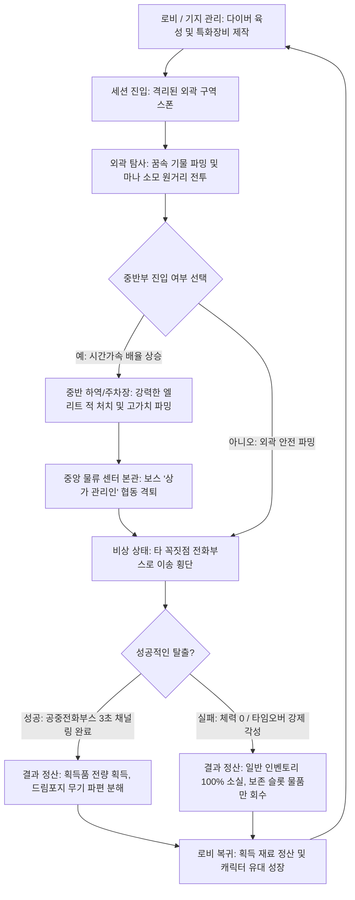

# 🌌 침몽도시: 루시드 다이버 (Lucid Diver) 핵심 통합 기획서 (SSOT)

> **본 문서는 프로젝트의 전체 기획 방향성을 정비하고, 개별 명세서들의 정합성을 일원화하는 최상위 마스터 문서(Single Source of Truth)입니다.**  
> 팀원들은 개별 기획서를 고도화할 때 본 기획서에 기록된 대전제 규칙과 충돌하지 않도록 유의해야 하며, 하위 문서 이동 시 **[1. 통합 문서 색인 테이블]**의 상대 경로 링크를 활용하십시오.
>
> 본 문서는 프로젝트 전체 기획의 최상위 기준 문서이며,  
> `프로토타입_개발용_SSOT.md`는 본 문서의 하위 실행 문서로서 1차 빌드에서 검증할 최소 구현 범위만을 정의한다.
>
> 따라서 두 문서가 충돌할 경우,
> - 최종 게임 방향성, 세계관, 시스템 구조, 장기 설계는 본 문서를 우선한다.
> - 6월 17일 1차 빌드 구현 여부와 개발 우선순위 판단은 `프로토타입_개발용_SSOT.md`를 우선한다.
>
> 즉, 전체 기획서에 존재하는 기능이라도 프로토타입 SSOT의 제외 범위에 포함되어 있다면 1차 빌드 구현 대상이 아니다.

---

## 1. 통합 문서 색인 테이블 (Index Map)

*   *팁: 본 링크들은 상대 경로로 작성되어 있어, Git 레포지토리를 복제한 모든 팀원의 PC 환경에서 상호 작동합니다.*

| 분류 | 문서명 | 경로 (상대 경로 링크) | 최신 버전 | 주요 담당자 |
| :---: | :--- | :--- | :---: | :---: |
| **메인** | **통합 핵심 기획서 (SSOT)** | [게임_핵심_기획서.md](./게임_핵심_기획서.md) | v2.00 | 장수영 |
| **메인** | **프로토타입 개발용 SSOT** | [프로토타입_개발용_SSOT.md](./프로토타입_개발용_SSOT.md) | v1.00 | 장수영 |
| **시나리오** | **세계관 설정 Q&A** | [260617_루시드다이버_세계관_설정_V1.11.md](../../01.기획_문서/검수전/시나리오_및_세계관/260617_루시드다이버_세계관_설정_V1.11.md) | V1.11 | 김남해 / 송예찬 |
| **시나리오** | **시나리오 & 프롤로그 통합본** | [루시드다이버_시나리오_및_프롤로그_통합본.md](../../01.기획_문서/검수전/시나리오_및_세계관/루시드다이버_시나리오_및_프롤로그_통합본.md) | v1.00 | 송예찬 |
| **시나리오** | **다이버 심층기획 & 사이드스토리 (채린) 통합본** | [루시드다이버_캐릭터_심층기획_및_사이드스토리_채린_통합본.md](../../01.기획_문서/검수전/시나리오_및_세계관/루시드다이버_캐릭터_심층기획_및_사이드스토리_채린_통합본.md) | v1.00 | 송예찬 |
| **시스템** | **인게임 핵심 시스템 명세서** | [20260615_루시드다이버_시스템_기획서_v1.02.md](../../01.기획_문서/시스템_명세/20260615_루시드다이버_시스템_기획서_v1.02.md) | v1.02 | 우성혁 |
| **시스템** | **드림 포지드 무장 명세서** | [드림_포지드_무장_시스템_명세서.md](../../01.기획_문서/시스템_명세/드림_포지드_무장_시스템_명세서.md) | v1.00 | 우성혁 |
| **레벨** | **프로토타입 테스트맵 레벨디자인** | [프로토타입_테스트맵_레벨디자인.md](../../01.기획_문서/레벨_기획/프로토타입_테스트맵_레벨디자인.md) | v1.00 | 장수영 |
| **레벨** | **상가 구역 테스트 레벨디자인** | [프로토타입_맵_상가_구역_레벨_디자인.md](../../01.기획_문서/레벨_기획/프로토타입_맵_상가_구역_레벨_디자인.md) | v1.00 | 장수영 |
| **컨셉** | **통합 컨셉 기획서** | [루시드다이버_컨셉_기획_통합본.md](../../01.기획_문서/검수전/컨셉_기획/루시드다이버_컨셉_기획_통합본.md) | v1.00 | 송예찬 |
| **서브컬처** | **통합 서브컬처 애착 기획서** | [루시드다이버_서브컬처_애착_기획_통합본.md](../../01.기획_문서/검수전/서브컬처_기획/루시드다이버_서브컬처_애착_기획_통합본.md) | v1.00 | 송예찬 |

---

## 2. 게임 한 줄 소개
현실과 왜곡된 꿈이 중첩된 위험천만한 침몽도시에서, 자각몽 무장인 드림 포지드를 수집 및 커스터마이징하고 강제 각성(사망/타임오버)의 위험을 피해 전리품을 안전하게 회수하여 탈출하는 **2.5D 라이트 PvE 익스트랙션 액션 RPG**입니다.

---

## 3. 장르 / 플랫폼 / 타깃
*   **장르**: 2.5D 라이트 PvE 익스트랙션 액션 RPG (2.5D Light PvE Extraction Action RPG)
*   **플랫폼**: PC (Windows / Steam 빌드 타겟) | FHD (1920x1080) 16:9 해상도 표준 기준
*   **주요 타깃**: 
    - 서브컬처 액션 게임을 좋아하며 매력적인 캐릭터 수집 및 감상을 중시하는 유저층.
    - 가혹한 유실 패널티 및 PvP 약탈 스트레스로 인해 하드코어 탈출 슈터(예: 타르코프) 진입에 장벽을 느끼는 라이트 파밍/PvE 협동 지향 게이머군.

---

## 4. 핵심 재미
*   **즉석 파워업과 전술적 기동**: 몽경 지대에서 실시간으로 획득하는 기이한 꿈속 사물들(우산, 가위, 손거울 등)을 무기로 활용하는 즉흥적이고 신선한 전투 액션.
*   **탈출의 쫄깃함과 자원 분배**: 맵 내부로 갈수록 침식 레벨이 오르고 시간 제한 타이머가 가속되는 심리적 압박감 속에서, 보존 슬롯 공간(2x2)의 최적 배치를 고민하는 장르 고유의 딜레마성 쾌감.
*   **현실 거점에서의 영구적 성장**: 파밍해 온 전리품을 해체/분해하여 고성능 특화 장비를 공방에서 크래프팅하고 캐릭터들을 점진적으로 해금/육성하는 장기적인 RPG 수집적 재미.

---

## 5. 차별점
*   **100% PvE 협동 중심**: 플레이어 간 약탈 및 갈등을 완전히 배제하여 PvE 보스 레이드와 생존 연대에 초점을 맞춤으로써 유저 불쾌감을 원천 예방합니다.
*   **1+2 스트라이커 편제 도입**: 직접 3D 공간을 누비며 기동하는 1명의 메인 캐릭터와, 결정적인 순간에 2D 연출과 함께 원격 난입하여 액티브 지원 스킬을 꽂고 들어가는 2명의 지원 다이버 시스템을 통해 수집형 RPG의 전략 덱 빌딩 요소를 익스트랙션에 융합했습니다.
*   **영구 사망 없는 라이트한 손실**: 캐릭터 자체의 사망이나 육성 수치의 증발이 없으며, 비상 회수 안전장치인 '각성 보존 슬롯'을 통해 초보자 및 라이트 유저의 심리적 파밍 안전 장벽을 제공합니다.

---

## 6. 세계관
*   대기 중 비활성 상태로 부유하는 뇌파 동조 입자 **'루시드(Lucid)'**와 꿈을 시각 투사하는 **'루시드 캡슐'** 오락기가 사건의 발단입니다.
*   캡슐 출시 당일 1,000명의 접속 파장이 동시 공명/간섭 현상을 일으키면서 도시의 특정 영역을 무의식과 공포가 실체화된 기괴한 왜곡 공간인 **'침몽도시(沈夢都市)'**로 집어삼키는 대사고가 발발합니다.
*   **플레이어(관제자)**는 링크 신경 네트워크의 유일한 적성자로서, 과거 사고 당일 기억의 주요 파편을 꿈속에 남겨둔 채 눈을 떴습니다. 다이버들과의 신경 동조율을 유지하여 그들의 정신을 고정하는 한편, 다이버들이 회수해 오는 단서를 토대로 잃어버린 자아와 침몽도시의 진실을 복구해 나가야 합니다.

---

## 7. 플레이 루프

---

## 8. 세션 구조
*   **마름모 형태 격벽 구조**: 세션 맵은 외부 세계로부터의 격리를 위한 거대 콘크리트 외벽 장벽으로 밀폐되어 있어 외부 이탈이 불가능합니다.
*   **3개 레이어 전역 분화**:
    - **외곽 (Outer - 시간 차감 가속 1.0배)**: 비교적 한산한 도로 및 상가 실내. 약한 순찰 잔몽체들이 포진하며 안전한 솔로 파밍이 이루어집니다.
    - **중반부 (Mid - 시간 차감 가속 1.5배)**: 대형 화물 도크 하역장(고가치 몽유물 밀집)과 주차장(차량 엄폐 기동 및 지하 램프 우회로)으로 양분되어 위협도가 가중됩니다.
    - **중앙 (Center - 시간 차감 가속 2.0배)**: 보스가 상주하는 물류 본관 빌딩 1층 로비 홀. 침식 강도가 극에 달해 타이머가 2배로 빠르게 차감되어 극한의 타임어택 딜레마를 선사합니다.

---

## 9. 전투 시스템
*   **몽막 ➡️ 심상핵 공략**: 적 침식체들은 물리 차단 쉴드인 **'몽막'**을 지닙니다. 드림 포지드 무기로 이를 먼저 때려 붕괴(그로기/Break)시켜야 하며, 노출된 약점인 **'심상핵(Core)'**에 딜러의 화력을 집중 투사하면 치명타 배율 피해가 가산됩니다.
*   **마나(Mana) 단일 자원 통합**: 
    - 최대 마나 100 보유 기준, 기본 격발 및 특화 스킬(공통 20 마나 소모) 작동 시 마나 자원을 공동 사용합니다.
    - 초당 마나 자연 회복 속도(`manaRegen`)가 적용되며, 사격 지속 시 탄창 용량 소모에 따른 재장전 딜레이가 발생해 마나가 차오를 전술적 대기 시간을 유도합니다.
*   **8대 무기군 분류**:
    - *해머*(근접 몽막 공격, 5소모) / *샷건*(근거리 고저지, 8소모) / *저격소총*(심상핵 저격 치명타, 15소모) / *지정사수소총*(중거리 엄호, 4소모) / *기관단총*(고속연사 게이지 회복방해, 2소모) / *로켓런처*(넉백 및 광역파괴, 12소모) / *에너지권총*(회피기동 및 유틸, 1소모 - **프로토타입 전용**) / *방패권총*(방막 수비 전개, 2소모). *(※ 권총 외 7종 특화 무기군은 1차 프로토타입 범위 제외)*

---

## 10. 파밍 / 회수 / 손실 구조
*   **상자 개방 채널링 (닌자 파밍 방지)**: 몬스터를 피해 물건만 먹튀하는 행동을 막기 위해 개방 시 캐스팅 대기 시간(소형 0.5초, 중형 2.5초, 대형 4초)이 요구됩니다. 게이지 수집 중 적에게 맞으면 즉시 캔슬되며, 개방 시 주기적 소음 핑을 내 주변 적의 어그로를 끕니다.
*   **정산 및 회수**: 탈출구(공중전화부스)를 통해 3초간 수화기를 귀에 대는 동작을 버텨내 탈출에 성공하면 인벤토리 전리품을 100% 온전히 획득합니다. 필드용 획득 무기는 로비 귀환 즉시 해체 및 재료인 '무장 파편'으로 변환 정산됩니다.
*   **사망 및 손실**: 세션 도중 체력이 0이 되거나 제한 시간이 만료되면 관제 시스템에 의해 '강제 각성'이 발동해 다이버의 생명(정신)은 구조되지만, 보존 슬롯을 제외한 일반 인벤토리 획득물과 장착 중이던 특화 무기는 **100% 차원 분실(영구 소멸)** 처리됩니다.

---

## 11. 인벤토리 / 보존 슬롯
*   **1칸 단위 직관적 슬롯**: 복잡한 격자 조율 없이 획득품은 전부 1칸을 소모해 직관적으로 보관합니다.
*   **스택(Stack) 유무**: 몽유물 등 장비류는 슬롯 중첩이 불가능하며, 제작 재료나 소비 기물(자각 초콜릿 등)은 1칸 슬롯 내에서 지정 수치까지 겹쳐서 누적(Stackable) 보관이 가능합니다.
*   **각성 보존 슬롯 (안전 금고)**: 
    - 사망 유실을 예방하는 특수 **2x2 (총 4칸)** 그리드 독립 슬롯입니다.
    - 소형 기물(1칸), 중형(2칸), 대형(3칸), 보스 심상핵(4칸 전체)을 차지하며, 제작해 온 특화 무장 장비 보존 시 **3칸**을 점유하게 강제 설계함으로써 귀한 장비를 지키기 위해 파밍 가용 공간을 1칸으로 극단화시키는 디렉터 의도 하의 전략적 선택지가 발생합니다.

---

## 12. 캐릭터 / 역할군
*   **에단 (Ethan - 브레이커)**: 수면 안대를 착용하고 잠에 찌든 귀차니스트 천재 다이버. 해머/샷건을 이용해 적 몽막 붕괴 효율 및 넉백 파쇄에 특화되어 있습니다.
*   **레이라 (Layla - 딜러)**: '심연의 심판자'로 폼을 잡지만 밤안개와 귀신을 무서워하는 중2병 허세 저격수. 저격 소총을 장착해 드러난 심상핵에 1.5배의 폭발적인 치명타 누킹 피해를 입힙니다.
*   **헬레나 (Helena - 서포터)**: 차분한 존댓말 미소 뒤에 적을 난도질하고 성분을 정밀 분석하고 싶어 하는 해부 매니아 맑눈광. 지원 소환 시 에너지 광선을 쏘아 아군 체력을 15% 복구시킵니다.
*   **채린 (Chae-Rin - 컨트롤러)**: 폭발에 휩싸인 적들의 꿈의 색채를 수집하는 징크스풍 아티스트. 로켓 런처로 광역 넉백을 가해 적들의 몽막 게이지 회복을 5초간 전면 동결시킵니다.
*   **하선 (Ha-Seon - 디펜더)**: 툴툴대며 동료를 챙기는 츤데레 멘토. **'현실의 닻(Reality Anchor)'** 전술 필드를 던져 범위 내 아군에게 지속 회복/슈퍼아머(넉백/둔화 면역)를 제공하고 적을 80% 감속시킵니다.

---

## 13. 멀티플레이 협동 구조
*   **동료 소생 시스템 (최소 스펙)**: 
    - 세션 중 체력이 0이 된 동료는 즉시 퇴장하지 않고 **'빈사 상태(Down-but-Not-Out)'**로 지면에 쓰러져 대기합니다.
    - 살아있는 동료가 접근해 일정 시간 소생 키(F키)를 꾹 누르는 채널링을 완료하면 동료를 즉각 부활(소생)시킬 수 있습니다.
    - 채널링 제한 시간이 만료되거나 빈사 상태에서 추가 피해를 입으면 최종 사망하여 강제 각성 회수됩니다. (복잡한 시너지 버프 및 치료 스킬은 개발 복잡도 억제를 위해 전무합니다.)

---

## 14. 몬스터 / 보스
*   **기본 꿈식자 (Monster_Test - 프로토타입)**: 시민들의 무의식적 일상 공포가 뭉쳐진 하위 괴이. 2~3마리씩 떼를 지어 순찰 경로를 돌며, 플레이어를 발견하면 맹목적으로 부유 추적하여 근접 돌진을 시도합니다. (체력 50, 공격력 10)
*   **중형 침식체 (엘리트 / 문지기)**: 고가치 상자나 길목을 지키는 문지기 괴이. 몸 주변에 기이한 왜곡 안개를 풍겨 플레이어에게 "저기에 확실한 몽유물이 있다"는 신호를 인지시키며, 강력한 광역 넉백과 몽막 재생 패턴을 시전합니다.
*   **중심부 보스 침식체 (상가 관리인)**: 물류 지원 본관 홀에 군림하는 보스. 광폭화 및 협동 레이드를 강제하는 광역 패턴을 구사합니다.

---

## 15. 레벨 디자인 방향
*   **한국형 일상 공간(K-상점가) 테마**: 편의점, 분식집, 2층 PC방, 노래방 등 극도로 평범한 한국 거리 에셋들로 맵을 채워 일상 뒤에 겹친 꿈의 기괴함을 배가시킵니다. 
*   **중앙 물류 센터 본관의 랜드마크화**: 마름모 맵 정중앙에 위치한 '물류 지원 센터' 본관 건물을 배치해 거대 수하물 컨베이어 벨트 사이에서 긴박한 실내 보스전을 치릅니다.
*   **교차 탈출로 이동 강제**: 동/서/남/북 꼭짓점에서 플레이어들이 분산 스폰됩니다. **자기가 스폰된 지점의 공중전화부스(탈출구)는 불통**되므로, 3초 수화기 채널링을 통한 안전 탈출을 완수하려면 반드시 중앙을 경유하여 타인의 꼭짓점으로 횡단하도록 동선을 엮었습니다.

---

## 16. UI / UX 방향
*   **화면 상단 중앙 타이머**: 세션 잔여 제한 시간이 실시간 노출되며, 위험 구역 진입에 따른 가속 배율 발생 시 숫자가 붉은색으로 점멸하며 청각적 경고 신호를 보냅니다.
*   **대로 노출 경고 시스템**: 엄폐물 뒤나 건물 내부와 달리 2차선 아스팔트 도로로 캐릭터가 들어서면 화면 외곽이 붉게 아웃포커싱(블러) 처리되어 자신이 위험에 완전히 노출(적 시야 2.5배 팽창)되었음을 감각적으로 전달합니다.
*   **인벤토리 장비 셋업**: 인게임 장비창에서 획득한 기물 무기를 슬롯에 드래그 앤 드롭하여 직관적으로 실시간 장착 변경합니다.

---

## 17. 아트 콘셉트
*   **2.5D 아이소메트릭 빌보드 비주얼**: 입체적이고 음산한 3D 레벨 공간(URP 적용) 위에 매력적인 2D 서브컬처 스타일 캐릭터 스프라이트를 얹은 독창적인 연출을 차용합니다. 
*   **스프라이트 회전 제어 (Billboard)**: 2D 캐릭터 스프라이트의 Y축(높이) 회전량을 카메라의 정면 벡터와 정대칭으로 동조시켜, 탑다운 뷰에서도 뒤틀리지 않고 입체적으로 살아 움직이게 렌더링합니다.
*   **쉐이더 투명화 (Occlusion Transparency)**: 2.5D 시점 특성상 빌딩이나 기둥 뒤쪽 코너가 가려지는 사각을 방어하기 위해 캐릭터를 가리는 구조물은 반투명 실루엣으로 처리합니다.

---

## 18. 사운드 방향
*   **Synthwave / Retro 오디오**: 몽환적이면서도 음산한 꿈속 도심지의 감각을 청각화하기 위해 레트로 Synthwave 계열의 BGM을 전반에 사용합니다.
*   **전화벨 입체음향 힌트**: 탈출구 근처(15m 내) 접근 시, 밤안개 속에서도 소리가 나는 지향성 방향을 파악해 찾아갈 수 있도록 '따르릉'하는 공중전화 벨소리가 3D 입체 음향으로 출력됩니다.
*   **기본 무장 불발 효과음**: 마나 게이지가 완전히 바닥나 격발이 불가능할 경우, 총탄 대신 기계적인 '딸깍(Click)' 불발 효과음을 재생해 즉각적으로 자원 고갈을 인지시킵니다.

---

## 19. 개발 단계별 범위 정의

### 19.1 1차 프로토타입 개발 범위 — 6월 17일 빌드 기준
본 항목은 6월 17일 1차 빌드에서 실제 Unity 프로젝트로 구현하여 기술 작동성을 검증할 범위다.  
최종 게임의 전체 사양이 아니라, 핵심 플레이 루프가 실제로 작동하는지 확인하기 위한 최소 실행 단위다.

세부 구현 명세, 좌표, 데이터 테이블, 완료 체크리스트는 `프로토타입_개발용_SSOT.md`를 기준으로 한다.

*   **플레이어**: `Player_Test` 다이버 1종, 기본 이동 조작 및 마우스 조준 사격 구현.
*   **무장**: 에너지 권총 **'희미한 잔상'** (발당 1 마나, 탄창 소진 시 재장전 시간 작동) 단 1종 구현.
*   **몬스터**: `Monster_Test` (기본 꿈식자) 1종 배치. FSM(대기 ➡️ 추적 ➡️ 공격) 기본 구동.
*   **아이템**: 1x1 규격의 테스트용 심상기물 `Item_Test` 1종 스폰. 닿을 시 즉시 획득 및 인벤토리 카운트 증가.
*   **레벨**: 30m x 30m 크기의 단일 평면 샌드박스 맵. 북단 중앙에 탈출용 공중전화부스(`Exit_Point`) 배치, 접촉 즉시 세션 성공 정산 및 결과 UI 출력.  
    ※ 1차 프로토타입에서는 탈출 채널링을 구현하지 않고, 전화부스 접촉 즉시 성공 처리한다. 정식 세션에서는 공중전화부스 3초 채널링 탈출을 기본 규칙으로 유지한다.

### 19.2 전체 프로젝트 기획서 완성 범위 — 6월 19일 문서 기준
본 항목은 6월 19일까지 실제로 구현해야 하는 범위가 아니라, 프로젝트 전체 기획서에 문서상으로 정리되어 있어야 하는 설계 범위다.

6월 19일 완성본은 “프로젝트 전체 기획서”를 목표로 하며, 다음 항목들이 서로 충돌하지 않는 상태로 정리되어 있어야 한다.

- 게임 한 줄 소개
- 장르 / 플랫폼 / 타깃
- 핵심 재미
- 차별점
- 세계관
- 핵심 플레이 루프
- 세션 구조
- 전투 / 무장 / 마나 구조
- 파밍 / 회수 / 손실 구조
- 인벤토리 / 각성 보존 슬롯 구조
- 캐릭터 / 역할군 구조
- 멀티플레이 협동 구조
- 몬스터 / 보스 방향성
- 레벨 디자인 방향
- UI / UX 방향
- 아트 콘셉트
- 사운드 방향
- 1차 프로토타입, MVP, 장기 확장 범위 구분
- 하위 기획 문서 색인 및 최신 버전 정리

### 19.3 MVP 개발 후보 범위
본 항목은 1차 프로토타입 이후, 실제 프로젝트 기간 내에서 우선 구현을 검토할 수 있는 범위다.  
단, 본 항목은 아직 1차 빌드 구현 대상이 아니며, 개발 리소스와 일정 검토 후 우선순위가 확정된다.

- 상가 구역 테스트맵 1차 구현
- 공중전화부스 3초 채널링 탈출
- 상자 개방 채널링
- 기본 몬스터 2~3종
- 캐릭터 1~2종 추가
- 무기군 일부 추가
- 각성 보존 슬롯 정식화
- 기본 멀티플레이 동기화
- 빈사 상태 / 동료 소생 시스템
- 결과 정산 UI 고도화

### 19.4 장기 확장 백로그
본 항목은 최종 게임 방향성에는 포함되지만, 1차 프로토타입 및 단기 MVP 범위에서는 제외되는 장기 확장 기획이다.

- 다이버 캐릭터 5종 전체 구현
- 8대 무기군 전체 구현
- 특화 무장 제작 / 강화
- 방어구 및 정신 방벽 시스템
- 로비 / 기지 관리실
- 상점 거래
- 크래프팅 공방
- 캐릭터 유대 성장
- 중앙 보스전
- 구역별 시간 차감 가속 배율
- 시즌 구조
- 장기 라이브 운영 요소

---

## 20. 프로토타입 SSOT
1차 프로토타입(6월 17일 빌드 마감) 개발용 세부 스펙, 제외 범위, 30m x 30m 좌표 테이블 및 완료 체크리스트는 새롭게 독립 분리된 **[프로토타입_개발용_SSOT.md](./프로토타입_개발용_SSOT.md)**를 참조하십시오.
