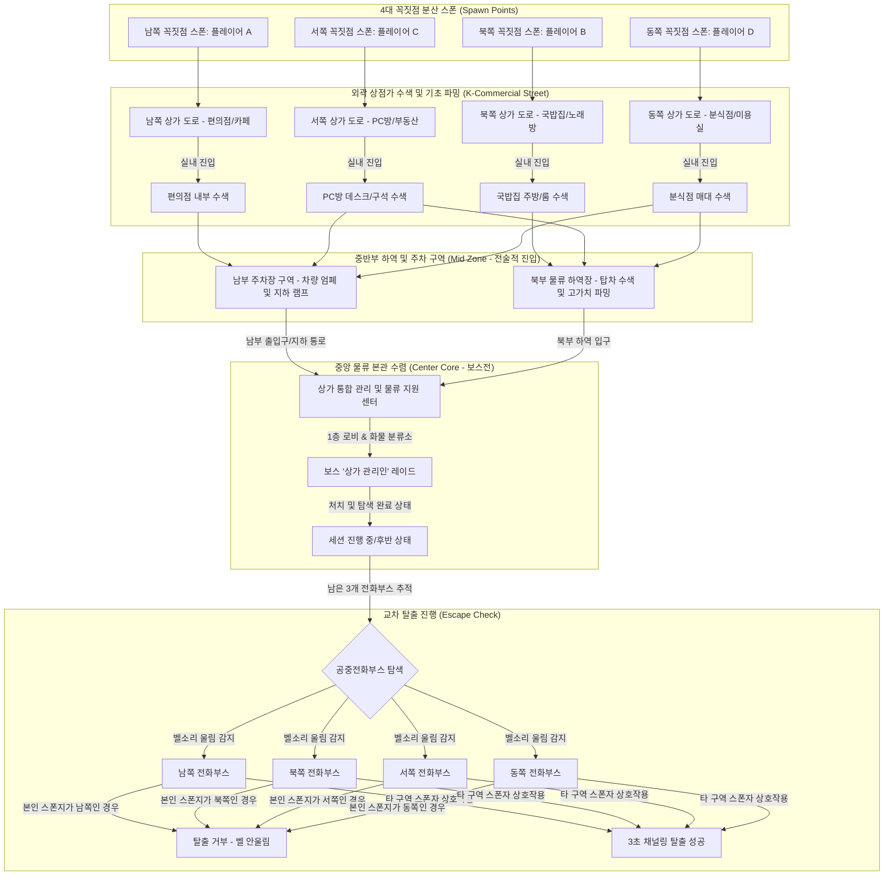

> [!WARNING]

> 본 문서는 검수 전 상태의 레벨 디자인 기획서이며, 장수영 담당자의 검토 및 승인 대기 중인 수정 제안본입니다.

> 본 상가 구역 맵 디자인은 6월 17일 1차 프로토타입 빌드 구현 범위에서 제외되며, 6월 19일 전체 프로젝트 기획서 완성 및 차기 MVP 구현 범위로 정비되었습니다.

# 프로토타입 맵 "꿈에 먹힌 상가 구역" 레벨 디자인 기획서 (검수전 수정안)

## 0. 기획 의도 (Design Intent)

- **목적**: 핵심 게임 루프(파밍 ➡️ 보스전 협동 ➡️ 탈출)가 작동할 수 있는 공간인 '꿈에 먹힌 상가 구역'의 공간 구조와 시각적 에셋 배치를 정의한다. 2.5D 아이소메트릭 쿼터뷰 시점에서의 가시성을 확보하고, 외곽에서 중심부로 갈수록 난이도가 체계적으로 상승하는 수평적 레벨 설계를 지향한다. (MVP)

- **핵심 가치**: 

  - **K-상점가 테마의 단일화**: 플레이어에게 친숙한 한국의 지극히 평범한 상점가 거리(편의점, 국밥집, 분식점, PC방, 노래방 등)로 도로 양옆을 채워 일상 공간이 왜곡된 꿈속 유령 도시의 기괴한 몰입감을 극대화한다. 

  - **중앙 관리 & 물류 지원 센터 배치**: 맵 정중앙에는 거대 단일 건물인 **'상가 통합 관리 및 물류 지원 센터(본관)'**를 중앙 구역으로 배치한다.

  - **4지점 분산 스폰 및 교차 탈출**: 동서남북 4대 꼭짓점 구역에 플레이어가 분산 스폰되어 겹침을 방지하고, 자신이 스폰된 꼭짓점의 전화부스(탈출구)는 이용할 수 없도록 강제하여 자연스럽게 중앙 물류 센터 본관으로 향하거나 타 구역으로 동선이 얽히도록 설계한다.

---

## 1. 개요 (Overview)

| 항목 | 내용 |

|------|------|

| **기능명** | 1차 프로토타입 테마 맵: 꿈에 먹힌 상가 구역 (격리된 청몽 교차로) |

| **담당자** | 기획: 장수영 (레벨 디자인) / 개발: 3차 프로젝트 개발팀 |

| **우선순위** | **MVP (6월 19일 전체 기획서 완성 범위 및 차기 개발 후보)** |

| **상태** | 기획 검토 대기 (초안) |

---

## 2. 상세 로직 및 프로세스 (Core Logic)

### 2.1 다이아몬드 동심원 구조 및 공간 배치 (Diamond Layer Layout) (MVP)

본 맵은 동서남북 외곽 경계선이 거대한 콘크리트 격리 외벽(격벽)과 철망으로 완전히 둘러싸인 다이아몬드(마름모) 형태로 설계되며, 바깥쪽부터 안쪽으로 동심원처럼 구역이 겹쳐져 있습니다.

#### 1. 외곽 구역 (Outer Zone - 평범한 한국식 상가 도로 및 스폰/탈출)

- **위치 및 역할**: 다이아몬드 맵의 최외곽 경계 테두리 구간. 남/북/동/서 꼭짓점은 각각 플레이어의 스폰 포인트이자 최종 탈출용 공중전화부스가 배치된 격벽 한계선입니다.

- **상가 구역 테마**: 친숙한 한국 동네 골목 상점가로 단일 통일.

  - **배치 상가**: 편의점, 24시 국밥집, 분식점, 2층 PC방, 코인 노래방, 부동산, 미용실, 카페 등.

- **주요 배치 에셋**: 편의점 온수기 매대, 식당 테이블/의자, PC방 컴퓨터 데스크, 길가에 버려진 택시/승용차 차량, 4대 꼭짓점 공중전화부스.

#### 2. 중반부 구역 (Mid Zone - 물류 하역 및 차량 주차 구역)

중앙 본관 건물을 기점으로 다이아몬드 영역의 허리를 가로질러 북부와 남부로 양분됩니다.

- **북부 중반부 (North Mid Zone - 복합 물류 하역장)**: 대형 화물을 하역하는 공간으로 탑차, 컨테이너, 수하물 롤테이너, 지게차 등이 배치되며 **고가치 몽유물** 파밍이 가능합니다.

- **남부 중반부 (South Mid Zone - 직원 및 방문객 주차 구역)**: 지상 및 지하 주차 공간으로 부서진 세단/SUV 에셋들과 요금 정산소, 나선형 지하 주차장 진입 램프가 존재합니다.

#### 3. 중앙 구역 (Center Core Zone - 최고 고위험군 보스룸 및 관리 본관)

- **위치 및 역할**: 다이아몬드 맵의 정중앙에 위치한 거대 독립 건물. 보스 괴이인 '상가 관리인'이 1층 로비 홀 및 화물 분류 기지에서 스폰됩니다.

- **랜드마크 이미지**: **'상가 통합 관리 및 물류 지원 센터 (본관)'**.

---

## 2.2 레벨 구조 및 흐름도 (Mermaid Diagram) (MVP)

---

## 2.3 도로망 설계 및 도로 순찰조 경보 시스템 (MVP)

도로 노출 시 몬스터의 **인식 시야 각도 및 거리가 건물 내부 대비 2.5배 상향 적용**되며, 3인 1조의 **'수호 경비병 순찰대'** 몽유체들이 상시 배회해 발각 시 주변 적들까지 도로로 소환하는 경보 시스템이 작동합니다.

---

## 2.4 탈출구(공중전화부스) 상호작용 규칙 명세 (MVP)

| 규칙 항목 | 세부 작동 원리 | 기획 의도 및 레벨 디자인적 효과 |

| :--- | :--- | :--- |

| **탈출구 단일화** | 세션 내 탈출 오브젝트는 4개 꼭짓점에 배치된 **'공중전화부스(Telephone Booth)'**로 통일한다. | 현실 복귀를 위해 공중전화를 매개체로 각성한다는 세계관적 몰입감 제공 및 개발 구현 복잡도 최소화. |

| **스폰 꼭짓점 비활성** | 플레이어는 본인이 스폰된 꼭짓점 구역(남/북/동/서)에 있는 전화부스는 탈출구로 이용할 수 없다. | 플레이어가 강제적으로 맵 중앙이나 타 구역을 횡단하게 만들어 동선 교차 유도. |

| **전화벨 청각 힌트** | 탈출이 활성화된 공중전화부스 근처(반경 15m)에 접근 시 **'따르릉—' 하는 전화벨 소리**가 3D 입체음향으로 울린다. | 사각지대에서도 전화벨 방향을 청각적으로 듣고 찾아올 수 있는 탐색 보조 장치. |

| **탈출 시퀀스 (채널링)** | 조건에 맞는 활성화된 전화부스에 상호작용 시 **3초간 수화기를 귀에 대는 동작(채널링)**을 버티면 각성 탈출한다. | 탈출 직전 3초 동안 무방비 노출되어 최후까지 긴장감을 유지하는 핵심 익스트랙션 딜레마. |

※ [프로토타입 테스트맵과 상가 구역의 탈출 방식 차이 명기]

- **6월 17일 1차 프로토타입 테스트맵 (P0)**: 공중전화부스 접촉 즉시 채널링 없이 탈출 성공 처리.

- **본 정식 상가 구역 맵 (MVP)**: 공중전화부스 접촉 후 3초 채널링 수화기 홀딩을 유지해야 탈출 완료.

---

## 3. 데이터 명세 (Data Specification) (MVP)

### 3.1 구역 속성 및 동선 테이블

상가 구역의 세부 시간 차감 가속 배율 및 배치 에셋 테마 테이블입니다.

| 구역 ID (ZoneId) | 구역 명칭 (ZoneName) | 시간 차감 가속 배율 | 배치 에셋 테마 | 스폰 및 탈출 속성 |

|-----------------|---------------------|:-----------------:|---------------|------------------|

| `ZONE_OUTER_SOUTH` | 남쪽 외곽 (Outer) | `1.0` | K-상가 거리 (편의점, 국밥집) | 플레이어 A 스폰 지점 / 남쪽 공중전화부스 (A 비활성) |

| `ZONE_OUTER_NORTH` | 북쪽 외곽 (Outer) | `1.0` | K-상가 거리 (부동산, 약국) | 플레이어 B 스폰 지점 / 북쪽 공중전화부스 (B 비활성) |

| `ZONE_OUTER_WEST` | 서쪽 외곽 (Outer) | `1.0` | K-상가 거리 (PC방, 코인노래방) | 플레이어 C 스폰 지점 / 서쪽 공중전화부스 (C 비활성) |

| `ZONE_OUTER_EAST` | 동쪽 외곽 (Outer) | `1.0` | K-상가 거리 (분식집, 카페) | 플레이어 D 스폰 지점 / 동쪽 공중전화부스 (D 비활성) |

| `ZONE_MID_NORTH_DOCK` | 북부 물류 하역장 (Mid) | `1.5` | 하역 도크, 수송 탑차, 화물 팔레트 | 고가치 몽유물 파밍지 (높은 몬스터 리스크) |

| `ZONE_MID_SOUTH_PARK` | 남부 주차장 (Mid) | `1.5` | 주차장, 버려진 차량, 요금 정산소 | 전술 우회 지대 (지하 주차장 진입 램프) |

| `ZONE_CORE_01` | 중앙 관리&물류 센터 (Center) | `2.0` | 1층 로비 홀 및 대형 택배 분류 설비 | 보스룸 (보스 상가관리인 스폰 / 2.0배 시간가속) |

*(이하 PROP_STORE_SHELF 등 핵심 환경 에셋 리스트, UI/UX 연동, URP 쉐이더 투명화 Occlusion 제약 사항은 MVP 개발 단계에서 최종 참조됩니다.)*

---

## 📜 Revision History

| 날짜 | 버전 | 내용 | 작성자 |

|------|------|------|--------|

| 2026-06-12 | v1.0 | 최초 기획서 초안 작성 | 장수영 |

| 2026-06-12 | v2.1 | 물류 센터 및 하역장/주차장 개편으로 확장 명세 반영 | 장수영 |

| 2026-06-16 | v2.1 (수정안) | - 검수전 임시 개정안 작성 - 우선순위를 MVP로 격하 명시 및 테스트맵(P0) 즉시 탈출 방식과의 비교 수록 | 장수영 |
