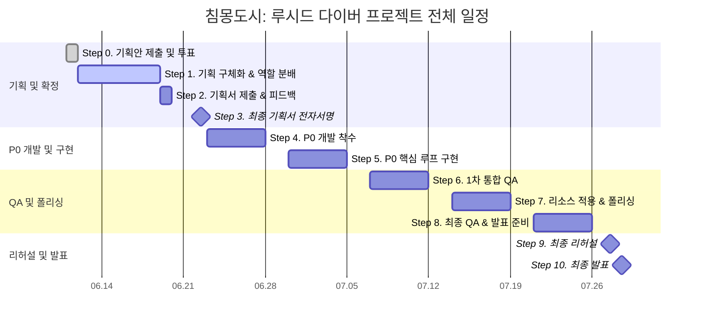

> [!IMPORTANT]
> 이 문서는 AI(Antigravity)가 작성한 검수 전 상태의 프로젝트 일정표 구조 재정의안 초안입니다.
> PM 및 팀원들의 검토 및 승인 후 이 배너를 제거하면 '확정 사양'으로 인정됩니다.

# 🗺️ 침몽도시: 루시드 다이버 - 프로젝트 일정표 구조 재정의안

## 1. 일정표 작성 원칙

본 프로젝트 일정표는 하나의 표로 모든 정보를 표현하지 않습니다. 
전체 프로젝트 일정표, 주별 일정표, 일별 일정표를 분리하여 각각 다른 목적을 가진 관리 문서로 사용합니다.

### 📅 일정표 3단 구조 정의

| 문서 | 역할 | 상세도 | 사용 목적 |
| :--- | :--- | :---: | :--- |
| **전체 프로젝트 일정표** | 프로젝트 전체 흐름 관리 | 낮음 | 기획, 개발, QA, 발표까지의 큰 단계 확인 |
| **주별 일정표** | 주차별 마일스톤 관리 | 중간 | 각 주의 목표, 산출물, 완료 기준 확인 |
| **일별 일정표** | 팀원별 업무 진행 관리 | 높음 | 당일 작업, 담당자, 진행률, 이슈 확인 |

---

## 2. 전체 프로젝트 일정표

### 🎯 목적
전체 프로젝트 일정표는 프로젝트의 큰 흐름을 보여주는 상위 일정표입니다. 세부 업무를 전부 넣지 않고, 프로젝트의 단계와 주요 의사결정 지점(Milestone)을 직관적으로 보여주는 것을 목적으로 합니다.

### 📊 전체 프로젝트 로드맵 간트차트 (Mermaid)

### 📋 전체 프로젝트 일정표 초안

| 단계 | 기간 | 단계명 | 핵심 목적 | 주요 산출물 | 상태 |
| :---: | :---: | :--- | :--- | :--- | :---: |
| **0** | 06.11 | 프로젝트 기획안 제출 및 투표 | 각자 프로젝트 기획안을 제출하고 투표를 통해 현재 프로젝트 채택 | 프로젝트 채택 결과 | 완료 |
| **1** | 06.12 ~ 06.18 | 기획 구체화 및 역할 분배 | CP 로드맵 기반으로 역할을 나누고 P0 범위를 정리 | 역할표, P0 정의서, 기획 초안 | 진행 |
| **2** | 06.19 | 기획서 제출 및 피드백 반영 | 기획서 완성본 제출, 피드백 수령, 수정본 제출 | 기획서 완성본, 피드백 반영본 | 예정 |
| **3** | 06.22 | 최종 기획서 전자서명 | 팀원 전자서명을 통해 최종 기획 범위 고정 | 전자서명 완료본 | 예정 |
| **4** | 06.23 ~ 06.27 | P0 개발 착수 | Unity 프로젝트 구조 세팅 및 핵심 기능 구현 시작 | 1차 플레이어블 구조 | 예정 |
| **5** | 06.30 ~ 07.04 | P0 핵심 루프 구현 | 로비, 출격, 세션, 전투, 파밍, 탈출, 결과창 연결 | P0 루프 1차 통합 빌드 | 예정 |
| **6** | 07.07 ~ 07.11 | 1차 통합 QA | 기능 연결 오류, 데이터 정산 오류, UI 전이 오류 수정 | QA 체크리스트, 안정화 빌드 | 예정 |
| **7** | 07.14 ~ 07.18 | 리소스 적용 및 폴리싱 | UI, 대사, 사운드, 비주얼 리소스 반영 | 발표 후보 빌드 | 예정 |
| **8** | 07.21 ~ 07.25 | 최종 QA 및 발표 준비 | 신규 기능 추가 중단, 최종 버그 수정, 발표 자료 정리 | 최종 빌드 후보, PPT, 대본 | 예정 |
| **9** | 07.27 | 최종 리허설 | 발표 전 시연 동선 점검 및 예비 빌드 확인 | 리허설 완료본 | 예정 |
| **10** | 07.28 | 최종 발표 | 프로젝트 발표 및 시연 | 최종 발표 | 예정 |

### 🛠️ 전체 프로젝트 간트차트 표현 방식 (Draw.io / Visio 제작 기준)

Draw.io 또는 Visio에서는 세부 업무를 생략하고 아래의 도형 규칙을 적용하여 굵은 막대 중심으로 가시성을 확보합니다.

*   **긴 막대**: 하나의 프로젝트 단계 (Phase)
*   **다이아몬드**: 제출, 전자서명, 발표 등 고정 마일스톤 (Milestone)
*   **점선 막대**: 버퍼(Buffer), QA, 리허설 구간
*   **붉은 테두리 막대**: 일정 지연 시 프로젝트 크리티컬 패스(Critical Path) 위험 구간
*   **체크 아이콘 (✔️)**: 완료된 단계 표시

---

## 3. 주별 일정표

### 🎯 목적
주별 일정표는 각 주가 끝날 때 반드시 확인해야 하는 마일스톤과 완료 기준을 관리합니다. 팀원별 하루 단위 업무보다는 한 주 동안 도달해야 하는 목표치와 최종 산출물을 정의하는 데 집중합니다.

---

---

### 📅 0주차: 프로젝트 채택 및 킥오프 (06.11 ~ 06.12)

#### 📌 주간 목표 및 마일스톤
*   **주차 목표**: 프로젝트 채택 및 초기 역할 분배
*   **핵심 마일스톤**: `침몽도시: 루시드 다이버` 프로젝트 채택
*   **완료 기준**: 프로젝트 주제 확정 및 팀원별 1차 역할(R&R) 정리 완료
*   **주간 산출물**: 프로젝트 채택 결과, 초기 로드맵, 역할 분배 초안
*   **주간 점검일**: 06.12 (역할 및 로드맵 확인)

#### 📝 주요 작업 목록
| 작업 | 담당 | 완료 기준 |
| :--- | :---: | :--- |
| 각자 프로젝트 기획안 제출 | 전체 | 투표 가능한 형태의 기획안 제출 |
| 프로젝트 투표 진행 | 전체 | 최종 프로젝트 1개 선정 |
| CP 로드맵 확인 | CP / PM | 이후 일정표 작성 기준 확보 |
| 역할 체계 정리 | PM | CP, CD, PD, PM, TD 역할표 초안 작성 |

---

### 📅 1주차: 기획 구체화 및 기획서 제출 (06.12 ~ 06.19)

#### 📌 주간 목표 및 마일스톤
*   **주차 목표**: 게임 기획서 완성본 제출 및 피드백 반영
*   **핵심 마일스톤**: 06.19 기획서 제출, 피드백 수령, 수정본 제출
*   **완료 기준**: 피드백 반영본이 제출되고 06.22 전자서명 준비가 완료되어야 함
*   **주간 산출물**: 게임 기획서 완성본, P0 정의서, 역할별 세부 기획서, 회의록
*   **주간 점검일**: 06.19 (피드백 반영 후 제출 상태 확인)

#### 📝 주요 작업 목록
| 작업 | 담당 | 완료 기준 |
| :--- | :---: | :--- |
| P0 정의서 검토 | CP / PM | P0 범위와 제외 항목 정리 |
| 시스템 차별화 검토 | CD | 컨셉뿐 아니라 시스템적 차별화 포인트 정리 |
| 시나리오/세계관 정리 | PD | P0에서 실제로 사용될 대사와 기록 텍스트 우선 정리 |
| 일정표 초안 작성 | PM | 전체, 주별, 일별 일정표 구조 초안 작성 |
| 기술 구현 가능성 검토 | TD | P0 기능의 구현 난이도와 위험 요소 확인 |
| 기획서 제출 | 전체 / PM | 06.19 15:00 제출 |
| 피드백 반영 | 전체 | 06.19 20:50 수정본 제출 |

---

### 📅 2주차: 최종 기획 확정 및 P0 개발 착수 (06.22 ~ 06.27)

#### 📌 주간 목표 및 마일스톤
*   **주차 목표**: 최종 기획서 전자서명 후 개발 착수
*   **핵심 마일스톤**: 06.22 최종 기획서 전자서명
*   **완료 기준**: Unity 프로젝트 기본 구조와 P0 구현 시작점이 마련되어야 함
*   **주간 산출물**: 전자서명 완료본, Unity 프로젝트 구조, 1차 구현 작업 보드
*   **주간 점검일**: 06.27 (1차 구현 상태 점검)

#### 📝 주요 작업 목록
| 작업 | 담당 | 완료 기준 |
| :--- | :---: | :--- |
| 최종 기획서 전자서명 | 전체 / PM | 팀원 전자서명 완료 |
| 변경 관리 규칙 설정 | CP / PM | P0 이후 추가 기능은 별도 항목으로 분리 |
| Unity 프로젝트 세팅 | TD | 씬, 폴더, Git 구조 생성 |
| 로비/출격 UI 구조 설계 | PM / TD | 로비에서 출격 준비로 이동 가능한 기본 구조 |
| 인게임 테스트 씬 생성 | TD | 이동/조작 테스트 가능한 씬 생성 |
| 대사/텍스트 리소스 목록화 | PD | 세션 시작, 피격, 획득, 탈출, 실패 대사 정리 |
| 리소스 요구사항 정리 | CD / PM | P0에 필요한 최소 리소스 목록 정리 |

---

### 📅 3주차: P0 핵심 루프 1차 구현 (06.30 ~ 07.04)

#### 📌 주간 목표 및 마일스톤
*   **주차 목표**: 로비 → 출격 → 세션 → 파밍 → 탈출 → 결과창 흐름 연결
*   **핵심 마일스톤**: P0 핵심 루프 1차 통합
*   **완료 기준**: 임시 리소스라도 전체 플레이 플로우가 끊김 없이 한 번 이어져야 함
*   **주간 산출물**: P0 루프 통합 빌드
*   **주간 점검일**: 07.04 (전체 플로우 테스트)

#### 📝 주요 작업 목록
| 작업 | 담당 | 완료 기준 |
| :--- | :---: | :--- |
| 로비 UI 전이 구현 | TD / PM | 출격, 다이버, 창고 버튼 전이 가능 |
| 플레이어 이동/조준/공격 구현 | TD | WASD 이동, 마우스 조준, 공격 가능 |
| 몬스터 1종 AI 구현 | TD | 플레이어 추적 및 공격 가능 |
| 아이템 3종 획득 구현 | TD / PM | 기억 파편, 마나석, 회복약 획득 카운트 가능 |
| 전화부스 탈출 구현 | TD | 탈출 성공 조건 작동 |
| 결과창 정산 구현 | TD / PM | 성공/실패, 획득물, 동조율 표시 |
| 기록 01 텍스트 준비 | PD | 해금 시 표시할 텍스트 초안 완성 |
| 보상 체감 검토 | CD | 결과창에서 두 루프가 분리되어 보이는지 확인 |

---

### 📅 4주차: 1차 QA 및 안정화 (07.07 ~ 07.11)

#### 📌 주간 목표 및 마일스톤
*   **주차 목표**: P0 루프의 오류 수정 및 안정화
*   **핵심 마일스톤**: 1차 안정화 빌드
*   **완료 기준**: P0 체크리스트 기준으로 주요 기능이 크래시 없이 반복 실행 가능해야 함
*   **주간 산출물**: QA 체크리스트, 버그 목록, 안정화 빌드
*   **주간 점검일**: 07.11 (버그 수정 현황 확인)

#### 📝 주요 작업 목록
| 작업 | 담당 | 완료 기준 |
| :--- | :---: | :--- |
| P0 체크리스트 테스트 | PM / 전체 | 항목별 정상/오류 기록 |
| 씬 전환 오류 수정 | TD | 로비, 세션, 결과창 전환 안정화 |
| 아이템 정산 오류 수정 | TD | 성공 시 저장, 실패 시 유실 처리 |
| 창고/소지품 확인 | TD / PM | 마나석/회복약 누적 및 장착 표시 |
| 다이버 기록 해금 확인 | TD / PD | 기록 01 해금 및 열람 가능 |
| UI 문구 수정 | PD / PM | 안내 문구, 버튼명, 결과창 문구 정리 |
| 플레이 감각 피드백 | CD / CP | 전투, 파밍, 탈출 동선 피드백 |

---

### 📅 5주차: 리소스 적용 및 폴리싱 (07.14 ~ 07.18)

#### 📌 주간 목표 및 마일스톤
*   **주차 목표**: 발표용으로 시연할 수 있는 수준까지 시각/청각/텍스트 완성도 보강
*   **핵심 마일스톤**: 발표 후보 빌드 (Release Candidate)
*   **완료 기준**: 임시 리소스가 주요 발표 화면 및 시연 동선에서 제거되거나 최소화되어야 함
*   **주간 산출물**: 발표 후보 빌드, 리소스 적용 목록
*   **주간 점검일**: 07.18 (발표 후보 빌드 최종 확인)

#### 📝 주요 작업 목록
| 작업 | 담당 | 완료 기준 |
| :--- | :---: | :--- |
| 로비 비주얼 적용 | CD / TD | 다이버 초상화, 배경, UI 분위기 적용 |
| 아이템 아이콘 적용 | CD / TD | 기억 파편, 마나석, 회복약 구분 가능 |
| 사운드 적용 | TD / CD | 획득, 피격, 탈출, 결과창 효과음 적용 |
| 상황별 대사 적용 | PD / TD | 세션 주요 상황에서 대사 출력 |
| 결과창 폴리싱 | PM / TD | 서사 보상과 파밍 보상 구분 강화 |
| 발표 시연 동선 정리 | PM / CP | 어떤 순서로 플레이를 보여줄지 확정 |

---

### 📅 6주차: 최종 QA 및 발표 준비 (07.21 ~ 07.25)

#### 📌 주간 목표 및 마일스톤
*   **주차 목표**: 기능 고정(Feature Freeze) 후 발표 준비 집중
*   **핵심 마일스톤**: 최종 빌드 후보 확정
*   **완료 기준**: 발표 시연이 크래시 없이 안정적으로 반복 실행 가능하며 발표 자료 준비 완료
*   **주간 산출물**: 최종 빌드 후보, 발표 PPT, 발표 대본
*   **주간 점검일**: 07.25 (최종 후보 빌드 백업 및 발표 리허설 준비)

#### 📝 주요 작업 목록
| 작업 | 담당 | 완료 기준 |
| :--- | :---: | :--- |
| 기능 고정 선언 | CP / PM | 신규 기능 추가 완전 중단 |
| 최종 QA 1차 | 전체 | P0 루프 반복 테스트 |
| 발표 PPT 제작 | PM / 전체 | 기획 의도, 차별화, 구현 결과 정리 |
| 발표 대본 작성 | PM / PD | 발표 흐름과 시연 설명 정리 |
| 시연 빌드 테스트 | TD | 발표 환경에서 실행 확인 |
| 최종 후보 빌드 백업 | TD / PM | 예비 빌드 포함 백업 완료 |

---

### 📅 7주차: 리허설 및 최종 발표 (07.27 ~ 07.28)

#### 📌 주간 목표 및 마일스톤
*   **주차 목표**: 발표 전 최종 점검 및 발표 진행
*   **핵심 마일스톤**: 07.27 리허설, 07.28 최종 발표
*   **완료 기준**: 발표자가 제한 시간 내에 발표와 시연을 안정적으로 마쳐야 함
*   **주간 산출물**: 리허설 완료본, 최종 발표 진행
*   **주간 점검일**: 07.27 (최종 리허설 및 장비 점검)

#### 📝 주요 작업 목록
| 작업 | 담당 | 완료 기준 |
| :--- | :---: | :--- |
| 발표 리허설 | 전체 | 발표 시간, 순서, 시연 흐름 점검 |
| 예비 빌드 확인 | TD / PM | 메인 빌드 오류 시 대체 가능한 예비 빌드 작동 |
| 발표 대본 최종 수정 | PM / PD | 구어체 전환 및 부적절한 단어 수정 |
| 최종 발표 | 전체 | 발표 및 시연 완료 |

---

## 4. 일별 일정표

### 🎯 목적
일별 일정표는 팀원별 세부 작업과 진행 상태를 실시간으로 추적하는 가장 상세한 관리표입니다. 당일 진행하는 세부 작업 내용, 완료 기준, 블로커(이슈), 다음 액션을 명시하여 매일 스크럼에서 사용합니다.

### 📋 일별 일정표 기본 양식

| 날짜 | 담당자 | 직책 | 오늘 작업 | 완료 기준 | 상태 | 이슈 | 다음 액션 |
| :---: | :---: | :---: | :--- | :--- | :---: | :--- | :--- |
| YYYY.MM.DD | 이름 | 역할 | 구체적인 오늘 작업 내용 | 작업의 완료를 정의하는 정량적/정성적 기준 | 예정 / 진행 / 완료 / 지연 | 기술/리소스 등 병목 요인 | 명일 작업 예정 항목 |

---

---

### 📋 06.12 일별 일정표 (실제 진행)

| 날짜 | 담당자 | 역할 | 오늘 작업 | 완료 기준 | 상태 | 이슈 | 다음 액션 |
| :---: | :---: | :---: | :--- | :--- | :---: | :--- | :--- |
| 06.12 | 장수영 | 레벨 기획 (팀장) | 문서 저장소 세팅 및 1차 프로토타입 맵 기획 | SSOT 디렉토리 구조 수립, 상가 구역 레벨 기획 v2.0 완성 | 완료 | - | 팀원 기획서 수집 및 피드백 준비 |
| 06.12 | 우성혁 | 시스템 기획 | 최소 플레이 루프 기반 시스템 기획 초안 작성 | 시스템 기획 v0.02 작성 및 R&R 업무 회의 참여 | 완료 | - | 피드백 반영 및 시스템 기획 고도화 |
| 06.12 | 김남해 | 시나리오 기획 | 시나리오 및 세계관 기획서 초안 작성 | 게임 규칙에 부합하는 세계관 설정 명세 v1.00 작성 | 완료 | - | 세계관 디테일 고도화 및 용어 연동 |
| 06.12 | 송예찬 | 컨셉 기획 | 프로젝트 기획 세분화 및 컨셉 기획서 작성 | 컨셉 기획 요약본 v0.5 및 프로토타입 기획서 초안 md 연동 | 완료 | - | 기획 확인 필요 항목 정리 및 팀 공유 |
| 06.12 | 강다영 | 개발 | Git 레포지토리 세팅 및 개발 컨벤션 정의 | 원격 저장소 개설(LFS/gitignore), Notion 아키텍쳐 정의서 작성 | 완료 | - | 기획 확정 후 프로토타입 개발 일정 계획 |

---

### 📋 06.15 일별 일정표 (실제 진행)

| 날짜 | 담당자 | 역할 | 오늘 작업 | 완료 기준 | 상태 | 이슈 | 다음 액션 |
| :---: | :---: | :---: | :--- | :--- | :---: | :--- | :--- |
| 06.15 | 장수영 | 레벨 기획 (팀장) | 기획 정합성 조율 회의 주도 및 테스트 맵 기획 | 마나 통합/사망 패널티 등 5대 요소 합의, 테스트 맵 기획서 작성 | 완료 | - | 팀원 기획 수정본 검수 및 피드백 |
| 06.15 | 우성혁 | 시스템 기획 | 프로토타입 및 확장 명세 시스템 기획서 업데이트 | v0.05(프로토타입) 및 v1.01(확장 명세) 시스템 기획서 작성 | 완료 | - | 피드백 바탕 시스템 기획서 고도화 |
| 06.15 | 김남해 | 시나리오 기획 | 시나리오 및 세계관 기획서 개정 (v1.02) | 1+2 스쿼드 편제 및 관제자-다이버 스토리 설정 보완 | 완료 | - | 타 기획 문서와의 용어 정합성 검증 |
| 06.15 | 송예찬 | 컨셉 기획 | 기획 합의안 반영 및 방어구 컨셉 기획서 작성 | 가챠 BM 폐지 반영, 권총 단일화 예외 표시, 방어구 기획서 작성 | 완료 | - | 외부 피드백 자료 분석 및 기획 학습 |
| 06.15 | 강다영 | 개발 | 플레이어 이동 구현 및 아이템 데이터 로드 구축 | DemoScene 생성, 이동 로직 구현, 아이템 파서 및 무기 장착 구현 | 완료 | - | 적 시스템 개발 및 AI 추적 구현 |

---

### 📋 06.16 일별 일정표 (실제 진행)

| 날짜 | 담당자 | 역할 | 오늘 작업 | 완료 기준 | 상태 | 이슈 | 다음 액션 |
| :---: | :---: | :---: | :--- | :--- | :---: | :--- | :--- |
| 06.16 | 장수영 | 레벨 기획 (팀장) | 문서 위계 정비, P0/P0.5 분류 및 격리 검수 폴더 구축 | 마스터-SSOT 문서 위계 설정, 전투 기믹 P0.5 격하, 검수전 폴더 이관 | 완료 | 레퍼런스 분석으로 회의 순연 | 검수전 수정안 대상 각 담당자 검수 싱크 |
| 06.16 | 우성혁 | 시스템 기획 | 통합 시스템 기획서 업데이트 및 외부 레퍼런스 파악 | [프로토타입 제외/전용] 태그 분리 통합본(v1.04) 작성 | 완료 | - | 로비 허브 UI 동작 기획 추가 |
| 06.16 | 김남해 | 시나리오 기획 | 기획 문서 교차 검증 및 맵 디자인 에셋 리서치 | 시나리오 기획서 v1.02 최종 확정, 에셋 스토어 후보군 리스트업 | 완료 | - | 에셋 기반 맵 화이트박싱 레벨 디자인 제작 |
| 06.16 | 송예찬 | 컨셉 기획 | 캐릭터 피드백 반영 및 원화 이미지 생성, 원안 기획 | '한서윤' 기획 추가, AI 원화 이미지 6종 추가 및 원화 기획서 작성 | 완료 | - | 세계관 설정 보완 및 프롤로그 시나리오 기획 |
| 06.16 | 강다영 | 개발 | 전체 코드 리팩토링 및 체력/피격/AI 추적 구현 | 데미지 연산 및 빌보드 체력 바 구현, 적의 플레이어 AI 추적 구현 | 완료 | - | 사격 마나 소비 연동 및 탄창 초기화 보완 |

---

### 📋 06.17 일별 일정표 (실제 진행)

| 날짜 | 담당자 | 역할 | 오늘 작업 | 완료 기준 | 상태 | 이슈 | 다음 액션 |
| :---: | :---: | :---: | :--- | :--- | :---: | :--- | :--- |
| 06.17 | 장수영 | 레벨 기획 (팀장) | P0 정의서 확정, 로비 UI 명세 보완 및 결과창 GUI 제작 | 최종 P0 정의서 수립, 로비 UI 플로우 리소스 네이밍 교정 및 GUI 제작 | 완료 | - | 로비 UI 설계안 개발팀 공유 및 변수 싱크 |
| 06.17 | 우성혁 | 시스템 기획 | 서사 요소를 위한 시스템 반영 및 기획서 고도화 | 시스템 기획서 v1.05 작성 (서사 요소 시스템 추가 및 제외 사양 명시) | 완료 | - | 로비 UI 동작 기획 추가 및 P0 기획 고도화 |
| 06.17 | 김남해 | 시나리오 기획 | 세계관/시나리오 개연성 명세 보강 | 세계관 개연성 보강(v1.11) 및 프롤로그 시나리오 기획서(v1.13) 작성 | 완료 | - | 맵 에셋 활용 씬 빌드업 지원 |
| 06.17 | 송예찬 | 컨셉 기획 | 채린 심층 기획 및 보이스 라인 신설, 비주얼 요구사항 작성 | 채린 9개 세션 보이스 라인 및 사이드 스토리 초안 작성, 리소스 요구 명세 | 완료 | - | 기획서 최종 마감본 정리 및 검수 요청 |
| 06.17 | 강다영 | 개발 | P0 기능 구현 가능성 검토 및 조작/인벤토리 연동 개발 | 개발 가능성 검토표 작성, 인벤토리 드래그 앤 드롭 아이템 장착 구현 진행 | 완료 | - | 인게임-인벤토리 데이터 및 로비 연동 작업 |

---

### 📋 06.18 일별 일정표 (오늘)

| 날짜 | 담당자 | 역할 | 오늘 작업 | 완료 기준 | 상태 | 이슈 | 다음 액션 |
| :---: | :---: | :---: | :--- | :--- | :---: | :--- | :--- |
| 06.18 | 장수영 | 레벨 기획 (팀장) | | | 예정 / 진행 / 완료 / 지연 | | |
| 06.18 | 우성혁 | 시스템 기획 | | | 예정 / 진행 / 완료 / 지연 | | |
| 06.18 | 김남해 | 시나리오 기획 | | | 예정 / 진행 / 완료 / 지연 | | |
| 06.18 | 송예찬 | 컨셉 기획 | | | 예정 / 진행 / 완료 / 지연 | | |
| 06.18 | 강다영 | 개발 | | | 예정 / 진행 / 완료 / 지연 | | |

## 📜 Revision History

| 날짜 | 버전 | 내용 | 작성자 |
| :---: | :---: | :--- | :---: |
| 2026-06-18 | v0.1 | - 프로젝트 일정표 구조 재정의안 초안 작성 - 3단 구조 정의 및 주간/일별 작업표 명세화 - Mermaid Gantt 차트 추가 및 Draw.io 페이지 구성 추천 레이아웃 삽입 | Antigravity |
| 2026-06-18 | v0.2 | - 각 팀원별 실제 개발일지 및 스크럼 로그를 교차 분석하여 전체 일정 정합성 검증 - 06.12 ~ 06.18(오늘)까지의 실제 팀원별 작업 현황 및 완료 기준을 일별 일정표로 신규 반영 | Antigravity |
