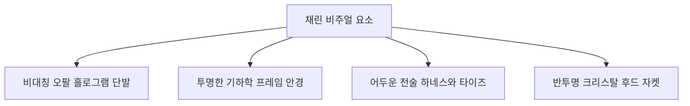
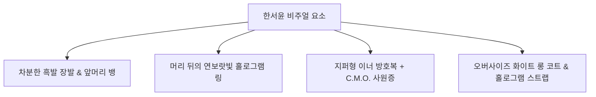

> [!IMPORTANT]

> 이 문서는 AI(Antigravity)가 작성한 초안입니다.

> 기획자/PM의 검토 및 승인 후 이 배너를 제거하면 '확정 사양'으로 인정됩니다.

# 📄 [요약본](./침몽도시_루시드_다이버_컨셉_기획_요약본_v0.5.md) | [프로토타입 초안](./프로토타입_컨셉_기획서_초안.md) | [캐릭터 컨셉](./캐릭터_컨셉_기획서.md) | **[캐릭터 원화 (현재)]** | [기본(특화) 무장](./기본_특화_무장_컨셉_기획서.md) | [방어구 컨셉](./방어구_컨셉_기획서.md) | [몬스터 컨셉](./몬스터_컨셉_기획서.md) | [아이템 컨셉](./아이템_및_오브젝트_컨셉_기획서.md)

---

# 🎨 《침몽도시: 루시드 다이버》 캐릭터 원화 컨셉 가이드라인

## 1. 개요 (Overview)

- **목적**: 아트 디렉터(AD), 원화가 및 3D 그래픽 디자이너를 위해 《침몽도시: 루시드 다이버》 등장 캐릭터들의 비주얼 정체성, 복식 디자인, 키 컬러, 표정 및 대표 포즈를 구체적으로 제안합니다.

- **디자인 지향점**: 침몽도시 특유의 **'몽환적인 밤안개'**, **'아날로그 레트로 노이즈'**, **'사이버네틱한 방호 복식'**이 서브컬처 특유의 스타일리시하고 매력적인 캐릭터 디자인과 융합되어야 합니다.

---

## 2. 공통 복식 및 디자인 규칙 (Design Rules)

1. **루시드 방호 장비 (Lucid Protection Gear)**: 모든 다이버들은 루시드 오염을 막기 위해 기본적으로 밀착형 나노-수트나 기능성 방호 자켓을 착용합니다. 단, 캐릭터의 개성을 살리기 위해 이 위에 일상복(수면바지, 교교 가디건, 의사 가운 등)을 레이어드합니다.

2. **글리치 & 노이즈 연동 (Glitch Effect)**: 캐릭터들의 머리 장식이나 의상 끝자락, 특화 무장은 루시드 입자 공명으로 인해 상시 미세한 보랏빛/주황빛 글리치 라인이나 빛바랜 노이즈 연출이 덧씌워져 있어야 합니다.

3. **헤드셋 및 통신기**: 관제실의 플레이어와 상시 신경 동조 상태임을 나타내는 얇은 **골전도 패치** 또는 귀 뒤의 **신경 링크 커넥터**가 디자인 요소에 반드시 포함되어야 합니다.

---

## 3. 캐릭터별 원화 컨셉 상세 (Character Details)

### 3.1 메인 캐릭터 1 - 채린 (Chae-Rin)

> **"만화경과 프리즘의 기하학적 색채 폭발광"**

*   **비주얼 키워드**: #만화경_프리즘 #기하학적_붕괴 #유리파편 #색수차 #오팔_홀로그램

*   **키 컬러 팔레트**:

    *   **Main**: 프리즘 오팔 (Prism Opal - 무지갯빛 반사광)

    *   **Sub**: 오닉스 블랙 (Onyx Black)

    *   **Accent**: 비비드 마젠타 (Vivid Magenta) & 네온 사이언 (Neon Cyan)

*   **복식 및 디테일**:

    *   **의상**: 어두운 전술 하네스와 타이즈 위에 **'무지갯빛 반사광이 감도는 반투명 크리스탈 후드 자켓'**을 오버사이즈로 착용하여 시크하면서도 미래지향적인 SF 테크웨어를 연출합니다.

    *   **악세서리**: 얼굴에는 오각/육각 크리스탈 만화경 패턴의 렌즈가 들어간 **'투명한 기하학 프레임 안경'**을 착용하고 있습니다.

*   **외모 특징**: 칼로 자른 듯 날카롭게 떨어지는 **'비대칭 오팔 홀로그램 단발 (언밸런스 보브컷)'**. 머리칼 끝부분이 흩어지는 프리즘 파동처럼 다채로운 빛을 뿜습니다. 차갑고 이지적인 인상이지만 폭발 스위치를 쥐면 눈동자에 기하학적 링이 돌며 황홀해합니다.

*   **대표 포즈 및 표정**:

    *   *포즈*: 한 손으로 턱을 괴고 유탄소총에서 뿜어져 나오는 기하학적 빛의 굴절을 응시하며 조용히 미소 짓는 포즈.

    *   *표정*: 나긋나긋하고 몽환적인 표정 / 유탄이 터질 때 빛의 각도를 세며 황홀경에 빠진 환한 광기의 표정.

*   **드림 포지드 (무장)**:

    *   **프리즘 유탄 소총 '만화경' (특화 무장 - 1차 프로토타입 범위 제외)**:

        *   **비특화 권총 장착 시**: 무기의 실시간 외형 변환(Weapon Morphing)이 발동하지 않으며, 형태 변화 없이 권총 본래의 기본 드림포지드 무기 외형을 유지합니다.

        *   **특화 SMG / AR 장착 시**: 총구 하단에 기하학적인 수정 유탄발사기가 돋아나고 총기 바디 전체가 오팔 홀로그램 프리즘 외형으로 실시간 변형되어, 빛을 기하학적으로 굴절시키는 화려한 형태를 띱니다.

---

### 3.2 메인 캐릭터 2 - 한서윤 (Seo-Yoon)

> **"죄책감 속에서 길을 찾는 몽상적 가이드"**

*   **캐릭터 정보 (Character Info)**:

    | 구분 | 상세 설정 |

    | :--- | :--- |

    | **소속** | 청몽 특별 작전국 (C.M.O. / Cheong-Mong Operation Bureau) |

    | **역할** | 교차로 탐색 및 길 안내 / 위상 동기화 지원 |

    | **나이** | 22세 |

    | **신장** | 168cm |

    | **생일** | 11월 7일 |

    | **특이 사항** | 루시드 환각 및 죄책감으로 인한 불안정한 뇌파 보유. 관제사(플레이어)와의 신경 링크 필수. |

*   **비주얼 키워드**: #차분함 #숨겨진_슬픔 #전술_방호 #홀로그램_스트랩

*   **키 컬러 팔레트**:

    *   **Main**: 스노우 화이트 (Snow White) & 네이비 블랙 (Navy Black)

    *   **Sub**: 일렉트릭 블루 (Electric Blue) & 라벤더 바이올렛 (Lavender Violet)

    *   **Accent**: 네온 라이트 바이올렛 (Neon Light Violet)

*   **복식 및 디테일**:

    *   **의상**: 앞을 풀어헤친 오버사이즈의 하얀색 전술 롱 코트를 걸치고 있으며, 코트 소매와 칼라 깃에 푸른색 배색 포인트가 들어있습니다. 이너로는 목까지 지퍼가 달린 어두운 네이비색 밀착형 방호복 상의를 입고 있으며, 하의는 검은색 핫팬츠에 찢어진 느낌의 검은색 타이즈(스타킹)를 매칭했습니다. 신발은 화이트/블랙이 배색된 견고한 전술 부츠입니다.

    *   **사원증 (ID Card)**: 가슴팍에는 **'청몽 특별 작전국(C.M.O.)'**의 사원증(출입증 ID 카드)이 끈에 매달려 있습니다.

    *   **홀로그램 스트랩**: 코트의 등 뒤 하단에는 길고 푸른색의 홀로그램 리본 스트랩 두 가닥이 꼬리처럼 길게 늘어져 바람에 휘날립니다.

*   **외모 특징**: 어깨선을 훌쩍 넘어 등까지 내려오는 차분한 긴 흑발 생머리에, 눈썹을 덮는 뱅 스타일 앞머리를 하고 있습니다. 동공은 맑은 연보랏빛이지만 특유의 몽상적이고 슬픈 정서가 서려 있습니다. 머리 뒤편에는 루시드 동조를 뜻하는 연보랏빛 홀로그램 링(헤일로)과 아날로그 글리치 잔상이 둥실 떠 있습니다.

*   **대표 포즈 및 표정**:

    *   *포즈*: 코트를 휘날리며 왼손으로 귀 뒤의 신경 링크 패치를 누르고, 오른손은 안개 너머의 누군가를 향해 간절하게 내미는 턴어라운드 전면 포즈.

    *   *표정*:

        *   **평상시**: 맑고 투명하지만 살짝 슬픔이 서린 차분한 표정.

        *   **결의**: 입을 굳게 다물고 정면을 예리하게 응시하는 강인한 눈빛.

        *   **불안 / 환각**: 초점이 약간 흐려지며 얼굴 주위에 보랏빛 안개와 글리치 노이즈가 서리는 표정.

        *   **상처 / 슬픔**: 슬픈 기억이나 트라우마를 떠올려 얼굴에 붉은 기와 상처 노이즈가 스쳐 지나가는 표정.

*   **드림 포지드 (무장)**:

    *   **에너지 권총 (Pistol)**: 화이트와 실버 바디에 블루/네이비 배색이 가미된 권총. 슬라이드 윗부분이 파란색 에너지로 발광하며 흰색 별 문양이 새겨져 있습니다.

    *   **돌격 소총 (AR)**: 화이트/블랙/블루가 섞인 미래지향적 돌격 소총. 소총 바디 중앙에 파란색 발광선과 독특한 기하학 문양이 새겨져 있습니다. (1차 프로토타입 범위 제외)

---

### 3.3 메인 캐릭터 3 - 에단 (Ethan)

> **"얼른 자러 가고 싶어 하는 천재 귀차니스트"**

*   **비주얼 키워드**: #수면부족 #귀차니즘 #애착_안대

*   **키 컬러 팔레트**:

    *   **Main**: 소프트 라벤더 핑크 (Soft Lavender Pink)

    *   **Sub**: 슬레이트 그레이 (Slate Grey)

    *   **Accent**: 달콤한 파스텔 블루 (Pastel Blue)

*   **복식 및 디테일**:

    *   **의상**: 정장 스타일의 방호 자켓 하의 위에 뜬금없는 **폭신폭신한 수면 바지(체크무늬)**를 입고 있습니다. 발에는 방호 슈즈 대신 뭉툭한 슬리퍼나 털 장식이 있는 수면 양말을 신습니다.

    *   **악세서리**: 목에는 푹신한 U자형 목베개를 걸치고 있고, 이마 위에는 귀여운 날개 모양의 애착 수면 안대가 얹혀 있습니다.

*   **외모 특징**: 정리되지 않아 이리저리 뻗친 밝은 회색(Ash Grey) 머리칼. 늘 한쪽 눈은 반쯤 감겨 있고 눈 밑에는 짙은 다크서클이 내려앉아 있습니다.

*   **대표 포즈 및 표정**:

    *   *포즈*: 무거운 해머(심상무장)에 턱을 괴고 기대어 서서 큰 하품을 하거나, 다른 손으로 목덜미를 긁적이는 나른한 포즈.

    *   *표정*: 만사가 귀찮은 듯 찌푸린 표정 / 자게 해달라는 억울한 눈빛.

*   **드림 포지드 (무장)**:

    *   **초대형 수면 해머** (1차 프로토타입 범위 제외): 거대한 알약이나 베개 실루엣을 한 둔탁하고 뭉툭한 형태의 메탈 해머. 타격 시 폭신한 구름 모양 파동이 일어납니다.

---

### 3.4 메인 캐릭터 4 - 레이라 (Layla)

> **"어둠이 무서운 중2병 허세 저격수"**

*   **비주얼 키워드**: #중2병 #허세 #샴페인_금발 #매트_블랙 #눈물점

*   **키 컬러 팔레트**:

    *   **Main**: 로얄 샴페인 골드 (Royal Champagne Gold - 헤어)

    *   **Sub**: 피치 블랙 (Pitch Black) & 매트 다크 그레이 (Matte Dark Grey)

    *   **Accent**: 크림슨 레드 (Crimson Red - 조준선 및 안구 발광) & 황혼의 엠버 골드 (Amber Gold)

*   **복식 및 디테일**:

    *   **의상**: 어둠의 심판자를 자처하는 매트 블랙 가죽 롱코트를 걸치고 있습니다. 롱코트 칼라 깃과 소매 자락에는 본인이 직접 새겨 넣은 (자칭 '황금빛 룬 문자'인) **골드 스티치 자수**가 현란하게 빛납니다.

    *   **악세서리**: 손등과 목덜미에 쓸데없이 감아둔 붕대들이 헐거워져 꼬리처럼 흔들립니다. 얼굴에는 붉은빛 조준 HUD가 깜빡이는 다크 가상 고글을 비스듬히 걸치고 있습니다.

*   **외모 특징**: 허리까지 내려오는 **풍성하고 화려한 샴페인 골드(Champagne Gold) 웨이브 헤어**. 도도해 보이는 눈 밑에 눈물점이 박혀 있어화사한 귀족적 인상을 줍니다. 평소에는 앞머리로 한쪽 눈을 가리는 등 무게를 잡지만, 겁을 먹거나 당황하면 머리가 헝클어지며 눈동자가 둥그렇게 커지고 붉게 빛납니다.

*   **대표 포즈 및 표정**:

    *   *포즈*: 한 손으로 얼굴 절반을 가린 채 손가락 사이로 거만하게 적을 내려다보는 포즈를 취하지만, 무릎은 살짝 안쪽으로 굽혀진 채 바들바들 떨고 있어 허세가 드러나는 포즈.

    *   *표정*: 우아한 귀족풍의 거만한 썩소 / 무서운 침식체와 대면했을 때 눈물이 그렁그렁 맺힌 채 비명을 지르기 직전의 갭 모에 표정.

*   **드림 포지드 (무장)**:

    *   **드림시커 (Dream-Seeker)** (1차 프로토타입 범위 제외): 칠흑같이 어두운 프레임에 어울리지 않게 본인의 취향이 반영된 **황금빛 도금 프레임 라인**이 휘감겨 있는 대형 대물 저격 소총. 조준경은 크림슨 레드로 밝게 타오릅니다. 사격 시 골드 스파크와 적색 광선이 뿜어져 나옵니다.

---

### 3.5 지원 캐릭터 A - 헬레나 (Helena)

> **"부드러운 미소의 해부 매니아 (맑눈광)"**

*   **비주얼 키워드**: #맑눈광 #의사_가운 #메디컬_전술 #차분한_광기

*   **키 컬러 팔레트**:

    *   **Main**: 메디컬 화이트 (Medical White)

    *   **Sub**: 민트 그린 (Mint Green)

    *   **Accent**: 스틸 블루 (Steel Blue)

*   **복식 및 디테일**:

    *   **의상**: 단정한 흰색 연구원 가운 겸 코트를 착용하고 있으며, 팔꿈치 위까지 올라오는 라텍스 재질의 민트빛 전술 장갑을 끼고 있습니다.

    *   **악세서리**: 허리 벨트에는 각종 알약 앰플과 해부용 주사기, 드림 메스가 담긴 은색 툴킷 케이스들이 차갑게 정돈되어 있습니다.

*   **외모 특징**: 곱게 땋아 내린 브라운 컬러의 양 갈래 머리. 늘 생긋생긋 웃고 있어 눈동자가 휘어지지만, 그 속에는 생기가 느껴지지 않는 무표정한 미소입니다.

*   **대표 포즈 및 표정**:

    *   *포즈*: 의사 가운 주머니에 한 손을 넣은 채, 다른 손으로는 예리하게 빛나는 주사기나 메스를 들어 올려 단면을 유심히 관찰하는 포즈.

    *   *표정*: 한없이 상냥하고 부드러운 천사 같은 미소 (그러나 눈은 전혀 웃고 있지 않음).

*   **드림 포지드 (무장)**:

    *   **드림 메스 (Dream-Scalpel)**: 차갑게 발광하는 민트색 에너지 레이저 블레이드가 장착된 특수 수술용 메스이자 전용 투사체 발사 권총입니다.

---

### 3.6 지원 캐릭터 B - 하선 (Ha-Seon)

> **"과로에 찌든 전술 관제 출신 디펜더"**

*   **비주얼 키워드**: #진녹색_아머 #녹색_브릿지 #다크서클 #츤데레_멘토 #전술_방패 #오퍼레이터_출신

*   **키 컬러 팔레트**:

    *   **Main**: 딥 포레스트 그린 (Deep Forest Green - 묵직한 진녹색) & 카본 블랙 (Carbon Black)

    *   **Sub**: 택티컬 올리브 (Tactical Olive) & 다크 실버 (Dark Silver)

    *   **Accent**: 네온 라임 그린 (Neon Lime Green - 가젯 가동 및 전술 인디케이터)

*   **복식 및 디테일**:

    *   **의상**: 어두운 진녹색(딥 포레스트 그린) 군복 베이스에 카본 블랙 컬러의 묵직하고 실용적인 고강도 전술 플레이트 아머를 착용했습니다. 어깨와 흉부의 견고한 중갑 플레이트 또한 진녹색 페인팅이 실전 속에서 빈티지하게 벗겨진 디자인이 특징입니다.

    *   **악세서리**: 귀에는 아직 버리지 못한 헤드셋 한쪽이 헐겁게 매달려 있으며, 가슴팍에는 깨진 액정의 전술 PDA가 아날로그 와이어로 연결되어 있습니다.

*   **외모 특징**: 거칠게 뒤로 쓸어넘긴 검은 머리칼에 군데군데 **진녹색(Forest Green) 브릿지**가 들어가 있습니다. 과로와 스트레스로 인해 눈가가 매우 그늘져 있고 다크서클이 짙습니다.

*   **대표 포즈 및 표정**:

    *   *포즈*: 거대한 방패(현실의 닻 가젯)를 땅에 콱 박아 고정하고 그 위에 한쪽 팔을 올린 채 귀찮은 듯 턱을 괴고 서 있는 포즈.

    *   *표정*: 한심하다는 듯 혀를 차거나 깊은 한숨을 내쉬는 굳은 표정.

*   **드림 포지드 (무장)**:

    *   **현실의 닻 (Reality Anchor)**: 물리적인 닻과 하이테크 바리케이드 실드가 기묘하게 결합된 거대한 은색 방패 겸 투척 장치. 가동 시 주위에 촘촘한 벌집 모양의 현실 고정 그리드 배리어가 일어납니다.

---

## 📜 Revision History

| 날짜 | 버전 | 내용 | 작성자 |

| :---: | :---: | :--- | :--- |

| 2026-06-16 | v1.0 | - 캐릭터 원화 디자인 지향점 및 복식 규칙 수립 - 메인 캐릭터 3종 및 지원 캐릭터 3종 비주얼 원화 가이드라인 신설 | 송예찬 |

| 2026-06-16 | v1.1 | - 사용자 피드백 반영: 한서윤 메인 캐릭터 1 원화(image.png) 디테일 분석 및 세부 비주얼 기획서 동기화 | 송예찬 |

| 2026-06-16 | v1.2 | - 사용자 피드백 반영: 지원 캐릭터 B '채린' 징크스풍 아티스트에서 만화경 기하학 폭발광으로 컨셉 리뉴얼 | 송예찬 |

| 2026-06-16 | v1.3 | - 사용자 피드백 반영: 지원 캐릭터 C '하선' 키 컬러 딥 포레스트 그린(진녹색) 강조 및 아머 디테일 보완 | 송예찬 |

| 2026-06-16 | v1.4 | - 사용자 피드백 반영: 지원 캐릭터 C '하선' 외모 특징에 녹색 브릿지 설정 추가 | 송예찬 |

| 2026-06-17 | v1.5 | - 사용자 피드백 반영: 지원 캐릭터 B '채린'의 전용 무장을 로켓 런처에서 '프리즘 유탄 소총'으로 리뉴얼함에 따라 원화 비주얼 가이드 가사 갱신 - 사용자 피드백 반영: 프롤로그 주역 채린을 메인 캐릭터 1로 승격함에 따라 원화 컨셉 명세 및 순번 리오더링 - 사용자 피드백 반영: 특화 무장 기획서 명칭 변경 및 채린 권총/특화무장(SMG/AR) 장착 시의 형태 이원화 원화 가이드 명시 | 송예찬 |

| 2026-06-17 | v1.6 | - 사용자 피드백 반영: 채린 캐릭터 원화 이미지 최신화 (Chaerin_ConceptArt_Renewal.png 반영) | 송예찬 |
