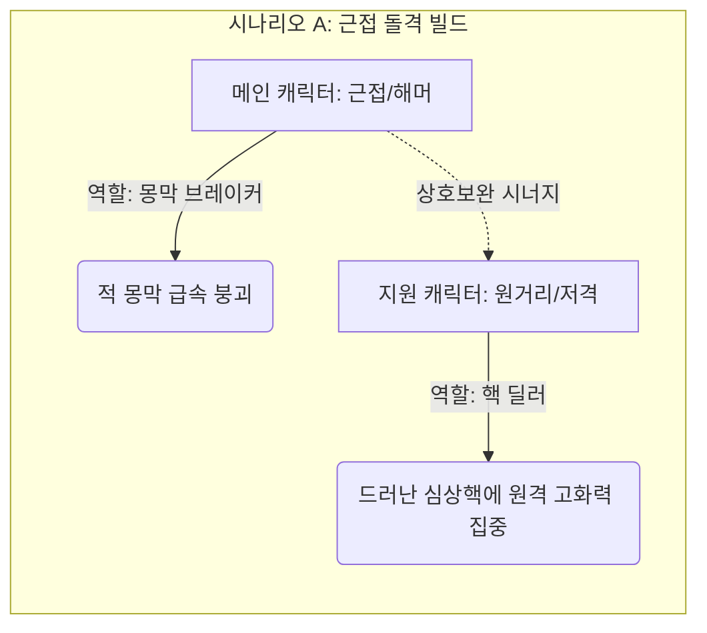
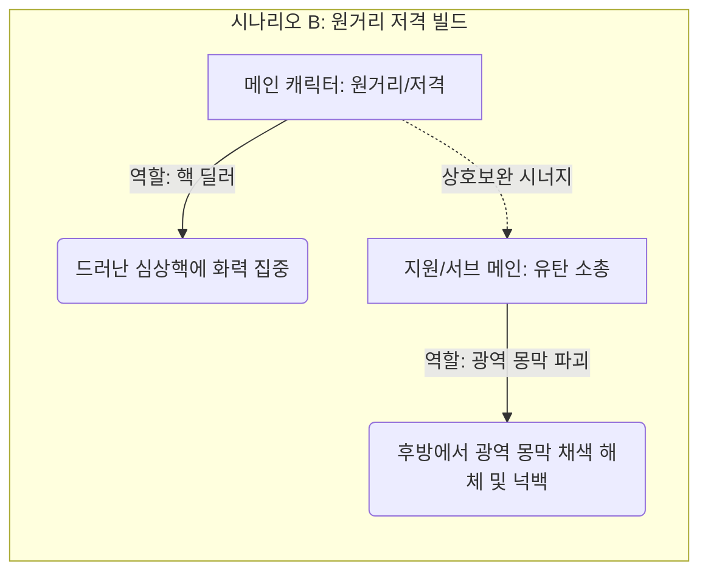

> [!IMPORTANT]

> 이 문서는 AI(Antigravity)가 작성한 초안입니다.

> 기획자/PM의 검토 및 승인 후 이 배너를 제거하면 '확정 사양'으로 인정됩니다.

# 📄 [요약본](./침몽도시_루시드_다이버_컨셉_기획_요약본_v0.5.md) | [프로토타입 초안](./프로토타입_컨셉_기획서_초안.md) | **[캐릭터 컨셉 (현재)]** | [기본(특화) 무장](./기본_특화_무장_컨셉_기획서.md) | [방어구 컨셉](./방어구_컨셉_기획서.md) | [몬스터 컨셉](./몬스터_컨셉_기획서.md) | [아이템 컨셉](./아이템_및_오브젝트_컨셉_기획서.md)

---

# 👤 《침몽도시: 루시드 다이버》 캐릭터 컨셉 기획서

## 1. 개요 (Overview)

- **목적**: 꿈속 세계에 진입하여 침식체에 맞서고 심상기물을 회수하는 주체인 플레이어블 캐릭터(메인/지원)들의 개성과 역할을 정의합니다.

- **프로토타입 대상**: `Player_Test` (루시드 다이버 테스트 캐릭터 1종)

- **최종 MVP 대상**: 메인 캐릭터 2명, 지원 캐릭터 3명

---

## 2. 역할군 및 전투 포지션 (Roles)

멀티플레이 협동과 솔로 탐사 시 효율적인 대응을 위해 루시드 다이버들은 각자의 역할이 명확히 구분됩니다.

| 역할군 | 설명 | 특화 무기 풀 | MVP 예시 포지션 |

| :--- | :--- | :--- | :--- |

| **컨트롤러 (Controller)** | 침식체의 진형을 무너뜨리거나 행동 불능(스턴, 이속 감소)을 유도하는 역할 | 유탄 소총(※ 1차 프로토타입 제외), 돌격 소총(※ 1차 프로토타입 제외) | 메인 캐릭터 1 (채린) |

| **브레이커 (Breaker)** | 침식체의 단단한 몽막을 빠르게 붕괴시키는 역할 | 해머(※ 1차 프로토타입 제외), 샷건(※ 1차 프로토타입 제외) | 메인 캐릭터 3 (에단) |

| **딜러 (Striker)** | 몽막이 붕괴되어 드러난 심상핵을 직접 공격해 치명적인 타격을 주는 역할 | 저격 소총(※ 1차 프로토타입 제외), 지정사수 소총(※ 1차 프로토타입 제외) | 메인 캐릭터 4 (레이라) |

| **서포터 (Supporter)** | 아군의 체력을 회복하거나 디버프를 해제하며 안전한 이동을 지원하는 역할 | 지정사수 소총(※ 1차 프로토타입 제외), 에너지 권총 | 지원 캐릭터 A (헬레나) |

| **디펜더 (Defender)** | 방막을 형성하고 거점을 방어하며 아군의 안정성 회복 및 위기 생존을 지원하는 역할 | 방패 권총(※ 1차 프로토타입 제외), 샷건(※ 1차 프로토타입 제외) | 지원 캐릭터 B (하선) |

### 2.1 캐릭터 편성 및 시너지 조합 구조 (Synergy & Deck Building)

본 게임은 메인 캐릭터(직접 조작) 1명과 지원 캐릭터(액티브 스킬 호출)들을 편성하여 진입합니다. 메인 캐릭터의 무장 및 전투 스타일에 따라 지원 캐릭터의 역할을 상호보완적으로 매칭하는 것이 핵심 전략입니다.

- **상호보완 규칙**:

  - **근접/충격 특화 메인**은 몽막을 잘 깨지만 심상핵 노출 시 안전거리를 확보하며 누킹(집중 딜링)을 하기 어렵습니다. 따라서 **원거리 저격 및 화력 보조형 지원 캐릭터**를 동반하여 몽막 붕괴 즉시 화력을 쏟아부어야 합니다.

  - **원거리/저격 특화 메인**은 몽막이 쳐진 상태의 적을 밀어내거나 몽막을 효율적으로 깨기 어렵고 적의 돌격에 취약합니다. 따라서 **광역으로 적의 몽막을 붕괴시키며 적들을 밀어내어(넉백) 안전거리를 벌려주는 유탄 소총/제어형 다이버**가 필수적입니다.

### 2.2 캐릭터 특화 무기 풀 시스템 (Link)

다이버들의 각 특화 무기군 장착 시 발동하는 시너지 규칙 및 사망/강제 각성 시 발생하는 무장 유실/보존(각성 보존 슬롯) 규칙은 **[무장 체계 및 캐릭터 특화 풀 컨셉 기획서](./기본_특화_무장_컨셉_기획서.md)**와 연계하여 확인하십시오.

---

## 3. 캐릭터 명세 (Characters)

### 3.1 [프로토타입] 루시드 다이버 테스트 (Player_Test)

- **비주얼 컨셉**: 기본 방호복 스타일의 수트를 입은 신입 다이버.

- **조작 스펙**:

  - 이동: 가상 조이스틱을 통한 8방향 2.5D 평면 이동.

  - 기본 공격: 지정 방향으로 에너지 권총 **'희미한 잔상 (REM Tracker)'** 탄환 발사.

- **스펙(임시)**:

  - 체력(Hp): 100

  - 이동속도: 보통

  - 공격 데미지: 10

### 3.2 [MVP 확장] 메인 캐릭터 후보군

1. **메인 캐릭터 1 - 채린 (Chae-Rin)**:

   - **타입**: 컨트롤러 (Controller)

   - **특화 무기 풀**: **유탄 소총 (Grenade Rifle - ※ 1차 프로토타입 범위 제외) / 돌격 소총 (AR - ※ 1차 프로토타입 범위 제외) / 기관단총 (SMG - ※ 1차 프로토타입 범위 제외)**

   - **성격/컨셉**: **"만화경 속으로 세상을 쪼개는 기하학적 색채 폭발광"**

     - 감정과 꿈의 파장을 기하학적 색채와 프리즘 패턴으로 인식하는 이능을 가졌으며, 돌격 소총에 장착된 언더배럴 유탄발사기로 온 세상을 눈부신 무지갯빛 유리 파편 만화경으로 쪼개어 날려버리는 계산적이고 강박적인 아트 폭발광입니다.

   - **인게임 스킬**:

     - **패시브 스킬**: **에임 조준 보정 (Aim Calibration)**

       - 관제실과의 신경 링크를 통해 총기 탄도가 적의 약점(심상핵) 방향으로 자동 정렬 및 보정되는 효과.

     - **액티브 스킬**: **프리즘 유탄 격발 (Prism Grenade)**

       - 20 마나를 소모하여 특화 무기 하단의 유탄발사기를 트리거, 광역 프리즘 파편 폭발 및 적 넉백 유도.

    - **대사 목록**:

      - *로비/대기*: "지저분하게 흩어진 감정들, 전부 조각내버리면 속 편하겠지? 자, 내 만화경을 들여다볼 준비는 됐어?"

      - *세션 진입*: "진입 완료. 안개가 마음에 안 드네. 전부 쓸어버리고 가자."

      - *탈출 성공*: "깔끔하게 정리됐네. 이 파편들, 예쁘지 않아?"

      - *세션 실패*: "눈앞이… 흐려져. 더는 무리야… 아아, 모든 색이 검게 타버리잖아…!"

2. **메인 캐릭터 2 - 한서윤 (Seo-Yoon)**:

   - **타입**: 올라운더 스트라이커 (Striker / 밸런스형 딜러)

   - **특화 무기 풀**: **에너지 권총 (Pistol) / 돌격 소총 (AR - ※ 1차 프로토타입 범위 제외)**

   - **성격/컨셉**: **"죄책감 속에서 길을 찾는 몽상적 가이드"**

     - 평소에는 단단하고 책임감 있는 모범 대원이지만, 과거 청몽 교차로 사고의 죄책감과 루시드 환각으로 내면은 위태롭게 흔들리고 있습니다. 오직 관제사인 플레이어와의 신경 링크를 통해서만 뇌파가 안정되어 평온함을 찾기에 플레이어에게 깊이 의지합니다.

   - **대사 목록**:

     - *로비/대기*: "링크 동조율 안정적. …이상하게 들릴지 모르겠지만, 당신 목소리가 무전 너머로 들릴 때만 머릿속의 안개가 걷히는 기분이 들어요."

     - *세션 진입*: "청몽 교차로 진입 완료. 걱정 마세요. 이번에는… 절대로 당신의 길을 잃게 두지 않을 테니까."

     - *탈출 성공*: "하아… 무사히 각성했군요. 다행이에요. 당신 손을… 다시 놓치지 않아서."

     - *세션 실패*: "(지직거리는 글리치 노이즈) 안 돼… 또 안개 속으로 사라지지 마…! 제발 내 손을 잡아줘…!"

3. **메인 캐릭터 3 - 에단 (Ethan)**:

   - **타입**: 근접 돌격 브레이커 (Breaker)

   - **특화 무기 풀**: **해머 (Hammer - ※ 1차 프로토타입 범위 제외) / 샷건 (Shotgun - ※ 1차 프로토타입 범위 제외)**

   - **성격/컨셉**: **"얼른 자러 가고 싶어 하는 천재 귀차니스트"**

     - 평소에는 잠에 찌들어 있어 방호복 위에 수면 바지를 입거나 귀여운 애착 안대를 쓰고 베개를 안고 다닙니다. 꿈속 장벽을 부수는 유일한 동기는 "귀찮은 적을 빨리 치우고 다시 자러 가는 것"입니다.

   - **대사 목록**:

     - *로비/대기*: "하아... 피곤해라... 나 한숨만 잘 테니까 회의 시작하면 베개 찔러줘..."

     - *세션 진입*: "어서 끝내고 자러 갑시다. 이불이 날 기다린다고."

     - *탈출 성공*: "드디어 끝났네. 깨우지 마라, 다들 안녕..."

     - *세션 실패*: "하아... 기분 잡쳤어... 억지로 깨우는 모닝콜 같은 기분이네..."

4. **메인 캐릭터 4 - 레이라 (Layla)**:

   - **타입**: 원거리 치명타 스트라이커 (Striker)

   - **특화 무기 풀**: **저격 소총 (SR - ※ 1차 프로토타입 범위 제외) / 지정사수 소총 (MR - ※ 1차 프로토타입 범위 제외)**

   - **성격/컨셉**: **"어둠이 무서운 중2병 허세 저격수"**

     - 화려하게 반짝이는 샴페인 골드 헤어와 칠흑 같은 가죽 롱코트를 대비시키며 냉혹하게 핵을 꿰뚫는 '심연의 심판자'인 척 거창하게 폼을 잡지만, 실상은 기괴한 꿈속 환경을 극도로 무서워해 뒤에서 징징대는 겁쟁이입니다. (MVP 스코프 최적화를 위해 타 다이버 지칭 배제)

   - **대사 목록**:

     - *로비/대기*: "어둠을 헤매는 가련한 영혼들이여... 내 드림시커가 너희의 기만을 정화하리라..."

     - *세션 진입*: "내 저격 범위 안에 들어온 것을 후회하게 해 주지. 흐흐..."

     - *탈출 성공*: "흥, 나의 완벽한 저격 앞에 침식은 무력할 뿐. (안도의 한숨을 몰래 쉬며)"

     - *세션 실패*: "내, 내 어둠의 힘이 잠시 억눌렸을 뿐이야...! 절대 무서워서 놓친 게 아니라고!"

### 3.3 [MVP 확장] 지원 캐릭터

1. **지원 캐릭터 A - 헬레나 (Helena) (정밀 사격 및 아군 보조)**:

   - **타입**: 서포터 (Supporter)

   - **특화 무기 풀**: **지정사수 소총 (MR - ※ 1차 프로토타입 범위 제외) / 에너지 권총 (Pistol)**

   - **성격/컨셉**: **"부드러운 미소의 해부 매니아 (차분하지만 잔잔하게 맛이 간 맑눈광)"**

     - 존댓말 캐릭터로 생긋생긋 웃으며 늘 상냥한 태도를 보이지만, 적의 '심상핵' 단면을 깔끔하게 자르고 해부하고 싶어 하는 섬뜩하고 잔잔한 광기를 띠고 있습니다.

   - **대사 목록**:

     - *로비/대기*: "어머, 침식체의 체액은 꿈의 구성 성분에 따라 아주 다채로운 색을 띠는군요... 정말 흥미로워요."

     - *세션 진입*: "오늘 실험 대상들은 어떤 구조를 하고 있을까요? 궁금하네요."

     - *탈출 성공*: "성공적인 연구 세션이었습니다. 수집한 샘플은 깨끗하게 분해해서 보관할게요."

     - *세션 실패*: "아쉬워라... 기형적인 핵 표본을 획득할 기회였는데 말이에요, 후훗."

2. **지원 캐릭터 B - 하선 (Ha-Seon) (디펜더형 아군 보호 및 거점 사수)**:

   - **타입**: 디펜더 (Defender)

   - **특화 무기 풀**: **샷건 (Shotgun - ※ 1차 프로토타입 범위 제외) / 방패 권총 (Shield Pistol - ※ 1차 프로토타입 범위 제외)**

   - **액티브 스킬**: **현실의 닻 (Reality Anchor)**

     - 전방 지정 지점에 물리 앵커 디바이스를 투척하여 강력한 현실 고정 구역을 전개합니다.

     - **스킬 상세 효과**: 

       - **아군 지원**: 투척 장치가 설치된 원형 영역 내부의 아군은 안정도(Hp)가 지속해서 회복되고 슈퍼아머 상태(넉백 및 둔화 면역)를 얻습니다.

       - **적군 제어**: 영역 내로 진입하는 적 침식체는 80% 이동 속도 감소(감속) 디버프를 받습니다.

   - **성격/컨셉**: **"과로에 찌든 전술 관제 출신 디펜더 (츤데레 멘토)"**

     - 무뚝뚝하고 냉정하게 대하지만, 현장에서 동료들이 위기에 처하면 무거운 방패 권총과 전술 장비를 챙겨 선두에 서며, 현실의 닻 장치를 가동하여 아군을 수호합니다.

   - **대사 목록 (현장 서포트형)**:

     - *로비/대기*: "(한숨을 쉬며 방패를 점검하고) ...지원 캐릭터 B 하선이다. 내 전술 구역에 들어왔으면 다들 장난치지 말고 무장 점검 확실히 하도록."

     - *세션 진입*: "현실의 닻(Reality Anchor) 가동 준비 완료. ...바보같이 죽지나 마라. 엄호는 확실히 해 줄 테니까."

     - *탈출 성공*: "탈출 확인. 다행히 내 방패 뒤에서 얌전히 버텼군. 검사실로 이동해라."

     - *세션 실패*: "(다급하게 전방에 방패를 세우며) 뒤로 물러나! 현실의 닻 투척! 앵커 버텨라, 어떻게든 살려서 나간다!"

---

## 📜 Revision History

| 날짜 | 버전 | 내용 | 작성자 |

| :---: | :---: | :--- | :--- |

| 2026-06-14 | v0.1 | - 최초 캐릭터 컨셉 기획서 템플릿 생성 | 송예찬 |

| 2026-06-14 | v0.2 | - 메인-지원 캐릭터 간의 상호보완 덱 빌딩 규칙 및 상세 예시 추가 | 송예찬 |

| 2026-06-14 | v0.3 | - 한글 및 한자어를 활용한 감성 작명(희미한 잔상, 몽경의 투영, 몽마의 종식, 보랏빛 떨림)에 맞춰 캐릭터 무장 정보 동기화 | 송예찬 |

| 2026-06-14 | v0.4 | - 사용자 피드백 반영: 저격 무장 명칭을 '드림시커 (Dream-Seeker)'로 롤백 적용 | 송예찬 |

| 2026-06-14 | v0.5 | - 무장 기획서 독립 복원에 따라 상세 명세를 이관하고 기본(전용) 무장 기획서 상호 연결 링크 적용 | 송예찬 |

| 2026-06-14 | v0.6 | - 사용자 피드백 반영: 지원 캐릭터 B '카이(남)'를 '채린(여, 꿈의 색채 인지 및 런처 사용)'으로 컨셉 변경 | 송예찬 |

| 2026-06-14 | v0.7 | - 사용자 피드백 반영: 채린의 징크스풍 아티스트 광기 대사 명세 리스트 추가 | 송예찬 |

| 2026-06-14 | v0.8 | - 사용자 피드백 반영: 메인 캐릭터(에단, 레이라) 및 지원 캐릭터(헬레나)의 서브컬처적 개성 성격과 보이스 대사 리스트 대규모 갱신 (에단: 귀차니즘, 레이라: 허세 겁쟁이, 헬레나: 맑은 눈의 광기 해부매니아) | 송예찬 |

| 2026-06-14 | v0.9 | - 사용자 피드백 반영: 오퍼레이터 하선 상세 스펙 및 전용 가젯 '현실의 닻' 추가, MVP 개발 스코프 최적화를 위해 타 캐릭터를 지칭하는 모든 상호작용 대사를 범용 무전 통신형으로 정제 | 송예찬 |

| 2026-06-14 | v1.0 | - 사용자 피드백 반영: 타 캐릭터 호출 및 전투 연출 상호작용 관련 모든 액티브 대사를 스코프에서 제외하고 단독 독백/이벤트형 대사(로비, 진입, 성공, 실패) 4종으로 일관화 | 송예찬 |

| 2026-06-14 | v1.1 | - 사용자 피드백 반영: 전용 무장 가챠 BM 도입에 맞춰 헬레나의 전용 무장을 '드림 메스'로 구체화하여 캐릭터 명세 동기화 | 송예찬 |

| 2026-06-15 | v1.2 | - 무기 제작 시스템 전환 및 사망/강제 각성 시 유실 규칙에 맞게 무장 시스템 연결 문구 수정 | 송예찬 |

| 2026-06-15 | v1.3 | - 에단의 특화 무기인 해머(근접 무기) 1차 프로토타입 범위 제외 표기 추가 | 송예찬 |

| 2026-06-15 | v1.4 | - 1차 프로토타입 무기 스코프 단일화 반영: 권총 외 다른 특화 무기군 1차 프로토타입 제외 표기 추가 및 작성자 정보 교체 | 송예찬 |

| 2026-06-15 | v1.5 | - 신규 방어구 체계 컨셉 기획서 신설 연동 및 상단 탭 확장 | 송예찬 |

| 2026-06-16 | v1.6 | - 사용자 피드백 반영: 메인 캐릭터 1 '한서윤' 컨셉 기획(시안 A) 정식 추가 및 메인 번호 순번 재조정 | 송예찬 |

| 2026-06-16 | v1.7 | - 사용자 피드백 반영: 메인 캐릭터 3 '레이라' 키 컬러 및 헤어 속성 변경 (샴페인 금발 및 골드 스티치) | 송예찬 |

| 2026-06-16 | v1.8 | - 사용자 피드백 반영: 지원 캐릭터 B '채린' 징크스풍 아티스트에서 만화경 기하학 폭발광으로 컨셉 리뉴얼 및 보이스 목록 개편 | 송예찬 |

| 2026-06-17 | v1.9 | - 사용자 피드백 반영: 채린 특화 무기군 변경 (로켓 런처 ➡️ 유탄 소총/돌격 소총/SMG) - 사용자 피드백 반영: 프롤로그 주역인 채린을 메인 캐릭터 1로 승격하고 한서윤, 에단, 레이라 등의 순번 재조정 및 지원 캐릭터 하선을 B로 이동 - 사용자 피드백 반영: 특화 무장 기획서 명칭 변경 및 채린 특화 무기 풀에 SMG 추가 반영 | 송예찬 |

| 2026-06-17 | v1.10 | - 사용자 피드백 반영: 채린 대사 톤앤매너 수정(존댓말 ➡️ 반말) 및 일치화 | 송예찬 |

| 2026-06-17 | v1.11 | - 사용자 피드백 반영: 채린 스킬 명세(패시브: 에임 조준 보정, 액티브: 프리즘 유탄 격발) 명시 및 정합성 보완 | 송예찬 |

| 2026-06-17 | v1.12 | - 사용자 피드백 반영: 채린 대사 간결화(플레이어 가독성 및 직관성 개선) | 송예찬 |
