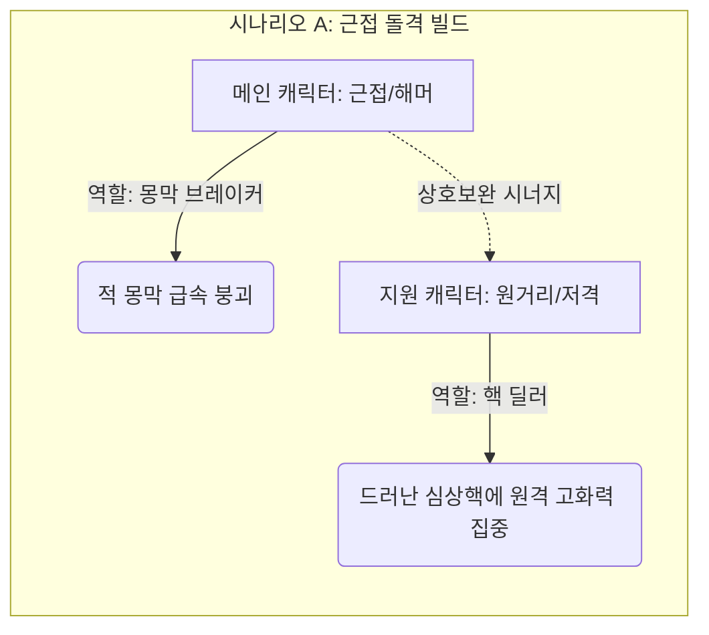
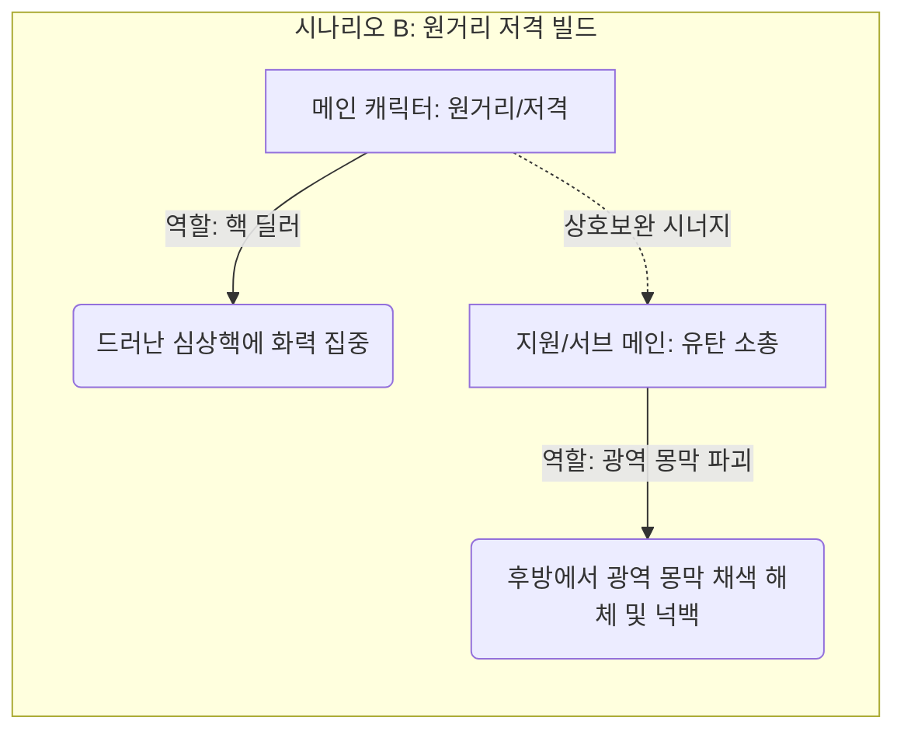

> [!IMPORTANT]
> 이 문서는 AI(Antigravity)가 검수 후의 상세 기획 사양들을 기반으로 작성한 통합 컨셉 기획서 최종본입니다.
> 기획자/PM의 최종 확인 및 승인 후 이 배너를 제거하면 '확정 사양'으로 인정됩니다.

# 🎨 침몽도시: 루시드 다이버 - 통합 컨셉 기획서 (상세본)

## 1. 다이버 컨셉 및 인게임 능력 연계 (검수후 최신 상세본)

> 이 문서는 AI(Antigravity)가 작성한 초안입니다.

> 기획자/PM의 검토 및 승인 후 이 배너를 제거하면 '확정 사양'으로 인정됩니다.

# 📄 [요약본](./침몽도시_루시드_다이버_컨셉_기획_요약본_v0.5.md) | [프로토타입 초안](./프로토타입_컨셉_기획서_초안.md) | **[캐릭터 컨셉 (현재)]** | [기본(특화) 무장](./기본_특화_무장_컨셉_기획서.md) | [방어구 컨셉](./방어구_컨셉_기획서.md) | [몬스터 컨셉](./몬스터_컨셉_기획서.md) | [아이템 컨셉](./아이템_및_오브젝트_컨셉_기획서.md)

---

# 👤 《침몽도시: 루시드 다이버》 캐릭터 컨셉 기획서

## 1. 개요 (Overview)

- **목적**: 꿈속 세계에 진입하여 침식체에 맞서고 심상기물을 회수하는 주체인 플레이어블 캐릭터(메인/지원)들의 개성과 역할을 정의합니다.

- **프로토타입 대상**: `Player_Test` (루시드 다이버 테스트 캐릭터 1종)

- **최종 MVP 대상**: 메인 캐릭터 2명, 지원 캐릭터 3명

---

## 2. 역할군 및 전투 포지션 (Roles)

멀티플레이 협동과 솔로 탐사 시 효율적인 대응을 위해 루시드 다이버들은 각자의 역할이 명확히 구분됩니다.

| 역할군 | 설명 | 특화 무기 풀 | MVP 예시 포지션 |

| :--- | :--- | :--- | :--- |

| **컨트롤러 (Controller)** | 침식체의 진형을 무너뜨리거나 행동 불능(스턴, 이속 감소)을 유도하는 역할 | 유탄 소총(※ 1차 프로토타입 제외), 돌격 소총(※ 1차 프로토타입 제외) | 메인 캐릭터 1 (채린) |

| **브레이커 (Breaker)** | 침식체의 단단한 몽막을 빠르게 붕괴시키는 역할 | 해머(※ 1차 프로토타입 제외), 샷건(※ 1차 프로토타입 제외) | 메인 캐릭터 3 (에단) |

| **딜러 (Striker)** | 몽막이 붕괴되어 드러난 심상핵을 직접 공격해 치명적인 타격을 주는 역할 | 저격 소총(※ 1차 프로토타입 제외), 지정사수 소총(※ 1차 프로토타입 제외) | 메인 캐릭터 4 (레이라) |

| **서포터 (Supporter)** | 아군의 체력을 회복하거나 디버프를 해제하며 안전한 이동을 지원하는 역할 | 지정사수 소총(※ 1차 프로토타입 제외), 에너지 권총 | 지원 캐릭터 A (헬레나) |

| **디펜더 (Defender)** | 방막을 형성하고 거점을 방어하며 아군의 안정성 회복 및 위기 생존을 지원하는 역할 | 방패 권총(※ 1차 프로토타입 제외), 샷건(※ 1차 프로토타입 제외) | 지원 캐릭터 B (하선) |

### 2.1 캐릭터 편성 및 시너지 조합 구조 (Synergy & Deck Building)

본 게임은 메인 캐릭터(직접 조작) 1명과 지원 캐릭터(액티브 스킬 호출)들을 편성하여 진입합니다. 메인 캐릭터의 무장 및 전투 스타일에 따라 지원 캐릭터의 역할을 상호보완적으로 매칭하는 것이 핵심 전략입니다.





- **상호보완 규칙**:

  - **근접/충격 특화 메인**은 몽막을 잘 깨지만 심상핵 노출 시 안전거리를 확보하며 누킹(집중 딜링)을 하기 어렵습니다. 따라서 **원거리 저격 및 화력 보조형 지원 캐릭터**를 동반하여 몽막 붕괴 즉시 화력을 쏟아부어야 합니다.

  - **원거리/저격 특화 메인**은 몽막이 쳐진 상태의 적을 밀어내거나 몽막을 효율적으로 깨기 어렵고 적의 돌격에 취약합니다. 따라서 **광역으로 적의 몽막을 붕괴시키며 적들을 밀어내어(넉백) 안전거리를 벌려주는 유탄 소총/제어형 다이버**가 필수적입니다.

### 2.2 캐릭터 특화 무기 풀 시스템 (Link)

다이버들의 각 특화 무기군 장착 시 발동하는 시너지 규칙 및 사망/강제 각성 시 발생하는 무장 유실/보존(각성 보존 슬롯) 규칙은 **[무장 체계 및 캐릭터 특화 풀 컨셉 기획서](./기본_특화_무장_컨셉_기획서.md)**와 연계하여 확인하십시오.

---

## 3. 캐릭터 명세 (Characters)

### 3.1 [프로토타입] 루시드 다이버 테스트 (Player_Test)

- **비주얼 컨셉**: 기본 방호복 스타일의 수트를 입은 신입 다이버.

- **조작 스펙**:

  - 이동: 가상 조이스틱을 통한 8방향 2.5D 평면 이동.

  - 기본 공격: 지정 방향으로 에너지 권총 **'희미한 잔상 (REM Tracker)'** 탄환 발사.

- **스펙(임시)**:

  - 체력(Hp): 100

  - 이동속도: 보통

  - 공격 데미지: 10

### 3.2 [MVP 확장] 메인 캐릭터 후보군

1. **메인 캐릭터 1 - 채린 (Chae-Rin)**:

   - **타입**: 컨트롤러 (Controller)

   - **특화 무기 풀**: **유탄 소총 (Grenade Rifle - ※ 1차 프로토타입 범위 제외) / 돌격 소총 (AR - ※ 1차 프로토타입 범위 제외) / 기관단총 (SMG - ※ 1차 프로토타입 범위 제외)**

   - **성격/컨셉**: **"만화경 속으로 세상을 쪼개는 기하학적 색채 폭발광"**

     - 감정과 꿈의 파장을 기하학적 색채와 프리즘 패턴으로 인식하는 이능을 가졌으며, 돌격 소총에 장착된 언더배럴 유탄발사기로 온 세상을 눈부신 무지갯빛 유리 파편 만화경으로 쪼개어 날려버리는 계산적이고 강박적인 아트 폭발광입니다.

   - **인게임 스킬**:

     - **패시브 스킬**: **에임 조준 보정 (Aim Calibration)**

       - 관제실과의 신경 링크를 통해 총기 탄도가 적의 약점(심상핵) 방향으로 자동 정렬 및 보정되는 효과.

     - **액티브 스킬**: **프리즘 유탄 격발 (Prism Grenade)**

       - 20 마나를 소모하여 특화 무기 하단의 유탄발사기를 트리거, 광역 프리즘 파편 폭발 및 적 넉백 유도.

    - **대사 목록**:

      - *로비/대기*: "지저분하게 흩어진 감정들, 전부 조각내버리면 속 편하겠지? 자, 내 만화경을 들여다볼 준비는 됐어?"

      - *세션 진입*: "진입 완료. 안개가 마음에 안 드네. 전부 쓸어버리고 가자."

      - *탈출 성공*: "깔끔하게 정리됐네. 이 파편들, 예쁘지 않아?"

      - *세션 실패*: "눈앞이… 흐려져. 더는 무리야… 아아, 모든 색이 검게 타버리잖아…!"

2. **메인 캐릭터 2 - 한서윤 (Seo-Yoon)**:

   - **타입**: 올라운더 스트라이커 (Striker / 밸런스형 딜러)

   - **특화 무기 풀**: **에너지 권총 (Pistol) / 돌격 소총 (AR - ※ 1차 프로토타입 범위 제외)**

   - **성격/컨셉**: **"죄책감 속에서 길을 찾는 몽상적 가이드"**

     - 평소에는 단단하고 책임감 있는 모범 대원이지만, 과거 청몽 교차로 사고의 죄책감과 루시드 환각으로 내면은 위태롭게 흔들리고 있습니다. 오직 관제사인 플레이어와의 신경 링크를 통해서만 뇌파가 안정되어 평온함을 찾기에 플레이어에게 깊이 의지합니다.

   - **대사 목록**:

     - *로비/대기*: "링크 동조율 안정적. …이상하게 들릴지 모르겠지만, 당신 목소리가 무전 너머로 들릴 때만 머릿속의 안개가 걷히는 기분이 들어요."

     - *세션 진입*: "청몽 교차로 진입 완료. 걱정 마세요. 이번에는… 절대로 당신의 길을 잃게 두지 않을 테니까."

     - *탈출 성공*: "하아… 무사히 각성했군요. 다행이에요. 당신 손을… 다시 놓치지 않아서."

     - *세션 실패*: "(지직거리는 글리치 노이즈) 안 돼… 또 안개 속으로 사라지지 마…! 제발 내 손을 잡아줘…!"

3. **메인 캐릭터 3 - 에단 (Ethan)**:

   - **타입**: 근접 돌격 브레이커 (Breaker)

   - **특화 무기 풀**: **해머 (Hammer - ※ 1차 프로토타입 범위 제외) / 샷건 (Shotgun - ※ 1차 프로토타입 범위 제외)**

   - **성격/컨셉**: **"얼른 자러 가고 싶어 하는 천재 귀차니스트"**

     - 평소에는 잠에 찌들어 있어 방호복 위에 수면 바지를 입거나 귀여운 애착 안대를 쓰고 베개를 안고 다닙니다. 꿈속 장벽을 부수는 유일한 동기는 "귀찮은 적을 빨리 치우고 다시 자러 가는 것"입니다.

   - **대사 목록**:

      - *로비/대기*: "하아... 피곤해... 회의 시작하면 깨워줘... 베개는 찌르지 말고..."

      - *세션 진입*: "빨리 끝내고 자러 갈래. 이불 속이 최고야..."

      - *탈출 성공*: "드디어 끝났네. 깨우지 마, 다들 잘 자..."

      - *세션 실패*: "하아... 피곤해 죽겠는데... 모닝콜 강제로 듣는 기분이야..."

4. **메인 캐릭터 4 - 레이라 (Layla)**:

   - **타입**: 원거리 치명타 스트라이커 (Striker)

   - **특화 무기 풀**: **저격 소총 (SR - ※ 1차 프로토타입 범위 제외) / 지정사수 소총 (MR - ※ 1차 프로토타입 범위 제외)**

   - **성격/컨셉**: **"어둠이 무서운 중2병 허세 저격수"**

     - 화려하게 반짝이는 샴페인 골드 헤어와 칠흑 같은 가죽 롱코트를 대비시키며 냉혹하게 핵을 꿰뚫는 '심연의 심판자'인 척 거창하게 폼을 잡지만, 실상은 기괴한 꿈속 환경을 극도로 무서워해 뒤에서 징징대는 겁쟁이입니다. (MVP 스코프 최적화를 위해 타 다이버 지칭 배제)

   - **대사 목록**:

     - *로비/대기*: "어둠을 헤매는 가련한 영혼들이여... 내 드림시커가 너희의 기만을 정화하리라..."

     - *세션 진입*: "내 저격 범위 안에 들어온 것을 후회하게 해 주지. 흐흐..."

     - *탈출 성공*: "흥, 나의 완벽한 저격 앞에 침식은 무력할 뿐. (안도의 한숨을 몰래 쉬며)"

     - *세션 실패*: "내, 내 어둠의 힘이 잠시 억눌렸을 뿐이야...! 절대 무서워서 놓친 게 아니라고!"

### 3.3 [MVP 확장] 지원 캐릭터

1. **지원 캐릭터 A - 헬레나 (Helena) (정밀 사격 및 아군 보조)**:

   - **타입**: 서포터 (Supporter)

   - **특화 무기 풀**: **지정사수 소총 (MR - ※ 1차 프로토타입 범위 제외) / 에너지 권총 (Pistol)**

   - **성격/컨셉**: **"부드러운 미소의 해부 매니아 (차분하지만 잔잔하게 맛이 간 맑눈광)"**

     - 존댓말 캐릭터로 생긋생긋 웃으며 늘 상냥한 태도를 보이지만, 적의 '심상핵' 단면을 깔끔하게 자르고 해부하고 싶어 하는 섬뜩하고 잔잔한 광기를 띠고 있습니다.

   - **대사 목록**:

     - *로비/대기*: "어머, 침식체의 체액은 꿈의 구성 성분에 따라 아주 다채로운 색을 띠는군요... 정말 흥미로워요."

     - *세션 진입*: "오늘 실험 대상들은 어떤 구조를 하고 있을까요? 궁금하네요."

     - *탈출 성공*: "성공적인 연구 세션이었습니다. 수집한 샘플은 깨끗하게 분해해서 보관할게요."

     - *세션 실패*: "아쉬워라... 기형적인 핵 표본을 획득할 기회였는데 말이에요, 후훗."

2. **지원 캐릭터 B - 하선 (Ha-Seon) (디펜더형 아군 보호 및 거점 사수)**:

   - **타입**: 디펜더 (Defender)

   - **특화 무기 풀**: **샷건 (Shotgun - ※ 1차 프로토타입 범위 제외) / 방패 권총 (Shield Pistol - ※ 1차 프로토타입 범위 제외)**

   - **액티브 스킬**: **현실의 닻 (Reality Anchor)**

     - 전방 지정 지점에 물리 앵커 디바이스를 투척하여 강력한 현실 고정 구역을 전개합니다.

     - **스킬 상세 효과**: 

       - **아군 지원**: 투척 장치가 설치된 원형 영역 내부의 아군은 안정도(Hp)가 지속해서 회복되고 슈퍼아머 상태(넉백 및 둔화 면역)를 얻습니다.

       - **적군 제어**: 영역 내로 진입하는 적 침식체는 80% 이동 속도 감소(감속) 디버프를 받습니다.

   - **성격/컨셉**: **"과로에 찌든 전술 관제 출신 디펜더 (츤데레 멘토)"**

     - 무뚝뚝하고 냉정하게 대하지만, 현장에서 동료들이 위기에 처하면 무거운 방패 권총과 전술 장비를 챙겨 선두에 서며, 현실의 닻 장치를 가동하여 아군을 수호합니다.

   - **대사 목록 (현장 서포트형)**:

     - *로비/대기*: "(한숨을 쉬며 방패를 점검하고) ...지원 캐릭터 B 하선입니다. 내 전술 구역에 들어왔으면 다들 장난치지 말고 무장 점검 확실히 하십시오."

     - *세션 진입*: "현실의 닻(Reality Anchor) 가동 준비 완료. ...바보같이 죽지나 마십시오. 엄호는 확실히 해 드릴 테니까."

     - *탈출 성공*: "탈출 확인. 다행히 제 방패 뒤에서 얌전히 버텼군요. 당장 검사실로 이동하십시오."

      - *세션 실패*: "(다급하게 전방에 방패를 세우며) 뒤로 물러나십시오! 현실의 닻 투척! 앵커, 버텨주십시오. 어떻게든 살려서 나갈 테니까!"

---

## 📜 Revision History

| 날짜 | 버전 | 내용 | 작성자 |

| :---: | :---: | :--- | :--- |

| 2026-06-14 | v0.1 | - 최초 캐릭터 컨셉 기획서 템플릿 생성 | 송예찬 |

| 2026-06-14 | v0.2 | - 메인-지원 캐릭터 간의 상호보완 덱 빌딩 규칙 및 상세 예시 추가 | 송예찬 |

| 2026-06-14 | v0.3 | - 한글 및 한자어를 활용한 감성 작명(희미한 잔상, 몽경의 투영, 몽마의 종식, 보랏빛 떨림)에 맞춰 캐릭터 무장 정보 동기화 | 송예찬 |

| 2026-06-14 | v0.4 | - 사용자 피드백 반영: 저격 무장 명칭을 '드림시커 (Dream-Seeker)'로 롤백 적용 | 송예찬 |

| 2026-06-14 | v0.5 | - 무장 기획서 독립 복원에 따라 상세 명세를 이관하고 기본(전용) 무장 기획서 상호 연결 링크 적용 | 송예찬 |

| 2026-06-14 | v0.6 | - 사용자 피드백 반영: 지원 캐릭터 B '카이(남)'를 '채린(여, 꿈의 색채 인지 및 런처 사용)'으로 컨셉 변경 | 송예찬 |

| 2026-06-14 | v0.7 | - 사용자 피드백 반영: 채린의 징크스풍 아티스트 광기 대사 명세 리스트 추가 | 송예찬 |

| 2026-06-14 | v0.8 | - 사용자 피드백 반영: 메인 캐릭터(에단, 레이라) 및 지원 캐릭터(헬레나)의 서브컬처적 개성 성격과 보이스 대사 리스트 대규모 갱신 (에단: 귀차니즘, 레이라: 허세 겁쟁이, 헬레나: 맑은 눈의 광기 해부매니아) | 송예찬 |

| 2026-06-14 | v0.9 | - 사용자 피드백 반영: 오퍼레이터 하선 상세 스펙 및 전용 가젯 '현실의 닻' 추가, MVP 개발 스코프 최적화를 위해 타 캐릭터를 지칭하는 모든 상호작용 대사를 범용 무전 통신형으로 정제 | 송예찬 |

| 2026-06-14 | v1.0 | - 사용자 피드백 반영: 타 캐릭터 호출 및 전투 연출 상호작용 관련 모든 액티브 대사를 스코프에서 제외하고 단독 독백/이벤트형 대사(로비, 진입, 성공, 실패) 4종으로 일관화 | 송예찬 |

| 2026-06-14 | v1.1 | - 사용자 피드백 반영: 전용 무장 가챠 BM 도입에 맞춰 헬레나의 전용 무장을 '드림 메스'로 구체화하여 캐릭터 명세 동기화 | 송예찬 |

| 2026-06-15 | v1.2 | - 무기 제작 시스템 전환 및 사망/강제 각성 시 유실 규칙에 맞게 무장 시스템 연결 문구 수정 | 송예찬 |

| 2026-06-15 | v1.3 | - 에단의 특화 무기인 해머(근접 무기) 1차 프로토타입 범위 제외 표기 추가 | 송예찬 |

| 2026-06-15 | v1.4 | - 1차 프로토타입 무기 스코프 단일화 반영: 권총 외 다른 특화 무기군 1차 프로토타입 제외 표기 추가 및 작성자 정보 교체 | 송예찬 |

| 2026-06-15 | v1.5 | - 신규 방어구 체계 컨셉 기획서 신설 연동 및 상단 탭 확장 | 송예찬 |

| 2026-06-16 | v1.6 | - 사용자 피드백 반영: 메인 캐릭터 1 '한서윤' 컨셉 기획(시안 A) 정식 추가 및 메인 번호 순번 재조정 | 송예찬 |

| 2026-06-16 | v1.7 | - 사용자 피드백 반영: 메인 캐릭터 3 '레이라' 키 컬러 및 헤어 속성 변경 (샴페인 금발 및 골드 스티치) | 송예찬 |

| 2026-06-16 | v1.8 | - 사용자 피드백 반영: 지원 캐릭터 B '채린' 징크스풍 아티스트에서 만화경 기하학 폭발광으로 컨셉 리뉴얼 및 보이스 목록 개편 | 송예찬 |

| 2026-06-17 | v1.9 | - 사용자 피드백 반영: 채린 특화 무기군 변경 (로켓 런처 ➡️ 유탄 소총/돌격 소총/SMG)<br>- 사용자 피드백 반영: 프롤로그 주역인 채린을 메인 캐릭터 1로 승격하고 한서윤, 에단, 레이라 등의 순번 재조정 및 지원 캐릭터 하선을 B로 이동<br>- 사용자 피드백 반영: 특화 무장 기획서 명칭 변경 및 채린 특화 무기 풀에 SMG 추가 반영 | 송예찬 |

| 2026-06-17 | v1.10 | - 사용자 피드백 반영: 채린 대사 톤앤매너 수정(존댓말 ➡️ 반말) 및 일치화 | 송예찬 |

| 2026-06-17 | v1.11 | - 사용자 피드백 반영: 채린 스킬 명세(패시브: 에임 조준 보정, 액티브: 프리즘 유탄 격발) 명시 및 정합성 보완 | 송예찬 |

| 2026-06-17 | v1.12 | - 사용자 피드백 반영: 채린 대사 간결화(플레이어 가독성 및 직관성 개선) | 송예찬 |

---

## 2. 드림 포지드 무장 체계 (검수후 최신 상세본)

> 이 문서는 AI(Antigravity)가 작성한 초안입니다.

> 기획자/PM의 검토 및 승인 후 이 배너를 제거하면 '확정 사양'으로 인정됩니다.

# 📄 [요약본](./침몽도시_루시드_다이버_컨셉_기획_요약본_v0.5.md) | [프로토타입 초안](./프로토타입_컨셉_기획서_초안.md) | [캐릭터 컨셉](./캐릭터_컨셉_기획서.md) | **[무장 체계 및 캐릭터 특화 풀 (현재)]** | [방어구 컨셉](./방어구_컨셉_기획서.md) | [몬스터 컨셉](./몬스터_컨셉_기획서.md) | [아이템 컨셉](./아이템_및_오브젝트_컨셉_기획서.md)

---

# 🔫 《침몽도시: 루시드 다이버》 무장 체계 및 캐릭터 특화 풀 컨셉 기획서

> [!NOTE]  

> 본 문서는 **기지 제작 시스템 및 캐릭터 특화 시너지 설정**, 그리고 **인게임 파밍 아이템 규칙**과 긴밀히 연결되어 있습니다.  

> - 상시 소지 무기 및 캐릭터별 특화 정보는 [캐릭터_컨셉_기획서.md](./캐릭터_컨셉_기획서.md)와 연계하여 참고하십시오.  

> - 1회용 파밍 무기 및 각성 보존 슬롯(안전 금고) 규칙은 [아이템_및_오브젝트_컨셉_기획서.md](./아이템_및_오브젝트_컨셉_기획서.md)의 파밍 상자 및 기물 정산 규칙과 연계하여 참고하십시오.

---

## 1. 개요 (Overview)

- **목적**: 현실 무기가 통하지 않는 침몽도시에서 침식체의 몽막을 파괴하고 심상핵을 타격할 수 있는 다이버들의 무기 체계 및 캐릭터별 특화 무기 풀 공유 규칙을 기술합니다.

- **주요 변경 사항**: 기존의 탄약/스킬 독립 쿨타임 방식에서 탈피하여, 기본 사격과 스킬 작동에 동일한 자원을 소모하는 **'마나 (꿈 에너지)' 단일 자원 통합 시스템**을 도입합니다. 또한 무기 획득을 **'기지 제작(Crafting) 시스템'**으로 전환하고, 세션 실패 시 장착 중인 무기를 **영구 유실**하되 **'각성 보존 슬롯(안전 금고)'**에 수납 시 보존되는 하드코어 메커니즘을 동기화합니다.

---

## 2. 무기 시스템 구조 (Weapon Hierarchy & Mana Resource)

다이버가 로비(기지)에서 준비하여 세션 진입 시 소지하는 **'반입 무장(Brought-in Armaments)' (A. 기본 무장 및 B. 특화 무장)**과 인게임 세션 필드에서 일시적으로 획득하여 사용하는 **'드림 포지드 무장(Dream-Forged Armaments)'**의 구조로 작동하며, 인게임 액션은 공유 자원인 **마나(꿈 에너지)**에 기반합니다.

### 2.1 마나 (꿈 에너지) 및 자원 통합 규칙

- **개념**: 다이버가 몽경 심층에서 현실성을 증폭하고 무장 파동을 투사하기 위해 소모하는 정신적 에너지입니다.

- **기본 스펙**: 세션 진입 시 **최대 100 마나**를 보유하며, 시간 경과에 따라 초당 일정 수치가 자연 회복됩니다.

- **자원 공유 메커니즘**:

  - **기본 사격**: 무기를 사격/휘두를 때마다 무기 카테고리별 지정된 마나가 실시간으로 소모됩니다.

  - **액티브 스킬**: 지원 캐릭터 호출 및 특수 스킬 작동 시 **일괄 20 마나**가 소모됩니다.

  - **사격 및 재장전 연동**: 사격 시 마나가 차감되는 동시에 각 무기 고유의 탄창 용량(`magazine`)이 차감되며, 탄창이 모두 비워지면(0) 일정 시간 동안 **재장전 시간(Reload Time)**이 적용됩니다. 이 대기 시간 동안은 사격을 가할 수 없으며, 이는 전술적으로 마나가 자연 회복될 시간을 버는 타이밍으로 설계됩니다.

  - **전략적 영향**: 마나가 고갈될 경우 어떠한 사격이나 스킬도 사용할 수 없게끔 제약되므로, 철저한 자원 조율과 전술적 대기가 강제됩니다.

### 2.2 무장 분류 및 시스템 포지셔닝

1. **기본 무장 (Default Weapon)**

   - **획득 경로**: 캐릭터 영입 시 기본 지급 (무료 제공).

   - **특징**: 가장 가벼운 마나 소모율(발당 1 마나)을 지닌 에너지 권총입니다. 세션 실패 시에도 유실되지 않고 항상 보존되는 최후의 자원입니다.

2. **특화 무장 (Specialized Weapon)**

   - **획득 경로**: 기지(로비) 내 제작 시스템을 통해 획득 (세션 파밍 재료 소모).

   - **특징**: 무기 카테고리에 속하며, 자기 특화 풀의 다이버가 장착했을 때 고유의 '특화 시너지'와 스킬 강화가 100% 가동됩니다.

   - **위험 요소**: 세션 실패 시 영구 유실됩니다. 단, 보존 슬롯(안전 금고)에 보관해 탈출하면 안전히 지킬 수 있습니다.

3. **드림 포지드 무장 (Dream-Forged Weapon)**

   - **획득 경로**: 꿈속 세션 필드 파밍 (상자 해제, 보스 처치 등).

   - **장착 방식**: 인게임 필드에서 상호작용(F키)을 통해 획득한 드림 포지드 무장은 인벤토리에 보관되며, 인벤토리 UI 창에서 드래그 앤 드롭을 통해 무장 슬롯에 장착하여 실시간으로 사용할 수 있습니다. *(단, 1차 프로토타입 단계에서는 검증 편의를 위해 접촉 즉시 자동 장착 및 활성화됩니다.)*

   - **특징**: 세션 내에서만 쓸 수 있으며, 극소량의 마나 소모 혹은 마나 회복 기믹을 내장한 강력한 일시적 오버 스펙 무기입니다.

### 2.3 체계별 상세 비교

| 비교 항목 | A. 기본 무장 (Default) | B. 특화 무장 (Specialized) | C. 드림 포지드 무장 (Dream-Forged) |

| :--- | :--- | :--- | :--- |

| **소유 형태** | 기본 지급 | 세션 보유형 (제작 획득) | 세션 한정 일시 사용 (성공 시 정산) |

| **주요 역할** | 진입 장벽 완화 및 복귀 안전망 | **파밍-제작 순환 콘텐츠의 핵심 목표** | 인게임 파밍 재미 및 일시적 화력 제공 |

| **마나(꿈 에너지) 영향** | 극소량 소모 (발당 1 마나) | 카테고리별 차등 소모 (발당 2~15 마나) | 특수 기믹 (초고효율 마나 소모/자체 수급) |

| **실패 시 유실** | 유실 없음 | **유실됨** (단, 각성 보존 슬롯 보존 시 예외) | **영구 소실 (꿈이 깨지며 붕괴)** |

| **탈출 성공 시** | 유지 | 유지 | **'무장 파편'으로 분해/정산** (재료화) |

### 2.4 특화 무장 활성화 및 외형 변환 메커니즘

다이버들의 무의식과 무장 파동은 고유의 특화 조건에 따라 시각적 및 기능적으로 결합됩니다.

- **기능적 제약 및 시너지 작동 규칙**:

  - **비특화 무장 장착 시**: 다이버가 자신의 특화 카테고리에 속하지 않는 무기(예: 기본 에너지 권총)를 장착하면, 뇌파 공명이 약해져 고유의 **패시브 시너지 효과만 가동**되며, 강력한 액티브 스킬이나 격발 효과(액티브 시너지)는 활성화되지 않습니다.

  - **특화 무장 장착 시**: 다이버가 자신의 특화 카테고리에 속하는 무장을 장착할 때 비로소 **패시브와 액티브 시너지 전체가 100% 활성화 및 개방**됩니다.

- **실시간 외형 변환 (Weapon Morphing)**:

  - **비특화 무장 장착 시**: 무기의 실시간 외형 변환이 발동하지 않습니다. 예를 들어 다이버가 특화 외 카테고리의 무기(예: 권총)를 들고 있을 때는 무기 형태가 변형되지 않고, 해당 무기가 가진 본래의 기본 드림포지드 제작 무장의 형태를 그대로 유지합니다.

  - **특화 무장 장착 시**: 다이버가 자신의 특화 카테고리 무기를 장착하게 되는 순간, 무기는 다이버의 심상 파동과 공명하여 **고유한 특화 외형(전용 이미지)으로 실시간 변형**됩니다.

  - *예시 (채린)*: 

    - 채린이 권총 카테고리의 무기(비특화)를 들고 있을 때는 외형 변화 없이 그 권총의 기본 드림포지드 무장 이미지를 그대로 따라가며, 패시브(에임 보조)만 활성화됩니다.

    - 그러나 특화 카테고리인 **돌격 소총(AR)** 또는 **기관단총(SMG)**, **유탄 소총** 카테고리의 무장을 장착하는 순간, 총구 하단부에 수정/크리스탈 형태의 유탄발사기가 돋아나고 전체적인 무기의 바디 외형이 오팔 홀로그램 프리즘 스타일의 특화 외형(전용 이미지)으로 실시간 급변하며 액티브(유탄 격발) 스킬이 완전히 개방됩니다.

---

## 3. 8대 표준 무기군 카테고리 및 마나 소모 규격 (Weapon Categories)

침몽도시의 물리/정신 침식성에 대응하기 위해 다이버 연맹에서 표준화한 8가지 무기 분류 및 발당 마나 소모량입니다.

1. **해머 (Hammer)**

   - **소모 마나**: **공격당 5 마나** (※ [1차 프로토타입 범위 제외])

   - **설명**: 묵직한 타격으로 충격을 축적시켜 적의 단단한 몽막을 파괴하는 데 특화된 초근접 무기.

2. **샷건 (Shotgun)**

   - **소모 마나**: **사격당 8 마나** (※ [1차 프로토타입 범위 제외])

   - **설명**: 넓은 부채꼴 범위에 높은 충격 및 저지력을 쏟아부어 근거리 전투를 압도하는 무기.

3. **저격 소총 (SR - Sniper Rifle)**

   - **소모 마나**: **사격당 15 마나** (※ [1차 프로토타입 범위 제외])

   - **설명**: 안전한 후방에서 조준을 통해 적의 몽막 붕괴 시 드러나는 '심상핵'에 치명적인 타격을 주는 원거리 무기.

4. **지정사수 소총 (MR - Marksman Rifle)**

   - **소모 마나**: **사격당 4 마나** (※ [1차 프로토타입 범위 제외])

   - **설명**: 중원거리에서 안정적인 연사로 적의 약점을 공략하고 아군의 진입을 엄호하는 다목적 소총.

5. **돌격 소총 (AR - Assault Rifle)**

   - **소모 마나**: **사격당 3 마나** (※ [1차 프로토타입 범위 제외])

   - **설명**: 빠른 연사 속도와 우수한 범용성을 갖추어 원거리 견제와 돌진 대응 등 모든 교전 상황에 대응하기 수월한 자동소총.

6. **유탄 소총 (Grenade Rifle)**

   - **소모 마나**: **사격당 10 마나** (※ [1차 프로토타입 범위 제외])

   - **설명**: 돌격소총 하단에 언더배럴 형태의 유탄발사기를 장착한 하이브리드 무장. 기본 탄환 속사와 더불어 강력한 광역 유탄 폭발로 꿈의 색채를 흩뿌리고 적들을 넉백시키는 중화기형 무기.

7. **에너지 권총 (Pistol)**

   - **소모 마나**: **사격당 1 마나** (※ [1차 프로토타입 기본 무장])

   - **설명**: 가벼운 중량 and 빠른 조작성을 바탕으로 하며, 유연한 회피 및 버프 유틸리티에 특화된 권총.

8. **방패 권총 (Shield Pistol)**

   - **소모 마나**: **사격당 2 마나** (방패 전술 방막 형성 유지 시 초당 마나 자연 회복속도가 50% 감쇠하는 패시브 패널티 작동) (※ [1차 프로토타입 범위 제외])

   - **설명**: 강력한 물리 전술 방패와 연계 사격 권총이 세트로 결합되어, 아군 전방을 수호하고 거점을 구축하는 수비형 무기.

---

## 4. 캐릭터별 특화 시너지 규칙 (Specialized Synergies)

로비에서 제작한 특화 무장을 캐릭터에게 세팅할 때, 해당 캐릭터의 특화 무기 풀과 일치할 경우 발동하는 고유 효과입니다. 모든 액티브 스킬 작동에는 **20 마나**가 소모됩니다.

### 4.1 에단 (Ethan)

- **특화 무기 풀**: 해머 (Hammer - ※ 1차 프로토타입 범위 제외) / 샷건 (Shotgun - ※ 1차 프로토타입 범위 제외)

- **장착 시너지**:

  - **비특화 무기 소지 시**: 무기 형태 변화 없음. 패시브 효과만 가동.

  - **해머 장착 시 [몽마의 종식 기믹]**: (※ [1차 프로토타입 범위 제외 - 최종 완제품 확장 사양]) 적의 몽막에 가하는 충격 수치(Break 수치)가 50% 추가 증가하며, 기본 공격 시 주변에 적을 밀쳐내는 광역 넉백 파동이 발동합니다. (특화 외형으로 변형)

  - **샷건 장착 시 [충격 분쇄 기믹]**: (※ 1차 프로토타입 범위 제외) 사격 시 몽막 붕괴 배율이 30% 증가하고, 초근접 피격 대상의 이동 속도를 3초간 40% 감소시킵니다. (특화 외형으로 변형)

### 4.2 레이라 (Layla)

- **특화 무기 풀**: 저격 소총 (SR - ※ 1차 프로토타입 범위 제외) / 지정사수 소총 (MR - ※ 1차 프로토타입 범위 제외)

- **장착 시너지**:

  - **비특화 무기 소지 시**: 무기 형태 변화 없음. 패시브 효과만 가동.

  - **저격 소총 장착 시 [드림시커 기믹]**: (※ 1차 프로토타입 범위 제외) 몽막이 해제되어 드러난 적의 심상핵(Core) 관통 타격 시 치명타 피해 배율이 150% 추가로 증가하며, 공격 사거리가 20% 늘어납니다. (특화 외형으로 변형)

  - **지정사수 소총 장착 시 [약점 추적 기믹]**: (※ 1차 프로토타입 범위 제외) 사격 시 치명타 확률이 15% 보정되며, 치명타 적중 시 이동 속도가 3초간 20% 증가해 거리 유지가 수월해집니다. (특화 외형으로 변형)

### 4.3 헬레나 (Helena)

- **특화 무기 풀**: 지정사수 소총 (MR - ※ 1차 프로토타입 범위 제외) / 에너지 권총 (Pistol)

- **장착 시너지**:

  - **비특화 무기 소지 시**: 무기 형태 변화 없음. 패시브 효과만 가동.

  - **지정사수 소총 장착 시 [드림 메스 기믹]**: (※ 1차 프로토타입 범위 제외) 지원 스킬(20 마나 소모) 공격 시 100% 확률로 적의 방어력(몽막 경감치)을 5초간 20% 깎아내리며, 아군 전체의 공격력을 10% 증가시킵니다. (특화 외형으로 변형)

  - **에너지 권총 장착 시 [치유 광선 기믹]**: 아군 호출 지원 공격(20 마나 소모) 적중 시, 아군 중 체력이 가장 낮은 다이버의 안정도(Hp)를 15% 즉시 회복시킵니다. (특화 외형으로 변형)

### 4.4 채린 (Chae-Rin)

- **특화 무기 풀**: 유탄 소총 (Grenade Rifle - ※ 1차 프로토타입 범위 제외) / 돌격 소총 (AR - ※ 1차 프로토타입 범위 제외) / 기관단총 (SMG - ※ 1차 프로토타입 범위 제외)

- **장착 시너지**:

  - **비특화 에너지 권총 소지 시**: 

    - **패시브 (에임 보정)**: 탄도의 정밀도가 증가하여 적의 약점(심상핵)을 보조 정렬(에임 보조)합니다. (※ 실시간 외형 변환은 적용되지 않으며 일반 제작/드림 포지드 권총 외형을 유지)

  - **특화 돌격 소총(AR) / 기관단총(SMG) / 유탄 소총 소지 시 [프리즘 유탄 및 에임 보정 기믹]**:

    - **패시브 (에임 보정)**: 소총 탄도의 정밀도가 증가하여 적의 약점(심상핵)을 보조 정렬(에임 보조)합니다.

    - **액티브 (유탄 격발)**: 20 마나를 소모하여 하단의 프리즘 유탄발사기를 격발, 대상 구역에 광역 프리즘 파편 폭발을 일으키고 적들을 사방으로 밀어냅니다(넉백).

    - **비주얼 변환(Weapon Morphing)**: 총기 하단에 기하학적인 수정 유탄발사기가 추가되며, 총기 바디 전체가 오팔 홀로그램 프리즘 외형으로 급변(특화 이미지 적용)합니다.

  - **돌격 소총/기관단총 단독 특화 적용 시 [컬러 스프레이 기믹]**: (※ 1차 프로토타입 범위 제외) 기본 공격 연사 중 10% 확률로 적에게 1.5초간 기절(Stun) 상태를 유도하고 마나 자연 회복량이 25% 증가합니다.

### 4.5 하선 (Ha-Seon)

- **특화 무기 풀**: 샷건 (Shotgun - ※ 1차 프로토타입 범위 제외) / 방패 권총 (Shield Pistol - ※ 1차 프로토타입 범위 제외)

- **장착 시너지**:

  - **비특화 무기 소지 시**: 무기 형태 변화 없음. 패시브 효과만 가동.

  - **방패 권총 장착 시 [현실 고정막 기믹]**: (※ 1차 프로토타입 범위 제외) 자신 전방 120도 범위에 아군 피해 감쇄 30%를 제공하는 홀로그램 전술 방막을 활성화하며, 액티브 스킬 '현실의 닻'(20 마나 소모)의 쿨타임이 20% 감소합니다. (특화 외형으로 변형)

  - **샷건 장착 시 [진형 수호 기믹]**: (※ 1차 프로토타입 범위 제외) 샷건 사격 시 자신에게 최대 체력의 10%에 해당하는 임시 안정도 보호막을 부여하며, 전방 적들의 공격력을 5초간 15% 약화시킵니다. (특화 외형으로 변형)

---

## 📜 Revision History

| 날짜 | 버전 | 내용 | 작성자 |

| :---: | :---: | :--- | :--- |

| 2026-06-14 | v0.1 | - 최초 기본 무장 컨셉 기획서 템플릿 생성 | 송예찬 |

| 2026-06-14 | v0.2 | - 꿈 컨셉을 반영한 무장 고유명(REM Tracker, Dream-Seeker, Reverie Breaker) 및 메커니즘 상세화 | 송예찬 |

| 2026-06-14 | v0.3 | - 한글 및 한자어를 활용한 서브컬처 감성 작명(희미한 잔상, 몽경의 투영, 몽마의 종식, 보랏빛 떨림) 적용 및 세부 밸런스 속성 반영 | 송예찬 |

| 2026-06-14 | v0.4 | - 사용자 피드백 반영: 저격총의 고유 명칭을 '드림시커 (Dream-Seeker)'로 복원 및 정합성 맞춤 | 송예찬 |

| 2026-06-14 | v0.5 | - 강제 각성(세션 실패) 시에도 무장이 유실되지 않는 '비소실(보존) 규칙' 추가 | 송예찬 |

| 2026-06-14 | v0.6 | - 기획서 대제목 및 파일명을 '기본(전용) 무장 컨셉 기획서'로 수정하고, 본문 내 고유 설정어는 '드림 포지드 무장'으로 복원 | 송예찬 |

| 2026-06-14 | v0.7 | - 회의 안건용 무기 시스템 이원화 명세 및 명칭 후보군(동조 무장, 자각 무구, 심상 무장 등) 추가 | 송예찬 |

| 2026-06-14 | v0.8 | - 가독성 보존을 위해 독립 기획서로 복원하고 캐릭터/아이템 기획서와의 상호연계 맥락 명문화 | 송예찬 |

| 2026-06-14 | v0.9 | - 지원 캐릭터 채린의 연출 컨셉 갱신에 따라 무장 '꿈을 물들이는 포성 (Dream-Painter Launcher)' 세부 사양 반영 | 송예찬 |

| 2026-06-14 | v1.0 | - 사용자 피드백 반영: 가챠 BM 연계를 위해 영구 보유 무장을 [기본 무장(희미한 잔상)]과 [전용 무장 4종(드림시커, 몽마의 종식, 꿈을 물들이는 포성, 드림 메스)]으로 구조 분화하고 전용 시너지 규칙 수립 | 송예찬 |

| 2026-06-15 | v1.1 | - 오퍼레이터 삭제 및 1:1 귀속 무장에서 캐릭터별 특화 무기 풀(Pool) 공유 구조로 변경 명세 갱신 | 송예찬 |

| 2026-06-15 | v1.2 | - 무기 획득 방식이 가챠에서 기지 제작 시스템으로 변경 및 세션 실패 시 특화 무장 유실 하드코어 규칙 도입 | 송예찬 |

| 2026-06-15 | v1.3 | - 탄약 개념을 자각도(LP) 단일 자원 시스템으로 통합 및 8대 무기 카테고리별 LP 소모 세부 사양 정의 | 송예찬 |

| 2026-06-15 | v1.4 | - 가챠 BM 흔적 완전 삭제 및 무기 기지 제작/세션 파밍 순환 구조 강화<br>- LP 용어를 '마나 (꿈 에너지)' 자원 시스템으로 통합 및 사격/스킬 연계 로직 동기화<br>- 해머 등 근접 무장군 1차 프로토타입 제외 명시 | 송예찬 |

| 2026-06-15 | v1.5 | - 1차 프로토타입 범위 무기 스코프 단일화 반영: 권총 외 다른 특화 무기군 1차 프로토타입 제외 표기 추가 및 작성자 정보 교체 | 송예찬 |

| 2026-06-15 | v1.6 | - 시스템 기획서 v1.00 및 v0.04 정합성 맞춤: 마나 소모/탄창 재장전 연동 룰 추가, 인벤토리 무장 장착 및 1차 프로토타입 획득 편의 규칙 보완 | 송예찬 |

| 2026-06-15 | v1.7 | - 용어 모호성 해결: '영구/세션 소유형 무장'을 '반입 무장'으로 개편 | 송예찬 |

| 2026-06-17 | v1.8 | - 사용자 피드백 반영: 채린 특화 무기군 변경 (돌격 소총/유탄 소총/SMG)<br>- 사용자 피드백 반영: 채린 장착 시너지를 에임 보정(패시브) 및 유탄 격발(액티브) 상세 구조로 개편<br>- 사용자 피드백 반영: 전용 무장 명칭을 '특화 무장'으로 통일하고, 특화 무기 장착 시 패시브/액티브 활성화 및 무장 실시간 외형 변환(Morphing) 규칙 수립<br>- 사용자 피드백 반영: 특화 무기 비장착 시 외형 변화 제한 및 패시브 단독 활성화 규칙과 채린의 특화 무기군 장착 시 오팔 홀로그램 프리즘 외형 변환 및 수정 유탄발사기 부착 묘사 상세화 | 송예찬 |

---

## 3. 자아 방어구 체계 (검수후 최신 상세본)

> 이 문서는 AI(Antigravity)가 작성한 초안입니다.

> 기획자/PM의 검토 및 승인 후 이 배너를 제거하면 '확정 사양'으로 인정됩니다.

---

# 📄 [요약본](./침몽도시_루시드_다이버_컨셉_기획_요약본_v0.5.md) | [무장 체계](./기본_특화_무장_컨셉_기획서.md) | [캐릭터 컨셉](./캐릭터_컨셉_기획서.md) | **[방어구 체계 (현재)]** | [아이템 컨셉](./아이템_및_오브젝트_컨셉_기획서.md)

---

## 1. 기획 의도 (Design Intent)

- **개념 정의**: 침몽도시의 왜곡된 물리 법칙과 정신적 침식 속에서, 다이버들을 물리적으로 보호하는 '쇠 갑옷'은 존재하지 않습니다. 대신 다이버들의 자아(Ego)와 현실성(Reality)을 유지하여 정신 붕괴(안정도/HP 소진) 및 강제 각성을 막아주는 **'현실 안정 및 자아 보호 장치'**로서의 방어구 체계를 정립합니다.

- **게임 플레이 가치**: 

  - 체력(안정도)이 깎이기 전에 먼저 소모되고 비전투 시 자동 회복되는 **'정신 방벽(Ego Shield)'** 시스템을 통해, 익스트랙션 장르의 긴장감을 유지하면서도 지속적인 소규모 교전을 유연하게 유도합니다.

  - 고성능 방어구일수록 자아 안정도가 높지만 마나 자연 회복 속도가 느려지는 등의 **'정신적 과부하(Mental Weight)'** 패널티를 부여하여 빌드 구성의 전술적 다양성을 확보합니다.

---

## 2. 방어구 핵심 메커니즘 (Core Mechanics)

다이버의 생존력은 **체력(안정도/HP)**, **정신 방벽(Ego Shield)**, **현실성 유지도(Reality Anchor/방어력)**의 3대 수치로 계산됩니다.

```

[피격 발생]

   ⬇️

[정신 방벽 (Ego Shield)] ── (먼저 차감, 비전투 시 서서히 자동 회복)

   ⬇️ (방벽 고갈 시)

[체력 (안정도 / HP)] ──── (실제 데미지 적용, 0이 되면 강제 각성/세션 실패)

```

1. **정신 방벽 (Ego Shield)**

   - 피격 시 체력(HP)보다 먼저 감소하는 1차 방어막입니다.

   - 피격을 당하지 않고 일정 시간(예: 5초)이 지나면 초당 일정 비율로 자동으로 충전됩니다.

2. **현실성 유지도 (Reality Anchor / 방어력)**

   - 왜곡된 꿈의 간섭을 거부하는 저항 수치로, 피격 시 받는 데미지를 백분율(%) 단위로 감쇄시킵니다.

3. **정신적 과부하 (Mental Weight / 패널티)**

   - 자아 안정막의 밀도가 높을수록 다이버의 정신 자원 순환을 방해합니다.

   - 방어구 성능에 따라 **마나(꿈 에너지) 자연 회복 속도가 감쇄**하거나 **이동 속도가 소폭 감소**하는 패널티가 적용됩니다.

   - > [!NOTE]

     > 이 정신적 과부하 시스템은 인벤토리가 디아블로 형식(테트리스처럼 그리드 공간을 조율하는 형태)으로 작동할 때 가장 유효합니다. 만약 해당 방식의 UI 및 기획 구현 난이도가 너무 높다고 판단될 경우, 인게임에서 아이템을 파밍하고 지님으로써 발생하는 **'인벤토리 무게(Weight) 시스템'의 무게 페널티로 통합**하여 단순화하는 것이 적합합니다.

---

## 3. 방어구 체계 분류 (Armor Hierarchy)

무장 시스템과 동일하게 방어구 역시 로비에서 관리되는 **'반입형 방어구'**와 세션 내에서 일시적으로 충전 및 획득하는 **'임시 방벽'**의 이원화 구조로 작동합니다.

| 구분 | A. 자아 투영막 (Default Veil) | B. 현실 고정 슈트 (Anchor Suit) | C. 임시 드림 실드 (Dream Shield) |

| :--- | :--- | :--- | :--- |

| **소유 형태** | 기본 지급 | 세션 보유형 (제작 및 반입) | 세션 한정 일시 사용 (성공 시 정산) |

| **획득 경로** | 캐릭터 영입 시 기본 제공 | 기지(로비) 제작 시스템 | 세션 내 상호작용 및 무기 스킬 |

| **보호막 용량** | 낮음 (30) | 보통 ~ 높음 (70 ~ 130) | 기믹에 따른 변동치 (버프) |

| **사망 시 유실** | **유실 없음** | **유실됨** (보존 슬롯 수납 시 제외) | 세션 종료 시 자연 소멸 |

| **슬롯 크기** | N/A | 인벤토리 2칸 (2x1 그리드) | N/A |

---

## 4. 로비 제작 및 반입 방어구 라인업 (Armor Lineup)

다이버 연맹 기지에서 세션 파밍 재료를 소모해 제작하고 출격 시 장착하는 방어구 리스트입니다.

### 🛡️ 1단계: 자아 투영막 (Default Ego Veil)

- **설명**: 다이버들의 기본 정신 파동으로 최소한의 자아 붕괴를 예방하는 에너지 장막입니다.

- **보호막 용량**: 30 | **방어력(피해 감쇄)**: 5%

- **정신적 과부하(패널티)**: 없음

- **특징**: 무료 무제한 지급 장비로, 세션에서 사망하더라도 절대 소실되지 않는 복귀용 안전망입니다.

### 🛡️ 2단계: 현실 안정의 외투 (Reality Stabilizer Coat)

- **설명**: 현실 세계의 직물 구조를 꿈속에 투영하여 안정도를 고정시키는 기지 제작용 방어구입니다.

- **보호막 용량**: 70 | **방어력(피해 감쇄)**: 12%

- **정신적 과부하(패널티)**: 이동 속도 3% 감소

- **특징**: 표준 생존 장비로, 준수한 방어력을 제공하지만 약간의 무게감이 존재합니다.

### 🛡️ 3단계: 자각몽의 경갑 (Lucid Dreamer's Vest)

- **설명**: 꿈을 자각하는 능력을 극대화하여 마나의 흐름을 빠르게 순환시키는 가벼운 경갑입니다.

- **보호막 용량**: 50 | **방어력(피해 감쇄)**: 8%

- **정신적 과부하(패널티)**: 없음 (오히려 **마나 자연 회복 속도 15% 증가** 버프 장착)

- **특징**: 스킬 위주의 신속한 전투 조작을 선호하는 서포터 및 속사형 다이버에게 특화된 기능성 방어구입니다.

### 🛡️ 4단계: 닻 역장 슈트 (Anchor-Field Exo)

- **설명**: 중형 침식체 및 심층 보스의 광폭 공격을 정면에서 버텨내기 위해 현실성 중력 닻을 내장한 중갑입니다.

- **보호막 용량**: 130 | **방어력(피해 감쇄)**: 25%

- **정신적 과부하(패널티)**: 이동 속도 8% 감소, 마나 자연 회복 속도 10% 감쇄

- **특징**: 최전방에서 어그로를 끄는 탱커형 다이버에게 최적화되어 있으나, 행동 제약과 스킬 사용 주기가 길어지는 큰 패널티가 존재합니다.

---

## 5. 인게임 연동 및 UI 명세

- **방어막 게이지**: 인게임 HUD의 체력바(HP) 상단에 청색 게이지로 표시됩니다. 방어막이 파괴되면 유리 깨지는 연출 및 경고 이펙트가 출력됩니다.

- **피격 경직 면역**: 정신 방벽(Ego Shield)이 1이라도 유지되는 동안에는 적의 일반 공격에 피격되어도 **피격 경직(Stagger)에 면역**되어 딜로스 없는 맞딜이 가능하지만, 방어막 고갈 이후 직접 체력 피해를 입는 순간부터 피격 경직이 발생합니다.

- **방어구 파편 정산**: 세션 내에서 회수한 '방어구 강화 합금' 및 '왜곡 섬유 파편' 등의 기물은 정산 시 분해되어 로비 방어구 제작 재료로 전환됩니다.

---

## 📜 Revision History

| 날짜 | 버전 | 내용 | 작성자 |

| :---: | :---: | :--- | :--- |

| 2026-06-15 | v1.0 | - 《침몽도시: 루시드 다이버》 자아/현실성 기반 방어구 체계 컨셉 기획서 최초 작성 | 송예찬 |

| 2026-06-15 | v1.1 | - '정신적 과부하' 시스템의 디아블로식 인벤토리 연동성 및 구현 난이도 대비 무게 시스템 통합 가이드라인 추가 | 송예찬 |

| 2026-06-17 | v1.2 | - 사용자 피드백 반영: 특화 무장 기획서 명칭 변경 및 참조 링크 수정 | 송예찬 |

---

## 4. 침식체 및 괴이 (검수후 최신 상세본)

> 이 문서는 AI(Antigravity)가 작성한 초안입니다.

> 기획자/PM의 검토 및 승인 후 이 배너를 제거하면 '확정 사양'으로 인정됩니다.

# 📄 [요약본](./침몽도시_루시드_다이버_컨셉_기획_요약본_v0.5.md) | [프로토타입 초안](./프로토타입_컨셉_기획서_초안.md) | [캐릭터 컨셉](./캐릭터_컨셉_기획서.md) | [기본(특화) 무장](./기본_특화_무장_컨셉_기획서.md) | [방어구 컨셉](./방어구_컨셉_기획서.md) | **[몬스터 컨셉 (현재)]** | [아이템 컨셉](./아이템_및_오브젝트_컨셉_기획서.md)

---

# 👾 《침몽도시: 루시드 다이버》 몬스터 컨셉 기획서

## 1. 개요 (Overview)

- **목적**: 게임 내 등장하는 침식체 및 기본 꿈식자들의 비주얼 컨셉, 행동 양식, 그리고 핵심 기믹(몽막/심상핵)을 명확히 정의합니다.

- **프로토타입 대상**: `Monster_Test` (기본 꿈식자 1종)

- **최종 MVP 대상**: 기본 꿈식자 1종, 중형 침식체 1종, 중심부 보스 1종

---

## 2. 핵심 전투 기믹 (Core Battle Mechanics)

침식체들은 단순한 체력 덩어리가 아니며, 다음의 두 단계를 거쳐 공략하도록 설계됩니다.

### 2.1 몽막 (Dream Barrier)

- **설명**: 침식체를 감싸고 있는 무의식의 보호막입니다. 일반적인 공격에는 피해를 거의 입지 않으며, 기본(특화) 무장이나 특정 스킬로 타격하여 몽막 수치를 0으로 만들어야 합니다.

- **프로토타입 처리**: 임시 수치를 적용하여 타격 시 몽막 게이지가 감소하는 물리 피드백을 검증합니다.

### 2.2 심상핵 (Core)

- **설명**: 몽막이 파괴(Break)된 적이 노출하는 본체입니다. 심상핵이 노출된 상태에서는 모든 공격이 치명타로 적용되며, 이 타이밍에 화력을 집중해야 합니다.

- **프로토타입 처리**: 몽막 파괴 후 일정 시간 동안 피격 데미지 배율이 증가하는 방식으로 단순화하여 구현합니다.

---

## 3. 침식체 리스트 (Monsters List)

### 3.1 [프로토타입] 기본 꿈식자 (Monster_Test)

- **이름**: 기본 꿈식자 (시나리오 공식 명칭. 기억의 파편이나 불안정하게 배회하는 잔해로 표현하기 위해 고유명 대신 역할을 이름으로 함)

- **역할 및 컨셉**: 

  - **구역 순찰대**: 침몽도시의 골목길과 개활지를 2~3마리씩 무리를 지어 주기적으로 배회(Patrol)하는 약한 침식체입니다.

  - 플레이어가 소음을 내거나 시야에 정면으로 노출되면 감지하여 무리가 함께 공격하지만, 개별 능력치는 낮습니다.

  - 다만, 기본 꿈식자와 교전할 때 발생하는 소음이나 시간 소모가 주변의 더 위험한 엘리트 적을 자극하는 리스크 요인이 됩니다.

- **주요 패턴**:

  - **감지/추적**: 플레이어가 일정 범위 내로 들어오면 소리를 내며 플레이어 방향으로 부유하여 접근합니다.

  - **근접 돌진**: 플레이어에게 근접 시 짧은 선딜레이 후 몸을 던져 공격합니다.

- **스펙(임시)**:

  - 체력: 50

  - 이동속도: 보통

  - 공격력: 10

### 3.2 [MVP 확장] 중형 침식체 (엘리트 / 문지기)

- **이름**: (예시: 침식된 수호자 / 심상 왜곡체 등)

- **역할 및 컨셉**: 

  - **고가치 구역 문지기**: 특정 파밍 구역(예: 고가치 기물이 다수 배치된 방의 입구, 중심 보관함 주변)에 고정 배치되거나 좁은 반경을 수호하는 강력한 엘리트 몬스터입니다.

  - 플레이어가 멀리서도 **"저기에 강력한 적이 있으니, 근처에 확실히 귀한 몽유물이 있겠구나"**라고 직관적으로 판단할 수 있도록, 주변에 짙은 안개나 특유의 꿈 왜곡 이펙트(시각적 암시)를 풍깁니다.

  - 이를 통해 플레이어에게 **"위험을 무릅쓰고 이 엘리트 적을 처치하여 고가치 몽유물을 획득할 것인가"** vs **"전투를 회피하고 안전하게 우회하여 기본 꿈식자 구역의 소형 기물들만 챙길 것인가"**의 장르적 선택을 유도합니다.

- **주요 패턴**: 

  - **몽막 재생**: 몽막이 존재할 때 매우 높은 방어력을 가지며, 몽막이 깨지면 강력한 그로기 상태에 빠집니다.

  - **광역 공격 및 넉백**: 진입하는 플레이어를 밀쳐내고 거리를 벌리려는 광역 넉백 패턴을 보유합니다.

### 3.3 [MVP 확장] 중심부 보스 침식체

- **컨셉**: 꿈에 먹힌 시가지 중심에 존재하는 거대한 심연의 응축물.

- **주요 패턴**: 단계별 페이즈 전환, 협동이 필수적인 광역 전멸기 패턴 등.

---

## 4. AI 상태 머신 (FSM) 상세

[프로토타입_컨셉_기획서_초안.md](./프로토타입_컨셉_기획서_초안.md)의 2.2 절에 정의된 5단계 FSM에 맞춰 상태별 상세 행동 메커니즘을 정의합니다.

- **Idle (대기)**: 순찰 경로를 배회하거나 제자리에 멈춰 서서 플레이어 감지 센서를 작동합니다.

- **Detect (추적)**: 타겟(플레이어)의 위치를 매 프레임 갱신하며 최단 경로로 이동합니다.

- **Attack (공격)**: 공격 쿨타임을 계산하며 선조작(딜레이 애니메이션) 후 판정을 발생시킵니다.

- **Hit (피격)**: 슈퍼아머가 없는 상태에서 피격 시 짧은 경직이 발생합니다.

- **Dead (사망)**: 사망 애니메이션 재생 후 드롭 아이템(심상기물)을 필드에 스폰하고 비활성화됩니다.

---

## 📜 Revision History

| 날짜 | 버전 | 내용 | 작성자 |

| :---: | :---: | :--- | :---: |

| 2026-06-14 | v0.1 | - 최초 몬스터 컨셉 기획서 템플릿 생성 | 송예찬 |

| 2026-06-15 | v0.2 | - 1차 프로토타입 범위 무장 정보 동기화 및 작성자 정보 교체 | 송예찬 |

| 2026-06-15 | v0.3 | - 신규 방어구 체계 컨셉 기획서 신설 연동 및 상단 탭 확장 | 송예찬 |

| 2026-06-17 | v0.4 | - 사용자 피드백 반영: 특화 무장 기획서 명칭 변경 및 참조 링크 수정 | 송예찬 |

---

## 5. 파밍 오브젝트 및 기물 (검수후 최신 상세본)

> 이 문서는 AI(Antigravity)가 작성한 초안입니다.

> 기획자/PM의 검토 및 승인 후 이 배너를 제거하면 '확정 사양'으로 인정됩니다.

# 📄 [요약본](./침몽도시_루시드_다이버_컨셉_기획_요약본_v0.5.md) | [프로토타입 초안](./프로토타입_컨셉_기획서_초안.md) | [캐릭터 컨셉](./캐릭터_컨셉_기획서.md) | [무장 체계 및 캐릭터 특화 풀](./기본_특화_무장_컨셉_기획서.md) | [방어구 컨셉](./방어구_컨셉_기획서.md) | [몬스터 컨셉](./몬스터_컨셉_기획서.md) | **[아이템 컨셉 (현재)]**

---

# 🎒 《침몽도시: 루시드 다이버》 아이템 및 오브젝트 컨셉 기획서

## 1. 개요 (Overview)

- **목적**: 게임 세션 내에서 플레이어가 파밍, 상호작용, 그리고 최종 정산을 거치게 되는 심상기물, 몽유물, 서바이벌 기물 및 필드 오브젝트들의 가치와 규격을 정의합니다.

- **프로토타입 대상**: `Item_Test` (테스트 심상기물 1종), `Exit_Point` (탈출 지점 오브젝트)

- **최종 MVP 대상**: 심상기물 5종, 서바이벌 소비 기물 2종, 각성 보존 슬롯 시스템, 탈출 지점 2개

---

## 2. 심상기물 & 몽유물 (Items)

인게임에서 획득하는 아이템들은 탈출 성공 시 가치를 정산받거나 기지에서 장비를 제작하는 원재료로 활용되는 주요 목표물입니다. 각 아이템은 크기에 따라 인벤토리(보존 슬롯)를 차지하는 크기가 다릅니다.

### 2.1 기물 및 장비의 등급/규격

| 분류 | 가치 (정산/용도) | 슬롯 소모 (보존 슬롯) | 필드 비주얼 및 설명 |

| :--- | :---: | :---: | :--- |

| **소형 심상기물 (Item_Test)** | 보통 (재화 정산) | 1칸 (1x1) | 부유하는 왜곡된 안경, 낡은 열쇠 등 일상적인 물건 |

| **중형 몽유물** | 높음 (재화 정산) | 2칸 (2x1) | 흐릿하게 빛나는 오르골, 깨진 액자 등 소리가 나는 물건 |

| **대형 몽유물** | 매우 높음 (재화 정산) | 3칸 (3x1) | 빛바랜 마네킹, 거대한 괘종시계 등 이펙트가 있는 물건 |

| **보스 심상핵** | 최상 (희귀 도면/재료) | 4칸 (2x2) | 보스 침식체 처치 시 얻는 강력한 심연 에너지가 담긴 결정체 |

| **특화 무기 (장비)** | 매우 높음 (전투용 장비) | 3칸 (3x1) | 기지에서 제작해 온 다이버들의 특화 무기 (세션 실패 시 유실 방지용) |

| **제작 재료 아이템** | 보통 (기지 무기 제작용) | 1칸 (1x1) | 몽경 철제 프레임, 자각몽 기판, 에테르 동조액 등 기지 제작용 소재 |

| **서바이벌 소비 기물** | 보통 (인게임 소모성) | 1칸 (1x1) | 자각 초콜릿, 안정 캔커피 등 마나(꿈 에너지)를 즉시 회복시켜 주는 소비 기물 |

### 2.2 기지 제작 재료 아이템 정의

기지 내 공방에서 캐릭터별 특화 무장을 제작하기 위해 필요한 핵심 자원들로, 꿈속 세션 파밍 및 탈출 성공을 통해서만 획득할 수 있습니다.

- **몽경 철제 프레임**: 무기 외형과 견고한 물리적 구조를 만들기 위한 꿈속 도시의 금속성 잔해 재료입니다.

- **자각몽 기판**: 특화 무기의 정신 파동 증폭 및 기믹(몽막 붕괴, 약점 추적 등)을 제어하기 위한 전자 소자입니다.

- **에테르 동조액**: 다이버와 무기 간의 공명 뇌파를 100% 동조시키기 위해 주입하는 특수 신경 전달 동조 액체입니다.

- **드림 포지드 파편**: 명품급 무장의 설계 도면을 연구하고 제작 해금하기 위해 필수적으로 소모되는 희귀 설계 파편입니다.

### 2.3 서바이벌 소비 기물 (마나 회복용 캐주얼 통합)

기존의 복잡한 물밥(허기/갈증) 관리 시스템을 캐주얼한 마나(꿈 에너지) 자원 회복 방식으로 융합한 인게임 소비 기물입니다.

- **자각 초콜릿 (Lucid Chocolate - 마나 회복)**

  - **인게임 효과**: 사용 시 캐릭터의 **'마나 (꿈 에너지)'** 수치를 즉시 50 회복시킵니다.

- **안정 캔커피 (Stabilizing Coffee - 마나 회복)**

  - **인게임 효과**: 사용 시 캐릭터의 **'마나 (꿈 에너지)'** 수치를 즉시 50 회복시킵니다.

---

## 3. 필드 오브젝트 (Field Objects)

### 3.1 탈출 지점 (Exit_Point - 공중전화부스)

- **설명**: 현실 세계로 돌아가기 위해 정신을 강제 동조 해제(현실 각성)시키는 통신용 공중전화부스입니다.

- **프로토타입 작동**: 플레이어가 활성화된 공중전화부스 트리거 영역에 접촉 시 세션이 즉시 성공적으로 종료되고 결과 화면으로 전환합니다. (※ 프로토타입 구현 단순화를 위해 3초 대기 및 피격 캔슬 채널링 기믹은 제외하고 즉시 탈출로 처리합니다.)

- **MVP 사양**: 맵의 다이아몬드 외곽 4대 꼭짓점(동/서/남/북 격벽 한계선)에 공중전화부스가 각각 1개씩 배치됩니다. 플레이어는 자신이 진입(스폰)한 꼭짓점의 공중전화부스는 사용할 수 없으며, 타 꼭짓점에 배치된 전화부스로 이동하여 탈출(3초간 수화기를 드는 채널링 상호작용)을 완수해야 합니다. 또한 세션 내 각 탈출구마다 탈출 가능 횟수(제한 인원)를 두어, 리스크와 난이도를 상승시키는 구조를 취합니다.

### 3.2 파밍용 상자 및 보관함 (잠금 해제 기믹)

- **기본 정의**: 필드 곳곳에 배치되며, 고가치 기물(중형 몽유물, 대형 몽유물 등)을 보관하고 있는 상호작용형 오브젝트입니다.

- **어뷰징 차단 (닌자 파밍 방지)**: 

  - 몬스터(중형 침식체 등)가 지키고 있음에도 **적을 처치하거나 유인하지 않고 기물만 루팅하여 도망치는 플레이를 구조적으로 차단**합니다.

- **핵심 상호작용 메커니즘**:

  - **잠금 해제 홀딩 시간 (채널링)**: 상자의 등급에 따라 상호작용 버튼을 누르고 있어야 하는 해제 대기 시간이 존재합니다.

    - 소형 상자: 즉시 획득 (0.5초)

    - 중형 상자 (중형 몽유물 수납): 2.5초 대기

    - 대형 상자 (대형 몽유물 수납): 4.0초 대기

  - **피격 시 즉시 캔슬**: 상호작용 게이지가 차오르는 동안 침식체에게 피격당하면 해제 게이지가 즉시 초기화되며 행동이 취소됩니다.

  - **상호작용 소음 (어그로 핑)**: 중/대형 상자를 해제하기 시작하면 주기적으로 은은한 어그로 소음 핑이 발생하여, 주변을 수호하는 침식체의 시선을 상자를 열고 있는 플레이어에게로 강제 전환시킵니다.

- **협동 플레이 연계**:

  - 이를 통해 솔로 플레이어는 적을 확실히 격퇴한 후 루팅하도록 강제하며, 멀티 플레이 시에는 **"한 명이 어그로를 끌고, 다른 한 명이 기물을 확보하는"** 등의 역할 분담과 협동 시너지를 유도합니다.

### 3.3 인게임 획득 무장 파밍 및 정산 (Link)

- **개념**: 세션 도중 필드에서 일시적으로 획득하여 전투에 사용하는 강력한 1회용 획득 무기입니다.

- **작동 규칙**:

  - 인게임 파밍 및 세션 실패 시 유실 규칙, 성공 탈출 시 **'드림 포지드 무장 파편'**으로 분산/정산되는 무기 이원화 작동 상세 기믹은 **[무장 체계 및 캐릭터 특화 풀 컨셉 기획서](./기본_특화_무장_컨셉_기획서.md)**의 이원화 비교 및 회의 안건 섹션을 참고하십시오.

---

## 4. 각성 보존 슬롯 (Safe Box - 안전 금고)

- **목적**: 세션 실패(사망 또는 강제 각성) 시 획득한 고가치 기물과 소지한 장착 장비(제작한 특화 무장 등)의 손실 리스크를 차단하여 현실로 안전하게 지켜가기 위한 최후의 보호소입니다. (※ 시나리오상 다이버 수트의 '닻 역장(Anchor Force Field)'이 활성화되어, 강제 각성 시에도 슬롯 내부 공간의 루시드 입자 물리적 붕괴를 방지하고 온전히 현실로 안전하게 이관합니다.)

- **동작 규칙**:

  - 플레이어는 획득한 기물 및 진입 시 장착한 특화 무장 장비를 인게임 UI를 통해 언제든지 보존 슬롯으로 이동시킬 수 있습니다.

  - 보존 슬롯의 용량은 **2x2 그리드 (총 4칸)**로 제한되며, 기물 및 장비의 규격에 따라 공간을 소모합니다.

    - 소형 심상기물 및 제작 소재/소비 기물: 1칸 (1x1)

    - 중형 몽유물: 2칸 (2x1)

    - 대형 몽유물: 3칸 (3x1)

    - 보스 심상핵: 4칸 (2x2) 전체 점유

    - **특화 무기 (장비)**: 3칸 (3x1) 점유

  - **전략적 딜레마 및 난이도 조율**: 

    - 기지 공방에서 고생스럽게 제작해 온 강력한 특화 무장을 사망 시 잃지 않고 지켜가려면 보존 슬롯 3칸을 소모해 보관해야 하므로, 보존 슬롯은 단 1칸만 남게 되어 다른 고가치 파밍물을 포기해야 하는 디렉터 의도 하의 딜레마 상황이 연출됩니다.

    - **이 각성 보존 슬롯의 그리드 크기(칸 수)는 게임의 하드코어한 긴장감과 난이도를 직접적으로 조율하는 가장 핵심적인 다이얼 역할을 수행합니다.**

  - 세션 실패(사망 또는 강제 각성) 시 일반 인벤토리와 장착칸에 있는 모든 특화 무장 및 기물은 **100% 분실(전량 소실)**되지만, 이 슬롯에 보관한 아이템/무장은 완전하게 복원되어 복귀합니다.

---

## 📜 Revision History

| 날짜 | 버전 | 내용 | 작성자 |

| :---: | :---: | :--- | :---: |

| 2026-06-14 | v0.1 | - 최초 아이템 및 오브젝트 컨셉 기획서 템플릿 생성 | 송예찬 |

| 2026-06-14 | v0.2 | - 먹튀(닌자 파밍) 방지를 위한 잠금 해제(채널링), 피격 캔슬, 어그로 소음 규칙 추가 | 송예찬 |

| 2026-06-14 | v0.3 | - 무기 시스템 이원화 설계 도입에 따라 드림 포지드 무장의 필드 획득 및 탭 상호 링크 연동 | 송예찬 |

| 2026-06-15 | v0.4 | - 가챠 폐지 및 기지 제작용 재료 분류 신설, 사망 시 무기 유실에 대응하는 보존 슬롯(팬티칸) 무기 수납 사양(3칸 점유) 추가 | 송예찬 |

| 2026-06-15 | v0.5 | - 꿈속 서바이벌 시스템 도입에 맞춰 자각 초콜릿(허기 대응), 안정 캔커피(갈증 대응) 소비 기물 사양 추가 | 송예찬 |

| 2026-06-15 | v0.6 | - 사망 시 일반 인벤토리 유실률 80% ➡️ 100% 분실(전량 소실)로 변경<br>- 각성 보존 슬롯의 칸 수 조율을 통한 난이도 밸런싱 역할 규정 명문화<br>- 꼭짓점 탈출구(공중전화부스)의 횟수 제한 규칙 명문화<br>- 음식/식수 대응 시스템 폐지 및 자각 초콜릿, 안정 캔커피를 마나 즉시 회복 기물로 캐주얼 통합 | 송예찬 |

| 2026-06-15 | v0.7 | - 1차 프로토타입 범위 무장 정보 동기화 및 작성자 정보 교체 | 송예찬 |

| 2026-06-15 | v0.8 | - 신규 방어구 체계 컨셉 기획서 신설 연동 및 상단 탭 확장 | 송예찬 |

| 2026-06-17 | v0.9 | - 사용자 피드백 반영: 특화 무장 기획서 명칭 변경 및 참조 링크 수정 | 송예찬 |

---

## 6. 비주얼 리소스 요구사항 (검수전 최신 상세본)

> 본 문서는 검수 전 상태의 비주얼 리소스 요구사항 명세서입니다.

> `최종_프로토타입_P0_정의서.md` 및 `프로토타입_로비_허브_UI_플로우_명세.md`를 기준으로 작성되었으며, 타 문서와 충돌이 발생할 경우 P0 정의서의 명세를 우선 적용합니다.

# 📋 비주얼 리소스 요구사항 명세서

## 1. 문서 목적

본 문서는 《침몽도시: 루시드 다이버》 최종 프로토타입 빌드 제작에 필요한 비주얼 리소스를 정리하고 발주하기 위한 사양서이다.

현재 프로토타입의 목표는 메인 다이버 **채린** 1인을 중심으로 **'PvE 익스트랙션 루프'**와 **'서브컬처 캐릭터 애착 루프'**가 화면상에서 유기적이고 직관적으로 연결됨을 검증하는 것이다.

이에 따라 본 문서의 리소스 요구사항은 **P0 (프로토타입 필수)**, **P0.5 (완성도 보강)**, **확장 (정식/장기 개발)** 단계로 분류하여 정의하며, `프로토타입_로비_허브_UI_플로우_명세.md`에서 규정한 화면별 와이어프레임 시안 및 연동 시스템 변수를 명시합니다.

---

## 2. 리소스 우선순위 정의

| 구분 | 의미 | 처리 기준 |

| :--- | :--- | :--- |

| **P0** | 프로토타입 검증을 위해 반드시 필요한 리소스 | 일정 내 우선 제작 또는 유료 에셋 대체 필수 |

| **P0.5** | 구현 여유가 있을 경우 추가하여 완성도를 높이는 리소스 | 미구현 시 빌드 검증에는 영향 없음 |

| **확장 (Extended)** | MVP 또는 최종 기획 단계에서 필요한 리소스 | 현재 프로토타입에서는 문서 및 제안서 수준으로만 정의 |

---

## 3. 비주얼 제작 기준

### 3.1 전체 비주얼 방향

본 프로젝트의 비주얼 톤은 **몽환적 SF, 침식된 도시, 관제 시스템, 프리즘/만화경 계열 서브컬처 캐릭터성**을 중심으로 한다.

- **핵심 키워드**: 침몽도시, 보라색 안개, 루시드 링크, 프리즘, 만화경, 유리 파편, 색수차, 관제실 UI, 전화부스 탈출, 기억 파편, 동조율, Dreamscar(몽흔)

### 3.2 P0 비주얼 제작 원칙

P0에서는 높은 퀄리티의 풀 일러스트보다 **기능 전달성과 화면 흐름의 명확성**을 우선한다.

- 캐릭터는 채린 1명만 제작/표시한다.

- UI는 완성형 아트보다 정보 전달 및 기능(루프 결합) 인지를 우선하며, 로비 플로우 명세의 와이어프레임 구조를 준수한다.

- 일반 배경, 바닥, 적(몬스터), 일부 공통 VFX는 유료 에셋으로 대체 또는 가공하여 리소스 제작 부하를 낮춘다.

- 채린 캐릭터, 몽흔 시안, 핵심 UI 구조(결과창, 창고, 기록 UI, 전화부스) 등 고유성을 나타내는 핵심 요소는 직접 제작하거나 오리지널 아트를 활용한다.

---

## 4. 단계별 비주얼 리소스 상세 목록

### 4.1 P0 (프로토타입 필수 리소스)

#### 1) 캐릭터 / 몽흔 (Dreamscar) 리소스

> [!IMPORTANT]

> **'Dreamscar (몽흔)' 관련 비주얼 사양 안내**

> 본 몽흔 관련 요소들은 아직 정식 기획 스펙으로 최종 채택되지 않은 **검수 전 제안 사양**입니다. 

> 상세한 기획 배경, 의도 및 타 서브컬처 대안 비교는 다음 제안서 문서에서 확인할 수 있습니다.

> - **제안서 위치**: [서브컬처_캐릭터_애착_요소_제안서.md](../서브컬처_기획/서브컬처_캐릭터_애착_요소_제안서.md)

| 리소스명 | 사양 / 설명 | 사용 위치 | 제작 방식 | 비고 |

| :--- | :--- | :--- | :--- | :--- |

| **채린 스탠딩 일러스트** | 로비에 표시되는 대표 다이버 이미지 (반신 또는 전신 1장) | 로비 메인, 다이버 상세 | 직접 제작 | P0 핵심 캐릭터 리소스 |

| **채린 초상화** | HUD, 결과창, 대화창용 얼굴 크롭 이미지 | 인게임 HUD, 결과창, 기록 UI | 직접 제작 | 스탠딩에서 크롭 및 리사이징 |

| **채린 몽흔 최종 시안** | 홍채(만화경 링), 눈 아래(뺨), 목뒤의 몽흔 디자인 조합 이미지 | 제안서, 다이버 상세 | 직접 제작 | 제안 상태 (LD_Dreamscar_ChaeRin_Iris_v01.png 등) |

| **몽흔 아이콘** | UI에서 Dreamscar를 상징하는 소형 심볼 아이콘 | 다이버 상세, 기록 UI | 직접 제작 | 제안 상태 (작은 크기 가독성 확보) |

#### 2) 로비 / 출격 준비 / 창고 UI 리소스

| 리소스명 | 사양 / 설명 | 사용 위치 | 제작 방식 | 비고 |

| :--- | :--- | :--- | :--- | :--- |

| **로비 메인 UI 프레임** | 채린 일러스트, 동조율 단계, 귀환 대사를 배치하는 프레임<br>*(연동: `sessionState` (LOBBY), `hasNewMemoryLog`. 와이어프레임: `UI_예시_이미지_4.png` 참고)* | 로비 | 직접 제작 권장 | SF/관제자 콘셉트의 UI 캔버스 |

| **출격 / 다이버 / 창고 버튼** | 화면 전이를 위한 메뉴 진입용 버튼 세트 | 로비 | 직접 제작 또는 에셋 | 텍스트 가독성 최우선 |

| **동조율 표시 UI** | 현재 동조율 단계(Lv.0 ~ Lv.4)를 가시적으로 보여주는 영역 | 로비, 다이버 상세 | 직접 제작 | - |

| **귀환 대사 박스** | 세션 결과(성공/실패)에 따른 채린의 대사 출력 영역<br>*(연동: `sessionState`, 복구 성공 시 `memoryFragmentUsedForMemoryLog`)* | 로비 | 직접 제작 | - |

| **출격 준비 UI** | 다이버 정보 및 소지품 장착 슬롯을 최종 점검하는 화면<br>*(연동: `equippedItemSlot1`, `equippedItemSlot2`. 와이어프레임: `UI_예시_이미지_2.png` 참고)* | 출격 준비 | 직접 제작 | - |

| **소지품 슬롯 (2개)** | 마나석/회복약 장착용 2슬롯 형태의 프레임<br>*(연동: `equippedItemSlot1`, `equippedItemSlot2`)* | 출격 준비, 창고 | 직접 제작 또는 에셋 | 슬롯형 수납 구조 |

| **창고 / 인벤토리 UI** | 보관 수량 및 다음 출격 소지품을 설정하는 화면<br>*(연동: `storedManaStoneCount`, `storedPotionCount`, `equippedItemSlot1`, `equippedItemSlot2`. 와이어프레임: `UI_예시_이미지_1.png` 참고)* | 창고 | 직접 제작 | - |

| **기억 파편 안내 박스** | 기억 파편은 자동 소모 자원임을 안내하는 가이드 문구 텍스트 영역 | 창고 | 직접 제작 | 유저 혼동 방지용 기획 텍스트 |

#### 3) 인게임 HUD / 환경 / 아이템 리소스

| 리소스명 | 사양 / 설명 | 사용 위치 | 제작 방식 | 비고 |

| :--- | :--- | :--- | :--- | :--- |

| **HP / 마나 게이지** | 플레이어 다이버의 실시간 HP/Mana 상태 표시 게이지 | 인게임 HUD | 직접 제작 또는 에셋 | - |

| **아이템 획득 카운터** | 기억 파편/마나석/회복약의 획득 수량을 나타내는 소형 HUD 아이콘+텍스트 | 인게임 HUD | 직접 제작 권장 | - |

| **탈출 안내 UI** | 전화부스 반경 내 진입 시 탈출 가능함을 알려주는 UI 안내 메시지 | 인게임 HUD | 직접 제작 또는 에셋 | - |

| **테스트 맵 환경 타일** | 30x30m 규모의 2.5D 탑다운 평면을 구성하는 도로/바닥 재질 | 인게임 맵 | 유료 에셋 대체 | 어두운 도심 도로/보도블록 계열 |

| **도심 장애물** | 맵 내에 엄폐/사격 제한을 주는 기둥, 가로등, 부서진 잔해 등 | 인게임 맵 | 유료 에셋 대체 | Cylinder 등 기본 도형 대체 가능 |

| **전화부스 오브젝트** | 익스트랙션 루프의 탈출 지점을 상징하는 핵심 기믹 오브젝트 | 인게임 맵 | 직접 제작 권장 | 보라색 빛이나 이펙트를 입혀 시인성 확보 |

| **기억 파편 아이콘/오브젝트** | 깨진 안경 렌즈, 프리즘 유리 조각 콘셉트의 2D 아이콘 및 월드 드롭 모델 | 인게임, 결과창, 기록 | 직접 제작 권장 | 서사 보상 자원의 상징적 디자인 |

| **마나석 아이콘/오브젝트** | 보라색 또는 푸른색 에너지 결정체 콘셉트의 아이콘 및 월드 드롭 모델 | 인게임, 결과창, 창고 | 직접 제작 또는 에셋 | 회수/소모성 파밍 자원 |

| **회복약 아이콘/오브젝트** | 붉은색 안정화 앰플, 주사기 콘셉트의 아이콘 및 월드 드롭 모델 | 인게임, 결과창, 창고 | 직접 제작 또는 에셋 | 회수/소모성 파밍 자원 |

#### 4) 전투 및 결과창 UI 리소스

| 리소스명 | 사양 / 설명 | 사용 위치 | 제작 방식 | 비고 |

| :--- | :--- | :--- | :--- | :--- |

| **기본 꿈식자 (적) 이미지** | AI 추적 및 공격을 가하는 일반 몬스터 1종의 스프라이트/모델 | 인게임 | 유료 에셋 대체 | - |

| **기본 탄환 이펙트** | 채린이 발사하는 기본 사격 투사체 이펙트 | 인게임 | 유료 에셋 대체 | - |

| **적 공격 투사체 이펙트** | 몬스터가 발사하는 공격 투사체 이펙트 | 인게임 | 유료 에셋 대체 | - |

| **결과창 UI 프레임** | 세션 종료 후 탈출 성패와 획득한 보상을 가시화하는 정산 화면<br>*(연동: `sessionState` (RESULT). 와이어프레임: 성공 `UI_예시_이미지_3.png`, 실패 `UI_예시_이미지_6.png` 참고)* | 결과창 | 직접 제작 | 필수 구현 화면 |

| **SUCCESS / FAILED 배너** | 탈출 성공 및 강제 각성 시의 분위기를 보여주는 타이틀 배너 | 결과창 | 직접 제작 또는 에셋 | 시인성 강조 |

| **서사 보상 영역** | 기억 파편 소모, 동조율 상승, 기록 01 해금 상태를 보여주는 영역<br>*(연동: `memoryFragmentCount`, `memoryFragmentUsedForMemoryLog`, `memoryLogUnlocked`)* | 결과창 | 직접 제작 | 애착 루프 검증 핵심 UI |

| **파밍 보상 영역** | 회수한 마나석과 회복약의 창고 저장 수량을 보여주는 영역<br>*(연동: `manaStoneCount`, `potionCount`)* | 결과창 | 직접 제작 | 익스트랙션 루프 검증 핵심 UI |

| **다이버 결과 대사 영역** | 성공/실패에 따른 채린의 복귀 소감 대사 텍스트가 표시되는 영역 | 결과창 | 직접 제작 | 초상화 재사용 가능 |

#### 5) 다이버 / 기록 뷰어 UI 리소스

| 리소스명 | 사양 / 설명 | 사용 위치 | 제작 방식 | 비고 |

| :--- | :--- | :--- | :--- | :--- |

| **다이버 상세 UI** | 채린의 상세 정보, 동조율 단계, 개인 기록 리스트를 보여주는 화면<br>*(연동: `memoryLogUnlocked`, `hasNewMemoryLog`. 와이어프레임: `UI_예시_이미지_5.png` 참고)* | 다이버 메뉴 | 직접 제작 | 필수 구현 화면 |

| **개인 심상 기록 01 카드** | 해금 시 열람 가능한 기록 01의 리스트 카드 형태 UI | 다이버 메뉴 | 직접 제작 권장 | - |

| **기록 뷰어 UI** | 해금된 '개인 심상 기록 01'의 본문을 읽을 수 있는 뷰어 팝업 | 기록 메뉴 | 직접 제작 | 스크롤 뷰 형태 포함 |

---

### 4.2 P0.5 (선택 구현 리소스)

| 리소스명 | 사양 / 설명 | 사용 위치 | 제작 방식 | 기대 효과 |

| :--- | :--- | :--- | :--- | :--- |

| **기록 해금 이펙트** | 개인 심상 기록 01 해금 판정 시 표시되는 짧은 연출 이펙트 | 결과창 | 직접 제작 또는 에셋 | 서사 보상 획득 체감 극대화 |

| **NEW 빨간 점 알림** | 신규 기록 해금 시 표시될 알림 아이콘<br>*(연동: `hasNewMemoryLog`)* | 로비, 다이버, 결과창 | 직접 제작 | UI 가시성 및 유저 유도 강화 |

| **채린 표정 차분 3종** | 기본(Default), 불신/경계(Distrust), 피격/불안(Hurt) 3종의 표정 스위칭 | 로비, 결과창, 대화창 | 직접 제작 | 캐릭터 상황별 감정 피드백 강화 |

| **보랏빛 균열 오브젝트** | 침몽도시 분위기를 나타내는 차원/안개 균열 이펙트 | 인게임 맵 | 직접 제작 또는 에셋 | 몽환적 SF 세계관 분위기 연출 |

| **강제 각성 경고 UI** | 플레이어 HP 0 또는 위험 상태 시 화면에 노출되는 붉은 경고 패널 | 인게임 HUD | 직접 제작 | 위기감 고조 및 시각적 피드백 |

| **아이템 사용 쿨타임 HUD** | 소모품 사용 후 재사용 대기 시간을 알려주는 슬롯 쿨타임 UI | 인게임 HUD | 직접 제작 | 시스템 완성도 향상 |

| **개인 심상 기록 02 잠금 카드** | 2번째 심상 기록이 존재하나 아직 잠겨 있음을 보여주는 더미 카드 | 다이버 메뉴 | 직접 제작 | 서사의 확장 가능성 암시 |

---

### 4.3 확장 (정식/장기 개발 리소스)

#### 1) 시스템 및 콘텐츠 확장 리소스

- **기본 다이버 5인 전신 일러스트 및 초상화**: 추후 다이버 수집/편성 구조 확장을 위한 리소스

- **다이버별 몽흔 시안 및 발현 애니메이션**: 캐릭터별 고유 몽흔 디자인 및 감정 변화에 따른 몽흔 실시간 발광 연출

- **1+2 스쿼드 편성 UI 및 스트라이커 호출 컷인**: 인게임 내 다수 다이버 간 시너지 및 소환 연출 일러스트

- **시간대별 관제실 로비 배경**: 관제실의 낮, 밤, 침식 경보 상태에 따른 로비 배경 그래픽 리소스

- **특화 무장 '만화경' 및 무기 변형 시안**: 채린 특화 프리즘 유탄 소총의 정교한 일러스트 및 장착 외형 변화 리소스

- **개인 심상 기록 삽화**: 기록 01 ~ 03 등 각 시나리오 단계별 씬을 보여주는 삽화 일러스트

- **승리 / 탈출 포즈 및 전용 코스튬**: 다이버별 감상용 의상 및 세션 성공 시의 3D/2D 연출 모션

---

## 5. 유료 에셋 활용 및 가공 기준

### 5.1 적극 활용 대상 (개발 리소스 절감)

- **배경 / 환경**: 도시 도로, 골목, 건물 잔해, 기둥, 관제실 배경 일러스트 (Sci-Fi Control Room Background 등)

- **전투 VFX**: 일반 탄환 궤적, 타격 이팩트, 안개 효과 (Top Down Shooter VFX, Fog VFX Pack 등)

- **공통 UI 에셋**: 기본 버튼 모양, 슬롯 프레임, SF 테마의 UI 그리드 가이드 (Cyberpunk UI Kit 등)

- **일반 몬스터**: 기본 꿈식자 추적 검증용 몬스터 1종의 스프라이트/모델 (Dark Creature Sprite Pack 등)

### 5.2 직접 제작 필수 (프로젝트 고유 정체성 유지)

- **채린 캐릭터**: 채린 스탠딩 일러스트 및 HUD용 초상화 (프로토타입의 정서적 애착 핵심)

- **채린 몽흔 (Dreamscar)**: 홍채 및 피부에 나타나는 고유 프리즘/만화경 표식

- **기억 파편**: 서사 루프를 작동시키는 상징적 자원 (깨진 렌즈 조각 디자인)

- **핵심 UI 구조**: 익스트랙션 루프와 서사 루프가 구분되어 나타나는 **결과창**, 소지품 장착용 **창고**, 백스토리 열람용 **기록 뷰어 UI**

- **전화부스 오브젝트**: 게임의 주요 탈출 기믹을 담당하는 전화부스 (텍스처 가공 및 전용 파티클 적용 필수)

---

## 6. 권장 폴더 구조 및 파일 네이밍 규칙

### 6.1 Unity 프로젝트 폴더 구조 제안

```text

Assets/

└── LucidDiver/

    └── Art/

        ├── Characters/

        │   └── ChaeRin/

        │       ├── Standing/

        │       ├── Portrait/

        │       ├── Expression/

        │       └── Dreamscar/

        ├── UI/

        │   ├── Lobby/

        │   ├── Sortie/

        │   ├── InGameHUD/

        │   ├── Result/

        │   ├── DiverRecord/

        │   └── Storage/

        ├── Items/

        │   ├── MemoryFragment/

        │   ├── ManaStone/

        │   └── Potion/

        ├── Environment/

        │   ├── LobbyControlRoom/

        │   └── CheongmongCrossroad/

        ├── Props/

        │   └── PhoneBooth/

        ├── Monsters/

        │   └── DreamEater_Test/

        └── VFX/

            ├── Bullet/

            ├── Hit/

            ├── Rift/

            └── Extraction/

```

### 6.2 파일 네이밍 규칙

```text

[프로젝트 코드]_[분류]_[대상]_[상태/상세]_[버전]

```

- **예시**:

  - `LD_Character_ChaeRin_Standing_v01.png`

  - `LD_Character_ChaeRin_Portrait_Default_v01.png`

  - `LD_Dreamscar_ChaeRin_Iris_v01.png`

  - `LD_UI_Lobby_Main_v01.png`

  - `LD_UI_Result_Success_v01.png`

  - `LD_Item_MemoryFragment_BrokenLens_v01.png`

  - `LD_Prop_PhoneBooth_Extraction_v01.prefab`

---

## 7. P0 최우선 제작 / 확보 리소스 체크리스트

다음 16개 항목은 최종 프로토타입 P0 빌드 작동 검증을 위해 최우선으로 제작 또는 라이선스를 확보해야 하는 리소스입니다.

- [ ] 1. **채린 스탠딩 일러스트** (P0 - 직접 제작)

- [ ] 2. **채린 초상화** (P0 - 직접 제작 / 스탠딩 크롭 가능)

- [ ] 3. **로비 메인 UI 프레임** (P0 - 직접 제작 / `UI_예시_이미지_4.png` 참고)

- [ ] 4. **결과창 UI 프레임** (P0 - 직접 제작 / `UI_예시_이미지_3.png` & `UI_예시_이미지_6.png` 참고)

- [ ] 5. **다이버 상세 / 기록 UI** (P0 - 직접 제작 / `UI_예시_이미지_5.png` 참고)

- [ ] 6. **창고 UI** (P0 - 직접 제작 / `UI_예시_이미지_1.png` 참고)

- [ ] 7. **출격 준비 UI** (P0 - 직접 제작 / `UI_예시_이미지_2.png` 참고)

- [ ] 8. **인게임 HUD** (P0 - 직접 제작 또는 UI 에셋)

- [ ] 9. **기억 파편 아이콘 / 오브젝트** (P0 - 직접 제작 권장)

- [ ] 10. **마나석 아이콘 / 오브젝트** (P0 - 유료 에셋 대체 가능)

- [ ] 11. **회복약 아이콘 / 오브젝트** (P0 - 유료 에셋 대체 가능)

- [ ] 12. **전화부스 오브젝트** (P0 - 직접 제작 권장)

- [ ] 13. **몬스터 1종 이미지** (P0 - 유료 에셋 대체 가능)

- [ ] 14. **채린 몽흔 최종 시안** (P0 - 직접 제작)

- [ ] 15. **관제실 배경** (P0 - 유료 에셋 대체 가능)

- [ ] 16. **테스트 맵 환경 리소스** (P0 - 유료 에셋 대체 가능)

---

## 📜 Revision History

| 날짜 | 버전 | 내용 | 작성자 |

| :---: | :---: | :--- | :---: |

| 2026.06.17 | v0.1 | 프로토타입 비주얼 리소스 요구사항 초안 작성 | 송예찬 |

| 2026.06.17 | v1.0 | P0 정의서 기준에 맞춰 정합성 검수 완료 및 상세 사양 구체화 표 작성 | Antigravity |

| 2026.06.17 | v1.1 | 로비 허브 UI 플로우 명세 연동 (변수명 및 와이어프레임 이미지 매핑) 반영 | Antigravity |

---

## 📜 Revision History

| 날짜 | 버전 | 내용 | 작성자 |
| :---: | :---: | :--- | :---: |
| 2026-06-18 | v1.0 | - 캐릭터, 무장, 방어구, 몬스터, 아이템, 리소스 요구사항을 단일 컨셉 기획서로 통합 | 송예찬 |
| 2026-06-18 | v1.1 | - 검수전의 축소본 대신 검수후(상세본) 원본 데이터들을 기획 내용 누락 없이 통합하여 최신화 | 송예찬 |
