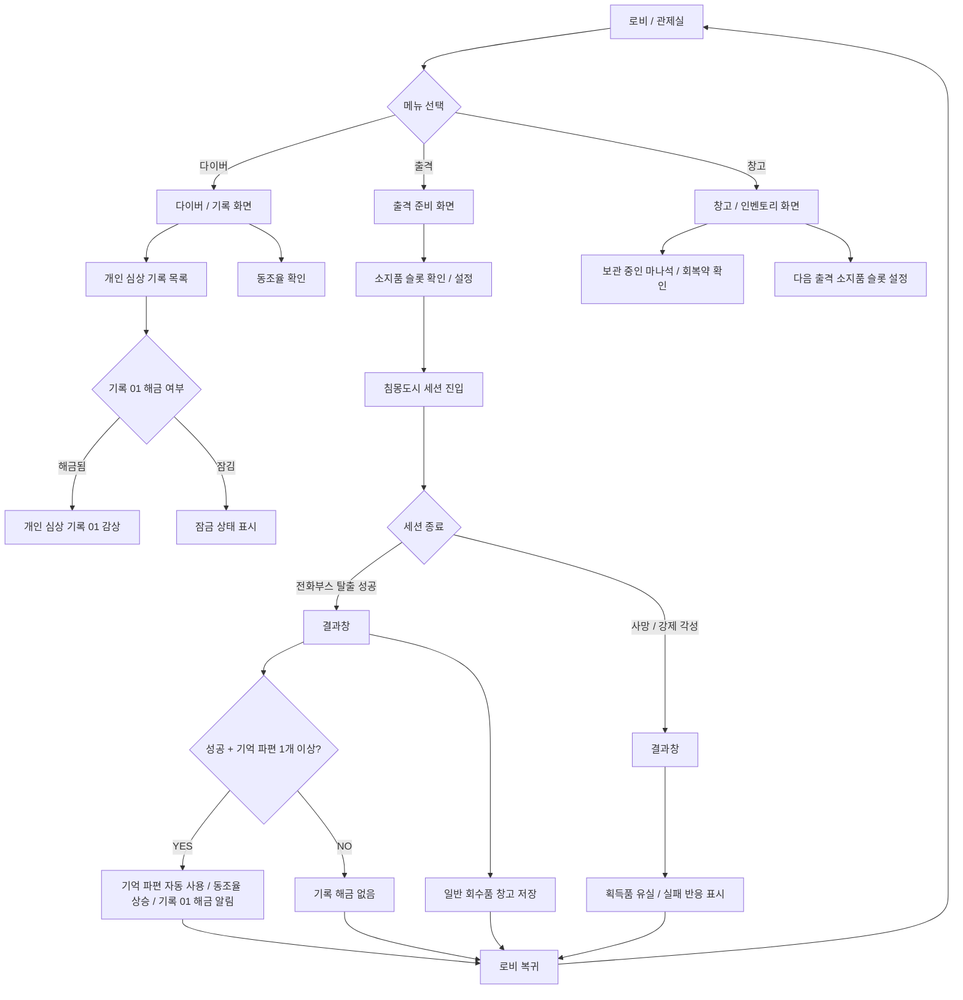

> [!WARNING]

> 본 문서는 2차 개정 피드백(창고/인벤토리의 익스트랙션 허브화 및 기억 파편의 자동 소모성 자원 처리)을 반영한 개정안입니다.

> P0 범위에서는 복잡한 그리드 및 제작을 배제하고 최소 소지품 장착 루프를 가동합니다.

# 프로토타입 로비 허브 UI 플로우 명세

## 1. 문서 목적

본 문서는 `침몽도시: 루시드 다이버` 최종 프로토타입 빌드에서 검증할 간이형 로비 허브의 UI 구조와 화면 이동 흐름을 정의하기 위한 문서입니다.

본 프로젝트의 최종 목표는 완결형 전체 게임 구현이 아닌, 메인 다이버 1명을 중심으로 **'PvE 익스트랙션 루프'와 '서브컬처 캐릭터 애착 루프'가 유기적으로 결합될 수 있음을 증명하는 포트폴리오 빌드**를 제작하는 것입니다. 

이에 따라 로비는 대규모 기지 시스템이나 복잡한 성장 요소가 배제된, 프로토타입 작동에 필요한 핵심 기능만 제공하는 간이 UI 허브 구조로 설계합니다.

특히 기존 `서브컬처_캐릭터_애착_기획서.md`가 보상 연결 원리를 설명하는 마스터 기획이라면, 본 문서는 해당 애착 보상이 어떤 화면과 버튼 흐름을 통해 유저에게 전달되고 다음 출격으로 이어지는지를 규정하는 실행용 명세서 역할을 수행합니다.

## 2. 로비 허브의 역할

프로토타입 내에서 로비 허브는 다음 세 가지의 최소 목적을 달성하기 위해 필요합니다.

- **출격 허브**: 플레이어가 침몽도시 위험 세션에 진입하는 입구 역할을 수행합니다.
- **서브컬처 감상 허브**: 캐릭터의 동조율 단계를 파악하고, 해금된 개인 심상 기록을 감상하며, 결과에 따른 대사 변화를 통해 캐릭터와의 정서적 연대를 확인합니다. 이때 기억 파편은 창고에 보관되는 회수품이 아니라, 탈출 성공 시 메인 다이버의 개인 심상 기록 복구에 자동 사용되는 서사 자원으로 처리합니다.
- **익스트랙션 보상 / 출격 준비 허브**: 세션에서 회수한 마나석, 회복약 등의 일반 회수품을 창고에 보관하고, 다음 출격 시 제한된 소지 슬롯에 장착하여 사용할 수 있도록 준비하는 역할을 수행합니다.

## 3. 최종 프로토타입 로비 기능 범위

### 3.1 출격

- **출격 준비 화면 전환**: 로비 메인 화면에 위치한 출격 버튼을 통해 출격 준비 단계로 이동합니다.

- **소지품 설정 연동**: 출격 전, 창고에 보관된 마나석 및 회복약 소모품을 슬롯에 장착합니다.

- **다이버 출격**: 현재 지정된 메인 다이버가 소장한 소지품을 소지하고 침몽도시 세션으로 진입합니다.

### 3.2 다이버 / 기록

- **메인 다이버 정보 노출**: 메인 다이버의 이름, 초상화 또는 스탠딩 일러스트를 로비 및 다이버 서브 메뉴에 표시합니다.

- **동조율 확인**: 현재 다이버와의 신경 동조 수준인 `동조율 단계(linkRateLevel)`를 표시합니다.

- **개인 심상 기록 조회**: 동조율 및 탈출 성공 조건에 따라 해금되는 '개인 심상 기록 01'의 잠금/해금 상태를 표시하고, 해금 시 텍스트 팝업 뷰어로 본문을 노출합니다.

- **대사 반응 피드백**: 로비 진입 및 복귀 상태에 따라 달라진 캐릭터의 귀환 및 상호작용 대사 텍스트를 가시화합니다.

- **신규 알림(NEW)**: 새로운 심상 기록이 해금되었을 때 다이버 메뉴 및 기록 01 리스트 옆에 신규 알림 표시를 활성화합니다.

### 3.3 창고 / 인벤토리

창고 / 인벤토리는 익스트랙션 세션에서 회수한 일반 회수품을 보관하고, 다음 출격에 사용할 소모품을 준비하는 최소 기능 화면입니다.

- **보관 기물 확인**: 세션에서 회수하여 현재 창고에 저장된 일반 회수품(마나석, 회복약)의 수량을 확인합니다.

- **소지품 지정**: 다음 출격에 가져갈 소모품 슬롯 2개(equippedItemSlot1, equippedItemSlot2)를 설정합니다.
- **기억 파편 처리**: 기억 파편은 창고에 누적 저장되는 일반 아이템이 아니라, 탈출 성공 시 자동으로 메인 다이버의 개인 심상 기록 복구에 사용되는 서사 자원으로 처리되어 창고 보관 리스트에서 제외됩니다.

## 4. 제외 범위

본 프로토타입에서는 핵심 루프의 신속한 검증을 위해 아래의 확장 기능들을 전면 제외합니다.

- **제작 / 크래프팅 및 장비 강화 / 판매 / 분해**: 복잡한 제작소, 장비 수리, 무장 강화 등은 제공하지 않습니다. *(※ 단, 마나석과 회복약을 창고에 보관하고 다음 출격에 제한된 슬롯으로 가져가는 최소 출격 준비 기능은 P0에 포함합니다)*

- **캐릭터 교체 및 1+2 스트라이커**: 1인의 메인 다이버 전용 빌드이므로 다이버 변경 및 다수 캐릭터 연계 편성 UI는 제외합니다.

- **기타 편의 기능 및 BM**: 선물/호감도 선물 시스템, 스킨/코스튬, 우편함, 퀘스트 보드, 멀티플레이 대기방, 보스 레이드 입장 UI, 로비 커스터마이징은 구현 대상에서 제외됩니다.

## 5. 전체 화면 플로우차트

## 6. 로비 메인 화면 구조

메인 로비(관제실)는 유저가 게임에 접속하거나 세션 완료 후 복귀할 때 노출되는 최상위 인터페이스 화면입니다.

### 6.1 UI 와이어프레임 이미지

- **출격 버튼 클릭 시**: 출격 준비 화면으로 전환됩니다.

- **다이버 버튼 클릭 시**: 다이버 / 기록 화면으로 진입합니다.

- **창고 버튼 클릭 시**: 창고 / 인벤토리 화면으로 진입합니다.

## 7. 다이버 / 기록 화면 구조

메인 다이버의 현재 상세 정보를 확인하고, 복구된 백스토리 텍스트를 감상하는 서브 메뉴 화면입니다.

### 7.1 UI 와이어프레임 이미지

- **기록 01 보기 클릭 시**: `memoryLogUnlocked`가 `true`일 경우, 팝업 형태로 기록 내용이 담긴 스크롤 뷰가 활성화됩니다.

- **뒤로 클릭 시**: 메인 로비 화면으로 원복합니다.

- *참고*: 프로토타입 빌드 내에서 기록 02는 기능이 없는 더미 잠금 상태로 표시됩니다.

## 8. 창고 / 인벤토리 화면 구조

세션에서 회수한 마나석 및 회복약을 확인하고, 다음 출격에 들고 갈 장비를 셋업하는 공간입니다.

### 8.1 UI 와이어프레임 이미지

- **보관 및 소지 기능의 이원화**:

  - **창고 (좌측, 최대 120슬롯)**: 세션에서 회수하여 안전하게 복귀한 일반 회수품(마나석, 회복약)이 영구 보관되는 기지 보관함입니다.

  - **인벤토리 (우측, 최대 60슬롯)**: 다음 출격 시 캐릭터가 물리적으로 소지하고 나갈 아이템 세트입니다.

- **아이템 이동 인터페이스 (드래그 앤 드롭 및 클릭 전송)**:

  - **드래그 앤 드롭**: 창고에 보관된 아이템을 마우스로 드래그하여 우측의 인벤토리 슬롯으로 직관적으로 옮겨 배치할 수 있습니다. (반대 방향 이동도 동일)

  - **더블 클릭 / 터치**: 드래그 조작이 번거로운 PC/모바일 환경을 위해, 아이템을 더블 클릭(또는 더블 터치)하면 반대편 빈 슬롯으로 즉시 전송되는 '클릭으로 이동' 편의 기능을 함께 지원합니다.

- **소비 기물 퀵 슬롯 장착**:

  - 인벤토리에 보유 중인 소비 기물(회복약, 마나석 등)을 하단의 퀵 슬롯(1~4번 활성화, 5~6번 프로토타입 잠금)으로 드래그하여 배치함으로써 출격 준비 상태를 셋업합니다.

  - 퀵 슬롯에 주입된 정보는 다음 세션 진입 시 플레이어 HUD 퀵슬롯 데이터와 그대로 연동되어 인게임에서 즉시 단축키로 사용됩니다.
- **기억 파편 자원 분리 노출**:
  - 기억 파편은 일반 보관 슬롯을 차지하지 않고 화면 하단에 별도 자원 보유량(예: 보유량 `128`)으로 전용 노출되어, 익스트랙션 일반 아이템과 서브컬처 서사 자원의 시각적 구분을 명확히 해줍니다.

## 9. 출격 준비 화면 구조

출격 진입 전 최종적으로 캐릭터 정보와 장착 소모품 현황을 점검하고 세션으로 나가는 중간 허브 브릿지 화면입니다.

*(※ 개발 부담이 크다면 이 화면은 창고 화면 안의 하위 탭/영역으로 통합 구현할 수 있습니다.)*

### 9.1 UI 와이어프레임 이미지

- **P0 사양**: 프로토타입 빌드에서는 소지품 슬롯을 2개 고정으로 제한합니다.

- **창고에서 변경 클릭 시**: 소지품을 셋업할 수 있는 창고 / 인벤토리 화면으로 즉시 이동합니다.

- **출격 클릭 시**: 인게임 세션에 진입하며, 장착된 소모품 정보가 전달됩니다.

## 10. 결과창 이후 로비 복귀 흐름

인게임 세션이 종료되면 획득한 보상을 정산하는 화면이 출력되며, 성공과 실패 시의 연출 및 연동 정보는 다음과 같이 구분됩니다.

### 10.1 탈출 성공 결과창 와이어프레임

### 10.2 탈출 실패 결과창 와이어프레임

- **로비로 돌아가기 클릭 시**: `sessionState` 변수가 `LOBBY`로 갱신되며 로비 메인 씬으로 전환됩니다. 이 시점에 획득한 일반 회수품은 창고 변수에 누적 갱신 완료되어 있습니다.

## 11. 성공 / 실패 / 미해금 상태별 화면 차이

| 상태 구분 | 세션 요건 | 기억 파편 처리 | 일반 회수품 처리 | 동조율 변화 | 심상 기록 해금 여부 | 로비 알림(NEW) |
| :--- | :--- | :--- | :--- | :---: | :---: | :---: |
| **경우 1. 성공적 귀환** | 탈출 성공 및 파편 1개 이상 | 시나리오 복구 자동 소모 | 마나석/회복약 창고 누적 저장 | Lv. 상승 (+1) | 기록 01 해금 (`true`) | 다이버 메뉴 활성화 |
| **경우 2. 일반 귀환** | 탈출 성공 및 파편 0개 | 처리 없음 (0개) | 마나석/회복약 창고 누적 저장 | 변동 없음 | 해금 실패 (`false`) | 비활성화 |
| **경우 3. 강제 각성** | 세션 내 패배 / 사망 | 파편 전체 유실 | 획득 회수품 전체 유실 | 변동 없음 | 해금 실패 (`false`) | 비활성화 |

## 12. UI 요소별 변수 연결표

| 화면 구분 | UI 요소 | 동작 및 표시 조건 | 연결 변수 | 비고 |

| :--- | :--- | :--- | :--- | :--- |

| **공통** | 게임 진행 상태 | 현재 상태에 맞게 인게임 씬 로드 및 UI 활성화 관리 | `sessionState` | LOBBY / IN_GAME / RESULT 단계 제어 |

| **결과창** | 파편 수치 | 이번 세션에서 획득한 파편 개수 표기 | `memoryFragmentCount` | FAILED 시 0으로 제어 |

| **결과창** | 파편 사용 여부 | 파편 자동 소모를 통한 기록 해금 여부 체크 | `memoryFragmentUsedForMemoryLog` | `memoryFragmentCount >= 1` 시 `true` |

| **결과창** | 세션 획득품 (마나석) | 이번 세션에서 파밍하여 들고 나온 마나석 개수 | `manaStoneCount` | FAILED 시 0으로 제어 |

| **결과창** | 세션 획득품 (회복약) | 이번 세션에서 파밍하여 들고 나온 회복약 개수 | `potionCount` | FAILED 시 0으로 제어 |

| **창고** | 보관 마나석 수량 | 창고에 영구 축적된 마나석 수량 표시 | `storedManaStoneCount` | SUCCESS 정산 시 `manaStoneCount` 누적 합산 |

| **창고** | 보관 회복약 수량 | 창고에 영구 축적된 회복약 수량 표시 | `storedPotionCount` | SUCCESS 정산 시 `potionCount` 누적 합산 |

| **창고 / 준비**| 소지품 장착 1 | 다음 출격에 가져갈 슬롯 1에 설정된 아이템 ID | `equippedItemSlot1` | 창고 소지품 설정 시 값 주입 |

| **창고 / 준비**| 소지품 장착 2 | 다음 출격에 가져갈 슬롯 2에 설정된 아이템 ID | `equippedItemSlot2` | 창고 소지품 설정 시 값 주입 |

| **결과 / 로비**| 기록 해금 여부 | 심상 기록 01 잠금/해제 연동 플래그 | `memoryLogUnlocked` | 해금 시 로비 다이버 상세 메뉴 진입 단추 활성화 |

| **로비 메인** | 다이버 메뉴 알림 | 해금 플래그 활성화 직후 로비 복귀 시 NEW 표시 | `hasNewMemoryLog` | 메뉴 진입 및 감상 완료 시 `false` |

## 13. P0 / P0.5 구분

### 13.1 P0 필수 구현

프로토타입 루프 검증을 위해 반드시 기획 및 개발되어야 하는 최소 요건입니다.

- **아이템 사양**: 일반 소모품 2종 (마나석 1종, 회복약 1종) 한정 구현

- **정산 시스템**: 탈출 성공 시 획득한 소모품을 창고 변수(`stored~Count`)에 누적 가산 처리 및 결과창 노출

- **장착 시스템**: 창고 화면 또는 출격 준비 화면에서 소지품 슬롯 2개 표시 및 세션 가져가기 지원
- **기억 파편 처리**: 창고에 영구 저장하지 않으며, 탈출 성공 즉시 소모하여 동조율 상승 및 기록 해금 플래그 활성화
- **아웃게임 기본**: 관제실 로비 메인, 다이버 상세, 창고 화면, 결과창 구성 및 성공/실패별 대사 연계

### 13.2 P0.5 선택 구현

프로토타입 루프의 풍부한 피드백을 지원하되 제외 가능한 보조 요건입니다.

- 세션 플레이 중 아이템 사용 애니메이션 및 쿨타임 이펙트

- 마나석/회복약 장착 시 소지품 슬롯으로의 드래그 앤 드롭 동작 구현

- 탄약 보충을 위한 소모품 '탄약팩' 구현

- 한시적으로 무장 성능을 변경시켜 주는 일회성 기물인 '임시 무장' 구현

- 무장의 사용 횟수 제한을 관리하는 장비 내구도 시스템

- 창고 보관함을 추가 골드 또는 재화로 열 수 있는 인벤토리 칸 확장 기능

- 아이템 판매, 분해, 정합 제작 시스템

## 14. 시스템 / 개발 전달 메모

- 본 문서에서 정의하는 창고/인벤토리는 복잡한 파밍 RPG의 인벤토리가 아니라, **익스트랙션 루프를 최소한으로 체감시키기 위한 회수품 보관 및 다음 출격 준비 화면**입니다.
- **기억 파편**은 창고에 보관되는 일반 아이템이 아니라, 서브컬처 애착 루프를 작동시키는 **기록 복구용 단일 서사 자원**으로 처리합니다.
- 반면 **마나석과 회복약**은 창고에 보관되고 다음 출격에 가져갈 수 있는 **일반 회수품**으로 처리하여, 플레이어가 *"이번 세션에서 살아 돌아온 보상이 다음 세션 준비로 이어진다"*는 익스트랙션의 핵심 감각을 고스란히 느낄 수 있게 지원합니다.

- 개발 편의상 단독 로비 씬의 구성 비용이 클 경우 결과창 씬 전환 후 카메라를 고정하여 나타내는 캔버스 레이어 방식의 **간이 로비 UI 패널** 구조로 우회 구현이 가능합니다.

## 15. 핵심 요약

프로토타입 로비는 출격, 다이버, 창고의 3개 기능만으로 구성되는 최소 허브입니다.

기억 파편은 창고에 보관되지 않으며, 결과 화면에서 즉시 소모되어 동조율(호감도) 경험치를 올리고 레벨업 시 새로운 심상 기록을 열어주는 정산용 자원입니다. 반면 마나석과 회복약은 세션에서 회수해 창고에 보관하고 다음 출격에 가져갈 수 있는 일반 회수품입니다.

이를 통해 본 프로토타입은 **`기억 파편 → 결과창 즉시 소모 → 동조율 상승 → 레벨업 시 심상 기록 해금`으로 이어지는 서브컬처 애착 루프**와, **`일반 회수품 → 창고 보관 → 다음 출격 준비`로 이어지는 익스트랙션 루프**를 최소 구조 하에서 견고하게 동시 검증합니다.

---

## 📜 Revision History

| 날짜 | 버전 | 내용 | 작성자 |

| :---: | :---: | :--- | :---: |

| 2026.06.17 | v1.00 | - 방향성 재정의 회의 R&R에 맞추어 프로토타입 로비 플로우 및 와이어프레임 설계안 최초 등록 | 장수영 |

| 2026.06.17 | v1.10 | - 2차 개정 피드백 적용: 기억 파편의 자동 소모 서사 자원화 - 마나석, 회복약 중심의 익스트랙션 창고 및 소지품 슬롯 장착 개념 수립 - 출격 준비 화면 추가, 상태별 분기 표 및 변수 연결표 대폭 개편 | 장수영 |

| 2026.06.17 | v1.11 | - 텍스트 와이어프레임을 GUI 와이어프레임 이미지 시안으로 전면 대체 반영 | 장수영 |

| 2026.06.17 | v1.12 | - 이미지 리소스의 깃(Git) 협업 프리뷰 대응을 위해 프로젝트 상대 경로형 링크로 전환 수정 | 장수영 |

| 2026.06.17 | v1.13 | - 마크다운 프리뷰 시 이미지 출력 오류 수정: 파일명 내 공백/괄호 제거 및 파일 리네임 연동 | 장수영 |

| 2026.06.17 | v1.14 | - 탈출 실패(강제 각성) 결과창 텍스트 와이어프레임을 신규 생성한 GUI 이미지 시안(UI_예시_이미지_6.png)으로 대체 반영 | 장수영 |

| 2026.06.17 | v1.15 | - 창고/인벤토리 와이어프레임 이미지 교체(UI_예시_이미지_7.png) 및 드래그앤드롭/더블클릭 전송 사양 구체화 | 장수영 |
| 2026.06.17 | v1.16 | - 창고/인벤토리 내 기억 파편 관련 기획 삭제 및 결과 정산 단계 즉시 소모(사망 시 유실) 및 레벨업 시 심상 기록 개방 루프 반영 | 장수영 |
