> [!IMPORTANT]
> 이 문서는 AI(Antigravity)가 작성한 초안입니다.
> 기획자/PM의 검토 및 승인 후 이 배너를 제거하면 '확정 사양'으로 인정됩니다.

# 20260710_P0.5 알파_버그 리포트 (v2.0.0)

# 버그 보고 양식

| 항목 | 내용 |
| --- | --- |
| 버그 ID | QA-001 |
| 기능 | 게임 플레이 |
| 발생 조건 | 게임 시작 후 2분 경과 |
| 재현 방법 | ① 게임 시작 → ② 스테이지 진입 → ③ 적 처치 |
| 기대 결과 | 정상 진행 |
| 실제 결과 | 앱 종료(Crash) |
| 우선순위 | Critical |
| 첨부 | 스크린샷 / 영상 |

## 버그 우선순위

| 등급 | 설명 |
| --- | --- |
| Blocker | 게임 진행 불가, 앱 실행 불가 |
| Critical | 주요 기능 사용 불가 |
| Major | 기능은 동작하지만 사용에 큰 불편 |
| Minor | 경미한 UI 또는 연출 오류 |
| Trivial | 오탈자, 정렬 등 작은 수정 사항 |

# 버그 리스트

| 항목 | 내용 |
| --- | --- |
| 버그 ID | QA-CD-001 |
| 기능 | 출격 소지품 퀵슬롯 출력 |
| 발생 조건 | 앱 실행 후 인게임 세션 첫 진입 전 로비 신 내부에서 발생 |
| 재현 방법 | ① 앱 실행 → ② 창고/인벤토리 화면으로 이동하여 소비 기물 아이템을 퀵슬롯에 배치 → ③ 관제실 화면으로 이동 → ④ 출격 준비 화면으로 이동 |
| 기대 결과 | 창고 화면에서 아이템을 배치한 퀵 슬롯이 출격 준비 화면의 출격 소지품 UI에 출력됨 |
| 실제 결과 | 출격 소지품 UI가 빈 칸으로 출력됨 |
| 우선순위 | Major |
| 첨부 | 스크린샷 2장 (창고에서 퀵슬롯 배치 → 출격 준비 화면) |

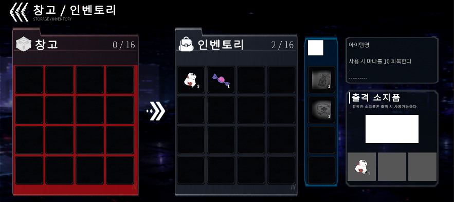

<스크린샷 1-1: 창고에서 퀵슬롯에 소지품을 배치>

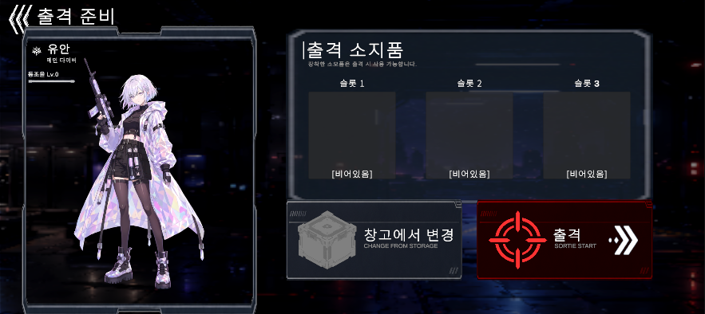

<스크린샷 1-2: 창고에서 배치한 소지품이 출격 준비 화면에서 출력되지 않음>

---

| 항목 | 내용 |
| --- | --- |
| 버그 ID | QA-CD-002 |
| 기능 | 개인 심상 기억 잠금 해제 |
| 발생 조건 | 앱 실행 후 인게임 세션 첫 진입 전 로비 신 내부에서 발생 |
| 재현 방법 | ① 인게임 세션을 1회 이상 플레이하여 동조율 단계 Lv.1 이상인 상태로 앱 종료 → ② 앱을 다시 실행 → ③ 로비 신에서 다이버 기록 화면으로 이동 |
| 기대 결과 | 동조율 단계 Lv.1 이상에서 해금되는 기록 01이 터치 가능한 상태로 출력 |
| 실제 결과 | 동조율 단계 텍스트가 “동조율 Lv.0”으로 출력됨<br>기록 01이 잠김 상태로 출력됨 |
| 우선순위 | Major |
| 첨부 | 스크린샷 1장 |

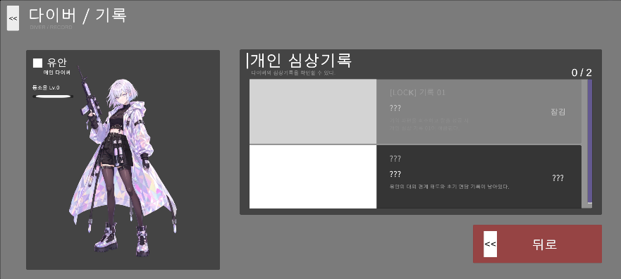

<스크린샷 2: 개인 심상 기록 01이 잠긴 상태로 출력됨>

---

| 항목 | 내용 |
| --- | --- |
| 버그 ID | QA-CD-003 |
| 기능 | 동조율 단계 값 출력 |
| 발생 조건 | 출격 준비 화면 진입 시 항상 발생 |
| 재현 방법 | ① 앱을 실행하여 관제실 화면의 동조율 Lv 값 확인 → ② 창고/인벤토리 화면으로 이동하여 메인 다이버 동조율 Lv 값 확인 |
| 기대 결과 | 관제실 화면과 출격 준비 화면에서 동일한 동조율 Lv. 값이 출력 |
| 실제 결과 | 출격 준비 화면에서 “동조율 Lv.0”으로 출력됨 |
| 우선순위 | Trivial |
| 첨부 | 스크린샷 2장 (관제실 화면 → 출격 준비 화면) |


<스크린샷 3-1: 관제실 화면에서 동조율 Lv.2로 출력 중>

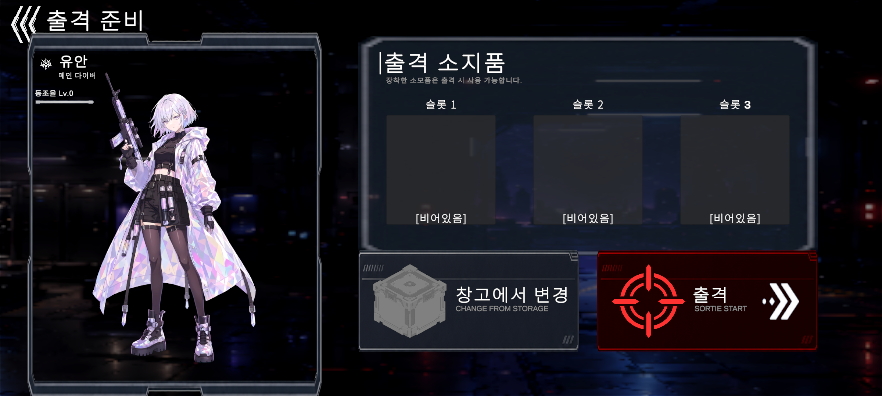

<스크린샷 3-2: 출격 준비 화면에서 동조율 Lv.0으로 출력 중>

---

| 항목 | 내용 |
| --- | --- |
| 버그 ID | QA-CD-004 |
| 기능 | 인게임 아이템 출력 |
| 발생 조건 | 인게임 세션의 아이템 상자에서 "지연된 시계 태엽" 아이템이 생성된 경우에 발생 |
| 재현 방법 | ① 앱 실행 → ② 출격 준비 화면으로 이동 → ③ 출격 버튼을 터치하여 인게임 세션 신 진입 → ④ 아이템 상자에 상호작용 |
| 기대 결과 | “지연된 시계 태엽” 아이템이 정상적으로 상자에 출력되어 상호작용 가능 |
| 실제 결과 | “지연된 시계 태엽” 아이템이 생성되지 않음 |
| 우선순위 | Critical |
| 첨부 | 스크린샷 2장 (Unity Editor의 Console 로그 텍스트) |

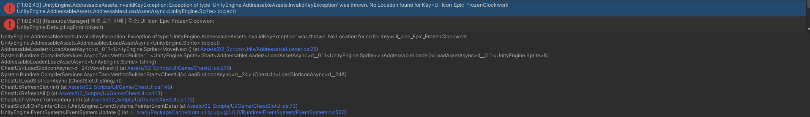

<스크린샷 4-1: “지연된 시계 태엽” 아이템 출력 불가 에러 로그>

```
UnityEngine.AddressableAssets.InvalidKeyException: Exception of type 'UnityEngine.AddressableAssets.InvalidKeyException' was thrown. No Location found for Key=UI_Icon_Epic_FrozenClockwork
UnityEngine.AddressableAssets.Addressables:LoadAssetAsync<UnityEngine.Sprite> (object)
AddressableLoader/<LoadAssetAsync>d__0`1<UnityEngine.Sprite>:MoveNext () (at Assets/02_Scripts/Utils/AddressableLoader.cs:25) System.Runtime.CompilerServices.AsyncTaskMethodBuilder`1<UnityEngine.Sprite>:Start<AddressableLoader/<LoadAssetAsync>d__0`1<UnityEngine.Sprite>> (AddressableLoader/<LoadAssetAsync>d__0`1<UnityEngine.Sprite>&)
AddressableLoader:LoadAssetAsync<UnityEngine.Sprite> (string)
ChestUI/<LoadSlotIconAsync>d__24:MoveNext () (at Assets/02_Scripts/UI/Game/ChestUI.cs:276)
System.Runtime.CompilerServices.AsyncTaskMethodBuilder:Start<ChestUI/<LoadSlotIconAsync>d__24> (ChestUI/<LoadSlotIconAsync>d__24&)
ChestUI:LoadSlotIconAsync (ChestSlotUI,string,int)
ChestUI:RefreshSlot (int) (at Assets/02_Scripts/UI/Game/ChestUI.cs:149)
ChestUI:RefreshAll () (at Assets/02_Scripts/UI/Game/ChestUI.cs:113)
ChestUI:TryMoveToInventory (int) (at Assets/02_Scripts/UI/Game/ChestUI.cs:172)
ChestSlotUI:OnPointerClick (UnityEngine.EventSystems.PointerEventData) (at Assets/02_Scripts/UI/Game/ChestSlotUI.cs:73)
UnityEngine.EventSystems.EventSystem:Update () (at ./Library/PackageCache/com.unity.ugui@1.0.0/Runtime/EventSystem/EventSystem.cs:530)
```

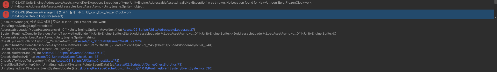

<스크린샷 4-2: “지연된 시계 태엽” 아이템 출력 불가 에러 로그>

```
[ResourceManager] 에셋 로드 실패 | 주소: UI_Icon_Epic_FrozenClockwork
UnityEngine.Debug:LogError (object)
AddressableLoader/<LoadAssetAsync>d__0`1<UnityEngine.Sprite>:MoveNext () (at Assets/02_Scripts/Utils/AddressableLoader.cs:37) System.Runtime.CompilerServices.AsyncTaskMethodBuilder`1<UnityEngine.Sprite>:Start<AddressableLoader/<LoadAssetAsync>d__0`1<UnityEngine.Sprite>> (AddressableLoader/<LoadAssetAsync>d__0`1<UnityEngine.Sprite>&)
AddressableLoader:LoadAssetAsync<UnityEngine.Sprite> (string)
ChestUI/<LoadSlotIconAsync>d__24:MoveNext () (at Assets/02_Scripts/UI/Game/ChestUI.cs:276)
System.Runtime.CompilerServices.AsyncTaskMethodBuilder:Start<ChestUI/<LoadSlotIconAsync>d__24> (ChestUI/<LoadSlotIconAsync>d__24&)
ChestUI:LoadSlotIconAsync (ChestSlotUI,string,int)
ChestUI:RefreshSlot (int) (at Assets/02_Scripts/UI/Game/ChestUI.cs:149)
ChestUI:RefreshAll () (at Assets/02_Scripts/UI/Game/ChestUI.cs:113)
ChestUI:TryMoveToInventory (int) (at Assets/02_Scripts/UI/Game/ChestUI.cs:172)
ChestSlotUI:OnPointerClick (UnityEngine.EventSystems.PointerEventData) (at Assets/02_Scripts/UI/Game/ChestSlotUI.cs:73)
UnityEngine.EventSystems.EventSystem:Update () (at ./Library/PackageCache/com.unity.ugui@1.0.0/Runtime/EventSystem/EventSystem.cs:530)
```

---

| 항목 | 내용 |
| --- | --- |
| 버그 ID | QA-CD-005 |
| 기능 | 동조율 단계 증가 |
| 발생 조건 | 인게임 세션 탈출 성공 시 기억 조각 사용 후 동조율 포인트 값이 동조율 단계 증가 조건을 만족한 경우 로비 신 진입 시 발생 |
| 재현 방법 | ① 앱 실행 → ② 출격 준비 화면으로 이동 → ③ 출격 버튼을 터치하여 인게임 세션 신 진입 → ④ 탈출 포인트에서 탈출에 성공하여 동조율 단계 증가 → ⑤ 로비 신에 진입하여 관제실 화면 출력 |
| 기대 결과 | 탈출에 성공하여 증가한 동조율 단계 값이 관제실 화면에 출력 |
| 실제 결과 | 동조율 단계 값이 인게임 세션 진입 전 값으로 출력됨 |
| 우선순위 | Minor |
| 첨부 | 스크린샷 5장 (인게임 세션 진입 전 관제실 화면 → 탈출 성공 → 인게임 세션 탈출 후 관제실 화면 → 탈출 후 다이버/기록 화면 → 앱 종료 후 다시 실행) |

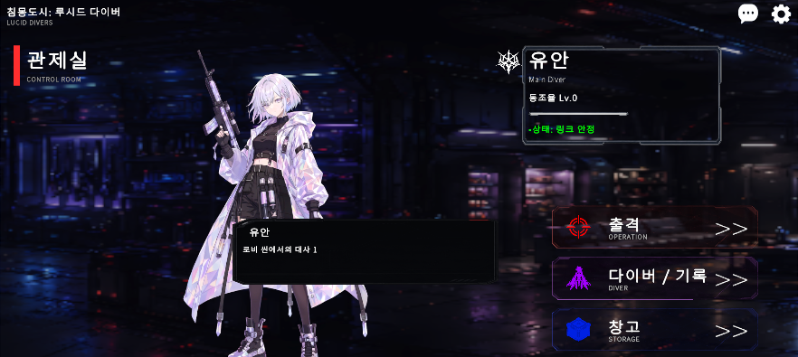

<스크린샷 5-1: 인게임 세션 진입 전 동조율 Lv.0>

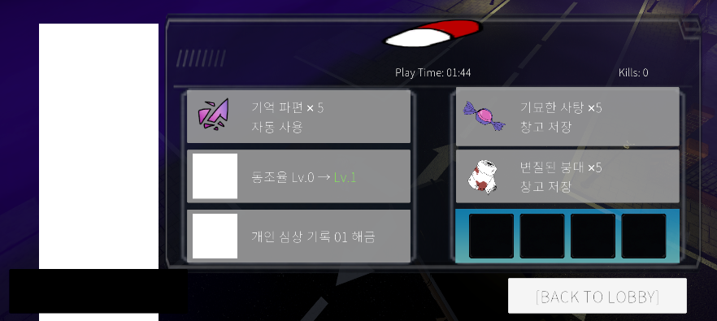

<스크린샷 5-2: 인게임 세션 에서 탈출에 성공하여 동조율 단계가 Lv.1로 증가>


<스크린샷 5-3: 로비로 귀환 시 관제실 화면에서 메인 다이버의 동조율 단계가 Lv.0으로 출력됨>

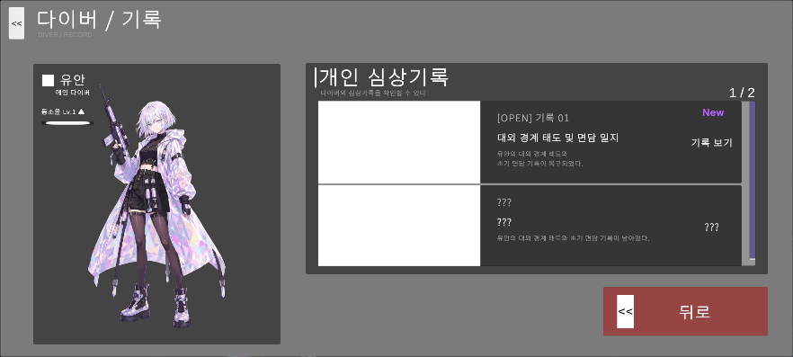

<스크린샷 5-4: 비교 화면 - 다이버/기록 화면에서는 탈출 성공으로 증가한 동조율 단계 Lv.1이 출력됨>

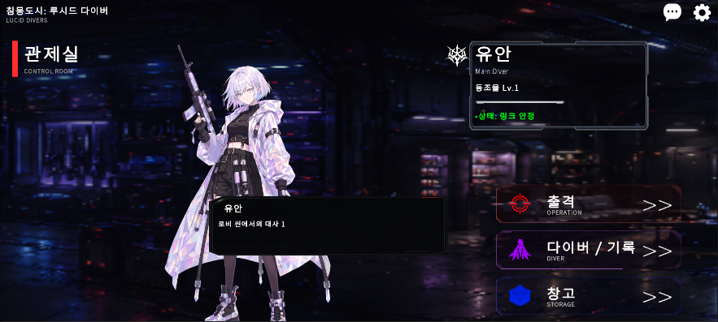

<스크린샷 5-5: 비교 화면 - 앱 종료 후 다시 실행 시 이전 앱 실행 중 탈출 성공으로 증가한 동조율 단계 Lv.1이 출력됨>

---

| 항목 | 내용 |
| --- | --- |
| 버그 ID | QA-CD-006 |
| 기능 | 강제 각성 처리 |
| 발생 조건 | 플레이어의 HP가 적의 공격에 의해 0이 되어 강제 각성 처리가 발생한 상태에서 오류 발생 |
| 재현 방법 | ① 앱 실행 → ② 출격 준비 화면으로 이동 → ③ 출격 버튼을 터치하여 인게임 세션 신 진입 → ④ 적의 공격으로 플레이어의 HP가 0이 됨 → ⑤ 결과 창 패널 출력 |
| 기대 결과 | 결과 창 패널에 출력되는 플레이 경과 시간 값이 결과 창 패널 출력 시점으로 유지됨 |
| 실제 결과 | 적이 플레이어를 공격하여 플레이 경과 시간 값이 반복적으로 갱신됨 |
| 우선순위 | Major |
| 첨부 | 영상 1개 |

<video src="../07_기획서_이미지_자료/QA-CD-006_결과창_플레이타임_갱신.mp4" controls width="100%"></video>
> 🔗 **[동영상 파일 직접 열기 (클릭하여 새 탭에서 재생)](../07_기획서_이미지_자료/QA-CD-006_결과창_플레이타임_갱신.mp4)**


<영상 6: 결과 창 패널 출력 중 플레이 타임 값이 변경됨>

---

| 항목 | 내용 |
| --- | --- |
| 버그 ID | QA-CD-007 |
| 기능 | 적 돌진 공격 |
| 발생 조건 | 적의 돌진 공격 전진 범위 내(플레이어 방향 뒤쪽)에 Trigger 체크가 해제되어 있는 통과 불가 오브젝트 Collider가 존재할 경우에 발생 |
| 재현 방법 | ① 앱 실행 → ② 출격 준비 화면으로 이동 → ③ 출격 버튼을 터치하여 인게임 세션 신 진입 → ④ 인게임 세션에서 플레이어가 통과 불가 오브젝트와 근접한 상태에서 적이 공격을 실행 |
| 기대 결과 | 적이 플레이어를 공격하는 돌진 동작이 통과 불가 오브젝트에 차단되어 Collider 경계에서 위치 이동을 멈춤 |
| 실제 결과 | 적이 플레이어를 공격하는 돌진 동작으로 통과 불가 오브젝트를 건너뛰어 이동함 |
| 우선순위 | Major |
| 첨부 | 영상 1개 |

<video src="../07_기획서_이미지_자료/QA-CD-007_적돌진_오브젝트_관통.mp4" controls width="100%"></video>
> 🔗 **[동영상 파일 직접 열기 (클릭하여 새 탭에서 재생)](../07_기획서_이미지_자료/QA-CD-007_적돌진_오브젝트_관통.mp4)**


<영상 7: 적의 돌진 공격이 벽 Collider를 관통함>

---

| 항목 | 내용 |
| --- | --- |
| 버그 ID | QA-CD-008 |
| 기능 | 아이템 상자 생성 |
| 발생 조건 | 아이템 상자 랜덤 스폰 시점에서 확률에 따라 발생 |
| 재현 방법 | ① 앱 실행 → ② 출격 준비 화면으로 이동 → ③ 출격 버튼을 터치하여 인게임 세션 신 진입 → ④ 인게임 세션에서 LoungeZone 구역으로 이동 |
| 기대 결과 | LoungeZone 구역에 배치된 방 구역으로 이동 가능 |
| 실제 결과 | LoungeZone 구역 문 위치에 ItemBox가 생성되어 플레이어가 이동 불가 |
| 우선순위 | Minor |
| 첨부 | 스크린샷 1개 |

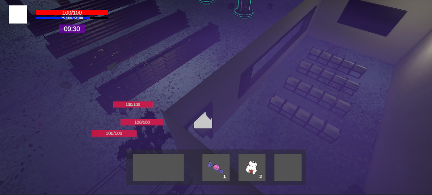

<스크린샷 8: 아이템 상자가 문 입구에 생성됨>

---

| 항목 | 내용 |
| --- | --- |
| 버그 ID | QA-CP-009 |
| 기능 | 몬스터 카메라 기준 회전 |
| 발생 조건 | 레벨디자인 반영을 위해 사전 조정된 카메라 위치값에 맞춰 플레이어 캐릭터의 애니메이션 출력 방향 조절 로직을 수정 적용한 상태에서 발생 |
| 재현 방법 | ① 앱 실행 → ② 출격 준비 화면으로 이동 → ③ 출격 버튼을 터치하여 인게임 세션 신 진입 → ④ 몬스터가 플레이어를 추격하도록 대치 상태를 유도 → ⑤ 카메라 각도 기준에 맞춘 몬스터의 애니메이션 출력 방향 및 실제 추격 방향 일치 여부 확인 |
| 기대 결과 | 몬스터에게도 플레이어와 마찬가지로 변경된 카메라 위치/각도 기준의 애니메이션 출력 방향 조절 로직이 적용되어, 올바른 정방향을 바라보며 추격함 |
| 실제 결과 | 플레이어에게만 애니메이션 출력 방향 로직이 조절되어 있고 몬스터에게는 적용되어 있지 않아, 몬스터가 엉뚱한 방향을 바라본 채 플레이어를 추격함 |
| 우선순위 | Major |
| 첨부 | 미첨부 (추후 영상/스크린샷 확보 필요) |

---

| 항목 | 내용 |
| --- | --- |
| 버그 ID | QA-CPTD-010 |
| 기능 | 아이템 상자 공중 부유 |
| 발생 조건 | 인게임 세션 진입 후 특정 스폰포인트에서 아이템 상자가 생성될 때 항상 발생 |
| 재현 방법 | ① 앱 실행 → ② 출격 준비 화면으로 이동 → ③ 출격 버튼을 터치하여 인게임 세션 신 진입 → ④ 인게임 세션을 탐색하며 스폰된 아이템 상자들의 생성 높이 상태를 확인 |
| 기대 결과 | 아이템 상자가 지면의 높이(Ground level)에 정확히 밀착하여 생성됨 |
| 실제 결과 | 특정 구역의 스폰포인트에 생성된 아이템 상자가 공중에 떠서 스폰됨 |
| 우선순위 | Minor |
| 첨부 | 미첨부 (스폰포인트 위치 조절 필요) |

---

| 항목 | 내용 |
| --- | --- |
| 버그 ID | QA-CPTD-011 (CP/TD: QA-102, QA-103) |
| 기능 | 외곽 보도블럭 캐릭터 렌더링 |
| 발생 조건 | 출격 후 특정 오브젝트(보도블럭) 위에 캐릭터가 위치할 때 발생 |
| 재현 방법 | ① 게임 시작 → ② 스테이지 진입 → ③ 보도블럭 오브젝트 위에 캐릭터 위치시킴 → ④ 카메라 회전 및 이동하며 캐릭터 렌더링 상태 확인 |
| 기대 결과 | 캐릭터가 보도블럭 경계면으로 이동하더라도 가림 현상 없이 항상 맵 메쉬의 최전면에 플레이어 이미지 전신이 정상적으로 출력되어야 함 |
| 실제 결과 | 캐릭터가 물리적으로 끼이는 것은 아니나, 렌더링된 캐릭터 이미지의 일부(하반신 등)가 보도블럭 메쉬에 가려져 화면에 정상 출력되지 않음 |
| 우선순위 | Minor |
| 첨부 | 이미지 2장 (정상 출력 vs 문제 상황) |

- **정상 출력될 경우**
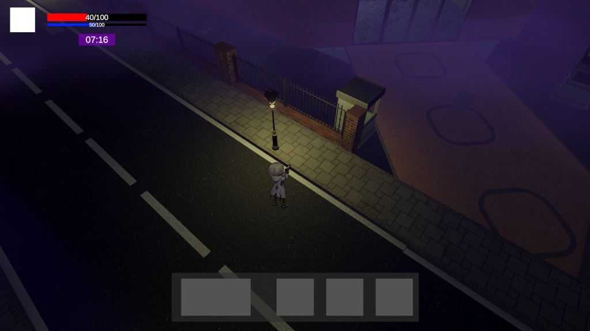

- **문제 상황 (가림 현상 발생)**
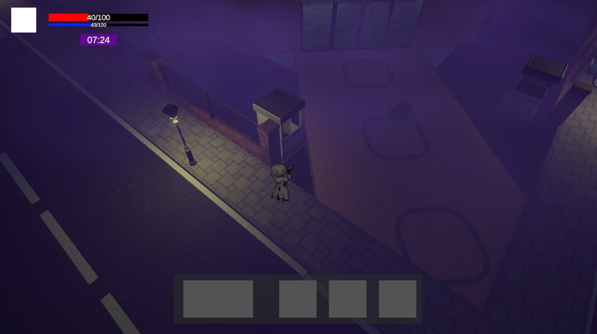

---

| 항목 | 내용 |
| --- | --- |
| 버그 ID | QA-TD-001 (PM/TD: QA-101) |
| 기능 | 게임 플레이 |
| 발생 조건 | 게임 시작 후 거의 즉시 |
| 재현 방법 | ① 게임 시작 → ② 스테이지 진입 → ③ 달리기 사용 |
| 기대 결과 | 스테미너 수치 정수로 표현 |
| 실제 결과 | 스테미너 수치 소수점 5자리까지 표시 |
| 우선순위 | Minor |
| 첨부 | 미첨부 |

---

| 항목 | 내용 |
| --- | --- |
| 버그 ID | QA-TD-003 |
| 기능 | 게임 플레이 |
| 발생 조건 | 결과창이 열려 있을 때 |
| 재현 방법 | ① 사망 혹은 탈출 → ② 결과창 출력 → ③ 인벤토리 키 입력 |
| 기대 결과 | 결과창 패널 출력 중에는 인벤토리 창이 열리지 않아야 함 |
| 실제 결과 | 인벤토리 창이 비정상적으로 출력되며, 이 상태에서 로비로 나갈 시 인벤토리 UI가 고장 나 작동하지 않음 |
| 우선순위 | Major |
| 첨부 | 동영상 1개 |

<video src="../07_기획서_이미지_자료/QA-TD-003_인벤토리_결과창_오류.mp4" controls width="100%"></video>
> 🔗 **[동영상 파일 직접 열기 (클릭하여 새 탭에서 재생)](../07_기획서_이미지_자료/QA-TD-003_인벤토리_결과창_오류.mp4)**

<영상 9: 결과창 출력 중 인벤토리 UI 강제 오픈 오류>

---

| 항목 | 내용 |
| --- | --- |
| 버그 ID | QA-TD-004 |
| 기능 | 게임 플레이 |
| 발생 조건 | 적에게 공격을 가할 때 |
| 재현 방법 | ① 적에게 공격 실행 → ② 총 피격 판정 및 적 반응 확인 |
| 기대 결과 | 모든 유효 피격 판정에 대해 에너미의 체력이 정상적으로 감소해야 함 |
| 실제 결과 | 일부 피격 판정에 대해 총알은 적중하나 체력이 감소하지 않는 현상 발생 |
| 우선순위 | Critical |
| 첨부 | 동영상 1개 |

<video src="../07_기획서_이미지_자료/QA-TD-004_일부피격_체력미감소.mp4" controls width="100%"></video>
> 🔗 **[동영상 파일 직접 열기 (클릭하여 새 탭에서 재생)](../07_기획서_이미지_자료/QA-TD-004_일부피격_체력미감소.mp4)**

<영상 10: 피격 연출 출력 중 적 체력 미감소 오류>

---

| 항목 | 내용 |
| --- | --- |
| 버그 ID | QA-TD-005 |
| 기능 | 플레이어 정보 |
| 발생 조건 | 출격을 통해 레벨업 후 로비 화면으로 돌아왔을 때 |
| 재현 방법 | ① 출격 후 다음 동조율 수치만큼 기억조각 획득 → ② 탈출에 성공하여 동조율 상승 → ③ 로비 화면 귀환 후 메인 화면에서 다이버 동조율 확인 |
| 기대 결과 | 다이버의 현재 동조율과 다음 단계 성장을 위한 남은 수치 슬라이더 게이지가 정상 표시되어야 함 |
| 실제 결과 | 동조율 단계 및 성장을 위한 수치 슬라이더가 0에 고정되어 갱신되지 않음 |
| 우선순위 | Major |
| 첨부 | 동영상 1개 |

<video src="../07_기획서_이미지_자료/QA-TD-005_동조율슬라이더_0고정.mp4" controls width="100%"></video>
> 🔗 **[동영상 파일 직접 열기 (클릭하여 새 탭에서 재생)](../07_기획서_이미지_자료/QA-TD-005_동조율슬라이더_0고정.mp4)**

<영상 11: 로비 화면에서 동조율 레벨 및 게이지 0 고정 오류>

---

| 항목 | 내용 |
| --- | --- |
| 버그 ID | QA-TD-006 |
| 기능 | 게임 플레이 |
| 발생 조건 | 아이템을 버렸을 때 |
| 재현 방법 | ① 출격 후 인게임 세션에서 아이템 습득 → ② 인벤토리 창 활성화 → ③ 아이템을 바닥으로 드래그 앤 드롭하여 버림 |
| 기대 결과 | 바닥에 드롭된 아이템 아이콘이 가이드를 준 소형 크기로 정상 출력되어야 함 |
| 실제 결과 | 바닥에 드롭된 아이템 아이콘이 UI용 대형 해상도 크기 그대로 출력되어 비정상적으로 비대함 |
| 우선순위 | Major |
| 첨부 | 스크린샷 1장 |

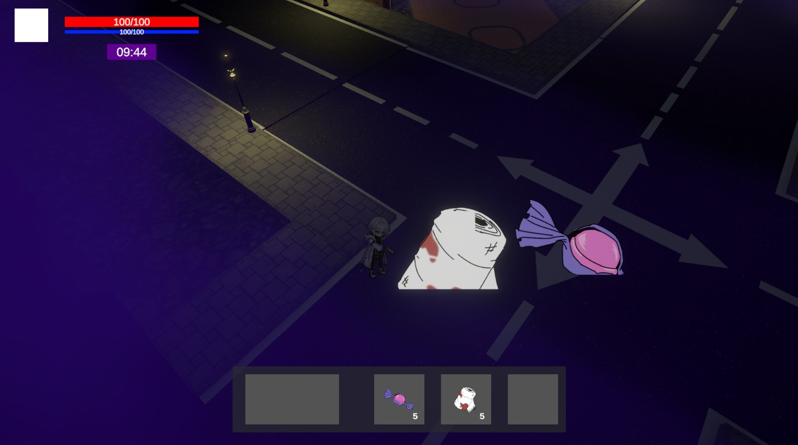

<스크린샷 9: 바닥에 버려진 아이템 아이콘의 과대화 출력 오류>

---

| 항목 | 내용 |
| --- | --- |
| 버그 ID | QA-TD-007 |
| 기능 | 레벨 디자인 |
| 발생 조건 | 출격 후 1분 이내 특정 건물 입구 지역 이동 시 |
| 재현 방법 | ① 출격 후 건물 입구 구역으로 이동 → ② 해당 건물이 화면에 보이는 위치에서 캐릭터를 상하좌우 조작하며 타일 텍스처 상태 관찰 |
| 기대 결과 | 카메라 뷰 각도나 캐릭터 위치 변경에 의해 오브젝트의 텍스처 해상도나 이미지가 비정상적으로 급변하지 않아야 함 |
| 실제 결과 | 특정 카메라 각도 진입 시 건물 입구 도로 옆 인도 텍스처가 깨지거나 완전히 다른 텍스처로 급격히 변경되는 깜빡임(Z-Fighting 또는 밉맵 변경) 현상 발생 |
| 우선순위 | Major |
| 첨부 | 이미지 2장, 동영상 1개 |

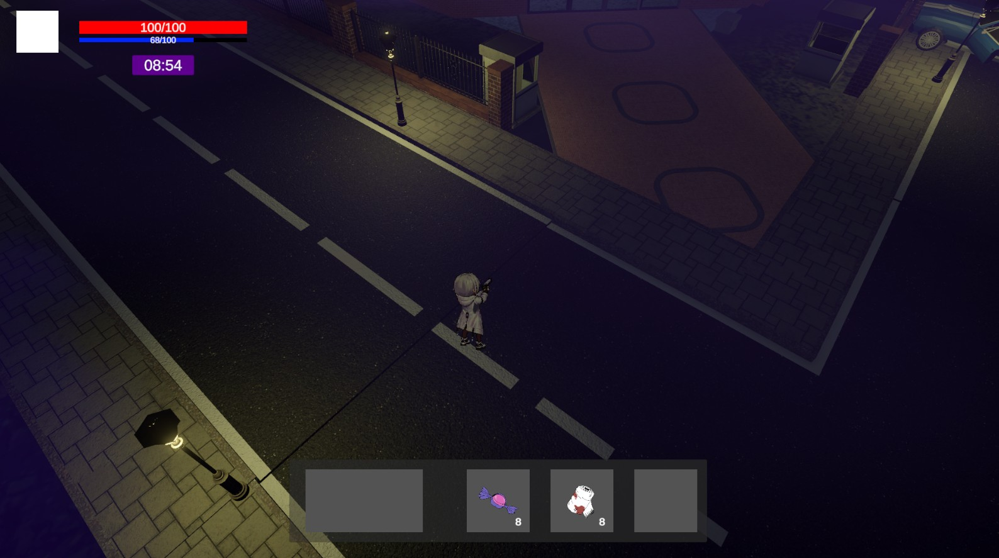
<스크린샷 10-1: 정상 상태의 인도 텍스처 출력>

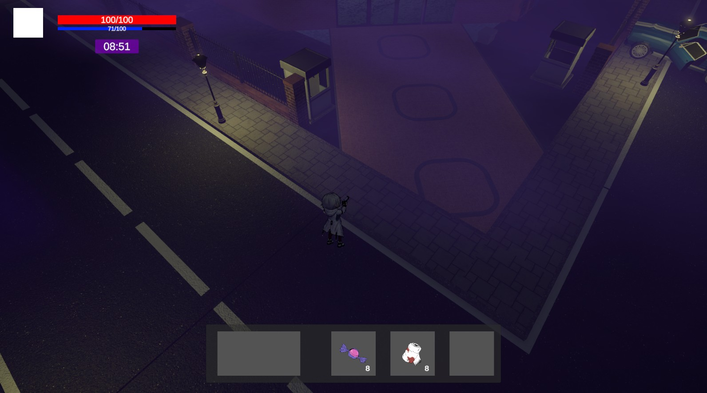
<스크린샷 10-2: 각도 변경 시 다른 텍스처로 오버라이트되어 깨지는 오류 상황>

<video src="../07_기획서_이미지_자료/QA-TD-007_건물입구_도로텍스처_상이.mp4" controls width="100%"></video>
> 🔗 **[동영상 파일 직접 열기 (클릭하여 새 탭에서 재생)](../07_기획서_이미지_자료/QA-TD-007_건물입구_도로텍스처_상이.mp4)**

<영상 12: 각도 조작 시 텍스처가 뒤바뀌며 깜빡이는 현상>

---

| 항목 | 내용 |
| --- | --- |
| 버그 ID | QA-PM-001 |
| 기능 | 에너미 감지 / 어그로 |
| 발생 조건 | 플레이어와 에너미 사이에 벽이 있는 상태에서 총격, 소음 오브젝트, 또는 감지 이벤트 발생 |
| 재현 방법 | ① 벽 너머에 에너미 배치 → ② 플레이어가 벽 반대편에서 총 발사 또는 소음 발생 → ③ 에너미 반응 여부 확인 |
| 기대 결과 | 벽으로 시야가 차단된 경우 에너미가 플레이어 또는 소음에 반응하지 않음 |
| 실제 결과 | 벽 너머에서도 에너미의 어그로가 끌림 |
| 우선순위 | Major |
| 첨부 | 미첨부 |

---

| 항목 | 내용 |
| --- | --- |
| 버그 ID | QA-PM-002 |
| 기능 | 에너미 공격 판정 / 레이캐스트 |
| 발생 조건 | 플레이어와 에너미 사이에 벽이 있는 상태에서 에너미 공격 발생 |
| 재현 방법 | ① 벽을 사이에 두고 플레이어와 에너미 배치 → ② 에너미가 공격 상태에 진입 → ③ 공격 판정이 벽을 무시하는지 확인 |
| 기대 결과 | 벽이 있으면 공격 레이 또는 공격 판정이 차단되어야 함 |
| 실제 결과 | 벽을 투과하여 레이가 발사되고, 벽 너머 플레이어에게 공격 판정이 적용됨 |
| 우선순위 | Critical |
| 비고/상태 | 간접 해결 가능 / 추가 검증 필요<br>벽 너머 인식 문제가 해결되면 공격 상태 진입 자체가 차단되어 대부분의 벽 너머 공격은 해결, 다만 공격 판정 자체에 벽 차단 검사가 있는지는 추가 확인 필요 |
| 첨부 | 미첨부 |

---

| 항목 | 내용 |
| --- | --- |
| 버그 ID | QA-PM-003 |
| 기능 | 에너미 추격 / 복귀 AI |
| 발생 조건 | 에너미가 플레이어를 감지한 뒤 플레이어가 감지 범위 밖으로 벗어남 |
| 재현 방법 | ① 에너미에게 일부러 감지됨 → ② 플레이어가 먼 거리로 이동 → ③ 에너미가 원래 루트로 복귀하는지 확인 |
| 기대 결과 | 일정 시간 또는 거리 조건 이후 에너미가 추격을 중단하고 기존 순찰 루트로 복귀 |
| 실제 결과 | 에너미 인식이 비정상적으로 길게 유지되어 평소 루트에서 벗어난 채 계속 추격함 |
| 우선순위 | Major |
| 첨부 | 미첨부 |

---

| 항목 | 내용 |
| --- | --- |
| 버그 ID | QA-PM-004 |
| 기능 | 에너미 이동 / 충돌 판정 |
| 발생 조건 | 일부 벽 구간 또는 좁은 통로에서 에너미가 플레이어를 추격 |
| 재현 방법 | ① 문제가 발생하는 벽 구간 근처로 이동 → ② 에너미 유도 → ③ 에너미가 벽 또는 콜라이더를 통과하는지 확인 |
| 기대 결과 | 에너미는 벽과 콜라이더를 통과하지 않고 NavMesh 또는 충돌 규칙에 따라 이동 |
| 실제 결과 | 일부 벽 구간에서 에너미가 벽을 투과하거나 콜라이더를 무시하고 플레이어에게 접근함 |
| 우선순위 | Critical |
| 첨부 | 미첨부 |

---

| 항목 | 내용 |
| --- | --- |
| 버그 ID | QA-PM-005 |
| 기능 | 에너미 전투 상태 |
| 발생 조건 | 몬스터 처치 이후 또는 전투 상황 종료 이후 |
| 재현 방법 | ① 몬스터와 전투 진행 → ② 몬스터 처치 또는 전투 상태 전환 발생 → ③ 남은 몬스터의 공격 여부 확인 |
| 기대 결과 | 살아있는 몬스터는 정상적으로 감지, 추격, 공격 상태를 수행 |
| 실제 결과 | 몬스터 처치 완료 이후 몬스터가 더 이상 공격하지 않는 현상 발생 |
| 우선순위 | Major |
| 첨부 | 미첨부 |

---

| 항목 | 내용 |
| --- | --- |
| 버그 ID | QA-PM-006 |
| 기능 | 플레이어 이동 / 구르기 |
| 발생 조건 | 플레이어가 벽에 밀착한 상태에서 구르기 사용 |
| 재현 방법 | ① 플레이어를 벽에 붙임 → ② 벽 방향으로 이동 입력 유지 → ③ 구르기 사용 → ④ 벽 통과 여부 확인 |
| 기대 결과 | 구르기 중에도 벽 Collider에 막혀 벽을 통과하지 않아야 함 |
| 실제 결과 | 벽에 몸을 비비면서 구르기를 사용하면 플레이어가 벽을 통과함 |
| 우선순위 | Critical |
| 첨부 | 미첨부 |

---

| 항목 | 내용 |
| --- | --- |
| 버그 ID | QA-PM-007 |
| 기능 | 플레이어 공격 / 총격 Raycast |
| 발생 조건 | 플레이어와 적 사이에 통과 불가 벽(벽 오브젝트)이 있는 상태에서 총격 발생 |
| 재현 방법 | ① 벽 너머에 에너미 배치 → ② 플레이어가 벽 반대편에서 에너미 방향으로 총격 실행 → ③ 총격 Raycast 판정 확인 |
| 기대 결과 | 플레이어와 에너미 사이에 벽이 존재하는 경우 총격 Ray가 벽에 가로막혀 피해를 주지 않아야 함 |
| 실제 결과 | 벽 오브젝트가 총격 Raycast의 충돌 필터(Layer/Collider)에서 차단되지 않아 벽을 투과하여 적에게 피해가 가해짐 |
| 우선순위 | Critical |
| 첨부 | 미첨부 |

---

## 📜 Revision History

| 날짜 | 버전 | 내용 | 작성자 |
| --- | --- | --- | --- |
| 2026-07-10 | v1.0.0 | - 우성혁 기획자 작성 초판 버그 리포트 등록 | 우성혁 |
| 2026-07-10 | v1.1.0 | - 신규 버그 3건(QA-CP-009, QA-CP-010, QA-CP-011) 상세 정보 수집 및 리포트 추가<br>- 마크다운 파싱 규격 보강 및 소스 코드 블록 정렬 수정 | Antigravity |
| 2026-07-10 | v1.2.0 | - 신규 버그 7건 추가 (QA-TD-001, QA-PM-001~QA-PM-006)<br>- Stamina 버그 ID 충돌 수정 (QA-001 → QA-TD-001) 및 첨부 항목 표준화 | Antigravity |
| 2026-07-10 | v1.3.0 | - PM/TD 리포트 갱신 반영 및 중복 항목 통합 (QA-CP-011)<br>- 실제 재현 스크린샷 2장 (정상 vs 문제) 업데이트 및 우선순위 조정 (Minor) | Antigravity |
| 2026-07-10 | v2.0.0 | - PM 및 TD 최종 업데이트 사항 병합 반영 완료 (QA-PM-007, QA-TD-003~007 추가)<br>- 중복 항목 통합 및 CP/TD, TD/PM ID 매핑 체계 정교화 | Antigravity |
