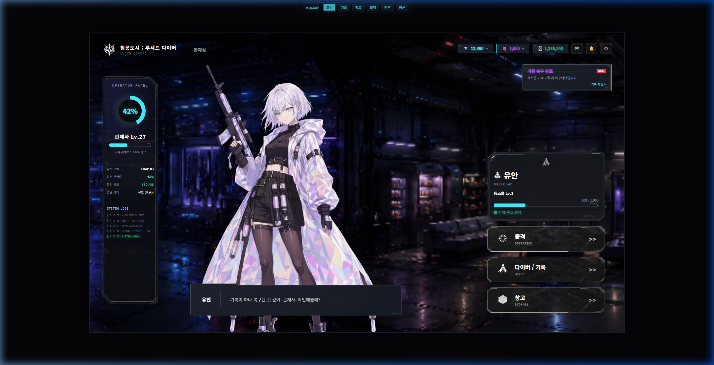
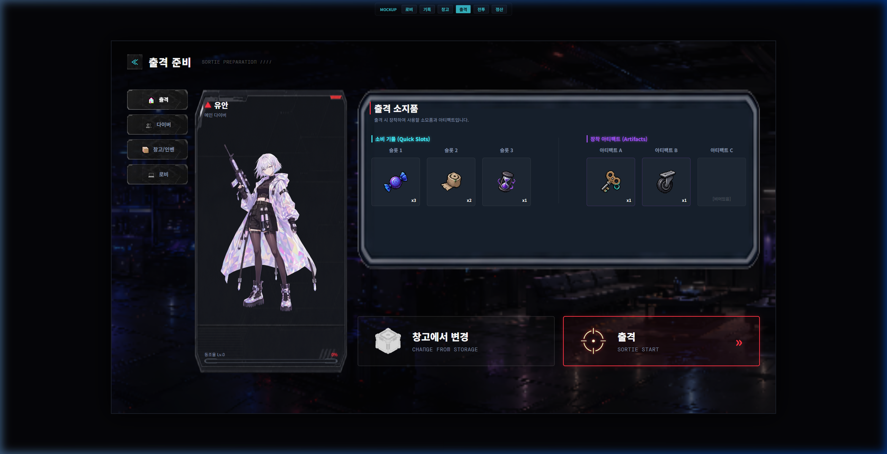
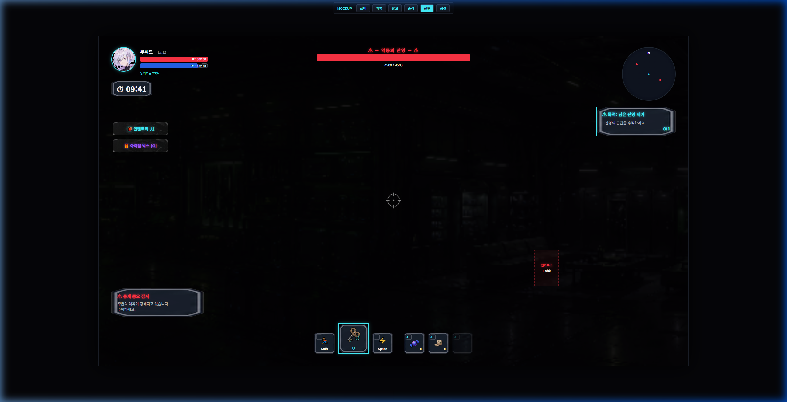
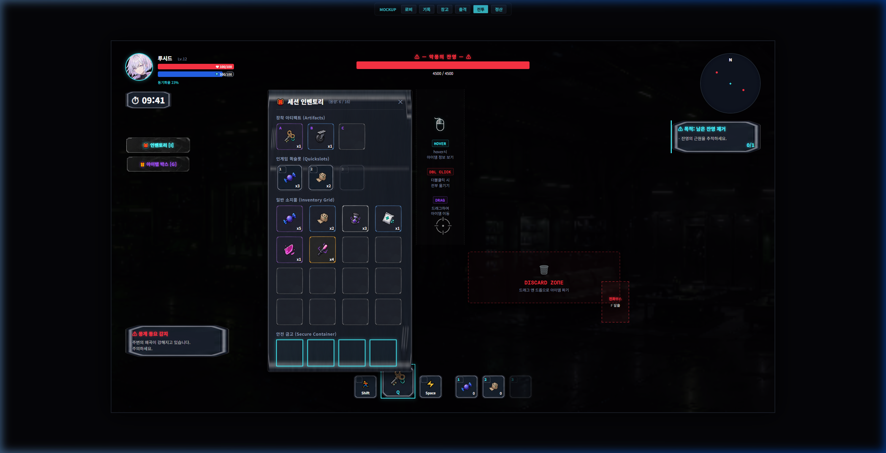
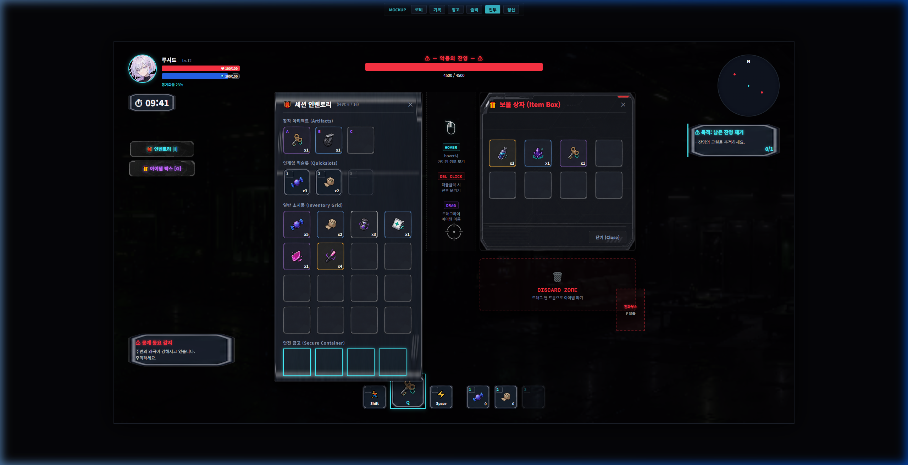
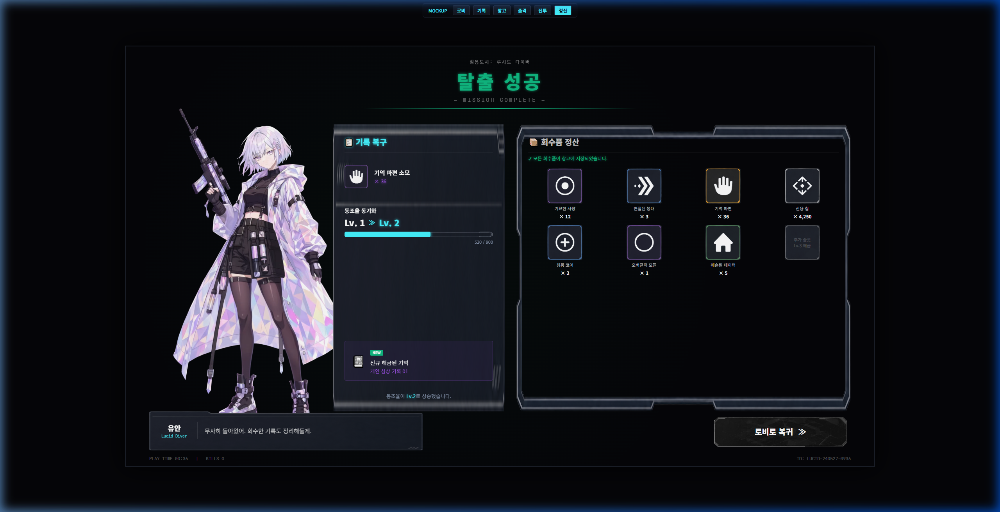
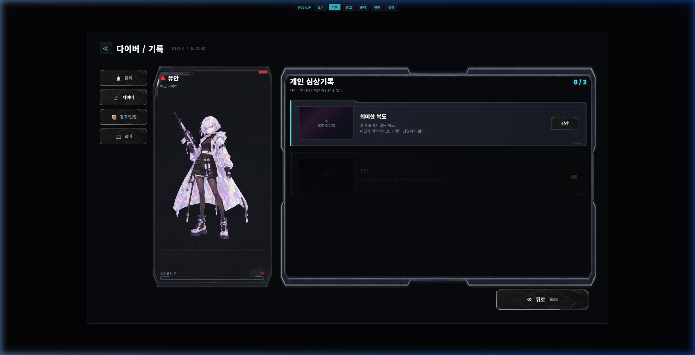
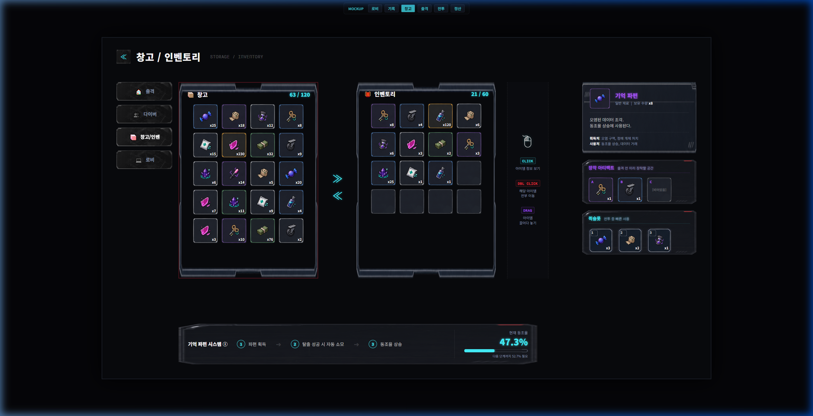

# 《침몽도시: 루시드 다이버》 UI 레이아웃 배치 명세서 v1.0

> **문서 목적**: 기획 이미지 레퍼런스([04_UI_이미지_레퍼런스/](../04_UI_이미지_레퍼런스/))와 실제 이미지 작업물([06_이미지_작업물/](../06_이미지_작업물/)), 그리고 Unity 프로젝트 내 씬·프리팹 구조를 교차 분석하여, **각 화면별로 어떤 UI 에셋을 어디에 배치해야 하는지** 구체적으로 명시한 기획 가이드 문서입니다.
>
> 팀원들이 "이 이미지를 어디에 넣으면 되는가?"에 대해 **즉시 참조**할 수 있도록 작성되었습니다.

| 버전 | 작성일 | 작업 내역 | 작성자 |
|:---:|:---:|:---|:---:|
| v1.0 | 2026-07-13 | 초안 작성 — 6개 화면 UI 배치 명세 | Antigravity (CP 분석) |
| v1.1 | 2026-07-13 | 웹 목업 실기 연동 및 세부 좌표, 패킷 크기, 튜토리얼 레이아웃 명세 보정 | Antigravity |
| v1.2 | 2026-07-13 | 인게임 세션 인벤토리 및 아이템 박스 개방 루팅 오버레이 상세 사양 추가 | Antigravity |
| v1.3 | 2026-07-13 | 기획 피드백을 기반으로 인게임 인벤토리 구성 통합(아티팩트/퀵슬롯/4x4그리드/안전금고) 및 병렬 개방 스펙 최적화 | Antigravity |
| v1.4 | 2026-07-13 | 익스트랙션 룰(모두 획득 삭제) 반영 및 상자 하단 아이템 버리기 드롭존 배치 사양 추가, 인벤토리 단독 활성화 시 조작 가이드 연동 | Antigravity |
| v1.5 | 2026-07-13 | 최종 통합 수정 사항을 일괄 반영한 전체 6개 화면 및 오버레이 실기 스크린샷 전면 재촬영 및 갱신 | Antigravity |

---

## 📋 목차

1. [디자인 시스템 개요](#1-디자인-시스템-개요)
2. [공통 UI 에셋 매핑 테이블](#2-공통-ui-에셋-매핑-테이블)
3. [화면별 UI 배치 명세](#3-화면별-ui-배치-명세)
   - [3.1 LobbyMainPanel (로비 관제실)](#31-lobbymainpanel-로비-관제실)
   - [3.2 SortiePreparePanel (출격 준비)](#32-sortiepreparepanel-출격-준비)
   - [3.3 InGame HUD (인게임 전투 UI)](#33-ingame-hud-인게임-전투-ui)
   - [3.4 ResultPanel (결과 리포트)](#34-resultpanel-결과-리포트)
   - [3.5 DiverRecordPanel (다이버/기록)](#35-diverrecordpanel-다이버기록)
   - [3.6 StorageInventoryPanel (창고/인벤토리)](#36-storageinventorypanel-창고인벤토리)
4. [에셋 제작 우선순위 및 체크리스트](#4-에셋-제작-우선순위-및-체크리스트)
5. [폰트 에셋 적용 가이드](#5-폰트-에셋-적용-가이드)

---

## 1. 디자인 시스템 개요

### 1.1 기본 해상도 및 Canvas 설정

| 항목 | 사양 |
|:---|:---|
| **기준 해상도** | 1920 × 1080 (16:9 FHD) |
| **Canvas Render Mode** | Screen Space - Overlay (로비/결과창), Screen Space - Camera (인게임 HUD) |
| **Canvas Scaler** | Scale With Screen Size, Match Width Or Height = 0.5 |
| **Reference Pixels Per Unit** | 100 |

### 1.2 컬러 팔레트 (Dark SF Theme)

| 용도 | Hex | 미리보기 | 비고 |
|:---|:---|:---|:---|
| 배경 기본 | `#0D0F14` | ⬛ | 최하위 배경 레이어 |
| 패널 기본 | `#161A24` | ⬛ | BoxSet 배경 기본색 |
| 테두리 라인 | `#2A3040` | 🟦 | 패널/슬롯 외곽선 |
| 강조 레드 | `#E03040` | 🟥 | 출격 버튼, 경고, LOST 스탬프 |
| 포인트 퍼플 | `#A335EE` | 🟪 | 에픽 등급, 다이버 아이콘 |
| HP 그린 | `#40E060` | 🟩 | HP 바, 긍정 효과 수치 |
| MP 블루 | `#4080FF` | 🔵 | MP 바, 마나석 관련 |
| 텍스트 주요 | `#E8E8F0` | ⬜ | 기본 텍스트 컬러 |
| 텍스트 보조 | `#9C9C9C` | 🔘 | 플레이버 텍스트, 서브 정보 |
| 링크 안정 | `#40FF80` | 🟢 | 상태: 링크 안정 표시 |
| 경고 옐로우 | `#FFD040` | 🟡 | 레전더리 등급, 주의 |

### 1.3 이미지 에셋 명명 규칙

```
[위치 접두사]_[콘텐츠명]_[변형].[확장자]

예시:
UI_BoxSet_4.png        → 범용 패널 프레임
UI_HudProfile.png      → 인게임 HUD 프로필 프레임
UI_QuickSlot.png        → 인게임 퀵슬롯 프레임
UI_Empty_Item_Slot.png  → 빈 아이템 슬롯 (일반 등급)
UI_Epic_Item_Slot.png   → 에픽 등급 아이템 슬롯
Yuan_ST.png             → 유안 전신 스탠딩
UI_YuanCircleProfile.png → 유안 원형 프로필
```

---

## 2. 공통 UI 에셋 매핑 테이블

모든 화면에서 반복 사용되는 공통 에셋의 **소스 파일 → Unity 적용 대상** 매핑입니다.

### 2.1 캐릭터 일러스트

| 에셋 파일 | 경로 (`06_이미지_작업물/`) | Unity 적용 위치 | 적용 방식 |
|:---|:---|:---|:---|
| [`Yuan_ST.png`](../06_이미지_작업물/01_캐릭터_일러스트/Yuan_ST.png) | `01_캐릭터_일러스트/` | `Canvas-Lobby` → `Image-DiverStanding`<br>`Canvas-SortiePrepare` → `Image-DiverPortrait`<br>`Canvas-DiverRecord` → `Image-DiverPortrait`<br>`Canvas-ResultPanel` → `Image-PlayerStanding` | Image 컴포넌트의 Source Image에 직접 할당. Preserve Aspect = ✅ |
| [`UI_YuanCircleProfile.png`](../06_이미지_작업물/01_캐릭터_일러스트/UI_YuanCircleProfile.png) | `01_캐릭터_일러스트/` | `Canvas-GameUI` → `Image-player` (좌상단 초상화) | Circular Mask 또는 `UI_HudProfile.png` 프레임 내부에 배치 |
| [`UI_HudProfile.png`](../06_이미지_작업물/01_캐릭터_일러스트/UI_HudProfile.png) | `01_캐릭터_일러스트/` | `Canvas-GameUI` → `Image-ProfileFrame` (초상화 외곽 프레임) | Image 컴포넌트, 초상화를 감싸는 Overlay 프레임 |

### 2.2 UI 프레임 및 배경

| 에셋 파일 | 용도 | Unity 적용 위치 | Sprite 설정 |
|:---|:---|:---|:---|
| [`UI_ExtraUIBox.png`](../06_이미지_작업물/03_UI_프레임_배경/UI_ExtraUIBox.png) | 대형 패널 배경 (관제실 정보, 출격 정보 등) | 로비·출격·기록·결과 패널의 메인 배경 | 9-Slice, Border 지정 후 Tiled 또는 Sliced |
| [`UI_BoxSet_4.png`](../06_이미지_작업물/03_UI_프레임_배경/UI_BoxSet_4.png) | 중형 정보 패널 (대사창, 안내 영역) | 대사 텍스트박스, NEWS 배너, 안내 문구 영역 | 9-Slice (상단 경계선 포함) |
| [`UI_BoxSet_5.png`](../06_이미지_작업물/03_UI_프레임_배경/UI_BoxSet_5.png) | 중형 헤더 포함 패널 (좌상단 해시마크 장식) | 좌측 정보 보드, 아이템 설명 영역 | 9-Slice |
| [`UI_TextBox.png`](../06_이미지_작업물/03_UI_프레임_배경/UI_TextBox.png) | 전체화면 오버레이형 패널 (결과창 배경) | `Canvas-ResultPanel` → 전체 배경 오버레이 | Stretch Fill |
| [`UI_AlphaBox.png`](../06_이미지_작업물/03_UI_프레임_배경/UI_AlphaBox.png) | 투명 외곽선 프레임 (슬롯 영역 구획) | 인벤토리·창고의 그리드 영역 구획 테두리 | 9-Slice, Preserve Aspect = ❌ |
| [`UI_SliderBG_2.png`](../06_이미지_작업물/05_인게임_HUD/UI_SliderBG_2.png) | HP/MP/동조율 게이지 바 배경 프레임 | 모든 Slider 컴포넌트의 Background Image | 9-Slice (좌우 둥근 끝단 보존) |
| [`UI_Button.png`](../06_이미지_작업물/03_UI_프레임_배경/UI_Button.png) | 범용 버튼 프레임 | 출격, 뒤로, 로비로 돌아가기 등 주요 버튼 | 9-Slice |
| [`UI_NovelBox.png`](../06_이미지_작업물/03_UI_프레임_배경/UI_NovelBox.png) | 그라데이션 배경 (상단 페이드) | 다이버 기록 화면 상단 분위기 연출 오버레이 | Stretch Fill, Alpha 조절 |
| [`Lobby_Controller_Concept_v2.1.png`](../04_UI_이미지_레퍼런스/로비_관제실/Lobby_Controller_Concept_v2.1.png) | 로비 배경 일러스트 | `Canvas-Lobby` → `Image-Background` | Stretch Fill, 임시→최종 교체 대상 |

### 2.3 아이템 슬롯 프레임

| 에셋 파일 | 용도 | Unity 적용 위치 |
|:---|:---|:---|
| [`UI_Empty_Item_Slot.png`](../06_이미지_작업물/03_UI_프레임_배경/UI_Empty_Item_Slot.png) | 빈 슬롯 / 일반 등급 아이템 슬롯 | 인벤토리·창고·퀵슬롯·출격 준비의 모든 빈 슬롯 |
| [`UI_Epic_Item_Slot.png`](../06_이미지_작업물/03_UI_프레임_배경/UI_Epic_Item_Slot.png) | 에픽 등급 아이템 보유 시 슬롯 | 에픽 등급 아이템이 들어있는 슬롯에 조건부 교체 |
| [`UI_QuickSlot.png`](../06_이미지_작업물/05_인게임_HUD/UI_QuickSlot.png) | 인게임 퀵슬롯 프레임 | `Canvas-GameUI` → `Consumable/Image-Background` |

### 2.4 엠블럼 및 로고

| 에셋 파일 | 경로 (`06_이미지_작업물/`) | Unity 적용 위치 |
|:---|:---|:---|
| [`UI_Logo.png`](../06_이미지_작업물/04_엠블럼_배너/UI_Logo.png) | `04_엠블럼_배너/` | 로비 좌상단 게임 로고, 로딩 화면 |
| [`UI_Diver.png`](../06_이미지_작업물/04_엠블럼_배너/UI_Diver.png) | `04_엠블럼_배너/` | 다이버 소속 엠블럼, 출격 준비·로비의 캐릭터 정보 옆 |

### 2.5 아이콘 세트 ([`UI_Set2.png`](../06_이미지_작업물/03_UI_프레임_배경/UI_Set2.png) 스프라이트 시트)

[`UI_Set2.png`](../06_이미지_작업물/03_UI_프레임_배경/UI_Set2.png)는 여러 UI 요소를 한 장에 모아놓은 **스프라이트 시트**입니다. Unity의 **Sprite Editor → Multiple 모드**로 슬라이스하여 개별 스프라이트로 분리 후 사용합니다.

| 시트 내 위치 | 추출 스프라이트명 (제안) | 용도 |
|:---|:---|:---|
| 좌상단 원형 (채움) | `SP_CircleFill` | HP/MP 원형 게이지 배경, 탐사 진행도 채움 |
| 좌상단 원형 (테두리) | `SP_CircleRing` | 프로필 프레임, 진행도 테두리 |
| 상단 직사각형 바 ×2 | `SP_BarMedium`, `SP_BarSmall` | 동조율 바, EXP 바 |
| 다이아몬드 4종 (회색·금·보라·흰) | `SP_Diamond_Normal`, `SP_Diamond_Rare`, `SP_Diamond_Epic`, `SP_Diamond_Common` | 아이템 등급 표시 마커 |
| 하단 직사각형 (대형) | `SP_InfoCard_Large` | 다이버 정보 카드 배경 |
| 사각 슬롯 (작음·빈) | `SP_SlotSmall` | 미니 인벤토리 슬롯 |
| 사각 슬롯 (금테) | `SP_SlotRare` | 레어/에픽 아이템 슬롯 표시 |
| 분홍 원형 | `SP_PingDot` | 미니맵 핑, 신규 알림 점 |
| 우측 유안 버스트 | `SP_Yuan_Bust` | 인게임 HUD 좌상단 초상화 (대체 가능) |
| 하단 아이콘 3열 (30+종) | `SP_Icon_*` 시리즈 | 스킬·상태이상·시스템 아이콘 세트 |

> [!TIP]
> [`UI_Set2.png`](../06_이미지_작업물/03_UI_프레임_배경/UI_Set2.png)를 Unity로 Import 시, **Sprite Mode = Multiple** → **Sprite Editor → Automatic Slice** (Min Size: 32px)로 1차 분리 후, 각 스프라이트의 이름과 경계를 수동 검수하세요.

---

## 3. 화면별 UI 배치 명세

### 3.1 LobbyMainPanel (로비 관제실)

**레퍼런스 이미지**:


**구현 예시 이미지 (웹 목업 실기 화면)**:


```
┌──────────────────────────────────────────────────────────────────────┐
│ [UI_Logo] 침몽도시: 루시드다이버    💎1,248 +  📦78,600 +  ⚡156/180 📧 📋 ⚙ │  ← 상단 바
├──────┬──────────────────────────────────────────────┬────────────────┤
│ 좌측  │                                              │  우측 메뉴     │
│ 정보  │      [Yuan_ST.png]                          │                │
│ 보드  │      유안 전신 스탠딩                         │ ┌────────────┐ │
│      │      (중앙~좌측 배치)                         │ │개인 심상 기록│ │
│관제사 │                                              │ │  01 / 해금  │ │
│Lv.27 │         [UI_Diver.png] 유안                  │ │ VIEW RECORD │ │
│      │         ⊛ 크리티컬 스나이퍼                   │ └────────────┘ │
│링크등급│         동조율 Lv.1 [UI_SliderBG_2]         │                │
│IV 안정│                                              │ ┌────────────┐ │
│      │         ● 상태: 링크 안정 ∿∿∿               │ │⊕ 출격       │ │
│탐사   │                                              │ │ OPERATION »»│ │
│진행도 │                                              │ └────────────┘ │
│42%   │                                              │ ┌────────────┐ │
│CHAP03│                                              │ │☆ 다이버 NEW │ │
│      │                                              │ │  DIVER  »» │ │
├──────┤                                              │ └────────────┘ │
│🔊 🔲│                                              │ ┌────────────┐ │
│      │ ┌─[UI_BoxSet_4]─대사창────────────────┐     │ │📦 창고      │ │
│      │ │ 유안                                  │     │ │ STORAGE »» │ │
│      │ │ ...기록이 하나 복구된 것 같아.         │     │ └────────────┘ │
│      │ │ 관제사, 확인해볼래?                    │     │                │
│      │ └──────────────────────────────────────┘     │                │
├──────┴──────────────────────────────────────────────┴────────────────┤
│ [NEWS] 신규 심상 해금: [채린→유안] 개인 심상 01                       │  ← NEWS 배너
└──────────────────────────────────────────────────────────────────────┘
```

#### 상세 배치 가이드

| 영역 | Unity 게임오브젝트 | 적용 에셋 | Anchor/Pivot 설정 | 크기 (px) | 비고 및 세부 속성 |
|:---|:---|:---|:---|:---|:---|
| **배경** | `Image-Background` | [`Lobby_Controller_Concept_v2.1.png`](../04_UI_이미지_레퍼런스/로비_관제실/Lobby_Controller_Concept_v2.1.png) → 향후 최종 BG 교체 | Stretch (0,0)-(1,1) | 풀스크린 (1920×1080) | - |
| **게임 로고** | `Image-Logo` | [`UI_Logo.png`](../06_이미지_작업물/04_엠블럼_배너/UI_Logo.png) | Top-Left, Pivot(0,1) | 280×48 | 좌상단 여백 (45px, 20px) |
| **상단 재화 바** | `Panel-TopBar` | [`UI_BoxSet_5.png`](../06_이미지_작업물/03_UI_프레임_배경/UI_BoxSet_5.png) (반투명) | Top-Right, Pivot(1,0.5) | W: 520, H: 40 | 우상단 재화 3종(다이아, 보관함, 배터리) 노출 |
| **유안 스탠딩** | `Image-DiverStanding` | [`Yuan_ST.png`](../06_이미지_작업물/01_캐릭터_일러스트/Yuan_ST.png) 또는 비디오 에셋 | Center-Bottom, Pivot(0.5, 0) | W: 700, H: 1000 | 투명 비디오/일러스트 중앙 배치 |
| **오퍼레이터 패널** | `Panel-Operator` | [`UI_ListBox.png`](../06_이미지_작업물/03_UI_프레임_배경/UI_ListBox.png) 9-Slice 배경 | Left-Middle, Pivot(0, 0.5) | W: 200, H: 820 | **수직 오리지널 비율(200x820) 준수**, 동조율 원형 다이얼(42%), 탐사 진행 스탯, 하단 네온 시스템 로그 터미널(실시간 텍스트 스크롤링) 통합 배치 |
| **다이버 정보 영역** | `Panel-DiverInfo` | [`UI_ExtraUIBox.png`](../06_이미지_작업물/03_UI_프레임_배경/UI_ExtraUIBox.png) 9-Slice 배경 | Center, Pivot(0.5, 0.5) | W: 400, H: 180 | 이름, 동조 레벨, 링크 안정도 바 오버레이 |
| **동조율 바** | `Slider-SyncRate` | BG: [`UI_SliderBG_2.png`](../06_이미지_작업물/05_인게임_HUD/UI_SliderBG_2.png), Fill: 민트/흰 그라데이션 | 이름 아래 | W: 200, H: 12 | - |
| **대사 텍스트박스** | `Panel-Dialogue` | [`UI_TextBox.png`](../06_이미지_작업물/03_UI_프레임_배경/UI_TextBox.png) 9-Slice | Bottom-Left, Pivot(0,0) | W: 760, H: 115 | **배치 이동**: `left: 360px`, `bottom: 60px`로 우측 시프트하여 메인 다이버 발밑에 조화롭게 정렬 |
| **우측 메뉴 버튼 4종** | `Button-Sortie`, `Button-Diver`, `Button-Storage`, `Button-Lobby` | [`UI_Button.png`](../06_이미지_작업물/03_UI_프레임_배경/UI_Button.png) 9-Slice | Right-Middle, 세로 정렬 | W: 300, H: 80 각 | 버튼 간격 16px. **4번째 버튼을 '로비'로 교체**하여 사이드바와 통일 |
| **개인 심상 기록 위젯** | `Panel-MemoryWidget` | [`UI_ExtraUIBox.png`](../06_이미지_작업물/03_UI_프레임_배경/UI_ExtraUIBox.png) 소형 + 썸네일 Image | Top-Right | W: 260, H: 160 | - |

> [!IMPORTANT]
> **P0 빌드에서는 "유안(Yuan)" 고정**이므로, [`Yuan_ST.png`](../06_이미지_작업물/01_캐릭터_일러스트/Yuan_ST.png)를 `Image-DiverStanding`에 직접 할당합니다. 현재 임시로 할당된 [`Chaerin_Standing_v2.1.png`](../06_이미지_작업물/01_캐릭터_일러스트/Chaerin_Standing_v2.1.png)는 교체 대상입니다.

---

### 3.2 SortiePreparePanel (출격 준비)

**레퍼런스 이미지**:


**구현 예시 이미지 (웹 목업 실기 화면)**:


```
┌──────────────────────────────────────────────────────────────────────┐
│ ≪ 출격 준비 / SORTIE PREPARATION    💎1,248 +  📦78,600 +  ⚡156/180│
├─────────────────────┬────────────────────────────────────────────────┤
│                     │  ┃ 이번 출격 소지품                           │
│  [UI_Diver] 유안    │                                              │
│  ⊛ 크리티컬 스나이퍼 │  ┌──[UI_Empty_Item_Slot]──┐ ┌──[UI_Empty_Item_Slot]──┐ │
│                     │  │  [슬롯 1]              │ │  [슬롯 2]              │ │
│  동조율              │  │  [아이템 아이콘]        │ │  [아이템 아이콘]        │ │
│  Lv.1               │  │  회복약 x 1             │ │  마나석 x 1             │ │
│  [UI_SliderBG_2]    │  └────────────────────────┘ └────────────────────────┘ │
│  300 / 1,000        │                                                       │
│                     │  ⚠ 장착한 소모품은 세션 중 사용 가능하다. INFORMATION │
│  [Yuan_ST.png]      │                                                       │
│  (전신 스탠딩)       │  ┌──────────────────────┐ ┌─────────────────────────┐ │
│                     │  │ 📦 창고에서 변경      │ │ ⊕ 출격          »»»   │ │
│                     │  │ CHANGE FROM STORAGE   │ │ [UI_Button] (레드 강조) │ │
│                     │  └──────────────────────┘ └─────────────────────────┘ │
├─────────────────────┴────────────────────────────────────────────────┤
│ ● 상태: 링크 안정 ∿∿∿                                               │
│ [NEWS] 출격 지역: 침묵도시 - 루시드 다이버 / CHAPTER 03: 불현의 변    │
└──────────────────────────────────────────────────────────────────────┘
```

#### 상세 배치 가이드

| 영역 | Unity 게임오브젝트 | 적용 에셋 | 배치 규격 (px) | 비고 및 세부 속성 |
|:---|:---|:---|:---|:---|
| **뒤로가기 버튼** | `Button-Back` | ≪ 아이콘 / 상자형 배경 플레이터 | Top-Left, 48×48 | **일원화 적용**: 텍스트 형태가 아닌 다른 화면과 동일한 상자 스타일 뒤로가기 적용 |
| **유안 카드 영역** | `Panel-DiverInfoCard` | [`UI_ExtraUIBox.png`](../06_이미지_작업물/03_UI_프레임_배경/UI_ExtraUIBox.png) 9-Slice 배경 | Left (`left: 240px`), W: 440, H: 820 | **일원화 적용**: 다이버 기록(s2) 캐릭터창의 레이아웃(동조율 하단, 이름 상단, Live2D 버스트 뷰 중앙)을 그대로 연동 |
| **유안 스탠딩** | `Image-DiverPortrait` | [`Yuan_ST.png`](../06_이미지_작업물/01_캐릭터_일러스트/Yuan_ST.png) 또는 비디오 에셋 | 카드 내 Center | - |
| **출격 소지품 영역** | `Panel-SortieItems` | [`UI_BoxSet._8.png`](../06_이미지_작업물/03_UI_프레임_배경/UI_BoxSet._8.png) | Right (`left: 710px`, `right: 45px`), W: 1165, H: 520 | **듀얼 레이아웃**: 좌측 소비 기물(3슬롯) 및 우측 장착 아티팩트(3슬롯)의 side-by-side 형태와 중앙 세로선 배치 |
| **소지품 슬롯 ×6** | `Button-Slot1` ~ 3 (소모품), `Button-Art1` ~ 3 (아티팩트) | [`UI_Empty_Item_Slot.png`](../06_이미지_작업물/03_UI_프레임_배경/UI_Empty_Item_Slot.png) | 각 영역 내부 가로 정렬 | 각 140×140 | 크기를 **140x140**으로 최적화하여 6개 슬롯이 가로로 조화롭게 정렬되도록 조정 |
| **창고에서 변경** | `Button-ChangeStorage` | [`UI_Button.png`](../06_이미지_작업물/03_UI_프레임_배경/UI_Button.png) 기본 | 좌측 버튼 (`left: 710px`), W: 570, H: 145 | **거대화 적용**: 기존 320x64에서 **570x145**로 확장 및 다이버 패널 바로 옆에 밀착 배치 |
| **출격 시작** | `Button-SortieStart` | [`UI_Button.png`](../06_이미지_작업물/03_UI_프레임_배경/UI_Button.png) + Tint `#E03040` | 우측 버튼 (`left: 1304px`), W: 570, H: 145 | **거대화 적용**: 버튼 크기 **570x145**로 확장 및 붉은 네온 하이라이트 효과 적용 |
| **좌측 사이드바** | `Panel-SideMenu` | [`UI_ExtraUIBox.png`](../06_이미지_작업물/03_UI_프레임_배경/UI_ExtraUIBox.png) | Left, W: 180, H: Stretch | **네비게이션 가이드 추가**: 4개 탭(출격/다이버/창고/로비) 배치 및 로비 링크 추가 |

---

### 3.3 InGame HUD (인게임 전투 UI)

**레퍼런스 이미지**: 

* 탑다운 뷰:
  
* 사이드 뷰:
  

**구현 예시 이미지 (웹 목업 실기 화면)**:
* HUD 기본 상태:
  
* 세션 인벤토리 오버레이 [I] 활성화 상태:
  
* 아이템 박스 루팅 오버레이 [G] 활성화 상태:
  

```
┌──────────────────────────────────────────────────────────────────────┐
│ [좌상단]                              [상단 중앙]           [우상단] │
│ ┌──────────────────┐                  ┌────────────┐    ┌────────┐ │
│ │[UI_HudProfile]   │                  │ 보스 HP 바 │    │미니맵  │ │
│ │[UI_YuanCircle]   │                  │(네임드 적) │    │        │ │
│ │ 유안이에          │                  └────────────┘    └────────┘ │
│ │ [HP 바] ███████░ │  목표 트래커                                   │
│ │ [MP 바] ████░░░░ │  Merchandise Collection & Base Defense        │
│ │                  │  Value Gained 187/23500                       │
│ └──────────────────┘  Obtain Cursed Monitor 0/1                    │
│                                                                     │
│ [좌측 채팅/로그]                                   Control Guide  O │
│ sdf has sent...                               Operations Manual  F1│
│                                                                     │
│ [배터리]                     [하단 중앙 - 액션 바]          [퀵슬롯] │
│  58%    [HP 수치] 287+19/580                                        │
│         [MP 수치] 17/180     ┌─────────────────────────┐  ┌──┐┌──┐ │
│                              │   🏃      🎯      ⚡    │  │1 ││2 │ │
│                              │ Shift     Q     Space   │  │x30│x25│ │
│                              └─────────────────────────┘  └──┘└──┘ │
│                              [Q 스킬 아이콘 (투척형)]               │
└──────────────────────────────────────────────────────────────────────┘
```

#### 상세 배치 가이드

| 영역 | Unity 경로 (`Canvas-GameUI`) | 적용 에셋 | 배치 | 비고 및 세부 속성 |
|:---|:---|:---|:---|:---|
| **프로필 프레임** | `Image-ProfileFrame` | [`UI_HudProfile.png`](../06_이미지_작업물/01_캐릭터_일러스트/UI_HudProfile.png) (다크 원형 프레임) | Top-Left, 80×80 | - |
| **프로필 초상화** | `Image-player` | [`UI_YuanCircleProfile.png`](../06_이미지_작업물/01_캐릭터_일러스트/UI_YuanCircleProfile.png) | 프레임 내부, 72×72, Mask 적용 | - |
| **HP 바** | `HpBar` (Slider) | BG: [`UI_SliderBG_2.png`](../06_이미지_작업물/05_인게임_HUD/UI_SliderBG_2.png)<br>Fill: `#40E060` → `#E03040` 그라데이션 | 이름 아래, W: 200, H: 16 | - |
| **MP 바** | `MpBar` (Slider) | BG: [`UI_SliderBG_2.png`](../06_이미지_작업물/05_인게임_HUD/UI_SliderBG_2.png)<br>Fill: `#4080FF` 그라데이션 | HP 아래, W: 200, H: 12 | - |
| **퀵슬롯 1-3** | `Consumable/Image-Background` | [`UI_QuickSlot.png`](../06_이미지_작업물/05_인게임_HUD/UI_QuickSlot.png) | Bottom-Right, 64×64 ×3 | **퀵슬롯 번호 정렬**: 각 슬롯 박스 좌측 상단의 핫키 번호 1, 2, 3의 좌표를 우측으로 `3px` 조정하여 사각형 인디케이터 중앙에 정렬 |
| **퀵슬롯 아이템 아이콘** | `Image-Consumable` | 아이템 DB iconSprite | 퀵슬롯 내부, 48×48 | - |
| **이동/유틸 스킬 슬롯** | `H-aslot` | [`Skill_Run.png`](../06_이미지_작업물/07_스킬_아이콘/Skill_Run.png), [`Skill_Dodge.png`](../06_이미지_작업물/07_스킬_아이콘/Skill_Dodge.png) | 하단 중앙, 80×80 ×2 | **Shift (달리기/구르기)** 및 **Space (각성/대시)** 스킬 맵핑 슬롯 (Q 슬롯과 동일한 `bg-igbox` 프레임 적용 및 비율 확대) |
| **Q 스킬 슬롯 (투척형)** | `H-skill` | [`Skill_Decoy.png`](../06_이미지_작업물/07_스킬_아이콘/Skill_Decoy.png) | 하단 중앙, 110×110 (강조) | **Q 단축키 투척 스킬**: 네온 블루 테두리(`border: 2px solid #45f3ff`) 및 외부 광채 효과 적용 (비율 확대) |

> [!NOTE]
> 현재 LevelDesignScene 내 Canvas는 **`Canvas-timer`** (전화부스 탈출 타이머)만 존재합니다. 인게임 HUD Canvas(`Canvas-GameUI`)는 **프리팹**에서 런타임 로드되므로, 프리팹 편집기에서 작업해야 합니다.
> - 프리팹 경로: `Assets/03_PreFabs/UI/Canvas-GameUI.prefab`

#### 3.3.1. 인게임 세션 인벤토리 오버레이 [I]
인게임 전투 진행 도중 `I` 키 또는 좌측 상단 `인벤토리` 버튼을 누르면 화면 중앙에 팝업되는 다크 세미트랜스페어런트 스타일의 세션 인벤토리 UI입니다.

| 영역 | Unity 경로 (`Canvas-GameUI/InventoryOverlay`) | 적용 에셋 | 배치 | 비고 및 세부 속성 |
|:---|:---|:---|:---|:---|
| **오버레이 배경** | `Panel-Inventory` | [`UI_BoxSet_5.png`](../06_이미지_작업물/03_UI_프레임_배경/UI_BoxSet_5.png) | Left-Floating (`left: 450px`, `top: 140px`), W: 420, H: 820 | 다크 글래스모피즘 세로형 플로팅 패널 |
| **장착 아티팩트 목록** | `Group-Artifacts` | [`UI_Empty_Item_Slot.png`](../06_이미지_작업물/03_UI_프레임_배경/UI_Empty_Item_Slot.png) (외 등급 프레임) | 패널 내 최상단, W: 78×78, 1×3 Row | 핫키 A, B, C 표시 및 아티팩트 장착 상태 표시 (일반 아이템 슬롯 타입) |
| **장착 퀵슬롯 목록** | `Group-Quickslots` | [`UI_QuickSlot.png`](../06_이미지_작업물/05_인게임_HUD/UI_QuickSlot.png) | 아티팩트 하단, W: 78×78, 1×3 Row | 핫키 1, 2, 3 표시 및 인게임 사용 가능한 퀵슬롯 수량 표시 |
| **일반 소지품 격자** | `Grid-Items` | [`UI_Empty_Item_Slot.png`](../06_이미지_작업물/03_UI_프레임_배경/UI_Empty_Item_Slot.png) (외 등급 프레임) | 패널 중앙, W: 78×78, 4×4 Grid (16슬롯) | 세션 획득 아이템이 보관되는 메인 격자판 |
| **안전 금고 목록** | `Group-Secure` | [`UI_Empty_Item_Slot.png`](../06_이미지_작업물/03_UI_프레임_배경/UI_Empty_Item_Slot.png) | 패널 최하단, W: 78×78, 1×4 Row | **네온 블루 테두리** 적용 (`border: 2.5px solid #45f3ff` 및 외부 광채 효과) |

#### 3.3.2. 인게임 아이템 박스 루팅 오버레이 [G]
필드 내 보물상자나 아이템 박스와 상호작용(`G` 키 또는 좌측 상단 `아이템 박스` 버튼 클릭)할 때 열리는 듀얼 컬럼 형태의 아이템 파밍/루팅 인터페이스입니다.

| 영역 | Unity 경로 (`Canvas-GameUI/LootingOverlay`) | 적용 에셋 | 배치 | 비고 및 세부 속성 |
|:---|:---|:---|:---|:---|
| **오버레이 배경** | `Panel-Looting` | [`UI_ExtraUIBox.png`](../06_이미지_작업물/03_UI_프레임_배경/UI_ExtraUIBox.png) | Right-Floating (`left: 1030px`, `top: 140px`), W: 440, H: 450 | **병렬 오버레이**: 상자 개방(루팅) 상호작용 시 좌측 인벤토리 패널, 중앙 조작 가이드, 우측 상자 패널이 가로로 병렬 활성화 |
| **조작 가이드 패널** | `Panel-LootingTuto` | [`UI_LeftClick.png`](../06_이미지_작업물/04_엠블럼_배너/UI_LeftClick.png) | 중앙 배치 (`left: 880px`, `top: 140px`), W: 140, H: 450 | **조작 피드백 통합**: 마우스 오버 시 정보 확인 및 이동 액션을 안내. 단독 인벤토리 활성화 시에도 함께 노출되도록 연동 |
| **상자 내용물 격자** | `Grid-BoxContents` | [`UI_Empty_Item_Slot.png`](../06_이미지_작업물/03_UI_프레임_배경/UI_Empty_Item_Slot.png) (외 등급 프레임) | 패널 중앙, W: 78×78, 4×2 Grid (8슬롯) | 보물상자 및 오브젝트 내 전리품 아이템 정렬 공간 (※ 익스트랙션 성격상 **모두 획득 기능 미제공**) |
| **아이템 버리기 구역** | `Panel-DiscardZone` | - | 우측 상자 하단 (`left: 1030px`, `top: 610px`), W: 440, H: 150 | **버리기 드롭존**: 인게임 드래그앤드롭으로 획득 전리품을 삭제/파기할 수 있는 붉은색 점선 테두리 패널 |
| **닫기 버튼** | `Button-CloseBox` | [`UI_Normal_Item_Slot.png`](../06_이미지_작업물/03_UI_프레임_배경/UI_Normal_Item_Slot.png) (그레이 틴트) | Bottom-Right, W: 130, H: 36 | 클릭 시 보물 상자 및 연동된 모든 오버레이(인벤토리, 가이드, 드롭존)를 일괄 종료 |

---

### 3.4 ResultPanel (결과 리포트)

**레퍼런스 이미지**:

* 성공:
  
* 실패:
  

**구현 예시 이미지 (웹 목업 실기 화면 - 탈출 성공)**:


#### 3.4.1 탈출 성공

```
┌──────────────────────────────────────────────────────────────────────┐
│ [UI_Logo] 침몽도시: 루시드다이버    💎1,248 +  📦78,600 +  ⚡156/180│
│ ┃ 결과 리포트 / RESULT REPORT                                       │
│                                                                      │
│                     [UI_Diver] 탈출 성공                              │
│  [Yuan_ST.png]           SUCCESS                                     │
│  (전신 스탠딩)       플레이 타임: 03:42                               │
│                                                                      │
│               ┌──[기록 복구]───────┐  ┌──[회수품 저장]──┐           │
│               │ 기억 파편 x1       │  │ 마나석 x1       │           │
│               │ 자동 사용          │  │ 창고 저장       │           │
│               │                    │  │                 │           │
│               │ 동조율 Lv.0→Lv.1   │  │ 회복약 x1       │           │
│               │                    │  │ 창고 저장       │           │
│               │ 개인 심상 기록 01  │  │                 │           │
│               │ 해금  »»»         │  │                 │           │
│               └────────────────────┘  └─────────────────┘           │
│                                                                      │
│  ┌─대사창──────────────────────────────┐                             │
│  │ 유안                                │  ┌────────────────────────┐ │
│  │ 이번엔... 네 목소리가 끝까지 들렸어. │  │ [로비로 돌아가기] »»»  │ │
│  └─────────────────────────────────────┘  └────────────────────────┘ │
│ 📋 DETAIL LOG                                                        │
└──────────────────────────────────────────────────────────────────────┘
```

#### 3.4.2 강제 각성 (실패)

실패 시에는 성공과 동일한 레이아웃 구조를 공유하되 다음이 다릅니다:

| 차이 항목 | 성공 | 실패 |
|:---|:---|:---|
| 헤더 텍스트 | `탈출 성공 SUCCESS` (흰색) | `강제 각성 FORCED AWAKENING` (빨간색 + 글리치) |
| 헤더 아이콘 | [`UI_Diver.png`](../06_이미지_작업물/04_엠블럼_배너/UI_Diver.png) | ⚠ 경고 삼각 아이콘 (빨간색) |
| 기록 복구 | 파편 소모 → 동조율 상승 | `기억 파편 유실` (흑백 아이콘) |
| 회수품 | `창고 저장` + 아이템 아이콘 | `전체 유실` + **LOST** 빨간 스탬프 오버레이 |
| 다이버 일러스트 | 기본 [`Yuan_ST.png`](../06_이미지_작업물/01_캐릭터_일러스트/Yuan_ST.png) | DreamScar 버전 (없을 경우 동일 이미지 + 어두운 필터) |
| 대사 텍스트 | 성공 대사 | 실패 대사 (빨간색 캐릭터명) |

#### 상세 배치 가이드

| 영역 | Unity 게임오브젝트 | 적용 에셋 | 배치 |
|:---|:---|:---|:---|
| **전체 배경** | `Image-ResultBG` | [`UI_TextBox.png`](../06_이미지_작업물/03_UI_프레임_배경/UI_TextBox.png) (어둡고 심전도 패턴) | Stretch (0,0)-(1,1) |
| **유안 스탠딩** | `Image-PlayerStanding` | [`Yuan_ST.png`](../06_이미지_작업물/01_캐릭터_일러스트/Yuan_ST.png) | Left, W: 500, Bottom-Anchored |
| **기록 복구 패널** | `Panel-StoryRestore` | [`UI_ExtraUIBox.png`](../06_이미지_작업물/03_UI_프레임_배경/UI_ExtraUIBox.png) 9-Slice | Center, W: 420, H: 320 |
| **회수품 패널** | `Panel-ExtractionStorage` | [`UI_ExtraUIBox.png`](../06_이미지_작업물/03_UI_프레임_배경/UI_ExtraUIBox.png) 9-Slice | Right, W: 280, H: 320 |
| **아이템 아이콘** | `Image-ManaStoneIcon`, `Image-PotionIcon` | 아이템 DB iconSprite | 각 패널 내부, 64×64 |
| **LOST 스탬프** | `Image-LostStamp` | 빨간 LOST 스탬프 이미지 (제작 필요) | 아이콘 위 오버레이, 80×40 |
| **대사창** | `Panel-PlayerDialogue` | [`UI_BoxSet_4.png`](../06_이미지_작업물/03_UI_프레임_배경/UI_BoxSet_4.png) 9-Slice | Bottom-Left, W: 520, H: 100 |
| **로비 복귀 버튼** | `Button-ReturnToLobby` | [`UI_Button.png`](../06_이미지_작업물/03_UI_프레임_배경/UI_Button.png) + Tint `#E03040` | Bottom-Right, W: 340, H: 64 |
| **DETAIL LOG** | `Button-DetailLog` | 아이콘 + TextMeshPro | Bottom-Left 코너, 48×48 |

---

### 3.5 DiverRecordPanel (다이버/기록)

**레퍼런스 이미지**:


**구현 예시 이미지 (웹 목업 실기 화면)**:


```
┌──────────────────────────────────────────────────────────────────────┐
│ ← 다이버 / 기록 DIVER/RECORD      💎1,248 +  📦78,600 +  ⚡156/180│
├─────────────────────┬────────────────────────────────────────────────┤
│                     │  개인 심상 기록 ⓘ                    1 / 20   │
│  [UI_Diver] 유안    │                                              │
│  ⊛ 크리티컬 스나이퍼│  ┌──────────────────────────────────┐  NEW   │
│                     │  │ [OPEN] 기록 01                    │        │
│  동조율 Lv.1        │  │ 비 오는 날의 플랫폼               │        │
│  [UI_SliderBG_2]    │  │ [썸네일 이미지]                   │        │
│  300 / 1,000        │  │ 비가 계속 내리던 날, 그녀는       │        │
│                     │  │ 플랫폼 위에서 누군가를 기다렸다.  │        │
│  ● 상태: 링크 안정  │  │        [기록 01 보기 »]           │        │
│                     │  └──────────────────────────────────┘        │
│  [Yuan_ST.png]      │                                              │
│                     │  ┌──────────────────────────────────┐        │
│ ┌─다이버 소개──────┐│  │ [LOCK] 기록 02                    │        │
│ │아카데미 출신의   ││  │ ???                               │        │
│ │정예 스나이퍼.    ││  │ 🔒 동조율 Lv.2 달성 시 해금       │        │
│ │침묵과 거리 속,   ││  └──────────────────────────────────┘        │
│ │모든 변수를 계산해││                                               │
│ │목표를 제거한다.  ││                            ┌────────────────┐ │
│ │[상세 정보 »]     ││                            │ ≪   뒤로       │ │
│ └──────────────────┘│                            └────────────────┘ │
│                                                                      │
├─────────────────────┴────────────────────────────────────────────────┤
│ [대사창] 유안: 유안의 소실된 기억 일부가 복구되었다.                  │
└──────────────────────────────────────────────────────────────────────┘
```

#### 상세 배치 가이드

| 영역 | Unity 게임오브젝트 | 적용 에셋 | 배치 규격 (px) | 비고 및 세부 속성 |
|:---|:---|:---|:---|:---|
| **좌측 사이드바** | `Panel-SideMenu` | [`UI_ExtraUIBox.png`](../06_이미지_작업물/03_UI_프레임_배경/UI_ExtraUIBox.png) | Left, W: 180, H: Stretch | **네비게이션 가이드 추가**: 4개 탭(출격/다이버/창고/로비) 배치하여 UI 접근성 향상 및 '로비' 버튼 통합 |
| **메인 바디 영역** | `Panel-Body` | - | `left: 240px`, W: 1635, H: Stretch | **간섭 오류 해결**: 사이드바에 우측 패널이 겹쳐 가려지지 않도록 left 여백(240px)으로 밀어 완전히 분리 |
| **유안 카드 영역** | `Panel-DiverCard` | [`UI_ExtraUIBox.png`](../06_이미지_작업물/03_UI_프레임_배경/UI_ExtraUIBox.png) 9-Slice 배경 | Left, W: 440, H: 820 | 캐릭터창 일원화 적용. 동조 레벨 및 상태바 하단 정렬, 바스트 뷰 동영상 및 중앙 배치 |
| **기록 리스트 영역** | `Panel-MemoryLogList` | [`UI_BoxSet_5.png`](../06_이미지_작업물/03_UI_프레임_배경/UI_BoxSet_5.png) 9-Slice | Right (`left: 710px`, `right: 55px`), W: 1155, H: 820 | - |

> [!WARNING]
> **메모리 로그 썸네일 이미지**가 현재 프로젝트에 **존재하지 않습니다**. 추상적인 기억 노이즈 패턴 또는 스토리 장면 스틸컷 이미지 2~3종을 제작해야 합니다.

---

### 3.6 StorageInventoryPanel (창고/인벤토리)

**레퍼런스 이미지**:


**구현 예시 이미지 (웹 목업 실기 화면)**:


```
┌──────────────────────────────────────────────────────────────────────┐
│ [UI_Logo] 침몽도시: 루시드 다이버    💎1,248 + 📦78,600 + ⚡156/180 │
├──────┬───────────────────────────┬─────┬──────────────────────┬─────┤
│ 좌측  │  📦 창고           63/120│     │ 📦 인벤토리    21/60 │     │
│ 메뉴  │  보관 중인 아이템         │     │ 보유 중인 아이템      │     │
│      │  ┌──┐┌──┐┌──┐┌──┐      │ »»  │ ┌──┐┌──┐┌──┐┌──┐   │     │
│ 출격  │  │25││18││30││15│      │ ««  │ │7 ││8 ││3 ││5 │   │     │
│ OPE. │  │마││마││회││회│      │클릭 │ │마││회││마││회│   │     │
│      │  └──┘└──┘└──┘└──┘      │으로 │ └──┘└──┘└──┘└──┘   │     │
│ 다이버│  ┌──┐┌──┐┌──┐┌──┐      │이동 │ ┌──┐┌──┐┌──┐      │     │
│ DIVER│  │40││50││10││20│      │     │ │2 ││6 ││+ │      │     │
│      │  └──┘└──┘└──┘└──┘      │     │ └──┘└──┘└──┘      │     │
│ 창고  │                        │     │                    │     │
│ 인벤  │  ┌──┐┌──┐               │ TIP │ ┌──┐              │     │
│ ◄현재 │  │35││12│               │아이템│ │+ │              │     │
│      │  └──┘└──┘               │을 드│                    │     │
│ 기록  │                        │래그 │ ╳ 퀵 슬롯 ·        │전투 │
│ REC. │  ┌──┐┌──┐               │하거나│ ┌──┐┌──┐┌──┐┌──┐ │중   │
│      │  │+ ││+ │               │더블 │ │1 ││2 ││3 ││4 │ │빠른 │
│      │  └──┘└──┘               │클릭 │ │x5││x3││x2││x2│ │사용 │
│      │                        │     │ └──┘└──┘└🔒┘└🔒┘ │     │
├──────┴───────────────────────────┴─────┴──────────────────────┴─────┤
│  기억 파편 — 창고/인벤토리에 보관되지 않는 특수 회수품                 │
│  [침몽도시에서 회수] »» [탈출 성공 시 자동 소모] »» [동조율 상승/기록]│
│  ⓘ 세션 중 회수한 기억 파편은 로비 자원으로 축적되지 않습니다.       │
├──────────────────────────────────────────────────────────────────────┤
│ [NEWS] 신규 심상 해금: [유안] 개인 심상 01                           │
└──────────────────────────────────────────────────────────────────────┘
```

#### 상세 배치 가이드

| 영역 | Unity 게임오브젝트 | 적용 에셋 | 배치 규격 (px) | 비고 및 세부 속성 |
|:---|:---|:---|:---|:---|
| **좌측 탭 메뉴** | `Panel-SideMenu` | [`UI_ExtraUIBox.png`](../06_이미지_작업물/03_UI_프레임_배경/UI_ExtraUIBox.png) 세로형 | Left, W: 180, H: Stretch | 4번째 버튼을 '로비' 버튼으로 교체 적용 |
| **창고 그리드** | `Panel-StorageGrid` | [`UI_AlphaBox.png`](../06_이미지_작업물/03_UI_프레임_배경/UI_AlphaBox.png) | Center-Left (`left: 240px`), W: 400, H: 520 | 4열 수직 레이아웃 배치 |
| **인벤토리 그리드** | `Panel-InventoryGrid` | [`UI_AlphaBox.png`](../06_이미지_작업물/03_UI_프레임_배경/UI_AlphaBox.png) | Center-Right (`left: 710px`), W: 340, H: 520 | 3열 수직 레이아웃 배치 |
| **조작 가이드 패널** | `Panel-Tutorial` | [`UI_LeftClick.png`](../06_이미지_작업물/04_엠블럼_배너/UI_LeftClick.png) | 두 그리드 사이 (`left: 640px`), W: 120, H: 300 | **조작 튜토리얼 추가**: 인벤토리와 아이템 설명란 사이에 마우스 조작 단축 가이드(CLICK, DBL CLICK, DRAG)를 세로로 정렬해 삽입 |
| **아이템 상세 설명** | `Panel-ItemDetail` | [`UI_BoxSet_5.png`](../06_이미지_작업물/03_UI_프레임_배경/UI_BoxSet_5.png) | Right (`left: 1100px`), W: 360, H: 225 | **위치 조정**: 높이 225px로 컴팩트하게 제한 |
| **아티팩트 장착부** | `Panel-ArtifactSlots` | [`UI_ExtraUIBox.png`](../06_이미지_작업물/03_UI_프레임_배경/UI_ExtraUIBox.png) | Right (`left: 1100px`), W: 360, H: 140 | **신규 추가**: 퀵슬롯 바로 위에 아티팩트 장착 공간(3슬롯, 단축키 A, B, C 표시) 배치 |
| **퀵슬롯 영역** | `Panel-QuickSlots` | [`UI_ExtraUIBox.png`](../06_이미지_작업물/03_UI_프레임_배경/UI_ExtraUIBox.png) | Right (`left: 1100px`), W: 360, H: 140 | **위치 조정**: 아티팩트 아래(top: 545px)로 이동 조정 및 단축키 숫자 중앙 정렬 |

---

## 4. 에셋 제작 우선순위 및 체크리스트

### P0 (즉시 필요 — 빌드 차단)

| # | 에셋 | 상태 | 사용처 | 담당 |
|:---:|:---|:---:|:---|:---:|
| 1 | [`Yuan_ST.png`](../06_이미지_작업물/01_캐릭터_일러스트/Yuan_ST.png) → Unity 실제 적용 | ✅ 제작완료, ⚠ 미적용 | 로비·출격·기록·결과 4개 Canvas | - |
| 2 | [`UI_YuanCircleProfile.png`](../06_이미지_작업물/01_캐릭터_일러스트/UI_YuanCircleProfile.png) → Unity 실제 적용 | ✅ 제작완료, ⚠ 미적용 | InGame HUD 초상화 | - |
| 3 | [`UI_HudProfile.png`](../06_이미지_작업물/01_캐릭터_일러스트/UI_HudProfile.png) → Unity 실제 적용 | ✅ 제작완료, ⚠ 미적용 | InGame HUD 초상화 프레임 | - |
| 4 | UI 프레임 7종 → Unity 실제 적용 | ✅ 제작완료, ⚠ 미적용 | 전체 화면 | - |
| 5 | 아이템 슬롯 프레임 2종 → Unity 실제 적용 | ✅ 제작완료, ⚠ 미적용 | 인벤토리·퀵슬롯·출격 | - |
| 6 | [`UI_Set2.png`](../06_이미지_작업물/03_UI_프레임_배경/UI_Set2.png) Sprite Sheet 분리 → Unity 임포트 | ✅ 제작완료, ⚠ 미분리 | 아이콘 세트 전체 | - |

### P0.5 (핵심 비주얼 — 플레이 품질)

| # | 에셋 | 상태 | 사용처 |
|:---:|:---|:---:|:---|
| 7 | 기묘한 사탕(마나석 대체) 아이콘 | ❌ 미제작 | 퀵슬롯·인벤토리·출격·결과 |
| 8 | 변질된 붕대(회복약 대체) 아이콘 | ❌ 미제작 | 퀵슬롯·인벤토리·출격·결과 |
| 9 | 기억 파편 전용 아이콘 | ❌ 미제작 | 결과창·기억 파편 안내 |
| 10 | 무기 아이콘 (유안 주무기) | ❌ 미제작 | InGame HUD 무기 슬롯 |
| 11 | LOST 스탬프 이미지 | ❌ 미제작 | 결과창 (실패 시) |
| 12 | 결과 배너 (MISSION COMPLETE / CONNECTION LOST) | ❌ 미제작 | 결과창 헤더 |
| 13 | 메모리 로그 썸네일 2~3종 | ❌ 미제작 | 다이버 기록 |
| 14 | 커스텀 TMP 폰트 에셋 (한글) | ❌ 미적용 | 전체 UI 텍스트 |

### P1 (다음 마일스톤)

| # | 에셋 | 상태 | 사용처 |
|:---:|:---|:---:|:---|
| 15 | 로비 최종 배경 일러스트 | ❌ 미제작 | 로비 배경 (현재 컨셉 스케치) |
| 16 | 유안 DreamScar 버전 일러스트 | ❌ 미제작 | 결과창 (실패 시) |
| 17 | 상자 파밍 전용 패널 프레임 | ❌ 미제작 | InGame 루팅 팝업 |
| 18 | 아이템 정보 툴팁 배경 플레이트 | ❌ 미제작 | 인벤토리 아이템 선택 시 |

---

## 5. 폰트 에셋 적용 가이드

### 5.1 현재 문제

모든 TextMeshPro 텍스트가 **`LiberationSans SDF`** (Unity 기본 번들 폰트)를 사용 중입니다.
- 한글 글리프 미포함 → 한국어 텍스트 **깨짐 위험**
- SF/다크 테마와 부조화 → 시각적 완성도 하락

### 5.2 권장 폰트

| 폰트명 | 라이센스 | 용도 | 특징 |
|:---|:---|:---|:---|
| **Pretendard** | SIL OFL | 기본 UI 텍스트 | 모던 고딕, 9개 웨이트, 한/영 모두 우수 |
| **Noto Sans KR** | SIL OFL | 대체 옵션 | Google 공식, CJK 커버리지 |
| **Orbit** | SIL OFL | 제목/헤더 강조용 | SF 감성의 기하학적 산세리프 |

### 5.3 적용 절차

1. `.ttf` 또는 `.otf` 파일을 `Assets/Fonts/` 폴더에 추가
2. Unity 메뉴 → **Window → TextMeshPro → Font Asset Creator**
3. **Source Font File**: 추가한 폰트 선택
4. **Atlas Resolution**: 4096×4096 (한글 글리프가 많으므로)
5. **Character Set**: **Custom Characters** → 한글 완성형 2350자 + 기본 라틴 + 특수문자 입력
6. **Generate Font Atlas** → **Save** (`.asset` 파일 생성)
7. 프로젝트 전체 TMP 컴포넌트의 Font Asset을 새 에셋으로 교체

> [!CAUTION]
> 한글 완성형 11,172자 전체를 넣으면 Atlas 크기가 매우 커집니다. **KS X 1001 완성형 2,350자**로 먼저 시작하고, 누락 글자가 발생하면 Fallback Font Asset을 추가하는 방식을 권장합니다.

---

## 📜 Revision History

| 날짜 | 버전 | 내용 | 작성자 |
|:---:|:---:|:---|:---:|
| 2026-07-13 | v1.0 | 초안 — 6개 화면 UI 배치 명세, 에셋 매핑, 우선순위 체크리스트 | Antigravity (CP 분석) |
