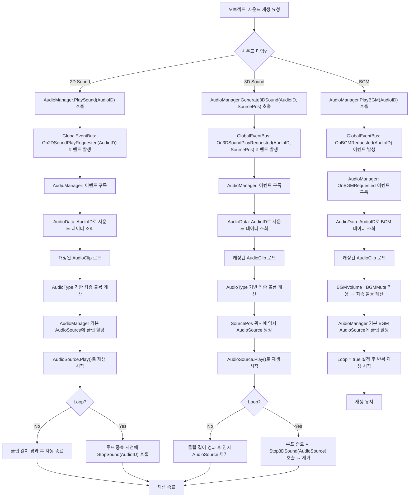

# P1_오디오 매니저_기획서_v1.0.0

---

## 0. 기획 의도 (Design Intent)

- **목표**: 인게임 사운드를 개별 오브젝트에서 각각 출력하게 하면 전체 사운드를 일괄 제어하기 어려우므로, 일관된 구조를 설정하여 효과적으로 제어할 수 있도록 한다.
- **핵심 가치**: AudioManager를 통해 인게임 사운드를 통일된 구조 하에서 관리한다.

---

## 1. 개요 (Overview)

| 항목 | 내용 |
|------|------|
| 기능명 | 오디오 매니저 |
| 담당자 | 기획: 우성혁 / 개발: OOO |
| 우선순위 | P1 (필수) |
| 상태 | 기획 중 (초안) |

---

## 2. 핵심 로직 (Core Logic)
### 2.1 플로우

### 2.2 규칙 및 조건
#### 2.2.1 오디오 매니저 구조 정의
- 오디오 매니저를 통한 사운드 재생 구조는 AudioManager와 AudioData로 구성된다.
    - AudioManager는 Assembly Definition 구조에서 ManagerAD 단계에 위치하며, 게임 내 사운드 재생을 위한 중계를 담당한다.
        - AudioManager 스크립트는 앱 실행 시 최초로 로드되는 씬에 싱글톤으로 배치한다. (모든 씬에서 통일된 구조로 사운드를 관리하기 위함)
        - AudioManager 오브젝트에 AudioSource 컴포넌트를 배치한다.
            - 2종류 이상의 사운드 타입을 동시에 재생할 수 있도록 AudioType 종류에 따라 별개의 AudioSource 컴포넌트를 사용한다.
    - AudioData는 Assembly Definition 구조에서 DefineAD 단계에 위치하며, 게임 내에서 재생할 사운드의 데이터 구조를 정의한다.
        - AudioData을 통해 받아온 사운드 데이터는 AudioId 및 AudioClip 구조를 참조하여 AudioManager에 Dictionary<int, string> 구조로 AudioId를 key, AudioClip을 value로 하여 캐싱해서 사용한다.

#### 2.2.2 사운드 출력
- 사운드 재생은 각 메소드에서 AudioManager에 재생 요청 이벤트를 호출하여 처리를 시작한다.
    - BGM을 재생할 경우 AudioManager.PlayBGM(int AudioID) 함수를 호출한다.
        - `AudioID`에 AudioData에서 재생할 사운드의 AudioID를 입력한다.
        - AudioManager에서 하위 단계의 스크립트로부터 사운드 재생 요청을 받을 수 있도록 GlobalEventBus에 OnBGMRequested<int> 이벤트를 추가한다.
            - int 변수에 AudioID 값을 입력하여 이벤트를 전달한다.
        - AudioManager에 OnBGMRequested 이벤트가 전달되면 이하의 단계에 따라 사운드를 재생한다.
            - 입력받은 AudioID 값을 AudioData에서 찾아 사운드 파일의 정보를 받아온다.
            - 받아온 사운드 파일의 AudioClip 파일명에 해당하는 사운드 파일을 캐싱한 리스트에서 찾아 클립 내부 변수에 입력한다.
            - BGMVolume과 BGMMute를 적용하여 따라 최종 음량을 계산한다.
            - AudioManager에 내장된 기본 AudioSource 중 BGM을 담당하는 컴포넌트에 클립을 할당한다.
            - 할당한 클립에 `Loop = true`를 적용하여 최종 음량 크기로 반복 재생한다.
    - 인게임 사운드를 입체감 없이 재생할 경우 AudioManager.PlaySound(int AudioID) 함수를 호출한다.
        - `AudioID`에 AudioData에서 재생할 사운드의 AudioID를 입력한다.
        - AudioManager에서 하위 단계의 스크립트로부터 사운드 재생 요청을 받을 수 있도록 GlobalEventBus에 On2DSoundPlayRequested<int> 이벤트를 추가한다.
            - int 변수에 AudioID 값을 입력하여 이벤트를 전달한다.
        - AudioManager에 On2DSoundPlayRequested 이벤트가 전달되면 이하의 단계에 따라 사운드를 재생한다.
            - 입력받은 AudioID 값을 AudioData에서 찾아 사운드 파일의 정보를 받아온다.
            - 받아온 사운드 파일의 AudioClip 파일명에 해당하는 사운드 파일을 캐싱한 리스트에서 찾아 클립 내부 변수에 입력한다.
            - 받아온 사운드 파일의 AudioType에 따라 최종 음량을 계산한다.
            - AudioManager에 내장된 기본 AudioSource에 클립을 할당한다.
            - 할당한 클립을 클립 길이 동안 최종 음량 크기로 재생한다.
            - 받아온 사운드 파일의 Loop 값에 따라 반복 재생 여부를 판정한다.
                - `Loop = false` : 클립 길이만큼 시간 경과 후 사운드 재생이 종료된다.
                - `Loop = true` : 루프가 종료되는 시점에 StopSound(int audioID)를 호출하여 사운드 재생을 종료한다.
    - 인게임 사운드에 입체감을 부여하여 재생할 경우 AudioManager.Generate3DSound(int audioID, Vector3 SourcePos) 함수를 호출한다.
        - `audioID`에 AudioData에서 재생할 사운드의 AudioID를 입력한다.
        - `SourcePos`에 사운드를 재생할 위치를 Vector3 값으로 입력한다.
        - AudioManager에서 하위 단계의 스크립트로부터 사운드 재생 요청을 받을 수 있도록 GlobalEventBus에 On3DSoundPlayRequested<int, Vector3> 이벤트를 추가한다.
            - int 변수에 AudioID 값을 입력하여 이벤트를 전달한다.
            - Vector3 변수에 SourcePos 값을 입력하여 이벤트를 전달한다.
        - AudioManager에 On3DSoundPlayRequested 이벤트가 전달되면 이하의 단계에 따라 사운드를 재생한다.
            - 입력받은 AudioID 값을 AudioData에서 찾아 사운드 파일의 정보를 받아온다.
            - 받아온 사운드 파일의 AudioClip 파일명에 해당하는 사운드 파일을 캐싱한 리스트에서 찾아 클립 내부 변수에 입력한다.
            - 받아온 사운드 파일의 AudioType에 따라 최종 음량을 계산한다.
            - SourcePos 위치에 AudioSource를 생성하고 (이하 '임시 오디오 소스') 임시 오디오 소스에 클립을 할당한다.
            - 할당한 클립을 클립 길이 동안 최종 음량 크기로 재생한다.
            - 받아온 사운드 파일의 Loop 값에 따라 반복 재생 여부를 판정한다.
                - `Loop = false` : 클립 길이만큼 시간 경과 후 임시 오디오 소스를 제거한다.
                - `Loop = true` : 루프가 종료되는 시점에 Stop3DSound(AudioSource source)를 호출하여 임시 오디오 소스를 제거한다.

#### 2.2.3 음량 관리
- 게임 내에서 재생하는 사운드의 음량 값은 AudioManager와 AudioData에 설정된 값을 곱하여 출력한다.
    - AudioManager에 내부 변수로 `MasterVolume`, `BGMVolume`, `SFXVolume`, `UIVolume`을 설정하여 각각 저장한다.
        - MasterVolume: 전체 사운드 음량
        - BGMVolume: 배경 음악 음량
        - SFXVolume: 효과음 음량
        - UIVolume: UI 사운드 음량
    - 각 음량 변수는 0.0 ~ 1.0 사이의 값을 가지는 float 자료형으로 정의된다.
    - 각 음량 변수는 클라이언트별 `PlayerPrefs`에 저장한다.
    - 각 사운드의 최종 음량은 `MasterVolume` 값에 `BGMVolume`, `SFXVolume`, `UIVolume` 중 각 사운드의 AudioType에 해당하는 음량 변수 값과 `AudioData.Volume` 값을 곱하여 출력한다.
        - 배경 음악 음량: AudioManager.MasterVolume × (MasterMute ? 0 : 1) × AudioManager.BGMVolume × (BGMMute ? 0 : 1) × AudioData.Volume
        - 효과음 음량: AudioManager.MasterVolume × (MasterMute ? 0 : 1) × AudioManager.SFXVolume × (SFXMute ? 0 : 1) × AudioData.Volume
        - UI 사운드 음량: AudioManager.MasterVolume × (MasterMute ? 0 : 1) × AudioManager.UIVolume × (UIMute ? 0 : 1) × AudioData.Volume
    - 환경설정에서 음소거 설정 시 해당 변수 값을 0으로 취급하여 곱한 값을 적용한다.
        - 각 사운드의 음소거 여부를 각각 `MasterMute`, `BGMMute`, `SFXMute`, `UIMute` 변수에 bool 자료형으로 저장한다.
        - 음소거 여부 변수가 true인 경우 해당 음량 변수 값에 0을 곱하는 수식을 추가하여 최종 음량을 계산한다.
            - MasterMute 여부와 AudioType별 음소거 여부를 별개로 체크하여 계산한다.

#### 2.2.4 사운드 종료
- `Loop = true` 상태로 재생 중인 사운드를 종료하기 위해 호출하는 이하의 함수를 AudioManager 스크립트에 추가한다.
    - StopBGM(): 현재 시점에 재생 중인 BGM 사운드의 재생을 중단한다.
    - StopSound(int audioID): audioID 값을 가지는 사운드가 AudioManager의 AudioSource에서 재생 중인 경우, 그 사운드의 재생을 중단한다.
    - Stop3DSound(AudioSource source): `source`로 전달받은 임시 오디오 소스 오브젝트의 사운드 재생을 중단하고 `source`를 제거한다.
    - StopAll(): 현재 시점에 재생 중인 모든 사운드의 재생을 중단한다.

---

## 3. 데이터 구조 (Data Structure)
### 3.1 AudioData
- 게임 내에서 재생할 사운드는 AudioData 테이블에서 이하의 데이터 구조를 부여하여 관리한다.

| 필드명 | 타입 | 설명 | 기본값 |
|--------|------|------|--------|
| `AudioID` | `int` | 사운드 ID. AudioManager에서 사운드 재생 시 인덱스로 사용한다. | 0 |
| `AudioClip` | `string` | 사운드 파일. 프로젝트의 Resources 폴더에 저장된 사운드 파일의 파일명을 입력한다. | null |
| `AudioType` | `enum (AudioType)` | 사운드 타입.  * `AudioType.BGM` : 배경 음악 파일.   * `AudioType.SFX` : 인게임 세션에서 재생되는 효과음 파일.   * `AudioType.UI` : UI 캔버스에서 재생되는 효과음 파일.   * 향후 추가 가능 | AudioType.SFX |
| `Volume` | `float` | 게임 내에서 사용할 사운드 음량의 기본 값. 0.0 ~ 1.0 사이의 값을 가지며, 사운드 파일 자체에 설정된 음량 값을 최대값 1.0으로 취급한다. | 1.0 |
| `Loop` | `bool` | 사운드 반복 여부.  * `true` : 사운드가 1회 재생 종료 후 반복해서 재생된다.   * `false` : 사운드가 1회만 재생되며, 종료 후 반복되지 않는다. | false |

---

### 3.2 AudioManager
- AudioManager에서 이하의 데이터를 취급하여 사운드 재생을 관리한다.

| 필드명 | 타입 | 설명 | 기본값 |
|--------|------|------|--------|
| `MasterVolume` | `float` | 전체 사운드 음량 | 1.0 |
| `BGMVolume` | `float` | 배경 음악 음량 | 1.0 |
| `SFXVolume` | `float` | 효과음 음량 | 1.0 |
| `UIVolume` | `float` | UI 사운드 음량 | 1.0 |
| `MasterMute` | `bool` | 전체 음소거 여부 | false |
| `BGMMute` | `bool` | 배경 음악 음소거 여부 | false |
| `SFXMute` | `bool` | 효과음 음소거 여부 | false |
| `UIMute` | `bool` | UI 사운드 음소거 여부 | false |
| `BGMAudioSource` | `AudioSource` | 배경 음악 재생 전용 AudioSource | null |
| `SFXAudioSource` | `AudioSource` | 2D 효과음 재생 전용 AudioSource | null |
| `UIAudioSource` | `AudioSource` | UI 사운드 재생 전용 AudioSource | null |
| `AudioClipCache` | `Dictionary<int, AudioClip>` | AudioID를 Key로 사용하는 AudioClip 캐시 | Empty |

---

## 📜 Revision History

| 날짜 | 버전 | 내용 | 작성자 |
|------|------|------|--------|
| [2026-07-13] | v1.0.0 | 초안 작성 | 우성혁 |
