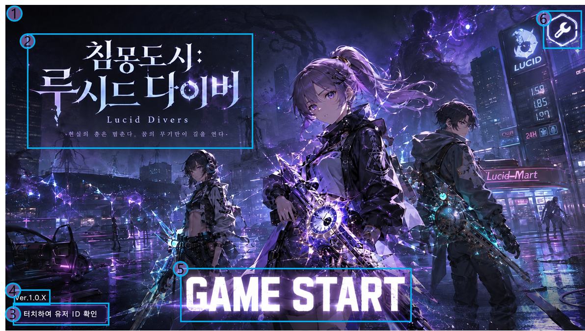

# P1_인트로 신 기획서_v1.0.0

# 인트로 신 기획서

## 0. 기**획 의도 (Design Intent)**

- 목표: 유저가 게임 앱 실행 시 처음으로 출력되는 인트로 씬으로, 로비를 통해 게임 플레이에 본격적으로 접근하기 전 게임 소개 및 옵션 설정을 실행할 수 있는 단계를 제공한다.
- 핵심 가치: 앱 실행 직후 시점에 게임의 이미지를 유저에게 각인시킨다.

## 1. 개요 **(Overview)**

| **항목** | **내용** |
| --- | --- |
| **기능명** | 인게임 실행 직후 게임 소개 신  |
| **담당자** | 기획: 우성혁 |
| **우선순위** | P1 (필수) |
| **상태** | 기획 중 (초안) |

## 2. 상세 시스템 명세

### 2.1 씬 정의

인트로 씬은 게임 앱 실행 시 가장 먼저 출력되는 신이다.

- 프로젝트의 신 폴더(Assets/01_Scenes)에 `GameStartScene`  신을 추가하여 인트로 신으로 사용한다.

---

### 2.2 진입 및 이탈 조건 제어

- **진입 트리거**: 앱 실행 시 가장 먼저 실행되는 신으로 설정한다.
    - Build Settings의 Scenes in Build 리스트에서 0번(맨 위 순서) 신으로 배치한다.
- **이탈 트리거**: 인트로 씬 UI 캔버스에 시작 버튼을 배치하여, 터치 시 게임 시작 처리를 실행한다.
    - 게임 시작 시 로컬 세이브 데이터의 `SaveData.isTutorialCompleted (bool)` 값을 읽어 튜토리얼을 실행할지 판정한다.
        - `isTutorialCompleted = true` (기존 세이브 유저): 로비 씬 (`LobbyScene`)을 로드하여 실행한다.
        - `isTutorialCompleted = false` (신규 생성 유저): 튜토리얼 씬(`TutorialScene`)을 로드하여 실행한다. (튜토리얼 씬에 대해서는 [P1_튜토리얼 기획서_v1.0.1](../P1_튜토리얼%20기획서_v1.0.1/P1_튜토리얼%20기획서_v1.0.1.md)를 참조)

---

### 2.3 로비 배경

인트로 씬 배경에 타이틀 로고 및 배경 영상을 출력한다.

- 인트로 씬 배경 패널에 타이틀 로고 이미지 구역 및 영상 출력 컴포넌트를 추가한다.
- 타이틀 로고 이미지 구역에 출력할 이미지의 파일 이름을 `IntroTitleImage (string)` 변수로 지정한다.
    - 타이틀 로고 이미지를 영상 출력 구역 상위에 출력한다.
- 영상 출력 컴포넌트에 출력할 영상의 파일 이름을 `IntroBackgroundAnimation (string)` 변수로 지정한다.
    - 인트로 씬 로딩이 완료된 시점부터 `IntroBackgroundAnimation` 에 지정한 파일을 배경 패널에 재생한다.
        - Loop 처리를 활성화하여 배경 패널에 재생하는 영상을 반복해서 재생한다.

#### 2.3.1 게임 시작 버튼

인트로 씬 배경의 임의 지점을 터치하여 게임을 시작할 수 있다.

- 인트로 씬 배경 패널에 Button 컴포넌트를 추가한다.
    - 배경 패널의 게임 시작 버튼은 유저 ID 출력 구역 버튼 및 설정 버튼보다 터치 우선순위가 낮도록 설정한다. (각 버튼이 중첩된 영역 클릭 시 유저 ID 출력 구역 버튼이나 설정 버튼에만 클릭 입력이 적용되도록)
- 배경 패널의 버튼을 터치 시 게임 시작 처리를 실행한다. ([2.2. 이탈 트리거](https://app.notion.com/p/P1_-_v1-0-0-39c2bb98425780278b97e7dcbb669851?pvs=21) 참조)

---

### 2.4 앱 정보 출력

인트로 씬에 앱의 버전 정보 및 유저 ID를 출력한다.

#### 2.4.1 버전 텍스트

- 인트로 씬 UI 캔버스에 버전 정보 텍스트 출력 구역을 배치한다.
- UnityEngine의 Player 설정에 저장된 Version 값을 `Application.version` 변수로 불러온다.
- 불러온 version 값을 버전 정보 텍스트 출력 구역의 Text로 출력한다.

#### 2.4.2 유저 ID

인트로 씬 UI 캔버스에 플레이어의 유저 ID를 출력하고 숨김 처리할 수 있다.

- 인트로 씬 UI 캔버스에 유저 ID 출력 구역을 배치하고, Button 컴포넌트를 추가한다.
- 플레이어 정보를 저장하는 `PlayerSaveData`  스크립트에 플레이어의 고유 ID 값을 지정하는 `UID (int)`  변수를 추가한다.
- 인트로 씬 UI의 관리 스크립트에 유저 ID 출력 숨김 여부를 관리하는 `isUIDHiding` 내부 변수를 설정한다.
- 인트로 씬 출력 시 isUIDHiding 변수 값을 읽어 유저 ID 출력 구역에 출력할 텍스트를 판정한다.
    - `true` (숨김): 기본 텍스트 `“터치하여 유저 ID 확인”` 을 출력한다.
    - `false` (공개): 유저 ID가 포함된 텍스트(예시: `"유저 ID: {UID}"`)를 출력한다.

---

### 2.5 환경설정 UI 출력

인트로 씬에서 설정 팝업을 출력하여 게임 환경설정을 조절할 수 있다.

- 인트로 씬 UI 캔버스에 설정 버튼을 배치한다.
- 설정 버튼 터치 시 UI Manager에 “환경설정 팝업 열기” 이벤트를 전달하여 설정 팝업을 활성화한다.

---

### 2.6 인트로 씬에서 게임 종료

인트로 씬에서 게임 종료 버튼을 입력하여 게임 종료 확인 팝업을 출력할 수 있다.

- 게임 종료 팝업은 InputSystem의 `UI` Action Map에 `QuitGame` Action을 추가하여 설정한다.
- QuitGame 키 입력 시 UIManager에 “게임 종료 확인 팝업 열기” 이벤트를 전달하여 게임 종료 확인 팝업을 활성화한다.

#### 2.6.1 게임 종료 확인 팝업

게임 종료 확인 팝업에서 게임 종료 여부를 결정한다.

- 게임 종료 팝업에서 “NO” 버튼 터치 시 게임 종료 확인 팝업만 닫는다.
- 게임 종료 팝업에서 “YES” 버튼 터치 시 게임 종료 처리를 실행한다.

---

## **3. 데이터 명세 (Data Specification)**

### 3.1 앱 정보 데이터

| 기획 명칭 | 변수명 | 타입 | 설명 | 기본값 |
| --- | --- | --- | --- | --- |
| 타이틀 로고 | `IntroTitleImage` | `string` | 인트로 씬의 배경 패널에 출력할 타이틀 로고 이미지 파일명 |  |
| 배경 영상 | `IntroBackgroundAnimation` | `string` | 인트로 씬의 배경 구역에 출력할 영상 파일명 |  |
| 앱 버전 | `Application.version` | `string` | 실행된 앱의 현재 버전 텍스트 | `1.0.0` |
| 유저 ID | `PlayerSaveData.UID` | `int`  | 개별 유저의 고유 ID 값 | `000000000` |
| 유저 ID 숨김 | `isUIDHiding` | `bool` | 인트로 씬에서 유저 ID 숨김 처리 여부 | `true` |

### 3.2 튜토리얼 진행 관리 데이터

| 기획 명칭 | 변수명 | 타입 | 설명 | 기본값 |
| --- | --- | --- | --- | --- |
| 튜토리얼 완료 플래그 | `isTutorialCompleted` | `bool` | 인게임 튜토리얼 종료 여부 기록 | `false` |

---

## **4. UI 배치 (UI Setting)**

### 4.1 인트로 신(Canvas_GameStartScene)

- 인트로 신은 이하의 UI 요소를 포함한다.

| No. | UI 요소 이름 | UI 요소 설명 |
| --- | --- | --- |
| 1 | 배경 | 신 배경 구역에 인트로 영상이 출력됨 |
| 2 | 타이틀 로고 | 게임의 타이틀 로고 이미지를 출력 |
| 3 | UID 텍스트 | 접속한 유저의 고유 UID 값을 출력하는 텍스트 |
| 4 | 버전 텍스트 | 실행된 앱의 현재 버전을 출력하는 텍스트 |
| 5 | 시작 버튼 | 터치하여 로비 신으로 진입하는 버튼의 존재를 텍스트로 안내 |
| 6 | 설정 버튼 | 터치하여 설정 팝업을 출력하는 버튼 |

### 4.2 설정 팝업(Canvas_OptionPopup) [**환경설정 기획 명세 필요**]

### 4.3 게임 종료 확인 팝업(Canvas_QuitGame)

- 게임 종료 팝업은 이하의 UI 요소로 구성된다.

| No. | UI 요소 이름 | UI 요소 설명 |
| --- | --- | --- |
| 1 | NO 버튼 | 터치하여 게임 종료 확인 팝업을 닫음 |
| 2 | YES 버튼 | 터치하여 앱 종료 처리를 실행 |
| 3 | 확인 텍스트 | 게임 종료 확인 팝업의 확인 텍스트를 출력 |

---

## 📜 Revision History

| 날짜 | 버전 | 내용 | 작성자 |
| --- | --- | --- | --- |
| 2026-07-13 | v1.0.0 |   • 인트로 씬 UI 구성 및 데이터 처리, 화면 전환 동작 명세 | 우성혁 |