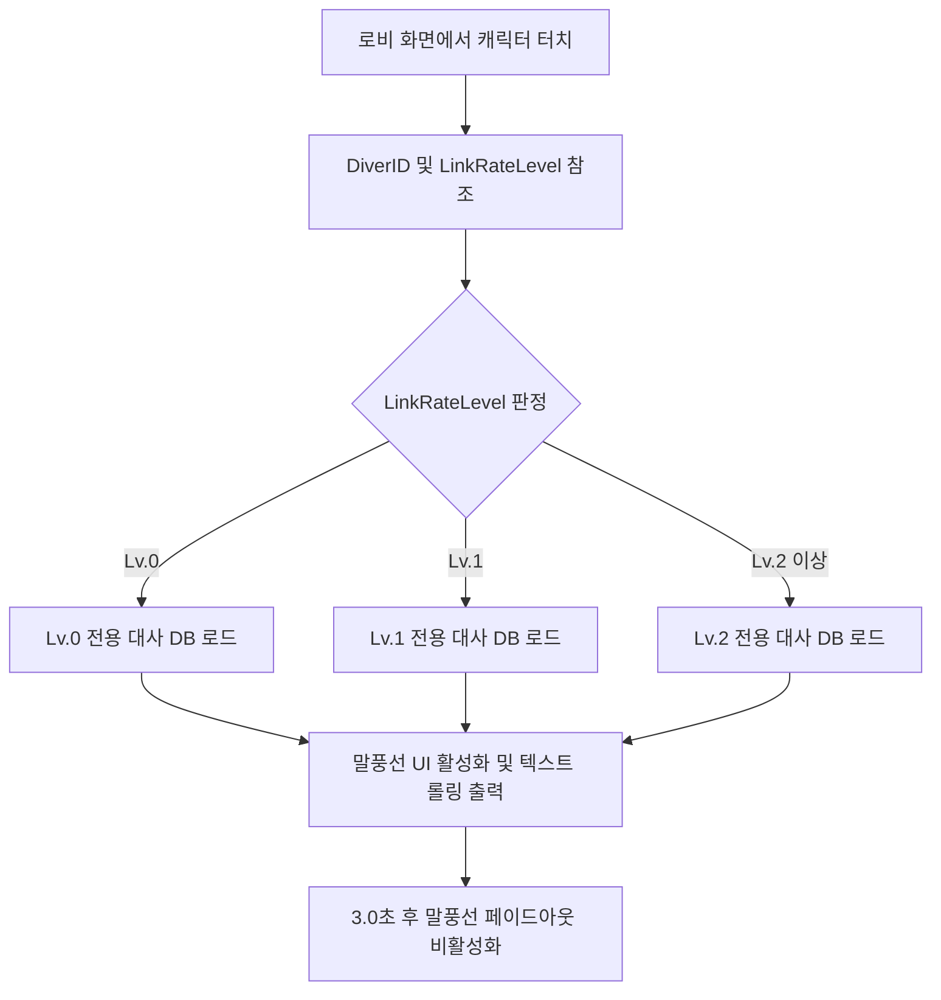

> [!IMPORTANT]
> 이 문서는 AI(Antigravity)가 작성한 초안입니다.
> 기획자/PM의 검토 및 승인 후 이 배너를 제거하면 '확정 사양'으로 인정됩니다.

# 로비_상호작용_시스템_기획서

## 0. 기획 의도 (Design Intent)
* **목표**: 로비 연출의 기술적 과부하를 줄이면서 캐릭터 애착 콘텐츠인 동조율 성장에 다른 대사 피드백을 직관적으로 연출한다.
* **핵심 가치**: 통짜 WebP 루프 애니메이션 위에 플레이어 동조율별 텍스트 리액션을 연결하여 서브컬처 교감 연출을 달성한다.

---

## 1. 개요 (Overview)

| 항목 | 내용 |
| :--- | :--- |
| **기능명** | 로비 WebP 루프 및 동조율 단계별 리액션 시스템 |
| **담당자** | 기획: 우성혁, 장수영 / 개발: 강다영 |
| **우선순위** | P1 (필수) |
| **상태** | 기획 중 (초안) |

---

## 2. 상세 시스템 명세

### 2.1 로비 WebP 루프 애니메이션 출력
* **렌더링 방식**: 
  * 로비 메인 화면 중앙에 배치되는 다이버 캐릭터는 Live2D 리깅 제어 대신 **대기 상태(Idle)를 통짜 루프 영상 파일(.webp)**로 제작하여 UI 이미지 컴포넌트에 출력한다.
  * WebP 파일은 투명 배경을 유지하며 로비 배경 이미지 위에 레이어로 얹어 렌더링한다.
* **파일 명명 규칙**: `Lobby_Idle_[DiverID].webp` (예: `Lobby_Idle_ChaeRin.webp`)

---

### 2.2 동조율 단계별 터치 리액션

* **동작 조건**: 플레이어가 로비에 배치된 캐릭터 영역(Hitbox Collider)을 마우스 클릭할 시 트리거된다.
* **대사 매핑**:
  * 캐릭터 터치 시 `SaveCharacterData.linkRateLevel (int)` 수치를 확인한다.
  * 각 레벨 단계(`0` ~ `2`)에 매핑된 리액션 대사 3종 중 1종을 무작위(Random) 선택하여 캐릭터 인근의 말풍선 UI에 표출한다.

---

### 2.3 비주얼노벨식 컷신 시스템
* **진입점**: 로비 복귀 후 `다이버/기록` 메뉴에서 해금된 심상 기록을 유저가 수동 클릭할 때 진입한다.
* **화면 구성**:
  * **전체 화면 일러스트(CG)**: 시나리오에 할당된 2D 배경/이벤트 일러스트 출력.
  * **대화창 패널**: 화면 하단에 반투명 대화창 UI, 발화자 이름, 대사 텍스트 출력.
* **기능 스펙**:
  * **텍스트 스피드**: 대사는 초당 25자 속도로 순차 출력(Typing Effect)된다. 마우스 클릭 시 즉시 100% 표출로 전환된다.
  * **백로그(Backlog) 기능**: 마우스 스크롤 휠을 올리거나 [Log] 버튼 터치 시 이전 대화 텍스트 이력을 역순 스크롤 형태로 조회할 수 있다.

---

## 3. 데이터 명세 (Data Specification)

### 3.1 동조율 단계별 대사 매핑 데이터 테이블
엑셀 시트에 기재되어 JSON으로 변환될 대사 구조 정의이다.

| 변수명 (Key) | 타입 | 설명 | 기본값 |
| :--- | :--- | :--- | :--- |
| `diverID` | `string` | 다이버 식별 고유 코드 (예: 유안 `CH_Yuan`) | `CH_Yuan` |
| `linkRateLevel` | `int` | 대사 출력을 위한 동조율 레벨 제한 | `1` |
| `reactionType` | `string` | 대사 종류 (`Lobby_Touch`, `Escape_Success`, `Escape_Failure`) | `Lobby_Touch` |
| `reactionID` | `string` | 개별 대사 식별 코드 | `RE_001` |
| `dialogueText` | `string` | 말풍선에 표출될 대사 텍스트 원문 | `(대사 텍스트)` |

---

### 3.2 동조율 단계별 대사 데이터 테이블 (다이버: 유안 기준)

플레이어(관제사)와 다이버 유안(Yuan)의 동조율 단계 성장에 따라 심리적 거리감과 애착 관계가 심화되는 방향으로 기획된 대사 테이블 명세이다.

* **서사적 설계 핵심**: 
  * 본 프로젝트에서 **동조율(Link Rate)의 레벨업은 다이버의 '파편화된 기억 상실이 회복되는 과정'**과 직접 연동됩니다.
  * 따라서 동조 레벨이 오를수록 유안은 극심한 기억 혼란과 두통에서 벗어나 점차 자아를 되찾고, 자신을 암흑 속에서 끌어올려 준 관제사를 자신의 정신적 핵심 지탱자(앵커)이자 구원자로 받아들이는 심리 변화의 서사가 대사 흐름에 고스란히 투영됩니다.

#### 📌 동조율 Lv.1 (기억 파편화 및 정신적 불안정 상태)
* **상태 설명**: 동조율이 지극히 낮아 자아 인지 상태가 매우 불안정하며, 기억 상실로 인한 혼란, 두통, 그리고 심연에 잠식당할지 모른다는 극심한 불안감을 표출하는 대사풀입니다.

| 대사 종류 (reactionType) | 식별 코드 | 대사 텍스트 (dialogueText) |
| :--- | :--- | :--- |
| `Lobby_Touch` | `RE_Y1_T01` | "아... 또 머리가 지끈거리네요. 제가... 방금 전까지 무슨 생각을 하고 있었죠, 관제사님?" |
| `Lobby_Touch` | `RE_Y1_T02` | "제 이름은 유안... 임무는 잠수... 맞나요?" |
| `Lobby_Touch` | `RE_Y1_T03` | "관제사님, 저를 놓치지 마세요. 이 어둠 속에서는 목소리마저 흩어져 버릴 것 같으니까요..." |
| `Escape_Success` | `RE_Y1_S01` | "휴, 다행히 복귀했지만, 아직 머릿속이 복잡하네요..." |
| `Escape_Success` | `RE_Y1_S02` | "성공한 건가요? 인도해 주셔서... 네, 감사합니다." |
| `Escape_Failure` | `RE_Y1_F01` | "으윽... 신호가 전부 끊겨서... 홀로 남겨진 기분이었어요. 아직도 몸이 떨려요." |
| `Escape_Failure` | `RE_Y1_F02` | "실패... 기억들이 산산조각 난 느낌이에요." |

#### 📌 동조율 Lv.2 (신뢰 형성 단계, 서서히 열리는 마음)
* **상태 설명**: 반복된 교신을 통해 마음을 조금씩 열고 있으며, 사적인 질문을 하거나 든든함을 표하는 대사풀입니다.

| 대사 종류 (reactionType) | 식별 코드 | 대사 텍스트 (dialogueText) |
| :--- | :--- | :--- |
| `Lobby_Touch` | `RE_Y2_T01` | "이제 관제사님의 목소리가 꽤 친숙하게 들려요. 든든한 느낌이에요." |
| `Lobby_Touch` | `RE_Y2_T02` | "현실의 하늘은 어떤가요? 이 어두운 심연 속에 있으면 가끔 궁금해져요." |
| `Lobby_Touch` | `RE_Y2_T03` | "저를 모니터링해주실 때, 머릿속이 조금 따뜻해지는 기분이 들어요." |
| `Escape_Success` | `RE_Y2_S01` | "제대로 탈출해서 정말 다행이에요. 관제사님이 끝까지 목소리를 들려주신 덕분이에요!" |
| `Escape_Success` | `RE_Y2_S02` | "돌아왔네요! 역시 관제사님이 열어준 탈출 지점은 신뢰할 수 있어요." |
| `Escape_Failure` | `RE_Y2_F01` | "아쉬워라... 거의 다 왔었는데... 그래도 관제사님이 무사하셔서 다행이에요." |
| `Escape_Failure` | `RE_Y2_F02` | "조금 무서웠지만... 관제사님이 계속 불러주신 덕에 정신을 차릴 수 있었어요." |

#### 📌 동조율 Lv.3 (깊은 연대, 반말이 섞인 친밀함과 염려)
* **상태 설명**: 깊은 유대감을 형성하여 동료를 넘어서 서로의 안위를 크게 염려하고 개인적인 진심을 고백하는 대사풀입니다. 친근함의 표시로 존댓말 사이에 자연스럽게 반말이 섞여 나오는 단계입니다.

| 대사 종류 (reactionType) | 식별 코드 | 대사 텍스트 (dialogueText) |
| :--- | :--- | :--- |
| `Lobby_Touch` | `RE_Y3_T01` | "관제사님이 없는 출격은 이제 생각도 하기 싫어. ...저, 제법 제멋대로가 되어버린 걸까요?" |
| `Lobby_Touch` | `RE_Y3_T02` | "혹시 피곤하진 않아? 제 상태보다는 관제사님 건강이 더 걱정돼서 그래요." |
| `Lobby_Touch` | `RE_Y3_T03` | "무슨 일이 있어도 내 앵커가 되어주기로 한 약속, 잊으면 안 돼요? 믿고 있으니까." |
| `Escape_Success` | `RE_Y3_S01` | "다녀왔어요! 하하, 관제사님 목소리를 들으니까 긴장이 싹 풀리는 거 있지?" |
| `Escape_Success` | `RE_Y3_S02` | "무사히 탈출할 거라고 믿었어. 관제사님이 내 뒤에 든든하게 서 있으니까." |
| `Escape_Failure` | `RE_Y3_F01` | "너무 자책하지 마, 관제사님. 내 컨디션이 나빴던 거니까... 다음엔 꼭 같이 성공하자." |
| `Escape_Failure` | `RE_Y3_F02` | "아야야... 조금 아프지만 괜찮아. 관제사님이야말로 너무 긴장하지 마요." |

#### 📌 동조율 Lv.4 (정신적 일체화 및 깊은 애착, 반말 위주의 절대적 연대)
* **상태 설명**: 싱크로 수준이 최고조에 달하여 영혼이 이어진 듯한 동조감을 공유하며, 절대적인 신뢰와 깊은 유착을 드러냅니다. 존칭 대신 편안한 어조와 반말을 적극 사용하여 거리감이 완전히 소멸된 단계입니다.

| 대사 종류 (reactionType) | 식별 코드 | 대사 텍스트 (dialogueText) |
| :--- | :--- | :--- |
| `Lobby_Touch` | `RE_Y4_T01` | "이제 눈을 감아도 관제사님이 느껴져. 신기하지? 우리 정말 영혼까지 이어진 걸까." |
| `Lobby_Touch` | `RE_Y4_T02` | "잃어버린 기억을 다 되찾는다고 해도, 관제사님과 함께하는 지금 이 순간보다 소중하진 않을 거예요." |
| `Lobby_Touch` | `RE_Y4_T03` | "제 곁에 계속 있어 줘요. 오직 관제사님만이 저를 현실에 묶어두는 유일한 생명줄이니까요." |
| `Escape_Success` | `RE_Y4_S01` | "다녀왔어요, 관제사님. 밑바닥에서도 당신 빛이 보여서 금방 길을 찾았어요." |
| `Escape_Success` | `RE_Y4_S02` | "성공할 때마다 관제사님과 더 깊게 엮이는 기분이에요. ...이대로 계속 같이 있고 싶을 정도로." |
| `Escape_Failure` | `RE_Y4_F01` | "많이 놀랐죠? 괜찮아요. 연결이 잠시 끊겼을 뿐인데도, 당신 마음은 다 느껴졌는걸." |
| `Escape_Failure` | `RE_Y4_F02` | "아쉽지만 괜찮아요. 다시 찾으러 가면 그만이니까." |

---

## 4. UI/UX 흐름 (UI/UX Flow)

### 4.1 터치 및 말풍선 노출 구조
* **터치 영역**: 캐릭터의 가로/세로 전신을 커버하는 투명 사각 히트박스 영역.
* **말풍선 인터랙션**:
  1. 캐릭터 클릭 ➡️ 말풍선 UI 페이드인(0.2초) 등장.
  2. 말풍선 텍스트 표출 및 대사 오디오 출력.
  3. 말풍선 노출 상태 유지(3.0초) 후 페이드아웃(0.5초) 처리.
  4. 말풍선 노출 중 캐릭터 재클릭 시, 기존 말풍선 내용이 즉시 갱신되며 노출 타이머(3.0초)가 초기화된다.

---

## 📜 Revision History

| 날짜 | 버전 | 내용 | 작성자 |
| :--- | :--- | :--- | :--- |
| 2026-07-10 | v1.0.0 | - 로비 상호작용 WebP 루핑 렌더링 명세 기획 - 동조율 레벨 연동형 터치 대사 매핑 규칙 설계 - 비주얼노벨식 컷신 UI 프레임워크 기능 명세 초안 작성 | Antigravity |
| 2026-07-16 | v1.1.0 | - 유안(Yuan) 캐릭터 기준 동조율 Lv.1~4 대사 풀 명세화 - 로비 대기 터치/탈출 성공/탈출 실패 조건별 피드백 대사 테이블 상세 수립 - Lv.1 대사에 기억 파편화 및 자아 분열/정신적 불안정 설정 반영 적용 | Antigravity, 장수영 |

