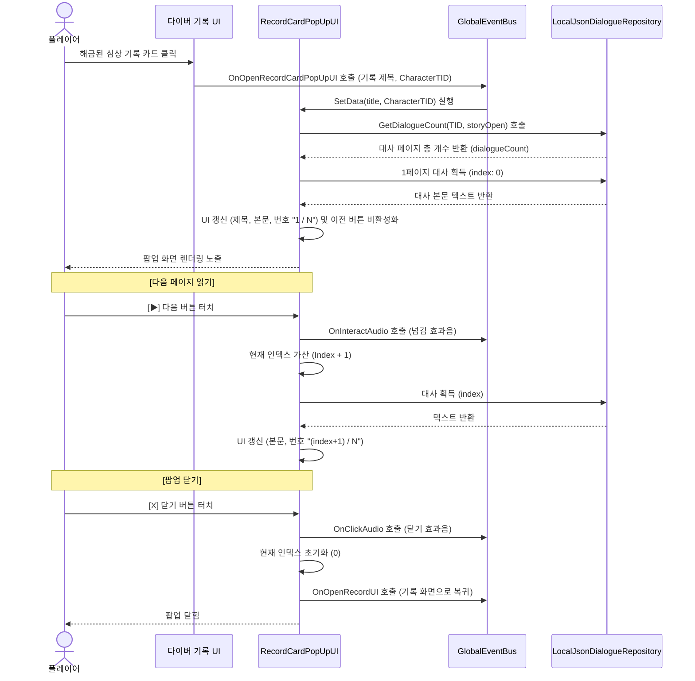

# 📜 심상_기록_팝업_대사_명세서 (v2.0.0)

> [!IMPORTANT]
> 본 문서는 [관제사_설정_정의서 v2.0.0](file:///c:/Project/Document_LucidDiver/LucidDiver_Document/검수/P1_컨셉기획/관제사_설정_정의서.md)의 세계관 규칙을 기반으로 작성되었습니다.
> 기억 손실 3단계 규칙, 관제 기록과 기억 파편의 구분, 동조율의 자아 복원 정의, 관제사의 결점, 유안의 주체성을 모두 반영합니다.

---

## 1. 기획 의도

### 1.1 심상기록의 서사적 기능

심상기록은 단순한 호감도 보상이나 과거 대화 모음이 **아니다**.

심상기록은 다음 역할을 **함께** 수행한다:

* 유안의 과거를 보여주는 **서사 보상**
* 관제사가 약속을 지켰다는 **증거**
* 기억 파편을 통해 유안의 자아를 복구하는 **치료 과정**
* 현재 유안이 과거의 자신을 이해하는 **계기**
* 플레이어와 유안이 현재 시점에서 다시 신뢰를 선택하는 **과정**

### 1.2 관제 기록과 기억 파편의 결합 구조

심상기록이 해금되려면 두 가지가 모두 필요하다:

1. **관제 기록**: 관제사가 보존한 통신 녹취와 사건 구조 (항상 존재)
2. **기억 파편**: 유안이 침몽도시에서 흘린 감정과 자아의 조각 (출격 성공 시 회수)

> 관제사는 기억하고 있다. 하지만 그 기억을 유안에게 돌려주기 위해서는 **유안 자신의 파편이 필요하다**.

동조율이 일정 수준에 도달하면, 관제 기록의 구조와 기억 파편의 감정이 결합하여 심상기록이 복구된다.

---

## 2. 시스템 동작 및 UI/UX 흐름

### 2.1 UI 개요 및 데이터 구조

팝업 UI 컨트롤러인 [RecordCardPopUpUI.cs](file:///c:/Project/UnityProject_LucidDiver/Assets/02_Scripts/UI/Lobby/RecordCardPopUpUI.cs)는 [LocalJsonDialogueRepository.cs](file:///c:/Project/UnityProject_LucidDiver/Assets/02_Scripts/System/Repository/LocalJsonDialogueRepository.cs)를 통해 [Dialogues.json](file:///c:/Project/UnityProject_LucidDiver/Assets/Resources/JSON/Dialogues.json) 파일에 정의된 `Situation: "storyOpen"` 대사 데이터를 읽어들여 1페이지(1화자 지문)씩 렌더링합니다.

### 2.2 터치 및 내비게이션 시퀀스



---

## 3. 데이터 구조

### 3.1 JSON 데이터 구조 정의

```json
{
  "CharacterTID": 101,
  "CharacterName": "Yuan",
  "Situation": "storyOpen",
  "RequiredLevel": 0,
  "DialogID": 101101,
  "Text": "대사 텍스트 내용"
}
```

> [!NOTE]
> 향후 확장 시 `RecordID`, `Timeline`, `Speaker`, `Emotion` 필드 추가를 검토한다.
> 현재 구조에서는 `DialogID` 대역으로 기록을 구분한다: `1011xx` = 기록 01, `1012xx` = 기록 02, `1013xx` = 기록 03, `1014xx` = 기록 04.

---

## 4. 대사 작성 원칙

[관제사_설정_정의서 v2.0.0](file:///c:/Project/Document_LucidDiver/LucidDiver_Document/검수/P1_컨셉기획/관제사_설정_정의서.md)의 §11 "대사 작성 스타일 가이드"를 따른다.

추가 원칙:

* 한 기록 안에서 주도 은유는 **하나만** 사용한다.
* 각 페이지는 다음 중 하나의 역할만 수행한다: 새 정보, 반응, 감정 변화, 관계 변화, 다음 기록에 남길 모티프.
* 강한 문장은 서사적 결정적 순간에만 한 번 사용한다.

---

## 5. 기록별 감정 변화표

| 기록 | 시점 | 유안의 상태 | 관제사의 상태 | 관계 단계 | 핵심 모티프 | 다음 기록으로 남기는 요소 |
| :--- | :--- | :--- | :--- | :--- | :--- | :--- |
| 기록 01 | 첫 출격 전 | 불안, 거리감 | 책임감, 조심스러움 | 작은 신뢰 시작 | 이름 부르기 | 목소리에 대한 기억 |
| 기록 02 | 반복 출격 후 | 기억 마모의 두려움 | 죄책감, 보호 욕구 | 실질적 파트너십 | 닻 | 링크 잔향 |
| 기록 03 | 임계 임무 전 | 공포, 자발적 결단 | 반대, 상실 공포 | 약속을 맡김 | 이름과 기록 | 튜토리얼 구출 |
| 기록 04 | 현재 | 경계, 자기 선택 | 절제, 과거 집착 극복 | 관계 재선택 | 두 번째 첫 만남 | 현재의 신뢰 |

---

## 6. 심상 기록 대사 원문

### 📖 기록 01. 면담 기록 #01: 약속 (The Promise)

* **시점**: 과거 — 유안이 처음 전속 다이버로 배정된 날
* **해금 조건**: 동조율 Lv.1 도달 시 감상 가능 (총 13페이지)
* **기록 요약**: 첫 대면의 사무적 인사에서 시작하여, 다른 다이버의 기억 손상을 목격한 두려움, 그리고 관제사가 추상적 맹세 대신 구체적인 행동을 약속하며 작은 신뢰의 씨앗이 심어지는 과정.
* **주도 은유**: 이름 부르기

| 페이지 | DialogID | 대사 |
| :---: | :--- | :--- |
| **1** | `101101` | **[유안]**: 처음 뵙겠습니다, 관제사님. 오늘부로 전속 다이버로 배정된 유안입니다. |
| **2** | `101102` | **[관제사]**: 반가워, 유안. 장비 피팅 상태는 어때? 조이는 곳이 있으면 바로 말해. |
| **3** | `101103` | **[유안]**: 치수는 맞는데... 생각보다 무겁네요. 교복을 사물함에 넣어두고 이걸 입으니까 실감이 안 나요. |
| **4** | `101104` | **[관제사]**: 처음에는 다들 그래. 도시 내부에 진입하면 내가 주파수를 맞추고 계속 지원할 거야. 순서대로 하면 돼. |
| **5** | `101105` | **[유안]**: ...대기실에서 다른 다이버가 초점 없이 멍하니 앉아 있는 걸 봤어요. 저도 저렇게 될 수 있는 건가요? |
| **6** | `101106` | **[관제사]**: 무서운 게 당연해. 숨기지 않아도 돼. 공포 반응이 나오면 즉시 보고해. 그게 네 상태를 지키는 첫 번째 절차야. |
| **7** | `101107` | **[유안]**: 절차요? 다른 관리자분들은 그냥 '잘 해' 라고만 하던데. |
| **8** | `101108` | **[관제사]**: 난 좀 달라. 네 신호가 약해지면 임무보다 철수를 우선할 거야. 그리고 일정 간격으로 네 이름을 부를 거니까, 대답이 가능하면 해줘. |
| **9** | `101109` | **[유안]**: 이름을요? ...왜요? |
| **10** | `101110` | **[관제사]**: 도시 내부에서는 자기가 누구인지 흐려질 수 있어. 이름을 듣는 건 자기 자신을 붙잡는 가장 간단한 방법이야. |
| **11** | `101111` | **[유안]**: ...그러면 저도 하나만 부탁해도 될까요? 제가 대답하지 못하더라도, 한 번만 더 이름을 불러주세요. |
| **12** | `101112` | **[관제사]**: 알겠어. 반드시 확인할게. 첫 출격, 잘 부탁해—유안. |
| **13** | `101113` | **[유안]**: ...네. 들리네요. |

---

### 📖 기록 02. 면담 기록 #02: 닻 (The Anchor)

* **시점**: 과거 — 여러 출격을 거친 후, 귀환 직후 면담
* **해금 조건**: 동조율 Lv.2 도달 시 감상 가능 (총 12페이지)
* **기록 요약**: 반복 출격으로 일상의 기억이 마모되어 가는 유안이, 관제사의 목소리를 귀환을 돕는 닻으로 인식하면서도 그 의존에 머무르지 않고 스스로 돌아오고 싶다는 의지를 드러내는 과정. 관제사는 유안이 언젠가 스스로 돌아올 수 있게 해야 한다는 과제를 인식한다.
* **주도 은유**: 닻

| 페이지 | DialogID | 대사 |
| :---: | :--- | :--- |
| **1** | `101201` | **[관제사]**: 유안, 몸은 괜찮아? 담요 가져올까? 이번 출격은 평소보다 오래 걸렸으니까. |
| **2** | `101202` | **[유안]**: 괜찮아요. 따뜻한 차 마시니까 좀 살 것 같아요. ...그런데 관제사님, 하나 물어봐도 돼요? |
| **3** | `101203` | **[관제사]**: 뭔데? |
| **4** | `101204` | **[유안]**: 학교 다닐 때 매점에서 자주 사 먹던 빵 이름이 있었는데... 오늘 갑자기 떠올리려니까 안 나와요. 그게 원래 이런 건가요? |
| **5** | `101205` | **[관제사]**: ......그럴 수 있어. 출격이 반복되면 오래된 일상 기억부터 흐려지는 경우가 있어. |
| **6** | `101206` | **[유안]**: 그렇구나... 빵 이름 같은 건 괜찮은데, 솔직히 무서운 건 다른 거예요. |
| **7** | `101207` | **[관제사]**: 뭐가 무서워? |
| **8** | `101208` | **[유안]**: 도시 내부에서 제가 어디까지 저인지 헷갈릴 때가 있어요. 그런데 관제사님이 제 이름을 부르면, 돌아갈 곳이 있다는 걸 알 수 있거든요. 그 목소리가 끊기면 어떡하나... 그게 제일 무서워요. |
| **9** | `101209` | **[관제사]**: ......미안해. 내가 너를 계속 보내고 있으니까. |
| **10** | `101210` | **[유안]**: 사과하지 마세요. 관제사님이 보내는 게 아니라 제가 가는 거예요. 그리고... 그 목소리가 지금은 제 닻이에요. 그게 없으면 흘러가 버릴 것 같으니까. |
| **11** | `101211` | **[관제사]**: 그러면 계속 부를게. 네가 대답하지 못할 때도. |
| **12** | `101212` | **[유안]**: 고마워요. ...언젠가는 저도 제 힘으로 돌아올 수 있으면 좋겠어요. 관제사님 목소리 없이도. |

---

### 📖 기록 03. 면담 기록 #03: 임계점 (The Threshold)

* **시점**: 과거 — 임계 임무 출격 직전 밤
* **해금 조건**: 동조율 Lv.3 도달 시 감상 가능 (총 18페이지)
* **기록 요약**: 침식 중심부가 유안의 고유 주파수와 일치하여 유안만 접근 가능한 상황. 관제사(최종 출격 승인권자)는 출격 취소를 강력히 요구하지만, 유안은 다른 다이버의 잔류 신호와 자신의 판단을 근거로 출격을 주장한다. 관제사는 잔류 신호를 직접 재분석한 뒤 조건부 승인을 내리고, 그 판단에 대한 책임을 짊어진다. 마지막 약속에서 유안은 기억을 잃은 미래의 자신에게 과거를 강요하지 말고, 이름을 불러 다시 선택하게 해달라고 부탁한다.
* **주도 은유**: 이름과 기록
* **전제**: 관제사는 전속 다이버의 최종 출격 승인권자다. 관제사의 서명 없이는 유안이 출격할 수 없다.

| 페이지 | DialogID | 대사 |
| :---: | :--- | :--- |
| **1** | `101301` | **[관제사]**: 유안. 이번 출격은 중단해야 해. 침식 중심부의 위험 지수가 임계점을 넘었어. |
| **2** | `101302` | **[유안]**: 브리핑 자료 다 읽었어요. 중심부의 링크 주파수가 저하고 일치한다면서요? 다른 다이버로는 접근 자체가 안 되고. |
| **3** | `101303` | **[관제사]**: 그렇다고 널 보낼 순 없어. 이 수준의 침식이면 네 기억뿐만 아니라 인격 구조 자체가 해체될 수 있어. |
| **4** | `101304` | **[유안]**: 알아요. 내가 나를 잃어버리고... 관제사님을 잊게 될 수도 있다는 거. |
| **5** | `101305` | **[관제사]**: 대체 작전을 올렸어. 시간을 벌면 다른 방법을 찾을 수 있어. |
| **6** | `101306` | **[유안]**: 보고서에 적혀 있었어요. 이번 연결 창이 닫히면 중심부 접근이 장기간 불가능하다고. 그리고... 안쪽에 아직 반응하는 다이버 신호가 남아 있잖아요. |
| **7** | `101307` | **[관제사]**: 그건 잔류 신호일 수도 있어. 확인되지 않은 데이터야. |
| **8** | `101308` | **[유안]**: 확인되지 않았으니까 가는 거예요. 누군가의 신호가 아직 남아 있는데 이 창이 닫히면 그건 진짜 끝이잖아요. |
| **9** | `101309` | **[관제사]**: 유안... 난 널 이 작전에 투입하는 승인서에 서명할 수 없어. |
| **10** | `101310` | **[유안]**: 관제사님. 저는 지금까지 관제사님 지시를 따르며 여기까지 왔어요. 이번에는 제가 판단하고 싶어요. |
| **11** | `101311` | **[관제사]**: ......잔류 신호 로그를 다시 볼게. |
| **12** | `101312` | **[관제사]**: ...하나가 아니네. 최소 두 건의 반응이 간헐적으로 잡히고 있어. 네 말대로 아직 살아 있는 다이버가 있을 가능성은 있어. |
| **13** | `101313` | **[관제사]**: 조건부로 승인할게. 하지만 철수 신호가 떨어지면 어떤 상황이든 즉시 돌아와. 이건 명령이야. |
| **14** | `101314` | **[유안]**: 약속할게요. 그리고 관제사님도 하나만요. |
| **15** | `101315` | **[유안]**: 제가 다 잊어버리더라도, 그때의 저를 억지로 되돌리지는 말아 주세요. 대신 제가 어떤 사람이었는지, 무엇을 선택했는지만 기록해 두세요. |
| **16** | `101316` | **[관제사]**: ......기록할게. 네 선택을. 그걸 어떻게 받아들일지는 미래의 너에게 맡길게. |
| **17** | `101317` | **[유안]**: 그리고 다시 만난 저에게 제 이름을 불러주세요. 믿을지는... 미래의 제가 다시 선택하게 해주세요. |
| **18** | `101318` | **[유안]**: 다녀올게요, 관제사님. |

---

### 📖 기록 04. 면담 기록 #04: 두 번째 첫 만남 (The Second First Meeting)

* **시점**: 현재 — 유안이 과거 기록을 열람한 직후
* **해금 조건**: 동조율 Lv.4 도달 시 감상 가능 (총 12페이지)
* **기록 요약**: 과거 기록 속 자신이 낯설게 느껴지는 유안. 관제사가 과거를 강요할까 경계하지만, 관제사는 과거의 유안을 되돌리려 했던 자신의 욕구를 고백하고 현재의 유안에게 아무것도 요구하지 않는다. 유안은 과거 기록이 아니라 지금까지의 경험을 근거로 관제사를 다시 신뢰하기로 선택한다.
* **주도 은유**: 선택

| 페이지 | DialogID | 대사 |
| :---: | :--- | :--- |
| **1** | `101401` | **[유안]**: 관제사님. 기록... 봤어요. |
| **2** | `101402` | **[관제사]**: 그래. |
| **3** | `101403` | **[유안]**: 이상하네요. 분명 제 목소리인데, 남의 이야기를 듣는 것 같았어요. |
| **4** | `101404` | **[관제사]**: 억지로 네 기억이라고 생각할 필요는 없어. |
| **5** | `101405` | **[유안]**: 그럼 관제사님은요? 기록 속의 제가 돌아오길 기다린 건 아니에요? |
| **6** | `101406` | **[관제사]**: ...기다렸던 적은 있어. 네가 기억을 잃기 전과 똑같아지길 바랐던 적도 있고. |
| **7** | `101407` | **[유안]**: 지금은요? |
| **8** | `101408` | **[관제사]**: 지금의 널 과거 기록에 맞추는 건, 또 한 번 널 잃는 일이라는 걸 알았어. |
| **9** | `101409` | **[유안]**: 그런 말은 조금 반칙이네요. |
| **10** | `101410` | **[관제사]**: 미안. |
| **11** | `101411` | **[유안]**: 기록 속의 제가 왜 믿었는지는 아직 모르겠어요. 하지만 요즘의 관제사님은... 조금 알 것 같아요. |
| **12** | `101412` | **[유안]**: 그러니까 이번에는 제가 정할게요. 다음 출격도 잘 부탁합니다, 관제사님. |

---

## 7. 튜토리얼 연결 지점

심상기록 03과 현재 시점 사이의 사건은 [관제사_설정_정의서 v2.0.0](file:///c:/Project/Document_LucidDiver/LucidDiver_Document/검수/P1_컨셉기획/관제사_설정_정의서.md) §9 "서사 연표"를 따른다.

핵심 연결:

* 기록 03의 마지막 대사 → 유안이 출격 → 임계 붕괴 → 관제사가 구출 (튜토리얼)
* 기록 04는 기록 01~03을 열람한 **이후** 해금되므로, 유안이 과거를 확인한 뒤의 반응을 보여준다.

---

## 8. 현재 시점 반영 규칙

* 과거 기록(01~03)만으로 유안과 관제사의 관계를 **완성하지 않는다**.
* 현재 시점에서 두 사람이 다시 신뢰를 쌓는 과정이 반드시 필요하다.
* 기록 04는 이 원칙의 최소 구현이다. 향후 추가 기록에서 관계의 심화를 다룰 수 있다.

---

## 📜 Revision History

| 날짜 | 버전 | 내용 | 작성자 |
| :--- | :--- | :--- | :--- |
| 2026-07-17 | v1.0.0 ~ v1.12.0 | 초안 작성부터 용어 통일 및 감정선 점진화까지의 반복 개선 | Antigravity, 장수영 |
| 2026-07-17 | v2.0.0 | - 관제사_설정_정의서 v2.0.0 기반 전면 재작성<br>- 기억 손실 3단계 규칙과 링크 잔향 반영<br>- 관제 기록 + 기억 파편 결합 구조 명시<br>- 기록 01~03 대사 전면 리라이트 (은유 제한, 감정 단계 분리, 유안 주체성 강화, 관제사 결점 반영)<br>- 기록 04 "두 번째 첫 만남" 신규 추가 (현재 시점, 유안의 재선택)<br>- 기록별 감정 변화표 신설<br>- 대사 작성 원칙 및 피해야 할 문장 가이드 연동<br>- 튜토리얼 연결 지점 및 현재 시점 반영 규칙 추가<br>- 기록 03 제목 변경 (마지막 심침 → 임계점) | Antigravity, 장수영 |
| 2026-07-17 | v2.1.0 | - 기록 01: 유안의 반응 "들리네요" 추가 (12→13페이지)<br>- 기록 02 요약: "유일한 닻" 표현 수정, 자립 의지 반영<br>- 기록 03: 관제사 승인 전환 과정 보강 (16→18페이지), 잔류 신호 재분석→조건부 승인 흐름 추가, 관제사 답변 수정 ("전부" → 선택 존중)<br>- 기록 04: 설명형 대사를 자연스러운 감정 대화로 전면 교체, 관제사 결점(과거 집착) 고백 장면 강화 | Antigravity, 장수영 |
