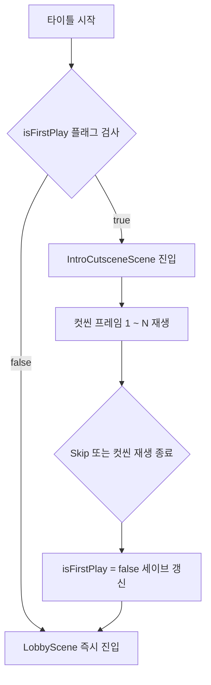

> [!IMPORTANT]
> 이 문서는 AI(Antigravity)가 작성한 초안입니다.
> 기획자/PM의 검토 및 승인 후 이 배너를 제거하면 '확정 사양'으로 인정됩니다.

# 인트로_컷씬_기획서

## 0. 기획 의도 (Design Intent)
* **목표**: 플레이어가 게임을 기동했을 때, 메인 플레이에 돌입하기 전 세계관 내러티브를 설명하는 인트로 컷씬을 제공하여 배경 이해를 돕는다.
* **핵심 가치**: 저장 데이터 플래그를 체크하여 최초 1회만 노출되는 스킵 가능한 인트로 컷씬 연출을 구축한다.

---

## 1. 개요 (Overview)

| 항목 | 내용 |
| :--- | :--- |
| **기능명** | 최초 실행 인트로 컷씬 및 저장 연동 시스템 |
| **담당자** | 기획: 우성혁, 장수영 / 개발: 강다영 |
| **우선순위** | P1 (필수) |
| **상태** | 기획 중 (초안) |

---

## 2. 상세 시스템 명세

### 2.1 인트로 진입 및 최초 기동 조건
* **진입 트리거**: 타이틀 화면에서 마우스 입력을 받아 게임 시작을 처리하는 시점에 트리거된다.
* **최초 기동 여부 판정**:
  * `PlayerSaveData.isFirstPlay (bool)` 변수 값을 참조한다.
  * `isFirstPlay == true`: 인트로 컷씬 씬(`IntroCutsceneScene`)을 로드하여 컷씬을 실행한다.
  * `isFirstPlay == false`: 인트로 컷씬을 바이패스(Bypass)하고 즉시 로비 씬(`LobbyScene`)으로 진입한다.
  * *세이브 갱신 시점*: 인트로 컷씬이 정상적으로 끝까지 재생되거나, 플레이어가 [Skip]을 선택하여 로비 씬 진입에 성공한 프레임에 `isFirstPlay` 변수 값을 `false`로 갱신하고 저장(Save) 처리한다.

---

### 2.2 스토리보드 및 연출 흐름

인트로 컷씬은 총 4개의 컷(Cut)으로 구성된다. 우선 캐릭터 및 배경 키 일러스트 이미지를 생성한 후, 이를 **AI 영상 제작(AI Video Generation) 기술**을 활용하여 동적인 비디오 클립으로 제작 및 가공해 씬 상에서 재생한다.

#### 컷 01: 무너져 내리는 질서
* **비주얼**: 왜곡된 도시의 스카이라인 정적 CG 일러스트 출력. 화면 미세 노이즈 이펙트 지속.
* **오디오**: 불안정한 주파수 혼선음 (라디오 노이즈 SFX) 및 저음의 앰비언트 사운드 루프 재생.
* **대사/내레이션**: `"이곳은 현실이 아니다. 왜곡된 꿈이 삼켜버린 도시..."`

#### 컷 02: 다이버의 기원
* **비주얼**: 다이버 채린이 마스크를 조여 매고 심연을 내려다보는 CG 일러스트 출력.
* **오디오**: 깊은 한숨 소리 SFX 출력 후 단조로운 피아노 BGM 페이드인 시작.
* **대사/내레이션**: `"꿈속의 기물을 모으고, 보스를 처치해야만 이 잠에서 깨어날 수 있어."`

#### 컷 03: 파멸의 징후
* **비주얼**: 몬스터(꿈식자)의 거대한 실루엣이 마트를 향해 나아가는 CG 일러스트 출력.
* **오디오**: 지진음(화면 흔들림 - Camera Shake 0.5초 연동) 및 괴수 포효음 SFX.
* **대사/내레이션**: `"남은 시간이 부족해. 침식이 더 시작되기 전에 서둘러야 해."`

#### 컷 04: 진입
* **비주얼**: 전화부스 문이 열리며 강렬한 빛이 뿜어져 나오는 CG 일러스트 출력.
* **오디오**: BGM 급정지 후 빛의 개방음 SFX. 화면 전체 화이트 아웃(White-out) 페이드 처리(1.5초).
* **대사/내레이션**: `"잠수 준비... 목표는 심장부다."`

---

### 2.3 스킵(Skip) 기능
* **인터랙션**: 화면 우측 상단에 고정된 [Skip] 버튼을 마우스 터치 시 트리거된다.
* **처리 규칙**:
  * [Skip] 버튼 클릭 시 즉시 화면이 페이드아웃되며 컷씬 출력을 강제 종료한다.
  * 즉시 `isFirstPlay = false`를 저장하고 로비 씬(`LobbyScene`)을 로드한다.

---

## 3. 데이터 명세 (Data Specification)

### 3.1 세이브 연동 데이터 필드

| 기획 명칭 | 변수명 | 타입 | 설명 | 기본값 |
| :--- | :--- | :--- | :--- | :--- |
| 최초 기동 여부 | `isFirstPlay` | `bool` | 최초 실행 시 컷씬 재생 판단 플래그 | `true` |
| 현재 컷 갱신 인덱스 | `currentCutIndex` | `int` | 인트로 컷씬 내 진행 중인 컷 번호 (1~4) | `1` |

---

## 4. UI/UX 흐름 (UI/UX Flow)

* **대사 출력 속도**: 내레이션 텍스트는 1글자당 `0.05초` 간격으로 타이핑 이펙트 출력.
* **조작 피드백**:
  * 텍스트 출력 중 화면을 클릭하면 타이핑 효과가 생략되고 전체 텍스트가 즉시 표출된다.
  * 전체 텍스트가 표출된 상태에서 화면을 한 번 더 클릭하면 다음 컷(`currentCutIndex++`)으로 전이된다.
  * 마지막 4번째 컷에서 화면을 클릭할 시 로비 씬으로의 씬 전환을 개시한다.

---

## 📜 Revision History

| 날짜 | 버전 | 내용 | 작성자 |
| 2026-07-10 | v1.0.0 | - 최초 기동 조건문 및 세이브 데이터 바인딩 룰 명세 - 스토리보드 4개 컷별 비주얼/오디오/내레이션 데이터 확정 - 스킵 처리 씬 강제 전환 예외 처리 수립 | Antigravity |
| 2026-07-10 | v1.1.0 | - PM 피드백 반영: 정적 일러스트를 캐릭터 이미지 생성 후 AI 영상 제작 기술을 연계하여 동적 비디오 클립으로 가공하는 연출 수단 보강 | Antigravity |
