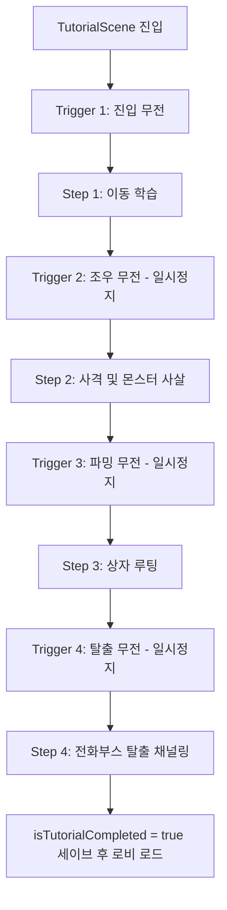
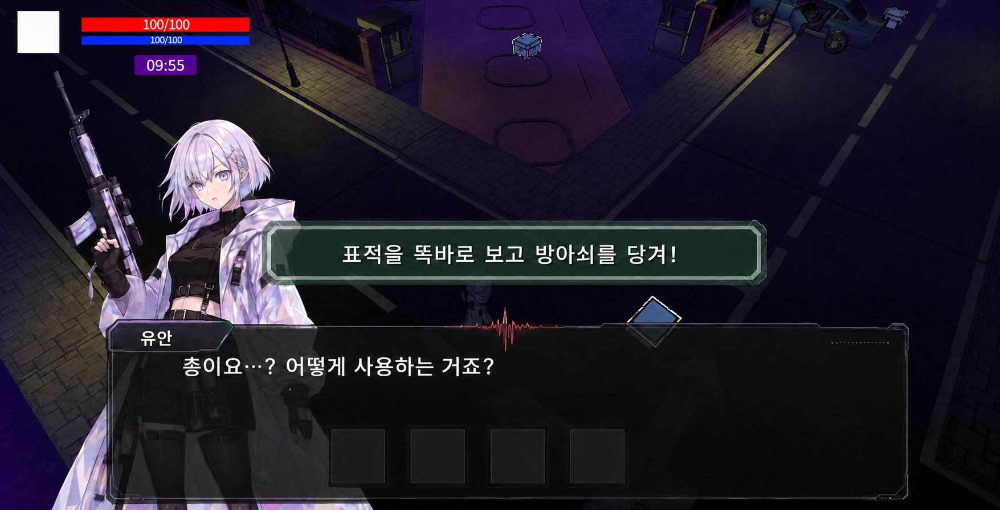

> [!IMPORTANT]
> 이 문서는 AI(Antigravity)가 작성한 초안입니다.
> 기획자/PM의 검토 및 승인 후 이 배너를 제거하면 '확정 사양'으로 인정됩니다.

# 튜토리얼_기획서 (Tutorial Specification)

## 0. 기획 의도 (Design Intent)
* **목표**: 플레이어가 게임을 처음 접했을 때, 게임의 핵심 루프(이동 -> 사격/전투 -> 파밍 -> 탈출)를 직관적이고 서사적인(Narrative) 흐름 속에서 자연스럽게 학습하게 한다.
* **레벨디자인 재활용 및 선형성 극대화**: 완전히 새로운 맵을 빌드하기보다 기존 레벨디자인 씬을 복사하여 리소스 소모를 줄이되, 이동 구역을 남서쪽 도로변으로만 철저히 제한하여 유저가 튜토리얼 단계를 이탈하지 않도록 차단한다.
* **일시정지 및 무전 대화 시스템**: 특정 구간(트리거)에 진입 시 게임이 일시정지되고 다이버(유안)와 관제사의 대화 팝업창이 출력되어, 세계관 몰입도를 높이고 조작 안내 가이드를 자연스럽게 인지시킨다.

---

## 1. 개요 (Overview)

| 항목 | 내용 |
| :--- | :--- |
| **기능명** | 인게임 기초 튜토리얼 및 안내 시스템 |
| **담당자** | 기획: 우성혁, 장수영 / 개발: 강다영 |
| **우선순위** | P1 (필수) |
| **상태** | 기획 중 (고도화 반영안) |

---

## 2. 상세 시스템 명세

### 2.1 진입 조건 및 씬 전환 제어
* **트리거**: 최초 기동 인트로 PV 영상 재생 완료 혹은 스킵 버튼 입력을 통해 인트로가 마무리되는 시점에 튜토리얼 씬으로 강제 분기한다.
* **세이브 데이터 검증**:
  * 로컬 세이브 데이터의 `SaveData.isTutorialCompleted (bool)` 값을 판정한다.
  * `false`: 로비 씬 진입을 건너뛰고 곧장 튜토리얼 씬(`TutorialScene`)을 로드하여 실행한다.
  * `true`: 기존 세이브 유저이므로 튜토리얼을 스킵하고 즉시 `LobbyScene`으로 강제 로드한다.
  * *세이브 갱신 시점*: 튜토리얼의 마지막 단계인 '포탈 탈출 완료'에 성공하여 씬 전환이 일어나는 시점에 `isTutorialCompleted` 값을 `true`로 저장 처리한다.

---

### 2.2 레벨 구성 및 환경 디자인 (Level & Environment Design)

튜토리얼 전용 씬(`TutorialScene`)은 메인 인게임 레벨디자인 씬을 복사하여 아래 규칙에 맞춰 편집한다.

```
                  [ 진입 금지 구역 (Dense Black Fog) ]
┌────────────────────────────────────────────────────────┐
│                                                        │
│   ❌ 콜라이더 장벽 (Collider Wall)                      │
│   ──────────────────────────────────────────────       │
│                                                        │
│        [ 남서쪽 도로변 (SW Roadway) - 유일한 허용 구역 ]   │
│   ┌───────┐      ┌───────┐      ┌───────┐      ┌───────┐   │
│   │ START │ ──>  │ ENEMY │ ──>  │ CHEST │ ──>  │ BOOTH │   │
│   └───────┘      └───────┘      └───────┘      └───────┘   │
│     (이동)        (전투)         (루팅)         (탈출)     │
│                                                        │
│   ──────────────────────────────────────────────       │
│   ❌ 콜라이더 장벽 (Collider Wall)                      │
│                                                        │
└────────────────────────────────────────────────────────┘
                  [ 진입 금지 구역 (Dense Black Fog) ]
```

1. **도로 외 전 지역 차단**:
   * 플레이어의 시작 및 진행 구역인 **남서쪽 도로변(SW Roadway)**을 제외한 모든 도심 골목, 북동쪽 루트는 보이지 않는 충돌체 장벽(**Invisible Collider Wall**)을 둘러 완전히 막아둔다.
   * 차단된 진입 불가 구역에는 짙은 **검은색 안개(Dense Black Fog)** 이펙트를 전면 배치하여 시각적으로 더는 접근할 수 없는 낭떠러지/심연처럼 표현한다.
2. **스폰 포인트 일괄 제거**:
   * 기존 씬 복사본 내부의 무작위 몬스터 스폰 포인트 및 무작위 아이템 상자 스폰 로직 스크립트는 전부 파괴 및 삭제한다.
3. **고정형 오브젝트 단 3종만 스폰 배치**:
   * **적 1마리 (1 Enemy)**: 전투 구간 정중앙에 단독 배치 (기초 공격/사격 학습용).
   * **보물상자 1개 (1 Chest)**: 적 퇴치 후 등장하거나 활성화되는 파밍 상자 (루팅 학습용).
   * **전화부스 포탈 1개 (1 Escape Booth)**: 도로 맨 끝자락에 활성화된 복귀 장치 (탈출 학습용).

### 2.3 일시정지 및 무전 대화 시스템 (Pause & Radio Dialogue System)

* **트리거 작동 방식**:
  * 도로 곳곳에 눈에 보이지 않는 **Trigger Collider** 박스를 배치한다.
  * 플레이어가 해당 콜라이더 영역을 밟는 순간, 게임 루프가 일시정지 상태(`Time.timeScale = 0f` 혹은 커스텀 액션 프리징)로 전이된다.
  * 동시에 화면 전면에 무전기 형태의 **라디오 대화창 팝업 UI**가 활성화되며 캐릭터들의 무전 대화가 시작된다.
* **관제사 무전 전송 버튼 UI (Transmission Button UI)**:
  * 플레이어가 직접 '관제사'가 되어 다이버에게 지시를 내리는 실시간 교신 몰입감을 부여하기 위해, 관제사의 대사는 일반 텍스트로 바로 표시되지 않는다.
  * 관제사가 말해야 하는 지시 사항은 **클릭 가능한 '무전 전송 버튼(Send/Transmit Button)'** 형태로 UI 하단에 활성화된다.
  * 플레이어가 이 전송 버튼을 마우스로 직접 클릭(또는 Space/Enter로 승인)해야 무전 송신음 연출과 함께 유안에게 메세지가 전송된다.
  * 전송이 완료된 직후에만 다이버(유안)의 무전 응답 대사가 자동으로 연이어 출력된다.
* **대화 종료 및 씬 재개**:
  * 해당 트리거 영역의 모든 교신(관제사 전송 + 유안 답변)이 마무리되면 팝업 대화창이 닫히고 게임 시간이 정상 재개(`Time.timeScale = 1.0f`)된다.

### 2.4 단계별 가이드 및 무전 대화 시나리오



#### 📌 Step 1: 최초 진입 및 이동 가이드 (Trigger 1)
* **상황**: 남서쪽 도로변 시작 지점 스폰. 주변은 안개로 가로막혀 있으며 일자형 진행로만 보임.
* **진입 트리거 1 무전 (게임 일시정지)**:
  * **관제사**: *"유안! 목소리 들려? 정신이 좀 들어?"*
  * **유안**: *"당신은..누구.. 잠깐, 내가 왜 여기에 있죠? 기억이..."*
  * **관제사**: *"지금은 일시적인 기억 상실 상태야. 당황하지 말고, 우선 내 목소리가 들리는 앞쪽 도로를 따라 천천히 걸어와 봐."*
* **조작 가이드 출력 (일시정지 해제 후)**:
  * `"W, A, S, D 키를 사용하여 캐릭터를 이동하십시오."`
  * `"Shift 키를 사용하면 진행 방향으로 달려서 돌파할 수 있습니다."`
* **완료 조건**: 도로 중앙의 2단계 진입로 트리거 영역까지 플레이어가 안전하게 이동 완료 시 즉시 2단계로 전이.

#### 📌 Step 2: 적 조우 및 MP 권총 사격 가이드 (Trigger 2)
* **상황**: 도로 가로등 아래에 비선공 상태의 기본형 적(1마리)이 배회하고 있음.
* **진입 트리거 2 무전 (게임 일시정지)**:
  * **관제사**: *"잠깐, 멈춰! 바로 앞에 적이 있어. 사격을 준비해!"*
  * **유안**: *"사격이요...? 이거 어떻게 사용하는 거죠?"*
  * **관제사**: *"표적을 똑바로 응시하고 방아쇠를 당겨! 단, 너무 연속으로 쏘면 정신력 소모가 극심해져서 무방비 상태가 되니 주의해."*
* **조작 가이드 출력 (일시정지 해제 후)**:
  * `"마우스 커서로 적을 조준하고 왼쪽 클릭으로 권총을 발사하십시오."`
  * `"총 사격 시 화면 하단의 파란색 MP(정신력) 게이지를 소모하며, 모두 소모되면 재충전 시까지 사격할 수 없습니다."`
* **완료 조건**: 해당 적을 격발하여 체력(HP)을 0으로 만들어 안전하게 처치 완료 시 즉시 3단계로 전이.

#### 📌 Step 3: 보물상자 상호작용 및 파밍 가이드 (Trigger 3)
* **상황**: 적이 쓰러진 자리에 보물상자가 반짝이는 연출과 함께 드롭/스폰됨.
* **진입 트리거 3 무전 (게임 일시정지)**:
  * **유안**: *"괴물을 쓰러뜨렸더니... 그 자리에 상자가 나타났어요."*
  * **관제사**: *"그 상자 안에 잃어버린 기억을 되찾을 수 있는 유용한 단서가 들어있을 거야. 상자 가까이 다가가서 열어봐."*
* **조작 가이드 출력 (일시정지 해제 후)**:
  * `"상자 근처에서 F키를 입력하여 루팅창을 여십시오."`
  * `"루팅창 내부의 아이템을 클릭해 인벤토리에 보관하십시오."`
* **완료 조건**: 보물상자 내부의 아티팩트를 획득하여 플레이어 인벤토리에 정상 바인딩 완료 시 다음 단계로 이행.

#### 📌 Step 4: 전화부스 포탈 및 최종 탈출 가이드 (Trigger 4)
* **상황**: 도로 끝단에 빛이 세어 나오는 공중전화부스(탈출구)가 윙하는 공명음과 함께 활성화됨.
* **진입 트리거 4 무전 (게임 일시정지)**:
  * **관제사**: *"좋아, 복귀 신호가 확보됐어! 현실로 돌아올 수 있도록 근처에 공중전화부스 모양의 통신 통로를 열었어."*
  * **유안**: *"공중전화부스요...? 정말 저곳에 들어가면 탈출할 수 있나요?"*
  * **관제사**: *"그래, 안으로 들어가서 수화기를 들고 복귀 주파수를 맞춰. 신호 전송이 완료되는 탈출 시간까지 어떻게든 부스 안 영역에서 버텨야 해!"*
  * **유안**: *"알겠어요... 신호가 전송될 때까지 버틸게요. 여기서 제발 꺼내주세요!"*
* **조작 가이드 출력 (일시정지 해제 후)**:
  * `"공중전화부스 앞에서 F키를 눌러 탈출 신호 전송을 시작하십시오."`
  * `"탈출 카운트가 종료 될 때까지 전화부스 범위를 유지해야 하며, 범위를 이탈할 시 채널링이 취소됩니다."`
* **완료 조건**: 범위 내 채널링을 완료 시, 탈출 텔레포트 연출이 시작되고 `isTutorialCompleted` 플래그를 `true`로 갱신 저장한 뒤 `LobbyScene`으로 씬 전환 처리한다.

---

### 2.5 예외 및 복구 처리 (Exception Handling)
* **플레이어 사망 방지**: 튜토리얼 중 플레이어의 컨트롤 실수로 조우한 적에게 사망할 경우, 패널티(아티팩트 유실 등)를 적용하지 않으며 현재 단계에서 체력을 100% 즉시 채우고 바로 앞에서 재스폰(Respawn)시킨다.

---

## 3. 데이터 명세 (Data Specification)

### 3.1 튜토리얼 관리 데이터

| 기획 명칭 | 변수명 | 타입 | 설명 | 기본값 |
| :--- | :--- | :--- | :--- | :--- |
| 튜토리얼 완료 플래그 | `isTutorialCompleted` | `bool` | 튜토리얼을 최종 클리어했는지 여부 기록 | `false` |
| 튜토리얼 진행 단계 | `currentTutorialStep` | `int` | 현재 진행 중인 튜토리얼 Step (1~4) | `1` |

---

## 4. UI/UX 흐름 (UI/UX Flow)
* **조작 가이드 키 시각 강조**: 가이드 가독성을 위해 단축키 아이콘(`W`, `A`, `S`, `D`, `Shift`, `F`, `L-Click`)은 별도의 **어두운 회백색 테두리 사각형 프레임(9-Slice 적용)**을 씌워 시각적 강조 효과를 적용한다.
* **일시정지 무전 효과**: 대화가 출력될 때 화면 가장자리(Vignette)를 흐리고(Blur) 어둡게 만들어 유저가 텍스트에 완전히 집중할 수 있는 환경을 유도한다.
* **일시정지 무전 대화 UI 예시**:
  

---

## 📜 Revision History

| 날짜 | 버전 | 내용 | 작성자 |
| :--- | :--- | :--- | :--- |
| 2026-07-10 | v1.0.0 | - 최초 씬 진입 제어 및 시나리오 4개 단계 구성 초안 작성 | Antigravity |
| 2026-07-14 | v2.0.0 | - 기존 레벨디자인 복사 씬 활용 규칙 명세 추가<br>- 남서쪽 도로변 외 전역 차단 및 안개 이펙트 명세 반영<br>- 적 1/상자 1/전화부스 1 단독 고정 스폰 가이드 구체화<br>- 트리거 진입 시 일시정지 및 다이버-관제사 무전 대화 시나리오 테이블 고도화 | Antigravity |
| 2026-07-14 | v2.1.0 | - 무전 대사 내 메타발언(MP, 게이지 수치, 마우스 조준 등) 전면 제거 및 톤 정제<br>- 탈출 조건에 대한 서술을 게이지 완료에서 탈출 시간 확보로 수정 반영 | Antigravity |
