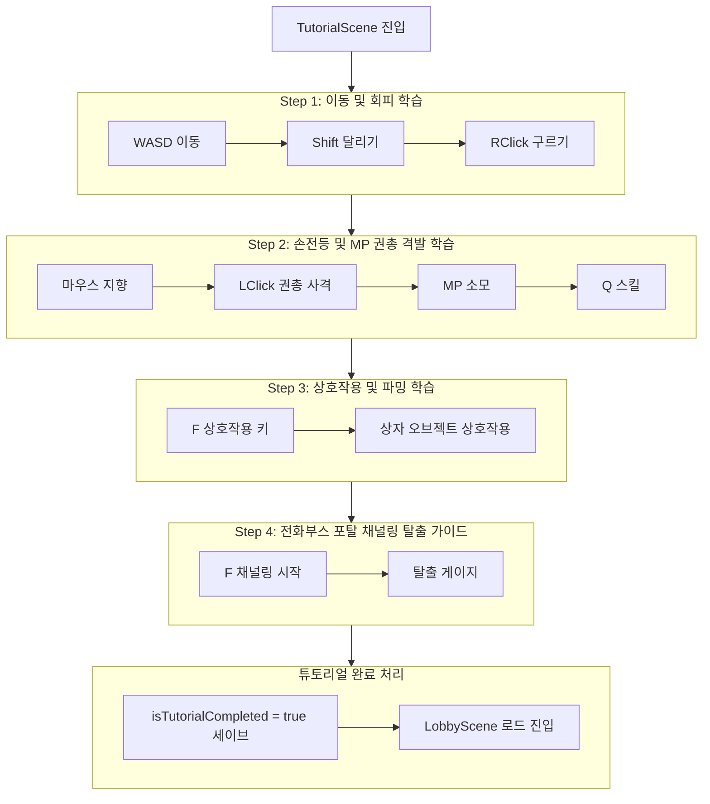
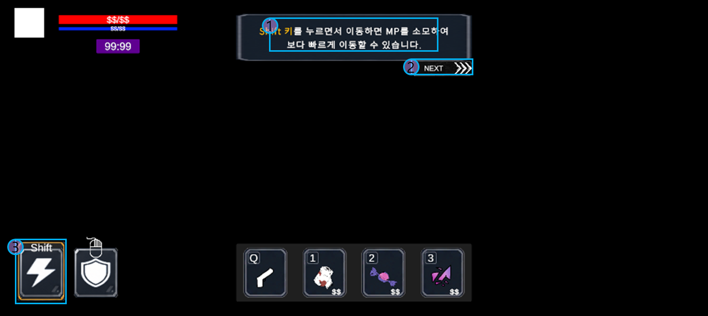

# P1_튜토리얼 기획서_v1.0.1

> [!IMPORTANT]
이 문서는 AI(Antigravity)가 작성한 초안입니다.
기획자/PM의 검토 및 승인 후 이 배너를 제거하면 ’확정 사양’으로 인정됩니다.
> 

# 튜토리얼_기획서

## 0. 기획 의도 (Design Intent)

- **목표**: 플레이어가 게임을 처음 접했을 때, 이동/사격/파밍/탈출로 구성되는 코어 루프를 안전한 환경에서 단계적으로 습득하게 한다.
- **핵심 가치**: 탄창이 없고 MP 소모만으로 사격하는 독자적인 권총 시스템 및 시야 차단(손전등) 룰을 유저에게 각인시킨다.

---

## 1. 개요 (Overview)

| 항목 | 내용 |
| --- | --- |
| **기능명** | 인게임 기초 튜토리얼 및 안내 시스템 |
| **담당자** | 기획: 우성혁, 장수영 / 개발: 강다영 |
| **우선순위** | P1 (필수) |
| **상태** | 기획 중 (초안) |

---

## 2. 상세 시스템 명세

### 2.1 진입 조건 및 씬 전환 제어

- **진입 트리거**: 인트로 씬(`GameStartScene`)에서 시작 버튼을 터치하여 게임 시작 처리를 실행했을 때 세이브 변수를 검증하여 튜토리얼 씬에 진입한다.
- **세이브 변수 검증**:
    - 로컬 세이브 데이터의 `SaveData.isTutorialCompleted (bool)` 값을 판정한다.
        - `false`: 튜토리얼 씬(`TutorialScene`)을 로드하여 실행한다.
        - `true`: 기존 세이브 유저이므로 로비 씬(`LobbyScene`)을 로드한다.
    - *세이브 갱신 시점*: 튜토리얼의 마지막 단계인 ’포탈 탈출 완료’에 성공하여 씬 전환이 일어나는 시점에 `isTutorialCompleted` 값을 `true`로 저장 처리한다.

---

### 2.2 단계별 가이드 시나리오

#### 📌Step 1: 이동 및 회피 학습

- **상황**: 조명이 극히 제한된 실내 마트 창고(일자형 안전 구역)에서 시작한다.
- **가이드 안내**: 화면 중앙 상단에 튜토리얼 팝업을 활성화하며, 튜토리얼 팝업에 안내 메시지 텍스트를 출력한다.
    - `"WASD 키를 사용하여 캐릭터를 이동시키십시오."`
    - `"Shift 키를 누르면서 이동하면 지속적으로 MP를 소모하여 보다 빠르게 이동할 수 있습니다."`
    - `"마우스 오른쪽 클릭 시 진행 방향으로 구르기(대시)를 사용하여 장애물을 돌파할 수 있습니다. 구르기 사용 시 MP가 소모됩니다."`
- **완료 조건**: 지정된 목표 반경 위치로 캐릭터가 이동 완료하면 다음 단계로 전이된다.

#### **📌 Step 2: 손전등 및 MP 권총 격발 학습**

- **상황**: 창고 문이 열리고 어두운 복도로 진입한다. 플레이어 전방 5m 지점에 표적용 몬스터 1마리 배치(비선공 상태).
- **가이드 안내**:
    - `"마우스 커서 방향으로 캐릭터의 시야(손전등)가 회전합니다. 빛이 비치는 곳만 적이 보입니다."`
    - `"마우스 왼쪽 클릭으로 권총을 사격하십시오. 사격 시 MP(마나)가 소모됩니다."`
    - `"MP가 모두 소모되면 자연 회복될 때까지 사격할 수 없습니다. MP 게이지를 관리하십시오."`
    - `"Q 키를 사용하여 마우스 커서 위치에 캐릭터 스킬을 사용할 수 있습니다. 스킬 사용 시 MP가 소모됩니다."`
- **완료 조건**: 배치된 표적용 몬스터를 조준 격발하여 HP를 0으로 만들고 소멸시키면 즉시 완료된다.

#### **📌 Step 3: 상호작용 및 파밍 학습**

- **상황**: 몬스터 사살 지점 바로 뒤에 일반 나무상자 오브젝트 1개 노출.
- **가이드 안내**:
    - `"F 키를 사용하여 오브젝트와 상호작용할 수 있습니다. 상호작용 가능한 오브젝트에 접근하면 상호작용 가능 이펙트가 발생합니다."`
    - `"상자 오브젝트 근처로 다가가 F키를 누르면 상호작용하여 아이템을 루팅할 수 있습니다."`
- **완료 조건**: 상자 오픈 연출이 끝나고 상자 내부 아티팩트 아이템 획득 처리가 플레이어 인벤토리에 정상 반영되면 다음 단계로 이행된다.

#### **📌 Step 4: 포탈 탈출 및 루프 완료**

- **상황**: 복도 끝에 불이 켜진 공중전화부스(탈출구 포탈) 활성화.
- **가이드 안내**:
    - `"전화부스 포탈 근처에서 F키를 눌러 탈출 채널링을 시작하십시오."`
    - `"우측 탈출 게이지가 가득 찰 때까지 포탈 범위 내에서 버텨야 하며, 피격되거나 이탈 시 취소됩니다."`
- **완료 조건**: 채널링 게이지를 채워 탈출 성공 시, 전체 세션 정산 보상 연출 출력 후 `isTutorialCompleted` 세이브 데이터를 변경하고 로비 씬으로 복귀한다.
    - 결과 패널 창의 로비로 돌아가기 버튼 터치 시 현재 씬이 `TutorialScene` 인지 판정한다.
        - `true`: 로비 씬 로드 전 `isTutorialCompleted = true` 값을 세이브 데이터에 저장하는 처리를 추가로 실행한다.

---

### 2.3 가이드 안내 메시지

정해진 출력 조건을 최초 1회 달성할 때마다 각 조건에 지정된 가이드 안내 메시지를 출력한다.

- 튜토리얼 씬에서 출력하는 안내 메시지는 `TutorialScene` 에 `TutorialManager` 오브젝트를 배치하고 `Tutorial` 테이블에 입력한 데이터를 판정하여 관리한다.
    - 안내 메시지는 튜토리얼 진행 단계(`utorialStep`) 및 단계 내 가이드 순서(`tutorialGuideOrder`) 값을 통해 구분한다.
    - 안내 메시지를 출력하는 조건은 `tutorialTriggerType (enum)` 변수에 입력하여 저장한다.
        - `sceneLoaded` : 튜토리얼 씬이 로드된 직후 시점에 출력된다.
        - `triggerEnter` : 지정된 트리거 Collider에 최초로 진입한 시점에 출력된다.
        - `prevGuideEnd` : 지정된 이전 순서의 안내 메시지가 비활성화된 시점에 출력된다.
    - 각 안내 메시지 출력 조건의 상세 값을 `tutorialTriggerValue (string)` 변수에 입력한다.
        - `tutorialTriggerType.sceneLoaded` : 로드할 씬 이름 (string)을 입력한다.
        - `tutorialTriggerType.triggerEnter` : 진입할 트리거 Collider의 오브젝트 이름(string)을 입력한다.
        - `tutorialTriggerType.prevGuideEnd` : 이전 순서의 안내 메시지 TID 값 (int)을 입력한다.
    - 안내 메시지의 최초 출력 여부를 `isTutorialRead (dictionary<int, bool>)` 내부 변수에 저장한다.
        - isTutorialRead는 각 튜토리얼 가이드의 TID를 Key로 가지며, Value의 기본값은 false로 입력된다.
        - 안내 메시지가 최초 1회 출력된 시점에 Value 값을 false에서 true로 변경한다.
        - `isTutorialRead[TID] = true` 인 안내 메시지의 출력 조건이 다시 만족되었을 경우에는 해당 안내 메시지가 출력되지 않는다.
    - 안내 메시지의 텍스트 스트링은 `tutorialGuideText` 변수에 입력하여 저장한다.
    - 안내 메시지는 정해진 출력 시간 (`tutorialDuration`) 길이 동안 UI에 출력된다.
        - 출력 시간 종료 시 튜토리얼 팝업 UI가 비활성화된다.
        - 안내 메시지가 비활성화된 시점에 해당 메시지의 TID를 `prevGuideClosed`  값으로 참조하는 다음 안내 메시지를 출력하여 튜토리얼 팝업 UI를 다시 활성화한다.

#### 2.3.1 강조 이펙트

가이드 안내 출력 시 UI 캔버스 및 인게임 레벨에서 정해진 위치에 강조 테두리 이펙트를 출력할 수 있다.

- 튜토리얼 씬의 튜토리얼 UI에 패널 오브젝트를 배치한다.
    - 각 안내 메시지 출력 시 강조 이펙트를 출력할 위치에 해당하는 패널 오브젝트의 파일명을 `UIHighlightPosition (string)`  변수에 입력하여 연결한다.
        - 강조 이펙트를 출력하지 않는 안내 메시지는 `UIHighlightPosition=none` 을 입력하여 구분한다.
    - 안내 메시지 출력 시 `UIHighlightPosition` 에 입력한 패널 오브젝트를 활성화하여 강조 이펙트를 출력한다.
        - 해당 안내 메시지를 출력하지 않는 경우(기본 상태 및 다른 안내 메시지 출력)에는 패널 오브젝트를 비활성화한다.
- 튜토리얼 씬에 로드할 인게임 레벨에 조명 이펙트 오브젝트를 배치한다.
    - 각 안내 메시지 출력 시 조명 이펙트를 출력할 위치에 배치한 오브젝트의 파일명을 `highlightEffectPosition (string)`  변수에 입력하여 연결한다.
        - 조명 이펙트를 출력하지 않는 안내 메시지는 `highlightEffectPosition=none` 을 입력하여 구분한다.
    - 안내 메시지 출력 시 `highlightEffectPosition` 에 입력한 조명 오브젝트를 활성화하여 강조 이펙트를 출력한다.
        - 해당 안내 메시지를 출력하지 않는 경우(기본 상태 및 다른 안내 메시지 출력)에는 조명 오브젝트를 비활성화한다.

#### 2.3.2 안내 메시지 수동 넘김

튜토리얼 팝업을 통해 안내 메시지 출력 중 수동으로 다음 안내 메시지를 출력할 수 있다.

- 튜토리얼 팝업에 “NEXT 버튼”을 배치한다.
- NEXT 버튼 터치 시 `NextGuideID (int)` 에 지정된 다음 안내 메시지를 출력한다.
    - NEXT 버튼 터치를 통한 다음 안내 메시지 수동 출력을 사용하지 않는 안내 메시지는 `NextGuideID = -1` 을 입력하여 구분한다.
    - NEXT 버튼 터치 전에 출력되고 있던 안내 메시지는 남은 출력 시간을 무시하고 즉시 비활성화한다.
- NEXT 버튼으로 출력한 다음 안내 메시지의 지속 시간은 NEXT 버튼 터치에 의한 다음 안내 메시지 출력 시점부터 출력된 다음 안내 메시지의 `TutorialDuration` 시간 길이 동안으로 한다.

---

### 2.4 예외 처리

- **플레이어 사망**: 튜토리얼 씬에서 만에 하나 플레이어가 사망할 경우, 사망 패널티(아티팩트 유실 등)를 적용하지 않으며 현재 단계에서 체력을 100% 리필하고 재시작(Respawn)시킨다.

---

## 3. 데이터 명세 (Data Specification)

### 3.1 튜토리얼 진행 여부 관리 데이터

| 기획 명칭 | 변수명 | 타입 | 설명 | 기본값 |
| --- | --- | --- | --- | --- |
| 튜토리얼 완료 플래그 | `isTutorialCompleted` | `bool` | 인게임 튜토리얼 종료 여부 기록 | `false` |
| 튜토리얼 진행 단계 | `currentTutorialStep` | `int` | 현재 진행 중인 튜토리얼 Step (1~4) | `1` |

### 3.2 튜토리얼 가이드 안내 관리 데이터

| 기획 명칭 | 변수명 | 타입 | 설명 | 기본값 |
| --- | --- | --- | --- | --- |
| 고유 ID | `TID`  | `int`  | 각 튜토리얼 가이드 안내의 고유 ID | `1` |
| 튜토리얼 진행 단계 | `TutorialStep` | `int` | 현재 진행 중인 튜토리얼 Step (1~4) | `1` |
| 가이드 순서 | `tutorialGuideOrder` | `int` | 동일 Step 내에서 안내 메시지를 출력하는 순서 | `1` |
| 출력 조건 | `tutorialTriggerType` | `enum` | 안내 메시지를 출력하는 조건의 종류 | `tutorialTriggertype.none` |
| 출력 조건 값 | `tutorialTriggerValue` | `string` | 안내 메시지를 출력하는 조건의 세부 값 |  |
| 가이드 텍스트 | `tutorialGuideText`  | `string`  | 안내 메시지에 출력되는 텍스트 스트링 |  |
| 튜토리얼 가이드 출력 시간 | `tutorialDuration`  | `float`  | 안내 메시지를 출력하는 시간 길이 (초 단위) | `3.0` |
| 강조 이펙트 | `UIHighlightPosition` | `string`  | 안내 메시지 출력 중 인게임 UI에 강조 이펙트를 출력하는 지점의 오브젝트 이름 | `none` |
| 조명 이펙트 | `highlightEffectPosition` | `string`  | 안내 메시지 출력 중 인게임 레벨에 조명 이펙트를 출력하는 지점의 오브젝트 이름 | `none` |
| 다음 가이드 자동 진행 플래그 | `isTutorialAutoSkip`  | `bool`  | 안내 메시지 출력 시간 종료 시 자동으로 다음 순서의 안내 메시지를 출력하는지 여부 기록 | `true` |
| 다음 안내 메시지 | `NextGuideID`  | `int`  | 튜토리얼 팝업에서 NEXT 버튼 터치 시 출력하는 다음 안내 메시지의 ID | `2` |
- 데이터 테이블 예시

| TID | TutorialStep | tutorialGuideOrder | tutorialTriggerType | tutorialTriggerValue | tutorialGuideText | tutorialDuration | UIHighlightPosition | highlightEfffectPosiion | isTutorialAutoSkip | NextGuideID |
| --- | --- | --- | --- | --- | --- | --- | --- | --- | --- | --- |
| 101 | 1 | 1 | sceneLoaded | TutorialScene | <color=#ff8000>WASD 키</color>를 사용하여 캐릭터를 이동시키십시오. | 3.0 | none | none | true | 102 |
| 102 | 1 | 2 | prevGuideEnd | 101 | <color=#ff8000>Shift 키</color> 키를 누르면서 이동하면 지속적으로 MP를 소모하여 보다 빠르게 이동할 수 있습니다. | 3.0 | GameplayUI_SprintButton | none | true | 103 |
| 103 | 1 | 3 | prevGuideEnd | 102 | <color=#ff8000>마우스 오른쪽 클릭</color> 시 진행 방향으로 구르기(대시)를 사용하여 장애물을 돌파할 수 있습니다. 구르기 사용 시 MP가 소모됩니다. | 3.0 | GameplayUI_EvadeButton | none | false | -1 |
| 201 | 2 | 1 | triggerEnter | TutorialScene_Step2_Start | <color=#ff8000>마우스 커서 방향</color>으로 캐릭터의 시야(손전등)가 회전합니다. 빛이 비치는 곳만 적이 보입니다. | 3.0 | none | none | true | 202 |
| 202 | 2 | 2 | prevGuideEnd | 201 | <color=#ff8000>마우스 왼쪽 클릭</color>으로 권총을 사격하십시오. 사격 시 MP(마나)가 소모됩니다. | 3.0 | none | TutorialScene_Step2_Enemy | true | 203 |
| 203 | 2 | 3 | prevGuideEnd | 202 | MP가 모두 소모되면 자연 회복될 때까지 사격할 수 없습니다. MP 게이지를 관리하십시오. | 3.0 | GameplayUI_MPGauge | none | true | 204 |
| 204 | 2 | 4 | prevGuideEnd | 203 | <color=#ff8000>Q 키</color>를 사용하여 마우스 커서 위치에 캐릭터 스킬을 사용할 수 있습니다. 스킬 사용 시 MP가 소모됩니다. | 3.0 | GameplayUI_SkillButton | none | false | -1 |
| 301 | 3 | 1 | triggerEnter | TutorialScene_Step3_Start | <color=#ff8000>F 키</color>를 사용하여 오브젝트와 상호작용할 수 있습니다. 상호작용 가능한 오브젝트에 접근하면 상호작용 가능 이펙트가 발생합니다. | 3.0 | none | none | false | -1 |
| 302 | 3 | 2 | triggerEnter | TutorialScene_Step3_Itembox | 상자 오브젝트 근처로 다가가 <color=#ff8000>F 키</color>를 누르면 상호작용하여 아이템을 루팅할 수 있습니다. | 3.0 | none | TutorialScene_Step3_Itembox | false | -1 |
| 401 | 4 | 1 | triggerEnter | TutorialScene_Step4_Start | 전화부스 포탈 근처에서 <color=#ff8000>F 키</color>를 눌러 탈출 채널링을 시작하십시오. | 3.0 | none | TutorialScene_Step4_ExitPoint | false | -1 |
| 402 | 4 | 2 | prevGuideEnd | 401 | 우측 <color=#ff8000>탈출 게이지</color>가 가득 찰 때까지 포탈 범위 내에서 버텨야 하며, 피격되거나 이탈 시 취소됩니다. | 3.0 | none | none | false | -1 |

---

## 4. UI/UX 흐름 (UI/UX Flow)

- **조작 가이드 키 노출**: 텍스트 가이드 내 단축키 키(`W`, `A`, `S`, `D`, `Shift`, `F`, `L-Click`)는 별도의 특수 강조 색상 및 테두리 프레임을 씌워 출력한다.
- **이동 목표 포인트 하이라이트**: 이동해야 할 위치의 지면에 부채꼴 빔 형태의 연출 조명을 투사하여 공간적으로 가이드를 보조한다.

### 4.1. UI 배치 (UI Setting)

- 튜토리얼 팝업은 이하의 UI 요소로 구성된다.

| No. | UI 요소 이름 | UI 요소 설명 |
| --- | --- | --- |
| 1 | 안내 메시지 | 튜토리얼 가이드 텍스트 |
| 2 | NEXT 버튼 | 터치하여 다음 튜토리얼 가이드를 출력 |
| 3 | 강조 이펙트 | 정해진 가이드 텍스트 출력 중 UI 패널에 강조 이펙트를 출력 |

---

## 📜 Revision History

| 날짜 | 버전 | 내용 | 작성자 |
| --- | --- | --- | --- |
| 2026-07-10 | v1.0.0 |   • 최초 씬 진입 제어 및 세이브 플래그 바인딩 룰 명세   • 이동, MP 권총 사격, 파밍 상호작용, 포탈 채널링 탈출 시나리오 4개 단계 구성   • 사망 예외 처리 규칙 작성 완료 | Antigravity |
| 2026-07-13 | v1.0.1 |   • 진입 조건 수정: 인트로 씬에서 시작 버튼 터치 시   • 튜토리얼 동작 명세 고도화 및 UI 이미지 추가       ◦ 튜토리얼 팝업 UI 동작 기능       ◦ 강조 이펙트(UI 테두리 + 인게임 레벨 조명) | 우성혁 |