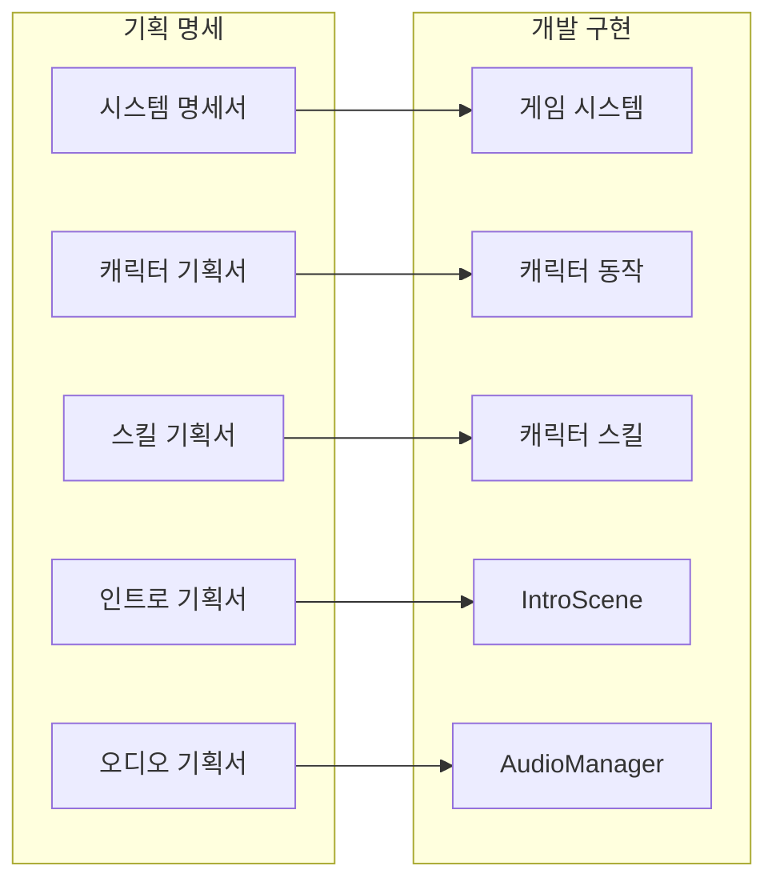
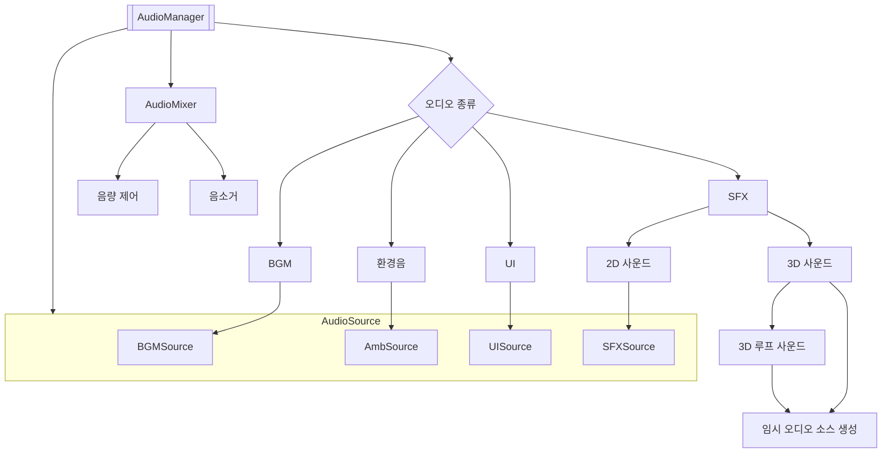

# 최종 발표 웹 — 우성혁 (CD)

> 이 문서는 본인이 최종 발표에서 실제로 설명할 내용을 작성하는 문서입니다.
>
> 작업 전체를 나열하지 말고,
> `../team_summaries/[CD]우성혁_작업물_요약.md`를 참고하여
> 가장 보여주고 싶은 대표 작업 1개와 보조 작업 1개를 선택해 주세요.
>
> 웹 코드는 직접 수정하지 않아도 됩니다.
> 아래 내용을 작성하면 발표 웹에 반영됩니다.

---

## 0. 기본 정보

**이름**: 우성혁

**직군**: CD (Content Designer / 시스템 명세화 & 오디오 구현)

**예상 발표 시간**:

- [ ] 1분
- [ ] 2분
- [x] 3분
- [ ] 기타:

**실제 발표할 범위**: 시스템 기획 명세서 문서 + 오디오 시스템 구현(`AudioManager` + `IAudioRepository`)

---

## 1. 발표 핵심 메시지

### 발표가 끝난 뒤 청중이 기억해야 할 한 문장

> "게임을 구현하기 위한 명세를 구성했고, 그 명세를 스스로 코드로 완성했습니다."

### 보조 메시지 (발표 흐름을 관통하는 맥락)

- 기획 명세는 개발팀이 '어떻게 만들까'를 고민하기 전에 '무엇을 만들어야 하는가'를 정의하는 작업이었습니다.
- 오디오 시스템은 그 명세의 직접적인 산출물로, 기획서의 규격이 실제 코드 아키텍처로 이어진 사례입니다.
- 두 작업을 통해 **기획 → 명세 → 구현**의 흐름을 한 사람이 일관되게 담당했다는 점을 전달합니다.

---

## 2. 대표 작업 선택

### 대표 작업

**작업명**: 시스템 기획 명세서

**이 작업을 대표 사례로 선택한 이유**: 프로젝트의 핵심 재미 요소를 구성하는 기획 명세서를 체계적으로 작성하여, P0 프로젝트의 완성도를 높였기 때문입니다.

**이 작업에서 본인이 맡은 정확한 범위**:
- P0 시스템 명세서 (LucidDiver_Document\01_SSOT_최종_기준문서\01_P0_시스템_명세서.md)
    - 게임 플레이의 핵심 시스템을 명확하게 정의하고 문서화
    - 아이템 시스템, 탈출 시스템, 몽막 시스템 등
- P0.5 플레이어 캐릭터 명세서 (LucidDiver_Document\02_개발_전달용\P0.5_기획_명세서\플레이어_캐릭터_시스템_명세\P0.5_플레이어 캐릭터_기획서_시스템 명세_v1.0.3.md)
    - 플레이어의 조작 체계(달리기, 구르기), 상태값(시간 제한, 시야)
    - 아이템 적용(장비 장착, 소비 기물 사용)
- P0.5 플레이어 스킬 명세서 (LucidDiver_Document\02_개발_전달용\P0.5_기획_명세서\플레이어_캐릭터_시스템_명세\P0.5_플레이어 캐릭터_기획서_스킬 기능 명세_v1.0.0.md)
    - 스킬 메커니즘 및 쿨타임/범위/효과 피드백 명세화
- P0.5 UI 등급 표시 기획서 (LucidDiver_Document\01_SSOT_최종_기준문서\03_P05_UI_등급표시_기획서.md)
    - 아이템 등급별 비주얼 피드백 및 UI 슬롯 배경 식별 체계 규격화
- P1 인트로 신 기획서 (LucidDiver_Document\검수\P1_인트로 신 기획서_v1.0.0\P1_인트로 신 기획서_v1.0.0.md)
    - 게임 시작 시 출력되는 화면의 구조 및 기능 설정
- P1 오디오 매니저 기획서 (LucidDiver_Document\검수\P1_오디오 매니저_기획서_v1.0.0.md)
    - 오디오 아키텍처(Volume 및 AudioMixer 파라미터, 2D/3D SFX/BGM 분류) 기획 체계화

### 보조 작업 — 선택

**작업명**: 중앙 집중식 오디오 아키텍처 & AudioMixer 통합 제어 (`AudioManager.cs` + `IAudioRepository`)

**선택 이유**: 게임 내 모든 사운드 리소스를 단일 매니저에서 관리할 수 있도록 하여, 다중 오디오 소스 동시 재생 시 발생할 수 있는 문제를 해결하고 3D 사운드와 UI 사운드를 일관된 구조로 제어할 수 있는 시스템을 구축했기 때문입니다.

**이 작업에서 본인이 맡은 정확한 범위**:
- `AudioManager.cs` 전체 구현 및 `IAudioRepository` 인터페이스 설계
- `AudioMixer` 파라미터 연동
- 상태 체크 시 환경음 및 BGM 동일 클립 무한 재시작 방지 로직
- 버튼 상호작용 상태(작동 가능/작동 불가능/캐릭터 상호작용)에 따른 UI 사운드 규격화
- 적 피격 시 즉시 격발되는 전용 타격음 SFX 매핑
- 3D 위치 기반 SFX 거리 감쇄 및 AudioSource 수명 관리 연출 시스템

**발표에 꼭 필요한가?**

- [x] 반드시 필요
- [ ] 시간이 있으면
- [ ] 제외 가능

---

## 3. 작업 설명

### 3.1. 대표 작업: 기획 명세 작업

#### 3.1.1 완성 결과

**작성**: 크리에이티브 프로듀서의 기획 원안을 바탕으로 실제 개발 구현이 가능하도록 구체화된 **시스템 기획 명세서 및 SSOT(Single Source of Truth) 마스터 기준 문서**를 작성·수립했습니다.
- **P0 시스템 명세서**: 게임 플레이 핵심 루프(진입 ➡️ 탐색 ➡️ 탈출/사망 ➡️ 결과 정산 ➡️ 로비), 아이템, 탈출 체계 명세화
- **P0.5 플레이어 캐릭터 & 스킬 명세서**: 캐릭터의 조작 체계, 상태값, 스킬 메커니즘 및 쿨타임/범위/효과 피드백 명세
- **P0.5 UI 등급 표시 기획서**: 아이템 등급별 비주얼 피드백 및 UI 슬롯 배경 식별 체계 규격화
- **P1 인트로 신 & 오디오 매니저 기획서**: 게임 시작 연출 시퀀스 및 오디오 아키텍처(AudioMixer 파라미터, 2D/3D SFX/BGM 분류) 기획 체계화

#### 3.1.2 작업 목표

**작성**: 개념 및 구상 단계에 있던 원안 기획을 개발팀(TD, PM, PD)이 즉시 구현 및 검증할 수 있는 체계적인 SSOT 기준 문서로 구체화하는 것을 목표로 했습니다.
1. 개발 구현 과정에서의 중복·혼선 방지를 위한 P0~P1 시스템 및 기능 명세 일원화
1. 캐릭터, 스킬, UI, 오디오, 씬 전환 메커니즘을 예외 처리 규칙 및 수치/흐름 기반으로 상세 정의
1. 기획 문서가 개발 및 QA 검증의 기준점이 되는 유기적 개발 환경 구축

#### 3.1.3 핵심 문제 또는 제약

**작성**: 원안 기획의 추상적인 표현이나 개발 요구사항 미정의로 인해 발생할 수 있는 구현 상의 예외 상황(Edge Case) 및 개발-기획 간 해석의 차이를 최소화하는 것이 주요 제약이자 과제였습니다. 이를 위해 각 기획서 작성 시 단순 기능 설명에 그치지 않고, 데이터 구조, 상태 변화 조건, UI/SFX 피드백 예외 처리, 오디오 및 씬 연동 규격까지 시스템 명세 수준으로 세분화하여 프로그래밍에 직결되는 가이드라인을 제시했습니다.

#### 3.1.4 사용 기술과 선택 이유

**작성**: 
**사용 기술**:
- **Markdown (MD) 기반 SSOT 문서화 체계**: Git 버전 관리 및 코드와의 일대일 대조가 용이한 텍스트 기반 명세서
- **시스템 상태 전환도 & 흐름도 (FSM & Flowchart)**: 상태 제어 및 예외 흐름 시각화

**선택 이유**:
- Markdown 문서는 개발 코드베이스와 동일하게 Git으로 통합 관리할 수 있어 기획 변경 이력 추적 및 개발자/기획자 간 빠른 상호 참조가 가능하기 때문입니다.
- FSM 및 명확한 수치 규격 정의는 프로그래머가 오디오/캐릭터/정산 시스템의 아키텍처를 설계할 때 데이터 구조와 인터페이스를 직관적으로 도출하도록 돕습니다.

#### 3.1.5 구현 결과

**작성**:
- **이전**: 기획 원안 및 개념 구상만 존재하여 개발 구현 및 아키텍처 설계 시 세부 규칙과 예외 처리 가이드라인이 부재했음.
- **이후**: P0 시스템 명세서, P0.5 캐릭터/스킬/UI 명세서, P1 인트로/오디오 기획서 등 SSOT 마스터 문서를 수립하여 개발-기획-QA 간 명확한 기준 확립 및 구현 효율 극대화.

#### 3.1.6 남은 한계 또는 개선점

**작성**: 초기 시스템 명세 작성 이후 개발 진행 과정에서 일부 수치 및 메커니즘 밸런싱 데이터 변경이 실시간으로 명세서에 자동 동기화되지 않는 한계가 있었습니다. 향후 Excel/Google Sheet 스크립트 기반 데이터 테이블 자동 명세 추출 파이프라인을 도입해 문서 유지보수 공수를 축소할 필요가 있습니다.

### 3.2. 보조 작업: 오디오 시스템 구현

#### 3.2.1 완성 결과

무엇을 만들었고 실제 게임에서 어떻게 작동하는지 작성해 주세요.

**작성**: SFX·BGM 리소스를 단일 진입점(`AudioManager.cs`)으로 통합 관리하는 중앙 집중식 오디오 시스템을 완성했습니다. 게임 내에서 버튼 클릭 등 UI 사운드, 적 타격음을 포함한 효과음, 그리고 배경음과 환경음이 각각의 `AudioMixer` 채널을 통해 독립적으로 조절되며, 씬 전환 및 플레이어 상태 변화 중에도 BGM이나 환경음이 끊기거나 중복 재시작되는 상황을 최소화하여 자연스럽게 이어지도록 스크립트를 작성했습니다.

#### 3.2.2 작업 목표

이 작업을 통해 어떤 플레이 경험 또는 개발 목표를 달성하려 했나요?

**작성**: 사운드 호출이 각 스크립트에 분산되어 관리하기 어려워지는 사태를 예방하기 위해 단일 `AudioManager`로 일원화하여,
1. 어느 씬에서든 GlobalEventBus 구조를 통해 동일한 API로 사운드 호출을 가능하게 하고,
1. 상태 변화 및 씬 전환 시 BGM 및 환경음 클립 무한 재시작을 방지하는 클립 필터링 기능을 AudioManager에 내장하며,
1. FMOD 미설치 환경에서도 Unity 내장 `AudioSource`로 자동 Fallback되는 안전망 확보를 목표로 했습니다.

#### 3.2.3 핵심 문제 또는 제약

가장 중요했던 문제나 제약을 하나만 작성해 주세요.

문제가 아니라 새로운 기능 제작이라면,
구현 과정에서 중요했던 조건이나 설계 기준을 작성해 주세요.

**작성**: `AudioManager` 구현 시 BGM과 환경 사운드를 동시에 재생하고 상황에 따라 어느 한쪽만 변경하여 나머지는 유지하는 것이 가능하도록, `AudioMixer`를 다수 배치해 각 사운드 종류마다 별도로 배분할 수 있게 하는 구조로 구축해야 했습니다. 또한 루프 구조를 요구하지 않는 단발성 SFX의 경우에는 AudioSource에 등록된 clip을 재생하는 Play() 방식이 아닌, 클립을 일회성으로 재생하는 PlayOneShot() 방식을 사용하여, 매번 새로운 오디오 소스를 할당하지 않고도 안전하게 여러 사운드를 동시에 출력할 수 있도록 설계했습니다.

#### 3.2.4 사용 기술과 선택 이유

어떤 기술을 사용했는지만 나열하지 말고,
왜 그 방법을 선택했는지 작성해 주세요.

**사용 기술**:
- `AudioMixer` (파라미터: `"AmbVolume"`, BGM, SFX, UI, Master) + Unity 내장 `AudioSource`
- `IAudioRepository` 인터페이스 + `LocalJsonAudioRepository` 리포지토리 + `AudioManager` 서비스

**선택 이유**:
- `AudioMixer`는 런타임 중 각 `AudioSource`마다 다른 채널을 연결하고, 각 채널마다 독립된 볼륨 조절이 가능한 구조를 외부 FMOD 설치 없이도 구현할 수 있기 때문에 선택했습니다.
- `IAudioRepository` 인터페이스를 `LocalJsonAudioRepository`에 연결하는 경로를 통해 Assembly Definition 체계에 따른 컴파일 분리 구조에 알맞은 오디오 데이터 연결 구조를 구축할 수 있었습니다.

#### 3.2.5 구현 결과

기존과 비교해 무엇이 달라졌나요?

**작성**:
- **이전**: 사운드 호출 코드가 구현되지 않아 오디오 재생 기능이 없었음.
- **이후**: 단일 `AudioManager` API로 사운드 통합 관리, BGM 무한 재시작 차단, 환경음/BGM/SFX/마스터 독립 조절 슬라이더 연동

#### 3.2.6 남은 한계 또는 개선점

**작성**: 현재 SFX에 단일 AudioSource를 사용하고 있어, 추후 개발 확장 시 동시 다발 전투 상황에서 SFX 루프를 여러 개 재생해야 할 경우 소스 부족이 발생할 수 있습니다. 향후 동적 풀 확장 또는 우선순위 기반 스케줄링 도입이 필요합니다.

---

## 4. 발표 장면 순서

### Scene 1. 시작

**무엇을 보여줄까요?**

- [ ] 최종 결과 영상
- [ ] 문제 상황
- [ ] 게임 플레이
- [ ] 이미지
- [x] 구조도
- [ ] 코드
- [ ] 기타:


**이때 말할 내용**: 프로젝트 내 시스템 명세서 및 구현에 필요한 기능의 기획 문서를 작성하고, 이 중 오디오 시스템을 직접 구현하였습니다.

### Scene 2. 대표 작업

#### Tab 1. 작업 소개

**무엇을 보여줄까요?**

- [ ] 최종 결과 영상
- [ ] 문제 상황
- [ ] 게임 플레이
- [ ] 이미지
- [x] 구조도
- [ ] 코드
- [ ] 기타:


**이때 말할 내용**: 프로젝트 초기 개발 방향성을 설정할 시기에 시스템 명세서를 작성하여 개발에 필요한 규칙과 예외 처리 가이드라인을 기획하였습니다.

#### Tab 2. 작업 목표와 문제

**무엇을 보여줄까요?**

- [ ] 최종 결과 영상
- [ ] 문제 상황
- [ ] 게임 플레이
- [x] 이미지
- [x] 구조도
- [ ] 코드
- [ ] 기타:


**이때 말할 내용**: 기획 단계는 프로젝트에 주어진 시간과 인력 내에서 구현 가능한 범위를 설정하는 것을 목표로 하며, 그 범위에 어떤 시스템을 포함하여 어느 선까지 구체화하고 어느 점을 제외할 것인지가 문제가 됩니다.

#### Tab 3. 기술적 판단

**무엇을 보여줄까요?**

- [ ] 최종 결과 영상
- [ ] 문제 상황
- [ ] 게임 플레이
- [x] 이미지
- [x] 구조도
- [ ] 코드
- [ ] 기타:


**이때 말할 내용**: 따라서 기획 단계에서는 필요한 내용을 정리한 후 각각 기술적으로 어떻게 구현해야 하는지를 실제 코딩에 사용되는 변수 및 함수 형식으로 상세하게 정리할 필요가 있습니다.

#### Tab 4. 결과 비교 및 검증

**무엇을 보여줄까요?**

- [ ] 최종 결과 영상
- [ ] 문제 상황
- [ ] 게임 플레이
- [x] 이미지
- [x] 구조도
- [ ] 코드
- [ ] 기타:

| 기획서 예시 | 개발 결과 예시 |
| --- | --- |
| <br>[스킬 기획서](../../../LucidDiver_Document/02_개발_전달용/P0.5_기획_명세서/플레이어_캐릭터_시스템_명세/P0.5_플레이어%20캐릭터_기획서_스킬%20기능%20명세_v1.0.0.md) | <br>[스킬 시연 영상](../assets/%5BCD%5D우성혁/videos/Grenade_Play3DSoundAndReturn.mp4) |

**이때 말할 내용**: 이러한 판단에 따라 실제로 기획 명세서를 작성하고, 팀원과 공유하여 실제 개발에 사용될 수 있게 하였습니다.

### Scene 3. 보조 작업

#### Tab 1. 작업 소개

**무엇을 보여줄까요?**

- [ ] 최종 결과 영상
- [ ] 문제 상황
- [ ] 게임 플레이
- [ ] 이미지
- [x] 구조도
- [ ] 코드
- [ ] 기타:

**사용 파일**:
- [x] 코드 스니펫
- [ ] 스크린샷
- [ ] 비디오


**이때 말할 내용**: "단일 `AudioManager` API에서 전체 사운드를 통합 관리하고, 환경음/BGM/SFX/UI로 구분되는 각 사운드를 독립적으로 제어할 수 있는 음량 연동 구조를 구현하였습니다."

---

#### Tab 2. 작업 목표와 문제

**무엇을 보여줄까요?**

- [ ] 최종 결과 영상
- [ ] 문제 상황
- [ ] 게임 플레이
- [ ] 이미지
- [x] 구조도
- [ ] 코드
- [ ] 기타:

**화면에 보여줄 내용**: `AudioManager.cs` 설계 흐름도


**이때 말할 내용**: "사운드 리소스의 상황별 재생 처리 및 음량 관리를 단일 매니저 스크립트에서 통합할 수 있도록 설계하는 것이 목표였습니다. 이 과정에서 2D 및 3D 사운드를 어떻게 구분해 재생할 것인지를 주요 문제로 설정했습니다."

---

#### Tab 3. 기술적 판단

**무엇을 보여줄까요?**

- [ ] 최종 결과 영상
- [ ] 문제 상황
- [ ] 게임 플레이
- [x] 이미지
- [ ] 구조도
- [x] 코드
- [ ] 기타:

**화면에 보여줄 내용**: `Play2DSound` 및 `Play3DSound` 코드 스니펫 + `EscapeSuccess-Play2DSound` 및 `Weapon-Play3DSound` 이미지
| Play2DSound | Play3DSound |
| --- | --- |
|  |  |
| Play2DSound<br>예시: 탈출 성공 판정 시 | Play3DSound<br>예시: 기본 공격 사격 시 - 기본 공격 발사 위치 |
|  |  |

**이때 말할 내용**: "사운드 종류별 전용 AudioSource를 사용하고, `Play2DSound`에서는 PlayOneShot()을 호출, `Play3DSound` 메서드에서는 지정된 위치에 일시적인 Audiosource를 생성하게 함으로써 동시 다발적인 사운드 재생이 가능하도록 구현하였습니다."

---

#### Tab 4. 결과 비교 또는 검증

**무엇을 보여줄까요?**

- [x] 최종 결과 영상
- [ ] 문제 상황
- [ ] 게임 플레이
- [ ] 이미지
- [ ] 구조도
- [x] 코드
- [ ] 기타:

**화면에 보여줄 내용**: `Play3DSoundAndReturn` 및 `Stop3DSound` 코드 스니펫 + `Grenade_Play3DSoundAndReturn` 비디오


[3D 사운드 루프 재생 시연 영상](../assets/%5BCD%5D우성혁/videos/Grenade_Play3DSoundAndReturn.mp4)


**이때 말할 내용**: "이어서, 소음 디코이 오브젝트를 생성하는 스킬 같이 3D 사운드 소스에 루프 처리가 필요한 경우에 대한 오브젝트 반환 코드까지 작성하여 오디오 출력 처리 구조를 완성하였습니다."

---

### Scene 4. 마무리

**마지막에 보여줄 화면**: 기획 → 구현 → 결과물 도표


**마무리 문장**:

"**기획이란:**<br>게임의 뼈대가 되는 구조를 안정적으로 설계하여<br>실제로 구현될 수 있게 하는 것"

---

## 5. 원하는 웹 연출

필요한 항목에 체크해 주세요.

- [ ] 영상 자동 재생
- [x] 클릭 후 영상 재생
- [x] 설명 순차 등장
- [x] Before / After 비교
- [ ] 이미지 확대
- [ ] 영상 위 오버레이 표시
- [ ] FSM 또는 단계별 강조
- [ ] 코드와 실행 결과 동시 표시
- [x] 버튼 클릭으로 상태 전환
- [ ] 맵 경로 애니메이션
- [ ] 오디오 비교 재생
- [ ] 일반 영상 재생만 필요
- [ ] 기타

### 구체적인 연출 요청

> 예:
> 플레이어가 감지 범위에 들어가면
> FSM 다이어그램의 Idle이 Chase로 바뀌는 모습을 영상과 동시에 보여주세요.

**작성**: 

- Scene 1에서 [오디오 기획서] 버튼 또는 [AudioManager] 버튼에 마우스 호버 시 [AudioManager] 텍스트 및 버튼의 색상이 '기획 명세' 그룹의 버튼과 같은 색으로 변경되어, 발표자가 직접 구현한 부분임을 나타냄

- Scene 2 및 Scene 3의 가장자리에 [소개] [목표] [판단] [결과] 버튼 레이아웃을 배치하여, 각 버튼을 클릭 시 해당 레이아웃에 설정된 내용이 슬라이드 구역에 출력될 수 있도록 구성
    - 버튼 클릭 시 슬라이드 구역에 출력되는 내용을 해당 버튼에 연결된 콘텐츠로 변경하는 페이드 아웃/페이드 인 애니메이션 효과 재생

- Scene 2-2에서 버전 관리 내역 시트가 출력된 구역을 마우스 드래그하여 위아래 스크롤되게 연출

- Scene 2-3에서 AreaType · AreaWidth 설명 이미지가 툴팁 양식으로 출력되는 마우스 호버 구역을 배치

- Scene 2-4에 가로 슬라이드를 통해 Before 기획 / After 구현 사례를 보여주도록 연출
    - Before: 기획서 Preview 이미지
    - After: 인게임 스크린샷

- Scene 3-4에서 `Play3DSoundAndReturn` 메소드 코드 스니펫 이미지를 버튼으로 설정
    - 버튼 클릭 시 코드 스니펫 이미지 위치에 Grenade_Play3DSoundAndReturn 영상이 오버레이되어 출력
    - Grenade_Play3DSoundAndReturn 영상 재생 종료 후 오버레이되었던 영상이 비활성화되고 코드 스니펫 이미지가 다시 전면에 출력됨

---

## 6. 제출 에셋

| 순서 | 종류 | 파일명 | 보여주는 내용 | 준비 상태 |
|---:|---|---|---|---|
| 1 | 기획서 | `01_P0_시스템_명세서.md` | 시스템 기획 구체화 상황 | [01_P0_시스템_명세서](../../../LucidDiver_Document/01_SSOT_최종_기준문서/01_P0_시스템_명세서.md) <br> 버전 관리 시트 이미지 추가<br>[0.01~0.05](../assets/%5BCD%5D우성혁/images/GameDesign_SystemVersion_v0.01.png) [1.00~1.02](../assets/%5BCD%5D우성혁/images/GameDesign_SystemVersion_v1.00.png) [1.03~1.05](../assets/%5BCD%5D우성혁/images/GameDesign_SystemVersion_v1.03.png) [P0 결정](../assets/%5BCD%5D우성혁/images/GameDesign_SystemVersion_P0.01.png) [P0 수정](../assets/%5BCD%5D우성혁/images/GameDesign_SystemVersion_P0.02.png) |
| 2 | 기획서 | `P0.5_플레이어 캐릭터_기획서_시스템 명세_v1.0.3.md` | 캐릭터 시스템 기획 | [P0.5_플레이어 캐릭터_기획서_시스템 명세_v1.0.3](../../../LucidDiver_Document/02_개발_전달용/P0.5_기획_명세서/플레이어_캐릭터_시스템_명세/P0.5_플레이어%20캐릭터_기획서_시스템%20명세_v1.0.3.md) |
| 3 | 기획서 | `P0.5_플레이어 캐릭터_기획서_스킬 기능 명세_v1.0.0.md` | 스킬 시스템 기획 | [P0.5_플레이어 캐릭터_기획서_스킬 기능 명세_v1.0.0](../../../LucidDiver_Document/02_개발_전달용/P0.5_기획_명세서/플레이어_캐릭터_시스템_명세/P0.5_플레이어%20캐릭터_기획서_스킬%20기능%20명세_v1.0.0.md)<br>설명 이미지 추가<br>[AreaType 설명 이미지](../../../LucidDiver_Document/07_기획서_이미지_자료/P0.5_스킬_areaType_설명.png) [스킬 데이터 정리_1](../assets/%5BCD%5D우성혁/images/GameDesign_SkillData_01.png) [스킬 데이터 정리_2](../assets/%5BCD%5D우성혁/images/GameDesign_SkillData_02.png) [디코이 생성 스킬 기획](../assets/%5BCD%5D우성혁/images/GameDesign_Doc_Skill_Decoy.png) |
| 4 | 기획서 | `P0.5_UI_아이템 슬롯 배경 이미지 변경 기획_v1.0.0.md` | 아이템 등급 표시 기획 | [P0.5_UI_아이템 슬롯 배경 이미지 변경 기획_v1.0.0](../../../LucidDiver_Document/02_개발_전달용/P0.5_기획_명세서/P0.5_UI_아이템%20슬롯%20배경%20이미지%20변경%20기획_v1.0.0.md) |
| 5 | 기획서 | `P1_인트로 신 기획서_v1.0.0.md` | 인트로 신 기획 | [P1_인트로 신 기획서_v1.0.0](../../../LucidDiver_Document/검수/P1_인트로%20신%20기획서_v1.0.0/P1_인트로%20신%20기획서_v1.0.0.md) |
| 6 | 기획서 | `P1_오디오 매니저_기획서_v1.0.0.md` | 오디오 시스템 기획 | [P1_오디오 매니저_기획서_v1.0.0](../../../LucidDiver_Document/검수/P1_오디오%20매니저_기획서_v1.0.0.md) |
| 7 | 구조도 | 기획 → 개발 구조도 | 기획 명세서가 실제 개발로 이어지는 흐름도 | [GameDesign_Introduction.png](../assets/%5BCD%5D우성혁/images/GameDesign_Introduction.png)<br>HTML의 CSS 인터랙티브 컴포넌트로 대체 |
| 8 | 구조도 | `AudioManager.cs` 구조 | `AudioManager` 클래스 전체를 region 접기를 통해 요약 | [AudioManager_Snippet_Regions.png](../assets/%5BCD%5D우성혁/images/AudioManager_Snippet_Regions.png) |
| 9 | 구조도 | `AudioManager` 구조도 | 사운드 종류 및 재생 타입에 따른 분류 구조도 | [AudioManager_Chart.png](../assets/%5BCD%5D우성혁/images/AudioManager_Chart.png)<br>HTML의 CSS 인터랙티브 컴포넌트로 대체 |
| 10 | 코드 | `AudioManager.cs` 스니펫 | `Play2DSound` 메소드 | [AudioManager_Snippet_Play2DSound.png](../assets/%5BCD%5D우성혁/images/AudioManager_Snippet_Play2DSound.png) |
| 11 | 코드 | `AudioManager.cs` 스니펫 | `Play3DSound` 메소드 | [AudioManager_Snippet_Play3DSound.png](../assets/%5BCD%5D우성혁/images/AudioManager_Snippet_Play3DSound.png) |
| 12 | 코드 | `AudioManager.cs` 스니펫 | `Play3DSoundAndReturn` 및 `Stop3DSound` 메소드 | [Play3DSoundAndReturn.png](../assets/%5BCD%5D우성혁/images/AudioManager_Snippet_Play3DSoundAndReturn.png) · [Stop3DSound.png](../assets/%5BCD%5D우성혁/images/AudioManager_Snippet_Stop3DSound.png) |
| 13 | 이미지 | `EscapeSuccess-Play2DSound` | Play2DSound 메소드 실행 예시: 탈출 성공 판정 시 | 이미지 첨부 |
| 14 | 이미지 | `Weapon-Play3DSound` | Play3DSound 메소드 실행 예시: 기본 공격 사격 시 - 기본 공격 발사 위치 | 이미지 첨부 |
| 15 | 비디오 | `Grenade_Play3DSoundAndReturn` | Play3DSoundAndReturn 메소드 실행 예시: 수류탄 투척 시 | [Grenade_Play3DSoundAndReturn](../assets/%5BCD%5D우성혁/videos/Grenade_Play3DSoundAndReturn.mp4) |

### 구조도 예시

- **기획 -> 개발 구조도**



- **AudioManager.cs 설계 흐름도**



### 코드 스니펫 제시

```csharp
// 2D 사운드 재생 요청 처리
private void Play2DSound(int audioID)
{
    FindAudio(audioID, out AudioData _data, out AudioClip _clip);
    if (_clip == null) return;

    AudioSource _source = GetAudioSource(_data.AudioType);
    _source.volume = CalculateVolume(_data);

    // 이미 재생 중인 소스라면 무시 (무한 시작 방지)
    if (_source.clip == _clip) return;

    //찾은 파일을 타입에 맞는 소스에서 재생
    if (_data.Loop)
    {
        // 루프 사운드인 경우 Source.clip에 지정해서 재생
        _source.clip = _clip;
        _source.loop = _data.Loop;
        _source.Play();
    }
    else
    {
        _source.PlayOneShot(_clip, CalculateVolume(_data));
    }
}

// 3D 사운드 재생 요청 처리 (루프하지 않는 일회용 사운드 오브젝트를 생성)
private void Play3DSound(int audioID, Vector3 sourcePosition)
{
    FindAudio(audioID, out AudioData _data, out AudioClip _clip);
    if (_clip == null) return;

    // 임시 오디오 소스를 재생할 오브젝트를 생성
    GameObject _tempObj = new($"Temp3DSound_{_data.AudioType}");
    _tempObj.transform.position = sourcePosition;

    // 임시 오디오 소스 설정
    AudioSource _source = _tempObj.AddComponent<AudioSource>();
    _source.clip = _clip;
    _source.spatialBlend = 1.0f; // 3D
    _source.rolloffMode = AudioRolloffMode.Logarithmic;
    _source.minDistance = 1f;
    _source.maxDistance = Mathf.Max(10f, _data.Volume * 50f);
    _source.volume = _data.Volume;
    _source.outputAudioMixerGroup = _data.AudioType switch
    {
        AudioType.BGM       => BGMMixerGroup,
        AudioType.SFX       => SFXMixerGroup,
        AudioType.UI        => UIMixerGroup,
        AudioType.AMBIENT   => AmbMixerGroup,
        _                   => SFXMixerGroup
    };
    _source.loop = _data.Loop;

    // 임시 오디오 소스 재생
    _source.Play();

    // 루프 사운드가 아닌 경우 클립 길이만큼 경과 시 제거
    if (_data.Loop == false) Destroy(_tempObj, _clip.length);
}

// 3D 루프 사운드 재생 요청 처리 (루프 요청을 제거할 수 있도록 GameObject를 out으로 리턴합니다)
private GameObject Play3DSoundAndReturn(int audioID, Vector3 sourcePosition)
{
    FindAudio(audioID, out AudioData _data, out AudioClip _clip);
    if (_clip == null) return null;

    // 임시 오디오 소스를 재생할 오브젝트를 생성
    GameObject tempObj = new($"Temp3DSound_{audioID}");
    tempObj.transform.position = sourcePosition;

    // 임시 오디오 소스 설정
    AudioSource src = tempObj.AddComponent<AudioSource>();
    src.clip = _clip;
    src.spatialBlend = 1.0f; // 3D
    src.rolloffMode = AudioRolloffMode.Logarithmic;
    src.minDistance = 1f;
    src.maxDistance = Mathf.Max(10f, _data.Volume * 50f);
    src.volume = _data.Volume;
    src.outputAudioMixerGroup = _data.AudioType switch
    {
        AudioType.BGM       => BGMMixerGroup,
        AudioType.SFX       => SFXMixerGroup,
        AudioType.UI        => UIMixerGroup,
        AudioType.AMBIENT   => AmbMixerGroup,
        _                   => SFXMixerGroup
    };
    src.loop = _data.Loop;

    // 임시 오디오 소스 재생
    src.Play();

    // 루프 사운드가 아닌 경우 클립 길이만큼 경과 시 제거
    if (!_data.Loop) Destroy(tempObj, _clip.length);

    return tempObj;
}

...

// 3D 사운드 재생 중단 처리
private void Stop3DSound(AudioSource source)
{
    Destroy(source.gameObject);
}
```

### 직접 녹화가 필요한 장면

**작성**: Grenade_Play3DSoundAndReturn.mp4 - 플레이어 캐릭터가 스킬을 사용하여 생성된 디코이가 정해진 지속 시간 동안 유지되며 SFX를 재생한 후 소멸하는 영상 (에디터 Play 모드 녹화)
[`Grenade_Play3DSoundAndReturn.mp4`](../assets/%5BCD%5D우성혁/videos/Grenade_Play3DSoundAndReturn.mp4)

---

## 7. 발표 대본 초안

### CH 01 SCENE 02: CD 인사말

**작성**: *저는* 디렉터 우성혁입니다.

프로토타입으로부터 실제 결과물을 완성하기 위한 시스템 기획 명세를 담당하였습니다. 이 사전 명세에 따라 캐릭터와 스킬, 인트로 신 등 게임 세부 개발 사항을 기획했고, 그 중 오디오 시스템은 리포지토리 기반 구조로 스크립트를 작성하여 인게임에 직접 구현하였습니다.

### CH 06 SCENE 01: 기획 명세 → 발표 구현

**작성**: *안녕하세요*, CD 우성혁입니다.

저는 루시드 다이버의 시스템 기획 명세를 담당하여 캐릭터와 스킬, 인트로 신 등의 기획을 작성했고, 이 중 AudioManager 시스템을 직접 구현했습니다.

### CH 06 SCENE 02: 시스템 기획 명세

#### 작업 소개

**작성**: *먼저*, 프로듀서의 원안을 개발팀이 실제로 구현할 수 있는 규칙으로 바꾸는 시스템 명세를 작성했습니다.

게임이 제공할 플레이 경험의 범위를 구체화하고, 이를 명세화해 구현하기 위한 공통 기준을 공유했습니다.

#### 목표와 문제

**작성**: *이러한* 시스템 명세의 목표는 정해진 시간과 인력 안에서 게임 개발 작업의 범위를 정하는 것이었습니다.

반드시 구현할 기능과 제외할 범위를 먼저 나누고, 세부 동작과 수치를 점차 구체화하는 과정을 문서 버전에 따라 관리했습니다.

#### 기술적 판단

**작성**: *이후* 세부 기획에서는 개발할 기능의 변수와 데이터 구조, 예외 처리 규칙까지 상세히 명세했습니다.

더 자세한 설명이 필요한 부분은 그래픽을 사용하여, 구현 기준과 방법을 보다 명확히 안내했습니다.

#### 결과

**작성**: *이처럼* 기획 명세에 개발 규칙을 체계적으로 구축하여, 팀원들이 동일한 기준에 따라 기능을 구현하고 검증할 수 있는 환경을 제공했습니다.

디코이 스킬의 예시에서도 플레이어 입력부터 효과 범위 및 지속시간까지 사전에 작성한 명세와 실제 동작을 비교해 완성도를 검증할 수 있게 했습니다.

### CH 06 SCENE 03: 오디오 시스템 아키텍처

#### 작업 소개

**작성**: *오디오 시스템* 또한 명세 기반 구현의 실제 사례입니다.

사운드를 기획된 데이터 구조에 따라 리포지토리에서 인식하여, 이를 AudioManager에서 재생하도록 구현했습니다.

#### 목표와 문제

**작성**: *AudioManager의* 목표는 "모든 사운드를 하나의 진입점에서 일관성 있게 판단한다"는 것이었습니다.

사운드를 종류 및 수명에 따라 구분하고, 각각의 AudioMixer에서 음량을 제어하여 재생하도록 구성했습니다.

#### 기술적 판단

**작성**: *우선* 2D 사운드는 종류별 AudioSource로 분리하고, 루프 사운드가 중복 재생되지 않도록 했으며, PlayOneShot()으로 동시에 여러 사운드가 재생될 수 있도록 했습니다.

3D 사운드는 발생 위치에 임시 AudioSource를 생성하고, 단발성 사운드는 재생이 끝나면 자동으로 소멸하도록 했습니다.

#### 결과

**작성**: *마지막으로* 3D 루프 사운드는 임시 오브젝트를 반환받아, 종료 시점을 외부에서 제어할 수 있도록 했습니다.

이렇게 2D UI 사운드부터 3D *공간 루프* 사운드까지, 모두 AudioManager 안에서 일관되게 처리하는 구조를 완성했습니다.

### CH 06 SCENE 04: 마무리

**작성**: *이번* 작업을 통해 기획의 역할은 "게임 *개발*의 뼈대가 되는 구조를 안정적으로 설계하여, *결과물*이 실제로 구현될 수 있게 하는 것"이라는 점을 배울 수 있었습니다.

## 8. 다른 발표자와의 연결

### 앞 발표에서 이어받을 내용

**작성**: 장수영 CP의 구상에 따라 구현한 시청각 프로토타입을 실제 플레이가 가능하도록 개발하기 위해서는 팀 전원이 공유하는 기획 명세가 필요했습니다.

### 다음 발표로 넘길 내용

**작성**: 게임 개발 작업의 "기획 명세에 따른 개발" 구조는 플레이어와 적 사이의 상호작용을 개발하는 데에도 적용됩니다.

### 인계 문장

**작성**: 이어서 "적 캐릭터 AI 구현"에 대해, 송예찬 PM께서 계속 진행해주시겠습니다.

---

## 9. 발표 시간 조절

### 반드시 포함

- 시스템 기획 명세 사항
    - 초기 시스템 명세
    - 추가 기획 사례 : 오디오 시스템
- `AudioManager` 아키텍처 개요

### 시간이 있으면 포함

- 추가 기획 사례: 캐릭터, 스킬

### 제외

- 추가 기획 사례: 아이템 UI, 인트로 신

---

## 10. 확인이 필요한 내용

- [x] 대표 작업이 정확히 내 담당인지 확인 필요
- [x] 구현 완료 여부 확인 필요
- [x] 사용할 영상 촬영 필요
- [x] 다른 발표자와 내용 중복 확인 필요
- [x] 발표 시간 확인 필요
- [ ] 기타:

---

## 11. 최종 체크

- [x] 작업 전체를 나열하지 않았다.
- [x] 대표 작업을 1~2개로 줄였다.
- [x] 완성 결과를 먼저 보여준다.
- [x] 기술 사용 이유를 설명했다.
- [x] 실제 구현과 계획을 구분했다.
- [x] 사용할 에셋을 작성했다.
- [x] 원하는 웹 연출을 구체적으로 작성했다.
- [ ] 제한 시간 안에 발표 가능하다.

---

## 12. 직군별 보조 질문 (CD 우성혁)

발표 내용을 구체화하기 위해 아래 질문을 활용해 보세요.

1. **가장 구조적으로 의미 있었던 시스템은 무엇인가?**
   - 작성: `IAudioRepository` 인터페이스 기반 `AudioManager` 아키텍처. 구현체 교체(FMOD ↔ 내장 AudioSource)가 가능한 구조가 가장 설계적으로 의미 있었음.
2. **기존 방식의 어떤 한계를 해결했나?**
   - 작성: 
3. **기술 선택이 유지보수나 확장성에 어떤 영향을 줬나?**
   - 작성: `AudioMixer` 파라미터 기반 볼륨 제어를 통해 채널 추가 시 코드 수정 최소화 및 모듈화로 효율적인 보정이 가능해짐.
4. **코드보다 실제 동작으로 보여줄 수 있는 부분은 무엇인가?**
   - 작성: 실제 게임플레이 중 해당 소리가 발생한 부분의 영상을 보여줌
5. **오디오, 에너미, 정산 중 하나를 대표 작업으로 고른다면 무엇인가?**
   - 작성: **오디오 아키텍처**.
