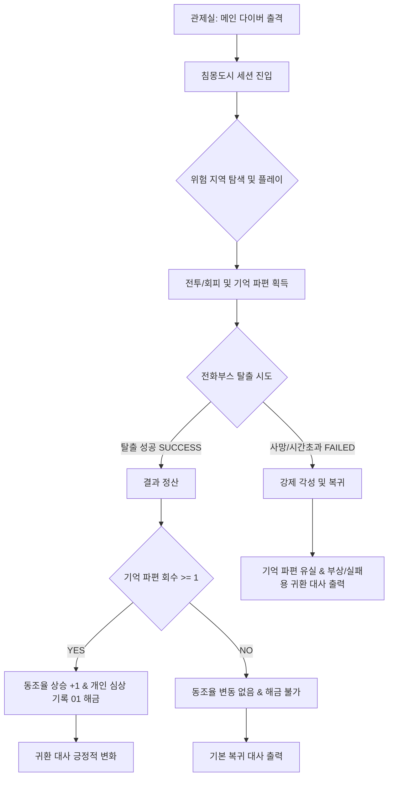

> [!WARNING]

> 본 문서는 방향성 재정의 회의 및 2차 피드백 결과에 맞춰 검수전 단계에서 P0 최소 루프 검증 스펙으로 개정한 2차 초안입니다.

> 메인 다이버 1인을 중심으로 한 최소 단위 핵심 루프를 정의하고 있으며, 미구현 확장 시스템은 백로그로 격리합니다.

# 서브컬처 캐릭터 애착 루프 기획서

## 1. 문서 목적

본 문서는 `침몽도시: 루시드 다이버`의 최종 프로토타입에서 검증할 **서브컬처 캐릭터 애착 루프**를 설계하기 위한 기획서입니다.

본 프로젝트의 최종 목표는 완결형 전체 게임 구현이 아닌, 메인 다이버 1명을 중심으로 **'PvE 익스트랙션 루프'와 '서브컬처 캐릭터 애착 루프'가 유기적으로 결합될 수 있음을 증명하는 포트폴리오 빌드**를 제작하는 것입니다. 

익스트랙션 세션을 통해 획득한 보상이 아웃게임의 감정적 보상(동조율, 시나리오 해금, 대사 변화)으로 자연스럽게 이어지는 최소 검증 구조를 설계합니다.

## 2. 최종 프로토타입에서 검증할 서브컬처 루프

프로토타입에서 검증하고자 하는 핵심 질문은 다음과 같습니다.

> *"익스트랙션 플레이를 통해 회수한 보상이 서브컬처 캐릭터 애착 보상으로 이어질 수 있는가?"*

플레이어는 아래 흐름을 통해 익스트랙션의 플레이 피드백과 캐릭터 유대의 시너지를 체감합니다.

```text

관제실

→ 메인 다이버 출격

→ 침몽도시 진입

→ 전투 / 회피

→ 기억 파편 회수

→ 전화부스 탈출

→ 결과 정산

→ 동조율 상승

→ 개인 심상 기록 해금

→ 귀환 대사 변화

```

## 3. 서브컬처 루프의 핵심 정의

### 3.1 기억 파편

- **정의**: 단순한 장비 제작 재료나 일반 잡동사니가 아닌, 메인 다이버의 소실된 과거 기억과 내면 서사를 담고 있는 핵심 회수 물질입니다.

- **수량 및 규칙**: 프로토타입 빌드에서는 **단 1종**만 사용합니다.

- **판정 조건**:

  - 세션 성공(전화부스 탈출) 및 기억 파편 최소 1개 이상 회수 시 아웃게임 동조율 상승 및 개인 심상 기록 해금 자격이 주어집니다.

  - 세션 실패 시 기억 파편은 유실되며, 동조율 상승 및 개인 심상 기록 해금은 발생하지 않습니다. 단, 실패 결과에 따른 전용 귀환 대사를 출력하여 강제 각성의 감정적 피드백을 전달하고 애착 형성의 여지를 제공합니다.

### 3.2 동조율

- **정의**: 관제자(플레이어)와 메인 다이버 사이의 신경 링크 안정도이자, 서브컬처식 호감도 및 유대 시스템의 최소 스펙 표현입니다.

- **프로토타입 표현**: 복잡한 성장 시스템은 구현하지 않으며, 결과창과 관제실에서 **'동조율 Lv.0 → Lv.1'** 또는 **'동조율 +1'** 텍스트 연출을 통해 유대감의 진전을 가시적으로 표현합니다.

### 3.3 개인 심상 기록

- **정의**: 다이버의 감춰진 백스토리, 과거의 정신적 상처 등을 텍스트 형태로 제공하는 캐릭터 서사 보상입니다.

- **수량**: 프로토타입에서는 **'개인 심상 기록 01' 1개**만 지원합니다. 

- **역할**: 기억 파편 회수를 통해 기록이 복구되면, 플레이어는 다이버의 감정적 진실을 열람할 수 있는 감상적 가치(Emotional Reward)를 얻게 됩니다.

### 3.4 귀환 대사 변화

- **정의**: 세션 탈출 결과와 기억 복구 여부에 따라, 결과창 및 관제실(로비)에 복귀했을 때 출력되는 다이버의 대사가 유동적으로 변화합니다.

- **목적**: 단순 텍스트 표시를 넘어 다이버와의 '관계 진전 및 거리감의 좁혀짐'을 플레이어가 체감하게 만드는 핵심 연출입니다.

## 4. 익스트랙션 루프와 서브컬처 루프의 연결 구조



## 5. 프로토타입 P0 구현 범위

최종 프로토타입 빌드에서 정상 작동을 목표로 반드시 개발해야 하는 핵심 피처 리스트입니다.

- **기억 파편**: 세션 내 필드에 기억 파편 1종 배치 및 획득 처리 로직

- **탈출**: 세션 내 특정 지점 전화부스 배치 및 탈출(성공) 처리

- **결과창**: 성공/실패 여부 및 획득한 기억 파편 개수 표기

- **동조율 연출**: 결과창/관제실 내 동조율 단계 변화 연출 노출

- **서사 해금**: 결과창 및 로비에서 '개인 심상 기록 01' 해금 플래그 활성화 및 텍스트 팝업 뷰어 연동

- **반응 연계**: 탈출 결과(성공/실패)에 따른 귀환 대사 가변 출력

- **비주얼**: 다이버 이름 표기 및 초상화 1개 고정 출력

- **인게임 대사**: 세션 진입, 적 발견, 피격, 탈출 성공 등 핵심 세션 상황 대사의 텍스트 출력

- **관제실 화면**: 메인 다이버 이름, 초상화, 현재 동조율 단계, 개인 심상 기록 잠금/해금 상태, 출격 버튼을 표시하는 최소 로비 UI (※ 개발 난이도상 별도의 독립 씬 구현이 어렵다면 결과창 이후 전환되는 간이 관제실 패널 형태로 대체 가능)

## 6. P0.5 선택 구현 범위

일정 및 리소스 여유에 따라 추가 검토하되, 구현되지 않아도 실패로 판단하지 않는 보조 피처입니다.

- 대사 출력 시 상황에 따른 캐릭터 일러스트 표정 변화(차분) 연출

- 개인 심상 기록 해금 시 별도의 텍스트 해금 및 개방 시각 연출

- 게임 진입 및 중요 씬에서의 컷인 연출

- 기억 파편 종류 세분화 및 등급제 추가

- 세션 실패 시 별도의 심상 기록 힌트(단서) 텍스트 제공

- 동조율 단계 데이터의 영속적 저장 및 누적 연산

- 관제실 로비 복귀 후 상호작용 시 대사 변화의 다각화 (2단계 이상)

## 7. 확장 백로그

정식 개발 기획서 혹은 확장 백로그로 이관하여 이번 프로토타입 검증 범위에서는 전면 제외하는 사양입니다.

- 메인 다이버 5인의 전체 스토리 및 서사 상세

- 캐릭터 수집, 뽑기, 영입 시스템 전반

- 호감도 향상을 위한 장비/선물 증정 및 누적 호감도 수치(예: 0~100 범위) 시스템

- 캐릭터 코스튬, 스킨, 감상실용 로비 뷰어 및 장기 비즈니스 모델(BM)

- 1명의 메인 다이버와 2명의 스트라이커를 조합하는 3인 팀 편성 및 스트라이커 스킬 링크

- 4인 멀티플레이 동기화 및 쓰러진 동료를 일으켜 세우는 소생 기믹

- 거대 보스 침식체 및 전투 위상 페이즈 변화 FSM

- 플레이어의 캐릭터 방어구 파츠 및 정신 장벽(정신력 수치) 설계

- 8대 주무기 및 보조무기 파츠 전체 개방 및 세부 스탯 설계

- 침몽도시 상가 구역의 대규모 심리스 맵

- 로비 기지 커스텀, 상점 거래, 무기 크래프팅 및 강화 시스템

## 8. 시스템 연동 항목

### 8.1 필요한 변수

시스템 및 개발 구현 시 공용으로 사용할 핵심 데이터 변수를 정의합니다.

- `memoryFragmentCount` (int): 플레이어가 현재 세션 중에 획득하여 보관하고 있는 기억 파편의 개수. (실패 시 0으로 초기화)

- `extractionResult` (enum/bool): 세션 종료 방식 판정값. (`SUCCESS` 또는 `FAILED`)

- `linkRateLevel` (int): 메인 다이버와의 동조율 단계. 프로토타입 기본값은 0.

- `linkRateGain` (int): 탈출 성공 및 기억 파편 회수 시 상승하는 동조율 단계. 기본값 +1.

- `memoryLogUnlocked` (bool): 개인 심상 기록 01의 잠금 해제 상태 플래그. (`true`일 시 열람 가능)

- `currentDialogueID` (string): 현재 UI 텍스트 상자에 노출할 다이버 대사의 고유 식별자.

- `returnDialogueID` (string): 세션 결과 판정에 따라 로비 복귀 시 출력해야 할 귀환 대사의 고유 식별자.

- `sessionState` (enum): 현재 플레이어의 공간 및 진행 상태. (`LOBBY`, `IN_GAME`, `RESULT`)

### 8.2 결과창 및 관제실(귀환 패널) 정보 구성

개발 상황에 따라 하나의 UI 패널(Result UI Canvas)에서 모든 정보를 일괄 노출하거나 통합하여 처리할 수 있으나, 시스템 논리 설계상 정보의 역할과 성격은 다음과 같이 명확히 분리하여 설명합니다.

#### [결과 정산] (세션 내 정산 정보 표시)

- **성공 및 실패 판정**: `extractionResult`에 따른 결과 배너 표시

- **플레이 타임**: 출격 후 탈출 완료 또는 강제 각성 시점까지의 누적 시간 기록

- **회수한 기억 파편 수**: 세션 내 획득한 `memoryFragmentCount` 수량 정산

#### [다이버 반응] (캐릭터 상호작용 피드백 표시)

- **귀환 대사**: 탈출 결과에 따른 다이버 리턴 대사 출력 (`returnDialogueID` 연동)

- **동조율 상승**: `linkRateLevel` 가산에 따른 단계 변화 연출 (예: `동조율 Lv.0 → Lv.1` 또는 `동조율 +1`)

#### [기록 해금] (서사 보상 인터페이스 제공)

- **해금 알림**: 개인 심상 기록 01의 해금 여부 출력 (`memoryLogUnlocked` 연동)

- **기록 보기 버튼**: 해금 판정 완료 시 개인 심상 기록 팝업 뷰어 진입 단추 활성화

### 8.3 해금 조건

- `memoryLogUnlocked` 활성화 조건:

  $$\text{extractionResult} == \text{SUCCESS} \quad \text{AND} \quad \text{memoryFragmentCount} \ge 1$$

- 정산 단계에서 위 조건이 만족되면 `memoryLogUnlocked` 변수값을 `true`로 셋업하고 UI 상에서 개인 심상 기록 01 뷰어 진입 단추가 개방됩니다.

### 8.4 성공 / 실패 처리

- **탈출 성공 시**:

  - `extractionResult = SUCCESS` 판정.

  - 회수한 기억 파편 수 정산 및 동조율 단계 가산 연산 (`linkRateLevel += linkRateGain`).

  - 해금 판정에 따라 `memoryLogUnlocked = true` 활성화.

  - `returnDialogueID`를 성공 귀환 전용 ID로 셋업.

- **탈출 실패 시**:

  - `extractionResult = FAILED` 판정.

  - 플레이어가 소지하고 있던 파편 소실 처리 (`memoryFragmentCount = 0`).

  - 동조율 가산 연산 및 해금 판정은 발생하지 않습니다.

  - `returnDialogueID`를 실패/부상 귀환 전용 ID로 셋업하여 강제 각성에 따른 전용 귀환 대사를 노출합니다.

## 9. 송예찬 담당 산출물 반영 슬롯

*해당 섹션의 정보는 송예찬 컨셉 기획자의 비주얼/시나리오 기획서가 완성 및 검수되는 대로 해당 산출물의 내용을 직접 연계 및 이식할 예정입니다.*

### 9.1 메인 다이버 기본 정보

- **이름**: [송예찬 산출물 반영 예정]

- **역할**: [송예찬 산출물 반영 예정]

- **첫인상**: [송예찬 산출물 반영 예정]

- **성격 키워드**: [송예찬 산출물 반영 예정]

- **유저 감성 타깃**: [송예찬 산출물 반영 예정] *(검수 기준: 이 캐릭터를 좋아할 이유가 명확해야 함)*

- **갭 포인트**: [송예찬 산출물 반영 예정] *(검수 기준: 첫인상과 다른 약점/반전이 있어야 함)*

### 9.2 관제자와의 관계

- **초기 관계**: [송예찬 산출물 반영 예정]

- **세션 중 관계**: [송예찬 산출물 반영 예정]

- **탈출 성공 후 변화**: [송예찬 산출물 반영 예정] *(검수 기준: 성공 후 거리감 변화가 보여야 함)*

- **실패 후 변화**: [송예찬 산출물 반영 예정] *(검수 기준: 실패 후 감정적 피드백이 전해져야 함)*

### 9.3 세션 상황 대사

*(검수 기준: 단순 상황 보고가 아닌 캐릭터 성격과 태도가 자연스럽게 묻어나는 대사여야 함)*

- **세션 시작**: [송예찬 산출물 반영 예정]

- **적 발견**: [송예찬 산출물 반영 예정]

- **피격**: [송예찬 산출물 반영 예정]

- **기억 파편 획득**: [송예찬 산출물 반영 예정]

- **마나 부족 / 위기**: [송예찬 산출물 반영 예정]

- **탈출 성공**: [송예찬 산출물 반영 예정]

- **강제 각성 / 실패**: [송예찬 산출물 반영 예정]

- **관제실 귀환**: [송예찬 산출물 반영 예정]

- **심상 기록 해금**: [송예찬 산출물 반영 예정]

### 9.4 개인 심상 기록 01

- **제목**: [송예찬 산출물 반영 예정]

- **해금 조건**: [기억 파편 1개 이상 회수 및 탈출 성공]

- **본문**: [송예찬 산출물 반영 예정] *(검수 기준: 다음 기록을 보고 싶게 만드는 떡밥이 포함되어야 함)*

- **기록 복구율**: [송예찬 산출물 반영 예정]

### 9.5 필요 비주얼 리소스

- **메인 다이버 초상화**: [송예찬 산출물 반영 예정]

- **메인 다이버 스탠딩**: [송예찬 산출물 반영 예정]

- **표정 차분 필요 여부**: [송예찬 산출물 반영 예정]

- **기억 파편 오브젝트**: [송예찬 산출물 반영 예정]

- **전화부스**: [송예찬 산출물 반영 예정]

- **몬스터 1종 비주얼**: [송예찬 산출물 반영 예정]

- **관제실 또는 결과창 UI 분위기**: [송예찬 산출물 반영 예정]

## 10. 정식 게임 확장 방향

정식 게임에서는 동조율을 다단계 성장 구조로 확장할 수 있습니다. 각 다이버는 복수의 개인 심상 기록, 전용 대사, 비주얼 보상, 관계 시너지 등을 가질 수 있습니다.

- **다단계 동조율 성장**: 동조율을 레벨 또는 수치 단계를 거치는 점진적 성장 구조로 확대 적용합니다.

- **개인 에피소드 및 대사 다각화**: 동조 단계에 따른 추가 심상 기록 개방, 상호작용 로비 모션, 전용 스킨/코스튬 및 복합 보상 시스템을 도입합니다.

- **다수 다이버 시너지**: 복수 캐릭터 편성 연동 시 유대 시너지를 연출하는 전용 인터랙티브 연출 및 스킬 체인을 가동합니다.

- **기억 기물 파밍 연계**: 단순 재료 파밍을 탈피해 캐릭터만의 특수한 스토리라인을 열어주는 고유 유품 및 기억 기물 탐색 모델로 확장합니다.

## 11. 프로토타입에서 유저가 느껴야 하는 감정

본 프로토타입에서 유저가 느껴야 하는 핵심 감정은 다음과 같습니다.

1. **“이 캐릭터와 함께 위험한 곳에 들어갔다.”**

2. **“내가 회수한 기억 파편이 단순 아이템이 아니라, 이 캐릭터의 과거와 연결되어 있다.”**

3. **“탈출에 성공했기 때문에 캐릭터가 나를 조금 더 신뢰하게 되었다.”**

4. **“심상 기록을 통해 이 캐릭터의 감춰진 사정을 조금 알게 되었다.”**

5. **“다음 세션에서도 이 캐릭터의 기억을 더 회수하고 싶다.”**

이 감정 흐름이 성립하면, 본 프로토타입은 서브컬처 캐릭터 애착 루프 검증에 성공한 것으로 간주합니다.

---

## 핵심 요약

본 프로토타입에서 검증할 것은 캐릭터 수량이 아니라,

기억 파편 회수라는 익스트랙션 보상이

동조율 상승, 개인 심상 기록 해금, 귀환 대사 변화라는

서브컬처 캐릭터 애착 보상으로 이어지는 구조다.

---

## 📜 Revision History

| 날짜 | 버전 | 내용 | 작성자 |

| :---: | :---: | :--- | :---: |

| 2026.06.16 | v1.00 | - 검수전 임시 개정안 작성<br>- 서브컬처 캐릭터 애착 설계를 위한 신규 기획서 등록 | 송예찬 |

| 2026.06.17 | v1.10 | - 방향성 재정의 회의 결과에 맞춰 검수전 P0 최소 루프 검증 스펙으로 리프레이밍<br>- 프로토타입 검증 루프 정의 및 불필요한 확장 시스템 백로그 이관<br>- 변수 및 결과창 사양, 해금 조건 및 성공/실패 연동 규칙 정립 | 장수영 |

| 2026.06.17 | v1.11 | - 유저가 프로토타입에서 느껴야 하는 5가지 핵심 감정 정의 섹션(11장) 추가 | 장수영 |

| 2026.06.17 | v1.20 | - 2차 수정 사항 피드백 반영<br>- 동조율 단계(`linkRateLevel`) 표현 및 변수 개편<br>- 실패 시 보상 유실 및 전용 귀환 대사 피드백 명문화<br>- P0 구현 범위 내 '관제실 화면' 정의 추가<br>- 결과창 및 관제실의 논리적 정보 역할 구분<br>- 정식 게임 확장 방향 표현 완화 및 송예찬 산출물 슬롯 검수 기준 추가 | 장수영 |
