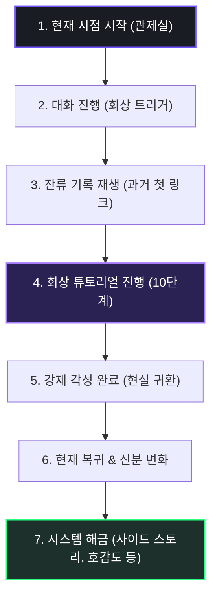

> [!WARNING]

> 본 문서는 검수 전 상태의 시나리오 기획서이며, 송예찬 담당자의 검토 및 승인 대기 중인 수정 제안본입니다.

> v1.13에서는 사용자 피드백을 추가 반영하여 회상 튜토리얼 단계별 대사 스크립트 및 프롤로그 트리거/귀환 대사를 더 직관적이고 자연스러운 구어체 반말 톤으로 전면 정제하여 몰입도를 높였습니다.

# 🌌 침몽도시: 루시드 다이버 (시나리오 V1.13 - 프롤로그 및 채린 서사 개편안)

**시나리오 V1.13 | 2026.06.17**

> **주요 업데이트 사양**: 

> - **프롤로그 서사 구조 개편**: [현재 시점 시작] ➡️ [대화를 통한 과거 회상 트리거] ➡️ [회상 튜토리얼 진행] ➡️ [현재 복귀 및 시스템 해금] 구조 확립.

> - **신규 메인 다이버 '채린' 설정 통합**: 기존 한서윤 설정을 대체하여 첫 번째 동조자이자 메인 다이버인 '채린'의 프로필 수록.

> - **성격-능력 융합 설계**: 채린의 성격적 특징인 '불신'이 침몽도시 내부에서 감지 및 생존 능력으로 발현되는 구조화.

> - **시스템 해금 매핑**: 튜토리얼 완료 후 호감도, 사이드 스토리, 심상 기록 등의 해금 구조 연계.

---

## 1. 세계관 및 배경 설정

### 1.1 사건 발생일 (The Day of Incident)

인류가 아직 범접하지 못한 영역인 **‘꿈’**은 오랫동안 개인의 머릿속에서만 일어나는 현상으로 여겨졌다. 그러나 한 과학자가 대기 중에 비활성 상태로 떠다니는 미지의 입자 **‘루시드(Lucid)’**를 발견하면서 상황은 달라졌다. 

*   **루시드 입자의 성질**: 평소에는 관측되지 않지만, 특정 주파수의 뇌파와 전자장에 반응하면 활성화되어 꿈의 이미지를 물리적 형상으로 응고시킴.

*   **루시드 캡슐**: 사용자의 수면 중 뇌파와 시각피질 신호를 분석하고, 이를 루시드 입자에 투사해 꿈의 장면을 현실에 홀로그램 형태로 재현하는 장치.

초기 실험에서 루시드 캡슐은 새로운 유형의 홀로그램 오락 장치처럼 여겨졌다. 사람들은 자신의 꿈이 눈앞에 펼쳐지는 환상적인 체험을 즐겼고, 거대 자본 기업은 이 기술을 세계에서 가장 부유한 도시의 신규 핵심 오락 산업으로 포장하여 홍보했다.

### 1.2 침몽도시(沈夢都市)의 탄생

루시드 캡슐은 정식 출시 첫날부터 폭발적인 반응을 얻었다. 한정 판매된 **1,000대**의 캡슐은 순식간에 매진되었고, 구매자들은 동시에 캡슐에 접속하여 깊은 수면에 들어갔다.

그러나 루시드 캡슐은 각자의 꿈을 완전히 격리된 공간에 투사하는 장치가 아니었다. 캡슐은 도시 상공의 루시드 입자를 공통 매질로 공유하고 있었고, 소규모 테스트에서는 드러나지 않았던 **대규모 꿈 파장의 간섭 및 공명 현상**이 동시 접속을 통해 폭발하듯 발생했다.

> 서로 다른 1,000명의 기억, 공포, 욕망, 무의식의 이미지가 하나의 거대한 악몽 네트워크로 뒤섞였고, 그 순간 도시의 일부 구역은 더 이상 현실도 단순한 꿈도 아닌 왜곡된 중첩 공간으로 변질되었다.

꿈의 식생이 건물 벽을 타고 자라났고, 신호등은 기이한 심장 박동에 맞춰 점멸했으며, 참가자들의 기억 속에 존재하던 거리와 방들이 실제 아스팔트 도로 위에 무작위로 겹쳐 나타났다. 정부는 즉시 해당 구역을 물리적으로 격리 및 봉쇄했으며, 사람들은 그 구역을 **‘침몽도시’**라 부르기 시작했다.

---

## 2. 꿈의 법칙과 대항 수단

### 2.1 현실 무기가 멈춘 도시

침몽도시 내부에서 재현된 꿈은 단순한 시각적 환영이 아니며, 현실 물리 법칙과 기이하게 상호작용했다.

*   **적대적 괴이들**: 뒤섞인 무의식의 악몽에서 태어난 괴이들은 인간을 적대하고 공격함.

*   **몽막(夢幕)의 거부**: 이들의 몸을 둘러싸고 있는 '몽막'은 현실의 물리적 물질을 밀어내는 성질을 지님. 총탄은 형체를 그대로 통과해 흐려졌고, 화약 폭발은 단순한 안개처럼 무력하게 흩어짐.

도시를 수색하던 초기 구조대와 비공식 용병들은 이 꿈의 법칙을 알지 못한 채 진입했다가 전멸에 가까운 피해를 입었다. 현실의 전장 상식과 현대 무기는 아무런 상처를 입히지 못했고, 그 안에서 살아남아 전투하기 위해서는 꿈과 동일한 매질로 이루어진 수단이 필수적이었다.

### 2.2 드림 포지드(Dream-Forged)의 발견

최초의 비공식 탐사 참사 이후, 침몽도시에 진입했던 10명의 용병 중 유일하게 살아 돌아온 한 명의 생존자가 존재했다. 그는 동료들이 현실 총기를 난사해도 괴이를 막지 못하고 흩어지는 절망적인 상황 속에서, 버려진 꿈의 상가 내부에서 신비로운 형상의 총기를 발견해 살아남았다고 증언했다.

*   **드림 포지드**: 루시드가 누군가의 무의식 속 무기 이미지를 형상화한 **심상무장**.

    *   *형태*: 어린 시절 가지고 놀던 장난감 총의 실루엣, 전장에서 사용했던 군용 소총의 기억, 꿈속에서 보았던 초현실적인 기계 장치가 기묘하게 얽힌 모습.

    *   *특징*: 루시드 입자와 동일한 매질로 구성되어 있어 침식체의 몽막을 타격하고 찢어발길 수 있는 유일한 수단. 침몽도시 내부에서만 완전한 물리적 출력을 가진다.

### 2.3 루시드 오염과 다이버의 발굴

드림 포지드를 확보했음에도 탐사는 극도로 제한적이었다. 첫 생존자는 현실로 귀환한 지 며칠 만에 갑작스럽게 사망했으며, 부검 결과 신경계가 활성화된 루시드 입자에 의해 완전히 붕괴되어 있었다.

> [!WARNING]

> **루시드 오염 (Lucid Pollution)**

> 침몽도시 내부의 루시드 입자는 호흡기, 피부, 오감을 통해 인체에 침투합니다. 일정 한계 수치를 초과하면 대상의 기억과 정신 자체가 침몽도시의 구조물과 악몽 네트워크로 영원히 끌려 들어가 소실됩니다.

이 비극적인 사실이 퍼지자 자원하는 용병들은 사라졌고, 침몽도시는 내부의 **몽유물**이 축적됨에 따라 점점 외부 현실 영역으로 경계를 확장해 나갔다. 그에 따라 도시 외부에서도 자는 동안 침몽도시의 골목을 걷거나, 특이한 기물의 형상을 생생하게 떠올리는 등 **루시드 공명 증상**을 호소하는 자들이 증가했다.

정부와 특수 연구 조직은 이 사태를 방치할 수 없다고 판단, 침몽도시와 특정 파장으로 안전하게 동조할 수 있는 인재들을 규합하기 시작했다. 이들이 바로 침몽도시의 유물을 회수하고 경계를 막기 위해 훈련된 특수 요원, **‘루시드 다이버’**다.

---

## 3. 링크 관제자와 다이버

### 3.1 침몽도시 대응의 조율자, 루시드 링크 관제사

국가소속 침몽도시 대응 기관(NDMA)에는 침식 구역의 팽창을 막고 자원을 회수하기 위해 다수의 관제사와 다이버들이 소속되어 있으며, 이들은 각자의 독립적인 팀(소대)을 이루어 침몽도시 전역을 동시 탐사한다. 플레이어는 이 수많은 정식 관제사 중 한 명으로, 특출난 공명 능력을 지니고 있다.

*   **플레이어의 비밀**: 사고 당일, 플레이어는 폭주한 루시드 캡슐에 접속해 있었던 생존자로, 의식이 침몽도시 내부로 끌려 들어갔다가 기적적으로 귀환했다. 이 사고로 기억의 일부와 미련이 꿈속에 묶였으나, 그 대가로 침몽도시 내부 신호를 수신하는 특이 반응 적성을 얻었다.

*   **관제사 풀(Pool) 내의 특수성**: 플레이어는 NDMA 내에 존재하는 여러 관제사 중 한 명이지만, 극도의 불신을 가진 메인 다이버 '채린'의 뇌파와 완벽한 파장 동조(싱크)를 이뤄낼 수 있는 유일한 전담 관제사이다.

### 3.2 플레이어의 사명

플레이어에게 주어진 사명은 단순히 현장 다이버 1명을 보조하는 데 그치지 않고, 자신이 지휘하는 탐사 소대를 이끌고 임무를 완수하는 것이다. 다이버가 침식 지대에 접속하는 순간, 플레이어는 **루시드 링크**를 개시한다.

*   소대원들의 뇌파를 고정해 **루시드 오염 진행을 최대한 지연**.

*   무장의 붕괴를 방지하는 **드림 포지드 출력 캘리브레이션**.

*   몽유물 확보에 따른 파동 간섭을 차단하고 **생존 가능한 탈출 시간을 계산**.

*   한계 상황 발생 시 정신을 비상 회수하는 **'강제 각성' 타이밍 지휘**.

플레이어는 소대원들을 이끌며 침몽도시에 남겨진 **자기 자신의 잃어버린 기억**과 사건의 감춰진 진실을 추적해야 한다.

### 3.3 공식 전담 팀 편성과 메인 다이버 '채린'

플레이어와 채린은 NDMA 산하 **'제4 특수 탐사 소대'**로 공식 편성된 한 팀이다. 채린은 플레이어의 관제석에서 최초로 완벽한 파장 동조를 이뤄낸 메인 다이버이자 파트너이다.

*   **성향 및 성격**: 타인의 말보다 자신이 직접 보고 겪은 것만 믿는 지독한 **'방어적 불신'**의 소유자. 과거 사건의 상처로 인해 타인에게 마음을 쉽게 열지 않으며, 플레이어가 아닌 다른 관제사들과는 파장 매칭 자체가 불가능했다.

*   **소대 내의 결속**: 플레이어와의 링크를 통해서만 채린은 꿈속의 왜곡을 뚫고 안전하게 완전한 전투 출력을 발휘할 수 있으며, 이 때문에 두 사람은 제4 소대의 핵심 중추로 묶이게 되었다.

*   **공유되는 환상**: 두 사람의 동조율이 상승할 때마다 링크 채널에는 **'붉게 깨진 유리 파편, 비정상적으로 흔들리는 안개 너머의 시야, 그리고 서로를 붙잡았던 필사적인 손'**이 노이즈처럼 흘러나온다.

### 3.4 다이버 모집(리쿠르팅)과 스쿼드 확장

제4 특수 탐사 소대는 최초에 관제사인 플레이어와 메인 다이버 채린 단 둘로 시작하지만, 침몽도시 심층부의 고위험 침식 구역을 탐사하기 위해서는 메인 다이버 1명만으로는 전술적 생존이 불가능하다.

*   **모집(리쿠르팅)의 필요성**: 플레이어는 소대의 지휘관으로서 추가적인 화력 및 유틸리티를 지원할 서포트 다이버 또는 교체 투입할 서브 메인 다이버를 NDMA 기관 내에서 초빙하거나, 외부에서 발굴하여 소대원으로 모집해야 한다.

*   **잔류 기억 복구**: 모집된 다이버들은 저마다 침몽도시에 남겨진 고유한 **‘잔류 기억(심상기물)’**을 가지고 있다. 플레이어는 팀을 이끌고 이들의 잃어버린 기억 기물을 회수하여 자아를 복구시켜 주며, 이를 통해 다이버들의 신뢰를 얻고 소대의 편제(1 메인 + 2 서포트)를 확장·강화해 나간다.

---

## 4. 프롤로그 서사 구조

프롤로그는 플레이어와 채린의 현재 시점 대화에서 출발하여 자연스럽게 과거 사건의 회상으로 이어지고, 튜토리얼 플레이를 거쳐 현재로 복귀하는 액자식 구성으로 진행된다.



### 4.1 현재 시점 시작

게임 타이틀 화면 이후, 로딩이 완료되면 즉시 어두운 관제실 모니터와 깜빡이는 홀로그램 UI가 페이드인된다.

*   **시스템 텍스트 연출**:

    ```text

    [SYSTEM] 국가소속 침몽도시 대응 기관 (NDMA)

    [SYSTEM] 루시드 링크 관제실 (LLCR-04)

    [SYSTEM] 관제자 등록명: 플레이어 (PLAYER)

    [SYSTEM] 메인 다이버: 채린 (CHAERIN)

    [SYSTEM] 링크 점검 준비 중... 파장 동조 개시.

    ```

*   **상황 설정**: 플레이어는 관제석에 앉아 채린과의 정기 링크 점검을 준비하고 있다. 통신 스피커를 통해 지직거리는 노이즈와 함께 채린의 건조한 목소리가 흘러나온다.

### 4.2 회상 트리거 대사 스크립트

두 사람의 사적인 대화가 깊어지며 과거의 기억을 강하게 이끌어낸다.

*   **채린**: "오늘 임무 나왔어?"

*   **플레이어**: "응, 청몽 외곽이야. 슬슬 준비하자."

*   **채린**: "...또 지옥행이네."

*   **플레이어**: "무리하지 마. 신호 이상하면 바로 끌어올릴 테니까."

*   **채린**: "됐어. 네가 뒤에 있을 땐 길 잃은 적 없으니까."

*   **플레이어**: "처음엔 내 목소리만 들려도 진저리 쳤으면서."

*   **채린**: "당연한 거 아냐? 모르는 목소리가 머릿속을 헤집는데 누가 좋아해?"

*   **플레이어**: "나도 마찬가지야. 네 시야가 내 머릿속에 강제로 동조되니까 엄청 어지러웠다고."

*   **채린**: "...그날 기억나? 우리 처음 연결됐던 날."

*   **플레이어**: "청몽 교차로."

*   **채린**: "그 번지르르한 이름, 진짜 딱 질색."

*   **플레이어**: "넌 다르게 불렀어?"

*   **채린**: "출구 없는 덫. 내 경고를 아무도 안 믿어줬던 날."

> 화면 전체에 디지털 노이즈가 강하게 발생하며, 적색 시스템 경고등과 함께 잔류 로그가 출력된다.

*   **시스템 로그**:

    ```text

    [WARNING] 동조율 급증으로 인한 과거 데이터 역류 발생.

    [SYSTEM] 잔류 기록 재생: 첫 번째 링크 (First Link)

    [SYSTEM] 대상 지대: 청몽 교차로 테스트 돔 (Test Dome 01)

    ```

*   **연출**: 화면이 화이트아웃되며 차가운 연구 시설과 보랏빛 균열이 뒤섞인 과거의 회상 튜토리얼 스테이지로 진입한다.

---

## 5. 회상 튜토리얼 (Tutorial Stage)

### 5.1 회상 속의 개연성

회상 시점에서 플레이어는 아직 정식 관제자가 아닌 **'루시드 사고 생존자이자 특이 반응자'** 신분이다. 채린 역시 정식 다이버가 아닌 실험 대상에 가깝다. 플레이어는 관제 UI를 보며 연구원들의 지시에 따라 채린을 돕는 '테스트' 형태로 튜토리얼을 진행한다. 이를 통해 플레이어는 자신의 능력을 깨닫고, 채린은 최초로 타인(플레이어)의 인도에 의해 생존하게 된다.

### 5.2 튜토리얼 진행 10단계 및 게임 기능

| 단계 | 장면 (Scenario Scenario) | 학습 및 해금되는 게임 기능 | UI 및 연출 가이드 |

| :---: | :--- | :--- | :--- |

| **1** | **연구 시설 링크 테스트** | 관제 UI 소개 | 기본 화면 구성 요소(체력, 싱크율, 미니맵) 학습 |

| **2** | **채린과의 첫 통신** | 대화 선택지 시스템 | 채린의 날 선 태도와 신뢰도 반응을 결정하는 대사 선택 |

| **3** | **청몽 교차로 진입** | 이동 튜토리얼 | 화면 가상 패드 또는 WASD를 이용한 기초 이동 및 카메라 조작 |

| **4** | **시야의 어긋남 인지** | 관제자 시야 보정 | 실제 지형과 가상 지도가 어긋난 지점을 찾아 터치 보정하여 길 개척 |

| **5** | **꿈식자 출현** | 전투 튜토리얼 | 적의 출현에 대응하여 기본 공격 및 회피 타이밍 학습 |

| **6** | **드림 포지드 불안정** | 출력 보정 및 에임 가이드 | 동조 주파수 보정을 가동하여 채린의 에임 보정(Passive)을 활성화하고 기본 권총 정밀 사격으로 꿈식자 처치 유도 |

| **7** | **깨진 렌즈 조각 발견** | 심상기물 회수 | 꿈속에 고체화되어 흩어진 채린의 기억 조각(렌즈) 파밍 |

| **8** | **오염 수치 상승** | 제한 시간 및 위험도 안내 | 상단의 오염도 게이지가 차오르기 전에 서둘러야 함을 인지시킴 |

| **9** | **전화부스 도달** | 탈출 튜토리얼 | 탈출 지점인 공중전화부스에 도달하여 3초간 수화기 링크 유지 |

| **10** | **강제 각성 성공** | 익스트랙션 완료 | 붕괴하는 교차로에서 동조율을 최대로 끌어올려 현실로 강제 인양 |

### 5.3 회상 튜토리얼 단계별 대사 스크립트

튜토리얼 각 단계별로 출력되는 시스템 및 인물 간 대사 가이드라인이다.

#### [1단계: 연구 시설 링크 테스트]

*   **연구원**: "반응자 접속 확인. 동조율 15% 고정. 채널 열린다. 테스트 돔의 신호를 따라가라."

*   **플레이어**: "윽... 머리 깨질 것 같네. 이 소리는 뭐야?"

*   **연구원**: "꿈속에서 발생하는 노이즈다. 딴생각 하지 말고 채린의 정신 주파수에 고정해."

#### [2단계: 채린과의 첫 통신 (대화 선택지)]

*   **채린**: "아윽...! 머리 쪼개질 거 같아... 누구야, 머릿속에서 시끄럽게 떠드는 놈이!"

*   **선택지 A [진정시키기]**: "진정해. 널 도우러 왔어. 날 믿어."

    *   *채린 A 반응*: "믿는다고? 웃기지 마. 다들 날 미친 사람 취급했으면서!"

*   **선택지 B [설명하기]**: "난 관제사야. 지금 네 신경망이 붕괴 직전이야. 내 지시에 집중해."

    *   *채린 B 반응*: "연구소 끄나풀이야? 날 실험체 취급하더니 머릿속까지 엿보시겠다? 어디 마음대로 해봐!"

#### [3단계: 청몽 교차로 진입]

*   **연구원**: "교신 성공. 채린을 진입시켜라. 링크 유지하면서 계속 전진시켜."

*   **플레이어**: "채린, 들려? 거기서 빠져나가야 해. 보라색 균열이 보이는 길로 가."

*   **채린**: "내 다리가 제멋대로 움직이는 것 같아... 기분 나쁘데, 가랄 대로 가줄게."

#### [4단계: 시야의 어긋남 인지 (관제자 시야 보정)]

*   **채린**: "잠깐, 길이 끊겼어! 온통 낭떠러지라 더는 못 가!"

*   **플레이어**: "안개가 만든 환각이야. 내 지도엔 멀쩡해. 시야 동조를 보정할 테니까 나 믿고 가."

*   **채린**: "눈앞이 절벽인데 가라고? 제정신이야?!"

*   **플레이어**: "(시야 보정 집행) ...보정 끝났어. 다시 앞을 봐."

*   **채린**: "어...? 절벽이... 평지로 바뀌었잖아? 머릿속에서 뭘 건드린 거야?"

#### [5단계: 꿈식자 출현 (전투 튜토리얼)]

*   **채린**: "안개 속에서 괴물들이 기어 나와! 나더러 이 권총 하나로 다 잡으라고?!"

*   **플레이어**: "기본 에너지 권총이야. 일단 쏴봐. 제일 가까운 놈부터 처리해!"

*   **채린**: "하, 밑져야 본전이지! ...윽, 빗나갔잖아!"

*   **플레이어**: "당황하지 마. 일단 거리를 벌리면서 쏴!"

#### [6단계: 출력 보정 및 에임 가이드]

*   **채린**: "총이 너무 흔들려...! 조준선이 겹쳐 보여서 못 맞추겠어!"

*   **플레이어**: "뇌파 동조율 정렬 완료. 에임 보정 들어간다! (출력 보정 진행(패시브 스킬)) ...표적 고정됐어, 지금 쏴!"

*   **채린**: "좋아, 조준선이 딱 잡혔어! (정밀 사격 및 꿈식자 처치) ...맞았어. 이거 꽤 쓸 만하네."

#### [7단계: 깨진 렌즈 조각 발견 (심상기물 회수)]

*   **플레이어**: "처치 확인. 바닥에 반짝이는 유리 파편 주워. 네 파장이랑 동조하고 있어."

*   **채린**: "이건... 내 안경알 조각...? 왜 이런 게 꿈속에 굴러다녀?"

*   **플레이어**: "네 기억이 실체화된 거야. 돌아갈 때 필요하니까 잘 챙겨 둬."

#### [8단계: 오염 수치 상승]

*   **연구원**: "경고. 오염 수치 80% 돌파. 한계 도달까지 60초 남았다. 당장 탈출시켜!"

*   **플레이어**: "채린, 서둘러! 오염도가 너무 높아. 정신 잃으면 안 돼!"

*   **채린**: "머릿속이 흐려져... 사방에서 자꾸 이상한 소리가 들려..."

#### [9단계: 전화부스 도달 (탈출 튜토리얼)]

*   **플레이어**: "저기 주황색 공중전화부스 보이지? 저기가 탈출구야. 수화기를 들어!"

*   **채린**: "전화기...? 자꾸 내 안에서 전화 벨소리가 울려..."

*   **플레이어**: "수화기를 들어! 내 목소리에만 집중해. 뇌파 동조율 100% 맞춘다!"

#### [10단계: 강제 각성 성공 (익스트랙션 완료)]

*   **연구원**: "한계 초과! 뇌파 붕괴 5초 전! 링크 끊고 당장 강제 각성해!"

*   **플레이어**: "아직 안 돼, 정신 놔버리지 마! ...강제 각성 가동! 채린, 눈 떠!"

*   **채린**: "아... 목소리가... 점점 멀어져..."

*   **시스템**: `[SYSTEM] 강제 각성 승인. 다이버 신경 인양 완료.`

---

## 6. 현재 복귀 및 시스템 해금

### 6.1 현재 복귀 및 신분 변화

튜토리얼이 완료되면 다시 눈부신 백색 광원과 함께 현재 시점의 세련되고 조용한 관제실로 카메라가 복귀한다.

*   **현재 상태 데이터 동기화**:

    ```text

    [COMPLETED] 잔류 기록 재생 종료. 현실 동기화 완료.

    [PROFILE] 소속: 국가 침몽 대응 기관 (NDMA) 제4 특수 탐사 소대

    [PROFILE] 직책: 소대 지휘관 겸 전담 루시드 링크 관제자

    [PROFILE] 메인 다이버: 채린 (CHAERIN)

    [PROFILE] 현재 동조율: 71% (상태: 작전 대기 가능)

    [SYSTEM] 과거 기록 분석을 통해 일부 데이터 권한이 해금되었습니다.

    ```

*   **의의**: 회상 속 불안정했던 실험체와 반응자가 아니라, 이제 두 사람이 하나의 공식 탐사 소대로 묶여 서로를 신뢰하고 함께 팀을 키워나가는 정식 파트너 관계가 되었음을 시각적으로 보여준다.

### 6.2 현재 복귀 시점 대사 스크립트

현실로 복귀한 후 관제실에서 나누는 두 사람의 최종 결속 대사이다.

*   **플레이어**: "하아... 하아..." (이마의 땀을 닦으며 호흡을 가다듬는다)

*   **통신 스피커 (채린)**: "...내 목소리 들려? 수고했어. 첫 동조 데이터 재생해 보니까 기분 진짜 묘하네."

*   **플레이어**: "그러게. 그때는 날 엄청 싫어했었지."

*   **채린**: "지금도 딱히 널 다 믿는 건 아냐. ...그래도 이 소대에서만큼은 네 신호만 따라갈게."

*   **플레이어**: "고마워, 채린. 나도 끝까지 서포트할게."

*   **채린**: "내 길만 방해하지 마. 곧 실전 투입이니까, 지휘관답게 대원들 모집이나 해 둬."

*   **플레이어**: "알았어, 곧바로 소대원 충원을 준비할게." (화면이 메인 로비 UI로 연출되며 로비 대기 자세의 채린이 배치됨)

### 6.3 해금 시스템 상세 명세

프롤로그가 종료되는 즉시 로비 화면으로 전환되며, 아래의 핵심 시스템 해금 팝업이 순차적으로 발생한다.

```text

★ SYSTEM UNLOCKED ★

- 채린 사이드 스토리: '불신의 몽흔' 개방

- 채린 호감도 시스템 활성화

- 개인 심상 기록 보관소 오픈

```

#### ① 채린 사이드 스토리 (불신의 몽흔)

*   **설명**: 채린이 가진 트라우마와 불신의 원인을 추적하는 외전 시나리오.

*   **기능**: 메인 스토리 진행 및 특정 몽유물 회수를 통해 에피소드가 열리며, 클리어 시 채린의 능력치가 상승한다.

#### ② 호감도 시스템

*   **설명**: 관제사(플레이어)와 다이버(채린) 간의 유대 강도를 나타내는 수치.

*   **기능**: 로비 대화 선택지, 선물하기, 임무 동행 등을 통해 호감도 포인트를 획득하며, 단계별로 로비 보이스 및 비밀 프로필이 해금된다.

#### ③ 개인 심상 기록 (관찰 로그)

*   **설명**: 제3자(NDMA 수석 연구원, 현장 구조대원, 동료 관제사 등)의 관점에서 채린의 행적, 특화 심상무장의 운용 방식, 침식체 대응 행동, 타인을 대하는 태도(경계심 및 독단적 성향) 등을 기록해 놓은 극비 보고서 데이터베이스.

*   **기능**: 플레이어는 침몽도시 탐사 중 획득한 '파손된 오디오 로그', '관찰 일지 파편' 등의 특수 기물을 획득하여 기록을 해금한다. 열람을 통해 채린의 고유 능력 기원과 트라우마에 대한 제3자의 객관적 분석(그녀의 의심이 실제 공간 왜곡을 어떻게 감지했는지 등)을 수집하고 입체적으로 분석하는 추리형 정보 수집 콘텐츠 역할을 한다.

#### ④ 로비 대화 & 몽흔 정보

*   **설명**: 관제실 로비에 상주하는 채린과 터치 및 일상 대화가 가능해지며, 그녀의 프리즘/유리 속성에 따른 '몽흔 정보' 도감이 개방된다.

---

## 7. 채린 캐릭터 심층 기획

### 7.1 캐릭터성: 침몽도시 생존을 위한 '방어적 불신'

채린의 성격은 단순한 까칠함이나 불친절이 아니다. 그녀의 불신은 **"내가 직접 확인하지 않은 모든 정보는 나를 죽일 수 있다"**는 극단적인 방어 기제에서 출발한다. 침몽도시의 왜곡된 환경 안에서 이 지독한 불신은 오히려 그녀를 생존하게 만드는 날카로운 감각(능력)으로 변환된다.

### 7.2 성격과 인게임 능력의 연계

| 성격적 특징 | 꿈속에서의 능력 변환 (인게임 스킬/패시브) | 전투적 효과 및 개성 |

| :--- | :--- | :--- |

| **남의 말을 쉽게 믿지 않음** | **시야 왜곡 역추적 (Passive)** | 시스템 UI 정보와 실제 지형의 불일치(숨겨진 길)를 감지하여 맵 상에 하이라이트 표시. |

| **직접 본 것만 믿음** | **유리/렌즈 왜곡 굴절 (Active)** | 렌즈를 통해 비치는 굴절된 빛을 실체화하여 적의 투사체를 반사하거나 굴절시키는 방어 장벽 전개. |

| **주변을 계속 의심함** | **위험 감지 레이더 (Passive)** | 보이지 않는 적(은신)이나 미리 배치된 꿈속 덫의 뇌파 반응을 의심하여 미니맵에 경고 표시. |

| **타인에게 의존하지 않음** | **고독한 생존자 (Passive)** | 파티원 생존 수에 따라 자신의 방어력과 회피율이 급증하여 극한의 1:1 상황에서 높은 생존력 발휘. |

| **관제사를 신뢰하게 된 후** | **공동 조율: 링크 스킬 (Ultimate)** | 관제사의 지시 타이밍에 맞춰 극대화된 뇌파 공명을 방출, 화면 전체의 몽막을 붕괴시키는 연타 공격. |

### 7.3 채린 사이드 스토리 큰 줄기 (4단계 구성)

#### [사이드 1: 불신의 시작]

*   **시놉시스**: 루시드 사고 발생 전, 채린은 도시 곳곳의 유리창이나 거울 속에서 기이한 보랏빛 균열과 꿈의 예조를 목격했다. 그녀는 부모님과 친구들에게 이를 경고했으나, 모두가 그녀를 '스트레스성 피해망상 환자'로 취급하며 정신과 치료를 권유했다. 결국 아무도 그녀를 믿지 않은 상태에서 대재앙(사건 발생일)이 터졌고, 채린은 가족을 잃고 홀로 살아남았다.

*   **교훈**: *"결국 내가 본 걸 의심하고 남들의 안일한 말을 믿었던 순간 모든 게 끝났어. 그러니까 이제 난, 내가 직접 본 것만 믿어."*

#### [사이드 2: 불신이 능력이 되다]

*   **시놉시스**: 침몽도시에 갇힌 후, 채린은 모두가 대피로라며 달려가던 도로가 사실은 왜곡된 낭떠러지였음을 직감적으로 의심해 살아남았다. 남들의 목소리와 가짜 이정표를 철저히 부정하고 오직 눈앞의 '물리적 왜곡'을 읽는 방식을 터득하며, 그녀의 의심은 꿈속 괴이의 투사체를 비틀어버리는 강력한 '유리 굴절 능력'으로 진화한다.

#### [사이드 3: 혼자서는 못 나간다]

*   **시놉시스**: 타인을 배제하고 오직 자신의 눈만 믿으며 단독 생존을 이어가던 채린은 결국 사방이 왜곡된 렌즈 벽으로 막힌 닫힌 방에 갇혀 질사할 위기에 처한다. 눈앞의 유리는 물리적으로 통과할 수 없고, 뒤에서는 수많은 꿈식자가 조여오는 한계 상황. 그때 플레이어가 관제 통신망을 통해 채린의 보이지 않는 등 뒤 사각지대를 가리키며 외친다.

*   *“네가 보는 건 틀리지 않아. 하지만 네 등 뒤, 네가 보지 못하는 건 내가 보여줄게. 날 믿고 뒤로 뛰어!”*

*   채린은 평생의 신념을 꺾고 보이지 않는 어둠 속으로 몸을 던져 극적으로 생환한다.

#### [사이드 4: 신뢰의 재정의]

*   **시놉시스**: 구출된 채린은 플레이어와의 관계를 통해 성장한다. 그녀는 타인을 맹목적으로 추종하는 어리석은 신뢰로 돌아가지 않는다. 대신 **"믿는다는 건, 내 눈을 감는 게 아니라 네 시야와 내 시야를 겹쳐서 완벽한 지도를 그리는 것"**임을 깨닫는다. 관제자와 시야를 완벽히 맞추게 된 채린은 한 차원 높은 동조율에 도달한다.

### 7.4 프롤로그 및 사이드 스토리 해금 구조

| 구간 | 서사 핵심 내용 | 보상 및 시스템 해금 요소 |

| :---: | :--- | :--- |

| **프롤로그** | 첫 번째 링크 사건의 공유 및 채린 생환 | 채린 캐릭터 정식 합류, 호감도 1단계 오픈 |

| **사이드 1** | 채린이 타인을 믿지 못하게 된 과거사 폭로 | 관찰 로그 '01. 대외 경계 태도 및 면담 일지' 활성화 |

| **사이드 2** | 불신이 꿈속 왜곡 감지 능력으로 승화됨을 입증 | 채린 특화 몽흔 정보 및 유리 속성 도감 해금 |

| **사이드 3** | 단독 판단의 한계 봉착 및 관제사와의 시야 공유 | 로비 상호작용 대사 변화 (경계 ➡️ 미온적 협력) |

| **사이드 4** | 협력적 신뢰 도달 및 연계 작전 성공 | 관찰 로그 '02. 심상무장 전술 평가 보고서' 활성화, 인게임 링크 스킬 강화 |

| **사이드 5** | 불신의 방어막을 공조의 신뢰로 완벽히 확장 | 몽흔 특화 각성 일러스트 컷인 및 특화 보이스 개방 |

### 7.5 채린 극비 관찰 로그 아카이브 명세

인게임 탐사 혹은 호감도 보상으로 해금되는 제3자 관점의 아카이브 데이터 문서이다. 플레이어는 이를 열람하여 채린의 전술적 강점과 왜곡 감지 기원, 타인 배제 성향을 객관적으로 분석 및 이해할 수 있습니다.

#### 📄 로그 01: 대외 경계 태도 및 면담 일지

*   **작성자**: NDMA 수석 정신분석 전문의 박선우

*   **해금 조건**: 채린 호감도 레벨 2 달성 및 '사이드 스토리 1' 클리어

*   **기록 내용**:

    > 피실험자는 면담 시간 내내 극도의 긴장 상태를 유지했으며, 탁자 위의 깨진 액정 화면에 비치는 나(의사)의 모습을 집요하게 시선으로 쫓는 기이한 행동을 보였다. 내가 정면으로 시선을 맞추려 하자 즉각 안경을 매만지며 눈동자를 피했다.

    > 

    > 이는 사건 발생 당일 "내 눈에만 이상한 보랏빛 선이 보여서 피해야 한다"고 주장했으나 아무도 믿어주지 않아 눈앞에서 가족을 잃었던 트라우마의 전형적인 방어 행동이다. 피실험자는 '바깥 세계의 일반적인 시선과 언어 정보'를 적대시하고 있으며, 자신이 직접 관찰하고 물리적으로 확인한 상(Reflection)만을 판단의 근거로 삼는다. 

    > 

    > 특이점은 이러한 편집증적인 시각적 집착이 뇌파 안정기와 맞물렸을 때, 주변 공간의 미세한 파동 굴절을 누구보다 빠르게 잡아내는 초감각으로 치환된다는 사실이다. 타인에 대한 극단적인 불신이 침몽도시 안에서는 기이하게도 최적의 생존 능력이 되고 있다.

#### 📄 로그 02: 심상무장 전술 평가 보고서

*   **작성자**: NDMA 특수전투 분석관 강태석 중사

*   **해금 조건**: '사이드 스토리 4' 클리어 및 몽유물 '금이 간 프리즘 렌즈' 감정 완료

*   **기록 내용**:

    > 채린의 드림 포지드 무장은 외관상 돌격소총 실루엣을 띠고 있으나, 총기 하단에 고체화된 프리즘 렌즈 장치와 언더배럴 형태의 유탄발사기가 융합되어 있다. 사격 테스트 결과, 일반적인 돌격소총 사격의 연사력뿐만 아니라, 하단의 유탄발사기를 통해 발사된 탄도가 비정상적으로 굴절되어 휘어지거나, 공중에서 궤도를 바꾸며 광역 폭발을 일으키는 현상이 관측됨.

    > 

    > 이는 피실험자가 무의식적으로 '빛의 굴절과 왜곡'을 읽고, 이를 조작하고자 하는 강한 의지가 무기 출력에 그대로 투사되었기 때문이다. 특히 위기 상황 시 발동되는 렌즈 굴절 장벽(Active)은 적의 원거리 뇌파 투사체를 정확한 굴절 각도로 반사해 튕겨낸다.

    > 

    > 그러나 피실험자의 불안정한 뇌파로 인해 탄도가 불규칙하게 튀는 경향이 있으나, 관제실과의 신경 링크를 통해 출력 보정이 유지되면 탄도가 적의 심상핵 약점 방향으로 끌려가듯 자동 정렬되는 '에임 보정(Passive)' 효과가 발생한다. 또한, 관제사가 뇌파 동조 출력을 순간적으로 채널링해 밀어주면 하단의 프리즘 유탄발사기를 전개하여 강력한 광역 넉백 폭발 유탄을 격발(Active)하는 연계 작전이 가능하다.

#### 📄 로그 03: 구조 작전 실패 사후 경위서

*   **작성자**: 전직 PMC 용병대장, 현 NDMA 현장 구조대장 임현준

*   **해금 조건**: 채린 개인 심상 누적 감정 포인트 500 달성

*   **기록 내용**:

    > 구조 작전 당시, 다이버 채린은 구조대의 대피 지시에 정면으로 불응하며 이탈했다. 당시 구조대가 소지한 공식 GPS 위성 지도와 관제실의 정보는 우회 통로가 완벽히 뚫려 있음을 가리키고 있었다. 대원 3명은 공식 루트를 신뢰하여 진입했으나, 그 골목은 루시드 입자가 임의로 늘려놓은 가상의 무한 낭떠러지 공간이었고 진입 즉시 추락해 영구 실종되었다.

    > 

    > 반면, 채린은 관제실 지도조차 믿지 않고 오직 건물 쇼윈도 유리에 비치는 도로의 왜곡된 반사 방향만을 분석해 뒤로 물러났다. 결과적으로 그녀의 독선적인 '불신'이 목숨을 살린 셈이다.

    > 

    > 단독 전투력 및 생존 판단력은 타의 추종을 불허하지만, 그녀의 '타인 배제 성향'으로 인해 현 표준 3인 스쿼드 편제 작전 시 아군과의 공조가 절대적으로 차단되는 한계가 있다. 만약 그녀를 전담할 수 있는 특수한 뇌파 결속 관제사가 배정되지 않는다면, 추가적인 동료 요원들의 투입은 자살 행위나 다름없다.

---

## 8. 설정 및 개연성 Q&A (V1.10 개정)

### Q1. 왜 다이버는 꿈속에서 드림 포지드 무장을 사용하는가?

꿈속 왜곡 영역인 침몽도시의 침식체(괴이)들은 현실의 물질적 타격을 무효화하는 물리 차단막인 '몽막'을 지니고 있습니다. 일반 화약식 소총이나 현실의 철제 칼날은 몽막의 뇌파 밀어냄 현상에 의해 관통되거나 흩어져 전혀 피해를 주지 못합니다. 반면 드림 포지드는 사용자의 무의식적 이미지와 루시드 입자가 결합해 형상화된 심상무장이기 때문에, 적의 몽막과 동일한 뇌파 파동 매질을 공유하여 몽막을 물리적으로 타격하고 파괴할 수 있는 유일한 수단입니다.

### Q2. 왜 기본 프로토타입 무장이 에너지 권총인가?

대부분의 다이버들이 침몽도시에 처음 진입할 때 무의식적으로 가장 직관적이고 안정적이라고 느끼는 투사 장치의 형태가 '권총'이기 때문입니다. 에너지를 압축하여 발사하는 형태는 뇌파 소모율(마나 소모 1)이 가장 적어 다이버의 정신적 안정성을 유지하는 데 가장 적합한 초심자용 기본 설계입니다. 복잡하고 무거운 중화기나 정밀한 장비들은 자각몽의 강렬한 집중과 고출력 캘리브레이션을 요구하지만, 에너지 권총은 최소한의 의식 동조만으로 구동할 수 있어 모든 다이버의 초기 적응 및 프로토타입 검증용 기본 무장으로 채택되었습니다.

### Q3. 왜 꿈속 기물이 현실에서 회수 가치가 있는가?

침몽도시 내부에서 파밍하는 '심상기물'과 '몽유물'은 단순한 꿈의 허상이 아니라, 고농도의 루시드 입자가 인간의 강렬한 기억이나 감정과 결합하여 물리적으로 고체화된 결정체입니다. 현실로 가져온 이 기물들은 고효율 에너지원이나 초자연적 물리 특성을 지닌 신소재로 분해하여 사용할 수 있습니다. 특히 이 기물들을 해체하여 얻는 무장 파편은 새로운 드림 포지드 무장을 제작하거나 다이버들의 전투용 안정화 장비를 크래프팅하는 데 필수적인 핵심 촉매로 작용하기 때문에 현실 정부와 연구 조직에서 매우 높은 가치로 회수하고 있습니다. 채린의 깨진 렌즈 조각 등은 그녀의 과거 데이터 해독뿐만 아니라 장비 보정에 쓰이는 특수 자원입니다.

### Q4. 왜 전화부스를 통해 탈출하는가?

공중전화기는 과거 현실 세계와 무의식의 깊은 소통을 상징하는 대표적인 '연결의 매개체'입니다. 침몽도시의 가혹한 오염 영역 속에서 현실 관제실과의 신경 링크 채널을 증폭하고 정신을 안전하게 지상으로 인양하기 위해서는 강력한 뇌파 중계 노드가 필요합니다. 도심 곳곳에 흩어져 있는 공중전화부스는 현실의 통신선 네트워크 잔재와 결합하여 가장 안정적인 정신 탈출용 싱크 포인트를 형성하므로, 다이버가 수화기를 들고 현실 관제사의 호출 신호에 동조하는 3초간의 채널링을 통해 신경 네트워크 파손 없이 안전하게 현실로 귀환할 수 있습니다.

### Q5. 왜 HP가 0이 되면 강제 각성되는가?

다이버의 HP(체력)는 육체적인 생명력이 아니라, 꿈속에서 자아와 물리적 실체를 유지해 주는 '정신력(정신적 결속력)'을 의미합니다. 침식체에게 피격을 당해 정신력이 고갈되면(HP 0 이하), 침몽도시의 악몽 네트워크가 다이버의 자아를 완전히 동화하여 영원히 잠들게 하려는 급박한 위험이 발생합니다. 이 순간 현실 관제실(플레이어)의 비상 탈출 안전장치가 자동으로 발동하여, 정신이 붕괴하여 소실되기 전에 다이버의 신경 링크 강제 차단 및 의식의 강제 잠 깨우기(강제 각성)를 실행하는 것입니다.

### Q6. 왜 각성 보존 슬롯에 넣은 물품만 안전하게 회수되는가?

강제 각성은 정상적인 탈출 경로가 아닌 신경망 강제 차단 방식이기 때문에, 뇌파 동조율이 순간적으로 폭주하며 현실로 인양되던 일반 인벤토리의 전리품들은 차원 접점이 끊어져 몽경 지대 속으로 100% 분실(영구 소멸)됩니다. 그러나 '각성 보존 슬롯'은 관제사(플레이어)가 다이버의 뇌파 핵심 영역(무의식의 중심 코어)과 직접 1:1로 고정 싱크를 유지하는 고보안 정신 장벽 금고입니다. 관제사의 보조 연산 파장이 이 보존 슬롯 내 물품들만은 다이버의 자아 이미지와 결합해 현실 뇌파로 직접 압축 인양하기 때문에, 강제 각성의 폭풍 속에서도 손실 없이 안전하게 회수할 수 있습니다.

---

## 📜 Revision History

| 날짜 | 버전 | 내용 | 작성자 |

| :---: | :---: | :--- | :---: |

| 2026.06.12 | v1.00 | 최초 시나리오 문서 기안 및 등록 | 김남해 |

| 2026.06.12 | v1.01 | 피드백 반영 (드림 포지드 명칭 정의 및 루시드 오염 디테일 보완) | 김남해 |

| 2026.06.15 | v1.02 | 1메인 + 2서포트 다이버로의 스쿼드 편제 변경점 수록 및 서윤 설정 보완 | 김남해 |

| 2026.06.17 | v1.10 | - 메인 다이버를 '채린'으로 통합 및 신규 설계<br>- 현재 관제실 ➡️ 과거 회상 튜토리얼 ➡️ 현재 복귀 및 시스템 해금의 오프닝 구조 확립<br>- 튜토리얼 10단계 및 연동 게임 기능 기획 수록<br>- 채린의 불신 성격과 인게임 능력(스킬/패시브) 연계 설계 수록<br>- 호감도 및 심상 기록 연계 성장 테이블 구축 | 김남해 |

| 2026.06.17 | v1.11 | - 멀티플레이어 환경 설정을 위한 '다수 관제사' 설정 보강<br>- 플레이어와 채린이 '제4 특수 탐사 소대' 공식 전담 팀으로 편성된 개연성 강화<br>- 관제사가 전담 팀 지휘관으로서 타 다이버를 모집/편제하는 시스템적 정당성 추가<br>- 사용자 피드백 반영: 싱크 보정 미니게임 삭제 및 단순 출력 보정 프로세스로 변경<br>- 채린의 주무기를 유탄발사기 부착 소총으로 변경함에 따라 튜토리얼 대사 및 로그 2 전술 평가 보고서 내용 개정<br>- 사용자 피드백 반영: 전술 평가 로그 내 채린 주무기의 에임 보정(패시브) 및 유탄 발사(액티브) 묘사 구체화<br>- 사용자 피드백 반영: 전용 명칭 및 용어를 특화로 변경 | 송예찬 |

| 2026.06.17 | v1.12 | - 사용자 피드백 반영: 회상 튜토리얼 단계별 대사 스크립트 간결화 및 어휘 정제 | 송예찬 |

| 2026.06.17 | v1.13 | - 사용자 피드백 반영: 회상 튜토리얼 단계별 대사 스크립트를 한 층 더 자연스럽고 매끄러운 구어체 반말 톤으로 간결화<br>- 사용자 피드백 반영: 튜토리얼 5~6단계 전투 무장을 특화 소총에서 기본 에너지 권총으로 변경 및 대사 개정<br>- 사용자 피드백 반영: 6단계 출력 보정 연출에 패시브 스킬 발동 명시 | 송예찬 |
