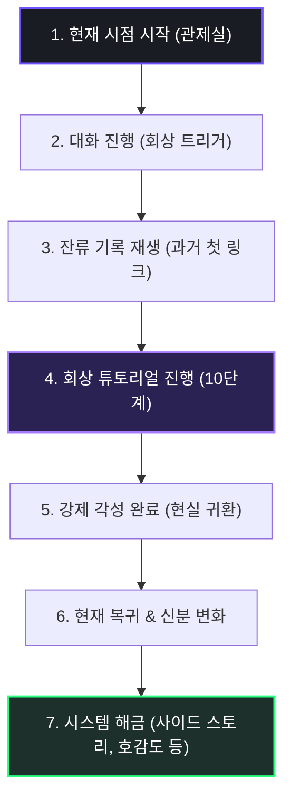

> [!WARNING]

> 본 문서는 검수 전 상태의 프롤로그 및 튜토리얼 시나리오 기획서이며, 송예찬 담당자의 검토 및 승인 대기 중인 수정 제안본입니다.

> v1.13에서는 사용자 피드백을 추가 반영하여 트리거 대사, 튜토리얼 스크립트, 복귀 시점 대사 전체를 플레이어가 듣고 직관적으로 이해하기 쉬운 구어체로 더욱 간결화하고 전문성과 자연스러움을 동시에 확보했습니다.

# 🎬 침몽도시: 루시드 다이버 (프롤로그 시나리오 기획 V1.13)

**프롤로그 시나리오 기획 V1.13 | 2026.06.17**

---

## 1. 프롤로그 서사 구조

프롤로그는 플레이어와 채린의 현재 시점 대화에서 출발하여 자연스럽게 과거 사건의 회상으로 이어지고, 튜토리얼 플레이를 거쳐 현재로 복귀하는 액자식 구성으로 진행된다.



### 1.1 현재 시점 시작

게임 타이틀 화면 이후, 로딩이 완료되면 즉시 어두운 관제실 모니터와 깜빡이는 홀로그램 UI가 페이드인된다.

*   **시스템 텍스트 연출**:

    ```text

    [SYSTEM] 국가소속 침몽도시 대응 기관 (NDMA)

    [SYSTEM] 루시드 링크 관제실 (LLCR-04)

    [SYSTEM] 관제자 등록명: 플레이어 (PLAYER)

    [SYSTEM] 메인 다이버: 채린 (CHAERIN)

    [SYSTEM] 링크 점검 준비 중... 파장 동조 개시.

    ```

*   **상황 설정**: 플레이어는 관제석에 앉아 채린과의 정기 링크 점검을 준비하고 있다. 통신 스피커를 통해 지직거리는 노이즈와 함께 채린의 건조한 목소리가 흘러나온다.

### 1.2 회상 트리거 대사 스크립트

두 사람의 사적인 대화가 깊어지며 과거의 기억을 강하게 이끌어낸다.

*   **채린**: "오늘 임무 나왔어?"

*   **플레이어**: "응, 청몽 외곽이야. 슬슬 준비하자."

*   **채린**: "...또 지옥행이네."

*   **플레이어**: "무리하지 마. 신호 이상하면 바로 끌어올릴 테니까."

*   **채린**: "됐어. 네가 뒤에 있을 땐 길 잃은 적 없으니까."

*   **플레이어**: "처음엔 내 목소리만 들려도 진저리 쳤으면서."

*   **채린**: "당연한 거 아냐? 모르는 목소리가 머릿속을 헤집는데 누가 좋아해?"

*   **플레이어**: "나도 마찬가지야. 네 시야가 내 머릿속에 강제로 동조되니까 엄청 어지러웠다고."

*   **채린**: "...그날 기억나? 우리 처음 연결됐던 날."

*   **플레이어**: "아..그 교차로?."

*   **채린**: "그래 그 곳, 진짜 딱 질색."

*   **플레이어**: "넌 다르게 불렀어?"

*   **채린**: "출구 없는 덫. 내 경고를 아무도 안 믿어줬던 날."

> 화면 전체에 디지털 노이즈가 강하게 발생하며, 적색 시스템 경고등과 함께 잔류 로그가 출력된다.

*   **시스템 로그**:

    ```text

    [WARNING] 동조율 급증으로 인한 과거 데이터 역류 발생.

    [SYSTEM] 잔류 기록 재생: 첫 번째 링크 (First Link)

    [SYSTEM] 대상 지대: 청몽 교차로 테스트 돔 (Test Dome 01)

    ```

*   **연출**: 화면이 화이트아웃되며 차가운 연구 시설과 보랏빛 균열이 뒤섞인 과거의 회상 튜토리얼 스테이지로 진입한다.

---

## 2. 회상 튜토리얼 (Tutorial Stage)

### 2.1 회상 속의 개연성

회상 시점에서 플레이어는 아직 정식 관제자가 아닌 **'루시드 사고 생존자이자 특이 반응자'** 신분이다. 채린 역시 정식 다이버가 아닌 실험 대상에 가깝다. 플레이어는 관제 UI를 보며 연구원들의 지시에 따라 채린을 돕는 '테스트' 형태로 튜토리얼을 진행한다. 이를 통해 플레이어는 자신의 능력을 깨닫고, 채린은 최초로 타인(플레이어)의 인도에 의해 생존하게 된다.

### 2.2 튜토리얼 진행 10단계 및 게임 기능

| 단계 | 장면 (Scenario Scenario) | 학습 및 해금되는 게임 기능 | UI 및 연출 가이드 |

| :---: | :--- | :--- | :--- |

| **1** | **연구 시설 링크 테스트** | 관제 UI 소개 | 기본 화면 구성 요소(체력, 싱크율, 미니맵) 학습 |

| **2** | **채린과의 첫 통신** | 대화 선택지 시스템 | 채린의 날 선 태도와 신뢰도 반응을 결정하는 대사 선택 |

| **3** | **청몽 교차로 진입** | 이동 튜토리얼 | 화면 가상 패드 또는 WASD를 이용한 기초 이동 및 카메라 조작 |

| **4** | **시야의 어긋남 인지** | 관제자 시야 보정 | 실제 지형과 가상 지도가 어긋난 지점을 찾아 터치 보정하여 길 개척 |

| **5** | **꿈식자 출현** | 전투 튜토리얼 | 적의 출현에 대응하여 기본 공격 및 회피 타이밍 학습 |

| **6** | **드림 포지드 불안정** | 출력 보정 및 에임 가이드 | 동조 주파수 보정을 가동하여 채린의 에임 보정(Passive)을 활성화하고 유탄(Active) 격발 유도 |

| **7** | **깨진 렌즈 조각 발견** | 심상기물 회수 | 꿈속에 고체화되어 흩어진 채린의 기억 조각(렌즈) 파밍 |

| **8** | **오염 수치 상승** | 제한 시간 및 위험도 안내 | 상단의 오염도 게이지가 차오르기 전에 서둘러야 함을 인지시킴 |

| **9** | **전화부스 도달** | 탈출 튜토리얼 | 탈출 지점인 공중전화부스에 도달하여 3초간 수화기 링크 유지 |

| **10** | **강제 각성 성공** | 익스트랙션 완료 | 붕괴하는 교차로에서 동조율을 최대로 끌어올려 현실로 강제 인양 |

### 2.3 회상 튜토리얼 단계별 대사 스크립트

튜토리얼 각 단계별로 출력되는 시스템 및 인물 간 대사 가이드라인이다.

#### [1단계: 연구 시설 링크 테스트]

*   **연구원**: "반응자 접속 확인. 동조율 고정. 채널 열린다. 테스트 돔의 신호를 따라가라."

*   **플레이어**: "윽... 머리 깨질 것 같네. 이 소리는 뭐야?"

*   **연구원**: "꿈속에서 발생하는 노이즈다. 딴생각 하지 말고 채린의 정신 주파수에 고정해."

#### [2단계: 채린과의 첫 통신 (대화 선택지)]

*   **채린**: "아윽...! 머리 쪼개질 거 같아... 누구야, 머릿속에서 시끄럽게 떠드는 놈이!"

*   **선택지 A [진정시키기]**: "진정해. 널 도우러 왔어. 날 믿어."

    *   *채린 A 반응*: "믿는다고? 웃기지 마. 다들 날 미친 사람 취급했으면서!"

*   **선택지 B [설명하기]**: "난 관제사야. 지금 네 신경망이 붕괴 직전이야. 내 지시에 집중해."

    *   *채린 B 반응*: "연구소 끄나풀이야? 날 실험체 취급하더니 머릿속까지 엿보시겠다? 어디 마음대로 해봐!"

#### [3단계: 청몽 교차로 진입]

*   **연구원**: "교신 성공. 채린을 진입시켜라. 링크 유지하면서 계속 전진시켜."

*   **플레이어**: "채린, 들려? 거기서 빠져나가야 해. 보라색 균열이 보이는 길로 가."

*   **채린**: "내 다리가 제멋대로 움직이는 것 같아... 기분 나쁜데, 일단은 가줄게."

#### [4단계: 시야의 어긋남 인지 (관제자 시야 보정)]

*   **채린**: "잠깐, 길이 끊겼어! 온통 낭떠러지라 더는 못 가!"

*   **플레이어**: "안개가 만든 환각이야. 내 지도엔 멀쩡해. 시야 동조를 보정할 테니까 나 믿고 가."

*   **채린**: "눈앞이 절벽인데 가라고? 제정신이야?!"

*   **플레이어**: "(시야 보정 집행) ...보정 끝났어. 다시 앞을 봐."

*   **채린**: "어...? 절벽이... 평지로 바뀌었잖아? 머릿속에서 뭘 건드린 거야?"

#### [5단계: 꿈식자 출현 (전투 튜토리얼)]

*   **채린**: "안개 속에서 괴물들이 기어 나와! 나더러 이 권총 하나로 다 잡으라고?!"

*   **플레이어**: "기본 에너지 권총이야. 일단 쏴봐. 제일 가까운 놈부터 처리해!"

*   **채린**: "하, 밑져야 본전이지! ...윽, 빗나갔잖아!"

*   **플레이어**: "당황하지 마. 일단 거리를 벌리면서 쏴!"

#### [6단계: 출력 보정 및 에임 가이드]

*   **채린**: "총이 너무 흔들려...! 조준선이 겹쳐 보여서 못 맞추겠어!"

*   **플레이어**: "뇌파 동조율 정렬 완료. 에임 보정 들어간다! (출력 보정 진행(패시브 스킬)) ...표적 고정됐어, 지금 쏴!"

*   **채린**: "좋아, 조준선이 딱 잡혔어! (정밀 사격 및 꿈식자 처치) ...맞았어. 이거 꽤 쓸 만하네."

#### [7단계: 깨진 렌즈 조각 발견 (심상기물 회수)]

*   **플레이어**: "처치 확인. 바닥에 반짝이는 유리 파편 주워. 네 파장이랑 동조하고 있어."

*   **채린**: "이건... 내 안경알 조각...? 왜 이런 게 꿈속에 굴러다녀?"

*   **플레이어**: "네 기억이 실체화된 거야. 돌아갈 때 필요하니까 잘 챙겨 둬."

#### [8단계: 오염 수치 상승]

*   **연구원**: "경고. 오염 수치 80% 돌파. 한계 도달까지 60초 남았다. 당장 탈출시켜!"

*   **플레이어**: "채린, 서둘러! 오염도가 너무 높아. 정신 잃으면 안 돼!"

*   **채린**: "머릿속이 흐려져... 사방에서 자꾸 이상한 소리가 들려..."

#### [9단계: 전화부스 도달 (탈출 튜토리얼)]

*   **플레이어**: "저기 주황색 공중전화부스 보이지? 저기가 탈출구야. 수화기를 들어!"

*   **채린**: "전화기...? 자꾸 내 안에서 전화 벨소리가 울려..."

*   **플레이어**: "수화기를 들어! 내 목소리에만 집중해. 뇌파 동조율 100% 맞춘다!"

#### [10단계: 강제 각성 성공 (익스트랙션 완료)]

*   **연구원**: "한계 초과! 뇌파 붕괴 5초 전! 링크 끊고 당장 강제 각성해!"

*   **플레이어**: "아직 안 돼, 정신 놔버리지 마! ...강제 각성 가동! 채린, 눈 떠!"

*   **채린**: "아... 목소리가... 점점 멀어져..."

*   **시스템**: `[SYSTEM] 강제 각성 승인. 다이버 신경 인양 완료.`

---

## 3. 현재 복귀 및 시스템 해금

### 3.1 현재 복귀 및 신분 변화

튜토리얼이 완료되면 다시 눈부신 백색 광원과 함께 현재 시점의 세련되고 조용한 관제실로 카메라가 복귀한다.

*   **현재 상태 데이터 동기화**:

    ```text

    [COMPLETED] 잔류 기록 재생 종료. 현실 동기화 완료.

    [PROFILE] 소속: 국가 침몽 대응 기관 (NDMA) 제4 특수 탐사 소대

    [PROFILE] 직책: 소대 지휘관 겸 전담 루시드 링크 관제자

    [PROFILE] 메인 다이버: 채린 (CHAERIN)

    [PROFILE] 현재 동조율: 71% (상태: 작전 대기 가능)

    [SYSTEM] 과거 기록 분석을 통해 일부 데이터 권한이 해금되었습니다.

    ```

*   **의의**: 회상 속 불안정했던 실험체와 반응자가 아니라, 이제 두 사람이 하나의 공식 탐사 소대로 묶여 서로를 신뢰하고 함께 팀을 키워나가는 정식 파트너 관계가 되었음을 시각적으로 보여준다.

### 3.2 현재 복귀 시점 대사 스크립트

현실로 복귀한 후 관제실에서 나누는 두 사람의 최종 결속 대사이다.

*   **플레이어**: "하아... 하아..." (이마의 땀을 닦으며 호흡을 가다듬는다)

*   **통신 스피커 (채린)**: "...내 목소리 들려? 수고했어. 첫 동조 데이터 재생해 보니까 기분 진짜 묘하네."

*   **플레이어**: "그러게. 그때는 날 엄청 싫어했었지."

*   **채린**: "지금도 딱히 널 다 믿는 건 아냐. ...그래도 이 소대에서만큼은 네 신호만 따라갈게."

*   **플레이어**: "고마워, 채린. 나도 끝까지 서포트할게."

*   **채린**: "내 길만 방해하지 마. 곧 실전 투입이니까, 지휘관답게 대원들 모집이나 해 둬."

*   **플레이어**: "알았어, 곧바로 소대원 충원을 준비할게." (화면이 메인 로비 UI로 연출되며 로비 대기 자세의 채린이 배치됨)

### 3.3 해금 시스템 상세 명세

프롤로그가 종료되는 즉시 로비 화면으로 전환되며, 아래의 핵심 시스템 해금 팝업이 순차적으로 발생한다.

```text

★ SYSTEM UNLOCKED ★

- 채린 사이드 스토리: '불신의 몽흔' 개방

- 채린 호감도 시스템 활성화

- 개인 심상 기록 보관소 오픈

```

#### ① 채린 사이드 스토리 (불신의 몽흔)

*   **설명**: 채린이 가진 트라우마와 불신의 원인을 추적하는 외전 시나리오.

*   **기능**: 메인 스토리 진행 및 특정 몽유물 회수를 통해 에피소드가 열리며, 클리어 시 채린의 능력치가 상승한다.

#### ② 호감도 시스템

*   **설명**: 관제사(플레이어)와 다이버(채린) 간의 유대 강도를 나타내는 수치.

*   **기능**: 로비 대화 선택지, 선물하기, 임무 동행 등을 통해 호감도 포인트를 획득하며, 단계별로 로비 보이스 및 비밀 프로필이 해금된다.

#### ③ 개인 심상 기록 (관찰 로그)

*   **설명**: 제3자(NDMA 수석 연구원, 현장 구조대원, 동료 관제사 등)의 관점에서 채린의 행적, 특화 심상무장의 운용 방식, 침식체 대응 행동, 타인을 대하는 태도(경계심 및 독단적 성향) 등을 기록해 놓은 극비 보고서 데이터베이스.

*   **기능**: 플레이어는 침몽도시 탐사 중 획득한 '파손된 오디오 로그', '관찰 일지 파편' 등의 특수 기물을 획득하여 기록을 해금한다. 열람을 통해 채린의 고유 능력 기원과 트라우마에 대한 제3자의 객관적 분석(그녀의 의심이 실제 공간 왜곡을 어떻게 감지했는지 등)을 수집하고 입체적으로 분석하는 추리형 정보 수집 콘텐츠 역할을 한다.

#### ④ 로비 대화 & 몽흔 정보

*   **설명**: 관제실 로비에 상주하는 채린과 터치 및 일상 대화가 가능해지며, 그녀의 프리즘/유리 속성에 따른 '몽흔 정보' 도감이 개방된다.

---

## 📜 Revision History

| 날짜 | 버전 | 내용 | 작성자 |

| :---: | :---: | :--- | :---: |

| 2026.06.12 | v1.00 | 최초 시나리오 문서 기안 및 등록 | 김남해 |

| 2026.06.17 | v1.11 | - 현재 관제실 ➡️ 과거 회상 튜토리얼 ➡️ 현재 복귀 및 시스템 해금의 오프닝 구조 확립<br>- 튜토리얼 10단계 및 연동 게임 기능 기획 수록<br>- 제4 특수 탐사 소대 공식 전담 편제에 맞춘 복귀 데이터 표기 보정<br>- 사용자 피드백 반영: 싱크 보정 미니게임 삭제 및 단순 출력 보정 프로세스로 변경<br>- 채린의 주무기를 유탄발사기 부착 소총으로 변경함에 따라 튜토리얼 5단계 대사 수정<br>- 사용자 피드백 반영: 튜토리얼 6단계 출력 보정을 에임 보정(패시브) 활성화 및 유탄 발사(액티브) 트리거로 변경 및 대사 개정<br>- 사용자 피드백 반영: 전용 심상무장 명칭을 특화 심상무장으로 변경 | 송예찬 |

| 2026.06.17 | v1.12 | - 사용자 피드백 반영: 프롤로그 및 튜토리얼 내 모든 대사 간결화 및 직관적 순화 | 송예찬 |

| 2026.06.17 | v1.13 | - 사용자 피드백 반영: 대사 스크립트(트리거, 튜토리얼, 복귀 대사)를 한 번 더 구어체와 직관적인 언어로 간결화하여 다듬음 | 송예찬 |
